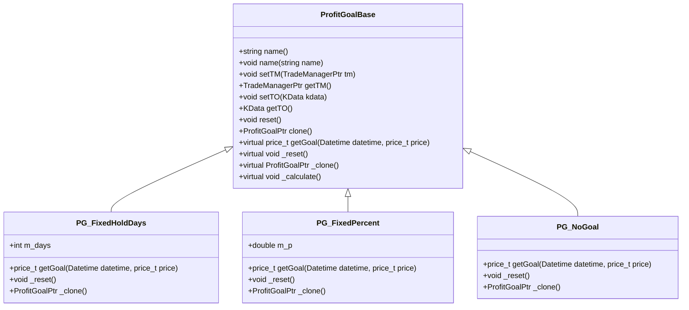

# 盈利目标

<cite>
**本文档中引用的文件**
- [ProfitGoalBase.h](file://hikyuu_cpp/hikyuu/trade_sys/profitgoal/ProfitGoalBase.h)
- [PG_FixedHoldDays.h](file://hikyuu_cpp/hikyuu/trade_sys/profitgoal/crt/PG_FixedHoldDays.h)
- [PG_FixedPercent.h](file://hikyuu_cpp/hikyuu/trade_sys/profitgoal/crt/PG_FixedPercent.h)
- [PG_NoGoal.h](file://hikyuu_cpp/hikyuu/trade_sys/profitgoal/crt/PG_NoGoal.h)
- [ProfitGoal.py](file://hikyuu/test/ProfitGoal.py)
</cite>

## 目录
1. [简介](#简介)
2. [盈利目标模块概述](#盈利目标模块概述)
3. [核心组件分析](#核心组件分析)
4. [策略实现机制](#策略实现机制)
5. [配置与自动化示例](#配置与自动化示例)
6. [结论](#结论)

## 简介
盈利目标模块是Hikyuu量化交易系统中用于设定主动平仓目标的重要组成部分。该模块作为交易系统退出策略的一部分，通过预设的盈利目标来指导系统在达到预期收益时执行卖出操作，从而实现风险控制和收益锁定。

## 盈利目标模块概述

盈利目标模块为交易系统提供了一套灵活的退出机制，允许用户根据不同的投资策略设定相应的盈利目标。这些目标可以是固定的百分比收益、特定的持有天数或其他自定义条件。当市场价格达到预设的盈利目标时，系统将自动触发卖出指令，完成仓位的主动平仓。

该模块的设计遵循面向对象的原则，通过基类和派生类的方式实现了多种盈利目标策略。所有盈利目标策略都继承自`ProfitGoalBase`基类，并实现了统一的接口规范，确保了策略的一致性和可扩展性。

**模块来源**
- [ProfitGoalBase.h](file://hikyuu_cpp/hikyuu/trade_sys/profitgoal/ProfitGoalBase.h#L1-L194)

## 核心组件分析

### ProfitGoalBase 基类

`ProfitGoalBase`是所有盈利目标策略的抽象基类，定义了盈利目标策略的基本结构和行为规范。该基类提供了以下关键功能：

- **名称管理**：通过`name()`和`name(const string& name)`方法实现策略名称的获取和设置。
- **账户关联**：使用`setTM()`和`getTM()`方法将盈利目标策略与交易管理器关联。
- **交易对象设置**：通过`setTO()`和`getTO()`方法指定策略作用的K线数据。
- **复位机制**：`reset()`方法用于重置策略状态，`_reset()`为子类提供的虚函数接口。
- **克隆接口**：`clone()`公共方法调用子类实现的`_clone()`虚函数，支持策略实例的复制。
- **目标价格计算**：纯虚函数`getGoal()`必须由子类实现，用于计算当前时间点的目标价格。

基类还包含了序列化支持，允许策略对象的持久化存储。此外，通过`buyNotify()`和`sellNotify()`方法接收交易变化通知，使策略能够根据实际交易情况进行调整。



**图表来源**
- [ProfitGoalBase.h](file://hikyuu_cpp/hikyuu/trade_sys/profitgoal/ProfitGoalBase.h#L18-L194)
- [PG_FixedHoldDays.h](file://hikyuu_cpp/hikyuu/trade_sys/profitgoal/crt/PG_FixedHoldDays.h#L1-L27)
- [PG_FixedPercent.h](file://hikyuu_cpp/hikyuu/trade_sys/profitgoal/crt/PG_FixedPercent.h#L1-L26)
- [PG_NoGoal.h](file://hikyuu_cpp/hikyuu/trade_sys/profitgoal/crt/PG_NoGoal.h#L1-L25)

**章节来源**
- [ProfitGoalBase.h](file://hikyuu_cpp/hikyuu/trade_sys/profitgoal/ProfitGoalBase.h#L18-L194)

## 策略实现机制

### PG_FixedHoldDays（固定持有天数）

`PG_FixedHoldDays`策略实现了基于固定交易日数的盈利目标。该策略允许用户设定一个最大持仓天数，当持仓时间达到预设天数时，系统将触发卖出操作。

**参数说明**：
- `days`：允许的持仓天数，默认值为5个交易日。

该策略通过记录买入时间，并在每个交易周期检查当前时间与买入时间的差值来判断是否达到预设的持有期限。一旦达到指定天数，`getGoal()`方法将返回0，指示系统执行卖出操作。

**章节来源**
- [PG_FixedHoldDays.h](file://hikyuu_cpp/hikyuu/trade_sys/profitgoal/crt/PG_FixedHoldDays.h#L16-L22)

### PG_FixedPercent（固定盈利百分比）

`PG_FixedPercent`策略实现了基于固定收益率的盈利目标。该策略根据买入价格和预设的收益率计算目标卖出价格。

**参数说明**：
- `p`：目标收益率，以小数形式表示，默认值为0.2（即20%）。

目标价格的计算公式为：`目标价格 = 买入价格 × (1 + p)`。当市场价格达到或超过此目标价格时，系统将执行卖出操作以锁定收益。

**章节来源**
- [PG_FixedPercent.h](file://hikyuu_cpp/hikyuu/trade_sys/profitgoal/crt/PG_FixedPercent.h#L16-L21)

### PG_NoGoal（无明确目标）

`PG_NoGoal`策略表示不设置任何盈利目标，通常用于测试或对比分析。该策略的`getGoal()`方法始终返回Null值，意味着不会因为达到盈利目标而触发卖出操作。

这种策略适用于那些完全依赖其他退出机制（如止损策略或信号系统）的交易系统，或者在进行策略性能基准测试时作为对照组使用。

**章节来源**
- [PG_NoGoal.h](file://hikyuu_cpp/hikyuu/trade_sys/profitgoal/crt/PG_NoGoal.h#L16-L20)

## 配置与自动化示例

以下是配置盈利目标策略以实现策略自动化退出的代码示例：

```python
# 创建固定持有天数策略，设定持有期限为10个交易日
pg_fixed_days = PG_FixedHoldDays(days=10)

# 创建固定盈利百分比策略，设定目标收益率为15%
pg_fixed_percent = PG_FixedPercent(p=0.15)

# 创建无盈利目标策略（用于对比测试）
pg_no_goal = PG_NoGoal()

# 将盈利目标策略应用于交易系统
system.setProfitGoal(pg_fixed_percent)

# 在策略中动态调整盈利目标参数
def dynamic_profit_goal(self, datetime, price):
    # 根据市场波动性动态调整目标收益率
    volatility = self.indicators['ATR'].get(datetime)
    if volatility > threshold:
        return price * 1.10  # 高波动时降低目标至10%
    else:
        return price * 1.25  # 低波动时提高目标至25%

# 使用自定义盈利目标函数
custom_pg = crtPG(dynamic_profit_goal, params={'threshold': 2.0}, name="DynamicProfitGoal")
```

上述示例展示了如何创建不同类型的盈利目标策略并将其集成到交易系统中。通过合理配置这些策略，可以有效实现交易系统的自动化退出机制，提高投资组合的风险收益比。

**章节来源**
- [ProfitGoal.py](file://hikyuu/test/ProfitGoal.py#L15-L35)

## 结论
盈利目标模块为Hikyuu交易系统提供了强大的退出策略支持。通过`ProfitGoalBase`基类和多种具体实现策略，用户可以根据不同的投资需求灵活配置盈利目标。无论是追求固定收益的保守策略，还是基于时间维度的持仓管理，亦或是完全依赖其他信号的复杂策略，该模块都能提供相应的解决方案。合理运用这些盈利目标策略，有助于构建更加稳健和高效的量化交易系统。