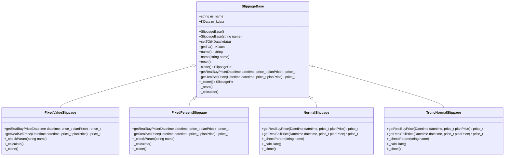

# 移滑价差模型

<cite>
**本文档引用的文件**  
- [SlippageBase.h](file://hikyuu_cpp/hikyuu/trade_sys/slippage/SlippageBase.h)
- [FixedValueSlippage.cpp](file://hikyuu_cpp/hikyuu/trade_sys/slippage/imp/FixedValueSlippage.cpp)
- [FixedPercentSlippage.cpp](file://hikyuu_cpp/hikyuu/trade_sys/slippage/imp/FixedPercentSlippage.cpp)
- [NormalSlippage.cpp](file://hikyuu_cpp/hikyuu/trade_sys/slippage/imp/NormalSlippage.cpp)
- [TruncNormalSlippage.cpp](file://hikyuu_cpp/hikyuu/trade_sys/slippage/imp/TruncNormalSlippage.cpp)
- [SP_FixedValue.h](file://hikyuu_cpp/hikyuu/trade_sys/slippage/crt/SP_FixedValue.h)
- [SP_FixedPercent.h](file://hikyuu_cpp/hikyuu/trade_sys/slippage/crt/SP_FixedPercent.h)
- [SP_Normal.h](file://hikyuu_cpp/hikyuu/trade_sys/slippage/crt/SP_Normal.h)
- [SP_TruncNormal.h](file://hikyuu_cpp/hikyuu/trade_sys/slippage/crt/SP_TruncNormal.h)
- [test_SP_Normal.cpp](file://hikyuu_cpp/unit_test/hikyuu/trade_sys/slippage/test_SP_Normal.cpp)
- [test_SP_TruncNormal.cpp](file://hikyuu_cpp/unit_test/hikyuu/trade_sys/slippage/test_SP_TruncNormal.cpp)
</cite>

## 目录
1. [引言](#引言)
2. [移滑价差模型的重要性](#移滑价差模型的重要性)
3. [SlippageBase基类](#slippagebase基类)
4. [固定值移滑价差模型（SP_FixedValue）](#固定值移滑价差模型sp_fixedvalue)
5. [固定百分比移滑价差模型（SP_FixedPercent）](#固定百分比移滑价差模型sp_fixedpercent)
6. [正态分布移滑价差模型（SP_Normal）](#正态分布移滑价差模型sp_normal)
7. [截断正态分布移滑价差模型（SP_TruncNormal）](#截断正态分布移滑价差模型sp_truncnormal)
8. [回测配置中的应用示例](#回测配置中的应用示例)
9. [对策略绩效评估的影响](#对策略绩效评估的影响)

## 引言
移滑价差（Slippage）是量化交易回测中一个关键的概念，它模拟了实际交易中执行价格与预期价格之间的差异。在理想情况下，交易者希望以计划价格成交，但在真实市场环境中，由于市场流动性、订单执行延迟等因素，实际成交价格往往与预期价格存在偏差。这种偏差在回测中必须被合理模拟，以提高回测结果的真实性，避免产生过于乐观的策略绩效评估。

Hikyuu量化框架提供了一套完整的移滑价差模型体系，允许用户根据不同的市场假设和交易策略选择合适的模型。本文档将详细介绍Hikyuu中的移滑价差模型，包括其基类设计和具体的实现模型。

## 移滑价差模型的重要性
在回测中忽略移滑价差会导致严重的“过拟合”问题。一个在回测中表现优异的策略，可能在实盘交易中因为无法以理想价格成交而表现糟糕。通过引入移滑价差模型，可以更真实地模拟交易成本和市场冲击，从而：

1. **提高回测的真实性**：使回测结果更接近实盘表现。
2. **评估策略的鲁棒性**：检验策略在不利成交价格下的盈利能力。
3. **优化交易参数**：帮助确定最优的交易规模和执行时机。
4. **风险管理**：更准确地估计潜在的交易成本和最大回撤。

因此，选择合适的移滑价差模型是构建可靠量化策略不可或缺的一环。

## SlippageBase基类
所有移滑价差模型都继承自`SlippageBase`基类，该基类定义了移滑价差算法的核心接口和通用功能。



**图示来源**
- [SlippageBase.h](file://hikyuu_cpp/hikyuu/trade_sys/slippage/SlippageBase.h#L15-L149)
- [FixedValueSlippage.cpp](file://hikyuu_cpp/hikyuu/trade_sys/slippage/imp/FixedValueSlippage.cpp#L16-L42)
- [FixedPercentSlippage.cpp](file://hikyuu_cpp/hikyuu/trade_sys/slippage/imp/FixedPercentSlippage.cpp#L16-L42)
- [NormalSlippage.cpp](file://hikyuu_cpp/hikyuu/trade_sys/slippage/imp/NormalSlippage.cpp#L20-L59)
- [TruncNormalSlippage.cpp](file://hikyuu_cpp/hikyuu/trade_sys/slippage/imp/TruncNormalSlippage.cpp#L20-L91)

**核心方法**：
- `getRealBuyPrice`：计算实际买入价格的纯虚函数，子类必须实现。
- `getRealSellPrice`：计算实际卖出价格的纯虚函数，子类必须实现。
- `setTO`：设置交易对象（KData），用于获取交易相关的市场数据。
- `reset`：复位操作，通常用于重置内部状态。
- `_calculate`：子类计算接口，由`setTO`调用，用于在设置交易对象后进行预计算。

**核心属性**：
- `m_name`：模型的名称，用于标识不同的移滑价差模型。
- `m_kdata`：关联的K线数据，为模型提供市场信息。

## 固定值移滑价差模型（SP_FixedValue）
`SP_FixedValue`模型假设移滑价差是一个固定的金额。

### 模型假设
- 无论交易价格高低，移滑价差都是一个恒定的数值。
- 买入时，实际价格等于计划价格加上固定值。
- 卖出时，实际价格等于计划价格减去固定值。
- 该模型适用于价格水平相对稳定的市场，或者作为最简单的保守估计。

### 参数
- `value` (double, 默认值: 0.01): 表示移滑价差的固定金额。参数值必须大于等于0.0。

### 实现
```cpp
price_t FixedValueSlippage::getRealBuyPrice(const Datetime& datetime, price_t price) {
    return price + getParam<double>("value");
}

price_t FixedValueSlippage::getRealSellPrice(const Datetime& datetime, price_t price) {
    return price - getParam<double>("value");
}
```

**代码来源**
- [FixedValueSlippage.cpp](file://hikyuu_cpp/hikyuu/trade_sys/slippage/imp/FixedValueSlippage.cpp#L28-L33)
- [SP_FixedValue.h](file://hikyuu_cpp/hikyuu/trade_sys/slippage/crt/SP_FixedValue.h#L16-L22)

## 固定百分比移滑价差模型（SP_FixedPercent）
`SP_FixedPercent`模型假设移滑价差是计划价格的一个固定百分比。

### 模型假设
- 移滑价差与交易价格成正比。价格越高，移滑价差的绝对值越大。
- 买入时，实际价格等于计划价格乘以(1 + p)。
- 卖出时，实际价格等于计划价格乘以(1 - p)。
- 该模型考虑了价格水平对移滑价差的影响，比固定值模型更符合一些市场的实际情况。

### 参数
- `p` (double, 默认值: 0.001): 表示移滑价差的固定百分比。参数值必须在[0.0, 1.0)范围内。

### 实现
```cpp
price_t FixedPercentSlippage::getRealBuyPrice(const Datetime& datetime, price_t price) {
    return price * (1 + getParam<double>("p"));
}

price_t FixedPercentSlippage::getRealSellPrice(const Datetime& datetime, price_t price) {
    return price * (1 - getParam<double>("p"));
}
```

**代码来源**
- [FixedPercentSlippage.cpp](file://hikyuu_cpp/hikyuu/trade_sys/slippage/imp/FixedPercentSlippage.cpp#L29-L34)
- [SP_FixedPercent.h](file://hikyuu_cpp/hikyuu/trade_sys/slippage/crt/SP_FixedPercent.h#L16-L22)

## 正态分布移滑价差模型（SP_Normal）
`SP_Normal`模型使用正态分布来模拟随机的移滑价差。

### 模型假设
- 移滑价差是随机的，并且服从正态分布。
- 买入时，实际价格总是高于计划价格（不利方向），偏移量为正态分布随机数的绝对值。
- 卖出时，实际价格总是低于计划价格（不利方向），偏移量为正态分布随机数的绝对值。
- 该模型引入了随机性，可以模拟市场波动和不确定性。

### 参数
- `mean` (double, 默认值: 0.0): 正态分布的均值。
- `stddev` (double, 默认值: 0.05): 正态分布的标准差。参数值必须大于等于0.0。

### 实现
```cpp
price_t NormalSlippage::getRealBuyPrice(const Datetime& datetime, price_t price) {
    double mean = getParam<double>("mean");
    double stddev = getParam<double>("stddev");
    std::normal_distribution<double> dis(mean, stddev);
    double value = dis(ms_gen);
    return price + std::abs(value); // 确保价格向不利方向移动
}
```

**代码来源**
- [NormalSlippage.cpp](file://hikyuu_cpp/hikyuu/trade_sys/slippage/imp/NormalSlippage.cpp#L33-L40)
- [SP_Normal.h](file://hikyuu_cpp/hikyuu/trade_sys/slippage/crt/SP_Normal.h#L14-L20)

## 截断正态分布移滑价差模型（SP_TruncNormal）
`SP_TruncNormal`模型是`SP_Normal`的改进版，使用截断正态分布来限制移滑价差的范围。

### 模型假设
- 移滑价差是随机的，服从正态分布，但其取值被限制在一个指定的区间内。
- 买入和卖出时，价格同样向不利方向移动。
- 通过设置`min_value`和`max_value`，可以防止产生极端的、不现实的移滑价差。

### 参数
- `mean` (double, 默认值: 0.0): 正态分布的均值。
- `stddev` (double, 默认值: 0.05): 正态分布的标准差。参数值必须大于等于0.0。
- `min_value` (double, 默认值: -0.1): 截断区间的最小值。
- `max_value` (double, 默认值: 0.1): 截断区间的最大值。必须满足`min_value <= max_value`。

### 实现
```cpp
price_t TruncNormalSlippage::getRealBuyPrice(const Datetime& datetime, price_t price) {
    double mean = getParam<double>("mean");
    double stddev = getParam<double>("stddev");
    double min_v = getParam<double>("min_value");
    double max_v = getParam<double>("max_value");
    std::normal_distribution<double> dis(mean, stddev);
    double value;
    do {
        value = dis(ms_gen);
    } while (value < min_v || value > max_v); // 确保值在截断范围内
    return price + std::abs(value);
}
```

**代码来源**
- [TruncNormalSlippage.cpp](file://hikyuu_cpp/hikyuu/trade_sys/slippage/imp/TruncNormalSlippage.cpp#L47-L62)
- [SP_TruncNormal.h](file://hikyuu_cpp/hikyuu/trade_sys/slippage/crt/SP_TruncNormal.h#L14-L23)

## 回测配置中的应用示例
在Hikyuu的回测配置中，可以通过调用相应的工厂函数来创建并应用不同的移滑价差模型。

### Python代码示例
```python
from hikyuu import *

# 创建一个简单的交易系统
sys = SYS_Simple()

# 应用不同的移滑价差模型

# 1. 使用固定值模型，移滑价差为0.02元
sp_fixed_value = SP_FixedValue(0.02)
sys.setSP(sp_fixed_value)

# 2. 使用固定百分比模型，移滑价差为0.1%
sp_fixed_percent = SP_FixedPercent(0.001)
sys.setSP(sp_fixed_percent)

# 3. 使用正态分布模型，均值为0，标准差为0.03
sp_normal = SP_Normal(0.0, 0.03)
sys.setSP(sp_normal)

# 4. 使用截断正态分布模型，限制移滑价差在-0.05到0.05之间
sp_trunc_normal = SP_TruncNormal(0.0, 0.04, -0.05, 0.05)
sys.setSP(sp_trunc_normal)

# 运行回测...
```

**代码来源**
- [SP_FixedValue.h](file://hikyuu_cpp/hikyuu/trade_sys/slippage/crt/SP_FixedValue.h#L22)
- [SP_FixedPercent.h](file://hikyuu_cpp/hikyuu/trade_sys/slippage/crt/SP_FixedPercent.h#L22)
- [SP_Normal.h](file://hikyuu_cpp/hikyuu/trade_sys/slippage/crt/SP_Normal.h#L20)
- [SP_TruncNormal.h](file://hikyuu_cpp/hikyuu/trade_sys/slippage/crt/SP_TruncNormal.h#L22)

## 对策略绩效评估的影响
选择不同的移滑价差模型会显著影响策略的绩效评估结果：

1. **固定值模型**：对低价股的影响更大，可能导致对低价股策略的绩效评估过于悲观。
2. **固定百分比模型**：对高价股的影响更大，能更公平地比较不同价格水平股票的策略表现。
3. **正态分布模型**：引入了随机性，单次回测结果可能波动较大。通常需要进行多次蒙特卡洛模拟，取平均值作为最终评估结果，这能更好地反映策略的稳健性。
4. **截断正态分布模型**：在保留随机性的同时，避免了极端情况，评估结果可能更符合实际。

通过对比使用不同移滑价差模型的回测结果，可以评估策略对交易成本的敏感度。一个在多种移滑价差假设下都能保持盈利的策略，通常被认为更具实盘价值。