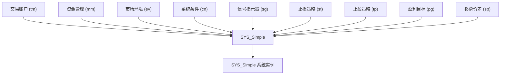
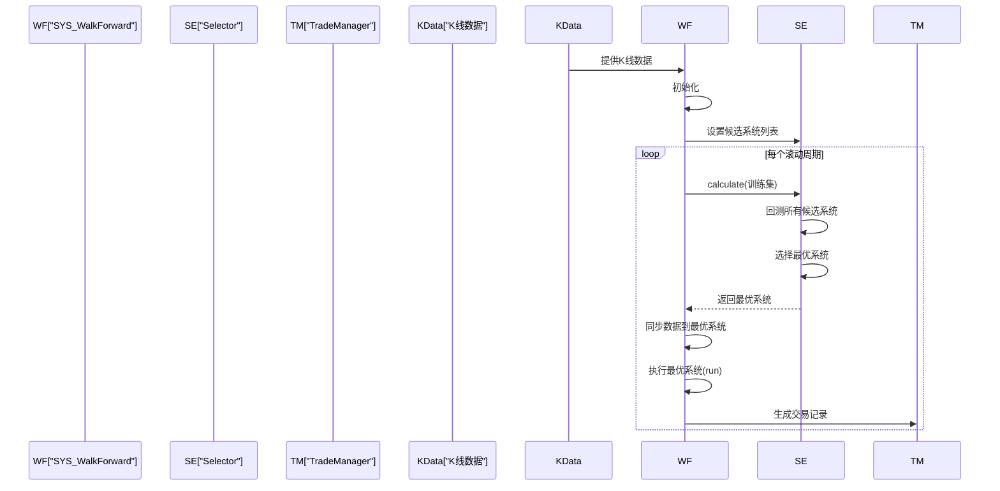
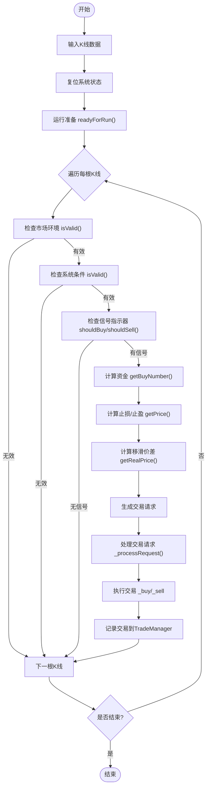

# 系统组装与执行

<cite>
**本文档引用的文件**
- [SYS_Simple.h](file://hikyuu_cpp/hikyuu/trade_sys/system/crt/SYS_Simple.h)
- [SYS_Simple.cpp](file://hikyuu_cpp/hikyuu/trade_sys/system/imp/SYS_Simple.cpp)
- [SYS_WalkForward.h](file://hikyuu_cpp/hikyuu/trade_sys/system/crt/SYS_WalkForward.h)
- [WalkForwardSystem.cpp](file://hikyuu_cpp/hikyuu/trade_sys/system/imp/WalkForwardSystem.cpp)
- [System.h](file://hikyuu_cpp/hikyuu/trade_sys/system/System.h)
- [System.cpp](file://hikyuu_cpp/hikyuu/trade_sys/system/System.cpp)
- [__init__.py](file://hikyuu/trade_sys/__init__.py)
</cite>

## 目录
1. [引言](#引言)
2. [交易系统核心组件](#交易系统核心组件)
3. [系统组装机制](#系统组装机制)
4. [系统类型分析](#系统类型分析)
5. [执行流程详解](#执行流程详解)
6. [Python代码示例](#python代码示例)
7. [结论](#结论)

## 引言
本文档详细阐述了Hikyuu量化交易框架中交易系统的组装与执行流程。交易系统（System）是量化交易策略的核心，它通过将市场环境、信号指示器、止损/止盈、资金管理等独立部件有机组合，形成一个完整的、可执行的交易决策引擎。本文将深入分析系统组装的机制，对比不同系统类型的特点，并详细解释交易系统的执行循环。

## 交易系统核心组件
一个完整的交易系统由多个独立的策略部件构成，这些部件共同决定了交易决策的生成。主要核心组件包括：

- **市场环境 (Environment)**: 判断当前市场是否适合交易，例如判断市场趋势是牛市还是熊市。
- **系统条件 (Condition)**: 定义系统启动和运行的基本条件，例如资金充足、风险可控等。
- **信号指示器 (Signal)**: 核心的交易信号生成器，根据技术指标或算法产生买入或卖出信号。
- **资金管理 (MoneyManager)**: 决定每次交易的资金量，实现风险控制和仓位管理。
- **止损/止盈 (Stoploss)**: 在亏损达到预设阈值时卖出以限制损失，或在盈利达到目标时卖出以锁定利润。
- **盈利目标 (ProfitGoal)**: 设定交易的盈利目标价格。
- **移滑价差 (Slippage)**: 模拟实际交易中成交价与预期价格之间的偏差。
- **交易账户 (TradeManager)**: 管理交易账户的资产、持仓和交易记录。

这些组件通过交易系统（System）进行集成和协调，共同完成从数据输入到交易指令输出的全过程。

**Section sources**
- [System.h](file://hikyuu_cpp/hikyuu/trade_sys/system/System.h#L35-L439)

## 系统组装机制
交易系统的组装是通过工厂函数（Factory Function）实现的，这些函数负责创建并配置一个完整的系统实例。组装过程的核心是将各个独立的策略部件作为参数注入到系统中。

### SYS_Simple 组装
`SYS_Simple` 是最基础的系统组装函数，它直接接收所有核心组件作为参数，并将它们组合成一个简单的交易系统。



**Diagram sources**
- [SYS_Simple.h](file://hikyuu_cpp/hikyuu/trade_sys/system/crt/SYS_Simple.h#L41-L46)
- [SYS_Simple.cpp](file://hikyuu_cpp/hikyuu/trade_sys/system/imp/SYS_Simple.cpp#L12-L16)

### 组件注入与参数传递
在 `SYS_Simple` 的实现中，所有传入的组件（如 `tm`, `mm`, `sg` 等）都会被直接赋值给系统内部的对应成员变量。系统还支持通过参数（Parameter）机制进行配置，例如是否启用延迟执行、是否允许融资融券等。这些参数可以在系统运行前进行设置，从而改变系统的运行行为。

**Section sources**
- [SYS_Simple.h](file://hikyuu_cpp/hikyuu/trade_sys/system/crt/SYS_Simple.h#L16-L46)
- [SYS_Simple.cpp](file://hikyuu_cpp/hikyuu/trade_sys/system/imp/SYS_Simple.cpp#L12-L16)

## 系统类型分析
Hikyuu框架提供了不同类型的交易系统，以适应不同的策略需求。本文以 `SYS_Simple` 和 `SYS_WalkForward` 为例进行分析。

### SYS_Simple 系统
`SYS_Simple` 是一个基础的、静态的交易系统。它的特点是：
- **结构简单**: 直接由用户指定的所有策略部件构成。
- **参数固定**: 一旦系统创建，其内部的策略和参数在运行期间通常是固定的（除非在运行时动态修改）。
- **直接执行**: 系统按照预设的逻辑，对输入的K线数据逐根进行处理，生成交易信号。
- **适用场景**: 适用于策略逻辑清晰、不需要在运行时动态调整的回测和实盘场景。

### SYS_WalkForward 系统
`SYS_WalkForward` 是一个更高级的、动态的交易系统，它实现了“向前滚动”（Walk-Forward）优化策略。其核心特点是：
- **候选系统列表**: 它不直接包含具体的策略部件，而是持有一个候选系统列表（`candidate_sys_list`）。
- **选择器 (Selector)**: 内置一个选择器（`SelectorPtr`），用于在每个滚动周期内，根据预设的性能指标（如最大资金、夏普比率等）从候选列表中选出最优的系统。
- **滚动训练与测试**: 系统将历史数据划分为多个训练集和测试集，在每个测试周期开始前，使用之前的训练集对所有候选系统进行回测，并选择表现最好的系统来执行该周期的交易。
- **动态切换**: 在不同的时间周期内，实际执行的交易系统可能会发生变化，从而适应市场环境的变化。
- **适用场景**: 适用于需要定期优化和调整策略参数的复杂策略，能够有效避免过度拟合，提高策略的鲁棒性。



**Diagram sources**
- [SYS_WalkForward.h](file://hikyuu_cpp/hikyuu/trade_sys/system/crt/SYS_WalkForward.h#L15-L19)
- [WalkForwardSystem.cpp](file://hikyuu_cpp/hikyuu/trade_sys/system/imp/WalkForwardSystem.cpp#L174-L263)

## 执行流程详解
交易系统的执行是一个循环过程，从接收行情数据开始，到发出交易请求结束。其核心流程如下：

1.  **数据输入**: 系统接收指定证券（Stock）在特定时间段（KQuery）内的K线数据（KData）。
2.  **初始化与复位**: 在执行前，系统会根据配置决定是否进行复位（reset），以清除上一次运行的状态。
3.  **运行准备 (readyForRun)**: 进行必要的准备工作，例如检查参数有效性、初始化内部状态等。
4.  **逐根K线处理**: 系统遍历每根K线数据，执行以下逻辑：
    a.  **环境与条件判断**: 检查当前市场环境（EV）和系统条件（CN）是否有效。
    b.  **信号生成**: 如果环境和条件都有效，则调用信号指示器（SG）判断是否产生买入或卖出信号。
    c.  **资金计算**: 如果有信号，调用资金管理器（MM）计算本次交易的数量。
    d.  **止损/止盈计算**: 计算当前的止损价和止盈价。
    e.  **移滑价差调整**: 根据移滑价差模型，调整预期的成交价格。
    f.  **生成交易请求**: 将计算出的价格、数量、止损价、止盈价等信息封装成交易请求（TradeRequest）。
5.  **执行交易请求**: 根据系统配置（如`buy_delay`），交易请求可能立即执行，也可能延迟到下一个交易时段（如下一个开盘）执行。
6.  **记录与同步**: 将实际发生的交易记录保存到交易账户（TM）中，并更新系统内部状态。



**Diagram sources**
- [System.cpp](file://hikyuu_cpp/hikyuu/trade_sys/system/System.cpp#L382-L419)
- [System.h](file://hikyuu_cpp/hikyuu/trade_sys/system/System.h#L214-L221)

## Python代码示例
以下是一个使用Hikyuu Python接口组装和运行交易系统的完整示例。

```python
# -*- coding: utf8 -*-
from hikyuu import *

# 1. 获取股票和K线数据
stock = sm['sh000001']
query = Query(-150)
kdata = stock.get_kdata(query)

# 2. 创建并配置各个策略部件
# 假设已定义了具体的策略类 MyCondition, MySignal, MyMoneyManager, MyStoploss
condition = MyCondition()
signal = MySignal()
money_manager = MyMoneyManager()
stoploss = MyStoploss()

# 3. 创建交易账户
tm = crtTM(init_cash=100000, datetime=kdata[0].datetime)

# 4. 使用工厂函数组装交易系统
system = SYS_Simple(
    tm=tm,
    mm=money_manager,
    cn=condition,
    sg=signal,
    st=stoploss,
    name="MyTradingSystem"
)

# 5. 运行交易系统
system.run(kdata)

# 6. 获取并分析结果
trade_list = system.get_trade_list()
print(f"总交易次数: {len(trade_list)}")
print(f"最终现金: {tm.get_current_cash()}")
```

**Section sources**
- [__init__.py](file://hikyuu/trade_sys/__init__.py)

## 结论
Hikyuu框架通过模块化的设计，将复杂的交易策略分解为独立的、可复用的组件。通过工厂函数（如`SYS_Simple`和`SYS_WalkForward`），用户可以灵活地将这些组件组装成不同类型的交易系统。系统的执行流程清晰，从数据输入到交易请求输出，每一步都经过精心设计。这种设计不仅提高了代码的可维护性和可扩展性，也为用户构建和测试复杂的量化策略提供了强大的支持。