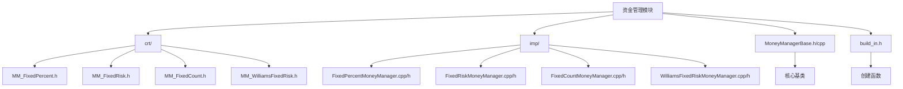
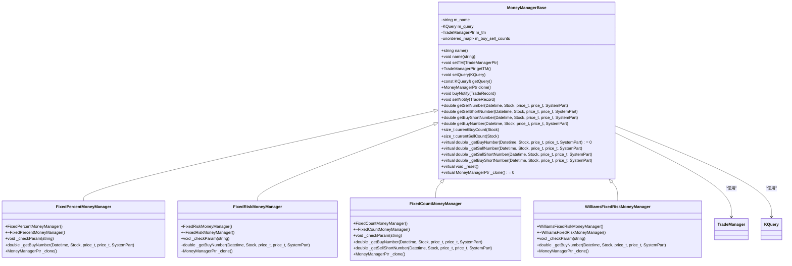
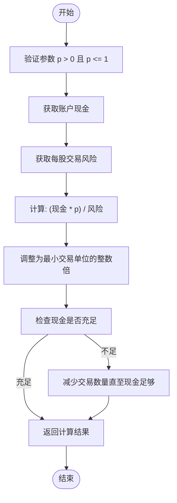
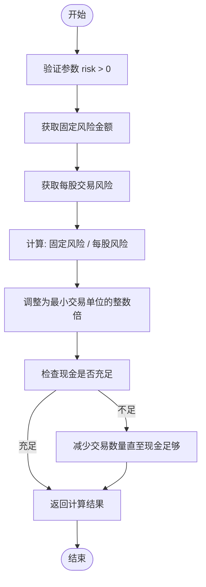
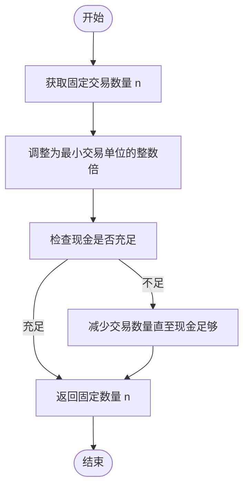
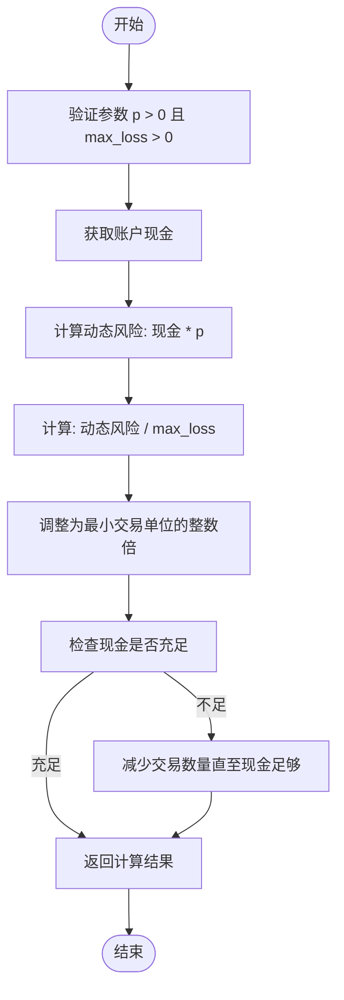
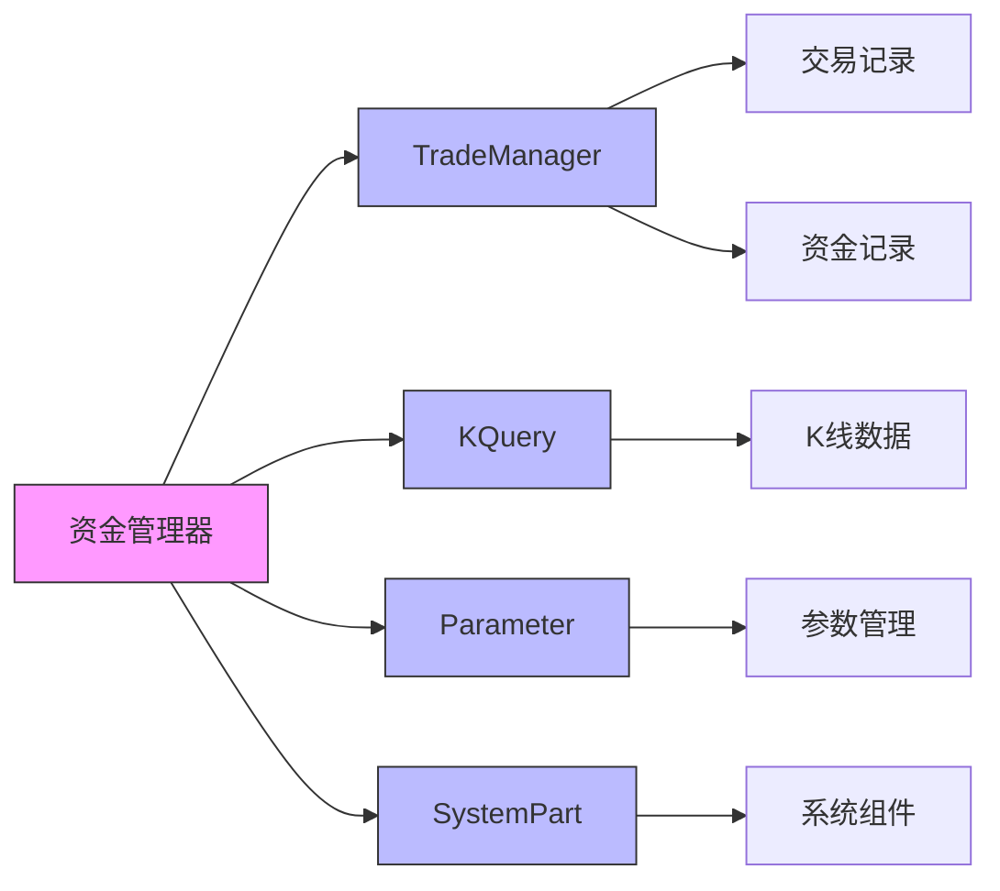

# 资金管理

<cite>
**本文档引用的文件**
- [MoneyManagerBase.h](file://hikyuu_cpp/hikyuu/trade_sys/moneymanager/MoneyManagerBase.h)
- [MoneyManagerBase.cpp](file://hikyuu_cpp/hikyuu/trade_sys/moneymanager/MoneyManagerBase.cpp)
- [MM_FixedPercent.h](file://hikyuu_cpp/hikyuu/trade_sys/moneymanager/crt/MM_FixedPercent.h)
- [FixedPercentMoneyManager.cpp](file://hikyuu_cpp/hikyuu/trade_sys/moneymanager/imp/FixedPercentMoneyManager.cpp)
- [MM_FixedRisk.h](file://hikyuu_cpp/hikyuu/trade_sys/moneymanager/crt/MM_FixedRisk.h)
- [FixedRiskMoneyManager.cpp](file://hikyuu_cpp/hikyuu/trade_sys/moneymanager/imp/FixedRiskMoneyManager.cpp)
- [MM_FixedCount.h](file://hikyuu_cpp/hikyuu/trade_sys/moneymanager/crt/MM_FixedCount.h)
- [FixedCountMoneyManager.cpp](file://hikyuu_cpp/hikyuu/trade_sys/moneymanager/imp/FixedCountMoneyManager.cpp)
- [MM_WilliamsFixedRisk.h](file://hikyuu_cpp/hikyuu/trade_sys/moneymanager/crt/MM_WilliamsFixedRisk.h)
- [WilliamsFixedRiskMoneyManager.cpp](file://hikyuu_cpp/hikyuu/trade_sys/moneymanager/imp/WilliamsFixedRiskMoneyManager.cpp)
- [MoneyManager.py](file://hikyuu/test/MoneyManager.py)
</cite>

## 目录
1. [简介](#简介)
2. [项目结构](#项目结构)
3. [核心组件](#核心组件)
4. [架构概述](#架构概述)
5. [详细组件分析](#详细组件分析)
6. [依赖分析](#依赖分析)
7. [性能考虑](#性能考虑)
8. [故障排除指南](#故障排除指南)
9. [结论](#结论)
10. [附录](#附录)（如有必要）

## 简介
本文档详细介绍了Hikyuu量化交易框架中的资金管理模块，重点阐述了其决定每笔交易投入资金量的核心功能。文档深入分析了`MoneyManagerBase`基类的设计与实现，并详细说明了`MM_FixedPercent`（固定比例）、`MM_FixedRisk`（固定风险）、`MM_FixedCount`（固定手数）和`MM_WilliamsFixedRisk`（威廉姆斯固定风险）等策略的计算逻辑和风险管理理念。通过代码示例展示了如何在策略中配置不同的资金管理器，并阐述了其对整体投资组合风险和收益的影响。

## 项目结构
资金管理模块位于`hikyuu_cpp/hikyuu/trade_sys/moneymanager/`目录下，采用C++实现，并通过Python包装器提供接口。该模块遵循清晰的分层结构，将接口定义、具体实现和构建工具分离。



**Diagram sources**
- [MoneyManagerBase.h](file://hikyuu_cpp/hikyuu/trade_sys/moneymanager/MoneyManagerBase.h)
- [crt/MM_FixedPercent.h](file://hikyuu_cpp/hikyuu/trade_sys/moneymanager/crt/MM_FixedPercent.h)
- [imp/FixedPercentMoneyManager.cpp](file://hikyuu_cpp/hikyuu/trade_sys/moneymanager/imp/FixedPercentMoneyManager.cpp)

**Section sources**
- [MoneyManagerBase.h](file://hikyuu_cpp/hikyuu/trade_sys/moneymanager/MoneyManagerBase.h)
- [crt/MM_FixedPercent.h](file://hikyuu_cpp/hikyuu/trade_sys/moneymanager/crt/MM_FixedPercent.h)
- [imp/FixedPercentMoneyManager.cpp](file://hikyuu_cpp/hikyuu/trade_sys/moneymanager/imp/FixedPercentMoneyManager.cpp)

## 核心组件
资金管理模块的核心组件包括`MoneyManagerBase`基类和多个具体的资金管理策略实现。`MoneyManagerBase`定义了所有资金管理器必须遵循的接口和公共行为，而具体的策略类则继承自该基类并实现特定的资金计算逻辑。这些组件共同协作，根据预设的风险管理规则动态计算每笔交易的头寸规模。

**Section sources**
- [MoneyManagerBase.h](file://hikyuu_cpp/hikyuu/trade_sys/moneymanager/MoneyManagerBase.h)
- [MoneyManagerBase.cpp](file://hikyuu_cpp/hikyuu/trade_sys/moneymanager/MoneyManagerBase.cpp)

## 架构概述
资金管理模块采用面向对象的设计模式，以`MoneyManagerBase`为抽象基类，通过继承机制实现多种具体的资金管理策略。该架构的核心是`_getBuyNumber`纯虚函数，所有子类必须重写此方法来定义其独特的头寸计算公式。资金管理器在运行时被集成到交易系统中，当产生买入信号时，系统会调用资金管理器的`getBuyNumber`方法，该方法在进行一系列检查（如现金充足性、最小交易单位等）后，调用子类实现的`_getBuyNumber`来获取最终的交易数量。



**Diagram sources**
- [MoneyManagerBase.h](file://hikyuu_cpp/hikyuu/trade_sys/moneymanager/MoneyManagerBase.h)
- [FixedPercentMoneyManager.h](file://hikyuu_cpp/hikyuu/trade_sys/moneymanager/imp/FixedPercentMoneyManager.h)
- [FixedRiskMoneyManager.h](file://hikyuu_cpp/hikyuu/trade_sys/moneymanager/imp/FixedRiskMoneyManager.h)
- [FixedCountMoneyManager.h](file://hikyuu_cpp/hikyuu/trade_sys/moneymanager/imp/FixedCountMoneyManager.h)
- [WilliamsFixedRiskMoneyManager.h](file://hikyuu_cpp/hikyuu/trade_sys/moneymanager/imp/WilliamsFixedRiskMoneyManager.h)

## 详细组件分析
本节将深入分析资金管理模块中的各个关键组件，包括基类和具体的策略实现。

### MoneyManagerBase 基类分析
`MoneyManagerBase`是所有资金管理策略的抽象基类，它定义了资金管理器的核心接口和公共功能。该类继承自`enable_shared_from_this`，便于在需要时安全地获取自身的`shared_ptr`。它通过`PARAMETER_SUPPORT_WITH_CHECK`宏支持参数化配置，并提供了`setParam`和`getParam`等方法来管理策略参数。

基类的核心功能是`getBuyNumber`方法，它是一个非虚的公共接口，负责处理所有资金管理器共有的逻辑，如检查交易账户(`m_tm`)的有效性、验证风险值的合法性、确保交易数量不小于最小交易单位(`minTradeNumber`)、以及根据可用现金调整最终的交易数量。在进行这些通用检查后，`getBuyNumber`会调用一个名为`_getBuyNumber`的纯虚函数，该函数的具体实现由子类提供，用于计算理论上的头寸规模。

此外，基类还提供了`setTM`和`setQuery`方法来设置关联的交易账户和查询条件，以及`clone`方法用于创建资金管理器的副本，这对于在回测中保持策略状态的独立性至关重要。

**Section sources**
- [MoneyManagerBase.h](file://hikyuu_cpp/hikyuu/trade_sys/moneymanager/MoneyManagerBase.h)
- [MoneyManagerBase.cpp](file://hikyuu_cpp/hikyuu/trade_sys/moneymanager/MoneyManagerBase.cpp)

### MM_FixedPercent（固定比例）策略分析
`MM_FixedPercent`策略，也称为百分比风险模型，是一种经典的风险管理方法，其核心理念是将每笔交易的风险控制在总资产的固定百分比内。

#### 计算逻辑
该策略的计算公式为：**买入数量 = （账户现金 × 风险百分比p） / 交易风险(risk)**。
- **账户现金**：指在交易时刻，交易账户中可用于投资的现金余额。
- **风险百分比(p)**：一个由用户配置的参数，表示愿意为单笔交易承担的风险占总资产的比例，例如0.02代表2%。
- **交易风险(risk)**：指每股股票的潜在最大损失，通常由交易系统根据止损点计算得出。

该策略的实现类为`FixedPercentMoneyManager`，其`_getBuyNumber`方法直接应用了上述公式。通过将风险与总资产挂钩，该策略实现了仓位的动态调整：当账户盈利时，可投入的资金增加，从而可能买入更多股票；当账户亏损时，可投入的资金减少，自动降低了仓位，体现了“让利润奔跑，截断亏损”的原则。



**Diagram sources**
- [MM_FixedPercent.h](file://hikyuu_cpp/hikyuu/trade_sys/moneymanager/crt/MM_FixedPercent.h)
- [FixedPercentMoneyManager.cpp](file://hikyuu_cpp/hikyuu/trade_sys/moneymanager/imp/FixedPercentMoneyManager.cpp)

**Section sources**
- [MM_FixedPercent.h](file://hikyuu_cpp/hikyuu/trade_sys/moneymanager/crt/MM_FixedPercent.h)
- [FixedPercentMoneyManager.cpp](file://hikyuu_cpp/hikyuu/trade_sys/moneymanager/imp/FixedPercentMoneyManager.cpp)

### MM_FixedRisk（固定风险）策略分析
`MM_FixedRisk`策略是一种更为直接的风险控制方法，它为每笔交易设定一个固定的、绝对的金额作为最大可承受的损失。

#### 计算逻辑
该策略的计算公式为：**买入数量 = 固定风险金额 / 每股交易风险**。
- **固定风险金额**：一个由用户预先设定的固定数值，例如1000元，表示无论账户总资产是多少，单笔交易的最大亏损额都限制在这个数值。
- **每股交易风险**：与`MM_FixedPercent`相同，指每股股票的潜在最大损失。

该策略的实现类为`FixedRiskMoneyManager`。其`_getBuyNumber`方法的逻辑非常简洁，直接将固定的`risk`参数除以每股风险。这种策略的优势在于风险敞口非常明确和一致，便于投资者进行心理预期和压力测试。然而，它不考虑账户的当前规模，可能导致在账户资金较少时仓位过重，或在资金较多时仓位过轻。



**Diagram sources**
- [MM_FixedRisk.h](file://hikyuu_cpp/hikyuu/trade_sys/moneymanager/crt/MM_FixedRisk.h)
- [FixedRiskMoneyManager.cpp](file://hikyuu_cpp/hikyuu/trade_sys/moneymanager/imp/FixedRiskMoneyManager.cpp)

**Section sources**
- [MM_FixedRisk.h](file://hikyuu_cpp/hikyuu/trade_sys/moneymanager/crt/MM_FixedRisk.h)
- [FixedRiskMoneyManager.cpp](file://hikyuu_cpp/hikyuu/trade_sys/moneymanager/imp/FixedRiskMoneyManager.cpp)

### MM_FixedCount（固定手数）策略分析
`MM_FixedCount`策略是一种最简单的资金管理方法，它不进行任何风险计算，而是为每次买入操作指定一个固定的交易数量。

#### 计算逻辑
该策略的计算逻辑为：**买入数量 = 用户设定的固定数量n**。
- **固定数量(n)**：一个由用户配置的数值，表示每次买入时交易的股票数量。

该策略的实现类为`FixedCountMoneyManager`。其`_getBuyNumber`方法直接返回参数`n`。此策略主要用于策略回测的基准比较，因为它忽略了资金和风险因素，假设资金是无限充足的。在实际交易中，这种策略风险极高，因为它可能导致在账户资金不足时无法执行交易，或在市场波动剧烈时造成不成比例的巨大亏损。



**Diagram sources**
- [MM_FixedCount.h](file://hikyuu_cpp/hikyuu/trade_sys/moneymanager/crt/MM_FixedCount.h)
- [FixedCountMoneyManager.cpp](file://hikyuu_cpp/hikyuu/trade_sys/moneymanager/imp/FixedCountMoneyManager.cpp)

**Section sources**
- [MM_FixedCount.h](file://hikyuu_cpp/hikyuu/trade_sys/moneymanager/crt/MM_FixedCount.h)
- [FixedCountMoneyManager.cpp](file://hikyuu_cpp/hikyuu/trade_sys/moneymanager/imp/FixedCountMoneyManager.cpp)

### MM_WilliamsFixedRisk（威廉姆斯固定风险）策略分析
`MM_WilliamsFixedRisk`策略结合了`MM_FixedPercent`和`MM_FixedRisk`的特点，它使用一个固定的最大损失金额，但这个金额是根据账户现金和一个风险百分比动态计算得出的。

#### 计算逻辑
该策略的计算公式为：**买入数量 = （账户现金 × 风险百分比p） / 最大损失(max_loss)**。
- **账户现金**：交易时刻的账户现金余额。
- **风险百分比(p)**：用户配置的风险比例。
- **最大损失(max_loss)**：一个固定的金额，代表单笔交易允许的最大亏损额。

该策略的实现类为`WilliamsFixedRiskMoneyManager`。其`_getBuyNumber`方法首先计算出一个动态的“固定风险”值（即`现金 * p`），然后用这个值除以预设的`max_loss`来得到交易数量。这实际上意味着，策略试图将风险控制在`max_loss`，但可用的“风险预算”是`现金 * p`。这种设计提供了一种更精细的风险控制方式，既保证了单笔交易的最大亏损额是固定的，又确保了风险预算与账户规模成正比。



**Diagram sources**
- [MM_WilliamsFixedRisk.h](file://hikyuu_cpp/hikyuu/trade_sys/moneymanager/crt/MM_WilliamsFixedRisk.h)
- [WilliamsFixedRiskMoneyManager.cpp](file://hikyuu_cpp/hikyuu/trade_sys/moneymanager/imp/WilliamsFixedRiskMoneyManager.cpp)

**Section sources**
- [MM_WilliamsFixedRisk.h](file://hikyuu_cpp/hikyuu/trade_sys/moneymanager/crt/MM_WilliamsFixedRisk.h)
- [WilliamsFixedRiskMoneyManager.cpp](file://hikyuu_cpp/hikyuu/trade_sys/moneymanager/imp/WilliamsFixedRiskMoneyManager.cpp)

## 依赖分析
资金管理模块的依赖关系清晰，主要依赖于框架内的其他核心组件。



**Diagram sources**
- [MoneyManagerBase.h](file://hikyuu_cpp/hikyuu/trade_sys/moneymanager/MoneyManagerBase.h)
- [MoneyManagerBase.cpp](file://hikyuu_cpp/hikyuu/trade_sys/moneymanager/MoneyManagerBase.cpp)

**Section sources**
- [MoneyManagerBase.h](file://hikyuu_cpp/hikyuu/trade_sys/moneymanager/MoneyManagerBase.h)
- [MoneyManagerBase.cpp](file://hikyuu_cpp/hikyuu/trade_sys/moneymanager/MoneyManagerBase.cpp)

## 性能考虑
资金管理模块的性能主要体现在其计算效率和内存使用上。由于其核心计算（如乘除法）非常简单，且不涉及复杂的循环或递归，因此计算开销极低，对整体回测或实盘交易系统的性能影响可以忽略不计。内存方面，每个资金管理器实例只维护少量的成员变量（如名称、参数、交易账户指针等），内存占用很小。其性能瓶颈通常不在于算法本身，而在于与`TradeManager`交互时获取账户状态（如现金余额）的效率，但这属于`TradeManager`模块的优化范畴。

## 故障排除指南
在使用资金管理模块时，可能会遇到以下常见问题：

1.  **交易数量为0**：这通常是因为计算出的理论交易数量小于交易品种的最小交易单位（如A股的100股）。请检查`minTradeNumber`参数，并确保资金管理器计算出的数量是其整数倍。
2.  **现金不足**：当`auto-checkin`参数为`false`（默认）时，如果计算出的交易所需资金超过账户现金，系统会自动减少交易数量直至现金足够，甚至可能将数量减至0。若希望强制交易，可将`auto-checkin`设为`true`，系统会自动向账户存入所需资金。
3.  **参数验证失败**：如果传入了非法参数（如`MM_FixedPercent`的`p`大于1或小于0），程序会通过`HKU_ASSERT`断言失败。请确保所有参数都在有效范围内。
4.  **交易账户为空**：如果`MoneyManagerBase`中的`m_tm`指针为空，调用`getBuyNumber`等方法会返回0并记录错误。请确保在使用资金管理器前已通过`setTM`方法正确设置了交易账户。

**Section sources**
- [MoneyManagerBase.cpp](file://hikyuu_cpp/hikyuu/trade_sys/moneymanager/MoneyManagerBase.cpp)
- [FixedPercentMoneyManager.cpp](file://hikyuu_cpp/hikyuu/trade_sys/moneymanager/imp/FixedPercentMoneyManager.cpp)

## 结论
Hikyuu的资金管理模块提供了一个强大且灵活的框架，用于控制交易风险和决定头寸规模。通过`MoneyManagerBase`基类和多种具体策略的实现，用户可以根据自己的风险偏好选择合适的资金管理方法。`MM_FixedPercent`适合追求风险与收益动态平衡的投资者，`MM_FixedRisk`适合风险厌恶型且追求一致性的投资者，`MM_FixedCount`主要用作测试基准，而`MM_WilliamsFixedRisk`则提供了一种结合两者优点的混合策略。正确配置和使用资金管理器，对于构建稳健、可持续的交易系统至关重要。

## 附录
### Python中配置资金管理器的代码示例
```python
from hikyuu import *

# 创建一个交易系统
sys = SYS()

# 配置不同的资金管理器
# 1. 固定比例 (2%风险)
mm_fixed_percent = MM_FixedPercent(0.02)

# 2. 固定风险 (每笔交易1000元)
mm_fixed_risk = MM_FixedRisk(1000.0)

# 3. 固定手数 (每次100股)
mm_fixed_count = MM_FixedCount(100)

# 4. 威廉姆斯固定风险 (风险比例10%，最大损失2000元)
mm_williams = MM_WilliamsFixedRisk(0.1, 2000.0)

# 将资金管理器添加到交易系统中
sys.set_mm(mm_fixed_percent)  # 或其他策略

# ... 继续配置信号、止损等组件
```
此示例展示了如何在Python中创建和配置不同的资金管理器，并将其集成到交易系统中。选择合适的策略并调整参数，可以显著影响投资组合的整体风险和收益特征。

**Section sources**
- [MoneyManager.py](file://hikyuu/test/MoneyManager.py)