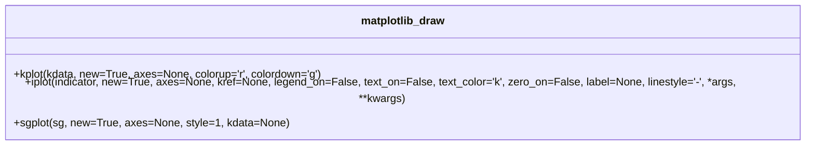
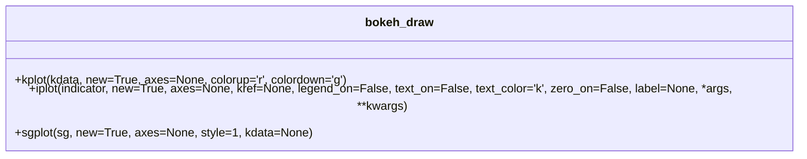
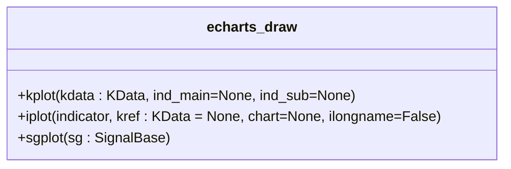

# 可视化功能

<cite>
**本文档引用的文件**   
- [__init__.py](file://hikyuu/draw/__init__.py)
- [__init__.py](file://hikyuu/draw/drawplot/__init__.py)
- [matplotlib_draw.py](file://hikyuu/draw/drawplot/matplotlib_draw.py)
- [bokeh_draw.py](file://hikyuu/draw/drawplot/bokeh_draw.py)
- [echarts_draw.py](file://hikyuu/draw/drawplot/echarts_draw.py)
- [common.py](file://hikyuu/draw/drawplot/common.py)
</cite>

## 目录
1. [介绍](#介绍)
2. [绘图后端](#绘图后端)
3. [核心组件](#核心组件)
4. [详细组件分析](#详细组件分析)
5. [自定义图表样式](#自定义图表样式)
6. [结果嵌入与保存](#结果嵌入与保存)
7. [策略调试与分析](#策略调试与分析)
8. [结论](#结论)

## 介绍
Hikyuu框架提供了一套强大的可视化功能，旨在帮助用户直观地分析和理解金融数据。该功能主要通过`draw`模块实现，支持多种绘图后端，包括matplotlib、ECharts和Bokeh。这些后端各有优缺点，适用于不同的场景。本指南将详细介绍如何使用这些功能来绘制K线图、技术指标叠加图、资金曲线图和持仓分布图，并指导用户如何自定义图表样式，以及如何将绘图结果嵌入Jupyter Notebook或保存为静态图片/交互式HTML文件。

## 绘图后端
Hikyuu框架的`draw`模块支持三种主要的绘图后端：matplotlib、ECharts和Bokeh。每种后端都有其独特的特点和适用场景。

### matplotlib
- **优点**：成熟稳定，社区支持广泛，适合静态图表的生成。
- **缺点**：交互性较差，不适合复杂的交互式图表。
- **适用场景**：适用于需要生成高质量静态图表的场景，如报告和文档。

### ECharts
- **优点**：交互性强，支持丰富的图表类型，适合Web应用。
- **缺点**：依赖JavaScript，需要在Web环境中运行。
- **适用场景**：适用于需要高度交互性的Web应用，如在线数据分析平台。

### Bokeh
- **优点**：交互性强，支持动态更新，适合实时数据展示。
- **缺点**：学习曲线较陡，配置复杂。
- **适用场景**：适用于需要实时数据更新和高度交互性的应用，如实时监控系统。

## 核心组件
`draw`模块的核心组件包括`drawplot`包中的`matplotlib_draw.py`、`bokeh_draw.py`和`echarts_draw.py`文件。这些文件分别实现了对matplotlib、Bokeh和ECharts后端的支持。

**Section sources**
- [__init__.py](file://hikyuu/draw/drawplot/__init__.py)
- [matplotlib_draw.py](file://hikyuu/draw/drawplot/matplotlib_draw.py)
- [bokeh_draw.py](file://hikyuu/draw/drawplot/bokeh_draw.py)
- [echarts_draw.py](file://hikyuu/draw/drawplot/echarts_draw.py)

## 详细组件分析
### matplotlib_draw.py
`matplotlib_draw.py`文件实现了对matplotlib后端的支持。它提供了多种绘图函数，如`kplot`用于绘制K线图，`iplot`用于绘制技术指标曲线，`sgplot`用于绘制信号点等。

**Diagram sources **
- [matplotlib_draw.py](file://hikyuu/draw/drawplot/matplotlib_draw.py)

### bokeh_draw.py
`bokeh_draw.py`文件实现了对Bokeh后端的支持。它提供了类似的绘图函数，但利用Bokeh的交互特性，使得图表更加动态和响应式。

**Diagram sources **
- [bokeh_draw.py](file://hikyuu/draw/drawplot/bokeh_draw.py)

### echarts_draw.py
`echarts_draw.py`文件实现了对ECharts后端的支持。它利用ECharts的强大功能，提供了丰富的图表类型和高度的交互性。

**Diagram sources **
- [echarts_draw.py](file://hikyuu/draw/drawplot/echarts_draw.py)

## 自定义图表样式
用户可以通过设置不同的参数来自定义图表的样式，如颜色、线型和图例。例如，使用`matplotlib_draw.py`中的`iplot`函数时，可以通过`color`参数设置线条颜色，通过`linestyle`参数设置线型，通过`label`参数设置图例。

## 结果嵌入与保存
### 嵌入Jupyter Notebook
用户可以将绘图结果直接嵌入到Jupyter Notebook中，以便进行交互式分析。例如，使用`bokeh_draw.py`中的`show_gcf`函数可以将当前图表显示在Notebook中。

### 保存为静态图片
用户可以将绘图结果保存为静态图片，如PNG或PDF格式。例如，使用`matplotlib_draw.py`中的`savefig`函数可以将当前图表保存为文件。

### 保存为交互式HTML文件
用户可以将绘图结果保存为交互式HTML文件，以便在Web浏览器中查看。例如，使用`bokeh_draw.py`中的`output_file`函数可以将当前图表保存为HTML文件。

## 策略调试与分析
可视化功能不仅用于展示数据，还可以用于策略的调试和分析。例如，通过绘制K线图和技术指标叠加图，可以验证信号生成的准确性。通过绘制资金曲线图和持仓分布图，可以评估策略的性能。

## 结论
Hikyuu框架的可视化功能为用户提供了一套强大的工具，帮助他们更好地理解和分析金融数据。通过支持多种绘图后端，用户可以根据具体需求选择最适合的工具。无论是生成静态图表还是创建交互式应用，Hikyuu都能满足用户的需求。