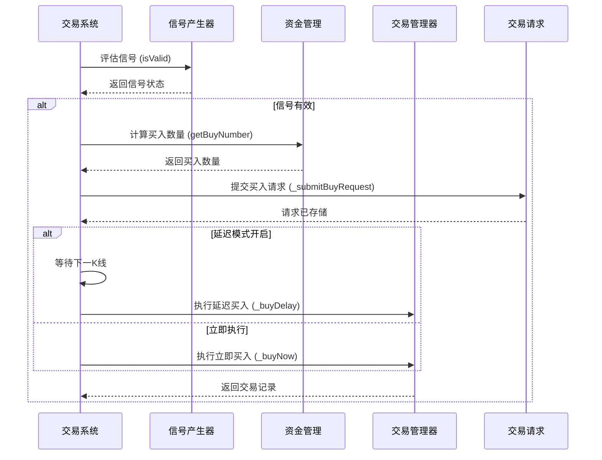
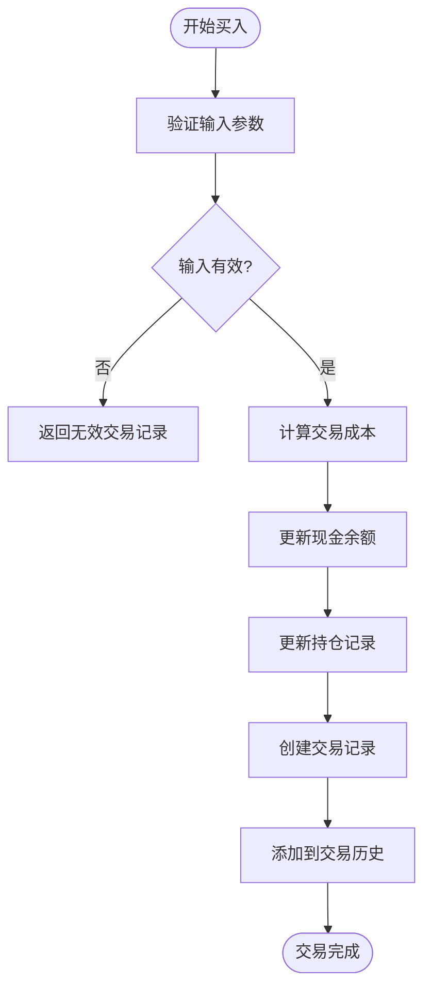
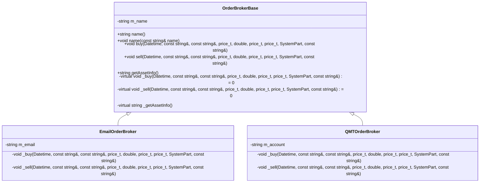

# 交易执行与订单处理

<cite>
**本文档引用的文件**   
- [TradeManager.h](file://hikyuu_cpp/hikyuu/trade_manage/TradeManager.h)
- [TradeManager.cpp](file://hikyuu_cpp/hikyuu/trade_manage/TradeManager.cpp)
- [OrderBrokerBase.h](file://hikyuu_cpp/hikyuu/trade_manage/OrderBrokerBase.h)
- [OrderBrokerBase.cpp](file://hikyuu_cpp/hikyuu/trade_manage/OrderBrokerBase.cpp)
- [TradeRecord.h](file://hikyuu_cpp/hikyuu/trade_manage/TradeRecord.h)
- [PositionRecord.h](file://hikyuu_cpp/hikyuu/trade_manage/PositionRecord.h)
- [System.h](file://hikyuu_cpp/hikyuu/trade_sys/system/System.h)
- [System.cpp](file://hikyuu_cpp/hikyuu/trade_sys/system/System.cpp)
- [SystemPart.h](file://hikyuu_cpp/hikyuu/trade_sys/system/SystemPart.h)
- [SystemPart.cpp](file://hikyuu_cpp/hikyuu/trade_sys/system/SystemPart.cpp)
- [TradeCostBase.h](file://hikyuu_cpp/hikyuu/trade_manage/TradeCostBase.h)
</cite>

## 目录
1. [引言](#引言)
2. [交易管理器核心逻辑](#交易管理器核心逻辑)
3. [信号生成与交易请求](#信号生成与交易请求)
4. [订单匹配与执行引擎](#订单匹配与执行引擎)
5. [订单代理与路由机制](#订单代理与路由机制)
6. [滑点与部分成交处理](#滑点与部分成交处理)
7. [结论](#结论)

## 引言
本文档深入分析Hikyuu量化框架中回测系统的交易执行逻辑。重点阐述了`TradeManager`如何迭代K线数据并与交易系统（System）交互以生成买卖信号，详细解释了`TradeRequest`对象的生成机制及其在延迟交易（delay模式）中的应用。文档还描述了订单匹配引擎如何根据信号、资金和持仓情况执行买入、卖出、卖空和买入平仓操作，并说明了`OrderBrokerBase`在订单路由和执行中的角色。通过分析实际代码结构，本文旨在为开发者提供一个清晰、全面的交易执行流程视图。

## 交易管理器核心逻辑

`TradeManager`是Hikyuu框架中负责管理模拟账户交易的核心组件，它维护着账户的交易记录、资金使用情况和持仓状态。该类继承自`TradeManagerBase`，并实现了具体的交易管理功能。

`TradeManager`在初始化时需要指定账户建立日期、初始资金、交易成本函数和账户名称。它通过一系列成员变量来跟踪账户状态，包括初始资金`m_init_cash`、当前现金`m_cash`、累计存入资金`m_checkin_cash`、累计取出资金`m_checkout_cash`、当前借入资金`m_borrow_cash`等。这些变量共同构成了账户的完整财务视图。

在交易执行方面，`TradeManager`提供了`buy`、`sell`、`sellShort`和`buyShort`等核心方法，用于执行买入、卖出、卖空和买入平仓操作。这些方法在执行前会进行严格的参数校验，确保交易的合法性。例如，`buy`方法会检查证券对象是否为空、交易时间是否晚于最后交易时间、买入数量是否为零或超出最小/最大交易数量限制等。

`TradeManager`还维护着多个关键的数据结构来记录交易和持仓信息。`m_trade_list`是一个`TradeRecordList`类型的列表，用于存储所有的交易记录。`m_position`是一个`position_map_type`（即`map<uint64_t, PositionRecord>`）的映射，用于存储当前的持仓记录，其中键为证券的ID。`m_position_history`则用于存储已平仓的历史持仓记录。此外，`m_short_position`和`m_short_position_history`分别用于管理空头仓位的当前和历史记录。

当执行一笔买入交易时，`TradeManager`首先进行一系列校验，然后根据实际买入价格和数量计算总成本，并更新当前现金余额。接着，它会更新或创建相应的持仓记录，增加累计买入资金和总风险。最后，一笔新的`TradeRecord`会被添加到`m_trade_list`中，记录此次交易的详细信息，包括交易时间、价格、数量、成本和交易后现金余额等。

**Section sources**
- [TradeManager.h](file://hikyuu_cpp/hikyuu/trade_manage/TradeManager.h#L35-L494)
- [TradeManager.cpp](file://hikyuu_cpp/hikyuu/trade_manage/TradeManager.cpp#L83-L800)

## 信号生成与交易请求

在Hikyuu框架中，交易信号的生成和处理是一个由`System`类协调的复杂过程。`System`类集成了多个策略组件，包括市场环境判断（`Environment`）、系统条件（`Condition`）、信号产生器（`Signal`）、资金管理（`MoneyManager`）、止损（`Stoploss`）、止盈（`Stoploss`）和盈利目标（`ProfitGoal`）等。这些组件协同工作，共同决定何时发出交易请求。

交易请求的核心是`TradeRequest`对象，它在`System`类中被定义为`m_buyRequest`、`m_sellRequest`等成员变量。`TradeRequest`封装了交易请求的所有必要信息，包括是否有效、计划价格、目标价格、止损价和交易来源等。当`System`在某个交易时刻评估各个策略组件后，如果决定发出买入信号，它会调用`_submitBuyRequest`方法来提交一个买入请求。该方法会填充`m_buyRequest`对象的各个字段，并将其标记为有效。

延迟交易（delay模式）是Hikyuu框架中的一个重要特性，它通过`buy_delay`和`sell_delay`等系统参数来控制。当`buy_delay`设置为`true`时，系统不会在信号产生的当前K线立即执行买入操作，而是将买入请求延迟到下一个K线的开盘时执行。这更符合实际交易场景，因为信号的产生通常基于当前K线的收盘价，而实际下单则发生在下一个交易时段。

`System`类的`run`方法是整个交易流程的入口。它会遍历K线数据，对每一根K线调用`_runMoment`方法。`_runMoment`方法是交易逻辑的核心，它会依次检查市场环境、系统条件和信号产生器的有效性。如果所有条件都满足，系统会计算买入或卖出的数量，并提交相应的交易请求。如果启用了延迟模式，这些请求会被存储在`m_buyRequest`或`m_sellRequest`中，等待下一个交易时刻处理。

**Diagram sources**
- [System.h](file://hikyuu_cpp/hikyuu/trade_sys/system/System.h#L365-L368)
- [System.cpp](file://hikyuu_cpp/hikyuu/trade_sys/system/System.cpp#L101-L102)

**Section sources**
- [System.h](file://hikyuu_cpp/hikyuu/trade_sys/system/System.h#L152-L159)
- [System.cpp](file://hikyuu_cpp/hikyuu/trade_sys/system/System.cpp#L101-L117)

## 订单匹配与执行引擎

订单匹配与执行引擎是`TradeManager`的核心功能，它负责将交易请求转化为实际的交易记录，并更新账户的财务和持仓状态。这个过程由`TradeManager`的`buy`、`sell`等方法实现，它们构成了一个完整的订单执行流水线。

当`System`决定执行一笔交易时，它会调用`TradeManager`的相应方法。以`buy`方法为例，其执行流程如下：首先，方法会进行一系列前置校验，包括检查证券对象、交易时间、买入数量等。校验通过后，方法会根据实际买入价格和数量计算总成本，并调用`getBuyCost`方法获取详细的交易成本（如佣金、印花税等）。

接下来，`TradeManager`会更新账户的现金余额。它会从当前现金`m_cash`中扣除买入总成本（买入金额加上交易成本），并确保现金余额不会变为负数（除非启用了融资功能）。然后，方法会更新持仓记录。如果该证券是首次买入，则在`m_position`映射中创建一个新的`PositionRecord`；如果已有持仓，则更新现有记录的数量、累计买入资金和总风险。

最后，一笔新的`TradeRecord`被创建并添加到`m_trade_list`中。这个`TradeRecord`包含了交易的所有关键信息，如交易时间、证券、业务类型（`BUSINESS_BUY`）、计划价格、实际价格、数量、成本、止损价和交易后的现金余额。`from`字段记录了发出此交易指示的系统部件，这对于后续的策略分析和调试至关重要。

对于卖出操作，流程类似，但方向相反。`sell`方法会检查当前是否持有该证券，然后更新持仓记录（减少数量或将其移入历史记录），增加现金余额，并生成一笔`BUSINESS_SELL`类型的交易记录。卖空和买入平仓操作也遵循类似的模式，但使用不同的业务类型和持仓管理逻辑。

**Diagram sources**
- [TradeManager.h](file://hikyuu_cpp/hikyuu/trade_manage/TradeManager.h#L231-L234)
- [TradeManager.cpp](file://hikyuu_cpp/hikyuu/trade_manage/TradeManager.cpp#L765-L800)

**Section sources**
- [TradeManager.h](file://hikyuu_cpp/hikyuu/trade_manage/TradeManager.h#L231-L290)
- [TradeRecord.h](file://hikyuu_cpp/hikyuu/trade_manage/TradeRecord.h#L25-L42)

## 订单代理与路由机制

`OrderBrokerBase`是Hikyuu框架中负责订单代理和路由的核心基类。它提供了一个通用的接口，允许开发者实现各种订单代理，如邮件通知、实盘交易接口等。`OrderBrokerBase`的设计使得交易逻辑与订单执行逻辑解耦，提高了系统的灵活性和可扩展性。

`OrderBrokerBase`类定义了`_buy`和`_sell`两个纯虚函数，作为子类必须实现的接口。子类通过重写这两个方法来定义实际的订单执行逻辑。例如，一个邮件订单代理可以在`_buy`方法中发送一封包含买入指令的电子邮件，而一个实盘交易接口代理则可以直接调用券商的API下单。

`OrderBrokerBase`还提供了一个重要的机制来控制订单代理的执行时机。由于回测需要回溯历史数据，`TradeManager`可能会在历史时间点发出交易指令。为了避免订单代理在回测过程中发送错误的实盘指令，`OrderBrokerBase`引入了`brokeLastDatetime`的概念。只有当交易指令的发出时间晚于`brokeLastDatetime`时，订单代理才会执行实际的买入/卖出动作。这确保了订单代理只在实盘操作时才被激活。

`OrderBrokerBase`通过`buy`和`sell`等非虚方法来调用子类的`_buy`和`_sell`方法。这些方法包含了异常处理逻辑，确保即使子类的实现抛出异常，也不会中断主交易流程。此外，`OrderBrokerBase`还支持获取当前资产信息，其`getAssetInfo`方法返回一个JSON字符串，包含了当前现金和持仓信息，这为外部系统提供了查询账户状态的接口。

**Diagram sources**
- [OrderBrokerBase.h](file://hikyuu_cpp/hikyuu/trade_manage/OrderBrokerBase.h#L50-L149)
- [OrderBrokerBase.cpp](file://hikyuu_cpp/hikyuu/trade_manage/OrderBrokerBase.cpp#L61-L85)

**Section sources**
- [OrderBrokerBase.h](file://hikyuu_cpp/hikyuu/trade_manage/OrderBrokerBase.h#L50-L149)
- [OrderBrokerBase.cpp](file://hikyuu_cpp/hikyuu/trade_manage/OrderBrokerBase.cpp#L61-L98)

## 滑点与部分成交处理

滑点（Slippage）是量化交易中一个重要的现实因素，指实际成交价格与预期价格之间的偏差。Hikyuu框架通过`SlippageBase`基类和其子类（如`FixedValueSlippage`、`FixedPercentSlippage`）来模拟滑点效应。`System`类在执行交易前，会调用`_getRealBuyPrice`和`_getRealSellPrice`方法，这些方法会委托给`SlippagePtr`（`m_sp`）来计算实际的买入和卖出价格。

例如，`FixedValueSlippage`会为买入价格加上一个固定的滑点值，为卖出价格减去一个固定的滑点值。`FixedPercentSlippage`则使用一个百分比来计算滑点。这种设计允许用户根据不同的市场条件和交易品种选择合适的滑点模型，从而使回测结果更加贴近真实交易。

关于部分成交的处理，从现有代码分析来看，Hikyuu框架的`TradeManager`在执行`buy`和`sell`等操作时，通常假设交易能够完全成交。例如，在`buy`方法中，传入的`number`参数被视为实际成交的数量。框架通过`minTradeNumber`和`maxTradeNumber`等限制来确保交易的合理性，但没有显式的逻辑来处理部分成交的情况。这意味着在当前的实现中，如果一笔交易无法完全成交，整个交易可能会失败（返回`BUSINESS_INVALID`的交易记录）。对于需要模拟部分成交的场景，可能需要通过自定义的`TradeCost`或`Slippage`策略来间接实现，或者在更高层次的策略逻辑中进行处理。

**Section sources**
- [System.h](file://hikyuu_cpp/hikyuu/trade_sys/system/System.h#L636-L642)
- [FixedValueSlippage.cpp](file://hikyuu_cpp/hikyuu/trade_sys/slippage/imp/FixedValueSlippage.cpp#L1-L44)

## 结论
本文档详细剖析了Hikyuu量化框架中交易执行的核心逻辑。`TradeManager`作为交易管理的核心，通过精确的状态管理和严格的校验机制，确保了回测过程的准确性和可靠性。`System`类通过协调`Environment`、`Condition`、`Signal`等多个策略组件，实现了复杂的信号生成和交易请求逻辑，并通过`TradeRequest`和延迟模式机制，灵活地处理了交易时机问题。订单匹配引擎将交易请求转化为实际的交易记录，完整地反映了资金和持仓的变化。`OrderBrokerBase`的设计则为系统提供了强大的扩展能力，使其能够无缝对接邮件通知、实盘交易等多种外部系统。虽然框架对滑点有良好的支持，但对部分成交的处理相对简化，这为未来的功能扩展指明了方向。总体而言，Hikyuu的交易执行系统设计精巧，层次分明，为构建稳健的量化策略提供了坚实的基础。