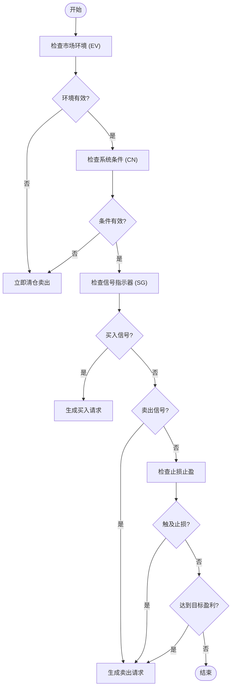
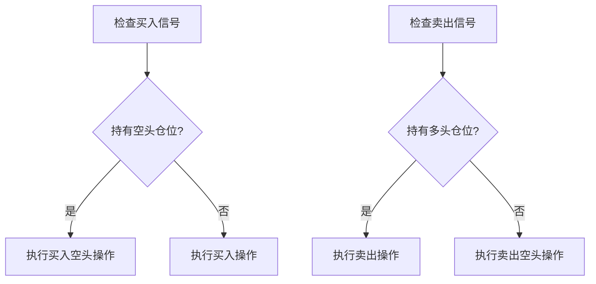
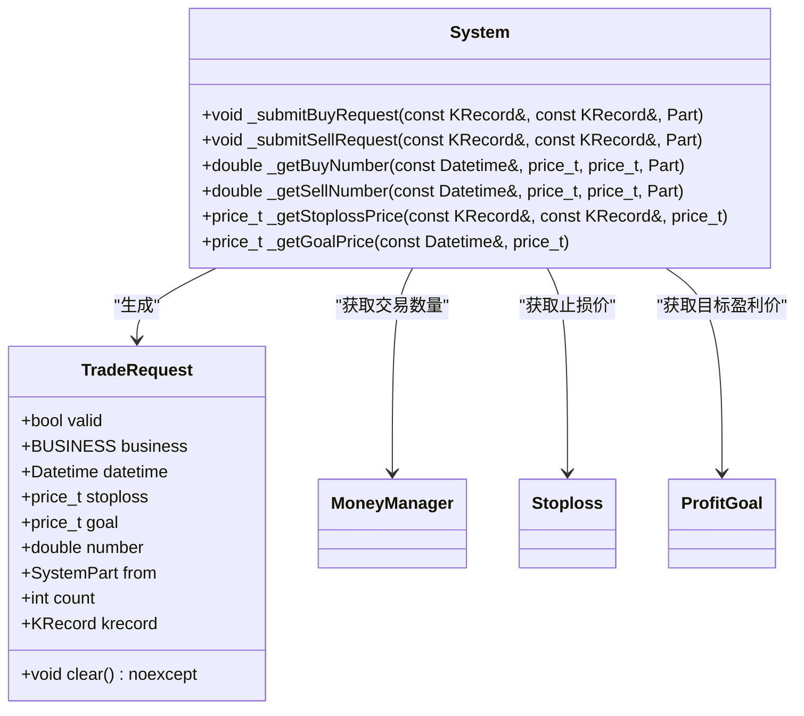
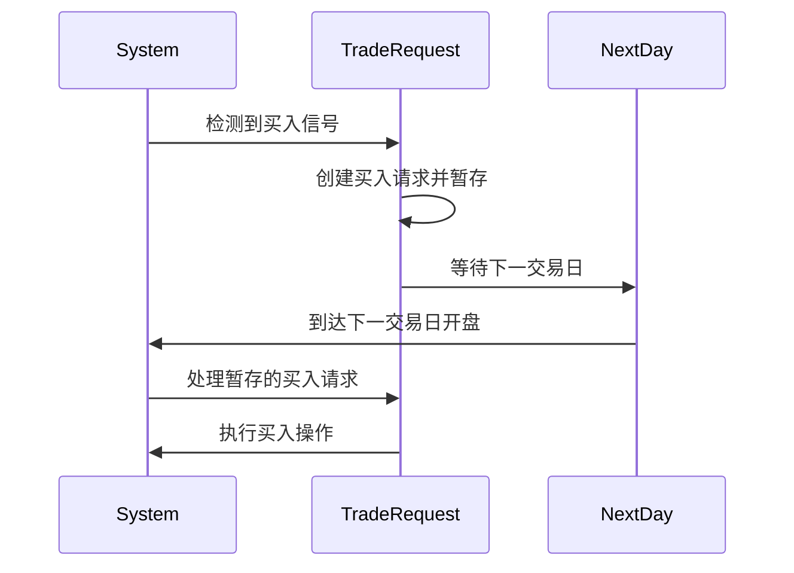
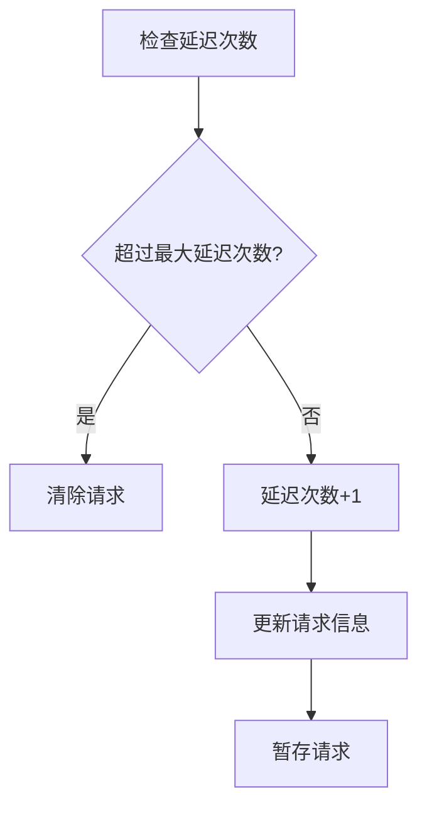
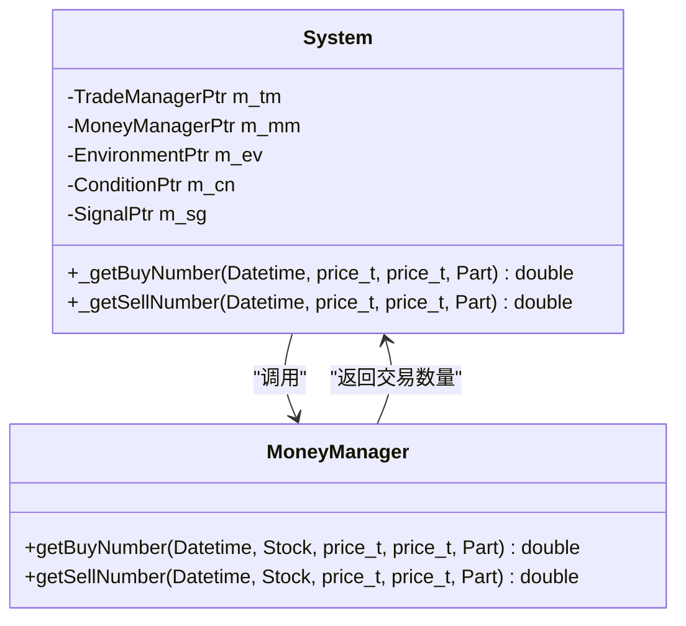
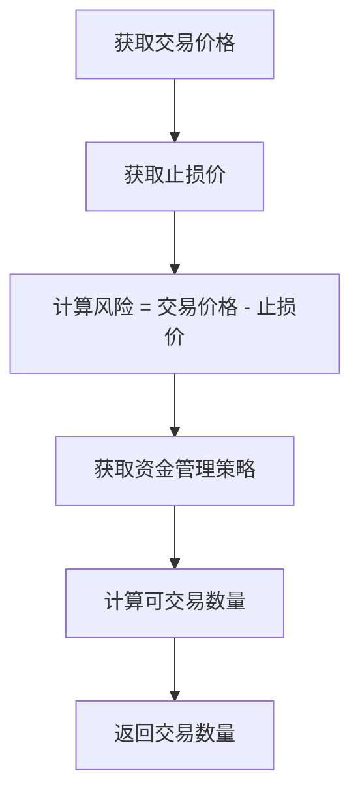
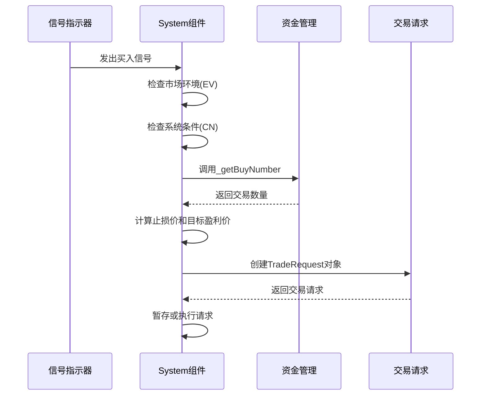

# 交易请求生成机制

<cite>
**本文档引用的文件**   
- [System.h](file://hikyuu_cpp/hikyuu/trade_sys/system/System.h)
- [System.cpp](file://hikyuu_cpp/hikyuu/trade_sys/system/System.cpp)
- [TradeRequest.h](file://hikyuu_cpp/hikyuu/trade_sys/system/TradeRequest.h)
- [TradeRequest.cpp](file://hikyuu_cpp/hikyuu/trade_sys/system/TradeRequest.cpp)
</cite>

## 目录
1. [引言](#引言)
2. [交易请求生成流程](#交易请求生成流程)
3. [核心组件分析](#核心组件分析)
4. [延迟交易模式](#延迟交易模式)
5. [资金管理联动机制](#资金管理联动机制)
6. [代码示例](#代码示例)

## 引言
交易请求（TradeRequest）是量化交易系统中的核心数据结构，用于在信号触发后生成具体的交易指令。本文档深入解析System组件如何在runMoment执行过程中，通过信号指示器（SG）、市场环境（EV）和系统条件（CN）的判断结果生成TradeRequest对象。详细说明TradeRequest中各字段的赋值逻辑，以及延迟交易模式下买入和卖出请求的暂存与执行机制。

## 交易请求生成流程

### 执行流程概述
System组件的runMoment方法是交易请求生成的核心入口。该方法在每个交易时刻被调用，通过一系列判断和计算生成交易请求。执行流程如下：

**Diagram sources**
- [System.cpp](file://hikyuu_cpp/hikyuu/trade_sys/system/System.cpp#L448-L639)

**Section sources**
- [System.cpp](file://hikyuu_cpp/hikyuu/trade_sys/system/System.cpp#L448-L639)
- [System.h](file://hikyuu_cpp/hikyuu/trade_sys/system/System.h#L221-L224)

### 信号触发判断
System组件首先检查信号指示器（SG）是否发出买入或卖出信号。信号判断基于当前交易日的数据，通过shouldBuy和shouldSell方法进行：

**Diagram sources**
- [System.cpp](file://hikyuu_cpp/hikyuu/trade_sys/system/System.cpp#L584-L610)

**Section sources**
- [System.cpp](file://hikyuu_cpp/hikyuu/trade_sys/system/System.cpp#L584-L610)

## 核心组件分析

### TradeRequest数据结构
TradeRequest是交易请求的核心数据结构，包含以下关键字段：

| 字段 | 类型 | 描述 |
|------|------|------|
| valid | bool | 请求是否有效 |
| business | BUSINESS | 业务类型（买入、卖出等） |
| datetime | Datetime | 请求时间 |
| stoploss | price_t | 止损价 |
| goal | price_t | 目标盈利价 |
| number | double | 交易数量 |
| from | SystemPart | 请求来源组件 |
| count | int | 延迟次数 |

**Section sources**
- [TradeRequest.h](file://hikyuu_cpp/hikyuu/trade_sys/system/TradeRequest.h#L26-L37)

### 字段赋值逻辑
各字段的赋值逻辑如下：

**Diagram sources**
- [TradeRequest.h](file://hikyuu_cpp/hikyuu/trade_sys/system/TradeRequest.h#L21-L38)
- [System.h](file://hikyuu_cpp/hikyuu/trade_sys/system/System.h#L313-L318)

**Section sources**
- [TradeRequest.h](file://hikyuu_cpp/hikyuu/trade_sys/system/TradeRequest.h#L21-L38)
- [System.h](file://hikyuu_cpp/hikyuu/trade_sys/system/System.h#L313-L318)

## 延迟交易模式

### 延迟机制原理
当系统参数buy_delay或sell_delay设置为true时，系统会启用延迟交易模式。在这种模式下，买入和卖出请求不会立即执行，而是暂存并在下一交易日执行：

**Diagram sources**
- [System.cpp](file://hikyuu_cpp/hikyuu/trade_sys/system/System.cpp#L829-L847)
- [System.cpp](file://hikyuu_cpp/hikyuu/trade_sys/system/System.cpp#L1054-L1080)

**Section sources**
- [System.cpp](file://hikyuu_cpp/hikyuu/trade_sys/system/System.cpp#L829-L847)
- [System.cpp](file://hikyuu_cpp/hikyuu/trade_sys/system/System.cpp#L1054-L1080)

### 延迟次数控制
系统通过count字段记录延迟次数，并通过max_delay_count参数限制最大延迟次数：

**Diagram sources**
- [System.cpp](file://hikyuu_cpp/hikyuu/trade_sys/system/System.cpp#L830-L836)
- [System.cpp](file://hikyuu_cpp/hikyuu/trade_sys/system/System.cpp#L1055-L1062)

**Section sources**
- [System.cpp](file://hikyuu_cpp/hikyuu/trade_sys/system/System.cpp#L830-L836)
- [System.cpp](file://hikyuu_cpp/hikyuu/trade_sys/system/System.cpp#L1055-L1062)

## 资金管理联动机制

### 资金管理接口
System组件通过_getBuyNumber和_getSellNumber私有方法与资金管理（MM）组件联动：

**Diagram sources**
- [System.h](file://hikyuu_cpp/hikyuu/trade_sys/system/System.h#L294-L297)
- [System.cpp](file://hikyuu_cpp/hikyuu/trade_sys/system/System.cpp#L848-L850)

**Section sources**
- [System.h](file://hikyuu_cpp/hikyuu/trade_sys/system/System.h#L294-L297)
- [System.cpp](file://hikyuu_cpp/hikyuu/trade_sys/system/System.cpp#L848-L850)

### 风险计算
资金管理组件根据交易价格和止损价计算交易风险，从而确定交易数量：

**Diagram sources**
- [System.cpp](file://hikyuu_cpp/hikyuu/trade_sys/system/System.cpp#L848-L850)
- [System.cpp](file://hikyuu_cpp/hikyuu/trade_sys/system/System.cpp#L1075-L1076)

**Section sources**
- [System.cpp](file://hikyuu_cpp/hikyuu/trade_sys/system/System.cpp#L848-L850)
- [System.cpp](file://hikyuu_cpp/hikyuu/trade_sys/system/System.cpp#L1075-L1076)

## 代码示例

### 从信号触发到请求创建
以下示例展示从信号触发到请求创建的完整流程：

**Diagram sources**
- [System.cpp](file://hikyuu_cpp/hikyuu/trade_sys/system/System.cpp#L584-L610)
- [System.cpp](file://hikyuu_cpp/hikyuu/trade_sys/system/System.cpp#L829-L847)

**Section sources**
- [System.cpp](file://hikyuu_cpp/hikyuu/trade_sys/system/System.cpp#L584-L610)
- [System.cpp](file://hikyuu_cpp/hikyuu/trade_sys/system/System.cpp#L829-L847)