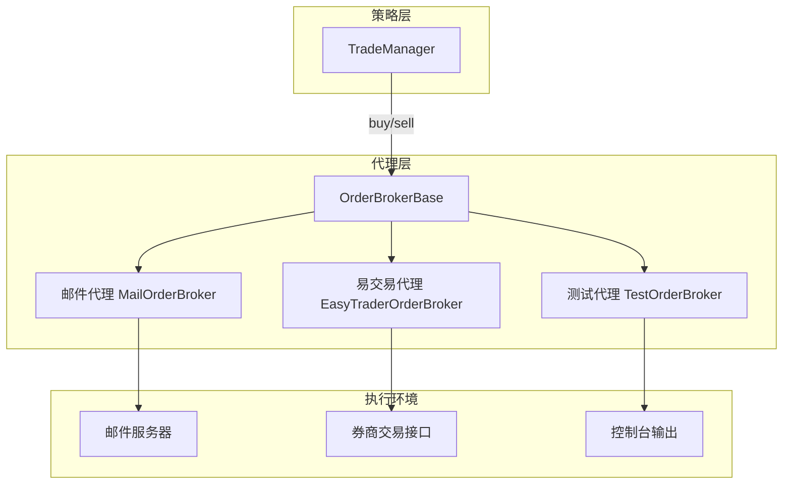
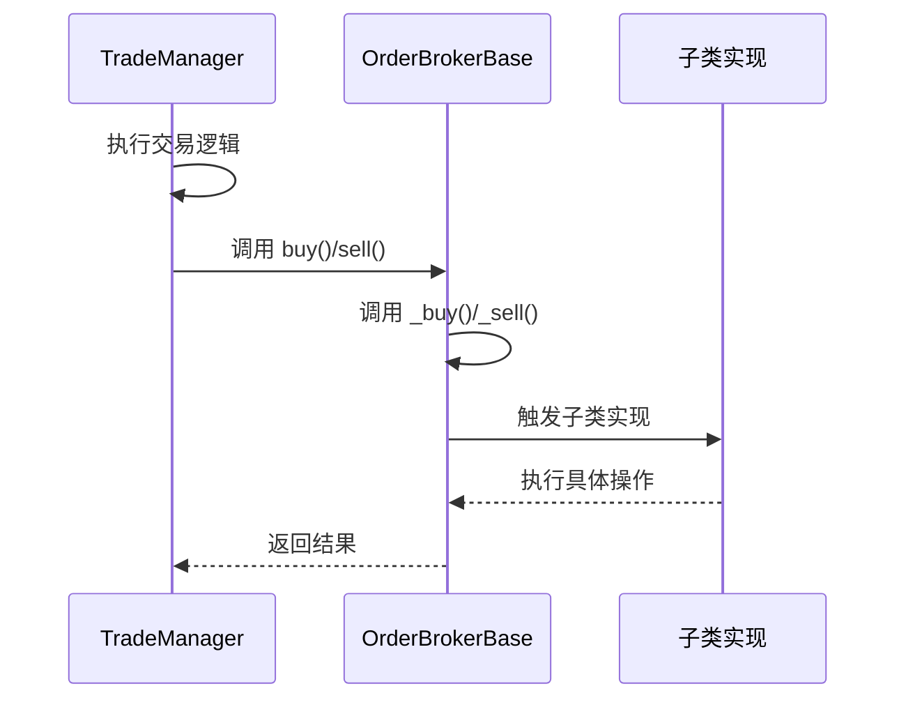
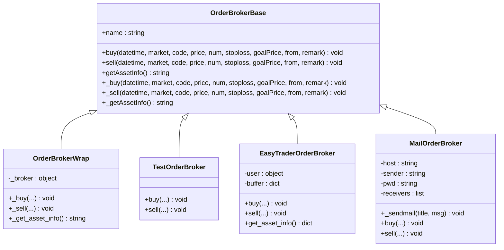
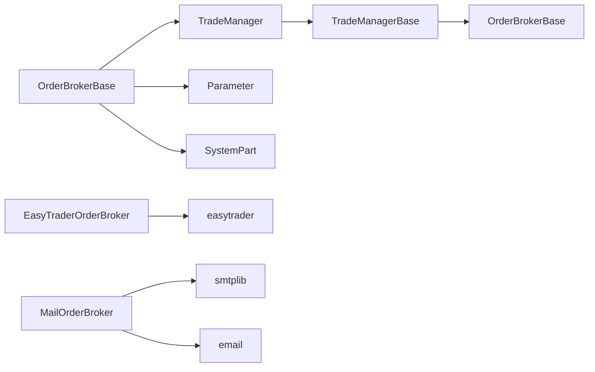

# 订单代理与路由机制

<cite>
**本文档引用的文件**   
- [OrderBrokerBase.h](file://hikyuu_cpp/hikyuu/trade_manage/OrderBrokerBase.h)
- [OrderBrokerBase.cpp](file://hikyuu_cpp/hikyuu/trade_manage/OrderBrokerBase.cpp)
- [TradeManager.h](file://hikyuu_cpp/hikyuu/trade_manage/TradeManager.h)
- [TradeManager.cpp](file://hikyuu_cpp/hikyuu/trade_manage/TradeManager.cpp)
- [TradeManagerBase.h](file://hikyuu_cpp/hikyuu/trade_manage/TradeManagerBase.h)
- [broker.py](file://hikyuu/trade_manage/broker.py)
- [broker_easytrader.py](file://hikyuu/trade_manage/broker_easytrader.py)
- [broker_mail.py](file://hikyuu/trade_manage/broker_mail.py)
</cite>

## 目录
1. [引言](#引言)
2. [核心组件分析](#核心组件分析)
3. [架构概述](#架构概述)
4. [详细组件分析](#详细组件分析)
5. [依赖分析](#依赖分析)
6. [性能考虑](#性能考虑)
7. [故障排除指南](#故障排除指南)
8. [结论](#结论)

## 引言
本文档旨在深入分析Hikyuu量化框架中OrderBrokerBase在订单路由机制中的核心作用。OrderBrokerBase作为交易执行代理的抽象基类，是连接交易策略与实际执行环境的关键桥梁。它不仅负责将TradeManager生成的交易指令路由到具体的执行环境（如回测模拟器或实盘券商接口），还为实现程序化交易提供了灵活的扩展机制。本文将详细阐述其设计原理、核心接口的调用时机、在回测与实盘场景下的协同工作模式，以及如何通过Python包装层进行自定义扩展。

## 核心组件分析

OrderBrokerBase是Hikyuu框架中实现订单代理功能的核心抽象基类。它定义了一套标准接口，用于处理交易指令的发送和执行。TradeManager作为交易管理的核心，负责生成交易信号和管理账户状态。通过`regBroker`方法，可以将一个或多个OrderBroker实例注册到TradeManager中。当TradeManager执行买入或卖出操作时，它会调用所有已注册的OrderBroker的相应方法，从而实现指令的路由。这种设计模式实现了交易逻辑与执行逻辑的解耦，使得框架可以轻松地支持多种不同的执行后端，例如邮件通知、回测模拟和实盘交易。

**Section sources**
- [OrderBrokerBase.h](file://hikyuu_cpp/hikyuu/trade_manage/OrderBrokerBase.h#L36-L49)
- [TradeManagerBase.h](file://hikyuu_cpp/hikyuu/trade_manage/TradeManagerBase.h#L187-L196)

## 架构概述

**Diagram sources **
- [OrderBrokerBase.h](file://hikyuu_cpp/hikyuu/trade_manage/OrderBrokerBase.h)
- [TradeManagerBase.h](file://hikyuu_cpp/hikyuu/trade_manage/TradeManagerBase.h)

## 详细组件分析

### OrderBrokerBase 核心接口分析

OrderBrokerBase类的核心在于其定义的两个纯虚函数：`_buy`和`_sell`。这两个函数是所有具体订单代理实现的基础。

#### 核心接口调用时机与参数传递
`_buy`和`_sell`方法并非由用户直接调用，而是由其父类方法`buy`和`sell`在特定时机触发。当TradeManager执行一个交易操作时，它会先调用自身的`buy`或`sell`方法来更新内部的交易记录和资金状态。随后，TradeManager会遍历其`m_broker_list`中的所有OrderBroker实例，并调用它们的`buy`或`sell`方法。这些方法在C++实现中会进一步调用`_buy`和`_sell`，从而将交易指令传递给具体的执行环境。

参数传递的详细说明如下：
- **datetime**: 策略发出交易信号的指示时间。
- **market**: 证券的市场标识，如"SH"（上海）或"SZ"（深圳）。
- **code**: 证券的代码，如"000001"。
- **price**: 交易的计划价格。
- **num**: 交易的数量。
- **stoploss**: 预期的止损价。
- **goalPrice**: 预期的目标价位。
- **from**: 信号来源的系统部件。
- **remark**: 交易备注信息。

**Diagram sources **
- [OrderBrokerBase.h](file://hikyuu_cpp/hikyuu/trade_manage/OrderBrokerBase.h#L76-L93)
- [OrderBrokerBase.cpp](file://hikyuu_cpp/hikyuu/trade_manage/OrderBrokerBase.cpp#L61-L70)

### 回测系统中的协同工作

在回测系统中，OrderBrokerBase与TradeManager协同工作，完成虚拟交易记录的创建。一个典型的例子是`TestOrderBroker`，它被设计用于测试目的。当TradeManager调用其`buy`或`sell`方法时，`TestOrderBroker`不会执行任何实际的交易，而是简单地将交易信息打印到控制台。这使得开发者可以在不产生真实交易的情况下，验证策略的逻辑和交易信号的正确性。`OrderBrokerWrap`类则提供了一种包装机制，允许用户将一个简单的、仅包含`buy`和`sell`方法的交易接口类包装成一个符合OrderBrokerBase规范的代理，从而可以无缝集成到Hikyuu框架中。

**Section sources**
- [broker.py](file://hikyuu/trade_manage/broker.py#L74-L84)

### 实盘场景下的自定义集成

在实盘场景下，需要实现与外部交易系统的集成。`EasyTraderOrderBroker`是一个典型的自定义OrderBroker实现。它使用`easytrader`库来连接华泰等券商的客户端。该代理的`buy`和`sell`方法接收交易指令，并将其存入一个缓冲区（buffer），同时打印出计划交易的信息。代码中明确注释了实际的下单操作（`self.user.buy`和`self.user.sell`）已被屏蔽，以防止在调试过程中发生误操作。这体现了在实盘环境中对安全性的高度重视。此外，`get_asset_info`方法实现了从券商接口获取当前资产信息（如可用资金和持仓）的功能，并将其格式化为框架要求的JSON字符串，以便TradeManager进行同步。

**Section sources**
- [broker_easytrader.py](file://hikyuu/trade_manage/broker_easytrader.py#L10-L63)

### Python包装层使用示例

Python包装层通过`_OrderBroker.cpp`文件将C++的`OrderBrokerBase`类暴露给Python。用户可以在Python中继承`OrderBrokerBase`并实现`_buy`和`_sell`方法。`crtOB`函数提供了一个便捷的工厂方法，用于快速创建`OrderBrokerWrap`实例，从而包装一个简单的交易接口。`MailOrderBroker`则展示了如何利用订单代理机制实现邮件通知功能，当发生买入或卖出操作时，会自动向指定邮箱发送提醒邮件。

**Diagram sources **
- [broker.py](file://hikyuu/trade_manage/broker.py)
- [broker_easytrader.py](file://hikyuu/trade_manage/broker_easytrader.py)
- [broker_mail.py](file://hikyuu/trade_manage/broker_mail.py)

## 依赖分析

**Diagram sources **
- [OrderBrokerBase.h](file://hikyuu_cpp/hikyuu/trade_manage/OrderBrokerBase.h#L12-L14)
- [broker_easytrader.py](file://hikyuu/trade_manage/broker_easytrader.py#L7)
- [broker_mail.py](file://hikyuu/trade_manage/broker_mail.py#L32-L33)

## 性能考虑
OrderBrokerBase的设计考虑了性能和异常处理。其`buy`和`sell`方法使用了`noexcept`关键字，并在内部通过try-catch块捕获所有异常，确保即使某个订单代理在执行时出错，也不会中断主交易流程。这对于实盘交易至关重要，因为它保证了核心交易逻辑的稳定性。同时，通过将复杂的执行逻辑（如网络请求）封装在子类的`_buy`和`_sell`方法中，主流程可以保持高效。

**Section sources**
- [OrderBrokerBase.cpp](file://hikyuu_cpp/hikyuu/trade_manage/OrderBrokerBase.cpp#L61-L70)

## 故障排除指南
在使用OrderBroker时，常见的问题包括：
1.  **代理未被调用**：检查是否已通过`TradeManager.regBroker`方法正确注册了代理实例。
2.  **实盘误操作**：在调试`EasyTraderOrderBroker`等实盘代理时，务必确认实际的下单代码（如`self.user.buy`）已被注释或屏蔽。
3.  **时间戳问题**：在实盘中，由于策略需要回溯历史数据，可能会在历史时间点触发交易。应利用`TradeManager`的`broker_last_datetime`属性来过滤掉历史时刻的指令，只允许在当前时间点之后的指令生效。
4.  **序列化错误**：确保自定义的OrderBroker类正确处理了序列化，特别是当使用`PARAMETER_SUPPORT`宏时。

**Section sources**
- [OrderBrokerBase.h](file://hikyuu_cpp/hikyuu/trade_manage/OrderBrokerBase.h#L42-L47)
- [TradeManagerBase.h](file://hikyuu_cpp/hikyuu/trade_manage/TradeManagerBase.h#L147-L155)

## 结论
OrderBrokerBase是Hikyuu框架中一个设计精良的抽象基类，它通过定义清晰的接口和灵活的注册机制，成功地将交易策略与执行环境解耦。无论是用于回测的`TestOrderBroker`，还是用于实盘的`EasyTraderOrderBroker`，亦或是用于通知的`MailOrderBroker`，它们都遵循同一套规范，展现了框架的可扩展性和模块化设计。开发者可以基于此基类，轻松地集成各种外部交易系统，构建出功能强大的自动化交易系统。