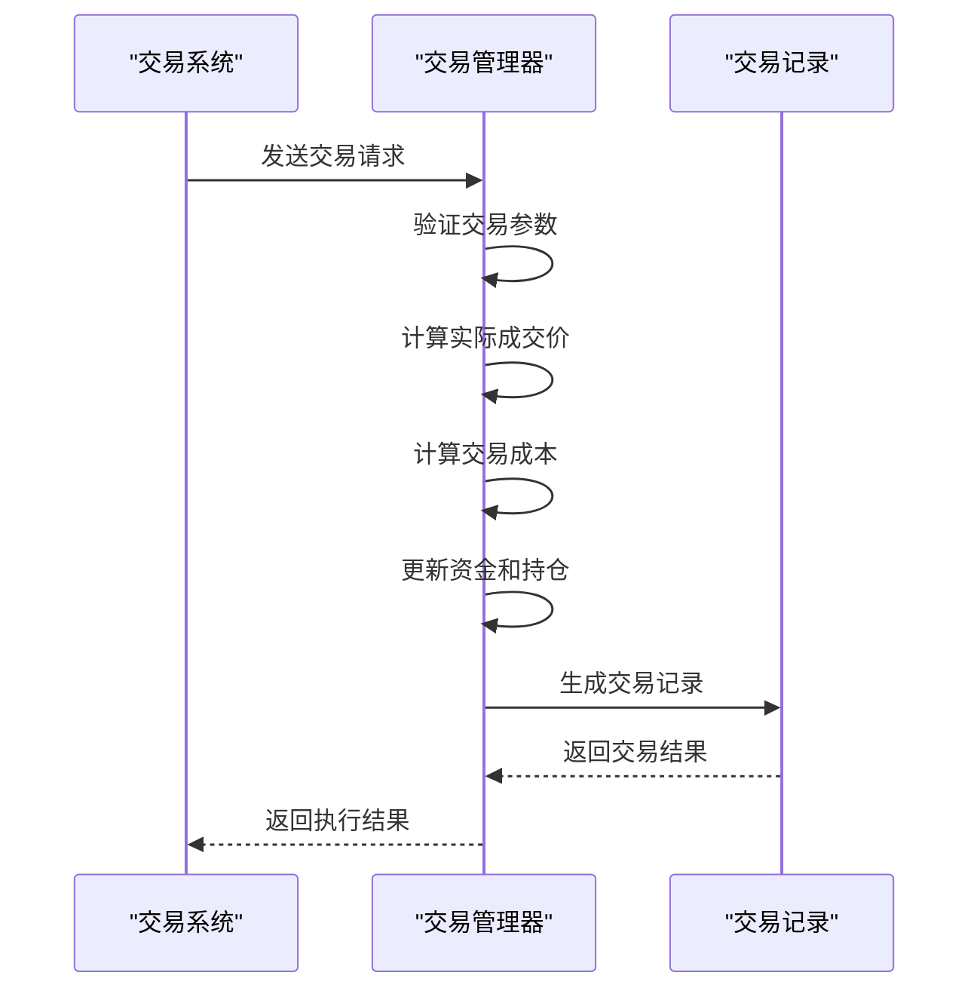
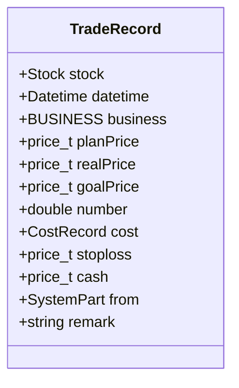
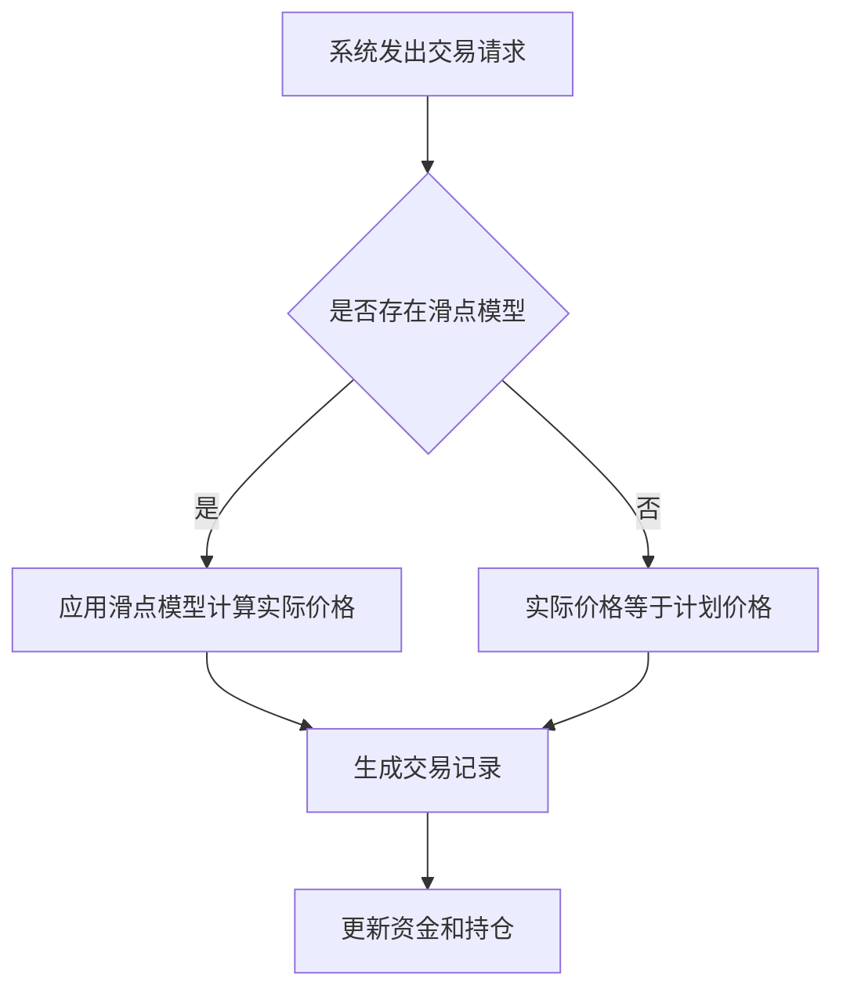
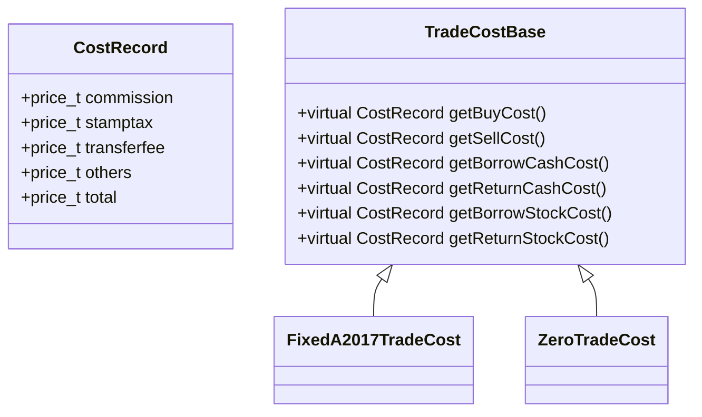
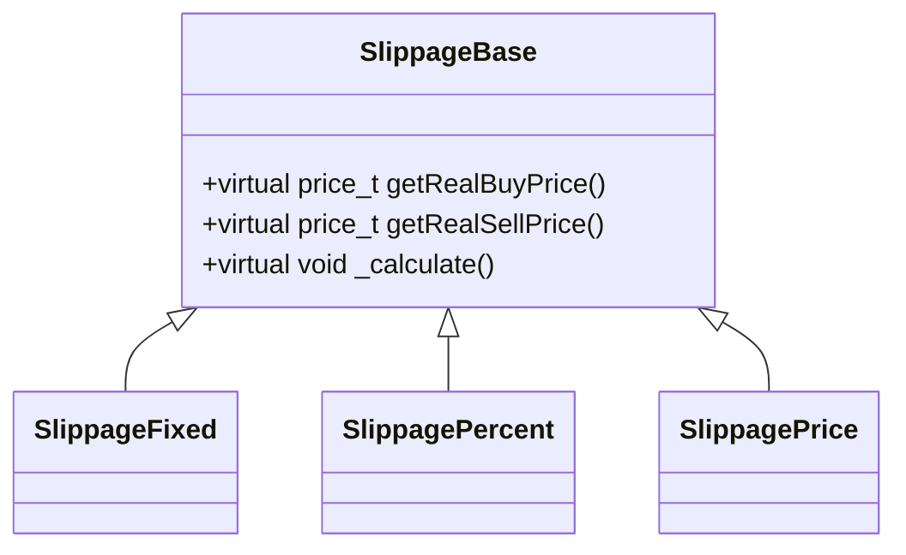
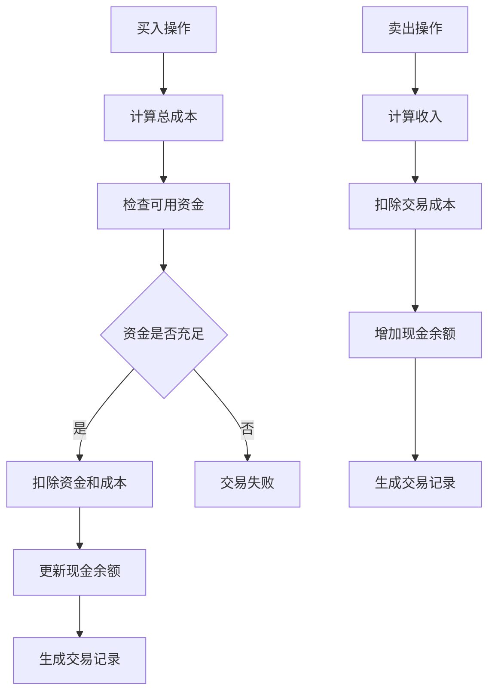
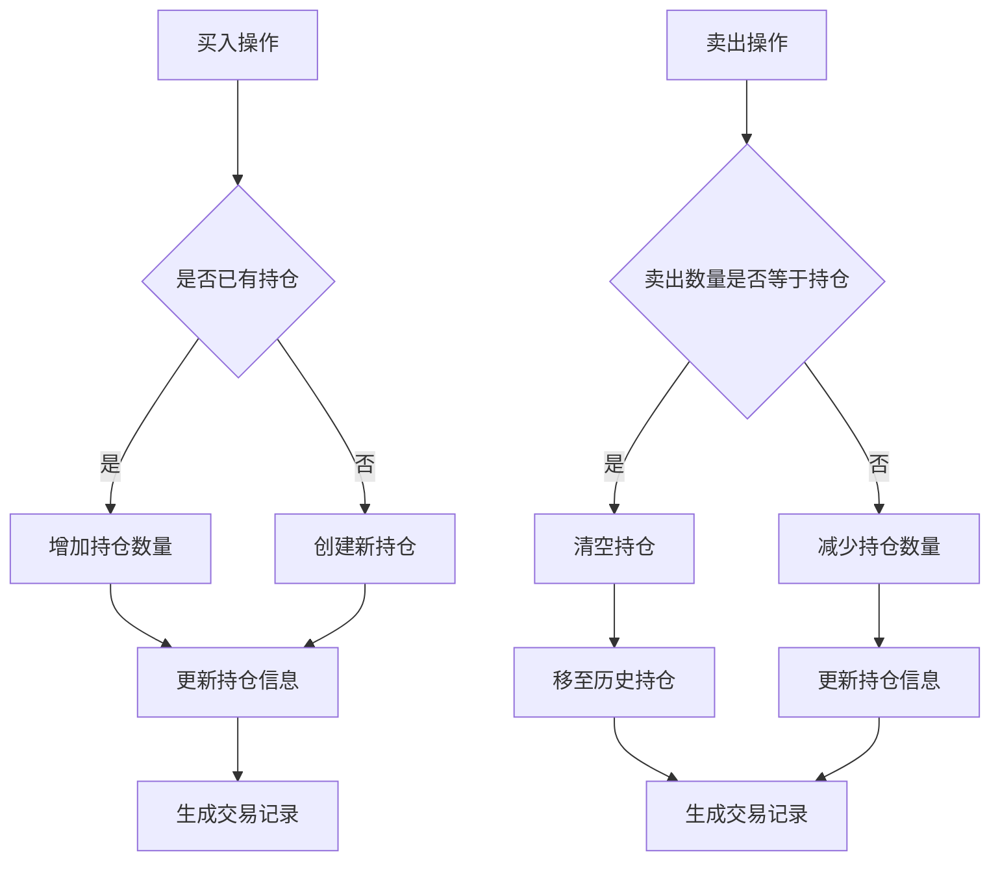
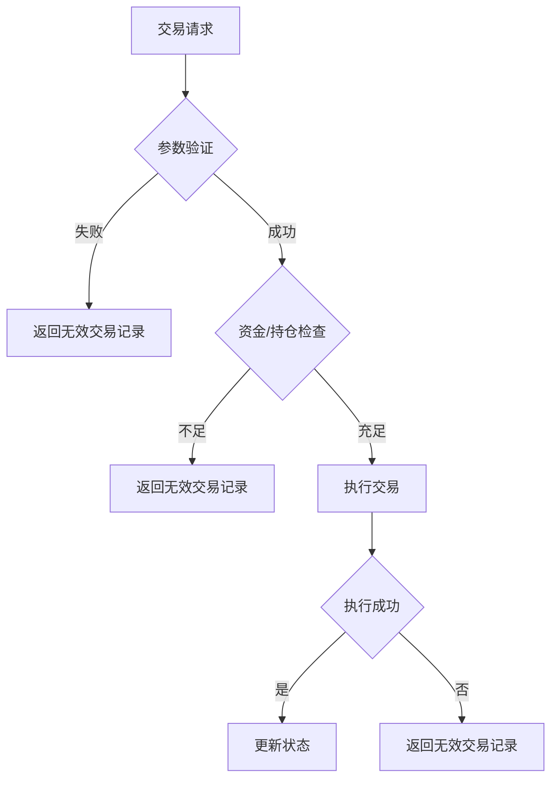
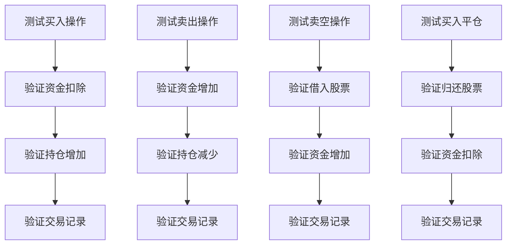

# 订单执行与匹配引擎

<cite>
**本文档引用的文件**   
- [TradeManager.h](file://hikyuu_cpp/hikyuu/trade_manage/TradeManager.h)
- [TradeManager.cpp](file://hikyuu_cpp/hikyuu/trade_manage/TradeManager.cpp)
- [TradeRecord.h](file://hikyuu_cpp/hikyuu/trade_manage/TradeRecord.h)
- [TradeCostBase.h](file://hikyuu_cpp/hikyuu/trade_manage/TradeCostBase.h)
- [System.h](file://hikyuu_cpp/hikyuu/trade_sys/system/System.h)
- [TradeRequest.h](file://hikyuu_cpp/hikyuu/trade_sys/system/TradeRequest.h)
- [SlippageBase.h](file://hikyuu_cpp/hikyuu/trade_sys/slippage/SlippageBase.h)
- [test_TradeManager.cpp](file://hikyuu_cpp/unit_test/hikyuu/trade_manage/test_TradeManager.cpp)
</cite>

## 目录
1. [引言](#引言)
2. [订单执行流程](#订单执行流程)
3. [交易记录生成](#交易记录生成)
4. [交易成本计算](#交易成本计算)
5. [滑点模型应用](#滑点模型应用)
6. [资金与持仓更新](#资金与持仓更新)
7. [部分成交与失败处理](#部分成交与失败处理)
8. [单元测试验证](#单元测试验证)
9. [结论](#结论)

## 引言
订单执行与匹配引擎是Hikyuu量化交易系统的核心组件，负责处理交易请求、执行买卖操作、管理资金和持仓，并生成详细的交易记录。该引擎通过TradeManager类实现，能够处理买入、卖出、卖空和买入平仓等多种交易操作。系统通过精确的计算和严格的验证机制，确保交易执行的准确性和可靠性。

## 订单执行流程
订单执行流程始于系统部件发出的交易请求，由TradeManager接收并处理。TradeManager根据当前持仓、可用资金和交易成本执行相应的交易操作。

**Diagram sources**
- [TradeManager.h](file://hikyuu_cpp/hikyuu/trade_manage/TradeManager.h#L218-L309)
- [System.h](file://hikyuu_cpp/hikyuu/trade_sys/system/System.h#L310-L334)

**Section sources**
- [TradeManager.h](file://hikyuu_cpp/hikyuu/trade_manage/TradeManager.h#L218-L309)
- [System.h](file://hikyuu_cpp/hikyuu/trade_sys/system/System.h#L310-L334)

## 交易记录生成
交易记录（TradeRecord）是订单执行的核心输出，包含交易的详细信息，如交易对象、时间、价格、数量和成本等。

### TradeRecord结构

**Diagram sources**
- [TradeRecord.h](file://hikyuu_cpp/hikyuu/trade_manage/TradeRecord.h#L59-L88)

**Section sources**
- [TradeRecord.h](file://hikyuu_cpp/hikyuu/trade_manage/TradeRecord.h#L59-L88)

### 计划价与实际成交价
计划价（planPrice）是系统预期的交易价格，而实际成交价（realPrice）是最终执行的价格。两者可能因滑点模型而产生差异。

**Diagram sources**
- [TradeManager.h](file://hikyuu_cpp/hikyuu/trade_manage/TradeManager.h#L218-L309)
- [SlippageBase.h](file://hikyuu_cpp/hikyuu/trade_sys/slippage/SlippageBase.h#L55-L63)

**Section sources**
- [TradeManager.h](file://hikyuu_cpp/hikyuu/trade_manage/TradeManager.h#L218-L309)
- [SlippageBase.h](file://hikyuu_cpp/hikyuu/trade_sys/slippage/SlippageBase.h#L55-L63)

## 交易成本计算
交易成本（TradeCost）是订单执行的重要组成部分，直接影响最终的成交结果。系统通过TradeCostBase接口计算各种交易成本。

### 交易成本组成
交易成本主要由以下几部分组成：
- 佣金（commission）
- 印花税（stamptax）
- 过户费（transferfee）
- 其他费用（others）
- 总成本（total）

**Diagram sources**
- [TradeCostBase.h](file://hikyuu_cpp/hikyuu/trade_manage/TradeCostBase.h#L15-L58)
- [TradeRecord.h](file://hikyuu_cpp/hikyuu/trade_manage/TradeRecord.h#L83-L85)

**Section sources**
- [TradeCostBase.h](file://hikyuu_cpp/hikyuu/trade_manage/TradeCostBase.h#L15-L58)
- [TradeRecord.h](file://hikyuu_cpp/hikyuu/trade_manage/TradeRecord.h#L83-L85)

## 滑点模型应用
滑点模型（Slippage）用于模拟实际交易中价格与预期价格的偏差，提高回测的准确性。

### 滑点模型接口

**Diagram sources**
- [SlippageBase.h](file://hikyuu_cpp/hikyuu/trade_sys/slippage/SlippageBase.h#L55-L63)

**Section sources**
- [SlippageBase.h](file://hikyuu_cpp/hikyuu/trade_sys/slippage/SlippageBase.h#L55-L63)

## 资金与持仓更新
订单执行后，系统会更新资金和持仓状态，确保账户信息的准确性。

### 资金更新逻辑

**Diagram sources**
- [TradeManager.cpp](file://hikyuu_cpp/hikyuu/trade_manage/TradeManager.cpp#L765-L965)

**Section sources**
- [TradeManager.cpp](file://hikyuu_cpp/hikyuu/trade_manage/TradeManager.cpp#L765-L965)

### 持仓更新逻辑

**Diagram sources**
- [TradeManager.cpp](file://hikyuu_cpp/hikyuu/trade_manage/TradeManager.cpp#L838-L858)
- [TradeManager.cpp](file://hikyuu_cpp/hikyuu/trade_manage/TradeManager.cpp#L926-L943)

**Section sources**
- [TradeManager.cpp](file://hikyuu_cpp/hikyuu/trade_manage/TradeManager.cpp#L838-L858)
- [TradeManager.cpp](file://hikyuu_cpp/hikyuu/trade_manage/TradeManager.cpp#L926-L943)

## 部分成交与失败处理
系统需要处理部分成交和交易失败的情况，确保账户状态的一致性。

### 交易失败处理

**Diagram sources**
- [TradeManager.cpp](file://hikyuu_cpp/hikyuu/trade_manage/TradeManager.cpp#L771-L777)
- [TradeManager.cpp](file://hikyuu_cpp/hikyuu/trade_manage/TradeManager.cpp#L830-L832)

**Section sources**
- [TradeManager.cpp](file://hikyuu_cpp/hikyuu/trade_manage/TradeManager.cpp#L771-L777)
- [TradeManager.cpp](file://hikyuu_cpp/hikyuu/trade_manage/TradeManager.cpp#L830-L832)

## 单元测试验证
通过单元测试验证订单执行逻辑的正确性，确保系统稳定可靠。

### 测试用例分析

**Diagram sources**
- [test_TradeManager.cpp](file://hikyuu_cpp/unit_test/hikyuu/trade_manage/test_TradeManager.cpp#L678-L750)

**Section sources**
- [test_TradeManager.cpp](file://hikyuu_cpp/unit_test/hikyuu/trade_manage/test_TradeManager.cpp#L678-L750)

## 结论
Hikyuu的订单执行与匹配引擎通过TradeManager类实现了完整的交易生命周期管理。系统能够准确处理各种交易操作，包括买入、卖出、卖空和买入平仓。通过精确的交易成本计算和滑点模型应用，确保了回测结果的可靠性。资金和持仓的更新机制保证了账户状态的一致性，而完善的错误处理机制则提高了系统的健壮性。单元测试验证了各项功能的正确性，为实际交易提供了坚实的基础。