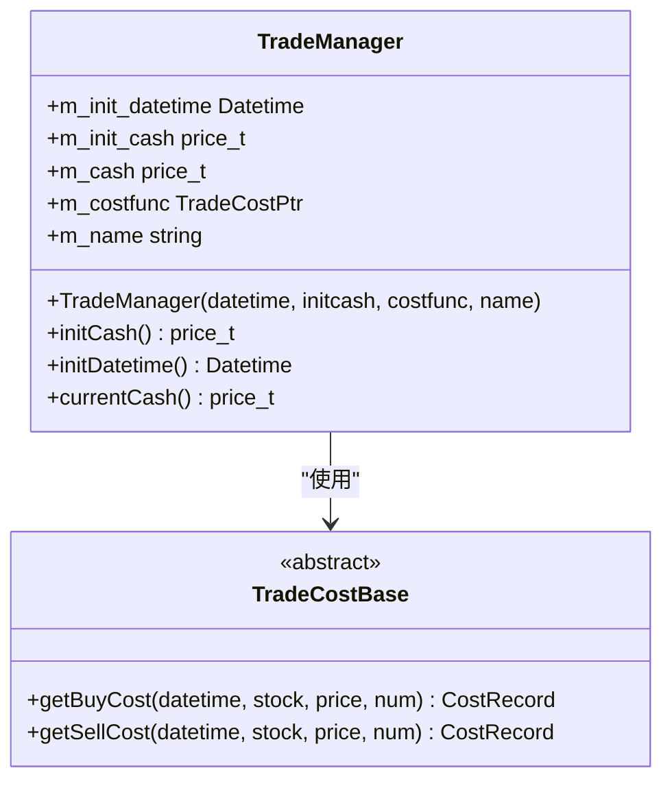
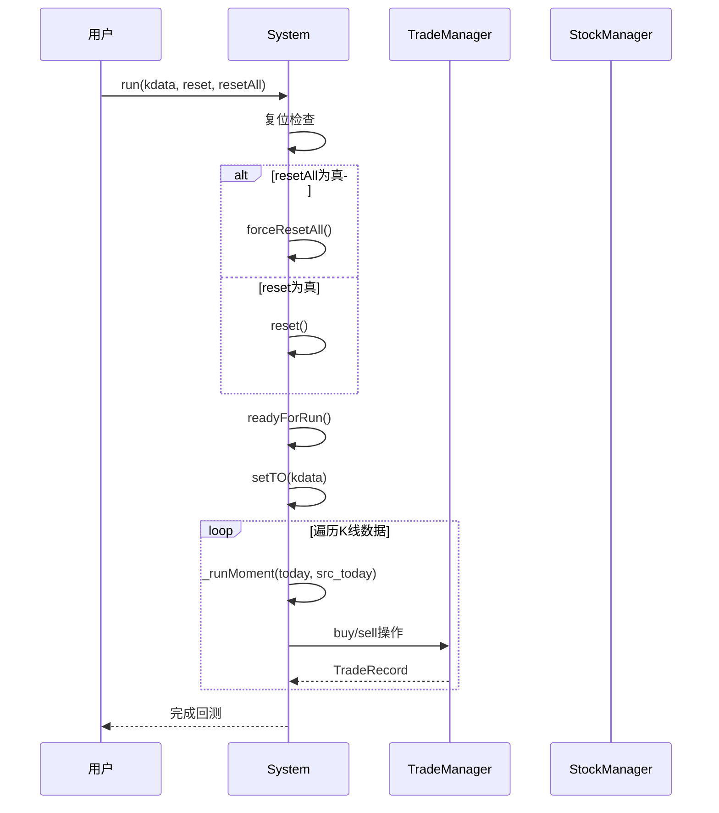
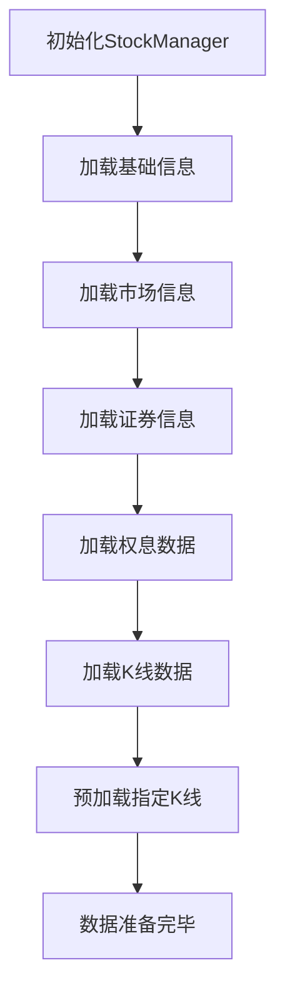

# 回测初始化

<cite>
**本文档引用的文件**   
- [TradeManager.h](file://hikyuu_cpp/hikyuu/trade_manage/TradeManager.h)
- [TradeManager.cpp](file://hikyuu_cpp/hikyuu/trade_manage/TradeManager.cpp)
- [System.h](file://hikyuu_cpp/hikyuu/trade_sys/system/System.h)
- [System.cpp](file://hikyuu_cpp/hikyuu/trade_sys/system/System.cpp)
- [StockManager.h](file://hikyuu_cpp/hikyuu/StockManager.h)
- [StockManager.cpp](file://hikyuu_cpp/hikyuu/StockManager.cpp)
- [crtTM.cpp](file://hikyuu_cpp/hikyuu/trade_manage/crt/crtTM.cpp)
- [006-TradeManager.ipynb](file://hikyuu/examples/notebook/006-TradeManager.ipynb)
</cite>

## 目录
1. [回测初始化概述](#回测初始化概述)
2. [交易账户配置](#交易账户配置)
3. [回测执行过程](#回测执行过程)
4. [证券数据加载与持仓初始化](#证券数据加载与持仓初始化)
5. [代码示例](#代码示例)
6. [系统复位机制](#系统复位机制)

## 回测初始化概述

回测初始化是量化交易系统中的关键环节，它为模拟交易环境建立基础框架。该过程主要涉及交易管理器（TradeManager）的创建、交易参数的配置、K线数据的加载以及初始持仓状态的设定。通过精确的初始化，系统能够准确模拟真实交易环境，为策略回测提供可靠的数据支持。

回测初始化的核心是TradeManager类，它作为模拟交易账户的核心，负责管理资金、记录交易、计算成本和维护持仓。初始化过程从创建TradeManager实例开始，通过构造函数配置初始资金、账户建立日期和交易成本模型。随后，系统通过run方法执行回测，该方法接收K线查询条件作为参数，驱动整个回测流程。

**Section sources**
- [TradeManager.h](file://hikyuu_cpp/hikyuu/trade_manage/TradeManager.h#L35-L495)
- [System.h](file://hikyuu_cpp/hikyuu/trade_sys/system/System.h#L39-L667)

## 交易账户配置

交易账户的配置是回测初始化的第一步，主要通过TradeManager的构造函数完成。该构造函数接受四个关键参数：账户建立日期、初始资金、交易成本算法和账户名称。



**Diagram sources**
- [TradeManager.h](file://hikyuu_cpp/hikyuu/trade_manage/TradeManager.h#L35-L495)
- [TradeManager.cpp](file://hikyuu_cpp/hikyuu/trade_manage/TradeManager.cpp#L83-L103)

### 初始资金与账户信息

初始资金（initcash）是回测的起始资本，决定了模拟交易的规模。账户建立日期（datetime）定义了交易历史的起点，所有交易记录都将以此日期为基准。账户名称（name）用于标识不同的交易管理实例，便于在多策略或多账户场景下进行区分。

在代码实现中，这些参数被存储为TradeManager的私有成员变量，并通过只读属性提供访问。例如，`initCash()`方法返回初始资金，`initDatetime()`返回账户建立日期，`currentCash()`返回当前可用资金。

### 交易成本模型

交易成本模型由TradeCostPtr类型的costfunc参数指定，它决定了买卖操作时产生的手续费、印花税等成本。系统提供了多种内置的交易成本算法，如TC_Zero（零成本）、TC_FixedA（固定成本）等。用户也可以实现自定义的成本计算逻辑。

交易成本的计算在买入和卖出操作中自动应用，影响最终的资金变动和收益计算。例如，在买入操作中，系统会调用`getBuyCost()`方法计算总成本，并从当前资金中扣除。

**Section sources**
- [TradeManager.h](file://hikyuu_cpp/hikyuu/trade_manage/TradeManager.h#L39-L41)
- [TradeManager.cpp](file://hikyuu_cpp/hikyuu/trade_manage/TradeManager.cpp#L83-L103)

## 回测执行过程

回测执行过程由System类的run方法驱动，该方法定义了回测的核心流程和控制参数。



**Diagram sources**
- [System.h](file://hikyuu_cpp/hikyuu/trade_sys/system/System.h#L197-L214)
- [System.cpp](file://hikyuu_cpp/hikyuu/trade_sys/system/System.cpp#L382-L443)

### run方法参数解析

run方法接收三个关键参数：
- **K线查询条件**：定义了回测的时间范围、K线类型和复权方式。系统根据此条件从StockManager中获取相应的K线数据。
- **reset参数**：控制是否在执行前复位系统状态。当reset为true时，系统会根据各组件的共享属性决定是否复位。
- **resetAll参数**：强制复位所有组件，忽略共享属性设置。当resetAll为true时，系统会调用forceResetAll()方法。

这两个复位参数对于控制回测的连续性和状态管理至关重要。例如，在多阶段回测中，可以使用reset参数来保持账户状态的连续性，或使用resetAll参数来完全重置系统。

### 执行流程

回测执行流程始于参数验证和复位操作。系统首先检查resetAll和reset参数，并执行相应的复位逻辑。随后，调用readyForRun()方法进行运行前的准备工作，包括参数检查和状态初始化。

核心的回测循环通过遍历K线数据实现。对于每一天的K线数据，系统调用_runMoment()方法处理当日的交易逻辑。该方法会依次检查市场环境、系统条件，并根据信号指示执行买入或卖出操作。所有交易记录都被保存在TradeManager中，用于后续的绩效分析。

**Section sources**
- [System.h](file://hikyuu_cpp/hikyuu/trade_sys/system/System.h#L197-L214)
- [System.cpp](file://hikyuu_cpp/hikyuu/trade_sys/system/System.cpp#L382-L443)

## 证券数据加载与持仓初始化

证券数据的加载和持仓初始化是回测准备阶段的重要组成部分，由StockManager统一管理。



**Diagram sources**
- [StockManager.h](file://hikyuu_cpp/hikyuu/StockManager.h#L47-L50)
- [StockManager.cpp](file://hikyuu_cpp/hikyuu/StockManager.cpp#L152-L199)

### 数据加载流程

StockManager的init方法负责整个数据加载流程。它接收多个参数对象，分别控制基础信息、板块信息、K线数据和预加载行为。初始化过程按特定顺序加载各类数据：
1. 加载节假日信息
2. 加载市场信息
3. 加载证券类型信息
4. 加载所有证券基本信息
5. 加载所有权息数据
6. 加载10年期国债收益率
7. 加载历史财经字段索引
8. 加载板块信息
9. 加载K线数据及历史财务信息

### 持仓状态初始化

持仓状态的初始化通常通过TradeManager的addPosition()或addTradeRecord()方法完成。系统在回测开始前，可以根据需要预先设置初始持仓。这些初始持仓记录会被纳入后续的交易计算中，影响资金和收益的统计。

在实际应用中，可以通过存入资金（checkin）或存入股票（checkinStock）操作来建立初始状态。例如，使用checkin方法可以模拟初始资金的注入，而checkinStock则可以模拟已有持仓的转入。

**Section sources**
- [StockManager.h](file://hikyuu_cpp/hikyuu/StockManager.h#L47-L50)
- [StockManager.cpp](file://hikyuu_cpp/hikyuu/StockManager.cpp#L152-L199)

## 代码示例

以下代码示例展示了如何为单只股票和投资组合设置回测环境。

### 单只股票回测

```python
# 创建初始资金10万元，起始日期2017年1月1日的模拟账户
my_tm = crtTM(init_cash=100000, date=Datetime(201701010000))

# 获取平安银行股票
stock = sm['sz000001']

# 2017年1月3日以9.11的价格买入100股
td = my_tm.buy(Datetime(201701030000), stock, 9.11, 100)

# 查看当前资金及持仓情况
print(my_tm)
```

### 投资组合回测

```python
# 创建交易管理器
tm = crtTM(init_cash=1000000, date=Datetime(201701010000))

# 创建系统实例
sys = SYS(tm)

# 设置资金管理策略
mm = MM_FixedCount(100)
sys.setMM(mm)

# 为多个股票运行回测
stocks = [sm['sh600000'], sm['sz000001'], sm['sh600036']]
query = Query(20170101, 20171231)

for stock in stocks:
    sys.run(stock, query)
```

**Section sources**
- [crtTM.cpp](file://hikyuu_cpp/hikyuu/trade_manage/crt/crtTM.cpp#L1-L17)
- [006-TradeManager.ipynb](file://hikyuu/examples/notebook/006-TradeManager.ipynb#L91-L188)

## 系统复位机制

系统复位机制通过reset和resetAll参数实现，对共享组件的状态管理起着关键作用。

### reset参数

当reset参数为true时，系统会调用reset()方法。该方法根据系统中各组件的共享属性决定是否复位。如果组件被标记为共享，则保持其状态不变；如果非共享，则进行复位。这种机制允许在多个回测之间共享某些状态（如资金账户），同时重置其他状态（如交易信号）。

### resetAll参数

当resetAll参数为true时，系统会调用forceResetAll()方法，强制复位所有组件，无论其共享属性如何。这会清除所有交易记录、持仓信息和内部状态，将系统恢复到初始状态。这种完全复位适用于需要独立、互不干扰的回测场景。

复位操作的执行顺序至关重要。系统必须在readyForRun()之前执行复位，以确保m_pre_cn_valid和m_pre_ev_valid等状态变量被正确初始化。这种设计保证了回测过程的可重复性和一致性。

**Section sources**
- [System.h](file://hikyuu_cpp/hikyuu/trade_sys/system/System.h#L168-L172)
- [System.cpp](file://hikyuu_cpp/hikyuu/trade_sys/system/System.cpp#L394-L400)