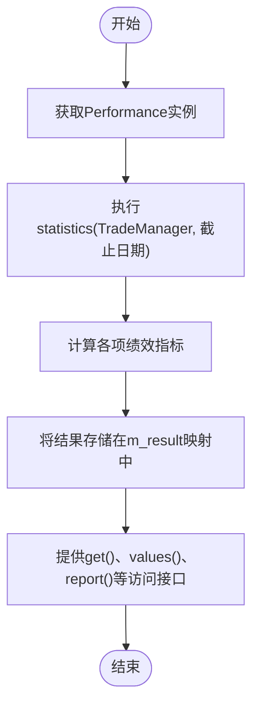

# 回测系统

<cite>
**本文档引用的文件**   
- [TradeManager.h](file://hikyuu_cpp/hikyuu/trade_manage/TradeManager.h)
- [TradeManager.cpp](file://hikyuu_cpp/hikyuu/trade_manage/TradeManager.cpp)
- [TradeCostBase.h](file://hikyuu_cpp/hikyuu/trade_manage/TradeCostBase.h)
- [TC_Zero.h](file://hikyuu_cpp/hikyuu/trade_manage/crt/TC_Zero.h)
- [TC_FixedA.h](file://hikyuu_cpp/hikyuu/trade_manage/crt/TC_FixedA.h)
- [PositionRecord.h](file://hikyuu_cpp/hikyuu/trade_manage/PositionRecord.h)
- [FundsRecord.h](file://hikyuu_cpp/hikyuu/trade_manage/FundsRecord.h)
- [TradeRecord.h](file://hikyuu_cpp/hikyuu/trade_manage/TradeRecord.h)
- [Performance.h](file://hikyuu_cpp/hikyuu/trade_manage/Performance.h)
- [Performance.cpp](file://hikyuu_cpp/hikyuu/trade_manage/Performance.cpp)
</cite>

## 目录
1. [引言](#引言)
2. [核心组件](#核心组件)
3. [回测初始化过程](#回测初始化过程)
4. [数据迭代循环与订单执行逻辑](#数据迭代循环与订单执行逻辑)
5. [交易成本模型配置](#交易成本模型配置)
6. [持仓、资金与交易记录更新机制](#持仓资金与交易记录更新机制)
7. [回测结果获取与可视化分析](#回测结果获取与可视化分析)
8. [性能优化建议](#性能优化建议)

## 引言
回测系统是量化投资策略开发中的核心工具，用于在历史数据上模拟交易执行过程，评估策略的绩效表现。本技术文档深入解析Hikyuu回测系统的核心组件——TradeManager，详细阐述其在模拟交易执行和绩效统计中的核心作用。文档将全面介绍回测的初始化过程、数据迭代循环、订单执行逻辑，以及如何配置交易成本模型。同时，文档还将说明回测过程中持仓、资金和交易记录的更新机制，指导用户如何运行回测、获取结果并进行可视化分析，最后提供利用C++核心加速计算的性能优化建议。

## 核心组件

TradeManager是Hikyuu回测系统的核心组件，负责管理模拟账户的交易记录及资金使用情况。它继承自TradeManagerBase，实现了对交易、持仓、资金等核心数据的全面管理。通过TradeManager，可以执行买入、卖出、卖空、回补等交易操作，并实时跟踪账户的资产状况。该组件还提供了丰富的接口，用于查询交易记录、持仓情况、资金详情以及计算各种绩效指标。

**Section sources**
- [TradeManager.h](file://hikyuu_cpp/hikyuu/trade_manage/TradeManager.h#L24-L494)
- [TradeManager.cpp](file://hikyuu_cpp/hikyuu/trade_manage/TradeManager.cpp#L23-L800)

## 回测初始化过程

回测的初始化过程始于创建一个TradeManager实例。在构造函数中，需要指定账户的建立日期、初始资金、交易成本模型（TradeCost）以及账户名称。初始资金将作为账户的起始现金，同时会生成一条初始交易记录（BUSINESS_INIT），记录初始资金的存入。此外，系统会设置一些默认参数，如计算精度（默认为2位小数）、是否支持融资融券等。初始化完成后，TradeManager即进入待命状态，准备接收后续的交易信号并执行模拟交易。

**Diagram sources **
- [TradeManager.h](file://hikyuu_cpp/hikyuu/trade_manage/TradeManager.h#L39-L41)
- [TradeManager.cpp](file://hikyuu_cpp/hikyuu/trade_manage/TradeManager.cpp#L83-L103)

## 数据迭代循环与订单执行逻辑

回测的数据迭代循环是整个模拟过程的核心。系统会按时间顺序遍历历史K线数据，对于每一个交易日，根据策略生成的交易信号（如买入、卖出请求）来执行相应的订单。订单执行逻辑由TradeManager的buy、sell、sellShort、buyShort等方法实现。在执行交易前，系统会进行一系列检查，例如交易日期必须大于等于上次交易日期、交易数量需在最小和最大交易单位之间等。交易成功后，系统会根据实际成交价格和数量，计算交易成本，并更新现金、持仓和交易记录。

**Diagram sources **
- [TradeManager.h](file://hikyuu_cpp/hikyuu/trade_manage/TradeManager.h#L231-L252)
- [TradeManager.cpp](file://hikyuu_cpp/hikyuu/trade_manage/TradeManager.cpp#L765-L800)

## 交易成本模型配置

交易成本模型（TradeCost）用于计算每次交易产生的费用，如佣金、印花税、过户费等。Hikyuu提供了多种预定义的交易成本模型。TC_Zero表示零成本模型，即不计算任何交易费用。TC_FixedA是针对沪深A股的固定成本模型，其计算规则如下：对于上证交易所，买入时计算佣金和过户费，卖出时计算佣金、过户费和印花税；对于深证交易所，买入时仅计算佣金，卖出时计算佣金和印花税。用户可以通过参数配置佣金比例、最低佣金、印花税率、过户费率和最低过户费等。

**Diagram sources **
- [TradeCostBase.h](file://hikyuu_cpp/hikyuu/trade_manage/TradeCostBase.h#L22-L179)
- [TC_Zero.h](file://hikyuu_cpp/hikyuu/trade_manage/crt/TC_Zero.h#L16-L25)
- [TC_FixedA.h](file://hikyuu_cpp/hikyuu/trade_manage/crt/TC_FixedA.h#L16-L45)

## 持仓、资金与交易记录更新机制

在回测过程中，TradeManager通过一系列数据结构来维护账户状态。持仓记录（PositionRecord）包含交易对象、建仓日期、当前持仓数量、累计买入资金、累计交易成本等信息。资金记录（FundsRecord）则包含当前现金、多头市值、空头市值、投入本金等，用于计算总资产、净资产和收益。每次交易执行后，系统都会更新这些记录。例如，买入操作会增加持仓数量，减少现金；卖出操作会减少持仓数量，增加现金。所有交易操作都会被记录在交易记录（TradeRecord）列表中，包括交易日期、业务类型、价格、数量、成本和现金余额等。

**Diagram sources **
- [PositionRecord.h](file://hikyuu_cpp/hikyuu/trade_manage/PositionRecord.h#L21-L120)
- [FundsRecord.h](file://hikyuu_cpp/hikyuu/trade_manage/FundsRecord.h#L21-L110)
- [TradeRecord.h](file://hikyuu_cpp/hikyuu/trade_manage/TradeRecord.h#L59-L163)

## 回测结果获取与可视化分析

回测完成后，可以通过Performance类来获取和分析回测结果。Performance类提供了statistics方法，根据TradeManager的交易记录，统计截至指定时刻的系统绩效。统计结果包含账户初始金额、累计投入本金、当前总资产、已平仓净利润总额、帐户年复合收益率、最大回撤等数十项指标。用户可以通过get方法按名称获取具体指标值，或通过report方法获取格式化的文本报告。此外，TradeManager还提供了getFundsCurve、getProfitCurve等方法，用于获取资产净值曲线和收益曲线，便于进行可视化分析。

**Diagram sources **
- [Performance.h](file://hikyuu_cpp/hikyuu/trade_manage/Performance.h#L22-L87)
- [Performance.cpp](file://hikyuu_cpp/hikyuu/trade_manage/Performance.cpp#L1-L200)

## 性能优化建议

为了提高回测性能，Hikyuu系统充分利用了C++核心进行加速计算。关键的计算密集型操作，如指标计算、信号生成、交易成本计算和绩效统计，都在C++层面实现，避免了Python的解释器开销。此外，系统采用了高效的内存管理和数据结构，如使用vector和map来存储交易记录和持仓信息。对于大规模回测，建议使用编译后的C++核心库，并合理配置系统参数，如减少不必要的日志输出、使用合适的数据精度等，以进一步提升计算效率。