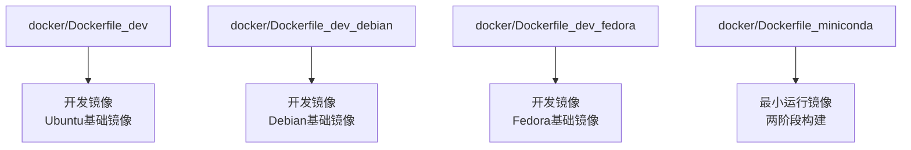
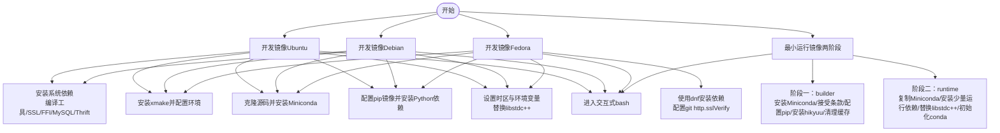
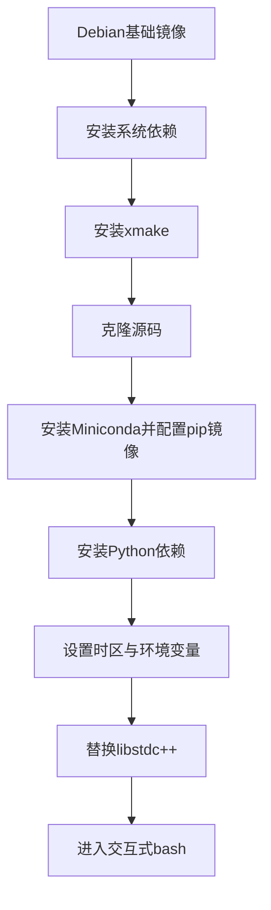
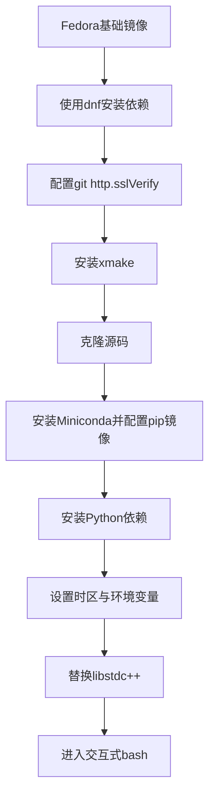
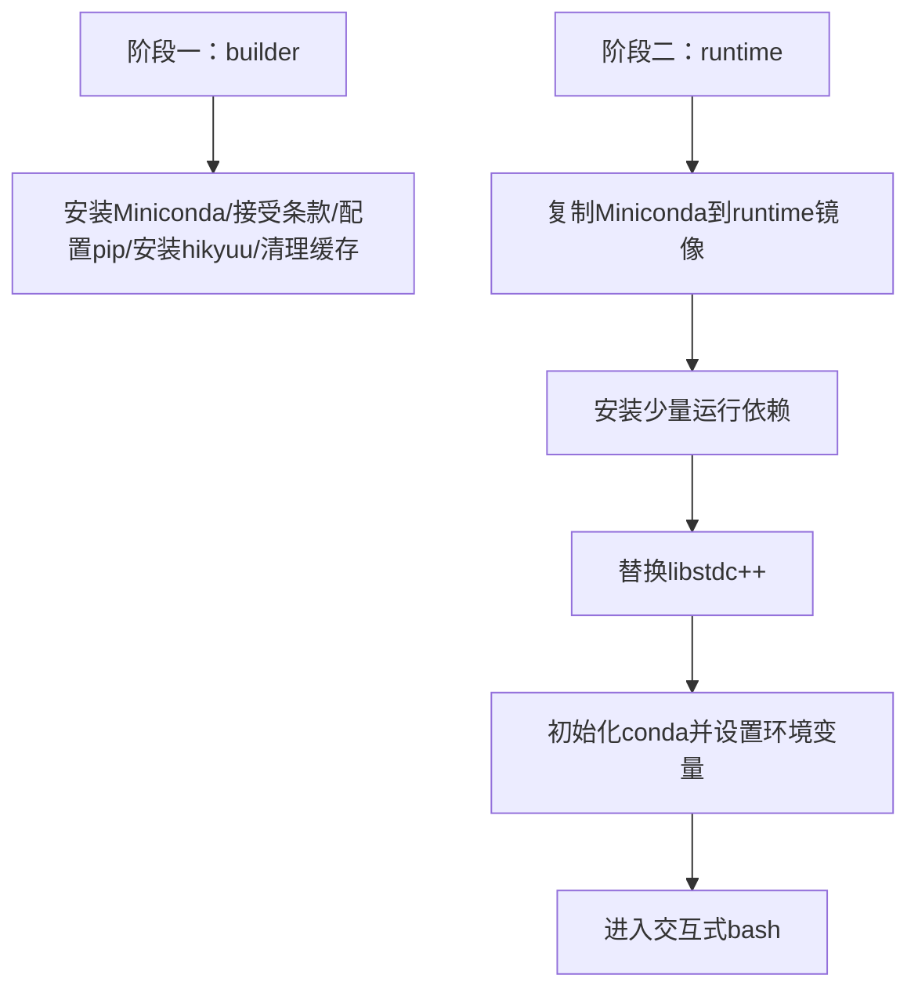
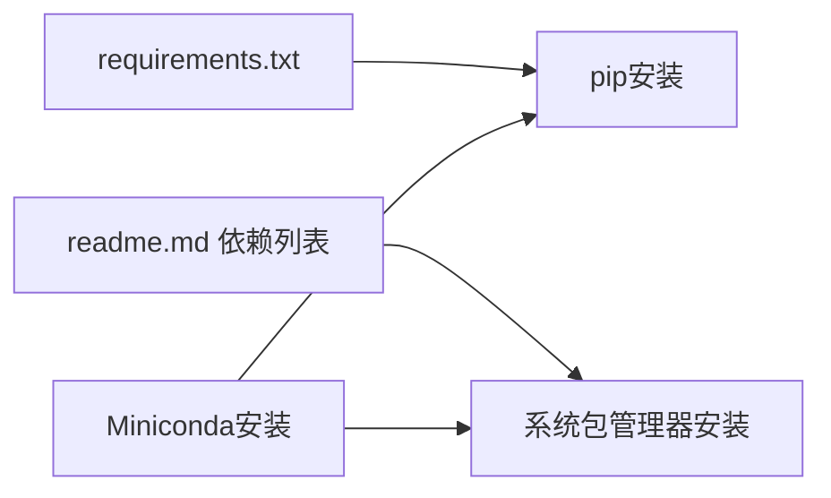

# Docker部署

<cite>
**本文引用的文件**
- [docker/Dockerfile_dev](file://docker/Dockerfile_dev)
- [docker/Dockerfile_dev_debian](file://docker/Dockerfile_dev_debian)
- [docker/Dockerfile_dev_fedora](file://docker/Dockerfile_dev_fedora)
- [docker/Dockerfile_miniconda](file://docker/Dockerfile_miniconda)
- [requirements.txt](file://requirements.txt)
- [readme.md](file://readme.md)
</cite>

## 目录
1. [简介](#简介)
2. [项目结构](#项目结构)
3. [核心组件](#核心组件)
4. [架构总览](#架构总览)
5. [详细组件分析](#详细组件分析)
6. [依赖关系分析](#依赖关系分析)
7. [性能考量](#性能考量)
8. [故障排查指南](#故障排查指南)
9. [结论](#结论)
10. [附录](#附录)

## 简介
本指南围绕仓库内的Dockerfile系列，提供一套完整的Docker部署方案，覆盖开发与运行两种环境的镜像构建、镜像差异对比、构建命令与参数建议、数据卷挂载、网络配置、容器生命周期管理、镜像体积优化、依赖缓存策略与安全配置等最佳实践，并给出常见问题的解决方案。读者无需深入理解底层实现细节即可完成从构建到运行的全流程操作。

## 项目结构
仓库内与Docker部署直接相关的核心文件位于 docker/ 目录，包含四类Dockerfile：
- 开发环境镜像（Ubuntu/Debian/Fedora三套，均包含编译工具链、Miniconda、源码克隆与依赖安装）
- 最小化运行镜像（两阶段构建，仅保留运行所需）

此外，根目录的 requirements.txt 提供了Python依赖清单；readme.md 提供了项目背景与依赖说明，有助于理解镜像构建的目标与范围。

图表来源
- [docker/Dockerfile_dev](file://docker/Dockerfile_dev#L1-L79)
- [docker/Dockerfile_dev_debian](file://docker/Dockerfile_dev_debian#L1-L78)
- [docker/Dockerfile_dev_fedora](file://docker/Dockerfile_dev_fedora#L1-L70)
- [docker/Dockerfile_miniconda](file://docker/Dockerfile_miniconda#L1-L86)

章节来源
- [docker/Dockerfile_dev](file://docker/Dockerfile_dev#L1-L79)
- [docker/Dockerfile_dev_debian](file://docker/Dockerfile_dev_debian#L1-L78)
- [docker/Dockerfile_dev_fedora](file://docker/Dockerfile_dev_fedora#L1-L70)
- [docker/Dockerfile_miniconda](file://docker/Dockerfile_miniconda#L1-L86)
- [requirements.txt](file://requirements.txt#L1-L22)
- [readme.md](file://readme.md#L89-L115)

## 核心组件
- 开发镜像（Ubuntu版）
  - 基础镜像：Ubuntu 24.04
  - 特点：安装编译工具链、SSL/FFI/MySQL/Thrift等系统依赖，安装xmake，克隆源码，安装Miniconda并配置pip镜像，安装Python依赖，设置时区与环境变量，替换libstdc++，进入交互式bash
  - 适用场景：需要在容器内进行源码编译、调试与开发的场景
  - 优点：集成度高，开箱即用
  - 缺点：镜像体积较大，包含编译工具链

- 开发镜像（Debian版）
  - 基础镜像：Debian trixie
  - 特点：与Ubuntu版类似，但基础系统不同，适合偏好Debian生态的用户
  - 适用场景：Debian发行版偏好者
  - 优点：与Ubuntu版一致的开发体验
  - 缺点：镜像体积较大，包含编译工具链

- 开发镜像（Fedora版）
  - 基础镜像：Fedora latest
  - 特点：使用dnf安装依赖，配置git http.sslVerify，安装xmake，克隆源码，安装Miniconda并配置pip镜像，安装Python依赖，设置时区与环境变量，替换libstdc++
  - 适用场景：偏好Fedora生态或需要最新软件栈的用户
  - 优点：系统更新及时
  - 缺点：镜像体积较大，包含编译工具链

- 最小运行镜像（两阶段构建）
  - 阶段一（builder）：安装Miniconda、接受Anaconda服务条款、配置pip镜像、安装hikyuu与常用conda包、清理缓存与冗余文件
  - 阶段二（runtime）：从builder复制Miniconda到干净Ubuntu基础镜像，仅安装少量运行期依赖，替换libstdc++，初始化conda并设置环境变量
  - 适用场景：生产运行环境，追求镜像体积与启动速度
  - 优点：镜像体积小，启动快
  - 缺点：不包含编译工具链，无法在容器内二次编译

章节来源
- [docker/Dockerfile_dev](file://docker/Dockerfile_dev#L1-L79)
- [docker/Dockerfile_dev_debian](file://docker/Dockerfile_dev_debian#L1-L78)
- [docker/Dockerfile_dev_fedora](file://docker/Dockerfile_dev_fedora#L1-L70)
- [docker/Dockerfile_miniconda](file://docker/Dockerfile_miniconda#L1-L86)

## 架构总览
下图展示了四类Dockerfile的构建流程与关键步骤，便于对比不同镜像的差异与适用场景。

图表来源
- [docker/Dockerfile_dev](file://docker/Dockerfile_dev#L1-L79)
- [docker/Dockerfile_dev_debian](file://docker/Dockerfile_dev_debian#L1-L78)
- [docker/Dockerfile_dev_fedora](file://docker/Dockerfile_dev_fedora#L1-L70)
- [docker/Dockerfile_miniconda](file://docker/Dockerfile_miniconda#L1-L86)

## 详细组件分析

### 开发镜像（Ubuntu版）分析
- 基础镜像与系统依赖
  - 使用Ubuntu 24.04作为基础镜像，安装编译工具链、SSL、FFI、MySQL、Thrift等系统依赖，便于后续编译与运行。
- Miniconda安装与pip镜像
  - 根据TARGETARCH选择合适的Miniconda安装包，接受Anaconda服务条款，配置pip镜像源，升级pip，安装ipython与Python依赖清单中的包。
- 环境变量与库替换
  - 设置时区、LD_LIBRARY_PATH、PYTHONPATH；替换Miniconda内置libstdc++为系统库，确保兼容性。
- 进入交互式环境
  - 初始化conda并设置bash登录行为，进入交互式bash以便开发调试。

图表来源
- [docker/Dockerfile_dev](file://docker/Dockerfile_dev#L1-L79)

章节来源
- [docker/Dockerfile_dev](file://docker/Dockerfile_dev#L1-L79)
- [requirements.txt](file://requirements.txt#L1-L22)

### 开发镜像（Debian版）分析
- 基础镜像与系统依赖
  - 使用Debian trixie作为基础镜像，安装编译工具链与必要系统依赖。
- Miniconda安装与pip镜像
  - 与Ubuntu版相同的Miniconda安装流程与pip镜像配置。
- 环境变量与库替换
  - 设置时区、LD_LIBRARY_PATH、PYTHONPATH；替换Miniconda内置libstdc++为系统库。
- 进入交互式环境
  - 初始化conda并设置bash登录行为，进入交互式bash。

图表来源
- [docker/Dockerfile_dev_debian](file://docker/Dockerfile_dev_debian#L1-L78)

章节来源
- [docker/Dockerfile_dev_debian](file://docker/Dockerfile_dev_debian#L1-L78)
- [requirements.txt](file://requirements.txt#L1-L22)

### 开发镜像（Fedora版）分析
- 基础镜像与系统依赖
  - 使用Fedora latest作为基础镜像，使用dnf安装编译工具链与必要系统依赖；配置git http.sslVerify。
- Miniconda安装与pip镜像
  - 与Ubuntu/Debian版相同的Miniconda安装流程与pip镜像配置。
- 环境变量与库替换
  - 设置时区、LD_LIBRARY_PATH、PYTHONPATH；替换Miniconda内置libstdc++为系统库。
- 进入交互式环境
  - 初始化conda并设置bash登录行为，进入交互式bash。

图表来源
- [docker/Dockerfile_dev_fedora](file://docker/Dockerfile_dev_fedora#L1-L70)

章节来源
- [docker/Dockerfile_dev_fedora](file://docker/Dockerfile_dev_fedora#L1-L70)
- [requirements.txt](file://requirements.txt#L1-L22)

### 最小运行镜像（两阶段）分析
- 阶段一（builder）
  - 安装Miniconda、接受Anaconda服务条款、配置pip镜像、安装hikyuu与常用conda包、清理缓存与冗余文件。
- 阶段二（runtime）
  - 从builder复制Miniconda到干净Ubuntu基础镜像，仅安装少量运行期依赖，替换libstdc++，初始化conda并设置环境变量。
- 进入交互式环境
  - 初始化conda并设置bash登录行为，进入交互式bash。

图表来源
- [docker/Dockerfile_miniconda](file://docker/Dockerfile_miniconda#L1-L86)

章节来源
- [docker/Dockerfile_miniconda](file://docker/Dockerfile_miniconda#L1-L86)
- [requirements.txt](file://requirements.txt#L1-L22)

## 依赖关系分析
- Python依赖来源
  - requirements.txt 中列出的依赖项是镜像构建过程中通过pip安装的关键包，包括numpy、pandas、matplotlib、PySide6、SQLAlchemy、mysql-connector-python、clickhouse-connect等。
- C++与第三方库
  - readme.md 中列举了大量C++依赖（如xmake、hdf5、mysql client、sqlite、boost、pybind11、ta-lib、clickhouse等），这些在开发镜像中通过系统包管理器安装，确保编译与运行所需的头文件与库可用。
- Miniconda与pip镜像
  - 所有开发镜像均配置了国内pip镜像源，提升安装速度与稳定性；最小运行镜像同样配置了pip镜像源并安装hikyuu包。

图表来源
- [requirements.txt](file://requirements.txt#L1-L22)
- [readme.md](file://readme.md#L89-L115)
- [docker/Dockerfile_dev](file://docker/Dockerfile_dev#L1-L79)
- [docker/Dockerfile_dev_debian](file://docker/Dockerfile_dev_debian#L1-L78)
- [docker/Dockerfile_dev_fedora](file://docker/Dockerfile_dev_fedora#L1-L70)
- [docker/Dockerfile_miniconda](file://docker/Dockerfile_miniconda#L1-L86)

章节来源
- [requirements.txt](file://requirements.txt#L1-L22)
- [readme.md](file://readme.md#L89-L115)

## 性能考量
- 镜像体积优化
  - 最小运行镜像采用两阶段构建，仅复制Miniconda及其安装包，避免携带编译工具链，显著降低镜像体积。
  - 开发镜像包含编译工具链与系统依赖，体积较大，适合开发阶段使用。
  - 在所有镜像构建中均执行了缓存清理与冗余文件删除，减少镜像体积。
- 依赖缓存策略
  - 使用apt/dnf/yum等包管理器的缓存清理命令，避免将缓存写入镜像层。
  - pip安装时使用“无缓存”选项，减少镜像层大小。
- 启动与运行性能
  - 最小运行镜像仅安装少量运行期依赖，启动更快。
  - 通过替换Miniconda内置libstdc++为系统库，减少潜在的库冲突，提高运行稳定性。

章节来源
- [docker/Dockerfile_dev](file://docker/Dockerfile_dev#L1-L79)
- [docker/Dockerfile_dev_debian](file://docker/Dockerfile_dev_debian#L1-L78)
- [docker/Dockerfile_dev_fedora](file://docker/Dockerfile_dev_fedora#L1-L70)
- [docker/Dockerfile_miniconda](file://docker/Dockerfile_miniconda#L1-L86)

## 故障排查指南
- 不支持的架构
  - 当TARGETARCH既不是amd64也不是arm64时，镜像构建会报错退出。请确认构建架构参数正确。
  - 参考路径：[docker/Dockerfile_dev](file://docker/Dockerfile_dev#L43-L49)、[docker/Dockerfile_dev_debian](file://docker/Dockerfile_dev_debian#L42-L48)、[docker/Dockerfile_dev_fedora](file://docker/Dockerfile_dev_fedora#L34-L40)、[docker/Dockerfile_miniconda](file://docker/Dockerfile_miniconda#L22-L28)
- Miniconda服务条款未接受
  - 必须在conda install之前接受Anaconda服务条款，否则安装会失败。镜像中已显式调用接受命令。
  - 参考路径：[docker/Dockerfile_dev](file://docker/Dockerfile_dev#L52-L55)、[docker/Dockerfile_dev_debian](file://docker/Dockerfile_dev_debian#L52-L55)、[docker/Dockerfile_dev_fedora](file://docker/Dockerfile_dev_fedora#L44-L47)、[docker/Dockerfile_miniconda](file://docker/Dockerfile_miniconda#L33-L35)
- pip镜像源连接失败
  - 若pip镜像源不可用，可临时切换为默认源或更换镜像源。镜像中已配置国内镜像源。
  - 参考路径：[docker/Dockerfile_dev](file://docker/Dockerfile_dev#L54-L57)、[docker/Dockerfile_dev_debian](file://docker/Dockerfile_dev_debian#L54-L57)、[docker/Dockerfile_dev_fedora](file://docker/Dockerfile_dev_fedora#L46-L48)、[docker/Dockerfile_miniconda](file://docker/Dockerfile_miniconda#L38-L41)
- 库替换失败
  - 若替换Miniconda内置libstdc++失败，检查系统库路径是否可用，并确认替换逻辑正确。
  - 参考路径：[docker/Dockerfile_dev](file://docker/Dockerfile_dev#L71-L76)、[docker/Dockerfile_dev_debian](file://docker/Dockerfile_dev_debian#L69-L75)、[docker/Dockerfile_dev_fedora](file://docker/Dockerfile_dev_fedora#L61-L65)、[docker/Dockerfile_miniconda](file://docker/Dockerfile_miniconda#L77-L80)
- Fedora环境下的git SSL验证
  - 若遇到git SSL验证问题，镜像中已配置http.sslVerify=false，可继续使用HTTPS克隆。
  - 参考路径：[docker/Dockerfile_dev_fedora](file://docker/Dockerfile_dev_fedora#L20-L21)

章节来源
- [docker/Dockerfile_dev](file://docker/Dockerfile_dev#L43-L49)
- [docker/Dockerfile_dev_debian](file://docker/Dockerfile_dev_debian#L42-L48)
- [docker/Dockerfile_dev_fedora](file://docker/Dockerfile_dev_fedora#L20-L21)
- [docker/Dockerfile_miniconda](file://docker/Dockerfile_miniconda#L33-L41)
- [docker/Dockerfile_dev](file://docker/Dockerfile_dev#L71-L76)
- [docker/Dockerfile_dev_debian](file://docker/Dockerfile_dev_debian#L69-L75)
- [docker/Dockerfile_dev_fedora](file://docker/Dockerfile_dev_fedora#L61-L65)

## 结论
- 若需在容器内进行源码编译与开发，推荐使用开发镜像（Ubuntu/Debian/Fedora任选其一），它们包含完整的编译工具链与依赖，便于快速调试。
- 若仅需运行Hikyuu应用，推荐使用最小运行镜像（两阶段构建），它体积小、启动快，适合生产部署。
- 在构建过程中，务必关注架构参数、pip镜像源可用性、Miniconda服务条款接受与库替换等关键步骤，以避免常见问题。

## 附录

### 构建命令与参数建议
- 构建开发镜像（Ubuntu）
  - 命令示例：docker build -f docker/Dockerfile_dev -t hikyuu-dev:ubuntu .
  - 参数建议：添加 --no-cache 以避免缓存干扰；根据需要设置 --build-arg TARGETARCH 指定架构。
  - 参考路径：[docker/Dockerfile_dev](file://docker/Dockerfile_dev#L1-L79)

- 构建开发镜像（Debian）
  - 命令示例：docker build -f docker/Dockerfile_dev_debian -t hikyuu-dev:debian .
  - 参数建议：同上。
  - 参考路径：[docker/Dockerfile_dev_debian](file://docker/Dockerfile_dev_debian#L1-L78)

- 构建开发镜像（Fedora）
  - 命令示例：docker build -f docker/Dockerfile_dev_fedora -t hikyuu-dev:fedora .
  - 参数建议：同上。
  - 参考路径：[docker/Dockerfile_dev_fedora](file://docker/Dockerfile_dev_fedora#L1-L70)

- 构建最小运行镜像
  - 命令示例：docker build -f docker/Dockerfile_miniconda -t hikyuu-runtime .
  - 参数建议：同上。
  - 参考路径：[docker/Dockerfile_miniconda](file://docker/Dockerfile_miniconda#L1-L86)

### 数据卷挂载、网络与容器生命周期
- 数据卷挂载
  - 将宿主机的数据目录映射到容器内，便于持久化数据与共享配置。例如：-v /host/data:/app/data
  - 参考路径：[docker/Dockerfile_miniconda](file://docker/Dockerfile_miniconda#L62-L85)（设置工作目录与环境变量）
- 网络配置
  - 默认桥接网络即可满足大多数场景；若需访问外部服务，确保容器具备外网访问权限。
- 容器生命周期
  - 启动：docker run -it --rm hikyuu-runtime bash -l
  - 停止：容器内按Ctrl+D或exit退出，或docker stop <container-id>
  - 参考路径：[docker/Dockerfile_miniconda](file://docker/Dockerfile_miniconda#L86-L86)

### 最佳实践
- 镜像大小优化
  - 使用两阶段构建（最小运行镜像）；在安装依赖后清理缓存与冗余文件。
  - 参考路径：[docker/Dockerfile_miniconda](file://docker/Dockerfile_miniconda#L48-L54)
- 依赖缓存策略
  - pip安装时使用“无缓存”选项；包管理器安装后立即清理缓存。
  - 参考路径：[docker/Dockerfile_dev](file://docker/Dockerfile_dev#L57-L60)、[docker/Dockerfile_miniconda](file://docker/Dockerfile_miniconda#L38-L41)
- 安全配置
  - 使用国内镜像源提升稳定性；在Fedora环境下配置git http.sslVerify=false以避免SSL问题。
  - 参考路径：[docker/Dockerfile_dev_fedora](file://docker/Dockerfile_dev_fedora#L20-L21)