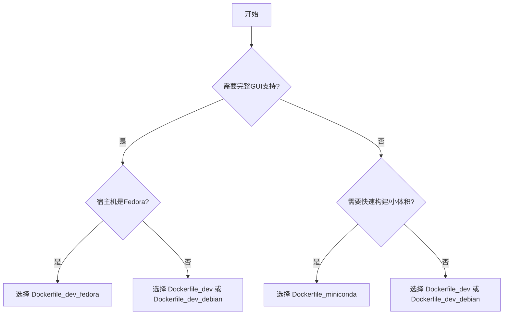

# 环境对比与选型

<cite>
**本文档引用的文件**  
- [Dockerfile_dev](file://docker/Dockerfile_dev)
- [Dockerfile_dev_debian](file://docker/Dockerfile_dev_debian)
- [Dockerfile_dev_fedora](file://docker/Dockerfile_dev_fedora)
- [Dockerfile_miniconda](file://docker/Dockerfile_miniconda)
- [requirements.txt](file://requirements.txt)
- [readme.md](file://readme.md)
</cite>

## 目录
1. [简介](#简介)
2. [基础操作系统对比](#基础操作系统对比)
3. [预装依赖库分析](#预装依赖库分析)
4. [镜像大小与构建速度](#镜像大小与构建速度)
5. [安全性考量](#安全性考量)
6. [适用场景分析](#适用场景分析)
7. [选型决策树](#选型决策树)
8. [性能基准测试建议](#性能基准测试建议)
9. [资源消耗监控方法](#资源消耗监控方法)
10. [结论](#结论)

## 简介
Hikyuu量化框架提供了四种Docker环境配置，旨在满足不同开发和部署需求。这些环境基于不同的基础操作系统，包括Ubuntu、Debian、Fedora和Miniconda，为用户提供多样化的选择。本指南将系统性地比较这四种Docker环境的特性，帮助用户根据其具体需求做出最佳选择。Hikyuu框架本身是一个基于C++/Python的开源量化交易研究框架，专注于交易模型开发、极速计算引擎、高效回测框架及实盘拓展能力。

**文档来源**
- [readme.md](file://readme.md)

## 基础操作系统对比
四种Docker环境分别基于不同的Linux发行版和Python发行版，这直接影响了其兼容性、包管理和系统特性。

- **Dockerfile_dev**: 基于Ubuntu 24.04，这是一个长期支持（LTS）版本，以其稳定性和广泛的社区支持而闻名。它使用`apt-get`作为包管理器，适合需要稳定生产环境的用户。
- **Dockerfile_dev_debian**: 基于Debian trixie，这是一个以稳定和严谨著称的发行版。它同样使用`apt-get`，与Ubuntu有很好的兼容性，但更新周期更长，适合追求极致稳定性的用户。
- **Dockerfile_dev_fedora**: 基于Fedora最新版，这是一个面向前沿技术的发行版，使用`dnf`作为包管理器。它能提供最新的软件包，适合在Fedora主机上进行原生开发调试的用户。
- **Dockerfile_miniconda**: 基于Ubuntu 24.04，但其核心是Miniconda Python发行版。这种设计将操作系统与Python环境分离，提供了极高的可移植性。

**Section sources**
- [Dockerfile_dev](file://docker/Dockerfile_dev#L3)
- [Dockerfile_dev_debian](file://docker/Dockerfile_dev_debian#L3)
- [Dockerfile_dev_fedora](file://docker/Dockerfile_dev_fedora#L2)
- [Dockerfile_miniconda](file://docker/Dockerfile_miniconda#L3)

## 预装依赖库分析
所有环境都预装了Hikyuu框架运行所需的核心依赖库，但安装方式和范围有所不同。

| 环境 | 核心依赖库 | 安装方式 | GUI支持 |
| :--- | :--- | :--- | :--- |
| Dockerfile_dev | numpy, pandas, matplotlib, PySide6, bokeh, akshare等 | 通过`pip`和`conda`安装`requirements.txt`中的所有依赖 | 完整支持 |
| Dockerfile_dev_debian | 同上 | 同上 | 完整支持 |
| Dockerfile_dev_fedora | 同上 | 同上 | 完整支持 |
| Dockerfile_miniconda | hikyuu, ipython, numpy, pandas等常用包 | 仅通过`pip`安装`hikyuu`包及其直接依赖 | 有限支持 |

从`requirements.txt`文件可以看出，Hikyuu依赖于一系列强大的Python库，如`numpy`用于数值计算，`pandas`用于数据处理，`matplotlib`和`bokeh`用于数据可视化，`PySide6`用于GUI开发。`Dockerfile_dev*`系列环境通过`python -m pip install --no-cache-dir -r hikyuu/requirements.txt`命令安装了所有这些依赖，确保了完整的功能集。而`Dockerfile_miniconda`则通过`pip install --no-cache-dir hikyuu`仅安装了Hikyuu包本身，更适合快速测试和CI/CD流水线。

**Section sources**
- [Dockerfile_dev](file://docker/Dockerfile_dev#L58-L59)
- [Dockerfile_dev_debian](file://docker/Dockerfile_dev_debian#L57-L58)
- [Dockerfile_dev_fedora](file://docker/Dockerfile_dev_fedora#L49-L50)
- [Dockerfile_miniconda](file://docker/Dockerfile_miniconda#L40-L41)
- [requirements.txt](file://requirements.txt#L1-L22)

## 镜像大小与构建速度
镜像大小和构建速度是评估Docker环境效率的关键指标。

- **镜像大小**: `Dockerfile_miniconda`由于采用多阶段构建（multi-stage build），只将必要的Miniconda环境复制到最终镜像中，因此生成的镜像最小，资源占用最少。而`Dockerfile_dev*`系列环境在单个阶段中构建，包含了编译工具和所有依赖，因此镜像体积较大。
- **构建速度**: `Dockerfile_miniconda`的构建速度最快，因为它只需要下载和安装Miniconda及Python包。`Dockerfile_dev*`系列环境需要先安装编译工具（如`build-essential`, `gcc`等），然后克隆源码并安装依赖，构建过程更长。

多阶段构建是`Dockerfile_miniconda`的一个显著优势，它通过在`builder`阶段完成所有繁重的编译和安装工作，然后在最终阶段只复制必要的运行时环境，从而实现了“瘦”镜像。

**Section sources**
- [Dockerfile_dev](file://docker/Dockerfile_dev#L2-L79)
- [Dockerfile_miniconda](file://docker/Dockerfile_miniconda#L3-L86)

## 安全性考量
安全性是Docker环境不可忽视的方面，主要体现在依赖来源和系统更新上。

所有环境都从可信的镜像源安装软件包，例如使用清华大学的镜像站`https://mirrors.tuna.tsinghua.edu.cn`来下载Miniconda和Python包，这既保证了下载速度，也确保了来源的可靠性。此外，所有环境在安装系统包后都会执行`rm -rf /var/lib/apt/lists/*`或`dnf clean all`来清理包列表缓存，减小了攻击面。

一个关键的安全特性是`Dockerfile_dev*`系列中对Miniconda的`libstdc++`库的处理。它们会将Miniconda自带的`libstdc++.so.6`替换为系统库，并通过`strings $MINICONDA_PATH/lib/libstdc++.so.6 | grep GLIBCXX_3.4.30`验证替换结果。这可以避免因Miniconda内部库过旧而带来的潜在安全漏洞，确保使用的是系统更新、更安全的C++运行时库。

**Section sources**
- [Dockerfile_dev](file://docker/Dockerfile_dev#L72-L76)
- [Dockerfile_dev_debian](file://docker/Dockerfile_dev_debian#L71-L75)
- [Dockerfile_dev_fedora](file://docker/Dockerfile_dev_fedora#L63-L65)

## 适用场景分析
根据不同的使用场景，每种Docker环境都有其最佳适用领域。

- **Dockerfile_miniconda**: 最适合**快速测试和CI/CD流水线**。其小体积和快速构建的特性使其成为自动化测试和持续集成的理想选择。由于只安装了核心包，它启动迅速，资源消耗低。
- **Dockerfile_dev_fedora**: 最适合在**Fedora主机上进行原生开发调试**。它使用`dnf`包管理器，与宿主机环境一致，可以无缝集成。对于习惯Fedora生态的开发者，这是最自然的选择。
- **Dockerfile_dev 和 Dockerfile_dev_debian**: 适合**全面的开发和研究环境**。它们预装了所有依赖，包括GUI库（如PySide6），可以直接运行Jupyter Notebook和所有可视化功能，是进行策略探索和回测的完整工作台。

**Section sources**
- [Dockerfile_miniconda](file://docker/Dockerfile_miniconda)
- [Dockerfile_dev_fedora](file://docker/Dockerfile_dev_fedora)

## 选型决策树
以下决策树帮助用户根据其操作系统偏好、资源限制和功能需求选择最合适的Dockerfile。

**Diagram sources**
- [Dockerfile_dev](file://docker/Dockerfile_dev)
- [Dockerfile_dev_debian](file://docker/Dockerfile_dev_debian)
- [Dockerfile_dev_fedora](file://docker/Dockerfile_dev_fedora)
- [Dockerfile_miniconda](file://docker/Dockerfile_miniconda)

## 性能基准测试建议
为了科学地评估不同环境的性能，建议进行以下基准测试：

1.  **数据加载测试**: 使用`hikyuu.data`模块加载A股全市场日K线数据，测量首次加载和后续加载的耗时。这可以评估I/O性能和缓存效率。
2.  **计算性能测试**: 在加载的数据上运行复杂的指标计算（如`EMA`、`MACD`），使用`hikyuu.util.spend_time`装饰器或`BENCHMARK_TIME`宏来测量计算耗时。
3.  **内存占用测试**: 在执行计算任务时，使用`docker stats`命令监控容器的内存使用峰值。

这些测试应使用Hikyuu框架内置的性能分析工具，如`spend_time`和`hku_benchmark`，以确保结果的准确性和可比性。

**Section sources**
- [hikyuu/util/mylog.py](file://hikyuu/util/mylog.py#L15-L26)
- [hikyuu_cpp/hikyuu/utilities/SpendTimer.h](file://hikyuu_cpp/hikyuu/utilities/SpendTimer.h)

## 资源消耗监控方法
监控Docker容器的资源消耗是优化和故障排查的关键。

- **CPU和内存**: 使用`docker stats <container_name>`命令可以实时查看容器的CPU使用率、内存使用量和网络I/O。
- **磁盘空间**: 使用`docker system df`查看Docker占用的总磁盘空间，使用`docker ps -s`查看特定容器的磁盘使用情况。
- **日志监控**: Hikyuu框架会将日志输出到`~/.hikyuu/hikyuu_py.log`文件。可以通过`docker exec -it <container_name> tail -f ~/.hikyuu/hikyuu_py.log`命令实时查看应用日志。

结合Docker原生命令和Hikyuu框架的日志系统，可以全面掌握环境的运行状态。

**Section sources**
- [hikyuu/util/mylog.py](file://hikyuu/util/mylog.py#L61-L68)

## 结论
Hikyuu框架提供的四种Docker环境各有侧重。`Dockerfile_miniconda`是轻量级和CI/CD场景的首选；`Dockerfile_dev_fedora`为Fedora用户提供最佳的原生开发体验；而`Dockerfile_dev`和`Dockerfile_dev_debian`则提供了功能最全面的开发环境。用户应根据自己的具体需求，参考本文档的决策树和性能建议，选择最适合的环境，以最大化开发效率和系统性能。