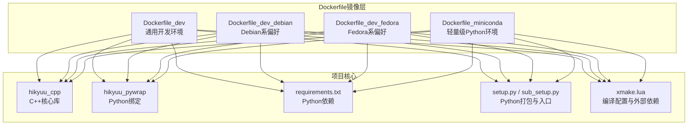
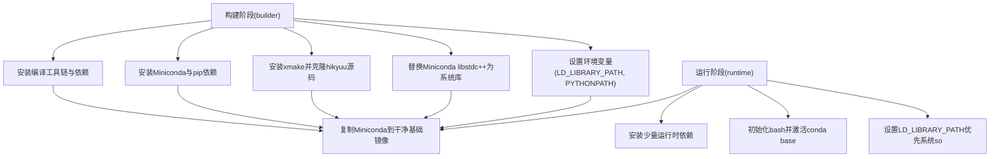
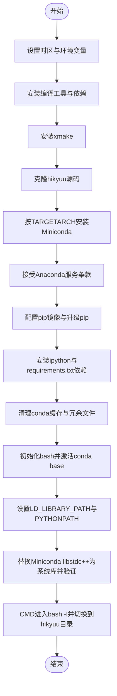
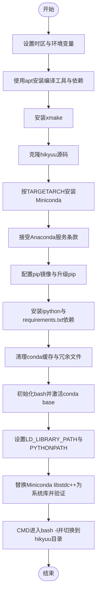
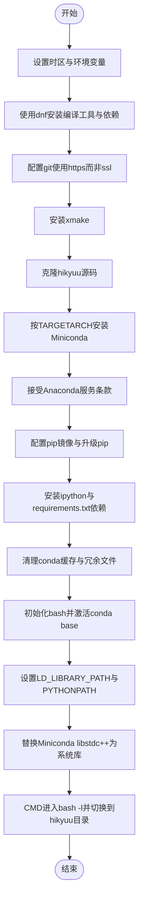
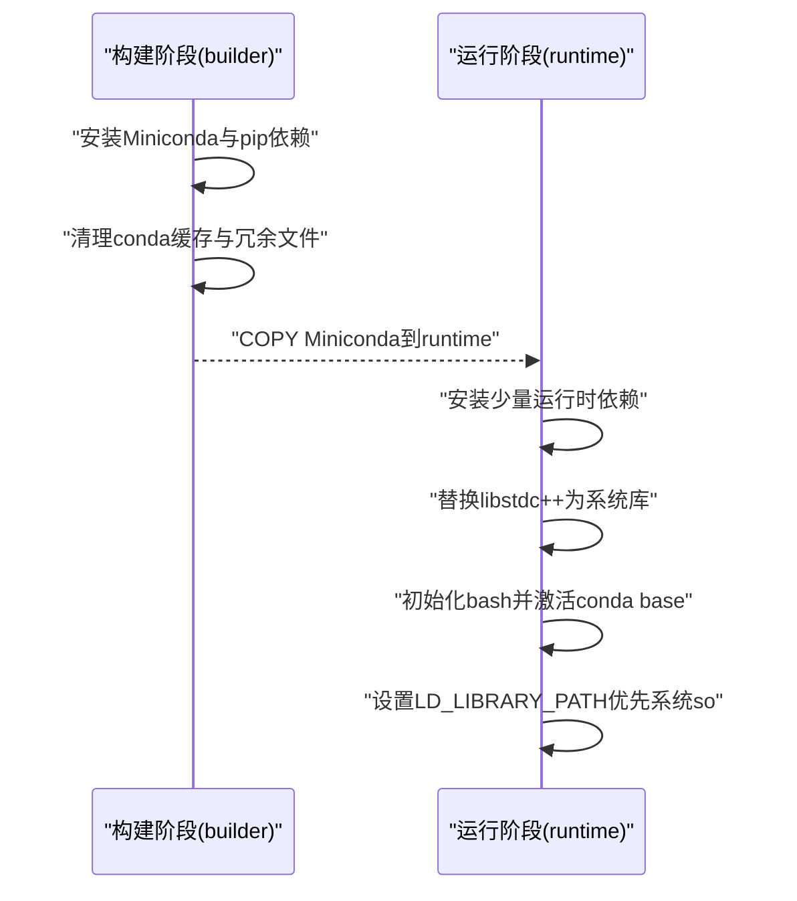
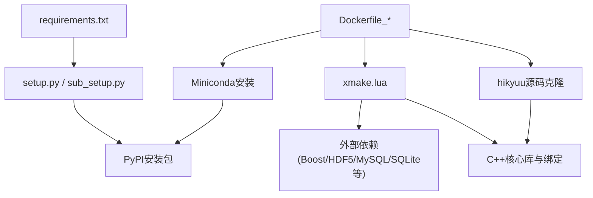

# 镜像构建

<cite>
**本文引用的文件列表**
- [docker/Dockerfile_dev](file://docker/Dockerfile_dev)
- [docker/Dockerfile_dev_debian](file://docker/Dockerfile_dev_debian)
- [docker/Dockerfile_dev_fedora](file://docker/Dockerfile_dev_fedora)
- [docker/Dockerfile_miniconda](file://docker/Dockerfile_miniconda)
- [requirements.txt](file://requirements.txt)
- [setup.py](file://setup.py)
- [sub_setup.py](file://sub_setup.py)
- [xmake.lua](file://xmake.lua)
- [readme.md](file://readme.md)
</cite>

## 目录
1. [简介](#简介)
2. [项目结构](#项目结构)
3. [核心组件](#核心组件)
4. [架构总览](#架构总览)
5. [详细组件分析](#详细组件分析)
6. [依赖关系分析](#依赖关系分析)
7. [性能考量](#性能考量)
8. [故障排查指南](#故障排查指南)
9. [结论](#结论)
10. [附录](#附录)

## 简介
本指南围绕仓库中的四个Dockerfile，系统讲解如何为Hikyuu量化框架构建适用于不同场景的容器镜像。四个Dockerfile分别面向：
- 通用开发环境：Dockerfile_dev
- Debian系偏好用户：Dockerfile_dev_debian
- Fedora系偏好用户：Dockerfile_dev_fedora
- 轻量级Python环境：Dockerfile_miniconda

我们将从基础镜像选择、依赖安装流程、环境配置差异入手，解释各镜像的适用场景，并给出docker build命令示例、标签命名规范、构建参数优化建议，以及如何利用多阶段构建与分层缓存提升构建效率，确保与hikyuu核心C++库的编译兼容性。

## 项目结构
仓库采用“核心C++库 + Python封装 + 交互工具”的三层结构，Dockerfile围绕这一结构进行分层与裁剪：
- 核心C++库与Python绑定位于hikyuu_cpp与hikyuu_pywrap目录
- Python侧安装包逻辑由setup.py与sub_setup.py负责
- 依赖清单由requirements.txt提供
- 构建系统使用xmake.lua定义编译选项与外部依赖

图表来源
- [docker/Dockerfile_dev](file://docker/Dockerfile_dev#L1-L79)
- [docker/Dockerfile_dev_debian](file://docker/Dockerfile_dev_debian#L1-L78)
- [docker/Dockerfile_dev_fedora](file://docker/Dockerfile_dev_fedora#L1-L70)
- [docker/Dockerfile_miniconda](file://docker/Dockerfile_miniconda#L1-L86)
- [requirements.txt](file://requirements.txt#L1-L22)
- [setup.py](file://setup.py#L1-L437)
- [sub_setup.py](file://sub_setup.py#L1-L136)
- [xmake.lua](file://xmake.lua#L1-L247)

章节来源
- [docker/Dockerfile_dev](file://docker/Dockerfile_dev#L1-L79)
- [docker/Dockerfile_dev_debian](file://docker/Dockerfile_dev_debian#L1-L78)
- [docker/Dockerfile_dev_fedora](file://docker/Dockerfile_dev_fedora#L1-L70)
- [docker/Dockerfile_miniconda](file://docker/Dockerfile_miniconda#L1-L86)
- [requirements.txt](file://requirements.txt#L1-L22)
- [setup.py](file://setup.py#L1-L437)
- [sub_setup.py](file://sub_setup.py#L1-L136)
- [xmake.lua](file://xmake.lua#L1-L247)

## 核心组件
- 通用开发环境镜像（Dockerfile_dev）
  - 基础镜像：Ubuntu 24.04
  - 目标：提供完整开发环境，包含编译工具链、数据库驱动、Miniconda、pip依赖、xmake、以及hikyuu源码克隆与安装
  - 关键点：安装libmysqlclient-dev、libthrift-dev；使用xmake安装依赖；Miniconda安装后替换libstdc++以兼容系统库；设置LD_LIBRARY_PATH与PYTHONPATH；初始化bash并自动激活conda base
- Debian系偏好镜像（Dockerfile_dev_debian）
  - 基础镜像：Debian trixie
  - 目标：与通用开发环境一致，但使用apt包管理器与Debian生态
  - 关键点：与通用镜像相同的依赖与安装流程，仅基础镜像不同
- Fedora系偏好镜像（Dockerfile_dev_fedora）
  - 基础镜像：Fedora latest
  - 目标：与通用开发环境一致，但使用dnf包管理器与Fedora生态
  - 关键点：安装gcc、gcc-c++、make、openssl-devel、libffi-devel、libgomp、binutils、readline-devel、git、mysql-devel、thrift-devel、zlib-ng-compat-static、cmake、automake、autoconf、libtool、pkgconf、pkgconfig、redhat-rpm-config、rpm-build等；替换libstdc++路径与通用镜像一致
- 轻量级Python环境镜像（Dockerfile_miniconda）
  - 多阶段构建：第一阶段安装Miniconda与pip依赖；第二阶段仅复制Miniconda到干净Ubuntu基础镜像，精简运行时依赖
  - 目标：最小化镜像体积，保留Miniconda与必要运行库，便于快速启动与部署
  - 关键点：两阶段COPY Miniconda；替换libstdc++；初始化bash并激活conda base；设置LD_LIBRARY_PATH优先加载系统so

章节来源
- [docker/Dockerfile_dev](file://docker/Dockerfile_dev#L1-L79)
- [docker/Dockerfile_dev_debian](file://docker/Dockerfile_dev_debian#L1-L78)
- [docker/Dockerfile_dev_fedora](file://docker/Dockerfile_dev_fedora#L1-L70)
- [docker/Dockerfile_miniconda](file://docker/Dockerfile_miniconda#L1-L86)

## 架构总览
四个Dockerfile均遵循“构建期安装+运行期精简”的思路，确保：
- 构建期：安装编译工具链、数据库驱动、Miniconda、pip依赖、xmake与hikyuu源码
- 运行期：仅保留必要的运行库与Miniconda，避免冗余文件
- 兼容性：统一替换Miniconda的libstdc++为系统库，解决ABI冲突
- 可移植性：通过TARGETARCH区分amd64与arm64，适配多架构

图表来源
- [docker/Dockerfile_dev](file://docker/Dockerfile_dev#L1-L79)
- [docker/Dockerfile_dev_debian](file://docker/Dockerfile_dev_debian#L1-L78)
- [docker/Dockerfile_dev_fedora](file://docker/Dockerfile_dev_fedora#L1-L70)
- [docker/Dockerfile_miniconda](file://docker/Dockerfile_miniconda#L1-L86)

## 详细组件分析

### 通用开发环境镜像（Dockerfile_dev）
- 基础镜像与工作目录
  - 使用Ubuntu 24.04作为构建基础镜像
  - 设置工作目录/app
- 时区与环境变量
  - 设置Asia/Shanghai时区
  - 定义MINICONDA_VERSION与MINICONDA_PATH
- 依赖安装
  - 安装编译工具链与常用开发库（build-essential、libssl-dev、libffi-dev、libgomp1、binutils、libreadline-dev、git、libmysqlclient-dev、libthrift-dev）
  - 安装xmake并通过官方脚本安装
  - 克隆hikyuu源码
- Miniconda与pip依赖
  - 根据TARGETARCH选择Miniconda安装包URL（amd64或arm64）
  - 接受Anaconda服务条款
  - 配置pip镜像源与升级pip
  - 安装ipython与requirements.txt中的依赖
  - 清理conda缓存与冗余文件
- 运行期配置
  - 初始化bash并自动激活conda base
  - 设置LD_LIBRARY_PATH与PYTHONPATH
  - 替换Miniconda的libstdc++为系统库并验证
  - CMD进入bash -l并切换到hikyuu目录

图表来源
- [docker/Dockerfile_dev](file://docker/Dockerfile_dev#L1-L79)

章节来源
- [docker/Dockerfile_dev](file://docker/Dockerfile_dev#L1-L79)
- [requirements.txt](file://requirements.txt#L1-L22)

### Debian系偏好镜像（Dockerfile_dev_debian）
- 基础镜像：Debian trixie
- 依赖安装：与通用镜像一致，使用apt包管理器
- Miniconda与pip依赖：与通用镜像一致
- 运行期配置：与通用镜像一致，替换libstdc++路径与通用镜像一致

图表来源
- [docker/Dockerfile_dev_debian](file://docker/Dockerfile_dev_debian#L1-L78)

章节来源
- [docker/Dockerfile_dev_debian](file://docker/Dockerfile_dev_debian#L1-L78)
- [requirements.txt](file://requirements.txt#L1-L22)

### Fedora系偏好镜像（Dockerfile_dev_fedora）
- 基础镜像：Fedora latest
- 依赖安装：使用dnf安装编译工具链与开发库（gcc、gcc-c++、make、openssl-devel、libffi-devel、libgomp、binutils、readline-devel、git、mysql-devel、thrift-devel、zlib-ng-compat-static、cmake、automake、autoconf、libtool、pkgconf、pkgconfig、redhat-rpm-config、rpm-build）
- Miniconda与pip依赖：与通用镜像一致
- 运行期配置：替换libstdc++路径与通用镜像一致

图表来源
- [docker/Dockerfile_dev_fedora](file://docker/Dockerfile_dev_fedora#L1-L70)

章节来源
- [docker/Dockerfile_dev_fedora](file://docker/Dockerfile_dev_fedora#L1-L70)
- [requirements.txt](file://requirements.txt#L1-L22)

### 轻量级Python环境镜像（Dockerfile_miniconda）
- 多阶段构建
  - 第一阶段：安装Miniconda、接受服务条款、配置pip镜像、安装hikyuu与ipython、清理缓存
  - 第二阶段：从builder复制Miniconda到干净Ubuntu基础镜像，安装少量运行时依赖，替换libstdc++，初始化bash并激活conda base，设置LD_LIBRARY_PATH优先系统so
- 适用场景：仅需Python运行环境，无需完整编译工具链

图表来源
- [docker/Dockerfile_miniconda](file://docker/Dockerfile_miniconda#L1-L86)

章节来源
- [docker/Dockerfile_miniconda](file://docker/Dockerfile_miniconda#L1-L86)

## 依赖关系分析
- Python依赖来源
  - requirements.txt提供Python包列表，包括numpy、pandas、matplotlib、seaborn、pytdx、PySide6、tables、bokeh、SQLAlchemy、mysql-connector-python、akshare、pyecharts、h5py、tqdm、clickhouse-connect等
- Python打包与入口
  - setup.py与sub_setup.py定义了版本、描述、关键字、平台、入口点与install_requires
- C++编译与外部依赖
  - xmake.lua定义了C++17标准、编译模式、日志级别、序列化支持、ta-lib开关、外部依赖（boost、hdf5、mysql、sqlite3、flatbuffers、nng、nlohmann_json、eigen、xxhash、utf8proc等），并根据平台与架构设置编译标志与链接参数
- Dockerfile与构建系统的关系
  - Dockerfile在构建期安装xmake与Miniconda，并克隆hikyuu源码；运行期通过复制Miniconda与精简依赖实现最小化镜像
  - 通过替换libstdc++为系统库，避免Miniconda自带库与系统库之间的ABI冲突

图表来源
- [requirements.txt](file://requirements.txt#L1-L22)
- [setup.py](file://setup.py#L1-L437)
- [sub_setup.py](file://sub_setup.py#L1-L136)
- [xmake.lua](file://xmake.lua#L1-L247)
- [docker/Dockerfile_dev](file://docker/Dockerfile_dev#L1-L79)
- [docker/Dockerfile_dev_debian](file://docker/Dockerfile_dev_debian#L1-L78)
- [docker/Dockerfile_dev_fedora](file://docker/Dockerfile_dev_fedora#L1-L70)
- [docker/Dockerfile_miniconda](file://docker/Dockerfile_miniconda#L1-L86)

章节来源
- [requirements.txt](file://requirements.txt#L1-L22)
- [setup.py](file://setup.py#L1-L437)
- [sub_setup.py](file://sub_setup.py#L1-L136)
- [xmake.lua](file://xmake.lua#L1-L247)

## 性能考量
- 分层缓存与多阶段构建
  - 通用与Debian/Fedora镜像在构建期完成Miniconda与pip依赖安装，运行期仅复制Miniconda，减少镜像体积与拉取时间
  - 轻量级镜像通过两阶段构建，仅在第二阶段安装少量运行时依赖，显著降低镜像大小
- 架构适配
  - 通过TARGETARCH区分amd64与arm64，避免重复下载与安装不同架构的Miniconda
- 依赖精简
  - 构建期安装编译工具链与开发库，运行期仅保留必要运行库，减少攻击面与资源占用
- ABI兼容
  - 统一替换Miniconda的libstdc++为系统库，避免不同发行版ABI差异导致的运行时问题

[本节为通用性能建议，不直接分析具体文件]

## 故障排查指南
- Miniconda服务条款未接受
  - 现象：conda install报错或pip安装失败
  - 处理：确保在安装Miniconda后立即执行服务条款接受步骤
  - 参考路径
    - [docker/Dockerfile_dev](file://docker/Dockerfile_dev#L39-L55)
    - [docker/Dockerfile_dev_debian](file://docker/Dockerfile_dev_debian#L38-L54)
    - [docker/Dockerfile_dev_fedora](file://docker/Dockerfile_dev_fedora#L30-L47)
    - [docker/Dockerfile_miniconda](file://docker/Dockerfile_miniconda#L33-L35)
- pip镜像源不可用或超时
  - 现象：pip安装缓慢或失败
  - 处理：确认镜像源可用性，必要时更换为其他镜像源
  - 参考路径
    - [docker/Dockerfile_dev](file://docker/Dockerfile_dev#L54-L57)
    - [docker/Dockerfile_dev_debian](file://docker/Dockerfile_dev_debian#L52-L56)
    - [docker/Dockerfile_dev_fedora](file://docker/Dockerfile_dev_fedora#L46-L48)
    - [docker/Dockerfile_miniconda](file://docker/Dockerfile_miniconda#L37-L40)
- 架构不支持
  - 现象：TARGETARCH非amd64或arm64时报错
  - 处理：确保构建时传入正确的TARGETARCH或使用支持的架构
  - 参考路径
    - [docker/Dockerfile_dev](file://docker/Dockerfile_dev#L43-L49)
    - [docker/Dockerfile_dev_debian](file://docker/Dockerfile_dev_debian#L42-L48)
    - [docker/Dockerfile_dev_fedora](file://docker/Dockerfile_dev_fedora#L34-L40)
    - [docker/Dockerfile_miniconda](file://docker/Dockerfile_miniconda#L21-L28)
- libstdc++冲突
  - 现象：运行时崩溃或符号解析错误
  - 处理：确认已替换Miniconda的libstdc++为系统库，并验证替换成功
  - 参考路径
    - [docker/Dockerfile_dev](file://docker/Dockerfile_dev#L71-L76)
    - [docker/Dockerfile_dev_debian](file://docker/Dockerfile_dev_debian#L69-L75)
    - [docker/Dockerfile_dev_fedora](file://docker/Dockerfile_dev_fedora#L61-L67)
    - [docker/Dockerfile_miniconda](file://docker/Dockerfile_miniconda#L76-L84)
- xmake安装失败
  - 现象：xmake命令不可用
  - 处理：确认网络可达，使用官方安装脚本并检查输出
  - 参考路径
    - [docker/Dockerfile_dev](file://docker/Dockerfile_dev#L31-L36)
    - [docker/Dockerfile_dev_debian](file://docker/Dockerfile_dev_debian#L30-L35)
    - [docker/Dockerfile_dev_fedora](file://docker/Dockerfile_dev_fedora#L22-L26)
- Fedora git ssl校验问题
  - 现象：git clone失败
  - 处理：临时关闭ssl校验或使用https源
  - 参考路径
    - [docker/Dockerfile_dev_fedora](file://docker/Dockerfile_dev_fedora#L20-L21)

章节来源
- [docker/Dockerfile_dev](file://docker/Dockerfile_dev#L31-L76)
- [docker/Dockerfile_dev_debian](file://docker/Dockerfile_dev_debian#L30-L75)
- [docker/Dockerfile_dev_fedora](file://docker/Dockerfile_dev_fedora#L20-L67)
- [docker/Dockerfile_miniconda](file://docker/Dockerfile_miniconda#L21-L84)

## 结论
四个Dockerfile围绕Hikyuu的三层结构设计，既满足通用开发需求，又兼顾不同Linux发行版偏好与轻量级运行场景。通过多阶段构建与分层缓存，显著提升了构建效率与镜像体积控制；通过统一替换libstdc++为系统库，确保了跨发行版的ABI兼容性。配合xmake与Miniconda的依赖管理，能够稳定地构建出可复现、可移植的镜像。

[本节为总结性内容，不直接分析具体文件]

## 附录

### 构建命令示例与最佳实践
- 通用开发环境镜像（Ubuntu）
  - docker build -f docker/Dockerfile_dev -t hikyuu/dev:ubuntu .
- Debian系偏好镜像
  - docker build -f docker/Dockerfile_dev_debian -t hikyuu/dev:debian .
- Fedora系偏好镜像
  - docker build -f docker/Dockerfile_dev_fedora -t hikyuu/dev:fedora .
- 轻量级Python环境镜像
  - docker build -f docker/Dockerfile_miniconda -t hikyuu/miniconda:latest .
- 多架构构建
  - docker buildx build --platform linux/amd64,linux/arm64 -f docker/Dockerfile_dev -t hikyuu/dev:multiarch .
- 构建参数优化建议
  - 使用--no-cache-dir避免缓存污染
  - 使用--progress=plain或--progress=plain在CI中便于日志追踪
  - 在Dockerfile中使用--no-install-recommends减少包体积
  - 在轻量级镜像中仅复制Miniconda，避免安装额外运行时依赖
- 标签命名规范
  - 开发镜像：hikyuu/dev:<发行版或多架构>
  - 轻量级镜像：hikyuu/miniconda:<版本或latest>
  - 版本化镜像：hikyuu/dev:ubuntu-2.7.0、hikyuu/miniconda:2.7.0

[本节为操作指南，不直接分析具体文件]

### 与hikyuu核心C++库的编译兼容性要点
- Miniconda替换libstdc++
  - 通用与Debian/Fedora镜像均替换Miniconda的libstdc++为系统库，避免ABI冲突
  - 参考路径
    - [docker/Dockerfile_dev](file://docker/Dockerfile_dev#L71-L76)
    - [docker/Dockerfile_dev_debian](file://docker/Dockerfile_dev_debian#L69-L75)
    - [docker/Dockerfile_dev_fedora](file://docker/Dockerfile_dev_fedora#L61-L67)
    - [docker/Dockerfile_miniconda](file://docker/Dockerfile_miniconda#L76-L84)
- 编译工具链与外部依赖
  - 通用与Debian/Fedora镜像安装编译工具链与数据库驱动，确保xmake与外部依赖可用
  - 参考路径
    - [docker/Dockerfile_dev](file://docker/Dockerfile_dev#L16-L30)
    - [docker/Dockerfile_dev_debian](file://docker/Dockerfile_dev_debian#L16-L29)
    - [docker/Dockerfile_dev_fedora](file://docker/Dockerfile_dev_fedora#L14-L19)
- Python打包与入口
  - setup.py与sub_setup.py定义了install_requires与入口点，确保Python侧功能完整
  - 参考路径
    - [setup.py](file://setup.py#L1-L437)
    - [sub_setup.py](file://sub_setup.py#L1-L136)
    - [requirements.txt](file://requirements.txt#L1-L22)
- 文档与依赖说明
  - readme.md列出了Hikyuu C++部分的直接依赖与许可证信息，有助于理解外部依赖
  - 参考路径
    - [readme.md](file://readme.md#L89-L115)

章节来源
- [docker/Dockerfile_dev](file://docker/Dockerfile_dev#L16-L76)
- [docker/Dockerfile_dev_debian](file://docker/Dockerfile_dev_debian#L16-L75)
- [docker/Dockerfile_dev_fedora](file://docker/Dockerfile_dev_fedora#L14-L67)
- [docker/Dockerfile_miniconda](file://docker/Dockerfile_miniconda#L21-L84)
- [setup.py](file://setup.py#L1-L437)
- [sub_setup.py](file://sub_setup.py#L1-L136)
- [requirements.txt](file://requirements.txt#L1-L22)
- [readme.md](file://readme.md#L89-L115)