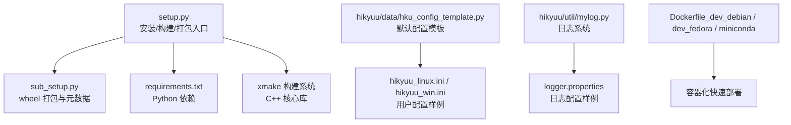
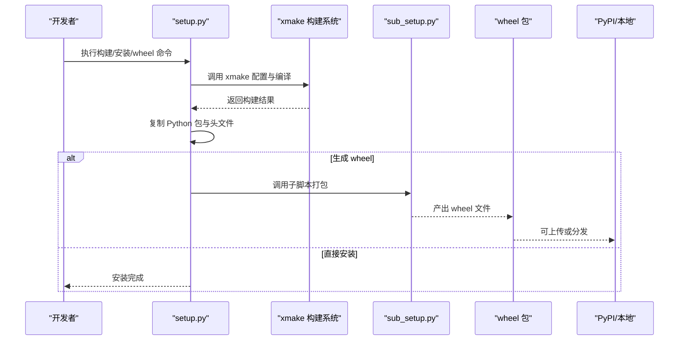
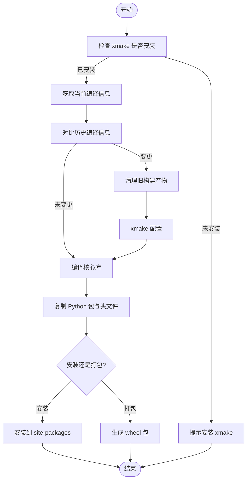
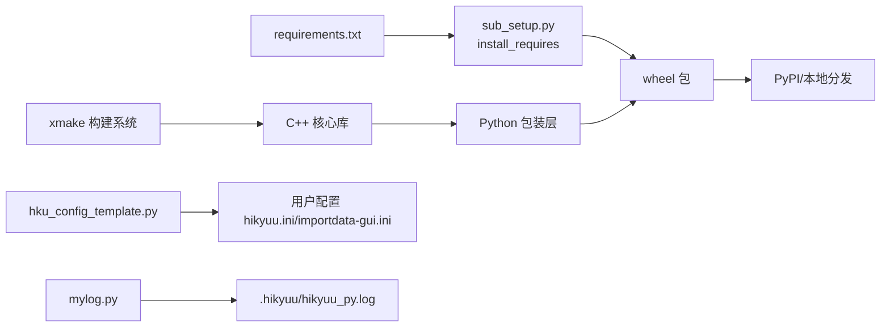

# 安装与配置

<cite>
**本文引用的文件**
- [setup.py](file://setup.py)
- [sub_setup.py](file://sub_setup.py)
- [requirements.txt](file://requirements.txt)
- [readme.md](file://readme.md)
- [hikyuu/data/hku_config_template.py](file://hikyuu/data/hku_config_template.py)
- [hikyuu/util/mylog.py](file://hikyuu/util/mylog.py)
- [test_data/hikyuu_linux.ini](file://test_data/hikyuu_linux.ini)
- [test_data/hikyuu_win.ini](file://test_data/hikyuu_win.ini)
- [test_data/logger.properties](file://test_data/logger.properties)
- [docker/Dockerfile_dev_debian](file://docker/Dockerfile_dev_debian)
- [docker/Dockerfile_dev_fedora](file://docker/Dockerfile_dev_fedora)
- [docker/Dockerfile_miniconda](file://docker/Dockerfile_miniconda)
</cite>

## 目录
1. [简介](#简介)
2. [项目结构](#项目结构)
3. [核心组件](#核心组件)
4. [架构总览](#架构总览)
5. [详细组件分析](#详细组件分析)
6. [依赖关系分析](#依赖关系分析)
7. [性能与兼容性注意事项](#性能与兼容性注意事项)
8. [故障排查指南](#故障排查指南)
9. [结论](#结论)
10. [附录](#附录)

## 简介
本指南面向希望在不同操作系统（Linux/Windows）上安装与配置 Hikyuu 量化框架的用户。内容覆盖：
- 通过源码安装的完整流程（setup.py、xmake、wheel 打包）
- 依赖项安装（如 numpy、pandas、hdf5、mysqlclient 等）
- 不同操作系统的配置说明（Linux/Windows）
- hikyuu_linux.ini 与 hikyuu_win.ini 配置文件结构与关键参数
- 数据存储路径、数据库连接信息与日志设置
- 使用 Docker 快速部署（Debian、Fedora、Miniconda 三种 Dockerfile 场景）
- 常见安装问题排查与配置验证方法

## 项目结构
Hikyuu 仓库包含 Python 包、C++ 核心库、数据驱动、GUI 工具、Dockerfile 与测试配置等模块。与安装配置最相关的文件包括：
- 安装入口与打包：setup.py、sub_setup.py
- 依赖声明：requirements.txt
- 默认配置模板与生成逻辑：hikyuu/data/hku_config_template.py
- 日志系统：hikyuu/util/mylog.py
- 测试配置样例：test_data/hikyuu_linux.ini、test_data/hikyuu_win.ini、test_data/logger.properties
- Docker 快速部署：docker/Dockerfile_dev_debian、docker/Dockerfile_dev_fedora、docker/Dockerfile_miniconda

图表来源
- [setup.py](file://setup.py#L1-L437)
- [sub_setup.py](file://sub_setup.py#L1-L136)
- [requirements.txt](file://requirements.txt#L1-L22)
- [hikyuu/data/hku_config_template.py](file://hikyuu/data/hku_config_template.py#L1-L339)
- [hikyuu/util/mylog.py](file://hikyuu/util/mylog.py#L1-L292)
- [test_data/hikyuu_linux.ini](file://test_data/hikyuu_linux.ini#L1-L56)
- [test_data/hikyuu_win.ini](file://test_data/hikyuu_win.ini#L1-L56)
- [test_data/logger.properties](file://test_data/logger.properties#L1-L19)
- [docker/Dockerfile_dev_debian](file://docker/Dockerfile_dev_debian#L1-L78)
- [docker/Dockerfile_dev_fedora](file://docker/Dockerfile_dev_fedora#L1-L70)
- [docker/Dockerfile_miniconda](file://docker/Dockerfile_miniconda#L1-L86)

章节来源
- [setup.py](file://setup.py#L1-L437)
- [sub_setup.py](file://sub_setup.py#L1-L136)
- [requirements.txt](file://requirements.txt#L1-L22)
- [readme.md](file://readme.md#L1-L115)

## 核心组件
- 安装与构建入口：setup.py 提供 build、test、install、wheel、clear、uninstall 等命令，内部通过 xmake 驱动 C++ 核心库构建，并将 Python 包复制到目标目录或生成 wheel。
- 依赖声明：requirements.txt 列出 Python 侧依赖，包括 numpy、pandas、h5py、tables、mysql-connector-python、clickhouse-connect 等。
- 配置模板：hikyuu/data/hku_config_template.py 提供 HDF5/MySQL/ClickHouse 三套配置模板与导入配置模板，支持自动生成默认配置文件与数据目录。
- 日志系统：hikyuu/util/mylog.py 提供统一的日志记录器，默认写入用户目录下的 hikyuu_py.log，并支持切换日志文件与级别。
- 配置样例：test_data/hikyuu_linux.ini 与 test_data/hikyuu_win.ini 展示 Linux/Windows 下的典型配置项；test_data/logger.properties 展示日志配置样例。

章节来源
- [setup.py](file://setup.py#L150-L437)
- [requirements.txt](file://requirements.txt#L1-L22)
- [hikyuu/data/hku_config_template.py](file://hikyuu/data/hku_config_template.py#L1-L339)
- [hikyuu/util/mylog.py](file://hikyuu/util/mylog.py#L1-L292)
- [test_data/hikyuu_linux.ini](file://test_data/hikyuu_linux.ini#L1-L56)
- [test_data/hikyuu_win.ini](file://test_data/hikyuu_win.ini#L1-L56)
- [test_data/logger.properties](file://test_data/logger.properties#L1-L19)

## 架构总览
下图展示从源码到可用包的关键流程：setup.py 调用 xmake 构建 C++ 核心库，随后复制 Python 包与头文件，最终生成 wheel 或直接安装。

图表来源
- [setup.py](file://setup.py#L108-L146)
- [setup.py](file://setup.py#L313-L407)
- [sub_setup.py](file://sub_setup.py#L1-L136)

章节来源
- [setup.py](file://setup.py#L108-L146)
- [setup.py](file://setup.py#L313-L407)
- [sub_setup.py](file://sub_setup.py#L1-L136)

## 详细组件分析

### 安装与构建流程（setup.py）
- 前置检查：检测 xmake 是否安装，否则提示安装。
- 编译模式：支持 release/debug/coverage/asan/tsan/msan/lsan 等模式，控制并行度与反馈开关。
- 清理与重建：当 Python 版本或编译模式变化时，清理旧构建产物并重新配置。
- 安装与打包：install 复制 Python 包与头文件；wheel 生成 wheel 并按平台命名。
- 清理与卸载：clear 清理 .xmake/build/dist 等；uninstall 删除已安装包。

图表来源
- [setup.py](file://setup.py#L16-L103)
- [setup.py](file://setup.py#L108-L146)
- [setup.py](file://setup.py#L313-L407)

章节来源
- [setup.py](file://setup.py#L16-L103)
- [setup.py](file://setup.py#L108-L146)
- [setup.py](file://setup.py#L313-L407)

### 依赖项与安装建议
- Python 依赖：requirements.txt 明确列出 numpy、pandas、h5py、tables、matplotlib、seaborn、bokeh、pyecharts、SQLAlchemy、mysql-connector-python、clickhouse-connect、pytdx、akshare、requests、flatbuffers、pynng、tqdm、gitpython、PySide6 等。
- C++ 依赖：readme.md 的“项目依赖说明”列出了 xmake、hdf5、mysql client、sqlite、flatbuffers、nng、nlohmann_json、boost、pybind11、clickhouse、arrow、eigen 等。
- 安装建议：
  - Linux：优先使用发行版包管理器安装系统级依赖（如 hdf5、mysql 开发库、openssl、libffi、zlib 等），再通过 pip 安装 Python 依赖。
  - Windows：建议使用 MinGW/MSVC 工具链与预编译依赖，确保 HDF5、MySQL Connector C、OpenSSL 等可用。
  - macOS：注意动态库/静态库差异与序列化限制，必要时使用静态库模式。

章节来源
- [requirements.txt](file://requirements.txt#L1-L22)
- [readme.md](file://readme.md#L89-L115)

### 配置文件结构与关键参数（hikyuu_linux.ini / hikyuu_win.ini）
- [hikyuu]：临时目录 tmpdir、数据根目录 datadir、数据重载时间 reload_time、行情服务器 quotation_server。
- [block]：板块数据类型（sqlite3/qianlong）、板块数据路径或数据库连接信息。
- [preload]：是否预加载各类周期（day/week/month/quarter/halfyear/year/min/min5/min15/min30/min60/hour2），以及对应的最大条数上限。
- [baseinfo]：基础信息数据类型（sqlite3/mysql/clickhouse）与连接信息。
- [kdata]：K 线数据类型（hdf5/tdx/mysql/clickhouse）与具体文件或数据库连接信息。

章节来源
- [test_data/hikyuu_linux.ini](file://test_data/hikyuu_linux.ini#L1-L56)
- [test_data/hikyuu_win.ini](file://test_data/hikyuu_win.ini#L1-L56)

### 默认配置模板与生成（hikyuu/data/hku_config_template.py）
- 提供 HDF5/MySQL/ClickHouse 三套配置模板，支持填充数据目录、重载时间、行情服务器、预加载参数、数据库连接等。
- 自动生成用户目录下的 hikyuu.ini 与 importdata-gui.ini，并复制板块配置目录到数据目录。

章节来源
- [hikyuu/data/hku_config_template.py](file://hikyuu/data/hku_config_template.py#L1-L339)

### 日志设置（hikyuu/util/mylog.py 与 test_data/logger.properties）
- Python 日志：默认在用户目录创建 .hikyuu/hikyuu_py.log，使用 RotatingFileHandler，WARN 级别以上写入文件。
- C++ 日志（log4cplus）：logger.properties 示例展示了 rootLogger 与 hikyuu 子 logger 的配置，包含控制台与滚动文件输出、布局格式与过滤器。

章节来源
- [hikyuu/util/mylog.py](file://hikyuu/util/mylog.py#L1-L292)
- [test_data/logger.properties](file://test_data/logger.properties#L1-L19)

### Docker 快速部署
- Debian 基础镜像：安装 xmake、Miniconda、pip 依赖，设置时区与环境变量，构建完成后进入交互 shell。
- Fedora 基础镜像：安装 gcc、cmake、git、mysql 开发库、thrift 开发库等，安装 xmake 与 Miniconda，配置 pip 镜像并安装依赖。
- Miniconda 基础镜像：两阶段构建，第一阶段安装 Miniconda、pip 配置镜像、安装 hikyuu 与常用包，第二阶段复制 Miniconda 到运行镜像，设置时区与库路径。

图表来源
- [docker/Dockerfile_dev_debian](file://docker/Dockerfile_dev_debian#L1-L78)
- [docker/Dockerfile_dev_fedora](file://docker/Dockerfile_dev_fedora#L1-L70)
- [docker/Dockerfile_miniconda](file://docker/Dockerfile_miniconda#L1-L86)

章节来源
- [docker/Dockerfile_dev_debian](file://docker/Dockerfile_dev_debian#L1-L78)
- [docker/Dockerfile_dev_fedora](file://docker/Dockerfile_dev_fedora#L1-L70)
- [docker/Dockerfile_miniconda](file://docker/Dockerfile_miniconda#L1-L86)

## 依赖关系分析
- Python 依赖：setup.py 在 wheel 阶段通过 sub_setup.py 读取 requirements.txt 并作为 install_requires。
- C++ 依赖：xmake 驱动构建，依赖于系统库与第三方库（hdf5、mysql、sqlite、flatbuffers、nng、nlohmann_json、boost、pybind11、clickhouse、arrow、eigen 等）。
- 配置依赖：默认配置模板依赖用户数据目录与板块配置目录；日志依赖用户目录下的 .hikyuu。

图表来源
- [requirements.txt](file://requirements.txt#L1-L22)
- [sub_setup.py](file://sub_setup.py#L1-L136)
- [hikyuu/data/hku_config_template.py](file://hikyuu/data/hku_config_template.py#L1-L339)
- [hikyuu/util/mylog.py](file://hikyuu/util/mylog.py#L1-L292)

章节来源
- [requirements.txt](file://requirements.txt#L1-L22)
- [sub_setup.py](file://sub_setup.py#L1-L136)
- [hikyuu/data/hku_config_template.py](file://hikyuu/data/hku_config_template.py#L1-L339)
- [hikyuu/util/mylog.py](file://hikyuu/util/mylog.py#L1-L292)

## 性能与兼容性注意事项
- 编译模式：release 模式默认生成共享库，debug/coverage/asan 等模式适合调试与测试；macOS 动态库在某些场景不支持序列化，静态库可能过大。
- 并行编译：build/test 命令支持 -j 参数控制并行度，合理设置可提升构建效率。
- 平台命名：wheel 命令根据平台与 CPU 架构生成合适的 manylinux/macOS 命名，确保兼容性。
- 数据存储：HDF5 默认更快更易备份；MySQL/ClickHouse 适合集中化与高并发场景。

章节来源
- [setup.py](file://setup.py#L108-L146)
- [setup.py](file://setup.py#L380-L407)
- [readme.md](file://readme.md#L58-L59)

## 故障排查指南
- 无法找到 xmake
  - 现象：构建前检查失败，提示安装 xmake。
  - 处理：安装 xmake 并确保在 PATH 中可用。
  - 参考：[setup.py](file://setup.py#L16-L21)
- Python 版本或编译模式变化导致构建异常
  - 现象：历史编译信息与当前不一致，触发清理与重新配置。
  - 处理：确认 Python 版本与编译模式一致，或手动执行 clear 清理后重试。
  - 参考：[setup.py](file://setup.py#L122-L131)
- 依赖冲突（Linux）
  - 现象：pip 安装失败或运行时报错。
  - 处理：使用发行版包管理器安装系统级依赖（如 hdf5、mysql 开发库、zlib、libffi、openssl），再安装 Python 依赖。
  - 参考：[requirements.txt](file://requirements.txt#L1-L22)
- Windows 编译问题
  - 现象：找不到 HDF5/MySQL Connector C/OpenSSL 头文件或库。
  - 处理：安装对应开发包，配置环境变量，或使用 MinGW/MSVC 工具链。
  - 参考：[readme.md](file://readme.md#L89-L115)
- macOS 动态库/静态库问题
  - 现象：动态库不支持序列化或静态库过大。
  - 处理：根据需求选择静态库模式或调整构建选项。
  - 参考：[setup.py](file://setup.py#L128-L136)
- 日志文件未生成或权限不足
  - 现象：.hikyuu/hikyuu_py.log 不存在或无写入权限。
  - 处理：确认用户目录存在且可写，或通过 set_my_logger_file 指定日志文件。
  - 参考：[hikyuu/util/mylog.py](file://hikyuu/util/mylog.py#L61-L82)
- Docker 构建失败
  - 现象：网络受限或镜像拉取失败。
  - 处理：配置镜像加速源，或离线准备 Miniconda 安装包。
  - 参考：[docker/Dockerfile_dev_debian](file://docker/Dockerfile_dev_debian#L48-L57)，[docker/Dockerfile_dev_fedora](file://docker/Dockerfile_dev_fedora#L41-L51)，[docker/Dockerfile_miniconda](file://docker/Dockerfile_miniconda#L37-L41)

章节来源
- [setup.py](file://setup.py#L16-L21)
- [setup.py](file://setup.py#L122-L131)
- [requirements.txt](file://requirements.txt#L1-L22)
- [readme.md](file://readme.md#L89-L115)
- [hikyuu/util/mylog.py](file://hikyuu/util/mylog.py#L61-L82)
- [docker/Dockerfile_dev_debian](file://docker/Dockerfile_dev_debian#L48-L57)
- [docker/Dockerfile_dev_fedora](file://docker/Dockerfile_dev_fedora#L41-L51)
- [docker/Dockerfile_miniconda](file://docker/Dockerfile_miniconda#L37-L41)

## 结论
通过本指南，您可以在 Linux/Windows/macOS 上完成 Hikyuu 的源码安装与配置，并根据需要选择 HDF5/MySQL/ClickHouse 数据存储方案。Dockerfile 提供了三种快速部署路径，便于在不同环境中快速搭建开发或运行环境。遇到安装问题时，可依据本指南的故障排查章节定位并解决。

## 附录

### A. 通过 setup.py 进行源码安装（Linux/Windows/macOS）
- 步骤概览
  - 安装 xmake
  - 安装系统依赖（hdf5、mysql 开发库、zlib、libffi、openssl 等）
  - 安装 Python 依赖（requirements.txt）
  - 执行构建与安装
    - 构建：python setup.py build
    - 安装：python setup.py install
    - 打包：python setup.py wheel
- 常用参数
  - -v/--verbose：显示详细编译信息
  - -m/--mode：编译模式（release/debug/coverage/asan/tsan/msan/lsan）
  - -j/--j：并行编译数量
  - -feedback/--feedback：允许发送反馈信息
  - -low_precision/--low_precision：使用低精度版本
  - -arrow/--arrow：启用 Arrow 支持

章节来源
- [setup.py](file://setup.py#L158-L218)
- [setup.py](file://setup.py#L233-L258)
- [setup.py](file://setup.py#L313-L407)
- [requirements.txt](file://requirements.txt#L1-L22)
- [readme.md](file://readme.md#L89-L115)

### B. 配置数据存储路径、数据库连接与日志
- 数据存储路径
  - 使用 hku_config_template.py 生成默认配置，或参考 test_data/hikyuu_linux.ini / test_data/hikyuu_win.ini 的 [hikyuu]/[kdata] 段落。
- 数据库连接信息
  - MySQL：在 [baseinfo]/[kdata] 中设置 host/port/usr/pwd；或使用模板生成。
  - ClickHouse：在 [baseinfo]/[kdata] 中设置 host/port/usr/pwd。
- 日志设置
  - Python 日志：默认写入 .hikyuu/hikyuu_py.log；可通过 set_my_logger_file 指定文件。
  - C++ 日志：参考 test_data/logger.properties 的 log4cplus 配置。

章节来源
- [hikyuu/data/hku_config_template.py](file://hikyuu/data/hku_config_template.py#L1-L339)
- [test_data/hikyuu_linux.ini](file://test_data/hikyuu_linux.ini#L1-L56)
- [test_data/hikyuu_win.ini](file://test_data/hikyuu_win.ini#L1-L56)
- [hikyuu/util/mylog.py](file://hikyuu/util/mylog.py#L61-L82)
- [test_data/logger.properties](file://test_data/logger.properties#L1-L19)

### C. Docker 快速部署指南
- Debian 基础镜像
  - 安装 xmake、Miniconda、pip 依赖，设置时区与环境变量，构建完成后进入交互 shell。
  - 适用场景：需要完整开发环境与 Miniconda 的 Debian 用户。
- Fedora 基础镜像
  - 安装 gcc、cmake、git、MySQL/thrift 开发库，安装 xmake 与 Miniconda，配置 pip 镜像并安装依赖。
  - 适用场景：需要较新工具链与 Fedora 生态的用户。
- Miniconda 基础镜像
  - 两阶段构建：第一阶段安装 Miniconda 与依赖，第二阶段复制 Miniconda 至运行镜像，设置时区与库路径。
  - 适用场景：希望最小化镜像体积与快速启动的用户。

章节来源
- [docker/Dockerfile_dev_debian](file://docker/Dockerfile_dev_debian#L1-L78)
- [docker/Dockerfile_dev_fedora](file://docker/Dockerfile_dev_fedora#L1-L70)
- [docker/Dockerfile_miniconda](file://docker/Dockerfile_miniconda#L1-L86)

### D. 配置验证方法
- 验证 Python 依赖安装：pip list | grep -E "(numpy|pandas|h5py|tables|mysql|clickhouse)"
- 验证 C++ 依赖：确认 hdf5、mysql、sqlite、flatbuffers、nng、nlohmann_json、boost、pybind11、clickhouse、arrow、eigen 可用
- 验证日志：运行后检查 .hikyuu/hikyuu_py.log 是否生成
- 验证配置：检查 hikyuu.ini 与 importdata-gui.ini 是否生成，板块配置目录是否存在

章节来源
- [requirements.txt](file://requirements.txt#L1-L22)
- [hikyuu/util/mylog.py](file://hikyuu/util/mylog.py#L61-L82)
- [hikyuu/data/hku_config_template.py](file://hikyuu/data/hku_config_template.py#L303-L339)