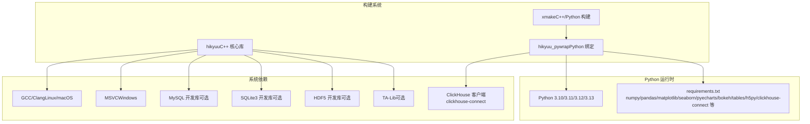

# 安装先决条件

<cite>
**本文引用的文件**
- [setup.py](file://setup.py)
- [sub_setup.py](file://sub_setup.py)
- [requirements.txt](file://requirements.txt)
- [xmake.lua](file://xmake.lua)
- [hikyuu_cpp/hikyuu/xmake.lua](file://hikyuu_cpp/hikyuu/xmake.lua)
- [hikyuu_pywrap/xmake.lua](file://hikyuu_pywrap/xmake.lua)
- [docker/Dockerfile_dev](file://docker/Dockerfile_dev)
- [docker/Dockerfile_dev_debian](file://docker/Dockerfile_dev_debian)
- [docker/Dockerfile_miniconda](file://docker/Dockerfile_miniconda)
- [readme.md](file://readme.md)
</cite>

## 目录
1. [简介](#简介)
2. [项目结构与安装入口](#项目结构与安装入口)
3. [核心依赖总览](#核心依赖总览)
4. [系统与编译工具链](#系统与编译工具链)
5. [Python 运行时与虚拟环境](#python-运行时与虚拟环境)
6. [核心科学计算库](#核心科学计算库)
7. [数据库与存储相关依赖](#数据库与存储相关依赖)
8. [TA-Lib 技术分析库](#ta-lib-技术分析库)
9. [ClickHouse 客户端库](#clickhouse-客户端库)
10. [Linux（Ubuntu/CentOS）安装指南](#linuxubuntucentos安装指南)
11. [Windows 安装指南](#windows-安装指南)
12. [验证安装与常见问题排查](#验证安装与常见问题排查)
13. [架构与依赖关系图](#架构与依赖关系图)
14. [结论](#结论)

## 简介
本文档面向源码安装 Hikyuu 的开发者，系统梳理安装先决条件，覆盖 Python 版本要求、核心科学计算库、C++ 编译工具链、HDF5、MySQL 开发头文件、SQLite3、ClickHouse 客户端库、TA-Lib 技术分析库等；并提供 Linux（Ubuntu/CentOS）与 Windows 的安装步骤、虚拟环境配置建议，以及关键依赖的验证方法。

## 项目结构与安装入口
- 源码安装通过统一的构建系统完成，核心入口为构建脚本与配置文件：
  - Python 安装与打包入口：[sub_setup.py](file://sub_setup.py)
  - 源码构建与依赖声明：[xmake.lua](file://xmake.lua)、[hikyuu_cpp/hikyuu/xmake.lua](file://hikyuu_cpp/hikyuu/xmake.lua)、[hikyuu_pywrap/xmake.lua](file://hikyuu_pywrap/xmake.lua)
  - Python 运行时前置检查：[setup.py](file://setup.py)
  - 依赖清单与版本约束：[requirements.txt](file://requirements.txt)
  - 依赖说明与许可证列表：[readme.md](file://readme.md)

**章节来源**
- file://sub_setup.py#L1-L136
- file://xmake.lua#L1-L247
- file://hikyuu_cpp/hikyuu/xmake.lua#L1-L167
- file://hikyuu_pywrap/xmake.lua#L1-L174
- file://setup.py#L1-L140
- file://requirements.txt#L1-L22
- file://readme.md#L93-L115

## 核心依赖总览
- Python 运行时与版本：支持 Python 3.10/3.11/3.12/3.13（打包元数据声明）
- 科学计算与可视化：numpy、pandas、matplotlib、seaborn、pyecharts、bokeh、tqdm
- 数据存储与序列化：tables（PyTables）、h5py、flatbuffers
- 数据库与连接：SQLAlchemy、mysql-connector-python、clickhouse-connect
- GUI 与网络：PySide6、requests、pynng、akshare
- C++ 构建与依赖：xmake、boost、fmt、spdlog、sqlite3、flatbuffers、nng、nlohmann_json、eigen、xxhash、utf8proc、gzip-hpp（可选）、ta-lib（可选）

**章节来源**
- file://sub_setup.py#L110-L123
- file://requirements.txt#L1-L22
- file://readme.md#L93-L115

## 系统与编译工具链
- 构建系统：xmake（版本要求见项目元数据）
- C++ 标准：C++17
- 平台支持：Windows、Linux、macOS
- 编译器要求：
  - Windows：MSVC（xmake 会检测并使用系统已安装的 Python 与编译器）
  - Linux/macOS：GCC/Clang（随 build-essential、libreadline-dev 等系统包）
- 必备系统包（Linux）：build-essential、libssl-dev、libffi-dev、libgomp1、binutils、libreadline-dev、git、libmysqlclient-dev（可选，启用 MySQL 引擎时）、libthrift-dev（可选）
- macOS：系统自带 Clang 即可；如需链接系统 sqlite3/iconv 等，需满足系统库可用

**章节来源**
- file://xmake.lua#L1-L20
- file://xmake.lua#L14-L16
- file://docker/Dockerfile_dev#L16-L31
- file://docker/Dockerfile_dev_debian#L16-L31
- file://hikyuu_cpp/hikyuu/xmake.lua#L41-L77
- file://hikyuu_pywrap/xmake.lua#L61-L113

## Python 运行时与虚拟环境
- Python 版本要求：Python 3.10/3.11/3.12/3.13（打包元数据声明）
- 运行时前置检查：构建脚本会检测 xmake 是否安装，Python 版本与架构信息会被记录，用于判断是否需要清理旧编译产物
- 虚拟环境建议：
  - venv：推荐使用 Python 自带 venv 创建隔离环境
  - Conda：项目提供 Miniconda 安装流程，可在容器镜像中看到完整安装链路
- 环境变量与库路径：容器镜像展示了如何设置 LD_LIBRARY_PATH 与 PYTHONPATH，便于在 Linux 上定位系统库与项目路径

**章节来源**
- file://sub_setup.py#L110-L123
- file://setup.py#L16-L31
- file://setup.py#L108-L146
- file://docker/Dockerfile_miniconda#L1-L35
- file://docker/Dockerfile_miniconda#L65-L86

## 核心科学计算库
- numpy：版本 ≥ 2.0
- pandas：版本 ≥ 2.3.0
- matplotlib、seaborn、pyecharts、bokeh、tqdm：均有明确版本下限
- h5py：版本 ≥ 3.14.0
- flatbuffers：版本 ≥ 24.3.25
- SQLAlchemy、mysql-connector-python、clickhouse-connect：用于数据库与 ClickHouse 连接
- 可选：akshare（金融数据采集）

**章节来源**
- file://requirements.txt#L1-L22

## 数据库与存储相关依赖
- HDF5：启用 HDF5 引擎时需要 hdf5 开发库与头文件（xmake 会按平台选择版本）
- SQLite3：启用 SQLite/SQLite3 引擎时需要 sqlite3 开发库（xmake 会按平台选择版本）
- MySQL：启用 MySQL 引擎时需要 mysql 开发库与头文件（xmake 会按平台选择版本）
- ClickHouse：clickhouse-connect 客户端库用于连接 ClickHouse
- PyTables（tables）：HDF5 文件读写支持

**章节来源**
- file://xmake.lua#L116-L127
- file://xmake.lua#L172-L179
- file://hikyuu_cpp/hikyuu/xmake.lua#L17-L31
- file://hikyuu_cpp/hikyuu/xmake.lua#L56-L61
- file://requirements.txt#L1-L22

## TA-Lib 技术分析库
- 可选特性：启用 ta-lib 支持时，需要系统安装 ta-lib 开发库与头文件
- 注意：当启用低精度模式（low_precision）时，ta-lib 将被自动禁用（因 ta-lib 不支持 float 输出）
- xmake 会在启用 ta_lib 选项时添加 ta-lib 包依赖

**章节来源**
- file://xmake.lua#L54-L67
- file://hikyuu_cpp/hikyuu/xmake.lua#L28-L30
- file://hikyuu_pywrap/xmake.lua#L1-L10

## ClickHouse 客户端库
- Python 客户端：clickhouse-connect（版本 ≥ 0.9.2）
- 说明：ClickHouse 官方仓库与许可证信息在依赖说明中列出

**章节来源**
- file://requirements.txt#L1-L22
- file://readme.md#L93-L115

## Linux（Ubuntu/CentOS）安装指南
- 基础系统包（Ubuntu/Debian）
  - 更新包索引并安装编译工具与常用依赖：build-essential、libssl-dev、libffi-dev、libgomp1、binutils、libreadline-dev、git、libmysqlclient-dev（可选）、libthrift-dev（可选）
  - 安装 xmake：使用官方安装脚本
  - 安装 Python 依赖：使用 pip 安装 requirements.txt 列表中的包
- CentOS/RHEL（通用步骤）
  - 使用 yum/dnf 安装编译工具链与依赖：gcc、gcc-c++、make、openssl-devel、libffi-devel、libcurl-devel、readline-devel、git、mysql-devel（可选）、thrift（可选）
  - 安装 xmake：使用官方安装脚本
  - 安装 Python 依赖：使用 pip 安装 requirements.txt 列表中的包
- 虚拟环境
  - 推荐使用 venv 创建隔离环境
  - 或使用 Conda（镜像站加速、接受 Anaconda 服务条款后再安装）

**章节来源**
- file://docker/Dockerfile_dev#L16-L31
- file://docker/Dockerfile_dev_debian#L16-L31
- file://docker/Dockerfile_miniconda#L1-L35
- file://docker/Dockerfile_miniconda#L65-L86

## Windows 安装指南
- 安装 Visual Studio（MSVC）与 Visual Studio Build Tools，确保支持 C++17
- 安装 Python 3.10/3.11/3.12/3.13（建议使用官方安装包）
- 安装 xmake：使用官方安装脚本
- 安装 Python 依赖：使用 pip 安装 requirements.txt 列表中的包
- 如需启用 MySQL/SQLite/HDF5 引擎，需准备对应开发库与头文件（可通过包管理器或手动编译安装）
- 虚拟环境：推荐使用 venv 或 Conda

**章节来源**
- file://hikyuu_pywrap/xmake.lua#L61-L113
- file://hikyuu_cpp/hikyuu/xmake.lua#L43-L67
- file://xmake.lua#L197-L201

## 验证安装与常见问题排查
- 验证 Python 与版本
  - 使用 Python 3.10/3.11/3.12/3.13 运行时
  - 使用 pip 检查 requirements.txt 中的包是否安装成功
- 验证编译工具链
  - 确认 xmake 已安装并可执行
  - 确认 C++ 编译器（MSVC/GCC/Clang）可用
- 验证数据库与存储
  - 若启用 MySQL：确认 mysql 开发库与头文件可用
  - 若启用 SQLite：确认 sqlite3 开发库可用
  - 若启用 HDF5：确认 hdf5 开发库与头文件可用
- 验证 ClickHouse
  - 确认 clickhouse-connect 可用
- 验证 TA-Lib（可选）
  - 若启用 ta-lib：确认系统已安装 ta-lib 开发库与头文件
  - 若启用低精度模式：ta-lib 将被自动禁用，无需安装 ta-lib
- 虚拟环境
  - 确认 venv/Conda 环境已激活，且 PATH 与 LD_LIBRARY_PATH（Linux）指向正确的库路径

**章节来源**
- file://setup.py#L16-L31
- file://setup.py#L108-L146
- file://xmake.lua#L54-L67
- file://xmake.lua#L116-L127
- file://hikyuu_cpp/hikyuu/xmake.lua#L17-L31
- file://requirements.txt#L1-L22

## 架构与依赖关系图
下图展示源码安装涉及的关键依赖与构建流程关系，映射到实际的配置文件与目标。

**图表来源**
- [xmake.lua](file://xmake.lua#L1-L247)
- [hikyuu_cpp/hikyuu/xmake.lua](file://hikyuu_cpp/hikyuu/xmake.lua#L1-L167)
- [hikyuu_pywrap/xmake.lua](file://hikyuu_pywrap/xmake.lua#L1-L174)
- [requirements.txt](file://requirements.txt#L1-L22)

## 结论
源码安装 Hikyuu 需要完善的 Python 运行时、C++ 编译工具链与若干系统级依赖。通过 xmake 统一管理 C++ 依赖，pip 管理 Python 依赖，配合 venv/Conda 虚拟环境，可在 Linux 与 Windows 上顺利完成安装。建议在安装前先验证 Python 版本与编译器可用性，并根据是否启用 MySQL/SQLite/HDF5/TA-Lib/ClickHouse 等特性准备相应的开发库与头文件。