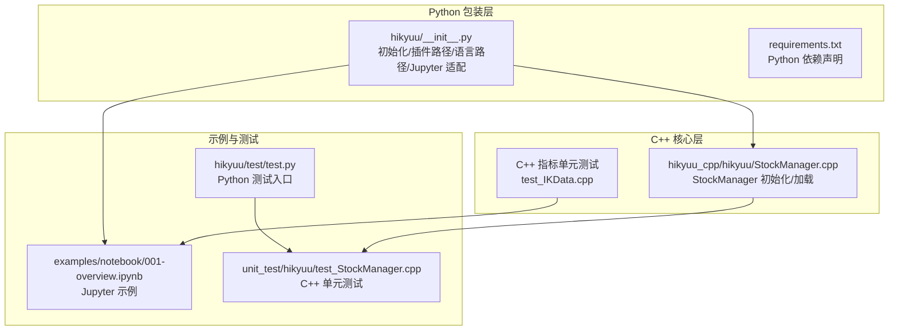
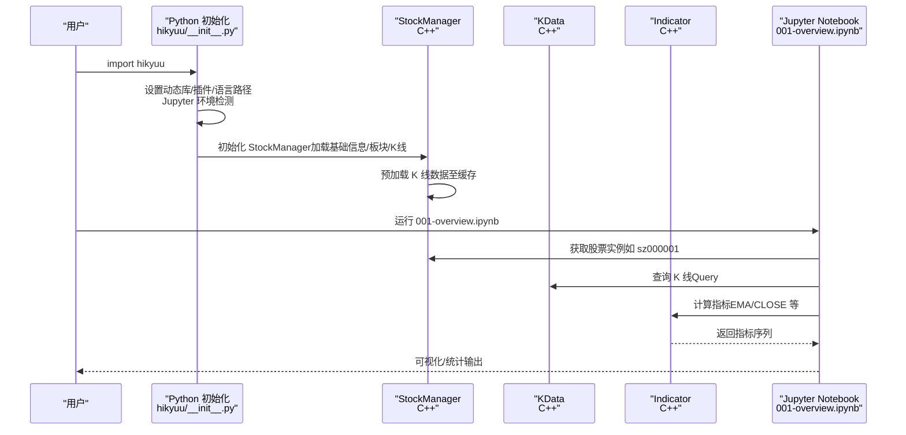
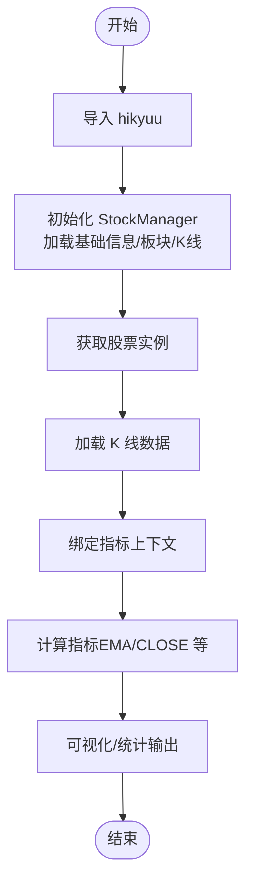
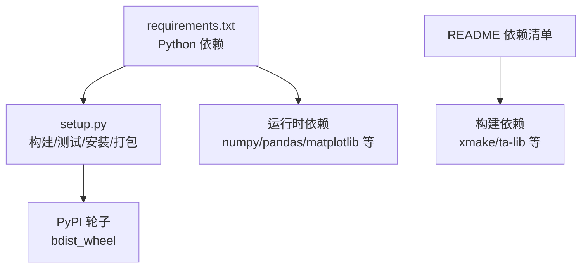

# 安装验证

<cite>
**本文引用的文件**
- [readme.md](file://readme.md)
- [setup.py](file://setup.py)
- [requirements.txt](file://requirements.txt)
- [hikyuu/__init__.py](file://hikyuu/__init__.py)
- [hikyuu/examples/notebook/001-overview.ipynb](file://hikyuu/examples/notebook/001-overview.ipynb)
- [hikyuu/examples/notebook/README.md](file://hikyuu/examples/notebook/README.md)
- [hikyuu/test/test.py](file://hikyuu/test/test.py)
- [hikyuu_cpp/hikyuu/StockManager.cpp](file://hikyuu_cpp/hikyuu/StockManager.cpp)
- [hikyuu_cpp/unit_test/hikyuu/test_StockManager.cpp](file://hikyuu_cpp/unit_test/hikyuu/test_StockManager.cpp)
- [hikyuu_cpp/unit_test/hikyuu/indicator/test_IKData.cpp](file://hikyuu_cpp/unit_test/hikyuu/indicator/test_IKData.cpp)
- [hikyuu_cpp/hikyuu/global/sysinfo.cpp](file://hikyuu_cpp/hikyuu/global/sysinfo.cpp)
</cite>

## 目录
1. [简介](#简介)
2. [项目结构](#项目结构)
3. [核心组件](#核心组件)
4. [架构总览](#架构总览)
5. [详细组件分析](#详细组件分析)
6. [依赖关系分析](#依赖关系分析)
7. [性能考量](#性能考量)
8. [故障排查指南](#故障排查指南)
9. [结论](#结论)
10. [附录](#附录)

## 简介
本指南面向首次安装或升级 Hikyuu 框架的用户，提供一套完整的安装验证流程，确保 Python 模块导入成功、C++ 核心功能可用（如 StockManager、KData、指标体系）、Jupyter Notebook 示例可顺利运行，并给出常见错误的定位与修复建议。验证流程覆盖：
- Python 导入测试（import hikyuu）
- 运行 Jupyter Notebook 示例（如 001-overview.ipynb）
- 关键功能的代码片段验证（获取股票实例、加载 K 线数据、计算简单指标）
- 预期输出与可能的错误信息说明
- 引用 README 中的快速测试命令，完成端到端验证

## 项目结构
Hikyuu 采用“C++核心 + Python 包装 + 交互工具”的分层架构。安装验证涉及的关键位置：
- Python 包装层：hikyuu/__init__.py 负责初始化、插件路径设置、语言资源路径设置、Jupyter 环境适配等
- C++ 核心层：StockManager、KData、Indicator 等核心类在 C++ 层实现，通过 pybind11 暴露给 Python
- 示例与测试：examples/notebook 提供 Jupyter 示例；unit_test 提供 C++ 层单元测试样例
- 构建与安装：setup.py 提供构建、测试、打包、安装等命令；requirements.txt 描述 Python 依赖

图表来源
- [hikyuu/__init__.py](file://hikyuu/__init__.py#L80-L120)
- [hikyuu_cpp/hikyuu/StockManager.cpp](file://hikyuu_cpp/hikyuu/StockManager.cpp#L564-L653)
- [hikyuu_cpp/unit_test/hikyuu/test_StockManager.cpp](file://hikyuu_cpp/unit_test/hikyuu/test_StockManager.cpp#L199-L232)
- [hikyuu_cpp/unit_test/hikyuu/indicator/test_IKData.cpp](file://hikyuu_cpp/unit_test/hikyuu/indicator/test_IKData.cpp#L144-L189)
- [hikyuu/examples/notebook/001-overview.ipynb](file://hikyuu/examples/notebook/001-overview.ipynb#L1-L120)
- [hikyuu/test/test.py](file://hikyuu/test/test.py#L1-L64)

章节来源
- [hikyuu/__init__.py](file://hikyuu/__init__.py#L80-L120)
- [hikyuu/examples/notebook/001-overview.ipynb](file://hikyuu/examples/notebook/001-overview.ipynb#L1-L120)

## 核心组件
- Python 初始化与环境适配
  - 动态库路径注入（Windows/Unix）
  - 插件路径设置（内置 plugin 或用户家目录）
  - 语言资源路径设置（i18n）
  - Jupyter 环境检测与 C++ 输出重定向
- StockManager 初始化与数据加载
  - 通过配置文件初始化基础信息、板块、K 线驱动池
  - 预加载 K 线数据至缓存
- 指标与 K 线上下文
  - 通过 Indicator/OPEN/CLOSE/HIGH/LOW/VOL 等上下文绑定 KData
  - 支持 EMA、MACD 等内置指标计算

章节来源
- [hikyuu/__init__.py](file://hikyuu/__init__.py#L35-L120)
- [hikyuu_cpp/hikyuu/StockManager.cpp](file://hikyuu_cpp/hikyuu/StockManager.cpp#L564-L653)
- [hikyuu_cpp/unit_test/hikyuu/indicator/test_IKData.cpp](file://hikyuu_cpp/unit_test/hikyuu/indicator/test_IKData.cpp#L144-L189)

## 架构总览
下图展示从 Python 导入到 C++ 核心初始化、数据加载与指标计算的端到端流程。

图表来源
- [hikyuu/__init__.py](file://hikyuu/__init__.py#L80-L120)
- [hikyuu_cpp/hikyuu/StockManager.cpp](file://hikyuu_cpp/hikyuu/StockManager.cpp#L564-L653)
- [hikyuu/examples/notebook/001-overview.ipynb](file://hikyuu/examples/notebook/001-overview.ipynb#L60-L130)

## 详细组件分析

### Python 导入验证（import hikyuu）
- 目标：验证 Python 层 hikyuu 包可正常导入，动态库路径、插件路径、语言路径均已设置，Jupyter 环境检测与输出重定向生效
- 验证步骤
  - 在 Python 解释器中执行导入语句，观察是否有异常堆栈与依赖缺失提示
  - 若出现依赖缺失，根据初始化逻辑中的提示使用依赖树工具检查缺失项
  - 在 Jupyter 中运行，应看到初始化日志与插件路径打印
- 预期输出特征
  - 成功导入后，控制台会打印插件路径与初始化阶段的日志（如加载市场信息、证券信息、板块信息、K 线数据等）
  - Jupyter 环境下会检测并重定向 C++ 输出
- 可能的错误
  - 动态库路径未找到：检查系统 PATH/LD_LIBRARY_PATH 是否包含 hikyuu/cpp
  - 插件或语言资源缺失：确认插件目录存在，语言资源 i18n 可访问
  - 依赖缺失：根据初始化逻辑提示使用依赖树工具检查

章节来源
- [hikyuu/__init__.py](file://hikyuu/__init__.py#L35-L120)
- [hikyuu/examples/notebook/001-overview.ipynb](file://hikyuu/examples/notebook/001-overview.ipynb#L1-L60)

### Jupyter 示例验证（001-overview.ipynb）
- 目标：验证 C++ 核心功能（StockManager、KData、Indicator）在 Python 环境中可用
- 验证步骤
  - 在 Jupyter 中打开 001-overview.ipynb
  - 执行“引入交互式工具”单元格，观察初始化日志与插件路径
  - 执行“创建交易系统并运行”单元格，等待回测完成
  - 执行“绘制曲线观察”、“绘制资金收益曲线”、“回测统计报告”等后续单元格
- 预期输出特征
  - 初始化阶段会打印加载市场信息、板块信息、K 线数据等日志
  - 回测统计报告会输出账户收益、交易次数、胜率等统计指标
  - 图形绘制单元格应能正常显示 K 线与指标曲线
- 可能的错误
  - 数据未加载：确认已执行初始化与数据加载流程
  - 插件路径不匹配：检查插件版本与主程序版本一致
  - Jupyter 输出被屏蔽：确认 Jupyter 环境检测逻辑已生效

章节来源
- [hikyuu/examples/notebook/001-overview.ipynb](file://hikyuu/examples/notebook/001-overview.ipynb#L1-L130)
- [hikyuu/__init__.py](file://hikyuu/__init__.py#L120-L170)

### 关键功能代码片段验证
以下为关键功能的验证路径指引（不直接展示代码内容）：
- 获取股票实例与加载 K 线数据
  - 通过 StockManager 获取股票对象，查询 K 线数据，绑定指标上下文
  - 参考路径：[hikyuu/__init__.py](file://hikyuu/__init__.py#L170-L220)
- 计算简单指标（如 EMA、CLOSE）
  - 使用 Indicator 上下文绑定 KData，计算指标序列
  - 参考路径：[hikyuu_cpp/unit_test/hikyuu/indicator/test_IKData.cpp](file://hikyuu_cpp/unit_test/hikyuu/indicator/test_IKData.cpp#L144-L189)
- StockManager 初始化与数据加载
  - 初始化基础信息、板块、K 线驱动池，预加载 K 线数据
  - 参考路径：[hikyuu_cpp/hikyuu/StockManager.cpp](file://hikyuu_cpp/hikyuu/StockManager.cpp#L564-L653)

图表来源
- [hikyuu/__init__.py](file://hikyuu/__init__.py#L170-L220)
- [hikyuu_cpp/hikyuu/StockManager.cpp](file://hikyuu_cpp/hikyuu/StockManager.cpp#L564-L653)
- [hikyuu_cpp/unit_test/hikyuu/indicator/test_IKData.cpp](file://hikyuu_cpp/unit_test/hikyuu/indicator/test_IKData.cpp#L144-L189)

章节来源
- [hikyuu/__init__.py](file://hikyuu/__init__.py#L170-L220)
- [hikyuu_cpp/hikyuu/StockManager.cpp](file://hikyuu_cpp/hikyuu/StockManager.cpp#L564-L653)
- [hikyuu_cpp/unit_test/hikyuu/indicator/test_IKData.cpp](file://hikyuu_cpp/unit_test/hikyuu/indicator/test_IKData.cpp#L144-L189)

### C++ 核心功能验证（StockManager、KData）
- 目标：验证 C++ 层 StockManager、KData 的基本行为（如临时 CSV 股票添加/删除、KRecord 读取）
- 验证步骤
  - 查看单元测试中对 StockManager 的操作（添加临时 CSV 股票、读取 KRecord、删除）
  - 验证 KData 上下文绑定与指标序列一致性
- 预期输出特征
  - 添加临时股票后可通过 getStock 获取，删除后应为空
  - KRecord 字段与上下文指标序列长度一致
- 可能的错误
  - 重复添加同一股票：应报错提示已存在
  - KRecord 字段不一致：检查数据驱动与上下文绑定

章节来源
- [hikyuu_cpp/unit_test/hikyuu/test_StockManager.cpp](file://hikyuu_cpp/unit_test/hikyuu/test_StockManager.cpp#L199-L232)
- [hikyuu_cpp/hikyuu/StockManager.cpp](file://hikyuu_cpp/hikyuu/StockManager.cpp#L636-L653)
- [hikyuu_cpp/unit_test/hikyuu/indicator/test_IKData.cpp](file://hikyuu_cpp/unit_test/hikyuu/indicator/test_IKData.cpp#L144-L189)

## 依赖关系分析
- Python 依赖：通过 requirements.txt 声明 numpy、pandas、matplotlib、tables、SQLAlchemy、mysql-connector-python、akshare、pyecharts、clickhouse-connect 等
- 构建与安装：setup.py 提供 build、test、install、wheel 等命令，支持不同平台与架构
- C++ 依赖：README 中列出 xmake、hdf5、mysql、sqlite、flatbuffers、nng、nlohmann_json、boost、pybind11、ta-lib、clickhouse、eigen 等

图表来源
- [requirements.txt](file://requirements.txt#L1-L22)
- [setup.py](file://setup.py#L100-L170)
- [readme.md](file://readme.md#L89-L115)

章节来源
- [requirements.txt](file://requirements.txt#L1-L22)
- [setup.py](file://setup.py#L100-L170)
- [readme.md](file://readme.md#L89-L115)

## 性能考量
- 数据加载性能：StockManager 初始化会加载市场信息、板块信息、K 线数据，并可预加载指定数量的 K 线至缓存
- 指标计算性能：指标上下文绑定 KData 后可高效计算，示例中展示了大规模遍历计算的性能表现
- Jupyter 环境：在 Jupyter 中运行时会启用特定的输出重定向与绘图引擎

章节来源
- [hikyuu_cpp/hikyuu/StockManager.cpp](file://hikyuu_cpp/hikyuu/StockManager.cpp#L564-L653)
- [hikyuu/examples/notebook/001-overview.ipynb](file://hikyuu/examples/notebook/001-overview.ipynb#L1-L120)

## 故障排查指南
- Python 导入失败
  - 现象：导入时报错，提示依赖缺失或动态库路径问题
  - 处理：根据初始化逻辑提示使用依赖树工具检查缺失项；确认系统 PATH/LD_LIBRARY_PATH 包含 hikyuu/cpp
  - 参考路径：[hikyuu/__init__.py](file://hikyuu/__init__.py#L35-L120)
- Jupyter 输出异常
  - 现象：在 Jupyter 中看不到 C++ 输出或中文乱码
  - 处理：确认 Jupyter 环境检测逻辑已生效；Windows 终端下中文显示需切换编码
  - 参考路径：[hikyuu/__init__.py](file://hikyuu/__init__.py#L120-L170)
- 数据未加载或加载缓慢
  - 现象：StockManager 初始化后未加载数据或耗时较长
  - 处理：检查配置文件路径与权限；确认数据驱动可用；适当调整预加载数量
  - 参考路径：[hikyuu_cpp/hikyuu/StockManager.cpp](file://hikyuu_cpp/hikyuu/StockManager.cpp#L564-L653)
- 插件版本不匹配
  - 现象：初始化时提示主程序与插件版本不匹配
  - 处理：确保 hikyuu 与 hikyuu_plugin 版本主版本号一致
  - 参考路径：[hikyuu/__init__.py](file://hikyuu/__init__.py#L80-L120)
- C++ 输出日志定位
  - 现象：需要查看 C++ 层日志
  - 处理：在 Jupyter 环境下会自动初始化日志文件；可在用户目录下的 .hikyuu 目录中查找日志
  - 参考路径：[hikyuu_cpp/hikyuu/global/sysinfo.cpp](file://hikyuu_cpp/hikyuu/global/sysinfo.cpp#L47-L95)

章节来源
- [hikyuu/__init__.py](file://hikyuu/__init__.py#L35-L120)
- [hikyuu_cpp/hikyuu/StockManager.cpp](file://hikyuu_cpp/hikyuu/StockManager.cpp#L564-L653)
- [hikyuu_cpp/hikyuu/global/sysinfo.cpp](file://hikyuu_cpp/hikyuu/global/sysinfo.cpp#L47-L95)

## 结论
通过本指南的四步验证流程（Python 导入、Jupyter 示例、关键功能片段、C++ 核心验证），可全面确认 Hikyuu 框架的安装完整性与正确性。若在任一步骤出现异常，可依据“故障排查指南”逐项定位并修复。建议在完成验证后，继续阅读示例与官方文档，进一步探索框架的功能边界与最佳实践。

## 附录
- 快速测试命令（来自 README）
  - README 中提供了示例代码片段，可直接在 Python 环境中运行以验证核心功能
  - 参考路径：[readme.md](file://readme.md#L27-L47)
- 示例目录说明
  - examples/notebook/README.md 指向 Jupyter 示例集合
  - 参考路径：[hikyuu/examples/notebook/README.md](file://hikyuu/examples/notebook/README.md#L1-L2)
- Python 测试入口
  - hikyuu/test/test.py 提供了 Python 层测试入口，便于验证各模块导入与基本功能
  - 参考路径：[hikyuu/test/test.py](file://hikyuu/test/test.py#L1-L64)

章节来源
- [readme.md](file://readme.md#L27-L47)
- [hikyuu/examples/notebook/README.md](file://hikyuu/examples/notebook/README.md#L1-L2)
- [hikyuu/test/test.py](file://hikyuu/test/test.py#L1-L64)