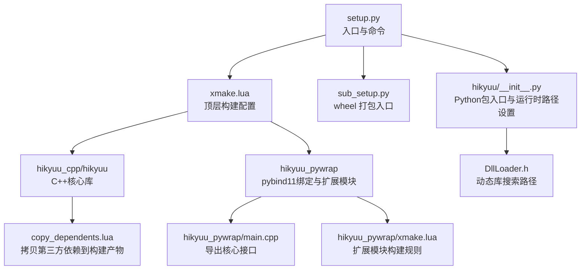
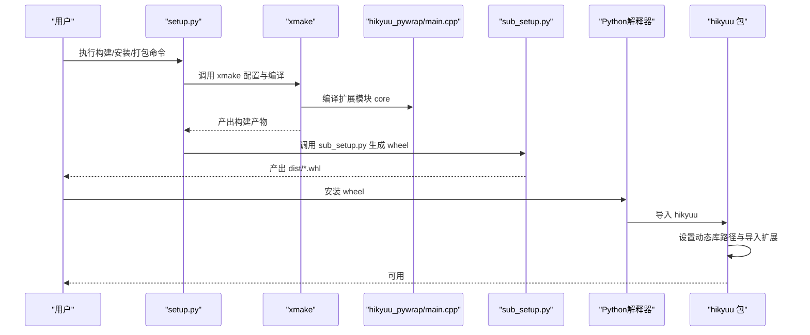
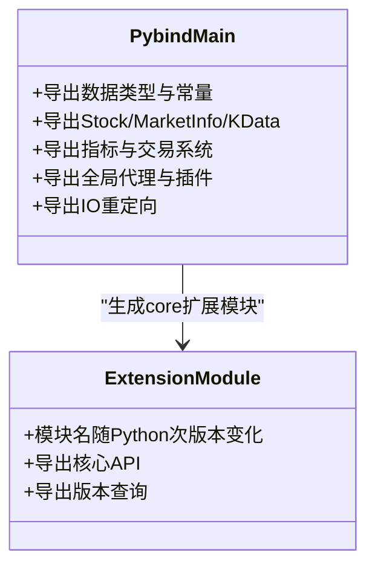
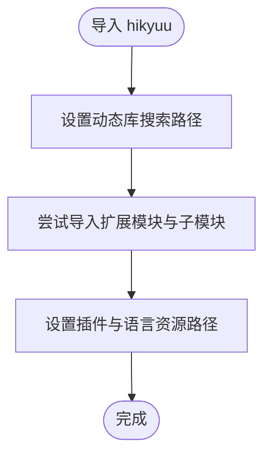
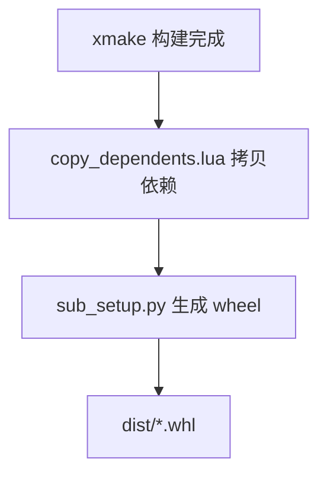
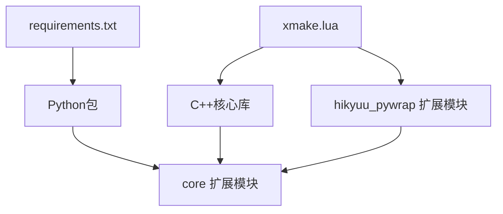

# 源码安装

<cite>
**本文引用的文件**
- [setup.py](file://setup.py)
- [sub_setup.py](file://sub_setup.py)
- [requirements.txt](file://requirements.txt)
- [readme.md](file://readme.md)
- [xmake.lua](file://xmake.lua)
- [hikyuu_pywrap/xmake.lua](file://hikyuu_pywrap/xmake.lua)
- [hikyuu_pywrap/main.cpp](file://hikyuu_pywrap/main.cpp)
- [hikyuu/__init__.py](file://hikyuu/__init__.py)
- [hikyuu_cpp/hikyuu/utilities/DllLoader.h](file://hikyuu_cpp/hikyuu/utilities/DllLoader.h)
- [copy_dependents.lua](file://copy_dependents.lua)
- [docker/Dockerfile_dev](file://docker/Dockerfile_dev)
- [docker/Dockerfile_miniconda](file://docker/Dockerfile_miniconda)
</cite>

## 目录
1. [简介](#简介)
2. [项目结构](#项目结构)
3. [核心组件](#核心组件)
4. [架构总览](#架构总览)
5. [详细组件分析](#详细组件分析)
6. [依赖关系分析](#依赖关系分析)
7. [性能与编译特性](#性能与编译特性)
8. [安装步骤（Linux）](#安装步骤linux)
9. [安装步骤（Windows）](#安装步骤windows)
10. [常见依赖与版本要求](#常见依赖与版本要求)
11. [子安装脚本 sub_setup.py 的作用](#子安装脚本-sub_setuppy-的作用)
12. [编译错误排查](#编译错误排查)
13. [安装后验证](#安装后验证)
14. [故障排除指南](#故障排除指南)
15. [结论](#结论)

## 简介
本指南面向希望从源码安装 Hikyuu 的用户，覆盖 Linux 与 Windows 平台的完整编译流程，明确 Python 环境与依赖项要求，解释 setup.py 与 sub_setup.py 的职责分工，说明扩展模块 core 的编译与打包过程，并提供常见编译错误的定位与修复思路，以及安装后的验证方法，确保 C++ 核心库与 Python 包装层正确集成。

## 项目结构
Hikyuu 采用“C++核心 + Python 包装 + 扩展模块”的分层设计：
- C++ 核心位于 hikyuu_cpp/hikyuu，提供高性能数据驱动、指标体系、交易系统等。
- Python 包装位于 hikyuu_pywrap，使用 pybind11 将 C++ 接口暴露为 Python 扩展模块 core。
- Python 包位于 hikyuu，提供高层 API、数据加载、绘图、GUI 工具等。
- 构建系统使用 xmake，通过 xmake.lua 配置编译选项、依赖拉取与打包。

图表来源
- [setup.py](file://setup.py#L1-L437)
- [xmake.lua](file://xmake.lua#L1-L247)
- [hikyuu_pywrap/xmake.lua](file://hikyuu_pywrap/xmake.lua#L1-L120)
- [hikyuu_pywrap/main.cpp](file://hikyuu_pywrap/main.cpp#L1-L192)
- [hikyuu/__init__.py](file://hikyuu/__init__.py#L1-L120)
- [copy_dependents.lua](file://copy_dependents.lua#L1-L84)
- [hikyuu_cpp/hikyuu/utilities/DllLoader.h](file://hikyuu_cpp/hikyuu/utilities/DllLoader.h#L1-L60)

章节来源
- [setup.py](file://setup.py#L1-L120)
- [xmake.lua](file://xmake.lua#L1-L120)

## 核心组件
- setup.py：提供命令行入口，封装构建、测试、安装、打包、卸载等操作；内部调用 xmake 执行 C++/Python 扩展编译，并通过 sub_setup.py 生成 wheel。
- sub_setup.py：解析 requirements.txt，读取版本号，生成 setuptools.setup 的参数，负责最终 wheel 的打包与分发元数据。
- xmake.lua：顶层构建配置，声明 C++17、编译选项、依赖拉取（hdf5、mysql、sqlite、boost、pybind11 等）、宏开关（ta_lib、serialize、low_precision 等）。
- hikyuu_pywrap/main.cpp：使用 pybind11 导出 C++ 接口为 Python 扩展模块 core，按 Python 主次版本选择不同的模块名。
- hikyuu/__init__.py：Python 包入口，设置动态库搜索路径、导入扩展模块、注册插件路径、初始化语言资源等。
- copy_dependents.lua：在构建完成后将第三方依赖的头文件与库文件复制到构建输出目录，便于打包与运行。

章节来源
- [setup.py](file://setup.py#L120-L260)
- [sub_setup.py](file://sub_setup.py#L1-L136)
- [xmake.lua](file://xmake.lua#L1-L247)
- [hikyuu_pywrap/main.cpp](file://hikyuu_pywrap/main.cpp#L1-L192)
- [hikyuu/__init__.py](file://hikyuu/__init__.py#L1-L120)
- [copy_dependents.lua](file://copy_dependents.lua#L1-L84)

## 架构总览
下面的序列图展示了从源码安装到 Python 包可用的关键流程。

图表来源
- [setup.py](file://setup.py#L360-L437)
- [sub_setup.py](file://sub_setup.py#L60-L136)
- [hikyuu_pywrap/main.cpp](file://hikyuu_pywrap/main.cpp#L1-L192)
- [hikyuu/__init__.py](file://hikyuu/__init__.py#L1-L120)

## 详细组件分析

### 组件 A：扩展模块 core 的编译与导出
- 模块命名：根据 Python 次版本选择不同的模块名（如 core38、core39、core310、core311、core312、core313 等），确保与 Python 版本兼容。
- 绑定内容：导出数据类型、常量、Stock/MarketInfo/KData、指标、交易系统、全局代理、插件等。
- 动态库输出：Windows 生成 .pyd，类 Unix 生成 .so；Linux/MacOS 设置 rpath，便于运行时加载依赖库。
- 依赖包：boost、fmt、spdlog、flatbuffers、pybind11、utf8proc、nlohmann_json 等。

图表来源
- [hikyuu_pywrap/main.cpp](file://hikyuu_pywrap/main.cpp#L1-L192)
- [hikyuu_pywrap/xmake.lua](file://hikyuu_pywrap/xmake.lua#L1-L120)

章节来源
- [hikyuu_pywrap/main.cpp](file://hikyuu_pywrap/main.cpp#L1-L192)
- [hikyuu_pywrap/xmake.lua](file://hikyuu_pywrap/xmake.lua#L1-L120)

### 组件 B：Python 包入口与运行时路径
- 设置动态库搜索路径：Windows 下添加 DLL 目录到 PATH，类 Unix 下设置 LD_LIBRARY_PATH。
- 导入扩展模块：尝试导入 .extend、.indicator、.trade_manage、.trade_sys、.analysis、.hub、.draw 等模块。
- 插件与语言资源：设置插件路径与语言资源路径，兼容 hikyuu_plugin 版本。

图表来源
- [hikyuu/__init__.py](file://hikyuu/__init__.py#L1-L120)

章节来源
- [hikyuu/__init__.py](file://hikyuu/__init__.py#L1-L120)

### 组件 C：依赖拷贝与打包
- 构建后拷贝：在构建完成后，copy_dependents.lua 将第三方依赖的头文件与库文件复制到构建输出目录。
- 安装后拷贝：在安装阶段同样复制必要的头文件与库，确保 wheel 内含运行所需依赖。
- wheel 打包：sub_setup.py 读取版本号与长描述，收集包内数据文件与二进制文件，生成 wheel。

图表来源
- [copy_dependents.lua](file://copy_dependents.lua#L1-L84)
- [xmake.lua](file://xmake.lua#L150-L166)
- [sub_setup.py](file://sub_setup.py#L60-L136)

章节来源
- [copy_dependents.lua](file://copy_dependents.lua#L1-L84)
- [xmake.lua](file://xmake.lua#L150-L166)
- [sub_setup.py](file://sub_setup.py#L60-L136)

## 依赖关系分析
- Python 依赖：来自 requirements.txt，包括 numpy、pandas、matplotlib、seaborn、tables、bokeh、SQLAlchemy、mysql-connector-python、pytdx、pyecharts、clickhouse-connect、h5py、tqdm 等。
- C++ 依赖：通过 xmake 的 add_requires 引入，如 hdf5、mysql、sqlite3、boost、fmt、spdlog、flatbuffers、nng、nlohmann_json、eigen、xxhash、utf8proc、ta-lib 等。
- 选项控制：xmake.lua 提供大量编译选项（如 mysql、hdf5、sqlite、ta_lib、serialize、low_precision、log_level 等），影响 C++ 核心与扩展模块的行为。

图表来源
- [requirements.txt](file://requirements.txt#L1-L22)
- [xmake.lua](file://xmake.lua#L1-L247)
- [hikyuu_pywrap/xmake.lua](file://hikyuu_pywrap/xmake.lua#L1-L120)

章节来源
- [requirements.txt](file://requirements.txt#L1-L22)
- [xmake.lua](file://xmake.lua#L1-L247)

## 性能与编译特性
- 编译模式：支持 release、debug、coverage、asan、msan、tsan、lsan 等模式，release 默认隐藏符号，减少动态库导出符号。
- 低精度与 Arrow：提供 low_precision 选项；Arrow 支持标记为过时（仅兼容），实际不再使用。
- 序列化：serialize 选项影响 boost.serialization 的使用，Windows 下若启用 serialize 且使用动态库需设置运行时为 MD。
- 日志级别：通过 log_level 控制 spdlog 日志等级，支持异步日志。

章节来源
- [xmake.lua](file://xmake.lua#L1-L120)
- [xmake.lua](file://xmake.lua#L120-L247)

## 安装步骤（Linux）

### 前置准备
- 安装编译工具链与基础库
  - Ubuntu/Debian：安装 build-essential、libssl-dev、libffi-dev、libgomp1、binutils、libreadline-dev、git、libmysqlclient-dev 等。
  - CentOS/RHEL/Fedora：使用 dnf/yum 安装 gcc、gcc-c++、make、openssl-devel、libffi-devel、libstdc++-devel、binutils、readline-devel、git、mariadb-devel 等。
- 安装 xmake：参考官方安装脚本或包管理器安装 xmake。
- 准备 Python 环境：推荐使用虚拟环境（venv 或 conda），Python 版本满足 sub_setup.py 中的 classifiers 要求（3.10~3.13）。

### 安装步骤
1. 克隆仓库并进入根目录
2. 安装 Python 依赖
   - 使用 pip 安装 requirements.txt 中的依赖。
3. 安装 C++ 依赖
   - 通过 xmake 自动拉取依赖（hdf5、mysql、sqlite3、boost、pybind11 等），或手动安装系统依赖。
4. 编译与安装
   - 使用 setup.py 的 install 子命令进行编译与安装，或使用 wheel 子命令生成 wheel 并安装。
5. 验证安装
   - 在 Python 中导入 hikyuu 并调用核心 API，确认扩展模块加载成功。

章节来源
- [docker/Dockerfile_dev](file://docker/Dockerfile_dev#L1-L79)
- [requirements.txt](file://requirements.txt#L1-L22)
- [setup.py](file://setup.py#L320-L408)
- [xmake.lua](file://xmake.lua#L1-L120)

## 安装步骤（Windows）

### 前置准备
- 安装 Visual Studio（带 C++ 工具链）或使用 VS Build Tools。
- 安装 xmake，并确保 xmake --version 可用。
- 准备 Python 环境（推荐虚拟环境），版本满足要求。
- 安装 MySQL 开发库（libmysqlclient）或使用系统库。

### 安装步骤
1. 打开 VS 命令提示符或 PowerShell（管理员权限更佳）。
2. 安装 Python 依赖（pip install -r requirements.txt）。
3. 使用 setup.py 的 install 子命令进行编译与安装，或使用 wheel 子命令生成 wheel 并安装。
4. 若出现动态库缺失，检查 PATH 是否包含扩展模块与依赖库所在目录。

章节来源
- [docker/Dockerfile_dev](file://docker/Dockerfile_dev#L1-L79)
- [setup.py](file://setup.py#L320-L408)
- [xmake.lua](file://xmake.lua#L1-L120)

## 常见依赖与版本要求
- Python 依赖（来自 requirements.txt）：
  - numpy>=2.0、pandas>=2.3.0、matplotlib>=3.5.0、seaborn>=0.13.2、tables>=3.9.0、bokeh>=3.4.0、SQLAlchemy、mysql-connector-python、pytdx、pyecharts>=2.0.9、h5py>=3.14.0、tqdm>=4.67.1、clickhouse-connect>=0.9.2 等。
- C++ 依赖（来自 xmake.lua）：
  - boost、fmt、spdlog、sqlite3、flatbuffers、nng、nlohmann_json、eigen、xxhash、utf8proc、ta-lib（可选）。
  - HDF5、MySQL（可选）：版本在 xmake.lua 中有明确设定。
- Python 版本：setup.py 与 sub_setup.py 均支持 Python 3.10~3.13。

章节来源
- [requirements.txt](file://requirements.txt#L1-L22)
- [xmake.lua](file://xmake.lua#L110-L180)
- [sub_setup.py](file://sub_setup.py#L110-L136)

## 子安装脚本 sub_setup.py 的作用
- 解析 requirements.txt，作为 install_requires。
- 从 xmake.lua 中读取版本号，设置包版本。
- 收集包内数据文件与二进制文件（如 .so、.dll、.dylib、.h、.mo 等）。
- 设置 classifiers、entry_points（如 HikyuuTDX、importdata、dataserver）。
- 生成 wheel 包，供 pip 安装使用。

章节来源
- [sub_setup.py](file://sub_setup.py#L1-L136)
- [xmake.lua](file://xmake.lua#L1-L20)

## 编译错误排查

### 缺少头文件
- 现象：编译报错找不到头文件（如 boost、fmt、spdlog 等）。
- 排查：
  - 确认 xmake 已正确拉取依赖（add_requires），或手动安装系统依赖。
  - 检查 copy_dependents.lua 是否将头文件复制到 include 目录。
- 参考
  - [copy_dependents.lua](file://copy_dependents.lua#L1-L84)

章节来源
- [copy_dependents.lua](file://copy_dependents.lua#L1-L84)

### 链接器错误（找不到符号）
- 现象：链接阶段找不到符号，或运行时报动态库缺失。
- 排查：
  - 确认扩展模块 core 的输出路径与依赖库一致（Windows .pyd、Linux .so、macOS .dylib）。
  - 检查 rpath（Linux/MacOS）或 PATH（Windows）是否包含依赖库。
  - 参考 Python 包入口对动态库路径的设置。
- 参考
  - [hikyuu/__init__.py](file://hikyuu/__init__.py#L1-L120)
  - [hikyuu_cpp/hikyuu/utilities/DllLoader.h](file://hikyuu_cpp/hikyuu/utilities/DllLoader.h#L116-L226)

章节来源
- [hikyuu/__init__.py](file://hikyuu/__init__.py#L1-L120)
- [hikyuu_cpp/hikyuu/utilities/DllLoader.h](file://hikyuu_cpp/hikyuu/utilities/DllLoader.h#L116-L226)

### Python 版本不匹配
- 现象：扩展模块 core 与 Python 次版本不匹配导致导入失败。
- 排查：
  - 确认 Python 次版本与扩展模块命名一致（core38、core39、core310、core311、core312、core313）。
  - 重新编译以生成正确的模块名。
- 参考
  - [hikyuu_pywrap/main.cpp](file://hikyuu_pywrap/main.cpp#L50-L75)

章节来源
- [hikyuu_pywrap/main.cpp](file://hikyuu_pywrap/main.cpp#L50-L75)

### 低精度与 ta-lib 冲突
- 现象：启用 low_precision 时 ta-lib 被禁用。
- 排查：
  - 在 xmake.lua 中，当 low_precision 启用时，ta_lib 会被自动禁用。
- 参考
  - [xmake.lua](file://xmake.lua#L54-L67)

章节来源
- [xmake.lua](file://xmake.lua#L54-L67)

## 安装后验证
- 导入 hikyuu 并获取版本
  - 在 Python 中导入 hikyuu，调用 get_version() 或 __version__，确认版本号与 xmake.lua 中一致。
- 导入扩展模块
  - 确认 core 扩展模块已加载，无 ImportError。
- 动态库路径
  - 在 Linux/MacOS 上，确认 LD_LIBRARY_PATH 包含 hikyuu/cpp 目录；在 Windows 上确认 PATH 包含 DLL 目录。
- 基础功能测试
  - 调用 StockManager、KData、Indicator 等基础 API，确认功能正常。

章节来源
- [hikyuu/__init__.py](file://hikyuu/__init__.py#L1-L120)
- [hikyuu_pywrap/main.cpp](file://hikyuu_pywrap/main.cpp#L120-L192)

## 故障排除指南
- 清理构建产物
  - 使用 setup.py 的 clear 子命令清理 .xmake、build、egg-info、compile_info 等残留。
- 重新安装
  - 使用 uninstall 子命令卸载旧版本，再重新 install 或 wheel。
- Docker 环境
  - 可参考 Dockerfile_miniconda 与 Dockerfile_dev，快速搭建一致的编译与运行环境。

章节来源
- [setup.py](file://setup.py#L233-L282)
- [docker/Dockerfile_miniconda](file://docker/Dockerfile_miniconda#L1-L86)
- [docker/Dockerfile_dev](file://docker/Dockerfile_dev#L1-L79)

## 结论
通过本指南，您可以在 Linux 与 Windows 平台上完成 Hikyuu 的源码安装。关键在于：
- 正确安装 Python 依赖与 C++ 依赖；
- 使用 xmake 配置并编译扩展模块 core；
- 通过 setup.py 与 sub_setup.py 完成打包与安装；
- 在安装后验证扩展模块加载与动态库路径设置；
- 遇到编译问题时，依据本文的排查要点逐项定位并修复。