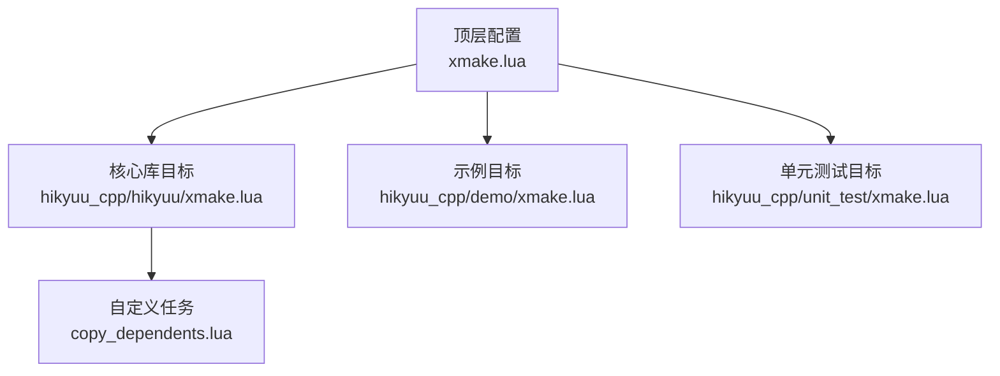
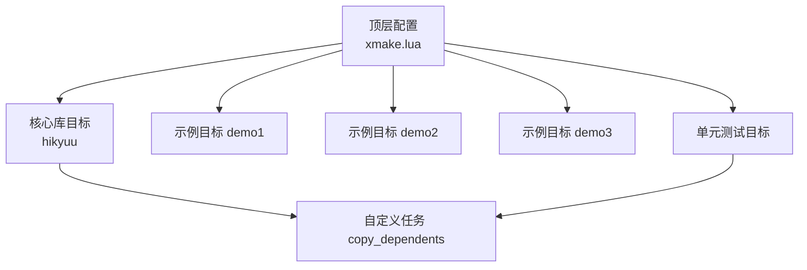
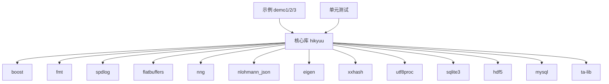

# C++核心库编译

<cite>
**本文引用的文件**
- [xmake.lua](file://xmake.lua)
- [hikyuu_cpp/hikyuu/xmake.lua](file://hikyuu_cpp/hikyuu/xmake.lua)
- [hikyuu_cpp/demo/xmake.lua](file://hikyuu_cpp/demo/xmake.lua)
- [hikyuu_cpp/unit_test/xmake.lua](file://hikyuu_cpp/unit_test/xmake.lua)
- [copy_dependents.lua](file://copy_dependents.lua)
- [setup.py](file://setup.py)
- [hikyuu_cpp/demo/demo1.cpp](file://hikyuu_cpp/demo/demo1.cpp)
</cite>

## 目录
1. [简介](#简介)
2. [项目结构](#项目结构)
3. [核心组件](#核心组件)
4. [架构总览](#架构总览)
5. [详细组件分析](#详细组件分析)
6. [依赖关系分析](#依赖关系分析)
7. [性能考量](#性能考量)
8. [故障排查指南](#故障排查指南)
9. [结论](#结论)
10. [附录](#附录)

## 简介
本文件面向需要编译Hikyuu C++核心库的开发者，系统化解读仓库中的编译配置与流程，重点围绕hikyuu_cpp/xmake.lua中的目标平台、编译器选项、依赖库链接（HDF5、MySQL、SQLite、TA-Lib）以及构建模式（release/debug）的定义；并提供通过xmake命令行进行编译的具体步骤、产物位置与命名规则，以及在Linux、Windows、macOS平台下的常见问题与解决方案。

## 项目结构
Hikyuu采用xmake作为统一构建系统，顶层xmake.lua负责全局配置与子模块包含，核心库位于hikyuu_cpp/hikyuu，示例与单元测试分别位于hikyuu_cpp/demo与hikyuu_cpp/unit_test。copy_dependents.lua是一个自定义任务，用于在构建后复制第三方依赖的头文件与库到输出目录，便于集成与分发。

图表来源
- [xmake.lua](file://xmake.lua#L241-L247)
- [hikyuu_cpp/hikyuu/xmake.lua](file://hikyuu_cpp/hikyuu/xmake.lua#L1-L20)
- [hikyuu_cpp/demo/xmake.lua](file://hikyuu_cpp/demo/xmake.lua#L1-L20)
- [hikyuu_cpp/unit_test/xmake.lua](file://hikyuu_cpp/unit_test/xmake.lua#L1-L20)
- [copy_dependents.lua](file://copy_dependents.lua#L1-L20)

章节来源
- [xmake.lua](file://xmake.lua#L1-L247)

## 核心组件
- 顶层构建配置：定义语言标准、警告级别、构建模式、全局宏与配置变量、依赖包版本与仓库、对象与目标目录布局、平台特定编译器标志与链接策略。
- 核心库目标（hikyuu）：根据配置启用/禁用HDF5、MySQL、SQLite、TDX、TA-Lib等数据引擎；设置导出符号、头文件收集、源文件分组与Unity构建；安装阶段复制必要的头文件与依赖库。
- 示例目标（demo1/2/3）：演示如何以二进制形式链接hikyuu库，处理Windows DLL导入导出宏差异。
- 单元测试目标（unit-test/small-test/real-test）：按功能拆分测试集合，准备测试数据与插件，支持覆盖率生成与跨平台Sanitizer。
- 自定义任务（copy_dependents）：在构建/安装后复制第三方依赖的头文件与库到输出目录，简化外部集成。

章节来源
- [xmake.lua](file://xmake.lua#L1-L247)
- [hikyuu_cpp/hikyuu/xmake.lua](file://hikyuu_cpp/hikyuu/xmake.lua#L1-L167)
- [hikyuu_cpp/demo/xmake.lua](file://hikyuu_cpp/demo/xmake.lua#L1-L71)
- [hikyuu_cpp/unit_test/xmake.lua](file://hikyuu_cpp/unit_test/xmake.lua#L1-L217)
- [copy_dependents.lua](file://copy_dependents.lua#L1-L84)

## 架构总览
下图展示从顶层配置到各目标的依赖与包含关系，以及关键的构建阶段（配置、下载依赖、编译、安装/复制依赖）。

图表来源
- [xmake.lua](file://xmake.lua#L241-L247)
- [hikyuu_cpp/hikyuu/xmake.lua](file://hikyuu_cpp/hikyuu/xmake.lua#L1-L20)
- [hikyuu_cpp/demo/xmake.lua](file://hikyuu_cpp/demo/xmake.lua#L1-L20)
- [hikyuu_cpp/unit_test/xmake.lua](file://hikyuu_cpp/unit_test/xmake.lua#L1-L20)
- [copy_dependents.lua](file://copy_dependents.lua#L1-L20)

## 详细组件分析

### 顶层构建配置（xmake.lua）
- 语言与警告：设置C++17标准与“全部警告”，确保跨平台一致性与高质量编码。
- 构建模式：启用debug/release模式，配合configvar设置调试/发布行为。
- 功能开关：通过option定义MySQL/HDF5/SQLite/TDx/TA-Lib/日志等级/异步日志/堆栈追踪/低精度/序列化/HTTP客户端压缩/SSL等特性开关，并在after_check中对相互依赖进行约束（如低精度开启时自动禁用TA-Lib）。
- 配置变量：将开关映射为HKU_*配置宏，供核心库条件编译使用。
- 依赖版本：针对不同平台设置HDF5、MySQL等依赖的版本号，统一通过add_requires引入，使用私有仓库管理。
- 包管理：集中声明boost、fmt、spdlog、sqlite3、flatbuffers、nng、nlohmann_json、eigen、xxhash、utf8proc、gzip-hpp（可选）、ta-lib（可选）等依赖。
- 目录布局：设置对象目录与目标目录，统一按模式/平台/架构组织产物。
- 平台与编译器：Windows上设置运行时、禁用部分告警、添加MSVC特定标志；类Unix平台设置隐藏符号、线程相关标志与兼容性编译参数。
- 包含子模块：通过includes包含核心库、示例、单元测试与Python封装（非交叉编译时）。

章节来源
- [xmake.lua](file://xmake.lua#L1-L247)

### 核心库目标（hikyuu）
- 目标类型：由全局kind决定（shared或static），Windows下DLL导出/导入宏区分。
- 依赖包：按平台条件启用sqlite3、hdf5、mysql、ta-lib等包；同时引入fmt、spdlog、flatbuffers、nng、nlohmann_json、eigen、xxhash等通用依赖。
- 头文件与源文件：收集公共头文件，按功能模块分组（基础、指标、分析、全局、插件、策略、交易管理、交易系统、工具、数据驱动等），启用Unity构建提升编译速度。
- 数据引擎选择：根据配置启用HDF5/MySQL/SQLite/TDX引擎，相应地包含对应驱动与连接实现。
- 平台链接：Windows下链接bcrypt；macOS下链接iconv、sqlite3并引入CoreFoundation框架；类Unix默认rpath。
- 安装阶段：复制必要的Python封装头文件与依赖库到安装目录，便于后续打包与集成。

章节来源
- [hikyuu_cpp/hikyuu/xmake.lua](file://hikyuu_cpp/hikyuu/xmake.lua#L1-L167)

### 示例目标（demo1/2/3）
- 目标类型：二进制可执行文件，依赖核心库目标。
- 平台差异：Windows下DLL导入导出宏与编译告警抑制；类Unix平台保持通用编译参数。
- 依赖：示例目标同样依赖核心库，便于演示如何正确链接与使用。

章节来源
- [hikyuu_cpp/demo/xmake.lua](file://hikyuu_cpp/demo/xmake.lua#L1-L71)
- [hikyuu_cpp/demo/demo1.cpp](file://hikyuu_cpp/demo/demo1.cpp#L1-L69)

### 单元测试目标（unit-test/small-test/real-test）
- 测试目标：按功能拆分，small-test聚焦核心子集，unit-test覆盖更广，real-test启用真实数据测试。
- Sanitizer：在macOS/Linux上可启用Address/Leak Sanitizer，辅助内存问题检测。
- 依赖：按需引入doctest、sqlite3、mysql/ mysqlclient（macOS特例）、ta-lib（可选）等。
- 运行准备：before_run阶段复制测试数据与插件到构建输出目录；after_run阶段生成覆盖率报告（Linux/macOS）。
- 平台链接：类Unix平台设置rpath，保证运行时能正确解析相对路径依赖。

章节来源
- [hikyuu_cpp/unit_test/xmake.lua](file://hikyuu_cpp/unit_test/xmake.lua#L1-L217)

### 自定义任务（copy_dependents）
- 作用：在构建或安装后，遍历目标所依赖的包，将头文件与库文件复制到输出目录（Windows额外复制DLL），便于独立分发与集成。
- 行为：跳过系统库，过滤特定目录名（如opencv），支持字符串或数组形式的includedirs/sysincludedirs。

章节来源
- [copy_dependents.lua](file://copy_dependents.lua#L1-L84)

## 依赖关系分析
- 组件耦合：核心库目标依赖多个第三方包；示例与测试目标均依赖核心库；copy_dependents贯穿构建与安装阶段，降低外部集成复杂度。
- 直接/间接依赖：add_requires统一声明，xmake自动解析传递依赖；install阶段通过copy_dependents复制必要文件。
- 循环依赖：未见循环依赖迹象；依赖方向清晰（示例/测试 -> 核心库 -> 第三方包）。
- 外部依赖：HDF5、MySQL、SQLite、TA-Lib、Boost、fmt、spdlog、flatbuffers、nng、nlohmann_json、eigen、xxhash、utf8proc、gzip-hpp等。

图表来源
- [xmake.lua](file://xmake.lua#L172-L191)
- [hikyuu_cpp/hikyuu/xmake.lua](file://hikyuu_cpp/hikyuu/xmake.lua#L17-L31)
- [hikyuu_cpp/unit_test/xmake.lua](file://hikyuu_cpp/unit_test/xmake.lua#L69-L76)

章节来源
- [xmake.lua](file://xmake.lua#L172-L191)
- [hikyuu_cpp/hikyuu/xmake.lua](file://hikyuu_cpp/hikyuu/xmake.lua#L17-L31)
- [hikyuu_cpp/unit_test/xmake.lua](file://hikyuu_cpp/unit_test/xmake.lua#L69-L76)

## 性能考量
- Unity构建：核心库启用c++.unity_build，按功能模块分组，减少编译开销，提升整体编译效率。
- LTO优化：注释掉的策略表明可选开启链接时优化（需结合平台与工具链验证）。
- 线程与向量扩展：类Unix平台设置线程与模板深度相关编译参数，保障大工程编译稳定性。
- 日志与追踪：日志等级、异步日志、SQL追踪、堆栈追踪等可通过配置开关控制，避免在Release模式下引入不必要的开销。

章节来源
- [hikyuu_cpp/hikyuu/xmake.lua](file://hikyuu_cpp/hikyuu/xmake.lua#L81-L86)
- [xmake.lua](file://xmake.lua#L223-L239)

## 故障排查指南
- 依赖版本冲突
  - 现象：不同平台依赖版本不一致导致链接失败或运行时异常。
  - 处理：确认xmake.lua中针对Windows/Linux/macOS的HDF5/MySQL版本设置是否符合本地环境；必要时调整add_requires版本号。
  - 参考
    - [xmake.lua](file://xmake.lua#L116-L126)
- Windows DLL运行时问题
  - 现象：运行时找不到DLL或符号导出问题。
  - 处理：确保使用共享库模式时设置runtimes为MD；示例与核心库在Windows下区分导出/导入宏；copy_dependents会复制DLL到输出目录。
  - 参考
    - [xmake.lua](file://xmake.lua#L197-L201)
    - [hikyuu_cpp/hikyuu/xmake.lua](file://hikyuu_cpp/hikyuu/xmake.lua#L63-L68)
    - [hikyuu_cpp/demo/xmake.lua](file://hikyuu_cpp/demo/xmake.lua#L13-L17)
    - [copy_dependents.lua](file://copy_dependents.lua#L64-L69)
- Linux/macOS运行时库查找
  - 现象：找不到动态库或rpath导致加载失败。
  - 处理：类Unix平台默认设置rpath；单元测试目标显式设置-Wl,-rpath=$ORIGIN等；确保依赖库已安装且路径可达。
  - 参考
    - [hikyuu_cpp/hikyuu/xmake.lua](file://hikyuu_cpp/hikyuu/xmake.lua#L51-L54)
    - [hikyuu_cpp/unit_test/xmake.lua](file://hikyuu_cpp/unit_test/xmake.lua#L94-L97)
- TA-Lib与低精度冲突
  - 现象：启用低精度后TA-Lib被自动禁用。
  - 处理：若必须使用TA-Lib，请关闭低精度；或在after_check中确认逻辑生效。
  - 参考
    - [xmake.lua](file://xmake.lua#L54-L67)
- 序列化与运行时
  - 现象：Windows使用动态库且启用序列化时可能遇到运行时问题。
  - 处理：按注释建议设置runtimes为MD；或改用静态库。
  - 参考
    - [xmake.lua](file://xmake.lua#L44-L47)
- Python集成与产物命名
  - 现象：Python封装产物命名随平台与Python版本变化。
  - 处理：查看hikyuu_pywrap的xmake.lua中对产物命名的处理逻辑，确保与Python版本匹配。
  - 参考
    - [hikyuu_cpp/hikyuu/xmake.lua](file://hikyuu_cpp/hikyuu/xmake.lua#L150-L166)
    - [hikyuu_cpp/unit_test/xmake.lua](file://hikyuu_cpp/unit_test/xmake.lua#L1-L20)

章节来源
- [xmake.lua](file://xmake.lua#L44-L47)
- [xmake.lua](file://xmake.lua#L54-L67)
- [xmake.lua](file://xmake.lua#L116-L126)
- [xmake.lua](file://xmake.lua#L197-L201)
- [hikyuu_cpp/hikyuu/xmake.lua](file://hikyuu_cpp/hikyuu/xmake.lua#L51-L68)
- [hikyuu_cpp/hikyuu/xmake.lua](file://hikyuu_cpp/hikyuu/xmake.lua#L150-L166)
- [hikyuu_cpp/unit_test/xmake.lua](file://hikyuu_cpp/unit_test/xmake.lua#L1-L20)

## 结论
通过顶层xmake.lua的集中配置与目标级细化，Hikyuu实现了跨平台、可定制的C++核心库编译体系。核心库目标按功能模块组织源码并启用Unity构建，显著提升编译效率；通过copy_dependents简化了第三方依赖的分发与集成。建议在不同平台下遵循本文提供的选项与注意事项，以获得稳定可靠的构建结果。

## 附录

### 编译命令与产物位置
- 基本命令
  - 配置与构建：使用xmake f进行配置，随后xmake进行构建；也可通过setup.py封装调用。
  - 参考
    - [xmake.lua](file://xmake.lua#L1-L20)
    - [setup.py](file://setup.py#L105-L155)
- 产物位置与命名规则
  - 对象目录：按模式/平台/架构组织，路径包含“.objs”。
  - 目标目录：按模式/平台/架构组织，路径包含“lib”。
  - 核心库：目标名为“hikyuu”，产物类型由全局kind决定（shared或static）。
  - 示例与测试：目标名为demo1/2/3与unit-test/small-test/real-test，产物位于各自目标目录。
  - 参考
    - [xmake.lua](file://xmake.lua#L194-L196)
    - [hikyuu_cpp/hikyuu/xmake.lua](file://hikyuu_cpp/hikyuu/xmake.lua#L1-L20)
    - [hikyuu_cpp/demo/xmake.lua](file://hikyuu_cpp/demo/xmake.lua#L1-L20)
    - [hikyuu_cpp/unit_test/xmake.lua](file://hikyuu_cpp/unit_test/xmake.lua#L1-L20)

### 平台编译步骤
- Linux
  - 安装依赖：确保系统已安装SQLite、OpenSSL、zlib等系统库；必要时安装MySQL开发包。
  - 配置：xmake f -m release -k shared（或static）；根据需要开启mysql/hdf5/sqlite/ta_lib等选项。
  - 构建：xmake -j并行编译；完成后在目标目录查看产物。
  - 参考
    - [xmake.lua](file://xmake.lua#L223-L239)
    - [hikyuu_cpp/hikyuu/xmake.lua](file://hikyuu_cpp/hikyuu/xmake.lua#L51-L54)
- Windows
  - 安装依赖：确保Visual Studio与所需工具链可用；MySQL/HDF5等二进制库路径正确。
  - 配置：xmake f -m release -k shared（建议）；设置runtimes=MD；开启所需引擎。
  - 构建：xmake -j并行编译；完成后在目标目录查看DLL/EXE与lib。
  - 参考
    - [xmake.lua](file://xmake.lua#L211-L221)
    - [xmake.lua](file://xmake.lua#L197-L201)
    - [hikyuu_cpp/hikyuu/xmake.lua](file://hikyuu_cpp/hikyuu/xmake.lua#L63-L68)
- macOS
  - 安装依赖：Homebrew安装sqlite3、openssl、zlib等；MySQL/HDF5按需安装。
  - 配置：xmake f -m release -k shared（或static）；macOS下自动链接iconv、sqlite3并引入CoreFoundation框架。
  - 构建：xmake -j并行编译；产物为dylib或静态库。
  - 参考
    - [xmake.lua](file://xmake.lua#L231-L233)
    - [hikyuu_cpp/hikyuu/xmake.lua](file://hikyuu_cpp/hikyuu/xmake.lua#L74-L77)

### 常见问题与解决方案
- 依赖库路径配置
  - 使用add_requires声明依赖版本；Windows下copy_dependents会复制DLL；类Unix平台设置rpath。
  - 参考
    - [xmake.lua](file://xmake.lua#L172-L191)
    - [copy_dependents.lua](file://copy_dependents.lua#L64-L69)
- 版本兼容性
  - 不同平台的HDF5/MySQL版本不同，需按平台设置；TA-Lib与低精度互斥。
  - 参考
    - [xmake.lua](file://xmake.lua#L116-L126)
    - [xmake.lua](file://xmake.lua#L54-L67)
- 构建模式选择
  - Release建议开启隐藏符号与优化；Debug启用调试信息与安全检查。
  - 参考
    - [xmake.lua](file://xmake.lua#L203-L209)