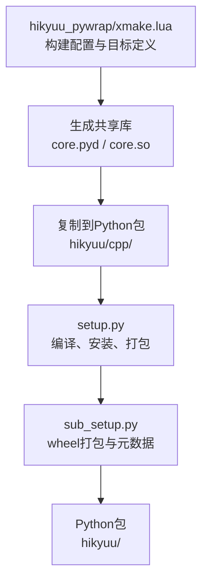
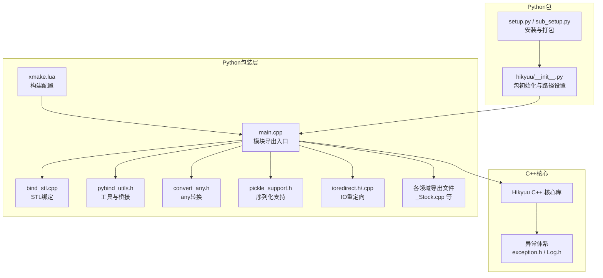
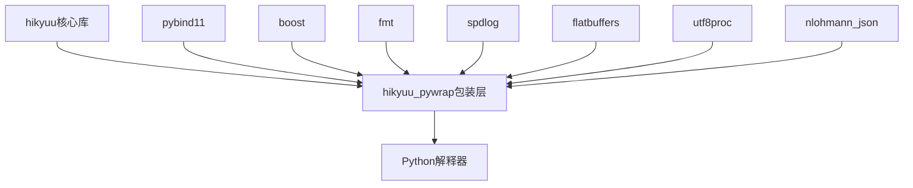
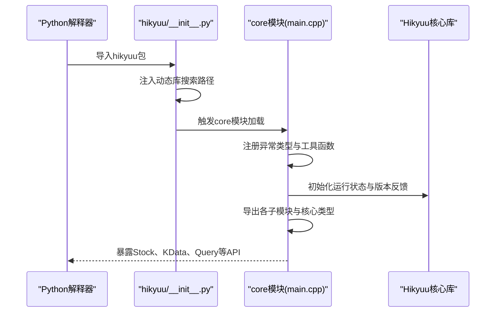

# Python包装层生成

<cite>
**本文引用的文件**
- [hikyuu_pywrap/xmake.lua](file://hikyuu_pywrap/xmake.lua)
- [hikyuu_pywrap/main.cpp](file://hikyuu_pywrap/main.cpp)
- [hikyuu_pywrap/bind_stl.cpp](file://hikyuu_pywrap/bind_stl.cpp)
- [hikyuu_pywrap/pybind_utils.h](file://hikyuu_pywrap/pybind_utils.h)
- [hikyuu_pywrap/convert_any.h](file://hikyuu_pywrap/convert_any.h)
- [hikyuu_pywrap/pickle_support.h](file://hikyuu_pywrap/pickle_support.h)
- [hikyuu_pywrap/ioredirect.h](file://hikyuu_pywrap/ioredirect.h)
- [hikyuu_pywrap/ioredirect.cpp](file://hikyuu_pywrap/ioredirect.cpp)
- [hikyuu_pywrap/_Stock.cpp](file://hikyuu_pywrap/_Stock.cpp)
- [hikyuu/setup.py](file://setup.py)
- [hikyuu/sub_setup.py](file://sub_setup.py)
- [hikyuu/__init__.py](file://hikyuu/__init__.py)
- [hikyuu_cpp/hikyuu/utilities/exception.h](file://hikyuu_cpp/hikyuu/utilities/exception.h)
- [hikyuu_cpp/hikyuu/utilities/Log.h](file://hikyuu_cpp/hikyuu/utilities/Log.h)
</cite>

## 目录
1. [简介](#简介)
2. [项目结构](#项目结构)
3. [核心组件](#核心组件)
4. [架构总览](#架构总览)
5. [详细组件分析](#详细组件分析)
6. [依赖关系分析](#依赖关系分析)
7. [性能考量](#性能考量)
8. [故障排查指南](#故障排查指南)
9. [结论](#结论)
10. [附录](#附录)

## 简介
本文件面向开发者，系统性阐述Hikyuu项目的Python包装层生成流程与实现细节。重点围绕hikyuu_pywrap/xmake.lua中的构建配置，说明如何使用pybind11将C++核心库的功能暴露给Python；详细描述包装层的构建过程、扩展模块的生成与部署、Python包中的存放位置；并深入讲解C++类到Python对象的映射策略、函数重载绑定、异常传递机制、STL容器绑定、序列化支持、IO重定向等关键技术细节。文末提供可操作的构建与使用指引，帮助读者快速完成本地构建、打包与发布。

## 项目结构
Hikyuu的Python包装层位于hikyuu_pywrap目录，采用xmake作为构建系统，通过pybind11将C++核心库导出为Python可导入的共享库（Windows为.pyd，Linux/macOS为.so）。构建完成后，包装层产物被复制到Python包hikyuu/cpp目录下，并由setup.py与sub_setup.py负责打包与安装。

图表来源
- [hikyuu_pywrap/xmake.lua](file://hikyuu_pywrap/xmake.lua#L1-L174)
- [hikyuu/setup.py](file://setup.py#L1-L437)
- [hikyuu/sub_setup.py](file://sub_setup.py#L1-L136)

章节来源
- [hikyuu_pywrap/xmake.lua](file://hikyuu_pywrap/xmake.lua#L1-L174)
- [hikyuu/setup.py](file://setup.py#L1-L437)
- [hikyuu/sub_setup.py](file://sub_setup.py#L1-L136)

## 核心组件
- 构建目标与平台适配：通过xmake.lua定义共享库目标core，自动识别平台差异（Windows、Linux、macOS），设置文件名、链接器标志、rpath、Python头文件与库路径发现逻辑。
- 主模块导出入口：main.cpp中使用PYBIND11_MODULE宏导出模块，并注册异常类型、全局工具函数、核心数据类型与业务模块。
- STL容器绑定：bind_stl.cpp集中绑定常用容器，兼顾性能与易用性。
- 工具与辅助：pybind_utils.h提供向量化转换、克隆桥接、参数校验等通用能力；convert_any.h实现boost::any与Python对象的双向转换；pickle_support.h提供可选的序列化支持；ioredirect.h/ioredirect.cpp提供C++到Python的IO重定向。
- 包装层组织：各功能域（数据驱动、指标、交易管理、交易系统、全局、分析、插件等）分别在独立文件中导出，最终在main.cpp中统一聚合。

章节来源
- [hikyuu_pywrap/main.cpp](file://hikyuu_pywrap/main.cpp#L1-L192)
- [hikyuu_pywrap/bind_stl.cpp](file://hikyuu_pywrap/bind_stl.cpp#L1-L36)
- [hikyuu_pywrap/pybind_utils.h](file://hikyuu_pywrap/pybind_utils.h#L1-L130)
- [hikyuu_pywrap/convert_any.h](file://hikyuu_pywrap/convert_any.h#L1-L299)
- [hikyuu_pywrap/pickle_support.h](file://hikyuu_pywrap/pickle_support.h#L1-L91)
- [hikyuu_pywrap/ioredirect.h](file://hikyuu_pywrap/ioredirect.h#L1-L53)
- [hikyuu_pywrap/ioredirect.cpp](file://hikyuu_pywrap/ioredirect.cpp#L1-L39)

## 架构总览
下图展示从C++核心到Python可导入模块的整体架构与交互关系。

图表来源
- [hikyuu_pywrap/xmake.lua](file://hikyuu_pywrap/xmake.lua#L1-L174)
- [hikyuu_pywrap/main.cpp](file://hikyuu_pywrap/main.cpp#L1-L192)
- [hikyuu_pywrap/bind_stl.cpp](file://hikyuu_pywrap/bind_stl.cpp#L1-L36)
- [hikyuu_pywrap/pybind_utils.h](file://hikyuu_pywrap/pybind_utils.h#L1-L130)
- [hikyuu_pywrap/convert_any.h](file://hikyuu_pywrap/convert_any.h#L1-L299)
- [hikyuu_pywrap/pickle_support.h](file://hikyuu_pywrap/pickle_support.h#L1-L91)
- [hikyuu_pywrap/ioredirect.h](file://hikyuu_pywrap/ioredirect.h#L1-L53)
- [hikyuu_pywrap/ioredirect.cpp](file://hikyuu_pywrap/ioredirect.cpp#L1-L39)
- [hikyuu/__init__.py](file://hikyuu/__init__.py#L1-L595)
- [hikyuu/setup.py](file://setup.py#L1-L437)
- [hikyuu/sub_setup.py](file://sub_setup.py#L1-L136)

## 详细组件分析

### 构建系统与模块命名（xmake.lua）
- 目标与类型：定义共享库目标core，Windows下输出core.pyd，非Windows输出core.so。
- 依赖与包：依赖hikyuu核心目标，并引入boost、fmt、spdlog、flatbuffers、pybind11、utf8proc、nlohmann_json等第三方库。
- 平台适配：
  - Linux/Cross：设置rpath，使运行时能正确解析相对路径依赖。
  - macOS：添加动态库链接目录与特殊链接标志，避免undefined dynamic_lookup问题。
  - Windows：启用大对象编译选项与忽略特定告警；在共享库模式下定义导入符号宏。
- Python探测：在不同平台自动查找Python可执行路径、包含目录与库目录，通过python-config或python3-config获取编译与链接参数。
- 产物复制：构建完成后将生成的共享库复制到hikyuu/cpp目录，并根据平台调整文件名与后缀；macOS下还会修正install_name以指向相对路径的依赖库。
- 交叉编译：对cross平台进行特殊处理，避免不必要的移动与拷贝。

章节来源
- [hikyuu_pywrap/xmake.lua](file://hikyuu_pywrap/xmake.lua#L1-L174)

### 模块导出入口（main.cpp）
- 模块命名：根据Python次版本号选择不同的模块名（如core38、core39、core310、core311、core312、core313、core314），以适配多版本Python。
- 异常映射：注册C++异常类型为Python异常，便于在Python侧捕获与处理。
- 全局初始化：设置运行状态、反馈版本信息、注册各子模块导出函数。
- 导出清单：依次导出基础类型（DataType、Constant、Datetime、TimeDelta、Parameter、Log）、核心实体（Stock、StockManager、Block、MarketInfo、StockTypeInfo、StockWeight、KQuery、KData、KRecord、TimeLineRecord、TransRecord）、数据驱动、指标、交易管理、交易系统、全局、分析、策略、插件等。
- 工具函数：导出版本查询、初始化、耗时统计开关、IO重定向控制、Jupyter/交互环境检测等。

章节来源
- [hikyuu_pywrap/main.cpp](file://hikyuu_pywrap/main.cpp#L1-L192)

### STL容器绑定（bind_stl.cpp）
- 选择性绑定：针对可能影响性能的容器（如DatetimeList、KRecordList、StockWeightList、TimeLineList、TransList、PositionRecordList、TradeRecordList、SystemWeightList、ScoreRecordList）进行显式绑定，提升Python侧与C++侧的互操作效率。
- 绑定策略：使用py::bind_vector进行高效绑定，避免默认的隐式转换带来的额外开销。

章节来源
- [hikyuu_pywrap/bind_stl.cpp](file://hikyuu_pywrap/bind_stl.cpp#L1-L36)

### 工具与桥接（pybind_utils.h）
- 向量化转换：提供vector与bytes之间的互转，便于高性能数据传输。
- 列表转换：提供Python序列到std::vector的转换与反向转换。
- 克隆桥接宏：通过宏定义简化Python对象在C++侧的克隆行为，避免类型丢失。
- 参数校验：提供检查Python函数参数个数的工具方法。
- 字符串与编码：提供UTF-8到UTF-32的转换接口声明。

章节来源
- [hikyuu_pywrap/pybind_utils.h](file://hikyuu_pywrap/pybind_utils.h#L1-L130)

### 任意类型转换（convert_any.h）
- boost::any双向转换：支持Python布尔、整数、浮点、字符串、Datetime、Stock、Block、KQuery、KData、序列等类型的自动转换。
- 序列转换策略：对Datetime序列与数值序列分别处理，必要时回退到Python datetime转换。
- C++到Python：对常见类型进行构造器调用或列表拼接，返回可执行的Python表达式以重建对象。
- 错误处理：在不支持的类型或长度不匹配时抛出异常。

章节来源
- [hikyuu_pywrap/convert_any.h](file://hikyuu_pywrap/convert_any.h#L1-L299)

### 序列化支持（pickle_support.h）
- 条件编译：根据配置决定是否启用Python pickle支持（二进制/XML/文本归档）。
- 宏定义：DEF_PICKLE宏封装pickle序列化与反序列化逻辑，支持bytes与字符串两种输入形式。
- 适用范围：当编译配置允许归档时，可在Python侧对C++对象进行持久化与恢复。

章节来源
- [hikyuu_pywrap/pickle_support.h](file://hikyuu_pywrap/pickle_support.h#L1-L91)

### IO重定向（ioredirect.h/.cpp）
- 功能：将C++标准输出/错误流重定向到Python，便于在Jupyter等环境中查看日志与调试信息。
- 实现：基于pybind11的iostream重定向设施，提供open_ostream_to_python与close_ostream_to_python两个函数，并封装OStreamToPython类以支持RAII风格的开关控制。

章节来源
- [hikyuu_pywrap/ioredirect.h](file://hikyuu_pywrap/ioredirect.h#L1-L53)
- [hikyuu_pywrap/ioredirect.cpp](file://hikyuu_pywrap/ioredirect.cpp#L1-L39)

### 类型映射与函数重载（以Stock为例）
- 类映射：通过py::class_将C++ Stock类映射到Python的Stock类型，提供属性访问、方法绑定与文档字符串。
- 属性绑定：使用property与property_readonly，结合overload_cast实现getter/setter重载。
- 方法重载：对getKRecord等方法使用指针签名重载，配合py::arg进行参数命名与默认值设置。
- Lambda桥接：对复杂返回值（如getIndexRange）使用lambda返回元组，简化Python侧解包。
- 文档字符串：为每个导出方法提供中文文档字符串，提升可读性。

章节来源
- [hikyuu_pywrap/_Stock.cpp](file://hikyuu_pywrap/_Stock.cpp#L1-L200)

### 异常传递机制
- C++异常模型：Hikyuu使用自定义exception类与多种断言/检查宏（HKU_CHECK、HKU_ASSERT、CLS_THROW等）统一抛出异常。
- Python映射：在模块导出入口处将C++异常注册为Python异常类型，Python侧可直接捕获并处理。
- 传播路径：从C++核心库到包装层再到Python调用栈，异常消息携带文件、函数、行号等上下文信息，便于定位问题。

章节来源
- [hikyuu_cpp/hikyuu/utilities/exception.h](file://hikyuu_cpp/hikyuu/utilities/exception.h#L1-L52)
- [hikyuu_cpp/hikyuu/utilities/Log.h](file://hikyuu_cpp/hikyuu/utilities/Log.h#L107-L131)
- [hikyuu_cpp/hikyuu/utilities/Log.h](file://hikyuu_cpp/hikyuu/utilities/Log.h#L133-L153)
- [hikyuu_cpp/hikyuu/utilities/Log.h](file://hikyuu_cpp/hikyuu/utilities/Log.h#L155-L168)
- [hikyuu_cpp/hikyuu/utilities/Log.h](file://hikyuu_cpp/hikyuu/utilities/Log.h#L170-L188)
- [hikyuu_cpp/hikyuu/utilities/Log.h](file://hikyuu_cpp/hikyuu/utilities/Log.h#L190-L204)
- [hikyuu_cpp/hikyuu/utilities/Log.h](file://hikyuu_cpp/hikyuu/utilities/Log.h#L421-L438)
- [hikyuu_pywrap/main.cpp](file://hikyuu_pywrap/main.cpp#L1-L192)

### Python包初始化与运行时路径
- 路径注入：在Windows与类Unix系统中分别设置PATH与LD_LIBRARY_PATH，确保动态库可被正确加载。
- 插件与语言资源：设置插件路径与国际化资源路径，保证运行期功能完整。
- 交互环境：在Jupyter或交互环境中自动开启IO重定向，改善用户体验。
- 序列化工具：提供hku_save/hku_load便捷函数，基于pickle实现对象持久化。

章节来源
- [hikyuu/__init__.py](file://hikyuu/__init__.py#L1-L595)

## 依赖关系分析
下图展示包装层与核心库、第三方库以及Python生态的关键依赖关系。

图表来源
- [hikyuu_pywrap/xmake.lua](file://hikyuu_pywrap/xmake.lua#L1-L174)

章节来源
- [hikyuu_pywrap/xmake.lua](file://hikyuu_pywrap/xmake.lua#L1-L174)

## 性能考量
- STL绑定优化：仅对高风险容器进行显式绑定，减少隐式转换带来的拷贝与性能损耗。
- 向量化传输：通过vector_to_python_bytes/python_bytes_to_vector实现高效数据搬运。
- 平台链接优化：Linux设置rpath，macOS修正install_name，避免运行时查找失败与重复加载。
- 并行构建：xmake支持多核编译，加速大型目标构建。

章节来源
- [hikyuu_pywrap/bind_stl.cpp](file://hikyuu_pywrap/bind_stl.cpp#L1-L36)
- [hikyuu_pywrap/pybind_utils.h](file://hikyuu_pywrap/pybind_utils.h#L1-L130)
- [hikyuu_pywrap/xmake.lua](file://hikyuu_pywrap/xmake.lua#L1-L174)

## 故障排查指南
- Python版本不匹配：若Python版本变化，需清理旧编译产物并重新配置。setup.py提供clear_build与clear_with_python_changed逻辑，避免残留目标导致链接失败。
- 平台路径问题：Windows需确保DLL目录加入PATH；类Unix系统需设置LD_LIBRARY_PATH。hikyuu/__init__.py在导入时自动注入路径。
- 动态库加载失败：macOS下install_name需正确指向相对路径依赖；xmake.lua在after_build阶段修正install_name。
- IO输出异常：在Jupyter或非交互环境中，使用open_ostream_to_python/close_ostream_to_python控制C++输出重定向。
- 异常定位：利用C++异常的文件、函数、行号信息，结合Python侧捕获，快速定位问题。

章节来源
- [hikyuu/setup.py](file://setup.py#L1-L437)
- [hikyuu/__init__.py](file://hikyuu/__init__.py#L1-L595)
- [hikyuu_pywrap/ioredirect.h](file://hikyuu_pywrap/ioredirect.h#L1-L53)
- [hikyuu_pywrap/ioredirect.cpp](file://hikyuu_pywrap/ioredirect.cpp#L1-L39)
- [hikyuu_pywrap/xmake.lua](file://hikyuu_pywrap/xmake.lua#L1-L174)

## 结论
Hikyuu的Python包装层通过xmake与pybind11实现了对C++核心库的完整导出，覆盖数据类型、业务模块、工具函数与IO重定向等多个方面。构建系统具备良好的跨平台适配能力，包装层在性能与易用性之间取得平衡。借助异常映射、STL绑定、任意类型转换与可选序列化支持，用户可在Python侧高效使用Hikyuu的核心能力。

## 附录

### 构建与安装流程
- 本地构建：使用setup.py的build命令，自动检测xmake并执行编译，随后将产物复制到hikyuu/cpp目录。
- 安装：install命令编译并复制到站点包目录，同时复制C++头文件到include目录。
- 打包：wheel命令生成wheel包，sub_setup.py负责收集包数据与元信息。
- 清理：clear/clear_build命令清理构建产物与历史编译信息。

章节来源
- [hikyuu/setup.py](file://setup.py#L1-L437)
- [hikyuu/sub_setup.py](file://sub_setup.py#L1-L136)

### Python包布局与产物位置
- 产物存放：构建完成后，共享库被复制到hikyuu/cpp目录，文件名包含Python次版本号（如core310），并在macOS下追加.so后缀。
- 包含内容：wheel打包时包含动态库、MO语言文件、配置与脚本等资源，确保安装后可直接使用。

章节来源
- [hikyuu_pywrap/xmake.lua](file://hikyuu_pywrap/xmake.lua#L1-L174)
- [hikyuu/sub_setup.py](file://sub_setup.py#L1-L136)

### 关键流程时序图：模块导出与初始化

图表来源
- [hikyuu/__init__.py](file://hikyuu/__init__.py#L1-L595)
- [hikyuu_pywrap/main.cpp](file://hikyuu_pywrap/main.cpp#L1-L192)