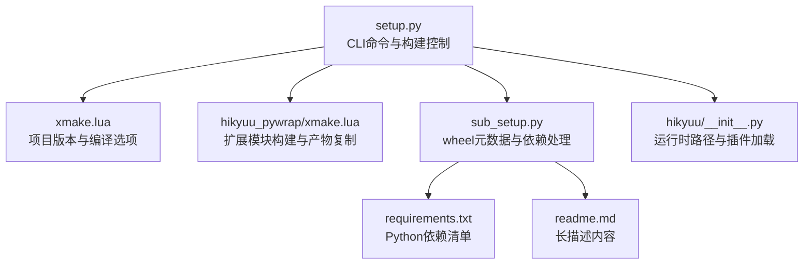
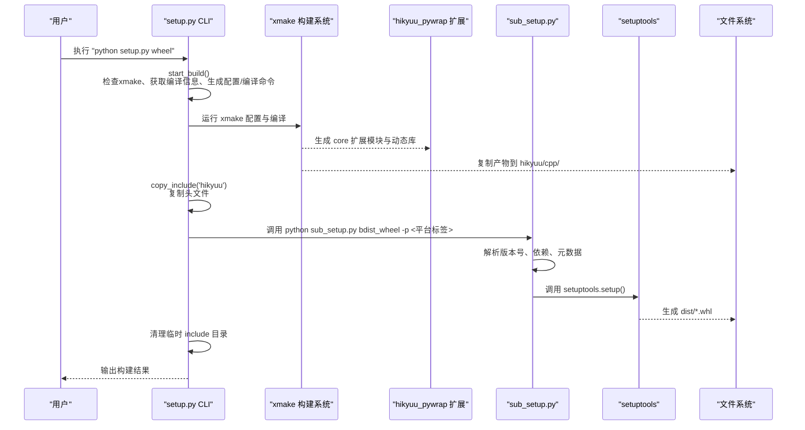
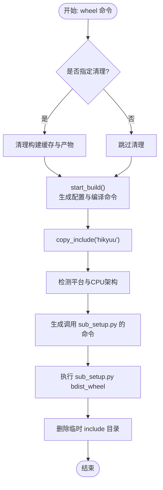
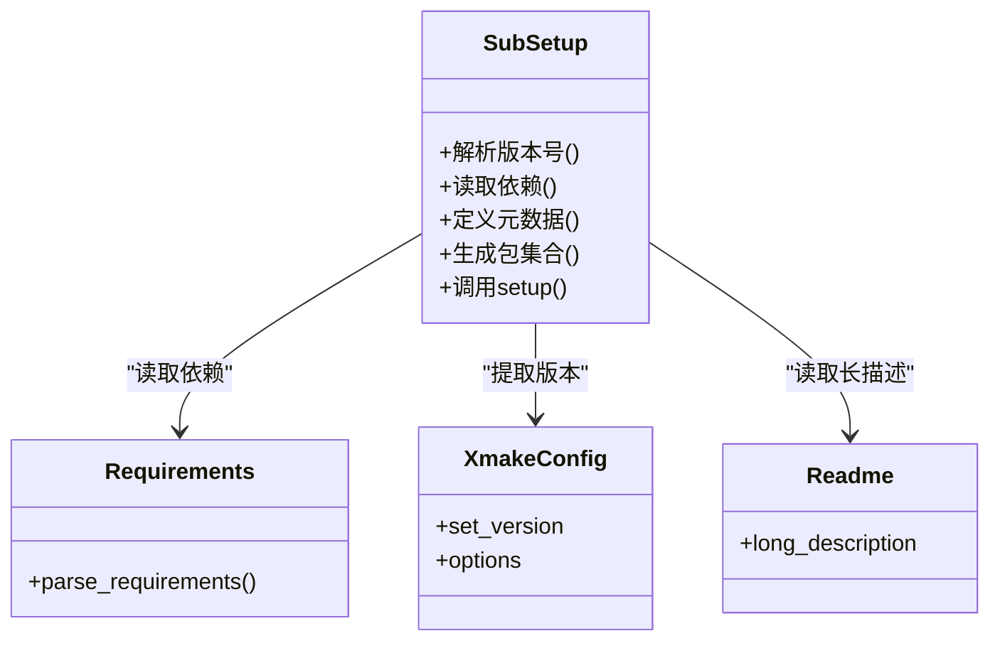
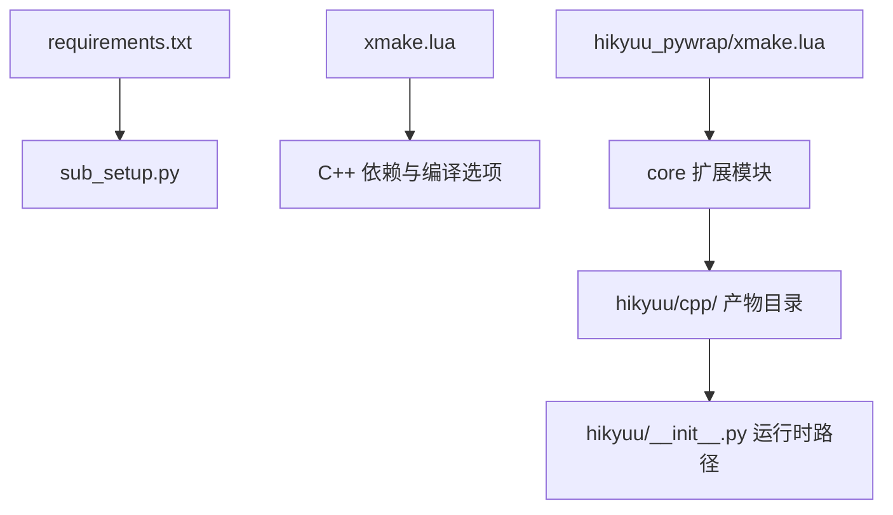

# setup.py构建流程

<cite>
**本文引用的文件**
- [setup.py](file://setup.py)
- [sub_setup.py](file://sub_setup.py)
- [requirements.txt](file://requirements.txt)
- [xmake.lua](file://xmake.lua)
- [hikyuu_pywrap/xmake.lua](file://hikyuu_pywrap/xmake.lua)
- [hikyuu/__init__.py](file://hikyuu/__init__.py)
- [readme.md](file://readme.md)
</cite>

## 目录
1. [简介](#简介)
2. [项目结构](#项目结构)
3. [核心组件](#核心组件)
4. [架构总览](#架构总览)
5. [详细组件分析](#详细组件分析)
6. [依赖关系分析](#依赖关系分析)
7. [性能考量](#性能考量)
8. [故障排查指南](#故障排查指南)
9. [结论](#结论)
10. [附录](#附录)

## 简介
本文件围绕 Hikyuu 项目的 Python 包构建流程展开，重点解析以下内容：
- setup.py 的执行逻辑与命令体系：前置检查（xmake 工具检测）、编译信息管理（Python 版本与平台信息的获取与持久化）、编译命令生成与执行。
- sub_setup.py 在构建 wheel 包时的作用：版本号提取、包元数据定义、依赖项处理与平台特定配置。
- 通过 setup.py 提供的命令行接口（build、install、wheel、test、clear、uninstall、upload）完成完整的构建与打包过程，并给出各命令的使用示例与参数说明。

## 项目结构
Hikyuu 的构建采用“Python 包构建 + C++ 扩展编译”的双轨机制：
- Python 层：setup.py 提供 CLI 命令，负责编译 C++ 扩展、复制头文件、调用子脚本生成 wheel。
- 子脚本层：sub_setup.py 负责读取版本号、收集包元数据、解析依赖、定义打包规则并调用 setuptools。
- C++ 扩展层：hikyuu_pywrap 目录下的源码通过 xmake.lua 配置，使用 pybind11 包装 C++ 核心库，生成 Python 扩展模块。
- 版本与配置：xmake.lua 定义项目版本与编译选项；hikyuu_pywrap/xmake.lua 定义扩展模块的构建细节与运行时链接策略。

图表来源
- [setup.py](file://setup.py#L1-L437)
- [sub_setup.py](file://sub_setup.py#L1-L136)
- [requirements.txt](file://requirements.txt#L1-L22)
- [xmake.lua](file://xmake.lua#L1-L247)
- [hikyuu_pywrap/xmake.lua](file://hikyuu_pywrap/xmake.lua#L1-L174)
- [hikyuu/__init__.py](file://hikyuu/__init__.py#L1-L120)
- [readme.md](file://readme.md#L1-L115)

章节来源
- [setup.py](file://setup.py#L1-L437)
- [sub_setup.py](file://sub_setup.py#L1-L136)
- [requirements.txt](file://requirements.txt#L1-L22)
- [xmake.lua](file://xmake.lua#L1-L247)
- [hikyuu_pywrap/xmake.lua](file://hikyuu_pywrap/xmake.lua#L1-L174)
- [hikyuu/__init__.py](file://hikyuu/__init__.py#L1-L120)
- [readme.md](file://readme.md#L1-L115)

## 核心组件
- 前置检查与编译信息管理
  - xmake 工具检测：在执行构建前校验 xmake 是否可用。
  - Python 版本与平台信息：获取当前 Python 主次版本、位数、平台与架构，形成编译信息字典。
  - 历史编译信息：读取 compile_info 文件，用于判断是否需要清理或重新编译。
  - 保存当前编译信息：将本次编译配置写回 compile_info，便于下次增量判断。
- 构建执行
  - 生成配置命令：根据模式、反馈、精度、Arrow 支持等参数拼接 xmake 配置命令。
  - 生成编译命令：按并行度与调试级别执行核心库编译。
  - 清理策略：当 Python 版本或编译模式变化时，清理对应构建产物目录，避免 ABI 不兼容。
- CLI 命令
  - build：执行编译。
  - test：先编译再运行单元测试或小范围测试。
  - install：编译并安装到指定目录，复制头文件与 Python 包。
  - wheel：编译并生成 wheel 包，自动识别平台标签，调用 sub_setup.py。
  - clear/uninstall/upload：清理构建缓存、卸载已安装包、上传至 PyPI。

章节来源
- [setup.py](file://setup.py#L1-L437)

## 架构总览
下面的序列图展示了从用户执行命令到最终生成 wheel 的完整流程，以及各组件之间的交互关系。

图表来源
- [setup.py](file://setup.py#L348-L408)
- [hikyuu_pywrap/xmake.lua](file://hikyuu_pywrap/xmake.lua#L115-L171)
- [sub_setup.py](file://sub_setup.py#L1-L136)

章节来源
- [setup.py](file://setup.py#L348-L408)
- [hikyuu_pywrap/xmake.lua](file://hikyuu_pywrap/xmake.lua#L115-L171)
- [sub_setup.py](file://sub_setup.py#L1-L136)

## 详细组件分析

### 组件A：setup.py 的命令与流程
- 前置检查与编译信息
  - check_xmake：通过系统命令检测 xmake 可用性，不可用则提示安装。
  - get_python_version/get_current_compile_info：获取 Python 主次版本、位数、平台与架构，组装当前编译信息。
  - get_history_compile_info/save_current_compile_info：读取/保存 compile_info，用于增量构建判断。
  - clear_with_python_changed：根据当前平台与位数定位构建产物目录并删除，避免 ABI 不兼容。
- 构建执行
  - start_build：整合 verbose、mode、feedback、worker_num、low_precision、arrow 等参数，生成 xmake 配置与编译命令；在 macOS 下针对序列化与打包限制做特殊处理；完成后保存当前编译信息。
- CLI 命令
  - build/test/install/wheel/clear/uninstall/upload：每个命令均带有明确的参数与行为，test 支持全量与小范围测试；wheel 自动识别平台标签并调用 sub_setup.py；upload 仅在存在 dist 目录时可用。
- 关键流程图（wheel 命令）

图表来源
- [setup.py](file://setup.py#L348-L408)

章节来源
- [setup.py](file://setup.py#L1-L437)

### 组件B：sub_setup.py 的 wheel 元数据与依赖处理
- 版本号提取
  - 从 xmake.lua 中解析 set_version 行，提取主版本号，若未找到则终止构建。
- 依赖项处理
  - 从 requirements.txt 读取依赖列表，排除注释与空行。
- 包元数据定义
  - 名称、版本、描述、长描述（来自 readme.md）、作者、邮箱、许可证、关键字、平台、URL、包集合、package_data、entry_points、分类器、安装依赖等。
- 平台特定配置
  - 通过 Python 版本号拼接包名后缀，确保扩展模块命名与 Python 版本一致。
- 关键类图（概念性展示）

图表来源
- [sub_setup.py](file://sub_setup.py#L1-L136)
- [requirements.txt](file://requirements.txt#L1-L22)
- [xmake.lua](file://xmake.lua#L1-L20)
- [readme.md](file://readme.md#L1-L115)

章节来源
- [sub_setup.py](file://sub_setup.py#L1-L136)
- [requirements.txt](file://requirements.txt#L1-L22)
- [xmake.lua](file://xmake.lua#L1-L20)
- [readme.md](file://readme.md#L1-L115)

### 组件C：C++ 扩展构建与产物复制
- hikyuu_pywrap/xmake.lua
  - 定义共享库目标 core，设置平台差异化标志与 rpath/链接策略。
  - 通过 on_load 钩子自动探测 Python 头文件与库路径，Windows 下直接使用 Python 安装目录，非 Windows 使用 python3-config。
  - after_build 钩子将扩展模块与动态库复制到 hikyuu/cpp/ 目录，并按平台重命名以适配 Python 版本后缀。
  - macOS 下使用 install_name_tool 修正动态库依赖路径，确保打包后可正确加载。
- 运行时路径与插件加载
  - hikyuu/__init__.py 在导入时设置 PATH/LD_LIBRARY_PATH，添加 hikyuu/cpp 目录，确保扩展模块与依赖库可被发现；同时尝试加载 hikyuu_plugin 并校验主版本兼容性。

章节来源
- [hikyuu_pywrap/xmake.lua](file://hikyuu_pywrap/xmake.lua#L1-L174)
- [hikyuu/__init__.py](file://hikyuu/__init__.py#L1-L120)

## 依赖关系分析
- Python 依赖
  - 通过 requirements.txt 统一声明，sub_setup.py 在构建 wheel 时将其注入 install_requires。
- C++ 依赖
  - xmake.lua 通过 add_requires 引入 HDF5、MySQL、SQLite、Boost、pybind11、fmt、spdlog、flatbuffers、nng、nlohmann_json、eigen、xxhash、utf8proc 等外部库，并根据平台与模式设置编译宏与链接策略。
- 扩展模块与 Python 版本
  - hikyuu_pywrap/xmake.lua 在 after_build 中根据 Python 主次版本拼接扩展文件名后缀，确保与 Python 版本匹配。

图表来源
- [requirements.txt](file://requirements.txt#L1-L22)
- [xmake.lua](file://xmake.lua#L1-L247)
- [hikyuu_pywrap/xmake.lua](file://hikyuu_pywrap/xmake.lua#L115-L171)
- [hikyuu/__init__.py](file://hikyuu/__init__.py#L1-L120)

章节来源
- [requirements.txt](file://requirements.txt#L1-L22)
- [xmake.lua](file://xmake.lua#L1-L247)
- [hikyuu_pywrap/xmake.lua](file://hikyuu_pywrap/xmake.lua#L115-L171)
- [hikyuu/__init__.py](file://hikyuu/__init__.py#L1-L120)

## 性能考量
- 并行编译：build/test/install/wheel 命令均支持 -j/--j 参数，合理设置可提升编译效率。
- 编译模式：支持 release/debug/coverage/asan/tsan/msan/lsan 等模式，release 模式通常具备更好的优化与更少的调试符号。
- 平台差异：macOS 下动态库与静态库在打包与序列化支持上有不同策略，需根据实际需求选择合适模式。
- 依赖精简：wheel 构建时仅包含必要的二进制与资源文件，减少包体大小。

## 故障排查指南
- 未安装 xmake
  - 现象：构建前检查失败，提示安装 xmake。
  - 处理：安装 xmake 后重试。
- Python 版本或编译模式变更
  - 现象：出现 ABI 不兼容或链接错误。
  - 处理：执行 clear 命令清理旧产物，或在 wheel 命令中使用 -c/--clear 先清理。
- macOS 动态库路径问题
  - 现象：运行时报找不到依赖库。
  - 处理：确认 after_build 中 install_name_tool 已修正依赖路径；确保打包后的 wheel 内部 rpath 与 @loader_path 配置正确。
- 依赖缺失
  - 现象：导入时报错或安装失败。
  - 处理：检查 requirements.txt 是否完整；确保网络可访问外部仓库；必要时手动安装缺失依赖。
- wheel 上传失败
  - 现象：upload 命令无 dist 或 twine 未安装。
  - 处理：先执行 wheel 生成 dist，再安装 twine 后重试。

章节来源
- [setup.py](file://setup.py#L233-L282)
- [hikyuu_pywrap/xmake.lua](file://hikyuu_pywrap/xmake.lua#L144-L171)
- [sub_setup.py](file://sub_setup.py#L1-L136)

## 结论
Hikyuu 的构建体系通过 setup.py 与 sub_setup.py 协同，实现了从 C++ 扩展编译到 Python wheel 生成的完整闭环。setup.py 负责构建前的环境检查、编译信息管理与命令调度，sub_setup.py 则聚焦于包元数据与依赖的规范化定义。配合 xmake 的跨平台与高性能构建能力，能够稳定地产出多平台兼容的 wheel 包。

## 附录

### 命令与参数说明
- build
  - 作用：执行编译。
  - 关键参数：
    - -v/--verbose：显示详细编译信息。
    - -feedback/--feedback：允许发送反馈信息。
    - -j/--j：并行编译数量。
    - -m/--mode：编译模式（release/debug/coverage/asan/tsan/msan/lsan）。
    - -low_precision/--low_precision：使用低精度版本。
    - -arrow/--arrow：启用 Arrow 支持（当前已标记为兼容性保留）。
- test
  - 作用：先编译再运行单元测试或小范围测试。
  - 关键参数：
    - -all/--all：执行全部测试。
    - -compile/--compile：强制重新编译。
    - -feedback/--feedback：允许发送反馈信息。
    - -v/--verbose：显示详细编译信息。
    - -j/--j：并行编译数量。
    - -m/--mode：编译模式。
    - -case/--case：执行指定的 TestCase。
    - -low_precision/--low_precision：使用低精度版本。
    - -arrow/--arrow：启用 Arrow 支持。
- install
  - 作用：编译并安装到指定目录，复制头文件与 Python 包。
  - 关键参数：
    - -j/--j：并行编译数量。
    - -o/--o：指定安装目录。
    - -low_precision/--low_precision：使用低精度版本。
    - -arrow/--arrow：启用 Arrow 支持。
- wheel
  - 作用：生成 Python 的 wheel 安装包。
  - 关键参数：
    - -j/--j：并行编译数量。
    - -feedback/--feedback：允许发送反馈信息。
    - -low_precision/--low_precision：使用低精度版本。
    - -arrow/--arrow：启用 Arrow 支持。
    - -c/--clear：先清理之前编译结果。
- clear
  - 作用：清理 .xmake、build、Hikyuu.egg-info、compile_info，以及 hikyuu/cpp 与 hikyuu/plugin 下的非受控文件。
- uninstall
  - 作用：卸载已安装的 Python 包与 egg-info。
- upload
  - 作用：上传 dist 目录下的 wheel 至 PyPI（需先 wheel 生成包）。

章节来源
- [setup.py](file://setup.py#L158-L408)