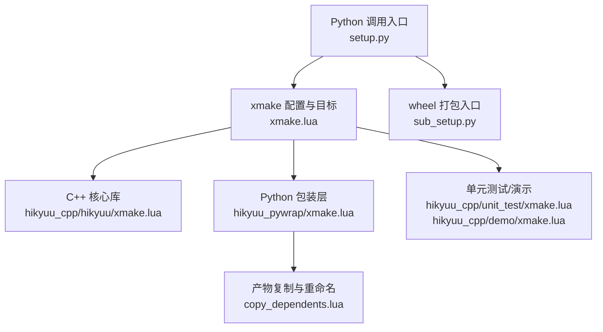
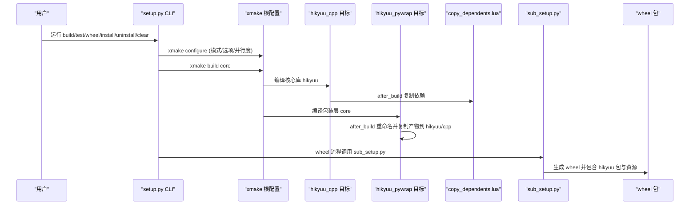
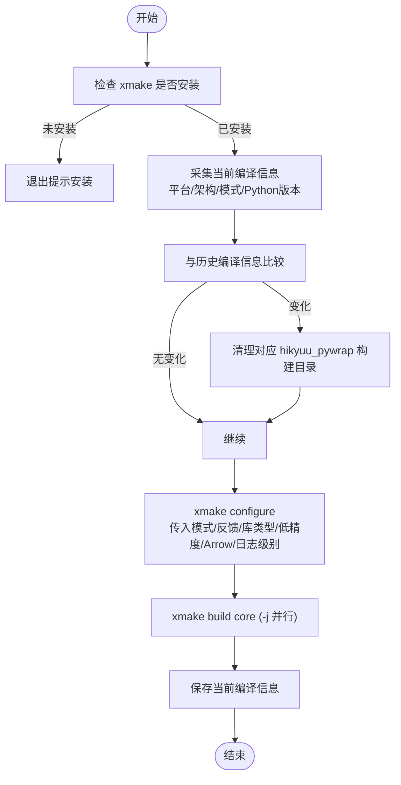
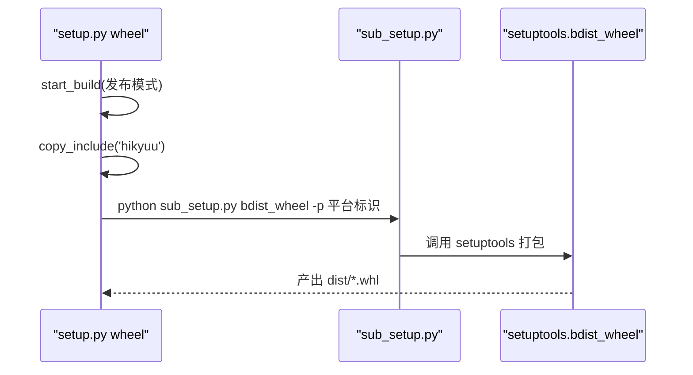
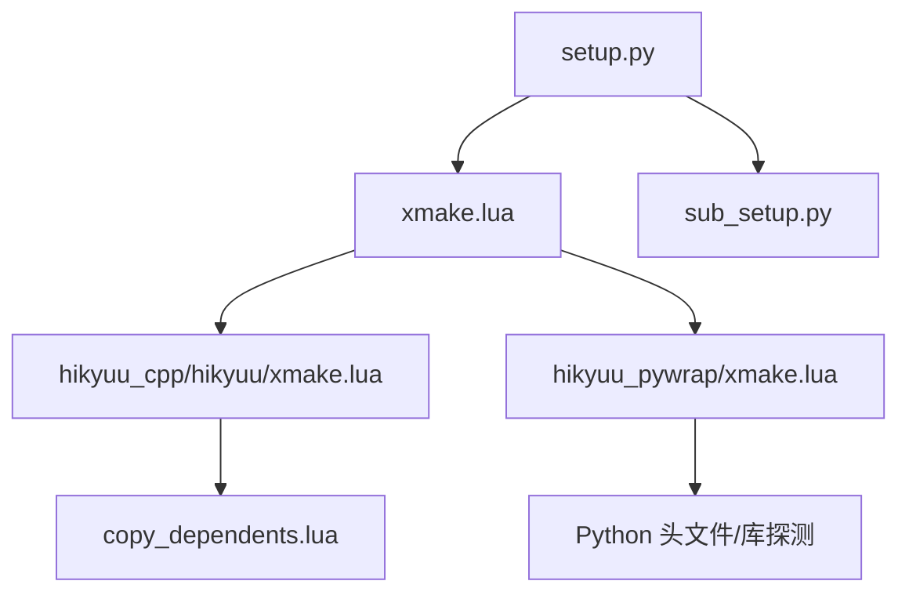

# 编译与构建流程

<cite>
**本文引用的文件列表**
- [setup.py](file://setup.py)
- [sub_setup.py](file://sub_setup.py)
- [xmake.lua](file://xmake.lua)
- [hikyuu_cpp/hikyuu/xmake.lua](file://hikyuu_cpp/hikyuu/xmake.lua)
- [hikyuu_cpp/unit_test/xmake.lua](file://hikyuu_cpp/unit_test/xmake.lua)
- [hikyuu_cpp/demo/xmake.lua](file://hikyuu_cpp/demo/xmake.lua)
- [hikyuu_pywrap/xmake.lua](file://hikyuu_pywrap/xmake.lua)
- [copy_dependents.lua](file://copy_dependents.lua)
</cite>

## 目录
1. [简介](#简介)
2. [项目结构与构建入口](#项目结构与构建入口)
3. [核心组件与职责](#核心组件与职责)
4. [架构总览](#架构总览)
5. [详细组件分析](#详细组件分析)
6. [依赖关系分析](#依赖关系分析)
7. [性能与优化要点](#性能与优化要点)
8. [故障排查指南](#故障排查指南)
9. [结论](#结论)
10. [附录：平台与模式命令示例](#附录平台与模式命令示例)

## 简介
本文件面向开发者与使用者，系统性梳理 Hikyuu 项目的编译与构建流程，重点解释：
- setup.py 的执行流程与参数传递
- 如何通过 xmake 编译 C++ 核心库（hikyuu_cpp）与 Python 包装层（hikyuu_pywrap）
- sub_setup.py 在打包 wheel 时的作用机制
- Linux 与 Windows 平台下的完整编译命令示例（含调试/发布模式）
- 关键产物（.so/.pyd/.dylib）的生成位置与加载机制
- 常见编译错误的定位与解决思路

## 项目结构与构建入口
Hikyuu 采用 Python 包管理与 xmake 构建双引擎：
- Python 层：通过 setup.py 提供命令行接口（构建、测试、打包、安装、卸载），内部调用 xmake 执行实际编译。
- xmake 层：在根 xmake.lua 中统一声明工程、模式、选项与依赖；分别在 hikyuu_cpp 与 hikyuu_pywrap 下定义目标（target）与产物复制策略。

图表来源
- [setup.py](file://setup.py#L108-L146)
- [xmake.lua](file://xmake.lua#L1-L247)
- [hikyuu_cpp/hikyuu/xmake.lua](file://hikyuu_cpp/hikyuu/xmake.lua#L1-L167)
- [hikyuu_cpp/unit_test/xmake.lua](file://hikyuu_cpp/unit_test/xmake.lua#L1-L217)
- [hikyuu_cpp/demo/xmake.lua](file://hikyuu_cpp/demo/xmake.lua#L1-L71)
- [hikyuu_pywrap/xmake.lua](file://hikyuu_pywrap/xmake.lua#L1-L174)
- [copy_dependents.lua](file://copy_dependents.lua#L1-L84)
- [sub_setup.py](file://sub_setup.py#L1-L136)

章节来源
- [setup.py](file://setup.py#L108-L146)
- [xmake.lua](file://xmake.lua#L1-L247)

## 核心组件与职责
- setup.py
  - 提供 CLI 子命令：build、test、wheel、install、uninstall、clear、upload
  - 校验 xmake 是否可用，收集当前编译信息（平台、架构、模式、Python 版本）
  - 通过 xmake 配置与并行编译核心库与包装层
  - 在 wheel/install 流程中复制头文件与产物到 hikyuu 包目录
- sub_setup.py
  - 解析版本号、读取长描述、收集包内资源与入口点
  - 调用 setuptools/distutils 打包 wheel，传入平台标识
- xmake.lua（根）
  - 统一工程名、语言标准、模式、全局选项与依赖仓库
  - 定义对象目录、目标目录、平台/架构符号隐藏策略、编译器标志
  - 条件包含 hikyuu_cpp、hikyuu_pywrap、unit_test、demo
- hikyuu_cpp/hikyuu/xmake.lua
  - 定义核心库目标 hikyuu，按平台/模式设置导出符号、链接库、rpath、线程安全等
  - after_build/after_install 阶段调用 copy_dependents.lua 复制第三方头文件与库
- hikyuu_pywrap/xmake.lua
  - 定义共享库目标 core，按平台设置文件名、rpath、链接器标志
  - 自动探测 Python 头文件与库路径，after_build 将产物复制到 hikyuu/cpp 并重命名为带 Python 版本号
- copy_dependents.lua
  - 任务：遍历依赖包，复制头文件与库到构建输出目录，支持 Windows DLL 拷贝

章节来源
- [setup.py](file://setup.py#L1-L437)
- [sub_setup.py](file://sub_setup.py#L1-L136)
- [xmake.lua](file://xmake.lua#L1-L247)
- [hikyuu_cpp/hikyuu/xmake.lua](file://hikyuu_cpp/hikyuu/xmake.lua#L1-L167)
- [hikyuu_pywrap/xmake.lua](file://hikyuu_pywrap/xmake.lua#L1-L174)
- [copy_dependents.lua](file://copy_dependents.lua#L1-L84)

## 架构总览
下图展示从 Python CLI 到最终产物的端到端流程，包括核心库与包装层的编译、产物复制与 wheel 打包。

图表来源
- [setup.py](file://setup.py#L108-L146)
- [xmake.lua](file://xmake.lua#L1-L247)
- [hikyuu_cpp/hikyuu/xmake.lua](file://hikyuu_cpp/hikyuu/xmake.lua#L1-L167)
- [hikyuu_pywrap/xmake.lua](file://hikyuu_pywrap/xmake.lua#L1-L174)
- [copy_dependents.lua](file://copy_dependents.lua#L1-L84)
- [sub_setup.py](file://sub_setup.py#L1-L136)

## 详细组件分析

### setup.py 执行流程与参数
- 前置检查
  - 检查 xmake 是否安装（通过版本查询）
- 编译信息采集
  - 获取平台、架构、Python 主次版本
  - 与历史编译信息对比，若变化则清理对应 hikyuu_pywrap 构建目录
- 配置与构建
  - 生成 xmake configure 命令，传入模式、反馈、库类型（release 用 shared，其他用 static）、低精度、Arrow、日志级别等
  - macOS 下额外禁用序列化以适配动态库限制
  - 执行 xmake -j 并行构建 core 目标
- 子命令
  - build/test：前者仅构建，后者先构建再运行单元测试
  - wheel：先构建，复制头文件，再调用 sub_setup.py 打包 wheel
  - install：先构建，复制包与头文件到目标安装目录
  - uninstall：扫描 site-packages 删除已安装包
  - clear/upload：清理构建产物与上传

图表来源
- [setup.py](file://setup.py#L108-L146)

章节来源
- [setup.py](file://setup.py#L108-L146)

### sub_setup.py 在打包中的作用
- 读取版本号（从根 xmake.lua 中解析 set_version）
- 收集包内资源（包含 .so/.pyd/.dylib 等二进制与配置文件）
- 生成 setuptools.setup 调用，传入 long_description、entry_points、install_requires 等
- wheel 流程中由 setup.py 调用 sub_setup.py 的 bdist_wheel 子命令，传入平台标识（如 manylinux2014_x86_64、win_amd64、macosx_x86_64、macosx_11_0_arm64）

图表来源
- [setup.py](file://setup.py#L367-L406)
- [sub_setup.py](file://sub_setup.py#L1-L136)

章节来源
- [setup.py](file://setup.py#L367-L406)
- [sub_setup.py](file://sub_setup.py#L1-L136)

### xmake 根配置与平台/模式策略
- 工程与语言
  - set_project、set_languages(c++17)、set_warnings(all)
- 模式与选项
  - mode.debug/mode.release 规则；log_level、serialize、low_precision、ta_lib、mysql/sqlite/hdf5、http_client 等选项
- 目录布局
  - set_objectdir、set_targetdir，统一对象与目标目录结构
- 平台差异化
  - Windows：符号隐藏、编译器警告抑制、MSVC 特定标志、runtimes MD（shared）
  - Linux/macOS：线程相关标志、rpath、部分编译器警告抑制
- 条件包含
  - includes(copy_dependents.lua、hikyuu_cpp、demo、hikyuu_pywrap、unit_test)

章节来源
- [xmake.lua](file://xmake.lua#L1-L247)

### hikyuu_cpp/hikyuu 目标（核心库）
- 目标属性
  - set_kind("$(kind)")，Windows 导出符号定义，Linux/macOS rpath
- 依赖与链接
  - boost、fmt、spdlog、flatbuffers、nng、nlohmann_json、xxhash、eigen、sqlite3、hdf5、mysql、ta-lib（可选）
- 文件组织
  - 按功能模块划分 unity_group，覆盖 analysis/global/plugin/strategy/trade_manage/trade_sys/utilities/data_driver 等
- 生命周期钩子
  - after_build/after_install 调用 copy_dependents.lua 复制第三方头文件与库

章节来源
- [hikyuu_cpp/hikyuu/xmake.lua](file://hikyuu_cpp/hikyuu/xmake.lua#L1-L167)
- [copy_dependents.lua](file://copy_dependents.lua#L1-L84)

### hikyuu_pywrap 目标（Python 包装层）
- 目标属性
  - set_kind("shared")，Windows 生成 core.pyd，Linux/macOS 生成 core.so
  - Linux/macOS 设置 rpathdirs，macOS 使用 -undefined dynamic_lookup
- Python 探测
  - Windows：通过 python 可执行路径推断 include/libs
  - 非 Windows：优先使用 conda 的 python3-config，否则使用系统 python3-config
- 产物复制与重命名
  - after_build 将 core.* 复制到 hikyuu/cpp，并根据 Python 版本拼接后缀（如 core310）
  - Windows 还会复制 DLL 与 lib 文件；macOS 修正 install_name 以相对路径加载依赖

章节来源
- [hikyuu_pywrap/xmake.lua](file://hikyuu_pywrap/xmake.lua#L1-L174)

### 单元测试与演示目标
- unit-test/small-test/real-test
  - 针对不同测试范围与覆盖率需求，设置 doctest、sqlite3、mysql（macOS 使用 mysqlclient）
  - before_run 拷贝 test_data、plugin、i18n 到构建输出目录
  - after_run 生成覆盖率报告（Linux/macOS）
- demo
  - 三个示例二进制，均依赖 hikyuu 目标

章节来源
- [hikyuu_cpp/unit_test/xmake.lua](file://hikyuu_cpp/unit_test/xmake.lua#L1-L217)
- [hikyuu_cpp/demo/xmake.lua](file://hikyuu_cpp/demo/xmake.lua#L1-L71)

## 依赖关系分析
- Python 层依赖
  - setup.py 依赖 xmake 命令行与 setuptools/click
  - sub_setup.py 依赖 setuptools/distutils、requirements.txt
- xmake 层依赖
  - 核心库依赖 boost、fmt、spdlog、flatbuffers、nng、nlohmann_json、xxhash、eigen、sqlite3、hdf5、mysql、ta-lib（可选）
  - 包装层依赖 pybind11，自动探测 Python 头文件与库
- 任务依赖
  - hikyuu 目标 after_build/after_install 依赖 copy_dependents.lua
  - hikyuu_pywrap 目标 after_build 依赖 Python 版本探测与产物重命名

图表来源
- [setup.py](file://setup.py#L108-L146)
- [xmake.lua](file://xmake.lua#L1-L247)
- [hikyuu_cpp/hikyuu/xmake.lua](file://hikyuu_cpp/hikyuu/xmake.lua#L1-L167)
- [hikyuu_pywrap/xmake.lua](file://hikyuu_pywrap/xmake.lua#L1-L174)
- [copy_dependents.lua](file://copy_dependents.lua#L1-L84)
- [sub_setup.py](file://sub_setup.py#L1-L136)

章节来源
- [setup.py](file://setup.py#L108-L146)
- [xmake.lua](file://xmake.lua#L1-L247)
- [hikyuu_cpp/hikyuu/xmake.lua](file://hikyuu_cpp/hikyuu/xmake.lua#L1-L167)
- [hikyuu_pywrap/xmake.lua](file://hikyuu_pywrap/xmake.lua#L1-L174)
- [copy_dependents.lua](file://copy_dependents.lua#L1-L84)
- [sub_setup.py](file://sub_setup.py#L1-L136)

## 性能与优化要点
- 并行编译
  - setup.py 通过 -j 传入并行度，默认 2；xmake 内部也支持多核编译
- Unity Build
  - 通过 c++.unity_build 规则减少编译时间，按模块分组（base/analysis/data_driver/global/indicator/plugin/strategy/trade_manage/trade_sys/utilities 等）
- 符号隐藏与链接优化
  - Release 模式在 Windows 隐藏符号，避免导出表污染；Linux/macOS 设置 rpath，减少运行时查找开销
- 低精度与 Arrow
  - 低精度模式可降低内存占用；Arrow 选项已标记为兼容性保留，不作为默认启用
- 调试模式与 Sanitizer
  - 支持 asan/lsan/msan/tsan 等模式，便于定位问题；macOS/Linux 下可启用 AddressSanitizer

章节来源
- [xmake.lua](file://xmake.lua#L203-L247)
- [hikyuu_cpp/hikyuu/xmake.lua](file://hikyuu_cpp/hikyuu/xmake.lua#L1-L167)
- [hikyuu_cpp/unit_test/xmake.lua](file://hikyuu_cpp/unit_test/xmake.lua#L1-L217)
- [hikyuu_pywrap/xmake.lua](file://hikyuu_pywrap/xmake.lua#L1-L174)

## 故障排查指南
- 缺少 xmake
  - 现象：提示未安装 xmake
  - 处理：安装 xmake 后重试
- 缺失 Python 头文件/库
  - 现象：包装层探测失败或链接阶段报错
  - 处理：确保系统已安装 python3-dev 或 conda 环境可用；确认 python3-config 输出正确
- Windows 动态库运行时依赖缺失
  - 现象：导入 core 报错找不到 DLL
  - 处理：确认 hikyuu/cpp 下已复制所需 DLL；或确保系统 PATH 包含依赖库
- macOS 安装名称与依赖路径
  - 现象：dylib 无法加载或 SSL 依赖冲突
  - 处理：after_build 已修正 install_name；必要时手动调整 @loader_path 或 @rpath
- 链接失败（未定义符号）
  - 现象：链接阶段报错
  - 处理：确认依赖包已安装并被 copy_dependents.lua 复制；检查 rpath 与 -undefined dynamic_lookup
- 平台/架构不匹配
  - 现象：wheel 与运行环境架构不符
  - 处理：使用正确的平台标识（manylinux2014_x86_64、win_amd64、macosx_x86_64、macosx_11_0_arm64）
- 模式选择不当
  - 现象：发布版体积过大或调试版性能差
  - 处理：根据需求选择 release/debug/coverage/asan 等模式

章节来源
- [hikyuu_pywrap/xmake.lua](file://hikyuu_pywrap/xmake.lua#L115-L171)
- [copy_dependents.lua](file://copy_dependents.lua#L1-L84)
- [xmake.lua](file://xmake.lua#L203-L247)

## 结论
Hikyuu 的构建体系以 Python CLI 为入口，借助 xmake 实现跨平台、可配置的 C++/Python 双栈构建。核心库与包装层通过明确的目标与生命周期钩子协同工作，配合 copy_dependents.lua 完成第三方依赖的复制与打包。通过合理的模式选择、并行编译与 rpath 策略，可在不同平台上获得稳定高效的构建体验。

## 附录：平台与模式命令示例
以下示例基于 setup.py 的 CLI 与 xmake 的模式/选项，具体命令请按需替换为实际路径与参数。

- Linux（manylinux2014_x86_64）
  - 发布模式构建：python setup.py build -m release -j 4
  - 调试模式构建：python setup.py build -m debug -j 4
  - 单元测试：python setup.py test -m release -j 4
  - 生成 wheel：python setup.py wheel -m release -j 4
  - 安装：python setup.py install -j 4
- Windows（win_amd64/win32）
  - 发布模式构建：python setup.py build -m release -j 4
  - 调试模式构建：python setup.py build -m debug -j 4
  - 单元测试：python setup.py test -m release -j 4
  - 生成 wheel：python setup.py wheel -m release -j 4
  - 安装：python setup.py install -j 4
- macOS（macosx_x86_64/macOS 11.0 arm64）
  - 发布模式构建：python setup.py build -m release -j 4
  - 调试模式构建：python setup.py build -m debug -j 4
  - 单元测试：python setup.py test -m release -j 4
  - 生成 wheel：python setup.py wheel -m release -j 4
  - 安装：python setup.py install -j 4

说明
- -m 指定模式（release/debug/coverage/asan/msan/tsan/lsan）
- -j 指定并行度
- wheel 流程会自动调用 sub_setup.py 并传入平台标识
- 安装流程会复制头文件与产物到 site-packages 目录

章节来源
- [setup.py](file://setup.py#L158-L231)
- [setup.py](file://setup.py#L367-L406)
- [xmake.lua](file://xmake.lua#L1-L247)