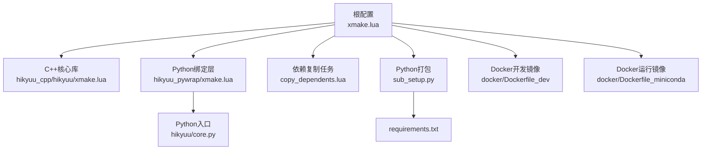
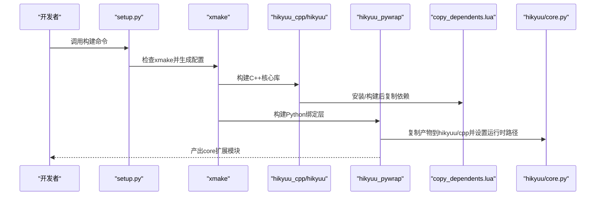

# 编译问题排查

<cite>
**本文引用的文件列表**
- [xmake.lua](file://xmake.lua)
- [hikyuu_cpp/hikyuu/xmake.lua](file://hikyuu_cpp/hikyuu/xmake.lua)
- [hikyuu_pywrap/xmake.lua](file://hikyuu_pywrap/xmake.lua)
- [setup.py](file://setup.py)
- [sub_setup.py](file://sub_setup.py)
- [requirements.txt](file://requirements.txt)
- [copy_dependents.lua](file://copy_dependents.lua)
- [docker/Dockerfile_dev](file://docker/Dockerfile_dev)
- [docker/Dockerfile_miniconda](file://docker/Dockerfile_miniconda)
- [hikyuu/core.py](file://hikyuu/core.py)
</cite>

## 目录
1. [简介](#简介)
2. [项目结构与编译入口](#项目结构与编译入口)
3. [常见编译错误与排查清单](#常见编译错误与排查清单)
4. [架构与依赖关系总览](#架构与依赖关系总览)
5. [逐项问题诊断与解决](#逐项问题诊断与解决)
6. [编译日志分析指南](#编译日志分析指南)
7. [性能与优化建议](#性能与优化建议)
8. [故障排除与预防](#故障排除与预防)
9. [结论](#结论)

## 简介
本文件面向在本地或CI环境中编译Hikyuu（C++/Python量化框架）的用户，系统梳理编译期常见问题，提供可操作的诊断步骤、解决方案与预防措施。内容覆盖xmake未安装、依赖库缺失、头文件找不到、链接错误、架构不匹配、Python版本不兼容、动态/静态库运行时库缺失等问题，并给出基于仓库内配置文件的定位与修复路径。

## 项目结构与编译入口
- 根级构建入口：根目录的主配置文件定义了编译选项、依赖仓库、平台/架构差异化编译参数、目标产物输出目录等。
- C++核心库：位于 hikyuu_cpp/hikyuu，目标名为 hikyuu，按模块分组进行统一构建。
- Python绑定层：位于 hikyuu_pywrap，目标名为 core，负责将C++核心导出为Python扩展模块。
- Python打包与安装：setup.py 提供命令行入口，封装 xmake 配置与构建流程；sub_setup.py 用于wheel打包。
- 依赖管理：xmake 通过 add_requires 引入第三方库；copy_dependents.lua 负责将依赖的头文件与库复制到构建输出目录。
- Docker环境：提供Ubuntu基础镜像下的完整依赖安装与编译验证流程，便于复现与自动化。

图表来源
- [xmake.lua](file://xmake.lua#L1-L247)
- [hikyuu_cpp/hikyuu/xmake.lua](file://hikyuu_cpp/hikyuu/xmake.lua#L1-L167)
- [hikyuu_pywrap/xmake.lua](file://hikyuu_pywrap/xmake.lua#L1-L174)
- [hikyuu/core.py](file://hikyuu/core.py#L1-L29)
- [copy_dependents.lua](file://copy_dependents.lua#L2-L84)
- [sub_setup.py](file://sub_setup.py#L1-L136)
- [requirements.txt](file://requirements.txt#L1-L22)
- [docker/Dockerfile_dev](file://docker/Dockerfile_dev#L1-L79)
- [docker/Dockerfile_miniconda](file://docker/Dockerfile_miniconda#L1-L86)

章节来源
- [xmake.lua](file://xmake.lua#L1-L247)
- [hikyuu_cpp/hikyuu/xmake.lua](file://hikyuu_cpp/hikyuu/xmake.lua#L1-L167)
- [hikyuu_pywrap/xmake.lua](file://hikyuu_pywrap/xmake.lua#L1-L174)
- [hikyuu/core.py](file://hikyuu/core.py#L1-L29)
- [copy_dependents.lua](file://copy_dependents.lua#L2-L84)
- [sub_setup.py](file://sub_setup.py#L1-L136)
- [requirements.txt](file://requirements.txt#L1-L22)
- [docker/Dockerfile_dev](file://docker/Dockerfile_dev#L1-L79)
- [docker/Dockerfile_miniconda](file://docker/Dockerfile_miniconda#L1-L86)

## 常见编译错误与排查清单
- xmake未安装或版本过旧
  - 现象：执行构建命令提示找不到xmake或版本不满足要求
  - 排查：确认已安装xmake并可用；查看根配置中对xmake版本的要求
  - 解决：根据平台安装最新xmake；或使用Docker镜像复现
  章节来源
  - [setup.py](file://setup.py#L16-L21)
  - [xmake.lua](file://xmake.lua#L1-L10)

- 依赖库缺失或版本不匹配
  - 现象：编译时报错找不到头文件、链接阶段找不到符号、或运行时报缺少动态库
  - 排查：对照根配置中的 add_requires 列表与 copy_dependents.lua 的依赖复制逻辑
  - 解决：确保系统已安装所需系统库；或启用xmake仓库自动拉取；必要时调整版本
  章节来源
  - [xmake.lua](file://xmake.lua#L128-L191)
  - [copy_dependents.lua](file://copy_dependents.lua#L2-L84)

- 头文件找不到
  - 现象：编译器报“找不到头文件”或“找不到依赖头文件”
  - 排查：检查 add_includedirs、add_packages 的包含路径；确认 copy_dependents 是否正确复制头文件
  - 解决：确保依赖包安装成功；确认 include 目录复制到构建输出；必要时手动添加系统头文件路径
  章节来源
  - [hikyuu_cpp/hikyuu/xmake.lua](file://hikyuu_cpp/hikyuu/xmake.lua#L31-L40)
  - [copy_dependents.lua](file://copy_dependents.lua#L31-L55)

- 链接错误（符号未解析、库未找到）
  - 现象：链接阶段报错，如“未解析的外部符号”、“找不到库”
  - 排查：核对 add_packages、add_links、add_shflags、add_ldflags；确认copy_dependents复制了库文件
  - 解决：补齐缺失库；修正链接顺序；在Windows下确保DLL与lib配对；在Linux/macOS下确认rpath与运行时库路径
  章节来源
  - [hikyuu_cpp/hikyuu/xmake.lua](file://hikyuu_cpp/hikyuu/xmake.lua#L43-L77)
  - [xmake.lua](file://xmake.lua#L223-L239)
  - [copy_dependents.lua](file://copy_dependents.lua#L54-L84)

- 架构不匹配（x86/x64、arm64）
  - 现象：运行时报“架构不匹配”或链接失败
  - 排查：确认Python解释器位数与编译目标一致；核对平台/架构检测逻辑
  - 解决：在同一架构下重新编译；在setup.py中清理旧的编译产物后再重建
  章节来源
  - [setup.py](file://setup.py#L33-L50)
  - [setup.py](file://setup.py#L73-L102)

- Python版本不兼容
  - 现象：导入core模块失败，或core命名与Python版本不匹配
  - 排查：确认Python版本；核对hikyuu/core.py的版本分支导入逻辑
  - 解决：使用受支持的Python版本；确保Python3.8+；在conda环境下使用python3-config
  章节来源
  - [hikyuu/core.py](file://hikyuu/core.py#L1-L29)
  - [hikyuu_pywrap/xmake.lua](file://hikyuu_pywrap/xmake.lua#L89-L113)

- 动态/静态库运行时库缺失
  - 现象：运行时报找不到DLL（Windows）、SO（Linux）或DYLIB（macOS）
  - 排查：确认copy_dependents是否复制了DLL/SO/DYLIB；核对运行时库路径
  - 解决：在Windows下确保DLL随产物复制；在Linux/macOS下设置rpath或LD_LIBRARY_PATH
  章节来源
  - [copy_dependents.lua](file://copy_dependents.lua#L54-L84)
  - [hikyuu_pywrap/xmake.lua](file://hikyuu_pywrap/xmake.lua#L34-L43)

- macOS签名与依赖库变更
  - 现象：macOS下运行时报依赖库路径变更导致加载失败
  - 排查：核对install_name_tool的替换逻辑
  - 解决：按配置执行install_name_tool更新依赖库路径
  章节来源
  - [hikyuu_pywrap/xmake.lua](file://hikyuu_pywrap/xmake.lua#L144-L168)

- Docker环境差异
  - 现象：容器内编译正常，宿主机异常
  - 排查：对比Dockerfile中的系统库安装、环境变量、Python路径
  - 解决：使用Docker镜像复现；或在宿主机补齐相同依赖
  章节来源
  - [docker/Dockerfile_dev](file://docker/Dockerfile_dev#L1-L79)
  - [docker/Dockerfile_miniconda](file://docker/Dockerfile_miniconda#L1-L86)

## 架构与依赖关系总览
- 根配置集中声明编译语言标准、警告级别、平台/架构差异化编译参数、依赖仓库与版本约束。
- C++核心库按模块分组构建，统一使用包管理器引入第三方库，并在安装/构建后复制依赖到输出目录。
- Python绑定层依赖C++核心库，按平台自动探测Python头文件与库路径，构建共享库并复制到hikyuu/cpp目录。
- setup.py封装xmake配置与构建流程，提供wheel打包与安装入口；sub_setup.py读取版本并生成wheel元数据。

图表来源
- [setup.py](file://setup.py#L105-L155)
- [xmake.lua](file://xmake.lua#L128-L191)
- [hikyuu_cpp/hikyuu/xmake.lua](file://hikyuu_cpp/hikyuu/xmake.lua#L1-L167)
- [hikyuu_pywrap/xmake.lua](file://hikyuu_pywrap/xmake.lua#L1-L174)
- [copy_dependents.lua](file://copy_dependents.lua#L2-L84)
- [hikyuu/core.py](file://hikyuu/core.py#L1-L29)

## 逐项问题诊断与解决

### 1) xmake未安装或版本不满足
- 诊断要点
  - 根配置要求xmake版本并设置语言标准与警告级别
  - setup.py在构建前会检查xmake是否可用
- 解决方案
  - 安装最新xmake；在Windows下确保PATH包含xmake；在Linux/macOS下使用包管理器或官方脚本安装
  - 若使用Docker，可直接使用提供的开发镜像
- 预防措施
  - CI中显式安装xmake；在构建前打印xmake版本
- 章节来源
  - [xmake.lua](file://xmake.lua#L1-L10)
  - [setup.py](file://setup.py#L16-L21)
  - [docker/Dockerfile_dev](file://docker/Dockerfile_dev#L31-L36)

### 2) 依赖库缺失或版本不匹配
- 诊断要点
  - 根配置通过 add_requires 声明依赖（如boost、fmt、spdlog、sqlite3、flatbuffers、nng、nlohmann_json、eigen、xxhash、utf8proc、ta-lib等）
  - copy_dependents.lua 负责将依赖的头文件与库复制到构建输出目录
- 解决方案
  - 在Linux/macOS安装系统依赖；在Windows安装对应开发包
  - 使用xmake仓库自动拉取依赖；必要时调整版本号
  - 确认copy_dependents已复制依赖库；核对输出目录结构
- 预防措施
  - CI中预装系统依赖；在Docker镜像中统一安装
- 章节来源
  - [xmake.lua](file://xmake.lua#L128-L191)
  - [copy_dependents.lua](file://copy_dependents.lua#L2-L84)
  - [docker/Dockerfile_dev](file://docker/Dockerfile_dev#L16-L31)

### 3) 头文件找不到
- 诊断要点
  - C++核心库通过 add_includedirs 引入头文件路径
  - copy_dependents.lua 会在安装/构建后复制依赖头文件
- 解决方案
  - 确保依赖包安装成功；检查copy_dependents是否复制头文件
  - 如为系统库，确认系统头文件路径已加入编译器搜索路径
- 预防措施
  - 在CI中固定依赖版本；使用Docker镜像减少环境差异
- 章节来源
  - [hikyuu_cpp/hikyuu/xmake.lua](file://hikyuu_cpp/hikyuu/xmake.lua#L31-L40)
  - [copy_dependents.lua](file://copy_dependents.lua#L31-L55)

### 4) 链接错误（符号未解析、库未找到）
- 诊断要点
  - C++核心库在不同平台设置不同的链接参数（Windows添加系统库、Linux/macOS设置rpath）
  - Python绑定层在Windows下设置导出/导入宏，在Linux/macOS下设置rpath与链接标志
- 解决方案
  - 补齐缺失库；修正链接顺序；在Windows下确保DLL与lib配对
  - 在Linux/macOS下设置rpath或LD_LIBRARY_PATH；确认copy_dependents复制了库文件
- 预防措施
  - CI中预装系统库；在构建后校验输出目录包含所需库
- 章节来源
  - [hikyuu_cpp/hikyuu/xmake.lua](file://hikyuu_cpp/hikyuu/xmake.lua#L43-L77)
  - [hikyuu_pywrap/xmake.lua](file://hikyuu_pywrap/xmake.lua#L34-L43)
  - [xmake.lua](file://xmake.lua#L223-L239)
  - [copy_dependents.lua](file://copy_dependents.lua#L54-L84)

### 5) 架构不匹配（x86/x64、arm64）
- 诊断要点
  - setup.py会根据Python位数与平台推断架构，并在Python版本变化时清理旧的编译产物
- 解决方案
  - 在同一架构下重新编译；清理旧产物后再构建
- 预防措施
  - CI中固定架构；在Docker镜像中统一架构
- 章节来源
  - [setup.py](file://setup.py#L33-L50)
  - [setup.py](file://setup.py#L73-L102)

### 6) Python版本不兼容
- 诊断要点
  - hikyuu/core.py按Python次版本导入对应core模块（如core38、core39等）
  - hikyuu_pywrap/xmake.lua在不同平台探测Python头文件与库路径
- 解决方案
  - 使用受支持的Python版本（Python 3.8+）；在conda环境下使用python3-config
  - 确保Python解释器与编译目标架构一致
- 预防措施
  - CI中固定Python版本；在Docker镜像中预装指定版本
- 章节来源
  - [hikyuu/core.py](file://hikyuu/core.py#L1-L29)
  - [hikyuu_pywrap/xmake.lua](file://hikyuu_pywrap/xmake.lua#L89-L113)

### 7) 动态/静态库运行时库缺失
- 诊断要点
  - copy_dependents.lua在Windows下复制DLL；在Linux/macOS下复制SO/DYLIB
  - Python绑定层在Linux/macOS下设置rpath；在macOS下使用install_name_tool更新依赖路径
- 解决方案
  - 确认copy_dependents复制了所有依赖库；在Linux/macOS下设置rpath或LD_LIBRARY_PATH
  - 在macOS下执行install_name_tool更新依赖库路径
- 预防措施
  - CI中校验运行时库是否存在；在Docker镜像中预装系统库
- 章节来源
  - [copy_dependents.lua](file://copy_dependents.lua#L54-L84)
  - [hikyuu_pywrap/xmake.lua](file://hikyuu_pywrap/xmake.lua#L144-L168)

### 8) Docker环境差异
- 诊断要点
  - 开发镜像安装xmake、Miniconda、系统依赖并配置环境变量
  - 运行镜像仅保留必要文件并设置LD_LIBRARY_PATH
- 解决方案
  - 使用Docker镜像复现；或在宿主机补齐相同依赖
- 预防措施
  - 将Dockerfile纳入CI；统一依赖版本
- 章节来源
  - [docker/Dockerfile_dev](file://docker/Dockerfile_dev#L1-L79)
  - [docker/Dockerfile_miniconda](file://docker/Dockerfile_miniconda#L1-L86)

## 编译日志分析指南
- 识别关键阶段
  - 配置阶段：xmake f 输出的配置项（模式、架构、选项、日志级别等）
  - 依赖解析：add_requires 与仓库拉取日志
  - 编译阶段：目标构建顺序与编译器参数
  - 安装/复制阶段：copy_dependents 的依赖复制日志
- 常见错误关键词定位
  - “未找到”、“找不到”：头文件/库缺失
  - “未解析的外部符号”：链接顺序或库缺失
  - “架构不匹配”：Python与编译目标位数不一致
  - “python3-config not found”：Python开发包缺失
- 建议的检查清单
  - 确认xmake版本满足要求
  - 确认系统依赖已安装或通过xmake仓库拉取
  - 确认copy_dependents复制了头文件与库
  - 确认Python版本与架构匹配
  - 确认运行时库路径正确（rpath/环境变量）

章节来源
- [xmake.lua](file://xmake.lua#L128-L191)
- [copy_dependents.lua](file://copy_dependents.lua#L2-L84)
- [hikyuu_pywrap/xmake.lua](file://hikyuu_pywrap/xmake.lua#L89-L113)

## 性能与优化建议
- 并行编译：使用 -j 参数提升编译速度（setup.py默认并行度为2，可在命令行传入）
- 释放模式优化：在release模式下隐藏符号，减少动态库导出符号数量
- Unity构建：启用c++.unity_build可减少编译开销
- 预编译头与缓存：在CI中缓存xmake包与构建缓存，缩短构建时间
- Docker复用：在CI中复用Docker镜像，避免重复安装依赖

章节来源
- [setup.py](file://setup.py#L185-L190)
- [xmake.lua](file://xmake.lua#L203-L210)
- [hikyuu_cpp/hikyuu/xmake.lua](file://hikyuu_cpp/hikyuu/xmake.lua#L81-L83)

## 故障排除与预防
- 常见问题速查
  - xmake不可用：安装xmake并加入PATH；或使用Docker
  - 依赖缺失：安装系统依赖或启用xmake仓库拉取；核对版本
  - 头文件缺失：确认copy_dependents复制头文件；检查include路径
  - 链接失败：补齐库；修正链接顺序；Windows下确保DLL与lib配对
  - 架构不匹配：在同一架构下重新编译；清理旧产物
  - Python版本不兼容：使用受支持的Python版本；在conda环境下使用python3-config
  - 运行时库缺失：确认copy_dependents复制库；设置rpath或LD_LIBRARY_PATH；macOS执行install_name_tool
- 预防措施
  - CI中固定xmake、Python、系统依赖版本
  - 使用Docker镜像统一环境
  - 构建后校验输出目录包含所需头文件与库
  - 在setup.py中清理旧产物，避免版本/架构混杂

章节来源
- [setup.py](file://setup.py#L105-L155)
- [copy_dependents.lua](file://copy_dependents.lua#L2-L84)
- [docker/Dockerfile_dev](file://docker/Dockerfile_dev#L1-L79)
- [docker/Dockerfile_miniconda](file://docker/Dockerfile_miniconda#L1-L86)

## 结论
通过结合根配置、C++核心库与Python绑定层的构建规则，以及copy_dependents的依赖复制机制，大多数编译问题均可定位并解决。建议在本地与CI中统一使用Docker镜像，固定xmake、Python与系统依赖版本，以最大程度降低环境差异带来的编译风险。遇到问题时，按“诊断—定位—修复—验证”的流程逐步排查，并在CI中增加构建后校验步骤，确保产物完整性与可运行性。