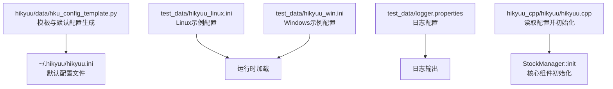
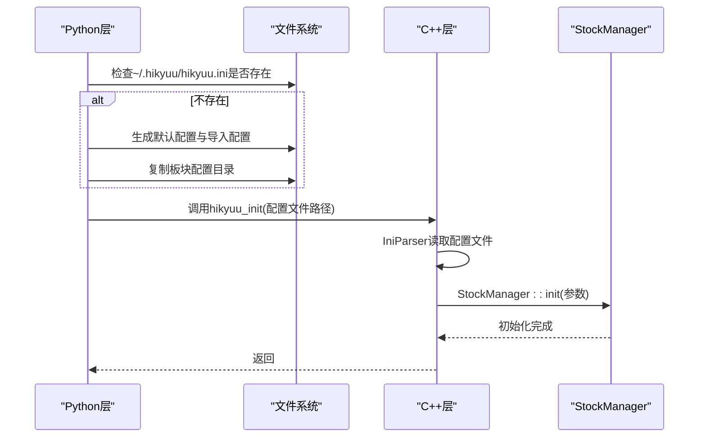

# 配置文件设置

<cite>
**本文引用的文件**
- [hku_config_template.py](file://hikyuu/data/hku_config_template.py)
- [hikyuu_linux.ini](file://test_data/hikyuu_linux.ini)
- [hikyuu_win.ini](file://test_data/hikyuu_win.ini)
- [logger.properties](file://test_data/logger.properties)
- [hikyuu.cpp](file://hikyuu_cpp/hikyuu/hikyuu.cpp)
- [hikyuu.h](file://hikyuu_cpp/hikyuu/hikyuu.h)
- [StockManager.h](file://hikyuu_cpp/hikyuu/StockManager.h)
- [StockManager.cpp](file://hikyuu_cpp/hikyuu/StockManager.cpp)
- [examples_init.py](file://hikyuu/examples/examples_init.py)
- [mylog.py](file://hikyuu/util/mylog.py)
- [IniParser.h](file://hikyuu_cpp/hikyuu/utilities/ini_parser/IniParser.h)
</cite>

## 目录
1. [简介](#简介)
2. [项目结构与配置文件定位](#项目结构与配置文件定位)
3. [核心配置结构与参数详解](#核心配置结构与参数详解)
4. [数据库连接配置（MySQL/SQLite/ClickHouse）](#数据库连接配置mysqlsqliteclickhouse)
5. [数据存储路径与HDF5配置](#数据存储路径与hdf5配置)
6. [日志设置与调试](#日志设置与调试)
7. [默认市场参数与交易时间](#默认市场参数与交易时间)
8. [Linux与Windows配置差异与适配](#linux与windows配置差异与适配)
9. [配置验证与初始化流程](#配置验证与初始化流程)
10. [常见问题与排错](#常见问题与排错)
11. [结论](#结论)

## 简介
本指南面向Hikyuu框架使用者，围绕配置文件设置展开，基于模板文件与示例配置，系统讲解：
- 配置文件结构与各节参数含义
- 数据库连接（MySQL/SQLite/ClickHouse）配置要点
- HDF5数据存储路径与文件映射
- 日志配置与调试方法
- 默认市场参数与交易时间
- Linux与Windows配置差异与适配
- 配置验证与初始化流程，确保StockManager等核心组件正确加载

## 项目结构与配置文件定位
- 模板与默认配置生成：位于数据模块，提供HDF5/MySQL/ClickHouse三套模板与默认配置生成逻辑
- 示例配置：提供Linux与Windows两套示例配置，展示路径分隔符差异
- 日志配置：提供log4cplus的logger.properties示例
- 初始化与加载：C++侧通过IniParser读取配置，Python侧负责默认配置生成与加载

图表来源
- [hku_config_template.py](file://hikyuu/data/hku_config_template.py#L303-L339)
- [hikyuu_linux.ini](file://test_data/hikyuu_linux.ini#L1-L56)
- [hikyuu_win.ini](file://test_data/hikyuu_win.ini#L1-L56)
- [logger.properties](file://test_data/logger.properties#L1-L19)
- [hikyuu.cpp](file://hikyuu_cpp/hikyuu/hikyuu.cpp#L1-L70)
- [StockManager.h](file://hikyuu_cpp/hikyuu/StockManager.h#L38-L75)

章节来源
- [hku_config_template.py](file://hikyuu/data/hku_config_template.py#L303-L339)
- [hikyuu_linux.ini](file://test_data/hikyuu_linux.ini#L1-L56)
- [hikyuu_win.ini](file://test_data/hikyuu_win.ini#L1-L56)
- [logger.properties](file://test_data/logger.properties#L1-L19)
- [hikyuu.cpp](file://hikyuu_cpp/hikyuu/hikyuu.cpp#L1-L70)
- [StockManager.h](file://hikyuu_cpp/hikyuu/StockManager.h#L38-L75)

## 核心配置结构与参数详解
Hikyuu配置采用INI格式，主要包含以下节：
- hikyuu：全局参数（临时目录、数据目录、重载时间、行情服务器等）
- block：板块数据源（type与数据库连接或本地目录）
- preload：预加载开关与最大条数限制
- baseinfo：基础信息数据源（type与数据库连接）
- kdata：K线数据源（type与具体数据文件或数据库连接）
- importdata-gui（模板中提供）：导入工具相关参数（启用开关、数据源、调度等）

参数要点：
- tmpdir/datadir：临时与数据根目录，影响StockManager的临时目录与数据目录
- reload_time：数据重载时间（HH:MM）
- quotation_server：行情服务地址（IPC或TCP）
- preload.*与preload.*_max：按K线类型控制是否预加载与最大条数
- baseinfo与block的type字段决定数据源类型（sqlite3/mysql/clickhouse/qianlong等）
- kdata的type字段决定K线数据源类型（hdf5/mysql/clickhouse/tdx等）

章节来源
- [hku_config_template.py](file://hikyuu/data/hku_config_template.py#L25-L92)
- [hku_config_template.py](file://hikyuu/data/hku_config_template.py#L94-L148)
- [hku_config_template.py](file://hikyuu/data/hku_config_template.py#L150-L203)
- [hku_config_template.py](file://hikyuu/data/hku_config_template.py#L206-L300)

## 数据库连接配置（MySQL/SQLite/ClickHouse）
- SQLite：适用于轻量场景，无需网络连接；在block与baseinfo节中设置type=sqlite3，并提供db路径
- MySQL：在block、baseinfo、kdata节中设置type=mysql，并提供host/port/usr/pwd
- ClickHouse：在block、baseinfo、kdata节中设置type=clickhouse，并提供host/port/usr/pwd

注意：
- 当选择MySQL或ClickHouse时，需确保相应数据库已部署并具备权限
- kdata节的type需与block/baseinfo保持一致，以保证数据一致性

章节来源
- [hku_config_template.py](file://hikyuu/data/hku_config_template.py#L94-L148)
- [hku_config_template.py](file://hikyuu/data/hku_config_template.py#L150-L203)

## 数据存储路径与HDF5配置
- HDF5模式下，kdata节type=hdf5，并为不同市场与周期提供.h5文件映射
- 示例配置展示了上海/深圳/北京市场的日线、分钟线、分时与成交明细文件路径
- Linux与Windows示例配置分别使用正斜杠与反斜杠作为路径分隔符

章节来源
- [hku_config_template.py](file://hikyuu/data/hku_config_template.py#L73-L92)
- [hikyuu_linux.ini](file://test_data/hikyuu_linux.ini#L40-L56)
- [hikyuu_win.ini](file://test_data/hikyuu_win.ini#L40-L56)

## 日志设置与调试
- Python侧日志：默认将日志输出到用户目录下的日志文件，并提供基础格式化
- C++侧日志：通过Log.h宏进行断言与异常处理，便于定位初始化与运行期问题
- 示例日志配置：logger.properties展示了log4cplus的rootLogger与hikyuu子logger配置方式

章节来源
- [mylog.py](file://hikyuu/util/mylog.py#L1-L200)
- [hikyuu.cpp](file://hikyuu_cpp/hikyuu/hikyuu.cpp#L1-L43)
- [logger.properties](file://test_data/logger.properties#L1-L19)

## 默认市场参数与交易时间
- MarketInfo包含市场简称、名称、描述、基本指数代码、最后交易日期以及两个交易时段的时间段
- 交易时间与节假日判断依赖MarketInfo与交易日历，确保回测与实盘交易时间准确

章节来源
- [MarketInfo.h](file://hikyuu_cpp/hikyuu/MarketInfo.h#L1-L54)
- [MarketInfo.cpp](file://hikyuu_cpp/hikyuu/MarketInfo.cpp#L1-L46)
- [MarketInfo.cpp](file://hikyuu_cpp/hikyuu/MarketInfo.cpp#L48-L74)

## Linux与Windows配置差异与适配
- 路径分隔符：Linux使用正斜杠，Windows使用反斜杠
- 示例配置分别展示了两种平台的路径写法
- 建议在跨平台部署时，统一使用相对路径或通过脚本替换路径分隔符

章节来源
- [hikyuu_linux.ini](file://test_data/hikyuu_linux.ini#L1-L56)
- [hikyuu_win.ini](file://test_data/hikyuu_win.ini#L1-L56)

## 配置验证与初始化流程
- Python侧默认配置生成：当用户目录下不存在默认配置时，自动创建hikyuu.ini与importdata-gui.ini，并复制板块配置目录
- 配置读取与参数传递：Python侧将hikyuu节参数与block/baseinfo/kdata/preload节参数封装为Parameter对象
- C++侧初始化：C++侧通过IniParser读取配置文件，提取hikyuu、block、baseinfo、kdata、preload等参数，并调用StockManager::init完成初始化

图表来源
- [hku_config_template.py](file://hikyuu/data/hku_config_template.py#L303-L339)
- [hikyuu.cpp](file://hikyuu_cpp/hikyuu/hikyuu.cpp#L1-L70)
- [StockManager.h](file://hikyuu_cpp/hikyuu/StockManager.h#L38-L75)

章节来源
- [hku_config_template.py](file://hikyuu/data/hku_config_template.py#L303-L339)
- [hikyuu.cpp](file://hikyuu_cpp/hikyuu/hikyuu.cpp#L1-L70)
- [StockManager.h](file://hikyuu_cpp/hikyuu/StockManager.h#L38-L75)

## 常见问题与排错
- 配置文件不存在：Python侧会尝试生成默认配置；若仍失败，检查用户目录权限与路径
- IniParser读取异常：确认配置文件格式正确（每个节必须有方括号节头，键值对格式为key=value）
- 数据库连接失败：核对host/port/usr/pwd与数据库连通性
- HDF5文件缺失：确认kdata节中各市场与周期的.h5文件路径存在且可读
- 日志无输出：检查logger.properties配置与日志文件路径权限

章节来源
- [hikyuu.cpp](file://hikyuu_cpp/hikyuu/hikyuu.cpp#L1-L43)
- [IniParser.h](file://hikyuu_cpp/hikyuu/utilities/ini_parser/IniParser.h#L1-L105)
- [logger.properties](file://test_data/logger.properties#L1-L19)

## 结论
- 使用模板与示例配置快速搭建Hikyuu环境
- 根据实际数据来源选择合适的数据库或HDF5存储
- 注意Linux/Windows路径差异，确保配置文件路径正确
- 通过默认配置生成与初始化流程，确保StockManager等核心组件正确加载
- 遇到问题时，结合日志与IniParser错误提示进行定位与修复