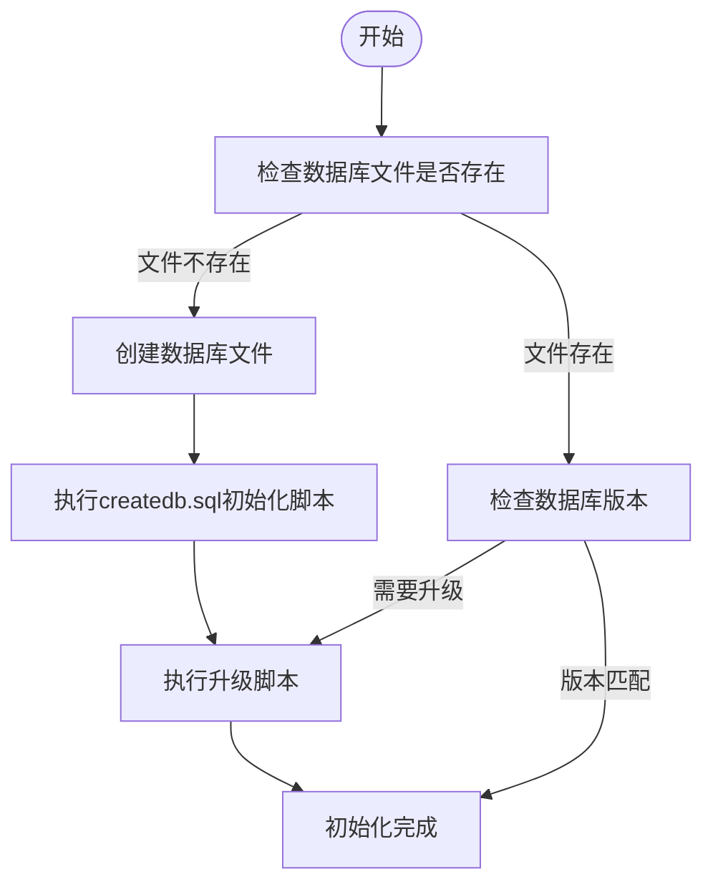
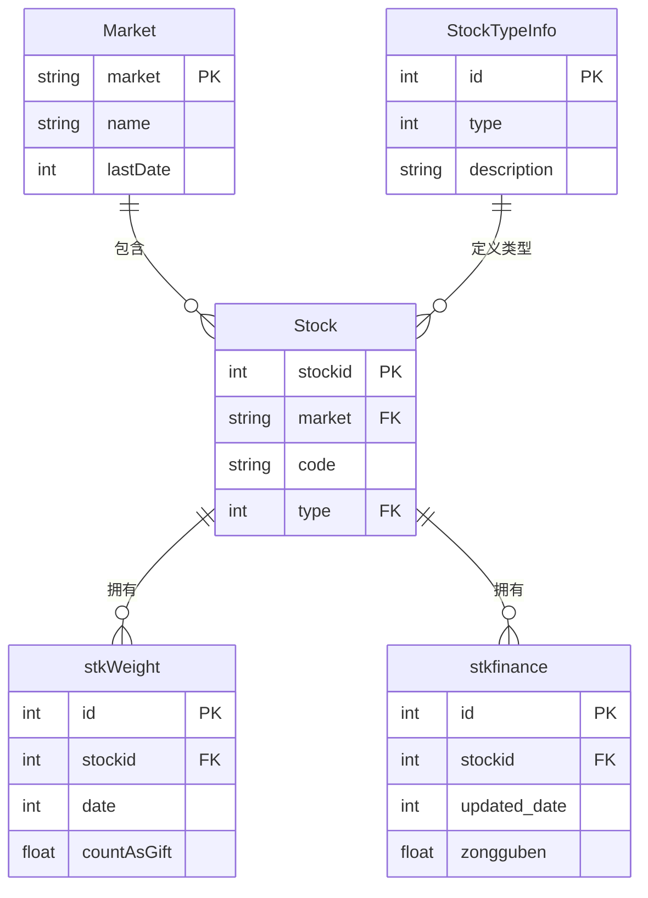
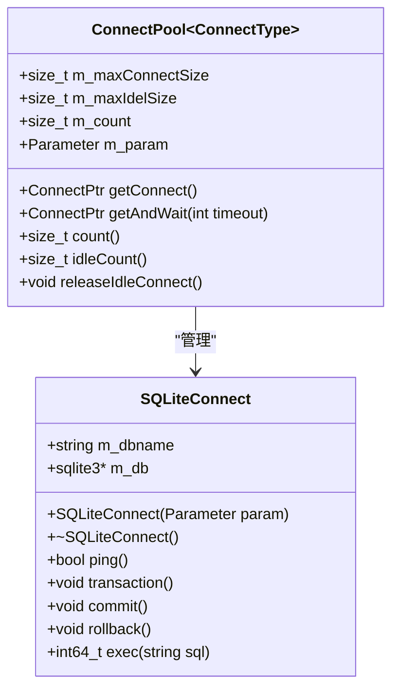
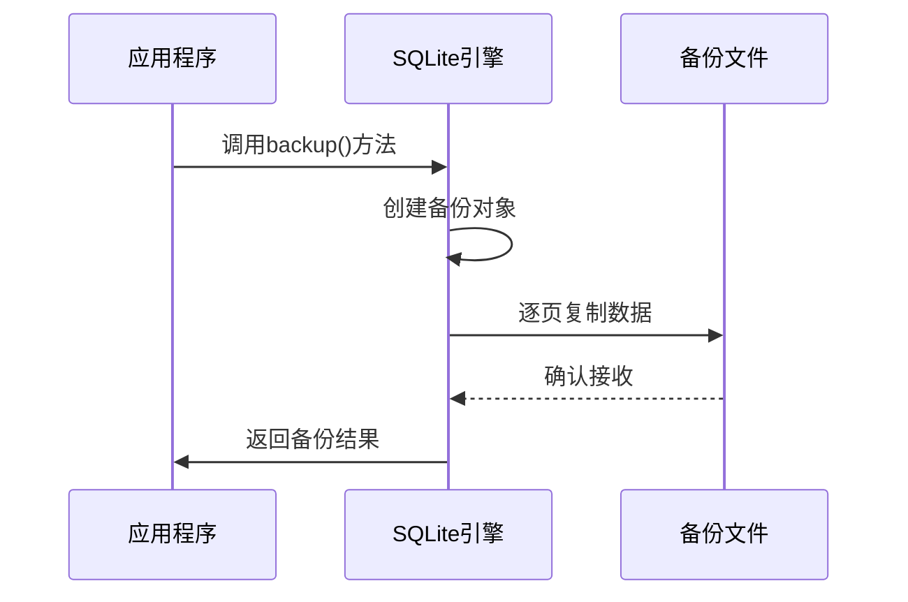
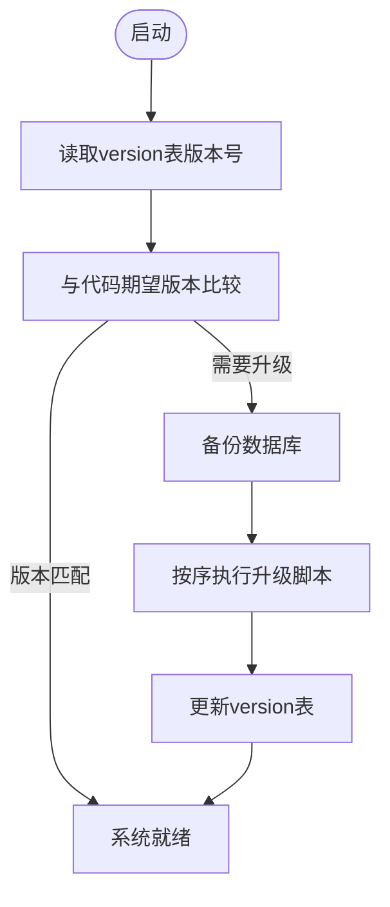

# baseinfo 配置节

<cite>
**本文档引用的文件**  
- [SQLiteBaseInfoDriver.cpp](file://hikyuu_cpp/hikyuu/data_driver/base_info/sqlite/SQLiteBaseInfoDriver.cpp)
- [SQLiteBaseInfoDriver.h](file://hikyuu_cpp/hikyuu/data_driver/base_info/sqlite/SQLiteBaseInfoDriver.h)
- [SQLiteConnect.cpp](file://hikyuu_cpp/hikyuu/utilities/db_connect/sqlite/SQLiteConnect.cpp)
- [SQLiteConnect.h](file://hikyuu_cpp/hikyuu/utilities/db_connect/sqlite/SQLiteConnect.h)
- [ConnectPool.h](file://hikyuu_cpp/hikyuu/utilities/ConnectPool.h)
- [common_sqlite3.py](file://hikyuu/data/common_sqlite3.py)
- [hku_config_template.py](file://hikyuu/data/hku_config_template.py)
- [createdb.sql](file://hikyuu/data/sqlite_upgrade/createdb.sql)
- [0001.sql](file://hikyuu/data/sqlite_upgrade/0001.sql)
- [0002.sql](file://hikyuu/data/sqlite_upgrade/0002.sql)
- [0003.sql](file://hikyuu/data/sqlite_upgrade/0003.sql)
</cite>

## 目录
1. [简介](#简介)
2. [type参数详解](#type参数详解)
3. [db参数详解](#db参数详解)
4. [数据库文件结构](#数据库文件结构)
5. [连接池配置](#连接池配置)
6. [性能优化建议](#性能优化建议)
7. [备份与恢复策略](#备份与恢复策略)
8. [版本兼容性注意事项](#版本兼容性注意事项)
9. [总结](#总结)

## 简介
baseinfo配置节是Hikyuu量化分析系统中用于配置基础信息数据源的核心部分。该配置节主要负责管理股票基础信息、市场信息、交易日历等元数据的存储和访问。通过合理的配置，系统能够高效地读取和处理这些基础数据，为后续的量化分析提供可靠的数据支持。

**Section sources**
- [hku_config_template.py](file://hikyuu/data/hku_config_template.py#L43-L106)

## type参数详解
type参数用于指定基础信息数据源的类型。目前Hikyuu系统支持多种数据库类型，其中sqlite3是最常用和推荐的配置。

### 支持的数据库类型
- **sqlite3**: 轻量级嵌入式数据库，适合个人用户和小型项目
- **mysql**: 功能完整的客户端-服务器数据库，适合多用户环境
- **clickhouse**: 列式数据库，适合大数据量分析场景

### sqlite3类型特性
sqlite3作为默认和推荐的数据源类型，具有以下优势：
- **单文件存储**: 所有数据存储在一个文件中，便于管理和备份
- **零配置**: 无需独立的数据库服务器，开箱即用
- **跨平台**: 在Windows、Linux、macOS等系统上表现一致
- **ACID事务**: 支持完整的事务处理，确保数据一致性

**Section sources**
- [hku_config_template.py](file://hikyuu/data/hku_config_template.py#L43-L106)
- [SQLiteBaseInfoDriver.h](file://hikyuu_cpp/hikyuu/data_driver/base_info/sqlite/SQLiteBaseInfoDriver.h#L24-L38)

## db参数详解
db参数用于指定SQLite数据库文件的路径，是baseinfo配置节中最重要的参数之一。

### 路径配置
db参数支持绝对路径和相对路径配置：
- **绝对路径**: `/path/to/stock.db` 或 `C:\\data\\stock.db`
- **相对路径**: `./stock.db` 或 `data/stock.db`

### 数据库文件作用
SQLite数据库文件存储了系统所需的各种基础信息：
- **股票基础信息**: 包括股票代码、名称、上市日期等
- **市场信息**: 包括交易所信息、交易时间、指数代码等
- **交易日历**: 存储交易所的交易日和休假日历
- **权息数据**: 存储股票的分红、配股等权息信息
- **财务数据**: 存储上市公司的财务指标数据

### 文件初始化
当指定的数据库文件不存在时，系统会自动创建并初始化数据库结构。初始化过程包括：
1. 创建所有必要的数据表
2. 插入基础的市场和股票类型信息
3. 设置数据库版本信息

**Diagram sources**
- [common_sqlite3.py](file://hikyuu/data/common_sqlite3.py#L56-L76)
- [createdb.sql](file://hikyuu/data/sqlite_upgrade/createdb.sql#L1-L62)

**Section sources**
- [SQLiteBaseInfoDriver.cpp](file://hikyuu_cpp/hikyuu/data_driver/base_info/sqlite/SQLiteBaseInfoDriver.cpp#L32-L38)
- [common_sqlite3.py](file://hikyuu/data/common_sqlite3.py#L33-L42)

## 数据库文件结构
了解数据库的内部结构对于性能优化和故障排查至关重要。

### 核心数据表
SQLite数据库包含以下核心数据表：

| 表名 | 说明 | 主要字段 |
|------|------|---------|
| version | 数据库版本信息 | version |
| Market | 市场信息 | market, name, lastDate |
| Stock | 股票信息 | market, code, name, type |
| StockTypeInfo | 股票类型信息 | type, description, tick |
| stkWeight | 权息数据 | stockid, date, countAsGift |
| stkfinance | 财务数据 | stockid, updated_date, zongguben |

### 表关系图

**Diagram sources**
- [createdb.sql](file://hikyuu/data/sqlite_upgrade/createdb.sql#L1-L62)
- [0002.sql](file://hikyuu/data/sqlite_upgrade/0002.sql#L1-L49)

**Section sources**
- [createdb.sql](file://hikyuu/data/sqlite_upgrade/createdb.sql#L1-L62)
- [0002.sql](file://hikyuu/data/sqlite_upgrade/0002.sql#L1-L49)

## 连接池配置
连接池是提高数据库访问性能的关键组件。

### 连接池工作原理
连接池通过预先创建和管理数据库连接，避免了频繁创建和销毁连接的开销。Hikyuu系统中的连接池具有以下特性：
- **线程安全**: 支持多线程并发访问
- **连接复用**: 连接使用后归还到池中，供后续使用
- **连接限制**: 可配置最大连接数，防止资源耗尽

### 连接池参数
虽然baseinfo配置节不直接暴露连接池参数，但系统内部使用了智能的连接池管理策略：
- **最大连接数**: 默认不限制，可根据系统资源调整
- **最大空闲连接数**: 默认100个，避免内存浪费
- **连接超时**: 支持等待连接的超时机制

**Diagram sources**
- [ConnectPool.h](file://hikyuu_cpp/hikyuu/utilities/ConnectPool.h#L24-L163)
- [SQLiteConnect.h](file://hikyuu_cpp/hikyuu/utilities/db_connect/sqlite/SQLiteConnect.h#L28-L83)

**Section sources**
- [ConnectPool.h](file://hikyuu_cpp/hikyuu/utilities/ConnectPool.h#L24-L163)
- [SQLiteBaseInfoDriver.cpp](file://hikyuu_cpp/hikyuu/data_driver/base_info/sqlite/SQLiteBaseInfoDriver.cpp#L36-L38)

## 性能优化建议
合理的配置和使用方式可以显著提升数据库性能。

### 索引优化
数据库已经为关键查询创建了必要的索引：
- **stkWeight表**: 在stockid和date字段上创建了复合索引
- **stkfinance表**: 在stockid和updated_date字段上创建了复合索引
- **Stock表**: 在market和code字段上有唯一索引

### 查询优化
- **批量操作**: 尽量使用批量加载和批量执行，减少数据库交互次数
- **连接复用**: 在多线程环境中，合理使用连接池，避免频繁创建连接
- **事务处理**: 对于多个相关操作，使用事务确保数据一致性

### 文件位置优化
- **SSD存储**: 将数据库文件存储在SSD上，可以显著提升读写性能
- **独立磁盘**: 避免与其他高I/O应用共享磁盘，减少I/O竞争
- **内存映射**: 对于小规模数据库，可以考虑使用内存映射文件

**Section sources**
- [createdb.sql](file://hikyuu/data/sqlite_upgrade/createdb.sql#L58-L60)
- [0002.sql](file://hikyuu/data/sqlite_upgrade/0002.sql#L44-L45)

## 备份与恢复策略
数据安全是系统稳定运行的基础，必须制定完善的备份和恢复策略。

### 备份方法
Hikyuu系统提供了多种备份方式：

#### 在线备份
SQLiteConnect类提供了backup方法，支持在线备份：

**Diagram sources**
- [SQLiteConnect.cpp](file://hikyuu_cpp/hikyuu/utilities/db_connect/sqlite/SQLiteConnect.cpp#L163-L190)

#### 手动备份
最简单的备份方法是直接复制数据库文件：
1. 确保没有应用程序正在使用数据库
2. 复制stock.db文件到安全位置
3. 验证备份文件的完整性

### 恢复方法
#### 文件替换
当数据库损坏时，可以通过替换文件恢复：
1. 关闭所有使用数据库的应用程序
2. 删除损坏的数据库文件
3. 将备份文件复制到原位置
4. 启动应用程序验证恢复结果

#### 数据库检查
在恢复前，建议先检查数据库完整性：
- 使用PRAGMA integrity_check命令
- 使用PRAGMA quick_check进行快速检查
- 检查数据库文件是否被其他进程锁定

**Section sources**
- [SQLiteConnect.cpp](file://hikyuu_cpp/hikyuu/utilities/db_connect/sqlite/SQLiteConnect.cpp#L146-L161)
- [SQLiteConnect.cpp](file://hikyuu_cpp/hikyuu/utilities/db_connect/sqlite/SQLiteConnect.cpp#L163-L190)

## 版本兼容性注意事项
数据库版本管理是确保系统稳定升级的关键。

### 版本升级机制
Hikyuu系统采用增量升级脚本的方式管理数据库版本：
- **version表**: 记录当前数据库版本号
- **升级脚本**: 按版本号顺序执行，确保平滑升级
- **向后兼容**: 新版本系统通常兼容旧版本数据库

### 升级流程

**Diagram sources**
- [common_sqlite3.py](file://hikyuu/data/common_sqlite3.py#L65-L73)
- [0001.sql](file://hikyuu/data/sqlite_upgrade/0001.sql#L1-L4)

**Section sources**
- [common_sqlite3.py](file://hikyuu/data/common_sqlite3.py#L45-L53)
- [0001.sql](file://hikyuu/data/sqlite_upgrade/0001.sql#L1-L4)

## 总结
baseinfo配置节是Hikyuu系统的基础数据管理核心，通过合理的type和db参数配置，可以确保系统稳定高效地运行。推荐使用sqlite3类型和适当的数据库文件路径，结合连接池和索引优化，可以充分发挥系统性能。同时，建立完善的备份和恢复策略，确保数据安全。随着系统版本的演进，注意数据库版本的兼容性，确保平滑升级。