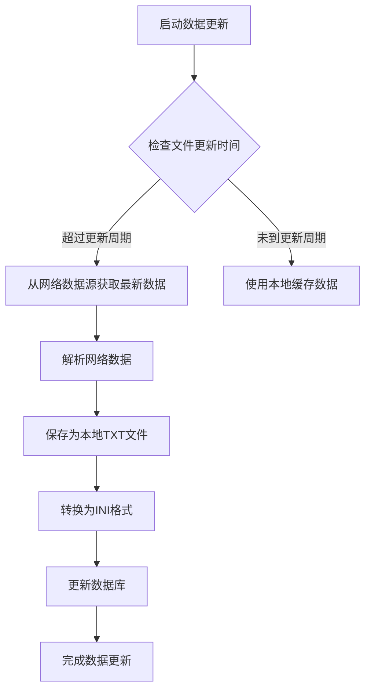

# block 配置节

<cite>
**本文档引用文件**   
- [zsbk.ini](file://hikyuu/config/block/zsbk.ini)
- [hybk.ini](file://hikyuu/config/block/hybk.ini)
- [gnbk.ini](file://hikyuu/config/block/gnbk.ini)
- [dybk.ini](file://hikyuu/config/block/dybk.ini)
- [self.ini](file://hikyuu/config/block/self.ini)
- [QLBlockInfoDriver.cpp](file://hikyuu_cpp/hikyuu/data_driver/block_info/qianlong/QLBlockInfoDriver.cpp)
- [QLBlockInfoDriver.h](file://hikyuu_cpp/hikyuu/data_driver/block_info/qianlong/QLBlockInfoDriver.h)
- [BlockInfoDriver.h](file://hikyuu_cpp/hikyuu/data_driver/BlockInfoDriver.h)
- [download_block.py](file://hikyuu/data/download_block.py)
- [em_block_to_sqlite.py](file://hikyuu/data/em_block_to_sqlite.py)
</cite>

## 目录
1. [简介](#简介)
2. [配置参数详解](#配置参数详解)
3. [板块文件结构与映射关系](#板块文件结构与映射关系)
4. [板块数据更新策略](#板块数据更新策略)
5. [自定义板块创建指南](#自定义板块创建指南)
6. [多板块类型管理最佳实践](#多板块类型管理最佳实践)
7. [常见配置错误排查](#常见配置错误排查)
8. [结论](#结论)

## 简介
block配置节是Hikyuu量化分析系统中用于管理股票板块信息的核心配置部分。该配置系统支持多种数据源类型，包括指数板块、行业板块、地域板块、概念板块和自定义板块。通过type参数指定数据源类型，dir参数指定板块文件目录路径，系统能够灵活地加载和管理不同类型的板块数据。这些板块数据在量化分析、策略回测和投资组合管理中发挥着重要作用，为用户提供多维度的市场分析视角。

## 配置参数详解

### type参数
type参数用于指定板块数据源的类型，支持qianlong（千龙）数据源格式。该参数决定了系统使用哪种数据驱动来解析和加载板块信息。在Hikyuu系统中，qianlong是默认支持的板块数据源类型，专门用于处理以特定INI文件格式存储的板块数据。

### dir参数
dir参数指定板块文件的目录路径，系统将在此目录下查找和加载所有板块配置文件。该路径应指向包含zsbk.ini、hybk.ini、gnbk.ini、dybk.ini和self.ini等板块文件的目录。正确的目录路径配置是确保系统能够成功加载板块数据的前提条件。

**节来源**
- [QLBlockInfoDriver.cpp](file://hikyuu_cpp/hikyuu/data_driver/block_info/qianlong/QLBlockInfoDriver.cpp#L16-L205)
- [QLBlockInfoDriver.h](file://hikyuu_cpp/hikyuu/data_driver/block_info/qianlong/QLBlockInfoDriver.h#L1-L32)

## 板块文件结构与映射关系

### 指数板块(zsbk.ini)
指数板块文件zsbk.ini存储了各种股票指数的成分股信息。文件结构以方括号[]包围的指数名称作为节名，每行包含一个成分股代码。例如，[上证指数]节下列出了所有上证指数成分股。第一个数字表示市场（0为上海，1为深圳），后跟股票代码。

```ini
[上证指数]
0,600000
0,600004
...
```

### 行业板块(hybk.ini)
行业板块文件hybk.ini按照行业分类组织股票。每个行业作为一个独立的节，包含该行业内所有上市公司的股票代码。行业板块为行业轮动分析和行业比较研究提供了基础数据支持。

```ini
[光学光电子]
1,873001
1,300232
...
```

### 地域板块(dybk.ini)
地域板块文件dybk.ini根据上市公司所在地进行分类。这种分类方式有助于分析区域经济发展对股票市场的影响，以及地域性投资机会的挖掘。

```ini
[广东板块]
1,873001
1,300269
...
```

### 概念板块(gnbk.ini)
概念板块文件gnbk.ini包含了各种市场热点概念的股票集合，如"MicroLED"、"元宇宙概念"等。这些板块反映了市场资金的短期关注方向，对于捕捉市场热点具有重要价值。

```ini
[MicroLED]
1,300269
1,300323
...
```

### 自定义板块(self.ini)
自定义板块文件self.ini允许用户创建个性化的股票组合。用户可以根据自己的投资策略或研究需求，将特定股票归类到自定义板块中，实现灵活的投资组合管理。

```ini
[1]
1, 000728 ;国元证券
1, 002685 ;华东重机
...
```

**节来源**
- [zsbk.ini](file://hikyuu/config/block/zsbk.ini#L1-L800)
- [hybk.ini](file://hikyuu/config/block/hybk.ini#L1-L800)
- [gnbk.ini](file://hikyuu/config/block/gnbk.ini#L1-L800)
- [dybk.ini](file://hikyuu/config/block/dybk.ini#L1-L800)
- [self.ini](file://hikyuu/config/block/self.ini#L1-L10)

## 板块数据更新策略

### 自动更新机制
Hikyuu系统提供了自动化的板块数据更新机制。通过执行`download_block.py`脚本，系统可以从东方财富网等数据源自动下载最新的板块成分股信息。该脚本会定期检查并更新行业板块、概念板块、地域板块和指数板块的数据。



**图来源**
- [download_block.py](file://hikyuu/data/download_block.py#L1-L352)
- [em_block_to_sqlite.py](file://hikyuu/data/em_block_to_sqlite.py#L1-L71)

### 手动更新流程
对于需要精确控制更新时机的用户，可以采用手动更新流程。首先运行`download_block.py`脚本下载最新数据，然后检查生成的TXT文件内容，确认无误后将其转换为INI格式并放置到配置目录中。最后重启Hikyuu系统或重新加载配置以应用更新。

### 更新周期建议
建议的更新周期如下：
- 指数板块：每月更新一次
- 行业板块：每季度更新一次
- 概念板块：每周更新一次
- 地域板块：每半年更新一次
- 自定义板块：根据用户需求随时更新

## 自定义板块创建指南

### 创建步骤
1. 在配置目录中创建或编辑self.ini文件
2. 使用方括号[]定义新的板块名称
3. 在每个板块下添加股票代码，格式为"市场标识,股票代码"
4. 可在代码后添加分号;和注释说明
5. 保存文件并重新加载系统配置

### 格式规范
- 板块名称必须用方括号[]包围
- 每行一个股票代码
- 市场标识：0表示上海市场，1表示深圳市场
- 股票代码为6位数字
- 可选的注释以分号;开始
- 支持空行和注释行（以;开头）

### 示例
```ini
[我的投资组合]
1, 000728 ;国元证券
0, 600050 ;中国联通
1, 002685 ;华东重机

[重点关注]
0, 600519 ;浙江龙盛
1, 300750 ;宁德时代
```

**节来源**
- [self.ini](file://hikyuu/config/block/self.ini#L1-L10)
- [QLBlockInfoDriver.cpp](file://hikyuu_cpp/hikyuu/data_driver/block_info/qianlong/QLBlockInfoDriver.cpp#L136-L178)

## 多板块类型管理最佳实践

### 目录结构规划
建议采用清晰的目录结构来管理不同类型的板块文件：
```
block/
├── zsbk.ini      # 指数板块
├── hybk.ini      # 行业板块
├── gnbk.ini      # 概念板块
├── dybk.ini      # 地域板块
└── self.ini      # 自定义板块
```

### 命名规范
建立统一的命名规范有助于提高管理效率：
- 指数板块：使用标准指数名称
- 行业板块：采用证监会行业分类标准
- 概念板块：使用市场通用概念名称
- 地域板块：使用行政区划名称
- 自定义板块：使用有意义的描述性名称

### 版本控制
对板块配置文件实施版本控制，记录每次变更的原因和内容。这有助于追踪数据变化历史，在出现问题时能够快速回滚到之前的稳定版本。

### 数据验证
在应用新的板块配置前，进行必要的数据验证：
- 检查股票代码的合法性
- 验证市场标识的正确性
- 确认没有重复的股票代码
- 检查板块名称的唯一性

## 常见配置错误排查

### 文件路径错误
当系统无法找到板块文件时，会抛出"Missing 'dir' param!"错误。解决方法：
1. 检查dir参数配置的路径是否正确
2. 确认路径是否存在且可访问
3. 验证路径是否包含必要的板块文件

### 类型不匹配
如果type参数配置的类型与实际数据源不匹配，会导致数据解析失败。确保type参数设置为"qianlong"以正确解析INI格式的板块文件。

### 文件格式错误
常见的文件格式错误包括：
- 缺少方括号的节名
- 代码行格式不正确（缺少逗号分隔）
- 使用了非法字符
- 文件编码问题

### 数据一致性检查
定期检查以下数据一致性问题：
- 相同股票是否被错误地分配到互斥的板块
- 板块内是否有已退市或停牌的股票
- 自定义板块与系统板块是否存在冲突

**节来源**
- [QLBlockInfoDriver.cpp](file://hikyuu_cpp/hikyuu/data_driver/block_info/qianlong/QLBlockInfoDriver.cpp#L102-L178)
- [BlockInfoDriver.h](file://hikyuu_cpp/hikyuu/data_driver/BlockInfoDriver.h#L1-L115)

## 结论
block配置节是Hikyuu系统中管理股票板块信息的核心组件，通过type和dir参数的灵活配置，支持多种数据源类型和自定义板块管理。深入理解各种板块文件的结构和映射关系，掌握数据更新策略和自定义板块创建方法，能够有效提升量化分析的效率和准确性。遵循最佳实践并及时排查常见配置错误，可以确保板块数据的准确性和可靠性，为投资决策提供有力支持。