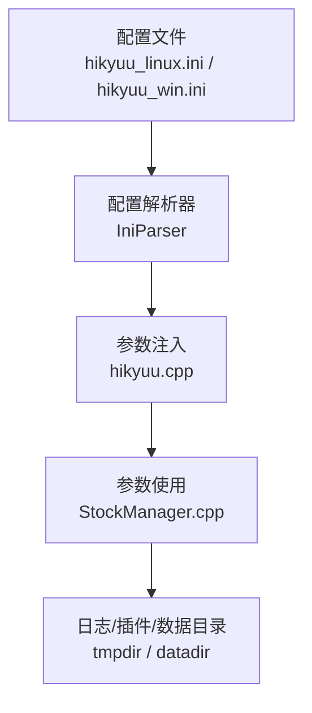
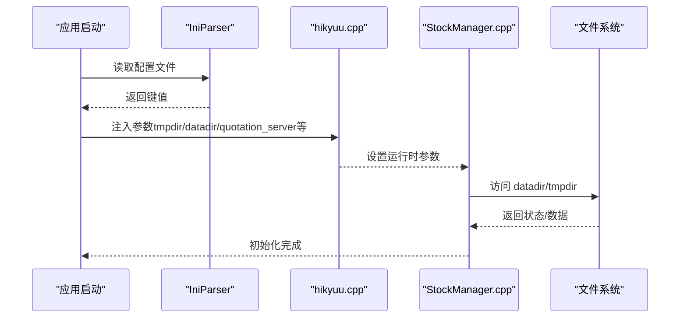
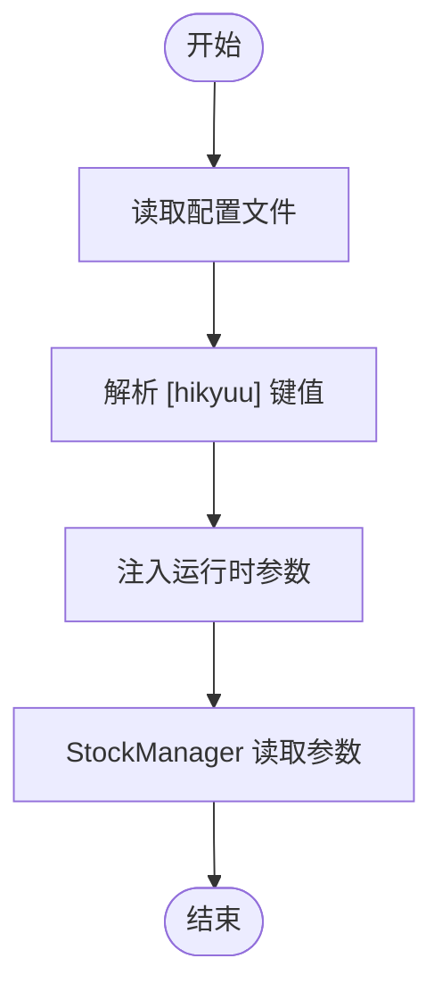
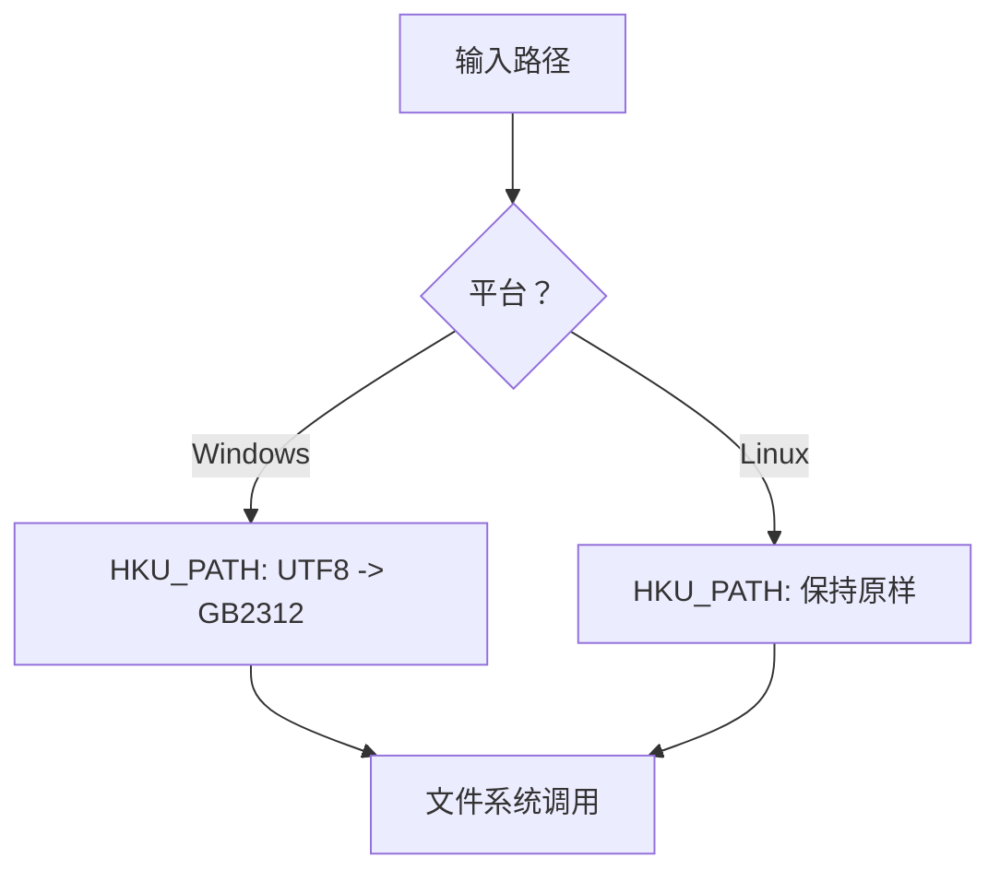
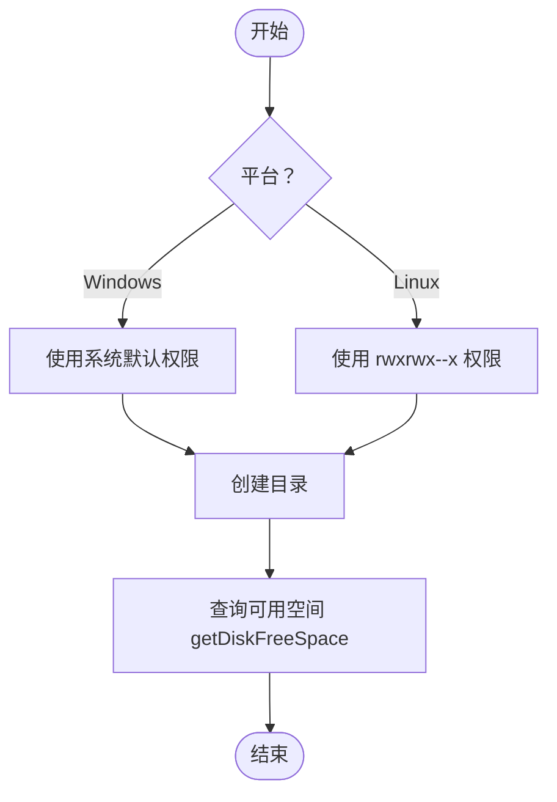
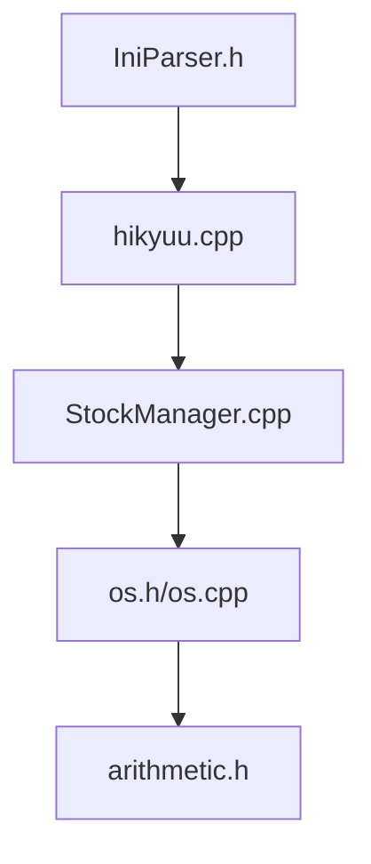

# hikyuu 配置节

<cite>
**本文引用的文件列表**
- [hikyuu.cpp](file://hikyuu_cpp/hikyuu/hikyuu.cpp)
- [hku_config_template.py](file://hikyuu/data/hku_config_template.py)
- [hikyuu_linux.ini](file://test_data/hikyuu_linux.ini)
- [hikyuu_win.ini](file://test_data/hikyuu_win.ini)
- [IniParser.h](file://hikyuu_cpp/hikyuu/utilities/ini_parser/IniParser.h)
- [os.cpp](file://hikyuu_cpp/hikyuu/utilities/os.cpp)
- [os.h](file://hikyuu_cpp/hikyuu/utilities/os.h)
- [arithmetic.h](file://hikyuu_cpp/hikyuu/utilities/arithmetic.h)
- [osdef.h](file://hikyuu_cpp/hikyuu/utilities/osdef.h)
- [StockManager.cpp](file://hikyuu_cpp/hikyuu/StockManager.cpp)
- [HikyuuTDX.py](file://hikyuu/gui/HikyuuTDX.py)
</cite>

## 目录
1. [简介](#简介)
2. [项目结构与入口](#项目结构与入口)
3. [核心组件：配置节与参数](#核心组件配置节与参数)
4. [架构总览](#架构总览)
5. [详细组件分析](#详细组件分析)
6. [依赖关系分析](#依赖关系分析)
7. [性能考量](#性能考量)
8. [故障排查指南](#故障排查指南)
9. [结论](#结论)
10. [附录](#附录)

## 简介
本文件聚焦 hikyuu 配置节 [hikyuu] 中的两个关键参数：tmpdir 和 datadir。我们将从配置加载、路径表示差异、目录组织结构、权限与磁盘空间、配置验证与常见错误处理等方面进行系统性说明，帮助用户在 Linux 与 Windows 系统上正确配置与使用。

## 项目结构与入口
- 配置文件示例：
  - Linux 示例：[hikyuu_linux.ini](file://test_data/hikyuu_linux.ini#L1-L56)
  - Windows 示例：[hikyuu_win.ini](file://test_data/hikyuu_win.ini#L1-L56)
- 配置模板生成逻辑：
  - Python 模板生成器：[hku_config_template.py](file://hikyuu/data/hku_config_template.py#L303-L324)
- 配置解析与参数注入：
  - C++ 加载入口：[hikyuu.cpp](file://hikyuu_cpp/hikyuu/hikyuu.cpp#L40-L92)
- 股票上下文参数使用：
  - 参数读取与插件路径设置：[StockManager.cpp](file://hikyuu_cpp/hikyuu/StockManager.cpp#L96-L126)

图表来源
- [hikyuu_linux.ini](file://test_data/hikyuu_linux.ini#L1-L56)
- [hikyuu_win.ini](file://test_data/hikyuu_win.ini#L1-L56)
- [hku_config_template.py](file://hikyuu/data/hku_config_template.py#L303-L324)
- [hikyuu.cpp](file://hikyuu_cpp/hikyuu/hikyuu.cpp#L40-L92)
- [StockManager.cpp](file://hikyuu_cpp/hikyuu/StockManager.cpp#L96-L126)

章节来源
- [hikyuu_linux.ini](file://test_data/hikyuu_linux.ini#L1-L56)
- [hikyuu_win.ini](file://test_data/hikyuu_win.ini#L1-L56)
- [hku_config_template.py](file://hikyuu/data/hku_config_template.py#L303-L324)
- [hikyuu.cpp](file://hikyuu_cpp/hikyuu/hikyuu.cpp#L40-L92)
- [StockManager.cpp](file://hikyuu_cpp/hikyuu/StockManager.cpp#L96-L126)

## 核心组件：配置节与参数
- [hikyuu] 配置节
  - tmpdir：临时文件目录，用于缓存、中间文件、临时数据等
  - datadir：根数据目录，作为所有相对路径的基础
  - 其他相关项：quotation_server、load_stock_weight、load_history_finance、plugindir 等
- 配置加载流程
  - 通过 IniParser 读取配置文件，提取 [hikyuu] 下的 tmpdir、datadir 等键值
  - 将这些参数注入到运行时参数容器中，供后续模块使用
- 路径表示差异
  - Linux 使用正斜杠 (/)
  - Windows 使用反斜杠 (\)，模板中也体现为双反斜杠
- 目录组织结构
  - datadir 通常包含基础数据库、板块文件、K线数据等
  - tmpdir 通常为 datadir 下的子目录，便于集中管理与清理

章节来源
- [hikyuu.cpp](file://hikyuu_cpp/hikyuu/hikyuu.cpp#L40-L92)
- [hikyuu_linux.ini](file://test_data/hikyuu_linux.ini#L1-L56)
- [hikyuu_win.ini](file://test_data/hikyuu_win.ini#L1-L56)
- [hku_config_template.py](file://hikyuu/data/hku_config_template.py#L1-L41)

## 架构总览
下面的序列图展示了配置节参数从文件到运行时使用的端到端流程。

图表来源
- [hikyuu.cpp](file://hikyuu_cpp/hikyuu/hikyuu.cpp#L40-L92)
- [StockManager.cpp](file://hikyuu_cpp/hikyuu/StockManager.cpp#L96-L126)

## 详细组件分析

### 配置解析与参数注入
- 解析入口
  - 读取配置文件并提取 [hikyuu] 下的 tmpdir、datadir、quotation_server、load_stock_weight、load_history_finance、plugindir 等
- 参数注入
  - 将上述键值设置到运行时参数容器中，供后续模块读取
- 可选参数
  - 若配置缺失，IniParser 提供默认值；若仍缺失，将抛出异常或采用默认策略

图表来源
- [hikyuu.cpp](file://hikyuu_cpp/hikyuu/hikyuu.cpp#L40-L92)
- [IniParser.h](file://hikyuu_cpp/hikyuu/utilities/ini_parser/IniParser.h#L60-L105)

章节来源
- [hikyuu.cpp](file://hikyuu_cpp/hikyuu/hikyuu.cpp#L40-L92)
- [IniParser.h](file://hikyuu_cpp/hikyuu/utilities/ini_parser/IniParser.h#L60-L105)

### 路径表示与跨平台处理
- Linux 与 Windows 的路径分隔符差异
  - Linux 使用正斜杠 (/)
  - Windows 使用反斜杠 (\)，模板中体现为双反斜杠
- 路径转换与编码
  - HKU_PATH 宏用于路径转换，Windows 下将 UTF-8 转换为 GB2312，Linux 下保持原样
  - HKU_STR/HKU_CSTR 用于字符串转换，Windows 下将 UTF-8 转换为 GB2312，Linux 下保持原样
- 用户目录与当前工作目录
  - getUserDir() 获取用户主目录
  - getCurrentDir() 获取当前工作目录

图表来源
- [arithmetic.h](file://hikyuu_cpp/hikyuu/utilities/arithmetic.h#L43-L77)
- [os.cpp](file://hikyuu_cpp/hikyuu/utilities/os.cpp#L189-L233)
- [osdef.h](file://hikyuu_cpp/hikyuu/utilities/osdef.h#L44-L83)

章节来源
- [hikyuu_linux.ini](file://test_data/hikyuu_linux.ini#L1-L56)
- [hikyuu_win.ini](file://test_data/hikyuu_win.ini#L1-L56)
- [arithmetic.h](file://hikyuu_cpp/hikyuu/utilities/arithmetic.h#L43-L77)
- [os.cpp](file://hikyuu_cpp/hikyuu/utilities/os.cpp#L189-L233)
- [osdef.h](file://hikyuu_cpp/hikyuu/utilities/osdef.h#L44-L83)

### 目录组织结构与 datadir 规划
- datadir 作为根目录，通常包含：
  - 基础信息数据库（如 SQLite/MySQL/ClickHouse）
  - 板块信息文件
  - K线数据（HDF5/MySQL/ClickHouse 等）
- tmpdir 作为临时目录，通常位于 datadir 下的子目录，便于统一管理与清理
- GUI 工具在生成配置时会在目标目录下创建 tmp 子目录（例如 HDF5/MySQL/ClickHouse 模板）

章节来源
- [hku_config_template.py](file://hikyuu/data/hku_config_template.py#L1-L41)
- [HikyuuTDX.py](file://hikyuu/gui/HikyuuTDX.py#L115-L135)
- [HikyuuTDX.py](file://hikyuu/gui/HikyuuTDX.py#L156-L178)
- [HikyuuTDX.py](file://hikyuu/gui/HikyuuTDX.py#L192-L214)

### 目录权限与磁盘空间
- 目录权限
  - 创建目录时，默认权限在 Linux 下为 rwxrwx--x（属主、属组可读写执行，其他可读写执行）
  - Windows 下使用系统默认权限
- 磁盘空间查询
  - 提供 getDiskFreeSpace 接口，用于查询指定路径的可用空间
- 目录操作
  - existFile/createDir/removeFile/removeDir/renameFile 等接口用于文件/目录管理

图表来源
- [os.cpp](file://hikyuu_cpp/hikyuu/utilities/os.cpp#L67-L112)
- [os.h](file://hikyuu_cpp/hikyuu/utilities/os.h#L61-L115)

章节来源
- [os.cpp](file://hikyuu_cpp/hikyuu/utilities/os.cpp#L67-L112)
- [os.h](file://hikyuu_cpp/hikyuu/utilities/os.h#L61-L115)

### 配置验证与常见错误
- 配置文件格式校验
  - IniParser 对 section、key=value 行格式有严格要求，非法格式会抛出异常
- 参数缺失与默认值
  - 若 [hikyuu] 下缺少 tmpdir 或 datadir，将采用默认值；若默认值无效或缺失，可能导致初始化失败
- 常见错误与解决
  - 路径不存在：确保 datadir 存在且可访问
  - 权限不足：确保进程对 datadir/tmpdir 具备读写权限
  - 路径分隔符错误：Linux 使用 /，Windows 使用 \，模板中已体现

章节来源
- [IniParser.h](file://hikyuu_cpp/hikyuu/utilities/ini_parser/IniParser.h#L35-L58)
- [hikyuu.cpp](file://hikyuu_cpp/hikyuu/hikyuu.cpp#L40-L92)

## 依赖关系分析
- 配置解析依赖 IniParser
- 参数注入依赖 hikyuu.cpp
- 参数使用依赖 StockManager.cpp
- 跨平台路径处理依赖 arithmetic.h 与 os.cpp
- 目录与磁盘操作依赖 os.h/os.cpp

图表来源
- [IniParser.h](file://hikyuu_cpp/hikyuu/utilities/ini_parser/IniParser.h#L60-L105)
- [hikyuu.cpp](file://hikyuu_cpp/hikyuu/hikyuu.cpp#L40-L92)
- [StockManager.cpp](file://hikyuu_cpp/hikyuu/StockManager.cpp#L96-L126)
- [os.h](file://hikyuu_cpp/hikyuu/utilities/os.h#L1-L59)
- [os.cpp](file://hikyuu_cpp/hikyuu/utilities/os.cpp#L1-L70)
- [arithmetic.h](file://hikyuu_cpp/hikyuu/utilities/arithmetic.h#L43-L77)

章节来源
- [IniParser.h](file://hikyuu_cpp/hikyuu/utilities/ini_parser/IniParser.h#L60-L105)
- [hikyuu.cpp](file://hikyuu_cpp/hikyuu/hikyuu.cpp#L40-L92)
- [StockManager.cpp](file://hikyuu_cpp/hikyuu/StockManager.cpp#L96-L126)
- [os.h](file://hikyuu_cpp/hikyuu/utilities/os.h#L1-L59)
- [os.cpp](file://hikyuu_cpp/hikyuu/utilities/os.cpp#L1-L70)
- [arithmetic.h](file://hikyuu_cpp/hikyuu/utilities/arithmetic.h#L43-L77)

## 性能考量
- tmpdir 的选择
  - 将 tmpdir 指向高性能本地磁盘（如 SSD）可显著提升临时文件读写性能
  - 避免将 tmpdir 放在网络挂载盘，减少延迟抖动
- datadir 的选择
  - datadir 应具备充足的磁盘空间与良好的 IO 性能
  - 对于大规模 K 线数据，建议使用专用磁盘分区或阵列
- 日志与插件
  - plugindir 与日志目录位于用户目录下的 .hikyuu 中，避免频繁 IO 干扰

章节来源
- [hikyuu.cpp](file://hikyuu_cpp/hikyuu/hikyuu.cpp#L40-L92)
- [os.cpp](file://hikyuu_cpp/hikyuu/utilities/os.cpp#L230-L291)

## 故障排查指南
- 配置文件格式错误
  - 确保 section 与 key=value 格式正确，避免缺少方括号、等号或注释格式错误
- 路径不存在
  - 使用 existFile 检查路径是否存在，必要时使用 createDir 创建
- 权限不足
  - 确认进程对 datadir/tmpdir 具备读写权限；Linux 下注意 umask 与属主
- 路径分隔符错误
  - Linux 使用 /，Windows 使用 \；模板中已给出示例
- 磁盘空间不足
  - 使用 getDiskFreeSpace 查询可用空间，及时清理或扩容

章节来源
- [IniParser.h](file://hikyuu_cpp/hikyuu/utilities/ini_parser/IniParser.h#L35-L58)
- [os.h](file://hikyuu_cpp/hikyuu/utilities/os.h#L61-L115)
- [os.cpp](file://hikyuu_cpp/hikyuu/utilities/os.cpp#L287-L333)

## 结论
- tmpdir 与 datadir 是 hikyuu 的两大关键目录参数，前者用于临时文件，后者用于根数据
- 跨平台路径分隔符与编码转换由 HKU_PATH/HKU_STR 等宏处理，确保一致性
- 建议将 tmpdir 指向高性能本地磁盘，datadir 指向稳定且空间充足的分区
- 配置验证与错误处理可通过 existFile/createDir/getDiskFreeSpace 等接口实现

## 附录
- 配置文件示例
  - Linux：[hikyuu_linux.ini](file://test_data/hikyuu_linux.ini#L1-L56)
  - Windows：[hikyuu_win.ini](file://test_data/hikyuu_win.ini#L1-L56)
- 模板生成器
  - [hku_config_template.py](file://hikyuu/data/hku_config_template.py#L303-L324)
- 参数注入与使用
  - [hikyuu.cpp](file://hikyuu_cpp/hikyuu/hikyuu.cpp#L40-L92)
  - [StockManager.cpp](file://hikyuu_cpp/hikyuu/StockManager.cpp#L96-L126)