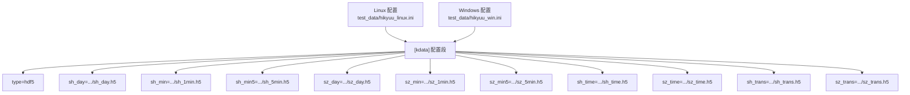
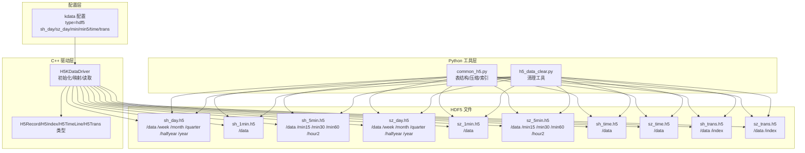
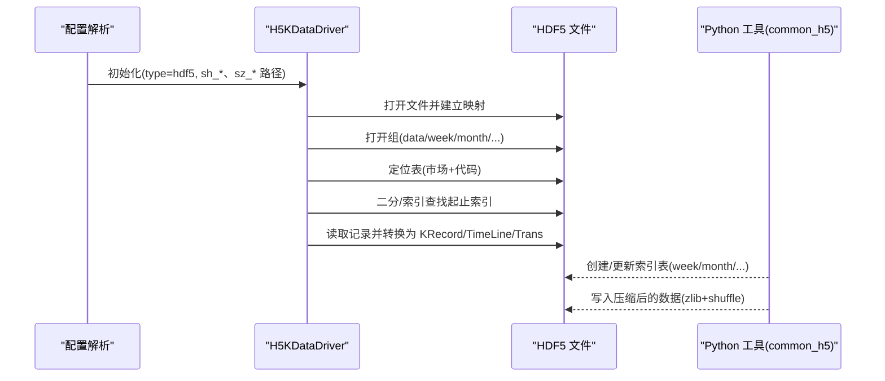
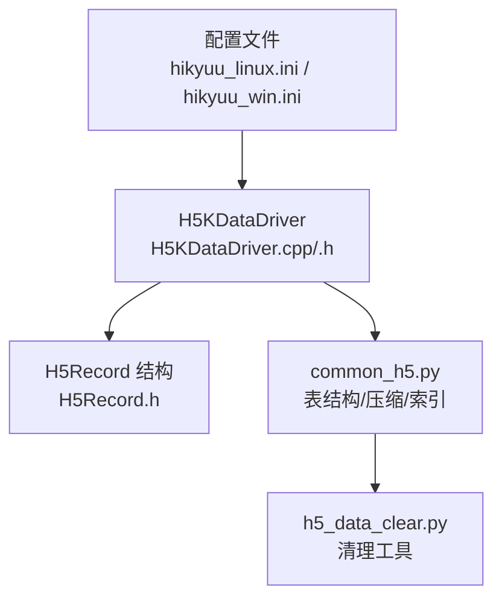

# kdata 配置节

<cite>
**本文引用的文件列表**
- [hikyuu_linux.ini](file://test_data/hikyuu_linux.ini)
- [hikyuu_win.ini](file://test_data/hikyuu_win.ini)
- [H5KDataDriver.h](file://hikyuu_cpp/hikyuu/data_driver/kdata/hdf5/H5KDataDriver.h)
- [H5KDataDriver.cpp](file://hikyuu_cpp/hikyuu/data_driver/kdata/hdf5/H5KDataDriver.cpp)
- [H5Record.h](file://hikyuu_cpp/hikyuu/data_driver/kdata/hdf5/H5Record.h)
- [common_h5.py](file://hikyuu/data/common_h5.py)
- [h5_data_clear.py](file://hikyuu/tools/h5_data_clear.py)
- [xmake.lua](file://hikyuu/xmake.lua)
</cite>

## 目录
1. [简介](#简介)
2. [项目结构与定位](#项目结构与定位)
3. [核心组件与职责](#核心组件与职责)
4. [架构总览](#架构总览)
5. [详细组件解析](#详细组件解析)
6. [依赖关系分析](#依赖关系分析)
7. [性能与优化建议](#性能与优化建议)
8. [故障排查与恢复](#故障排查与恢复)
9. [结论](#结论)
10. [附录](#附录)

## 简介
本文件面向“kdata 配置节”的技术文档，聚焦于：
- type 参数支持的 HDF5 数据存储类型
- sh_day、sh_min、sh_min5、sz_day、sz_min、sz_min5 等参数对应上海与深圳市场的多周期 K 线数据文件路径
- sh_time、sz_time、sh_trans、sz_trans 等参数指定的分时与逐笔交易数据文件
- HDF5 文件的性能优化建议（压缩、chunk、并行 I/O）
- 数据文件备份策略、损坏恢复方法与跨平台迁移注意事项

## 项目结构与定位
kdata 配置节位于配置文件的 [kdata] 段落，用于声明使用哪种数据驱动类型以及各类数据文件的路径。系统通过该配置加载不同市场的多周期 K 线、分时与逐笔数据，并由 HDF5 驱动实现读写与索引访问。

图表来源
- [hikyuu_linux.ini](file://test_data/hikyuu_linux.ini#L44-L56)
- [hikyuu_win.ini](file://test_data/hikyuu_win.ini#L44-L56)

章节来源
- [hikyuu_linux.ini](file://test_data/hikyuu_linux.ini#L44-L56)
- [hikyuu_win.ini](file://test_data/hikyuu_win.ini#L44-L56)

## 核心组件与职责
- 配置解析与初始化
  - 解析 [kdata] 段下的键值对，识别市场前缀与周期后缀，构造 HDF5 文件映射
  - 将不同周期映射到同一底层文件（如日线、周线、月线等共享同一文件）
- HDF5 驱动
  - 基于 HDF5 的数据读取、索引查找、时间序列范围定位
  - 支持并行加载能力检测（取决于 HDF5 库是否启用线程安全）
- Python 工具层
  - 提供 HDF5 表结构定义、压缩参数、索引构建与清理工具

章节来源
- [H5KDataDriver.h](file://hikyuu_cpp/hikyuu/data_driver/kdata/hdf5/H5KDataDriver.h#L1-L90)
- [H5KDataDriver.cpp](file://hikyuu_cpp/hikyuu/data_driver/kdata/hdf5/H5KDataDriver.cpp#L90-L152)
- [common_h5.py](file://hikyuu/data/common_h5.py#L31-L82)

## 架构总览
kdata 配置节通过 type=hdf5 指定使用 HDF5 驱动；系统根据配置项自动建立市场+周期到 HDF5 文件的映射关系，并在查询时按需打开相应组（如 data、week、month 等）与表（股票代码命名的表），完成 K 线、分时与逐笔数据的读取。

图表来源
- [H5KDataDriver.cpp](file://hikyuu_cpp/hikyuu/data_driver/kdata/hdf5/H5KDataDriver.cpp#L90-L152)
- [H5Record.h](file://hikyuu_cpp/hikyuu/data_driver/kdata/hdf5/H5Record.h#L20-L47)
- [common_h5.py](file://hikyuu/data/common_h5.py#L31-L82)
- [h5_data_clear.py](file://hikyuu/tools/h5_data_clear.py#L1-L163)

## 详细组件解析

### 1) type 参数与 HDF5 存储类型
- type=hdf5 指定使用 HDF5 数据驱动
- 驱动内部会根据配置键的市场前缀与周期后缀，将周期映射到对应的 HDF5 组与表
- 并行加载能力取决于 HDF5 库是否启用线程安全

章节来源
- [H5KDataDriver.h](file://hikyuu_cpp/hikyuu/data_driver/kdata/hdf5/H5KDataDriver.h#L26-L40)
- [H5KDataDriver.cpp](file://hikyuu_cpp/hikyuu/data_driver/kdata/hdf5/H5KDataDriver.cpp#L90-L152)

### 2) 上海与深圳市场多周期 K 线数据文件路径
- 日线（DAY）
  - sh_day、sz_day：分别指向上证与深证的日线数据文件
- 分钟线（MIN）
  - sh_min、sz_min：分别指向上证与深证的 1 分钟线数据文件
- 5 分钟线（MIN5）
  - sh_min5、sz_min5：分别指向上证与深证的 5 分钟线数据文件
- 对应文件组织
  - 日线与多周期（周、月、季、半年、年）共享同一文件，使用不同的组（/data、/week、/month、/quarter、/halfyear、/year）
  - 5 分钟线与多周期（15 分钟、30 分钟、60 分钟、2 小时）共享同一文件，使用不同的组（/data、/min15、/min30、/min60、/hour2）

章节来源
- [hikyuu_linux.ini](file://test_data/hikyuu_linux.ini#L44-L56)
- [hikyuu_win.ini](file://test_data/hikyuu_win.ini#L44-L56)
- [H5KDataDriver.cpp](file://hikyuu_cpp/hikyuu/data_driver/kdata/hdf5/H5KDataDriver.cpp#L230-L275)

### 3) 分时与逐笔交易数据文件路径
- 分时数据
  - sh_time、sz_time：分别指向上证与深证的分时数据文件
- 逐笔交易数据
  - sh_trans、sz_trans：分别指向上证与深证的逐笔交易数据文件

章节来源
- [hikyuu_linux.ini](file://test_data/hikyuu_linux.ini#L44-L56)
- [hikyuu_win.ini](file://test_data/hikyuu_win.ini#L44-L56)

### 4) HDF5 数据结构与字段语义
- 基础 K 线记录（日线、分钟线、5 分钟线）
  - 字段：datetime、openPrice、highPrice、lowPrice、closePrice、transAmount、transCount
  - 字段精度与缩放：价格字段以千分之一单位存储，成交量以 0.1 或整数单位存储
- 扩展 K 线索引（周、月、季、半年、年、15 分钟、30 分钟、60 分钟、2 小时）
  - 字段：datetime、start（起始基表索引）
- 分时线
  - 字段：datetime、price、vol
- 逐笔交易
  - 字段：datetime、price、vol、buyorsell（买卖方向）

章节来源
- [H5Record.h](file://hikyuu_cpp/hikyuu/data_driver/kdata/hdf5/H5Record.h#L20-L47)
- [common_h5.py](file://hikyuu/data/common_h5.py#L34-L71)
- [H5KDataDriver.cpp](file://hikyuu_cpp/hikyuu/data_driver/kdata/hdf5/H5KDataDriver.cpp#L590-L716)

### 5) 查询流程与索引机制
- 按索引区间查询（INDEX）
  - 基础周期（日、分钟、5 分钟）直接读取基表
  - 其他周期（周、月、季、半年、年、15/30/60 分钟、2 小时）通过索引表定位基表片段，再聚合生成周期 K 线
- 按日期范围查询（DATE）
  - 使用二分查找在基表或索引表中定位起止索引，再批量读取
- 分时与逐笔
  - 分时：按索引或时间范围读取
  - 逐笔：按时间范围读取，并可按日索引加速

图表来源
- [H5KDataDriver.cpp](file://hikyuu_cpp/hikyuu/data_driver/kdata/hdf5/H5KDataDriver.cpp#L307-L438)
- [H5KDataDriver.cpp](file://hikyuu_cpp/hikyuu/data_driver/kdata/hdf5/H5KDataDriver.cpp#L440-L538)
- [H5KDataDriver.cpp](file://hikyuu_cpp/hikyuu/data_driver/kdata/hdf5/H5KDataDriver.cpp#L540-L716)
- [common_h5.py](file://hikyuu/data/common_h5.py#L298-L372)

## 依赖关系分析
- 配置文件依赖
  - Linux/Windows 示例配置均包含 [kdata] 段，键名遵循 market_cycle 命名规范
- C++ 驱动依赖
  - H5KDataDriver 依赖 HDF5 C++ 接口，定义复合类型（CompType）以匹配 Python 表结构
  - 驱动根据周期后缀映射到不同组，实现多周期共享同一文件
- Python 工具依赖
  - common_h5.py 定义 HDF5 表结构、压缩级别与索引更新逻辑
  - h5_data_clear.py 提供清理空表与无效表节点的工具

图表来源
- [hikyuu_linux.ini](file://test_data/hikyuu_linux.ini#L44-L56)
- [hikyuu_win.ini](file://test_data/hikyuu_win.ini#L44-L56)
- [H5KDataDriver.cpp](file://hikyuu_cpp/hikyuu/data_driver/kdata/hdf5/H5KDataDriver.cpp#L90-L152)
- [H5Record.h](file://hikyuu_cpp/hikyuu/data_driver/kdata/hdf5/H5Record.h#L20-L47)
- [common_h5.py](file://hikyuu/data/common_h5.py#L31-L82)
- [h5_data_clear.py](file://hikyuu/tools/h5_data_clear.py#L1-L163)

章节来源
- [xmake.lua](file://hikyuu/xmake.lua#L128-L170)

## 性能与优化建议
- 压缩设置
  - Python 层默认使用 zlib 压缩，压缩级别为 9，开启 shuffle
  - 建议保持一致的压缩策略，避免混合压缩导致读取复杂度上升
- chunk 大小
  - 当前实现未显式设置 chunk；建议针对高频查询的列（如 datetime）设置合理的 chunk，提升顺序读取性能
- 并行 I/O
  - 驱动可并行加载的前提是 HDF5 库启用线程安全；若不满足，将禁用并行
  - 在多线程环境中，建议确保 HDF5 版本具备线程安全能力
- 索引维护
  - 周线、月线、季线、半年线、年线与 15/30/60 分钟、2 小时线通过索引表加速查询
  - 建议定期更新索引，保证索引与基表一致性

章节来源
- [common_h5.py](file://hikyuu/data/common_h5.py#L31-L82)
- [H5KDataDriver.h](file://hikyuu_cpp/hikyuu/data_driver/kdata/hdf5/H5KDataDriver.h#L32-L39)
- [common_h5.py](file://hikyuu/data/common_h5.py#L298-L372)

## 故障排查与恢复
- 数据损坏与恢复
  - 对于 HDF5 文件损坏，建议先备份原文件，再尝试使用 HDF5 自带工具修复或重建索引
  - 若索引不一致，可使用 Python 工具重新生成索引
- 数据清理
  - 使用清理脚本移除空表或不在股票清单中的表节点，减少文件碎片与无效占用
- 跨平台迁移
  - 注意路径分隔符差异（Windows 使用反斜杠，Linux 使用正斜杠）
  - 确保目标平台的 HDF5 库版本兼容，必要时重新生成索引

章节来源
- [h5_data_clear.py](file://hikyuu/tools/h5_data_clear.py#L1-L163)
- [common_h5.py](file://hikyuu/data/common_h5.py#L298-L372)
- [hikyuu_linux.ini](file://test_data/hikyuu_linux.ini#L1-L56)
- [hikyuu_win.ini](file://test_data/hikyuu_win.ini#L1-L56)

## 结论
kdata 配置节通过简洁的键值对定义了 HDF5 数据文件布局与映射规则，结合 C++ 驱动与 Python 工具层，实现了高效、可维护的多市场、多周期 K 线、分时与逐笔数据管理。遵循统一的压缩策略、合理设置 chunk、维护索引与规范备份恢复流程，可显著提升系统稳定性与查询性能。

## 附录
- 配置键命名规范
  - market_cycle：market 为 SH/SZ/BJ 等市场标识，cycle 为 DAY/MIN/MIN5/…/HOUR2 等周期
- 常见问题
  - 周期映射：日线与多周期共享同一文件，5 分钟线与多周期共享同一文件
  - 线程安全：若 HDF5 不具备线程安全能力，将禁用并行加载