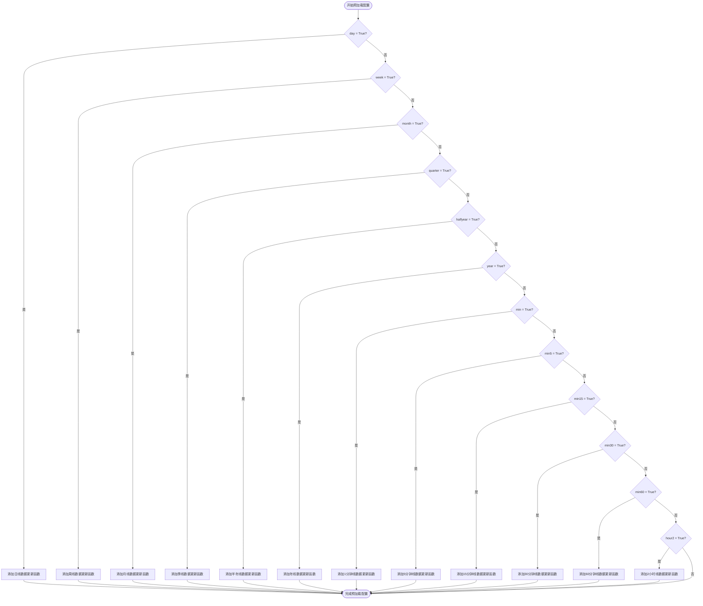
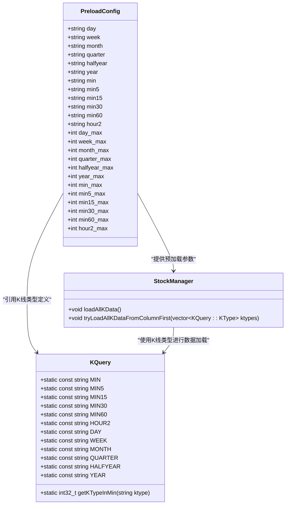
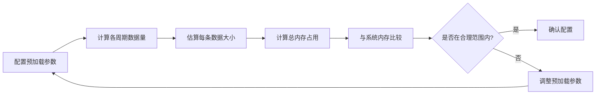
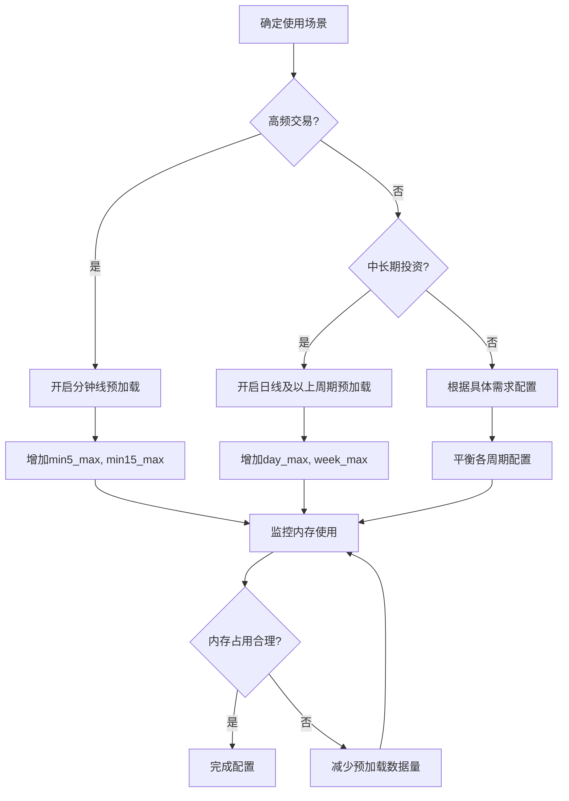

# preload 配置节

<cite>
**本文档引用文件**  
- [hikyuu_linux.ini](file://test_data/hikyuu_linux.ini)
- [hikyuu_win.ini](file://test_data/hikyuu_win.ini)
- [hku_config_template.py](file://hikyuu/data/hku_config_template.py)
- [GlobalSpotAgent.cpp](file://hikyuu_cpp/hikyuu/global/GlobalSpotAgent.cpp)
- [StockManager.cpp](file://hikyuu_cpp/hikyuu/StockManager.cpp)
- [hikyuu.cpp](file://hikyuu_cpp/hikyuu/hikyuu.cpp)
- [KQuery.h](file://hikyuu_cpp/hikyuu/KQuery.h)
- [KQuery.cpp](file://hikyuu_cpp/hikyuu/KQuery.cpp)
</cite>

## 目录
1. [简介](#简介)
2. [预加载配置结构](#预加载配置结构)
3. [K线周期预加载开关](#k线周期预加载开关)
4. [预加载最大数据量限制](#预加载最大数据量限制)
5. [内存使用估算方法](#内存使用估算方法)
6. [性能调优建议](#性能调优建议)
7. [配置示例](#配置示例)

## 简介
`preload` 配置节是Hikyuu量化分析系统中用于控制K线数据内存预加载的核心配置部分。通过该配置，用户可以精确控制不同周期K线数据的预加载行为，平衡数据访问速度与内存占用。本技术文档详细阐述了各K线周期的预加载开关配置、最大数据量限制参数、内存使用估算方法以及性能调优策略，为用户提供全面的配置指导。

## 预加载配置结构
`preload` 配置节位于Hikyuu系统的主配置文件（如 `hikyuu_linux.ini` 或 `hikyuu_win.ini`）中，包含两组主要配置项：

1. **预加载开关**：以布尔值形式存在的配置项，用于控制特定周期K线数据是否进行内存预加载。
2. **最大数据量限制**：以 `_max` 后缀结尾的配置项，用于限制各周期预加载数据的最大数量。

配置文件中的 `preload` 节示例如下：
```ini
[preload]
day = True
week = False
month = False
quarter = False
halfyear = False
year = False
min = False
min5 = False
min15 = False
min30 = False
min60 = False
hour2 = False
day_max = 100000
week_max = 100000
month_max = 100000
quarter_max = 100000
halfyear_max = 100000
year_max = 100000
min_max = 5120
min5_max = 5120
min15_max = 5120
min30_max = 5120
min60_max = 5120
hour2_max = 5120
```

**Section sources**
- [hikyuu_linux.ini](file://test_data/hikyuu_linux.ini#L14-L38)
- [hikyuu_win.ini](file://test_data/hikyuu_win.ini#L14-L38)

## K线周期预加载开关
`preload` 配置节中的预加载开关采用布尔值（True/False）控制，每个开关对应一个特定的K线周期。当开关设置为 `True` 时，系统在启动时会将该周期的K线数据预加载到内存中，从而加快后续的数据访问速度；设置为 `False` 时，则不会预加载该周期数据。

支持的K线周期及其对应的配置项如下：

| K线周期 | 配置项 | 说明 |
| :--- | :--- | :--- |
| 日线 | `day` | 每日交易数据 |
| 周线 | `week` | 每周交易数据 |
| 月线 | `month` | 每月交易数据 |
| 季线 | `quarter` | 每季度交易数据 |
| 半年线 | `halfyear` | 每半年交易数据 |
| 年线 | `year` | 每年交易数据 |
| 1分钟线 | `min` | 每分钟交易数据 |
| 5分钟线 | `min5` | 每5分钟交易数据 |
| 15分钟线 | `min15` | 每15分钟交易数据 |
| 30分钟线 | `min30` | 每30分钟交易数据 |
| 60分钟线 | `min60` | 每60分钟交易数据 |
| 2小时线 | `hour2` | 每2小时交易数据 |

这些开关的配置逻辑在 `GlobalSpotAgent.cpp` 文件中实现，系统根据配置项的布尔值决定是否将相应的数据更新函数添加到处理队列中。



**Diagram sources**
- [GlobalSpotAgent.cpp](file://hikyuu_cpp/hikyuu/global/GlobalSpotAgent.cpp#L194-L240)

**Section sources**
- [GlobalSpotAgent.cpp](file://hikyuu_cpp/hikyuu/global/GlobalSpotAgent.cpp#L194-L240)
- [hikyuu_linux.ini](file://test_data/hikyuu_linux.ini#L15-L26)

## 预加载最大数据量限制
`preload` 配置节中的 `_max` 参数用于限制各周期预加载数据的最大数量，防止内存占用过高。每个K线周期都有一个对应的 `_max` 参数，如 `day_max`、`min5_max` 等。

### 参数作用
- **内存保护**：限制预加载数据量，防止因加载过多数据导致系统内存耗尽。
- **性能优化**：通过限制数据量，确保预加载过程不会过度影响系统性能。
- **资源管理**：帮助用户根据实际需求和系统资源合理分配内存。

### 默认值
根据配置文件模板，各周期的默认最大数据量限制如下：
- 日线及以上周期（day、week、month、quarter、halfyear、year）：100,000条
- 分钟线及小时线（min、min5、min15、min30、min60、hour2）：5,120条

这些默认值在 `hikyuu.cpp` 文件中通过 `config.getInt()` 方法读取，如果配置文件中未指定，则使用默认值4096。



**Diagram sources**
- [hku_config_template.py](file://hikyuu/data/hku_config_template.py#L43-L67)
- [KQuery.h](file://hikyuu_cpp/hikyuu/KQuery.h#L31-L43)
- [StockManager.cpp](file://hikyuu_cpp/hikyuu/StockManager.cpp#L196-L232)

**Section sources**
- [hikyuu_linux.ini](file://test_data/hikyuu_linux.ini#L27-L38)
- [hku_config_template.py](file://hikyuu/data/hku_config_template.py#L56-L67)
- [hikyuu.cpp](file://hikyuu_cpp/hikyuu/hikyuu.cpp#L72-L91)

## 内存使用估算方法
为了合理配置预加载参数，用户需要了解不同配置下的内存使用情况。以下提供一种基于数据结构的内存使用估算方法。

### 数据结构分析
Hikyuu系统中，每条K线数据通常包含以下字段：
- 开盘价（Open）
- 最高价（High）
- 最低价（Low）
- 收盘价（Close）
- 成交量（Volume）
- 成交额（Amount）

假设每个数值字段占用8字节（double类型），则每条K线数据大约占用48字节。

### 内存估算公式
总内存占用 ≈ Σ(各周期预加载数据量 × 每条数据大小)

例如，若配置：
- `day = True`，`day_max = 100000`
- `min5 = True`，`min5_max = 5120`

则内存占用估算为：
(100,000 + 5,120) × 48字节 ≈ 5.05MB

### 实际内存监控
用户可以通过系统提供的内存监控功能或操作系统工具实时监控内存使用情况，以验证估算的准确性。



**Diagram sources**
- [KQuery.cpp](file://hikyuu_cpp/hikyuu/KQuery.cpp#L44-L59)
- [StockManager.cpp](file://hikyuu_cpp/hikyuu/StockManager.cpp#L229-L231)

## 性能调优建议
合理的预加载配置能够显著提升系统性能，同时避免内存资源浪费。以下是基于系统架构和实际使用经验的性能调优建议。

### 根据系统内存大小合理设置
- **内存充足（16GB以上）**：可以适当增加日线及以上周期的预加载数据量，如将 `day_max` 设置为200,000或更高。
- **内存中等（8GB）**：保持默认配置或适当减少分钟线的预加载数据量。
- **内存有限（4GB或以下）**：建议只预加载日线数据，并将 `day_max` 设置为50,000或更低。

### 平衡数据访问速度和内存占用
- **高频交易策略**：需要频繁访问分钟线数据，建议开启 `min5`、`min15` 等周期的预加载，并适当增加其 `_max` 值。
- **中长期投资策略**：主要使用日线及以上周期数据，可以关闭所有分钟线的预加载，专注于日线、周线等周期。
- **回测分析**：在进行大规模回测时，建议根据回测时间范围精确设置 `_max` 值，避免加载不必要的历史数据。

### 动态调整策略
系统支持在运行时动态调整预加载配置。用户可以根据当前任务需求，在程序启动时或运行过程中通过API修改预加载参数，实现资源的最优利用。



**Diagram sources**
- [StockManager.cpp](file://hikyuu_cpp/hikyuu/StockManager.cpp#L196-L259)
- [GlobalSpotAgent.cpp](file://hikyuu_cpp/hikyuu/global/GlobalSpotAgent.cpp#L194-L240)

## 配置示例
以下提供几个典型的预加载配置示例，供用户参考。

### 默认配置
```ini
[preload]
day = True
week = False
month = False
quarter = False
halfyear = False
year = False
min = False
min5 = False
min15 = False
min30 = False
min60 = False
hour2 = False
day_max = 100000
week_max = 100000
month_max = 100000
quarter_max = 100000
halfyear_max = 100000
year_max = 100000
min_max = 5120
min5_max = 5120
min15_max = 5120
min30_max = 5120
min60_max = 5120
hour2_max = 5120
```

### 高频交易配置
```ini
[preload]
day = True
week = True
min5 = True
min15 = True
min30 = True
day_max = 50000
week_max = 5000
min5_max = 10240
min15_max = 6827
min30_max = 3413
```

### 内存受限配置
```ini
[preload]
day = True
day_max = 30000
```

**Section sources**
- [hikyuu_linux.ini](file://test_data/hikyuu_linux.ini#L14-L38)
- [hku_config_template.py](file://hikyuu/data/hku_config_template.py#L43-L67)