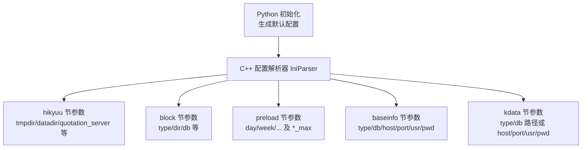
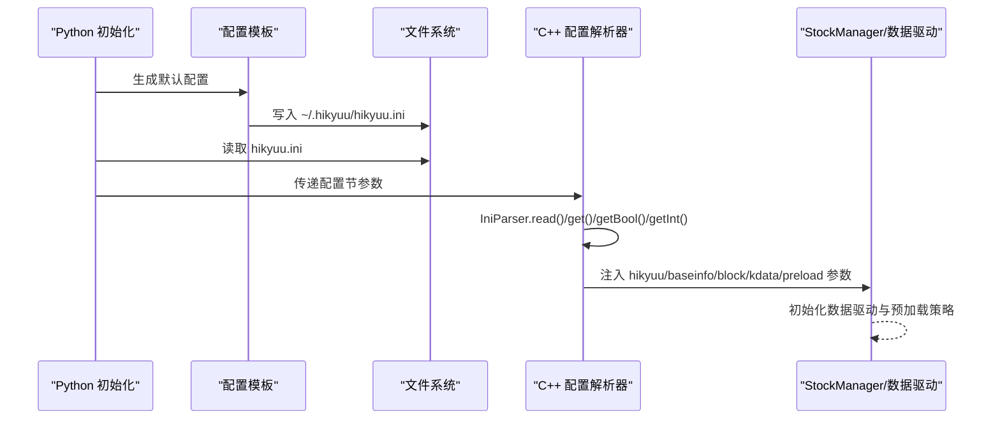
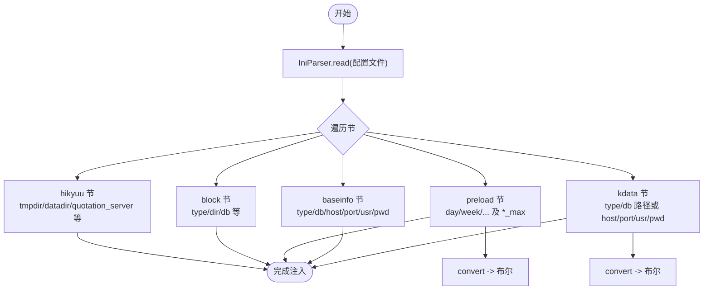
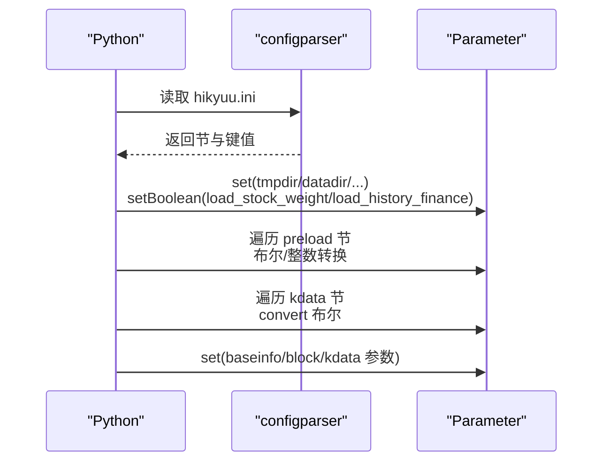
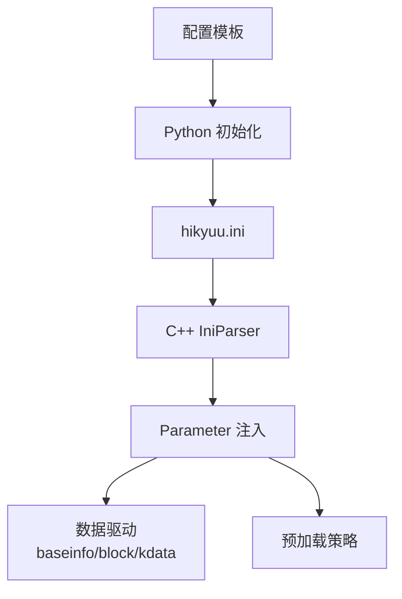

# 主配置文件

<cite>
**本文引用的文件**
- [hikyuu_linux.ini](file://test_data/hikyuu_linux.ini)
- [hikyuu_win.ini](file://test_data/hikyuu_win.ini)
- [hku_config_template.py](file://hikyuu/data/hku_config_template.py)
- [hikyuu.cpp](file://hikyuu_cpp/hikyuu/hikyuu.cpp)
- [IniParser.h](file://hikyuu_cpp/hikyuu/utilities/ini_parser/IniParser.h)
- [IniParser.cpp](file://hikyuu_cpp/hikyuu/utilities/ini_parser/IniParser.cpp)
- [test_iniparser.cpp](file://hikyuu_cpp/unit_test/hikyuu/utilities/test_iniparser.cpp)
- [__init__.py](file://hikyuu/__init__.py)
- [os.cpp](file://hikyuu_cpp/hikyuu/utilities/os.cpp)
- [HikyuuTDX.py](file://hikyuu/gui/HikyuuTDX.py)
- [ImportHistoryFinanceTask.py](file://hikyuu/gui/data/ImportHistoryFinanceTask.py)
- [UsePytdxImportToH5Thread.py](file://hikyuu/gui/data/UsePytdxImportToH5Thread.py)
</cite>

## 目录
1. [简介](#简介)
2. [项目结构与入口](#项目结构与入口)
3. [核心配置节与参数详解](#核心配置节与参数详解)
4. [架构总览](#架构总览)
5. [详细组件分析](#详细组件分析)
6. [依赖关系分析](#依赖关系分析)
7. [性能与安全建议](#性能与安全建议)
8. [故障排查指南](#故障排查指南)
9. [结论](#结论)

## 简介
本文件为 Hikyuu 主配置文件的权威参考，覆盖 Linux 与 Windows 下的配置模板与差异，系统性解析 [hikyuu]、[block]、[preload]、[baseinfo]、[kdata] 等配置节的字段、数据类型、默认值与推荐值，并结合源码说明配置加载流程、路径分隔符差异、数据库连接参数、数据存储路径等。同时提供配置验证方法与常见错误排查指引，帮助用户在不同平台正确部署与优化 Hikyuu 数据与运行环境。

## 项目结构与入口
- 主配置文件样例位于测试数据目录，分别提供 Linux 与 Windows 的示例配置，展示路径分隔符差异与典型参数设置。
- Python 初始化逻辑会检测并生成默认配置文件，随后由 C++ 层读取并注入运行参数。
- C++ 层通过 IniParser 解析配置，按节提取参数并传递给数据驱动与预加载模块。

图表来源
- [hku_config_template.py](file://hikyuu/data/hku_config_template.py#L1-L120)
- [hikyuu.cpp](file://hikyuu_cpp/hikyuu/hikyuu.cpp#L40-L92)
- [__init__.py](file://hikyuu/__init__.py#L260-L339)

章节来源
- [hikyuu_linux.ini](file://test_data/hikyuu_linux.ini#L1-L56)
- [hikyuu_win.ini](file://test_data/hikyuu_win.ini#L1-L56)
- [hku_config_template.py](file://hikyuu/data/hku_config_template.py#L1-L120)
- [hikyuu.cpp](file://hikyuu_cpp/hikyuu/hikyuu.cpp#L40-L92)
- [__init__.py](file://hikyuu/__init__.py#L260-L339)

## 核心配置节与参数详解
以下为各配置节的关键参数说明，含数据类型、默认值与推荐值建议。具体默认值以源码与模板为准。

### [hikyuu] 节
- tmpdir
  - 类型：字符串（路径）
  - 作用：临时目录，用于缓存与中间文件
  - 推荐值：指向可写且磁盘空间充足的目录；Linux 使用正斜杠，Windows 使用双反斜杠或正斜杠
  - 参考路径分隔符差异见“路径分隔符”小节
- datadir
  - 类型：字符串（路径）
  - 作用：数据根目录，用于存放基础数据、板块文件等
  - 推荐值：与 tmpdir 分离，避免 IO 竞争；Linux 使用正斜杠，Windows 使用双反斜杠或正斜杠
- quotation_server
  - 类型：字符串（IPC 地址或网络地址）
  - 作用：实时行情服务地址
  - 默认值：IPC 地址（Linux 常见）
  - 推荐值：根据实际行情服务部署调整
- load_stock_weight
  - 类型：布尔
  - 作用：是否加载权息数据
  - 默认值：True
- load_history_finance
  - 类型：布尔
  - 作用：是否加载历史财务数据
  - 默认值：True
- plugindir
  - 类型：字符串（路径）
  - 作用：插件目录
  - 默认值：用户目录下的 .hikyuu/plugin
- reload_time
  - 类型：字符串（时间格式）
  - 作用：定时重载时间
  - 默认值：00:00

章节来源
- [hikyuu_linux.ini](file://test_data/hikyuu_linux.ini#L1-L5)
- [hikyuu_win.ini](file://test_data/hikyuu_win.ini#L1-L5)
- [hikyuu.cpp](file://hikyuu_cpp/hikyuu/hikyuu.cpp#L40-L60)
- [__init__.py](file://hikyuu/__init__.py#L260-L290)
- [hku_config_template.py](file://hikyuu/data/hku_config_template.py#L25-L40)

### [block] 节
- type
  - 类型：字符串
  - 作用：板块数据来源类型（如 qianlong、mysql、clickhouse）
  - 推荐值：根据数据源选择
- dir
  - 类型：字符串（路径）
  - 作用：板块文件所在目录（当 type 为本地文件时）
  - 推荐值：指向包含板块 ini 文件的目录
- 指数板块、行业板块、地域板块、概念板块、self
  - 类型：字符串（文件名）
  - 作用：映射到具体板块文件名
  - 推荐值：与实际板块文件一致

章节来源
- [hikyuu_linux.ini](file://test_data/hikyuu_linux.ini#L5-L13)
- [hikyuu_win.ini](file://test_data/hikyuu_win.ini#L5-L13)
- [hikyuu.cpp](file://hikyuu_cpp/hikyuu/hikyuu.cpp#L60-L70)
- [__init__.py](file://hikyuu/__init__.py#L288-L292)

### [preload] 节
- day/week/month/quarter/halfyear/year/min/min5/min15/min30/min60/hour2
  - 类型：布尔
  - 作用：是否预加载对应周期的数据
  - 默认值：False（除 day 在模板中为 True）
- day_max/week_max/month_max/quarter_max/halfyear_max/year_max/min_max/min5_max/min15_max/min30_max/min60_max/hour2_max
  - 类型：整数
  - 作用：对应周期的最大预加载条数
  - 默认值：模板中给出较大数值（如 100000 或 5120）

章节来源
- [hikyuu_linux.ini](file://test_data/hikyuu_linux.ini#L14-L39)
- [hikyuu_win.ini](file://test_data/hikyuu_win.ini#L14-L39)
- [hikyuu.cpp](file://hikyuu_cpp/hikyuu/hikyuu.cpp#L80-L92)
- [__init__.py](file://hikyuu/__init__.py#L293-L308)
- [hku_config_template.py](file://hikyuu/data/hku_config_template.py#L43-L92)

### [baseinfo] 节
- type
  - 类型：字符串
  - 作用：基础信息数据源类型（如 sqlite3、mysql、clickhouse）
- db
  - 类型：字符串（路径）
  - 作用：SQLite 数据库文件路径（当 type 为 sqlite3 时）
- host/port/usr/pwd
  - 类型：字符串/整数/字符串
  - 作用：MySQL/ClickHouse 连接参数（当 type 为 mysql/clickhouse 时）

章节来源
- [hikyuu_linux.ini](file://test_data/hikyuu_linux.ini#L40-L43)
- [hikyuu_win.ini](file://test_data/hikyuu_win.ini#L40-L43)
- [hikyuu.cpp](file://hikyuu_cpp/hikyuu/hikyuu.cpp#L60-L70)
- [__init__.py](file://hikyuu/__init__.py#L283-L287)
- [hku_config_template.py](file://hikyuu/data/hku_config_template.py#L94-L148)

### [kdata] 节
- type
  - 类型：字符串
  - 作用：K线数据源类型（如 hdf5、mysql、clickhouse）
- sh_day/sh_min/sh_min5/sz_day/sz_min/sz_min5/sh_time/sz_time/sh_trans/sz_trans
  - 类型：字符串（路径）
  - 作用：HDF5 文件路径（当 type 为 hdf5 时）
- host/port/usr/pwd
  - 类型：字符串/整数/字符串
  - 作用：MySQL/ClickHouse 连接参数（当 type 为 mysql/clickhouse 时）
- convert
  - 类型：布尔
  - 作用：是否启用转换策略（C++ 层单独处理）

章节来源
- [hikyuu_linux.ini](file://test_data/hikyuu_linux.ini#L44-L56)
- [hikyuu_win.ini](file://test_data/hikyuu_win.ini#L44-L56)
- [hikyuu.cpp](file://hikyuu_cpp/hikyuu/hikyuu.cpp#L70-L80)
- [__init__.py](file://hikyuu/__init__.py#L301-L308)
- [hku_config_template.py](file://hikyuu/data/hku_config_template.py#L150-L203)

## 架构总览
下图展示配置文件如何被 Python 与 C++ 两层加载，并注入到运行时参数中，最终驱动数据驱动与预加载模块。

图表来源
- [hku_config_template.py](file://hikyuu/data/hku_config_template.py#L303-L339)
- [__init__.py](file://hikyuu/__init__.py#L260-L339)
- [hikyuu.cpp](file://hikyuu_cpp/hikyuu/hikyuu.cpp#L40-L92)
- [IniParser.cpp](file://hikyuu_cpp/hikyuu/utilities/ini_parser/IniParser.cpp#L56-L139)

## 详细组件分析

### 配置解析与参数注入（C++）
- IniParser 负责读取配置文件，校验格式并提供 get/getBool/getInt 等接口。
- hikyuu.cpp 中按节提取参数，将字符串、布尔、整数等类型注入 Parameter 容器，供后续初始化使用。
- 特殊处理：
  - preload 节对每个周期键进行布尔或整数转换，并拼接 *_max 键。
  - kdata 节对 convert 单独处理为布尔。

图表来源
- [hikyuu.cpp](file://hikyuu_cpp/hikyuu/hikyuu.cpp#L40-L92)
- [IniParser.h](file://hikyuu_cpp/hikyuu/utilities/ini_parser/IniParser.h#L60-L105)
- [IniParser.cpp](file://hikyuu_cpp/hikyuu/utilities/ini_parser/IniParser.cpp#L205-L385)

章节来源
- [hikyuu.cpp](file://hikyuu_cpp/hikyuu/hikyuu.cpp#L40-L92)
- [IniParser.h](file://hikyuu_cpp/hikyuu/utilities/ini_parser/IniParser.h#L60-L105)
- [IniParser.cpp](file://hikyuu_cpp/hikyuu/utilities/ini_parser/IniParser.cpp#L56-L139)

### 配置解析与参数注入（Python）
- Python 层使用 configparser 读取配置，将布尔、整数、字符串等类型转换后注入 Parameter。
- 对 preload 与 kdata 节进行特殊处理：preload 中的周期键转布尔，其他键转整数；kdata 中 convert 转布尔。
- 若未提供某些节或键，则使用默认值或环境变量覆盖。

图表来源
- [__init__.py](file://hikyuu/__init__.py#L260-L339)

章节来源
- [__init__.py](file://hikyuu/__init__.py#L260-L339)

### GUI 导入与数据库连接（参考）
- GUI 导入任务根据配置选择数据库引擎（hdf5/mysql/clickhouse），并构造连接参数。
- 提供连接测试功能，便于验证配置正确性。

章节来源
- [ImportHistoryFinanceTask.py](file://hikyuu/gui/data/ImportHistoryFinanceTask.py#L64-L91)
- [UsePytdxImportToH5Thread.py](file://hikyuu/gui/data/UsePytdxImportToH5Thread.py#L255-L281)
- [HikyuuTDX.py](file://hikyuu/gui/HikyuuTDX.py#L799-L830)

## 依赖关系分析
- 配置文件依赖关系
  - Python 初始化依赖配置模板生成默认配置，随后读取并注入参数。
  - C++ 层依赖 IniParser 解析配置，再注入到数据驱动与 StockManager。
  - 数据驱动（baseinfo、block、kdata）依赖 [baseinfo] 与 [kdata] 的连接参数或路径。
  - 预加载策略依赖 [preload] 的布尔与 *_max 配置。

图表来源
- [hku_config_template.py](file://hikyuu/data/hku_config_template.py#L303-L339)
- [__init__.py](file://hikyuu/__init__.py#L260-L339)
- [hikyuu.cpp](file://hikyuu_cpp/hikyuu/hikyuu.cpp#L40-L92)

章节来源
- [hku_config_template.py](file://hikyuu/data/hku_config_template.py#L303-L339)
- [__init__.py](file://hikyuu/__init__.py#L260-L339)
- [hikyuu.cpp](file://hikyuu_cpp/hikyuu/hikyuu.cpp#L40-L92)

## 性能与安全建议
- 性能优化
  - 合理设置 preload 的周期布尔开关与 *_max 数值，避免一次性加载过多数据导致内存压力。
  - 将 tmpdir 与 datadir 放置在高性能磁盘（如 SSD），并确保磁盘剩余空间充足。
  - 对于大体量数据，优先使用 HDF5 或 ClickHouse，结合合适的索引与分区策略。
- 安全设置
  - 数据库连接参数（host/port/usr/pwd）建议通过环境变量或受控配置管理，避免硬编码在仓库中。
  - 限制插件目录与数据目录的访问权限，防止未授权修改。
  - 使用 IPC 地址时，确保只在可信网络内使用，必要时启用加密通道。
- 路径与兼容性
  - Linux 使用正斜杠，Windows 使用双反斜杠或正斜杠；建议在模板中统一使用正斜杠，以减少跨平台差异带来的问题。
  - 使用相对路径时，注意工作目录的影响；生产环境建议使用绝对路径。

[本节为通用建议，无需特定文件来源]

## 故障排查指南
- 配置文件格式错误
  - 缺少节头、节头缺少闭合括号、键值对缺少 key 或 value、非注释行既不是节也不是键值对等均会导致解析失败。
  - 解决：对照单元测试中的错误场景修正格式；确保每行仅包含注释、空行或合法键值对。
- 选项缺失或类型不匹配
  - 读取不存在的节或选项且未提供默认值时会抛出异常；布尔值仅接受 1/true/yes/on 或 0/false/no/off（不区分大小写）。
  - 解决：为关键选项提供默认值；确认布尔值书写规范。
- 文件不可读
  - 配置文件路径错误或权限不足会导致无法打开文件。
  - 解决：检查路径与权限；在 Linux 上使用正斜杠，Windows 使用双反斜杠或正斜杠。
- 数据库连接失败
  - MySQL/ClickHouse 连接参数错误或网络不通会导致导入与查询失败。
  - 解决：使用 GUI 的连接测试按钮验证；核对 host/port/usr/pwd；确认防火墙与网络策略。
- 预加载过大导致内存溢出
  - 将 preload 的 *_max 调整为更小值，或关闭不必要的周期预加载。
- 路径分隔符差异
  - Linux 与 Windows 的路径分隔符不同，建议在模板中统一使用正斜杠，或在生成配置时按平台自动替换。

章节来源
- [test_iniparser.cpp](file://hikyuu_cpp/unit_test/hikyuu/utilities/test_iniparser.cpp#L1-L47)
- [test_iniparser.cpp](file://hikyuu_cpp/unit_test/hikyuu/utilities/test_iniparser.cpp#L49-L81)
- [test_iniparser.cpp](file://hikyuu_cpp/unit_test/hikyuu/utilities/test_iniparser.cpp#L132-L168)
- [test_iniparser.cpp](file://hikyuu_cpp/unit_test/hikyuu/utilities/test_iniparser.cpp#L216-L240)
- [test_iniparser.cpp](file://hikyuu_cpp/unit_test/hikyuu/utilities/test_iniparser.cpp#L239-L271)
- [IniParser.cpp](file://hikyuu_cpp/hikyuu/utilities/ini_parser/IniParser.cpp#L56-L139)
- [IniParser.cpp](file://hikyuu_cpp/hikyuu/utilities/ini_parser/IniParser.cpp#L232-L263)
- [IniParser.cpp](file://hikyuu_cpp/hikyuu/utilities/ini_parser/IniParser.cpp#L334-L385)
- [HikyuuTDX.py](file://hikyuu/gui/HikyuuTDX.py#L799-L830)

## 结论
- 主配置文件是 Hikyuu 数据与运行环境的核心入口，涵盖临时目录、数据目录、板块、基础信息、K线数据与预加载策略等关键参数。
- Linux 与 Windows 的示例配置展示了路径分隔符差异；模板与 Python 初始化逻辑提供了默认配置生成能力。
- C++ 与 Python 两层解析确保了配置的健壮性与灵活性；单元测试覆盖了常见格式错误与类型转换问题。
- 建议在生产环境中采用绝对路径、合理的预加载策略与受控的数据库连接参数，并定期验证连接与路径有效性。