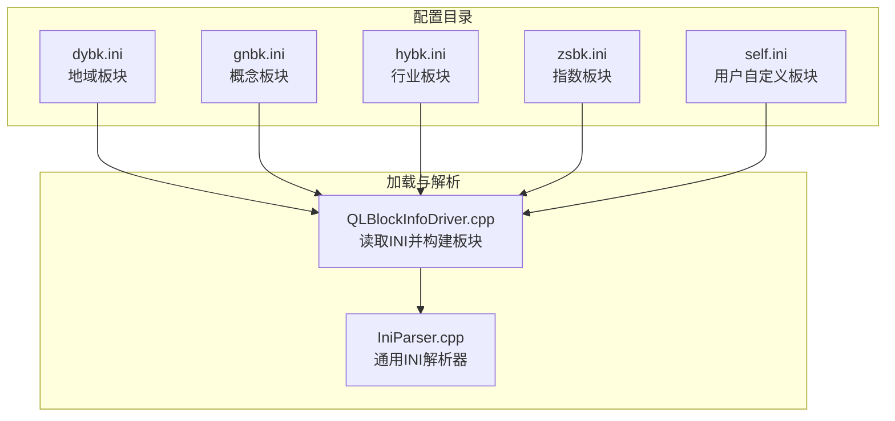
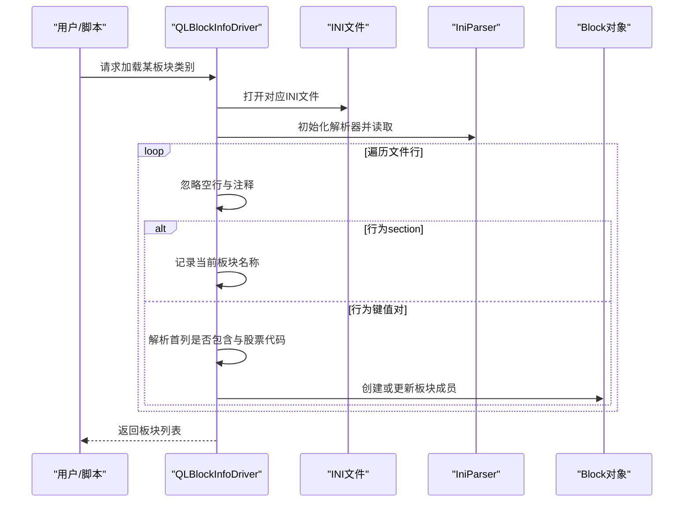
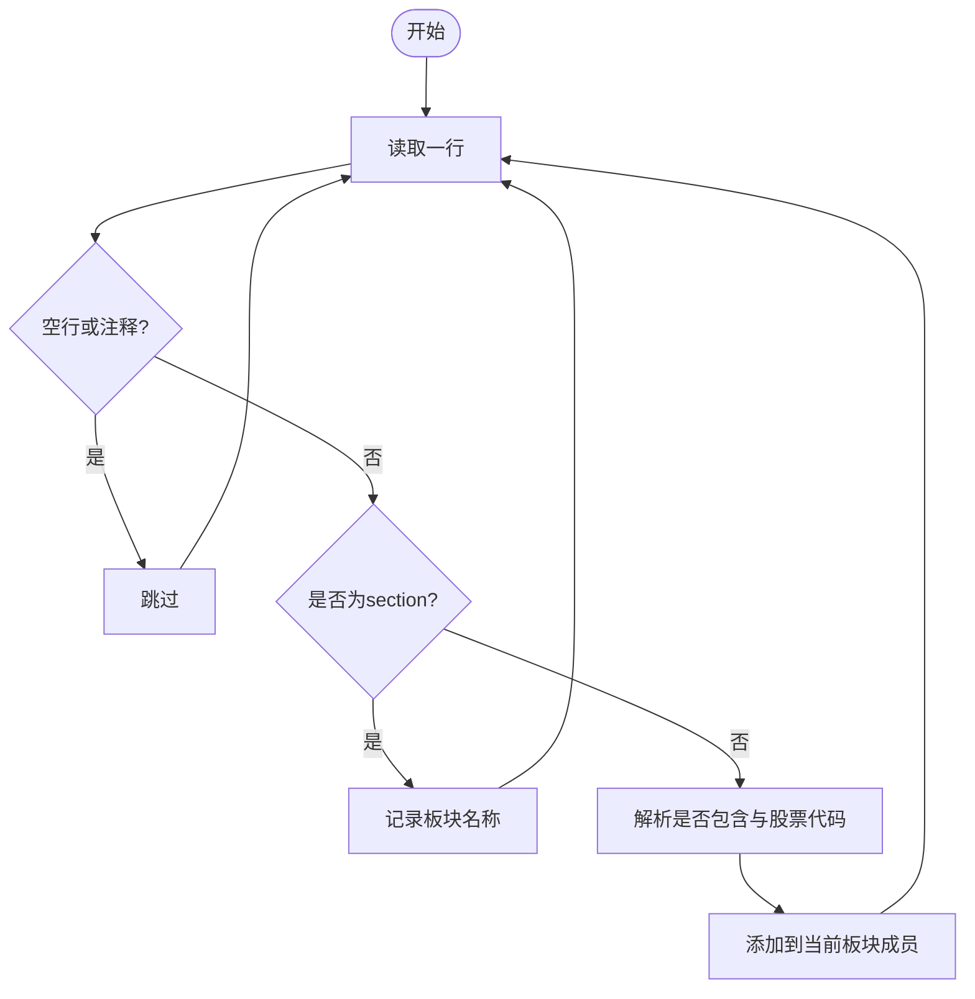
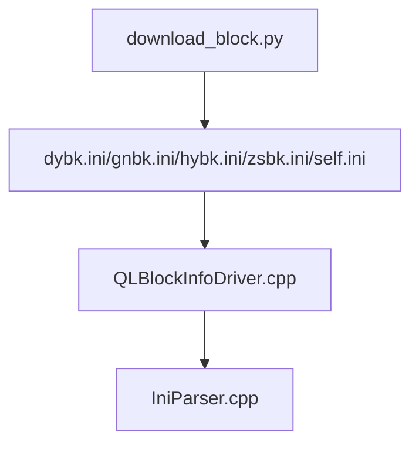

# 行业板块配置文件

<cite>
**本文引用的文件**
- [dybk.ini](file://hikyuu/config/block/dybk.ini)
- [gnbk.ini](file://hikyuu/config/block/gnbk.ini)
- [hybk.ini](file://hikyuu/config/block/hybk.ini)
- [self.ini](file://hikyuu/config/block/self.ini)
- [zsbk.ini](file://hikyuu/config/block/zsbk.ini)
- [QLBlockInfoDriver.cpp](file://hikyuu_cpp/hikyuu/data_driver/block_info/qianlong/QLBlockInfoDriver.cpp)
- [IniParser.cpp](file://hikyuu_cpp/hikyuu/utilities/ini_parser/IniParser.cpp)
- [download_block.py](file://hikyuu/data/download_block.py)
- [common.py](file://hikyuu/data/common.py)
</cite>

## 目录
1. [简介](#简介)
2. [项目结构](#项目结构)
3. [核心组件](#核心组件)
4. [架构总览](#架构总览)
5. [详细组件分析](#详细组件分析)
6. [依赖关系分析](#依赖关系分析)
7. [性能考量](#性能考量)
8. [故障排查指南](#故障排查指南)
9. [结论](#结论)
10. [附录](#附录)

## 简介
本文件面向使用者与开发者，系统性梳理 Hikyuu 项目中的行业板块配置文件，重点解析以下文件的格式与用途：
- dybk.ini：地域板块配置
- gnbk.ini：概念板块配置
- hybk.ini：行业板块配置
- zsbk.ini：指数板块配置
- self.ini：用户自定义板块配置

内容涵盖：
- 每个板块配置文件的命名规则与用途
- 每行数据格式规范（首列是否包含标记，次列为股票代码）
- 支持的股票代码格式（A股、科创板、指数等）
- 如何创建与维护自定义板块配置文件
- 实际配置示例与最佳实践
- 常见配置错误的排查方法

## 项目结构
板块配置文件位于配置目录中，按板块类型进行分类：
- 地域板块：dybk.ini
- 概念板块：gnbk.ini
- 行业板块：hybk.ini
- 指数板块：zsbk.ini
- 用户自定义板块：self.ini

图表来源
- [QLBlockInfoDriver.cpp](file://hikyuu_cpp/hikyuu/data_driver/block_info/qianlong/QLBlockInfoDriver.cpp#L92-L205)
- [IniParser.cpp](file://hikyuu_cpp/hikyuu/utilities/ini_parser/IniParser.cpp#L62-L107)

章节来源
- [dybk.ini](file://hikyuu/config/block/dybk.ini#L1-L200)
- [gnbk.ini](file://hikyuu/config/block/gnbk.ini#L1-L200)
- [hybk.ini](file://hikyuu/config/block/hybk.ini#L1-L200)
- [zsbk.ini](file://hikyuu/config/block/zsbk.ini#L1-L200)
- [self.ini](file://hikyuu/config/block/self.ini#L1-L10)

## 核心组件
- 板块驱动（QLBlockInfoDriver）：负责从 INI 文件读取板块配置，构建 Block 对象集合。
- INI 解析器（IniParser）：提供通用的 INI 文件读取与校验能力，支持注释、section、键值等。
- 数据下载工具（download_block.py）：提供从网络抓取板块成分并生成文本文件的能力，便于转换为 INI 格式。
- 市场与类型常量（common.py）：定义市场与证券类型，辅助识别股票代码归属。

章节来源
- [QLBlockInfoDriver.cpp](file://hikyuu_cpp/hikyuu/data_driver/block_info/qianlong/QLBlockInfoDriver.cpp#L92-L205)
- [IniParser.cpp](file://hikyuu_cpp/hikyuu/utilities/ini_parser/IniParser.cpp#L62-L107)
- [download_block.py](file://hikyuu/data/download_block.py#L1-L123)
- [common.py](file://hikyuu/data/common.py#L33-L90)

## 架构总览
板块配置文件通过驱动程序被加载，驱动程序逐行解析 INI 文件，遇到 section 表示一个新的板块；section 下的每一行表示一个板块成员。首列标识是否包含（1 表示包含，0 表示不包含），次列为股票代码。

图表来源
- [QLBlockInfoDriver.cpp](file://hikyuu_cpp/hikyuu/data_driver/block_info/qianlong/QLBlockInfoDriver.cpp#L92-L205)
- [IniParser.cpp](file://hikyuu_cpp/hikyuu/utilities/ini_parser/IniParser.cpp#L62-L107)

## 详细组件分析

### dybk.ini（地域板块）
- 用途：定义地域类板块（如“广东板块”等）的成员列表。
- 文件结构：以 section 表示板块名称，section 下的每一行为一个成员；首列 1/0 表示是否包含，次列为股票代码。
- 示例片段（节选）：
  - [dybk.ini](file://hikyuu/config/block/dybk.ini#L1-L200)

章节来源
- [dybk.ini](file://hikyuu/config/block/dybk.ini#L1-L200)

### gnbk.ini（概念板块）
- 用途：定义概念类板块（如“昨日连板”、“MicroLED”、“裸眼3D”等）的成员列表。
- 文件结构：与地域板块一致，section 表示板块名称，行格式为是否包含 + 股票代码。
- 示例片段（节选）：
  - [gnbk.ini](file://hikyuu/config/block/gnbk.ini#L1-L200)

章节来源
- [gnbk.ini](file://hikyuu/config/block/gnbk.ini#L1-L200)

### hybk.ini（行业板块）
- 用途：定义行业类板块（如“光学光电子”、“游戏”、“消费电子”等）的成员列表。
- 文件结构：与前述一致，section 表示板块名称，行格式为是否包含 + 股票代码。
- 示例片段（节选）：
  - [hybk.ini](file://hikyuu/config/block/hybk.ini#L1-L200)

章节来源
- [hybk.ini](file://hikyuu/config/block/hybk.ini#L1-L200)

### zsbk.ini（指数板块）
- 用途：定义指数成分板块（如“上证指数”等）的成员列表。
- 文件结构：与前述一致，section 表示板块名称，行格式为是否包含 + 股票代码。
- 示例片段（节选）：
  - [zsbk.ini](file://hikyuu/config/block/zsbk.ini#L1-L200)

章节来源
- [zsbk.ini](file://hikyuu/config/block/zsbk.ini#L1-L200)

### self.ini（用户自定义板块）
- 用途：用户自定义的板块，可用于快速筛选策略标的。
- 文件结构：首行为板块编号（例如“1”），其后每行格式为是否包含 + 股票代码，代码后可跟随注释（以分号分隔）。
- 示例片段（节选）：
  - [self.ini](file://hikyuu/config/block/self.ini#L1-L10)

章节来源
- [self.ini](file://hikyuu/config/block/self.ini#L1-L10)

### INI 文件通用解析流程
- 注释与空行：以分号开头的行视为注释，空行被忽略。
- section：形如 “[板块名称]” 的行表示新板块开始。
- 成员行：形如 “是否包含,股票代码”的行表示该板块成员。
- 是否包含：1 表示包含，0 表示不包含。
- 股票代码：支持多种市场与类型的代码（A股、科创板、指数等）。

图表来源
- [IniParser.cpp](file://hikyuu_cpp/hikyuu/utilities/ini_parser/IniParser.cpp#L62-L107)
- [QLBlockInfoDriver.cpp](file://hikyuu_cpp/hikyuu/data_driver/block_info/qianlong/QLBlockInfoDriver.cpp#L92-L134)

章节来源
- [IniParser.cpp](file://hikyuu_cpp/hikyuu/utilities/ini_parser/IniParser.cpp#L62-L107)
- [QLBlockInfoDriver.cpp](file://hikyuu_cpp/hikyuu/data_driver/block_info/qianlong/QLBlockInfoDriver.cpp#L92-L134)

### 股票代码格式与支持范围
- 支持的市场与类型：
  - A股、B股、创业板、科创板、北交所A股、指数等。
- 代码来源与清洗：
  - 数据下载脚本会清洗并标准化股票代码，确保与系统内部一致。
- 类型常量参考：
  - 市场与类型枚举定义，便于识别与过滤。

章节来源
- [common.py](file://hikyuu/data/common.py#L33-L90)
- [download_block.py](file://hikyuu/data/download_block.py#L1-L123)

## 依赖关系分析
- 板块驱动依赖 INI 解析器进行文件读取与校验。
- 自定义板块（self.ini）与标准板块（dybk.ini/gnbk.ini/hybk.ini/zsbk.ini）共享相同的解析逻辑。
- 数据下载工具可将网络抓取的板块成分转换为文本文件，便于进一步整理为 INI 格式。

图表来源
- [QLBlockInfoDriver.cpp](file://hikyuu_cpp/hikyuu/data_driver/block_info/qianlong/QLBlockInfoDriver.cpp#L92-L205)
- [IniParser.cpp](file://hikyuu_cpp/hikyuu/utilities/ini_parser/IniParser.cpp#L62-L107)
- [download_block.py](file://hikyuu/data/download_block.py#L1-L123)

章节来源
- [QLBlockInfoDriver.cpp](file://hikyuu_cpp/hikyuu/data_driver/block_info/qianlong/QLBlockInfoDriver.cpp#L92-L205)
- [IniParser.cpp](file://hikyuu_cpp/hikyuu/utilities/ini_parser/IniParser.cpp#L62-L107)
- [download_block.py](file://hikyuu/data/download_block.py#L1-L123)

## 性能考量
- 文件规模：部分板块文件较大（如 gnbk.ini 达数万行），建议按需加载与缓存。
- 解析效率：驱动程序逐行读取并解析，注意避免重复打开与解析同一文件。
- 数据来源：优先使用本地 INI 文件，减少网络请求；若需更新，可使用下载脚本批量生成。

## 故障排查指南
- 常见错误类型
  - INI 文件格式错误：缺少 section、缺少键值、注释符位置不当等。
  - 未找到板块类别：驱动参数中未正确设置类别映射。
  - 无法打开文件：路径或权限问题。
- 排查步骤
  - 检查 INI 文件语法：确认 section 行格式正确，键值对格式正确，注释符使用规范。
  - 校验板块类别参数：确保驱动参数中包含正确的类别与文件路径映射。
  - 验证文件可读性：确认文件存在且具备读取权限。
  - 使用下载工具生成样本：参考下载脚本生成文本文件，再转换为 INI 格式，验证解析流程。

章节来源
- [IniParser.cpp](file://hikyuu_cpp/hikyuu/utilities/ini_parser/IniParser.cpp#L49-L81)
- [QLBlockInfoDriver.cpp](file://hikyuu_cpp/hikyuu/data_driver/block_info/qianlong/QLBlockInfoDriver.cpp#L92-L134)

## 结论
- 板块配置文件采用统一的 INI 格式，首列标识是否包含，次列为股票代码，section 表示板块名称。
- 支持多类型板块（地域、概念、行业、指数、自定义），满足不同场景的策略筛选需求。
- 建议遵循统一格式与命名规范，结合下载工具与解析器，高效维护与更新板块配置。

## 附录

### 配置示例与最佳实践
- 示例片段
  - 地域板块示例：[dybk.ini](file://hikyuu/config/block/dybk.ini#L1-L200)
  - 概念板块示例：[gnbk.ini](file://hikyuu/config/block/gnbk.ini#L1-L200)
  - 行业板块示例：[hybk.ini](file://hikyuu/config/block/hybk.ini#L1-L200)
  - 指数板块示例：[zsbk.ini](file://hikyuu/config/block/zsbk.ini#L1-L200)
  - 自定义板块示例：[self.ini](file://hikyuu/config/block/self.ini#L1-L10)
- 最佳实践
  - 统一命名：板块名称使用中文，避免特殊字符。
  - 规范格式：严格遵守“是否包含,股票代码”的格式，注释使用分号。
  - 分类管理：按板块类型分别存放，便于维护与查找。
  - 定期更新：使用下载工具定期抓取最新成分，保持数据时效性。

### 常见配置错误与修复
- 错误：section 行格式不正确（缺少右方括号）
  - 现象：解析失败或抛出逻辑异常
  - 修复：补齐方括号，确保 section 行完整
- 错误：键值对缺少键或值
  - 现象：解析失败
  - 修复：补齐键与值，或删除无效行
- 错误：注释符位置不当
  - 现象：注释未生效或解析异常
  - 修复：将注释符置于行首，或移除多余字符
- 错误：未找到板块类别
  - 现象：驱动提示缺少参数或找不到类别
  - 修复：检查驱动参数中类别与文件路径映射是否正确

章节来源
- [IniParser.cpp](file://hikyuu_cpp/hikyuu/utilities/ini_parser/IniParser.cpp#L49-L81)
- [QLBlockInfoDriver.cpp](file://hikyuu_cpp/hikyuu/data_driver/block_info/qianlong/QLBlockInfoDriver.cpp#L92-L134)