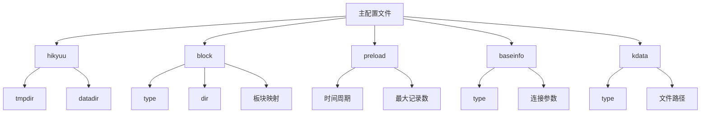

# 配置文件详解

<cite>
**本文档引用的文件**   
- [hikyuu_linux.ini](file://test_data/hikyuu_linux.ini)
- [hikyuu_win.ini](file://test_data/hikyuu_win.ini)
- [dybk.ini](file://hikyuu/config/block/dybk.ini)
- [gnbk.ini](file://hikyuu/config/block/gnbk.ini)
- [hybk.ini](file://hikyuu/config/block/hybk.ini)
- [self.ini](file://hikyuu/config/block/self.ini)
- [zsbk.ini](file://hikyuu/config/block/zsbk.ini)
- [hku_config_template.py](file://hikyuu/data/hku_config_template.py)
- [IniParser.h](file://hikyuu_cpp/hikyuu/utilities/ini_parser/IniParser.h)
- [IniParser.cpp](file://hikyuu_cpp/hikyuu/utilities/ini_parser/IniParser.cpp)
</cite>

## 目录
1. [主配置文件结构](#主配置文件结构)
2. [数据库连接配置](#数据库连接配置)
3. [数据存储路径配置](#数据存储路径配置)
4. [预加载设置](#预加载设置)
5. [行业板块配置文件](#行业板块配置文件)
6. [配置最佳实践](#配置最佳实践)
7. [配置验证与故障排查](#配置验证与故障排查)

## 主配置文件结构

Hikyuu系统提供了两个主配置文件：`hikyuu_linux.ini`和`hikyuu_win.ini`，分别用于Linux和Windows系统。这两个配置文件的结构和内容基本相同，主要区别在于路径分隔符的使用（Linux使用`/`，Windows使用`\`）。

主配置文件包含以下几个主要部分：
- `[hikyuu]`：系统基本配置
- `[block]`：板块数据配置
- `[preload]`：数据预加载配置
- `[baseinfo]`：基础信息数据源配置
- `[kdata]`：K线数据源配置



**图源**
- [hikyuu_linux.ini](file://test_data/hikyuu_linux.ini)
- [hikyuu_win.ini](file://test_data/hikyuu_win.ini)

**节源**
- [hikyuu_linux.ini](file://test_data/hikyuu_linux.ini#L1-L56)
- [hikyuu_win.ini](file://test_data/hikyuu_win.ini#L1-L56)

## 数据库连接配置

Hikyuu支持多种数据库类型作为数据存储后端，包括MySQL、SQLite和ClickHouse。数据库连接配置分布在配置文件的不同部分，根据数据类型进行区分。

### MySQL连接配置

当配置文件中相关部分的`type`设置为`mysql`时，系统将使用MySQL作为数据源。连接参数包括：

- `host`：数据库服务器地址
- `port`：数据库端口
- `usr`：用户名
- `pwd`：密码

```ini
[block]
type = mysql
host = 127.0.0.1
port = 3306
usr = root
pwd = password

[baseinfo]
type = mysql
host = 127.0.0.1
port = 3306
usr = root
pwd = password

[kdata]
type = mysql
host = 127.0.0.1
port = 3306
usr = root
pwd = password
```

### ClickHouse连接配置

当`type`设置为`clickhouse`时，系统将使用ClickHouse作为数据源。连接参数与MySQL类似：

- `host`：服务器地址
- `port`：TCP端口
- `http_port`：HTTP端口（在GUI配置中）
- `usr`：用户名
- `pwd`：密码

```ini
[block]
type = clickhouse
host = 127.0.0.1
port = 9000
usr = default
pwd = 

[baseinfo]
type = clickhouse
host = 127.0.0.1
port = 9000
usr = default
pwd = 

[kdata]
type = clickhouse
host = 127.0.0.1
port = 9000
usr = default
pwd = 
```

### SQLite配置

SQLite是一种文件型数据库，配置相对简单，只需要指定数据库文件路径：

```ini
[block]
type = sqlite3
db = ./test_data/stock.db

[baseinfo]
type = sqlite3
db = ./test_data/stock.db
```

**节源**
- [hikyuu_linux.ini](file://test_data/hikyuu_linux.ini#L40-L43)
- [hku_config_template.py](file://hikyuu/data/hku_config_template.py#L101-L148)

## 数据存储路径配置

数据存储路径配置主要在`[hikyuu]`和`[kdata]`部分定义，用于指定系统运行时文件和数据文件的存储位置。

### 临时目录和数据目录

在`[hikyuu]`部分中：
- `tmpdir`：指定临时文件目录，用于存储运行时生成的临时文件
- `datadir`：指定主数据目录，其他数据文件的相对路径都基于此目录

```ini
[hikyuu]
tmpdir = ./test_data/tmp
datadir = ./test_data
```

### K线数据文件路径

在`[kdata]`部分中，当`type`设置为`hdf5`时，需要指定各个市场和周期的K线数据文件路径：

- `sh_day`：上证日线数据文件
- `sh_min`：上证1分钟线数据文件
- `sh_min5`：上证5分钟线数据文件
- `sz_day`：深证日线数据文件
- `sz_min`：深证1分钟线数据文件
- `sz_min5`：深证5分钟线数据文件
- `sh_time`：上证分时数据文件
- `sz_time`：深证分时数据文件
- `sh_trans`：上证逐笔成交数据文件
- `sz_trans`：深证逐笔成交数据文件

```ini
[kdata]
type = hdf5
sh_day = ./test_data/sh_day.h5
sh_min = ./test_data/sh_1min.h5
sh_min5 = ./test_data/sh_5min.h5
sz_day = ./test_data/sz_day.h5
sz_min = ./test_data/sz_1min.h5
sz_min5 = ./test_data/sz_5min.h5
sh_time = ./test_data/sh_time.h5
sz_time = ./test_data/sz_time.h5
sh_trans = ./test_data/sh_trans.h5
sz_trans = ./test_data/sz_trans.h5
```

**节源**
- [hikyuu_linux.ini](file://test_data/hikyuu_linux.ini#L1-L56)

## 预加载设置

预加载设置在`[preload]`部分中定义，用于控制系统启动时预加载哪些周期的K线数据以及最大加载记录数。

### 预加载周期配置

系统支持以下周期的预加载：
- `day`：日线
- `week`：周线
- `month`：月线
- `quarter`：季线
- `halfyear`：半年线
- `year`：年线
- `min`：1分钟线
- `min5`：5分钟线
- `min15`：15分钟线
- `min30`：30分钟线
- `min60`：60分钟线
- `hour2`：2小时线

```ini
[preload]
day = True
week = False
month = False
quarter = False
halfyear = False
year = False
min = False
min5 = False
min15 = False
min30 = False
min60 = False
hour2 = False
```

### 最大记录数配置

每个周期都有对应的最大记录数限制，防止内存占用过多：
- `day_max`：日线最大记录数
- `week_max`：周线最大记录数
- `month_max`：月线最大记录数
- `quarter_max`：季线最大记录数
- `halfyear_max`：半年线最大记录数
- `year_max`：年线最大记录数
- `min_max`：1分钟线最大记录数
- `min5_max`：5分钟线最大记录数
- `min15_max`：15分钟线最大记录数
- `min30_max`：30分钟线最大记录数
- `min60_max`：60分钟线最大记录数
- `hour2_max`：2小时线最大记录数

```ini
[preload]
day_max = 100000
week_max = 100000
month_max = 100000
quarter_max = 100000
halfyear_max = 100000
year_max = 100000
min_max = 5120
min5_max = 5120
min15_max = 5120
min30_max = 5120
min60_max = 5120
hour2_max = 5120
```

**节源**
- [hikyuu_linux.ini](file://test_data/hikyuu_linux.ini#L14-L38)

## 行业板块配置文件

行业板块配置文件位于`hikyuu/config/block/`目录下，用于定义各种股票板块及其包含的股票。这些文件采用特定的INI格式，每个文件包含一个或多个板块定义。

### 板块文件格式

每个板块配置文件包含一个或多个板块，每个板块以方括号`[]`包围的板块名称开始，后跟该板块包含的股票列表。

股票列表的每一行格式为：
```
市场代码,股票代码
```

其中：
- 市场代码：0表示沪市，1表示深市
- 股票代码：6位数字股票代码

```ini
[广东板块]
1,873001
1,300269
1,300812
0,688609
1,831167
```

### 主要板块配置文件

#### 地域板块 (dybk.ini)

`dybk.ini`文件定义了按地域划分的股票板块，如"广东板块"、"浙江板块"等。

```ini
[广东板块]
1,873001
1,300269
...
```

#### 概念板块 (gnbk.ini)

`gnbk.ini`文件定义了按概念划分的股票板块，如"MicroLED"、"元宇宙概念"等。

```ini
[MicroLED]
1,300269
1,300323
...
```

#### 行业板块 (hybk.ini)

`hybk.ini`文件定义了按行业划分的股票板块，如"光学光电子"、"游戏"、"消费电子"等。

```ini
[光学光电子]
1,873001
1,300232
...
```

#### 自定义板块 (self.ini)

`self.ini`文件用于定义用户自定义的股票板块，用户可以在此文件中创建自己的投资组合或关注列表。

```ini
[1]
1, 000728 ;国元证券
1, 002685 ;华东重机
...
```

#### 指数板块 (zsbk.ini)

`zsbk.ini`文件定义了各种指数成分股，如"上证指数"等。

```ini
[上证指数]
0,600000
0,600004
...
```

### 板块配置在主配置文件中的映射

在主配置文件中，`[block]`部分定义了各种板块类型与具体配置文件的映射关系：

```ini
[block]
type  = qianlong
dir = ./test_data/block
指数板块 = zsbk.ini
行业板块 = hybk.ini
地域板块 = dybk.ini
概念板块 = gnbk.ini
self = self.ini
```

**节源**
- [dybk.ini](file://hikyuu/config/block/dybk.ini)
- [gnbk.ini](file://hikyuu/config/block/gnbk.ini)
- [hybk.ini](file://hikyuu/config/block/hybk.ini)
- [self.ini](file://hikyuu/config/block/self.ini)
- [zsbk.ini](file://hikyuu/config/block/zsbk.ini)

## 配置最佳实践

### 安全设置

1. **数据库密码保护**：避免在配置文件中明文存储数据库密码，特别是在共享或版本控制的环境中。可以考虑使用环境变量或外部密钥管理服务。

2. **文件权限设置**：确保配置文件具有适当的文件权限，防止未授权访问。在Linux系统中，可以使用`chmod 600 hikyuu.ini`命令限制只有文件所有者可以读写。

3. **敏感信息分离**：将敏感的连接信息（如数据库密码）放在单独的配置文件中，并确保该文件不在版本控制系统中。

### 性能优化建议

1. **合理设置预加载**：根据实际使用需求配置预加载设置。如果主要进行日线级别的分析，可以只启用`day = True`，关闭其他周期的预加载，以减少内存占用和启动时间。

2. **调整最大记录数**：根据系统内存情况和分析需求调整各周期的最大记录数。对于高频交易分析，可以增加分钟线的最大记录数；对于长期投资分析，可以增加日线以上周期的最大记录数。

3. **选择合适的数据库**：
   - 对于小规模数据和简单部署，SQLite是轻量级的选择
   - 对于大规模数据和高性能需求，ClickHouse提供优秀的查询性能
   - 对于需要复杂事务处理的场景，MySQL是可靠的选择

4. **数据目录位置**：将数据目录放在高速存储设备（如SSD）上，可以显著提高数据读写性能。

5. **定期维护**：定期检查和清理过期或不再需要的数据文件，保持系统性能。

## 配置验证与故障排查

### 配置文件格式验证

Hikyuu使用自定义的INI文件解析器，对配置文件格式有严格要求：

1. **必须有section头**：每个配置项必须位于一个section内，以`[section_name]`格式定义。
2. **正确的键值对格式**：键值对必须使用等号`=`分隔，如`key = value`。
3. **避免重复的section**：虽然系统允许，但建议不要在不同位置定义相同的section，以免造成混淆。
4. **注释格式**：使用分号`;`作为行注释符号，注释可以放在行尾或单独一行。

### 常见配置错误及排查

1. **文件无法读取**：
   - 检查文件路径是否正确
   - 检查文件权限是否允许读取
   - 确认文件编码为UTF-8

2. **数据库连接失败**：
   - 检查数据库服务是否正在运行
   - 验证连接参数（host、port、usr、pwd）是否正确
   - 确认数据库用户具有足够的权限

3. **数据路径错误**：
   - 检查路径分隔符是否与操作系统匹配（Linux用`/`，Windows用`\`）
   - 确认指定的目录存在且有读写权限
   - 检查HDF5文件是否存在且格式正确

4. **板块文件加载失败**：
   - 确认`[block]`部分的`dir`参数指向正确的目录
   - 检查板块文件名与映射关系是否匹配
   - 验证板块文件格式是否正确

5. **性能问题**：
   - 检查预加载设置是否过于激进，导致内存占用过高
   - 确认数据存储位置是否在高速存储设备上
   - 考虑升级到性能更好的数据库后端

通过遵循这些最佳实践和故障排查指南，可以确保Hikyuu系统的配置正确、安全且高效。

**节源**
- [hku_config_template.py](file://hikyuu/data/hku_config_template.py)
- [IniParser.h](file://hikyuu_cpp/hikyuu/utilities/ini_parser/IniParser.h)
- [IniParser.cpp](file://hikyuu_cpp/hikyuu/utilities/ini_parser/IniParser.cpp)