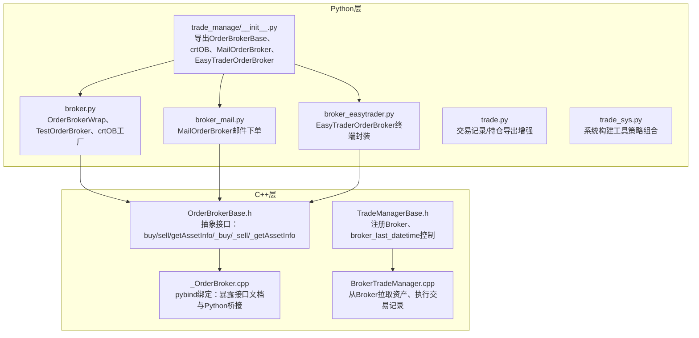
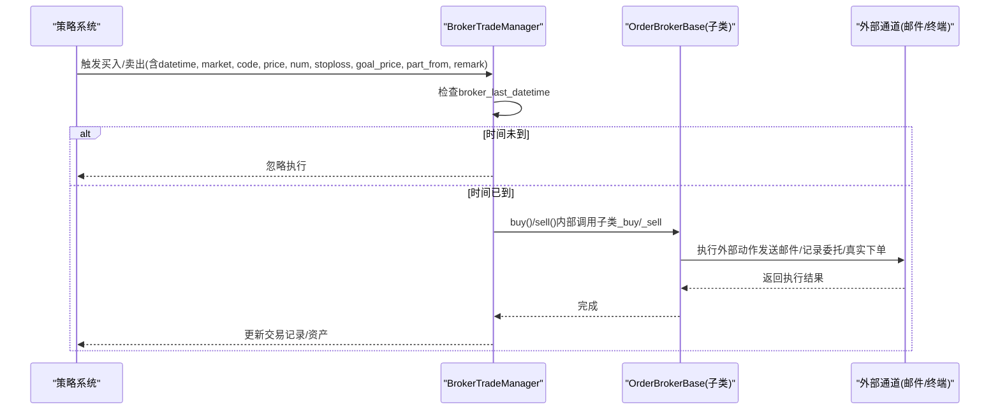
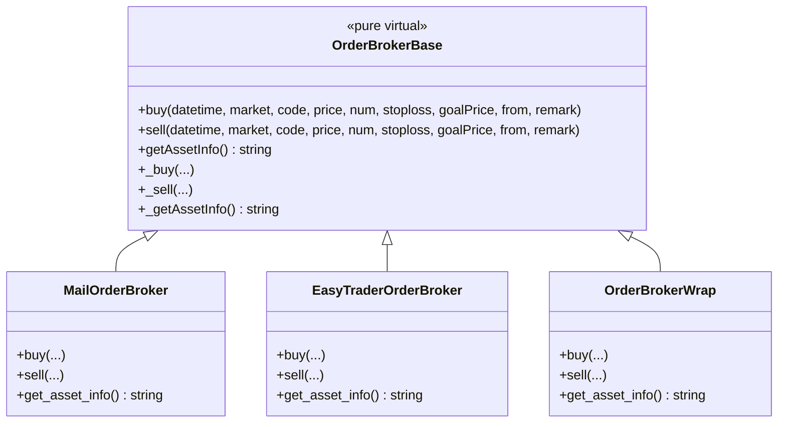
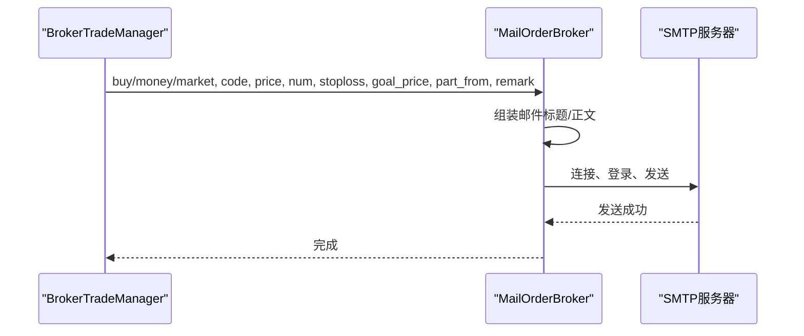
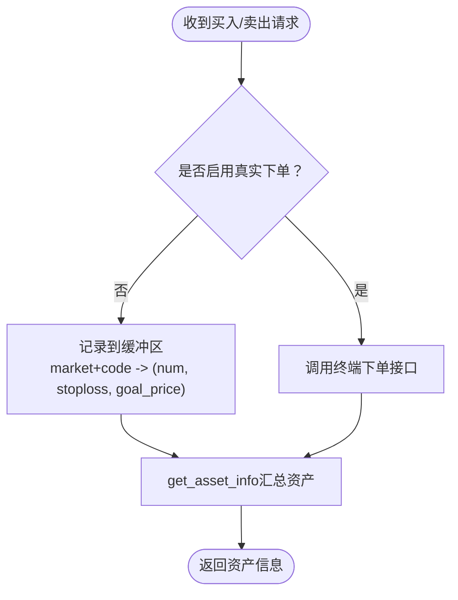
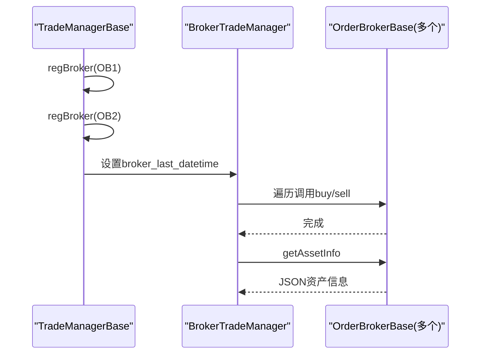
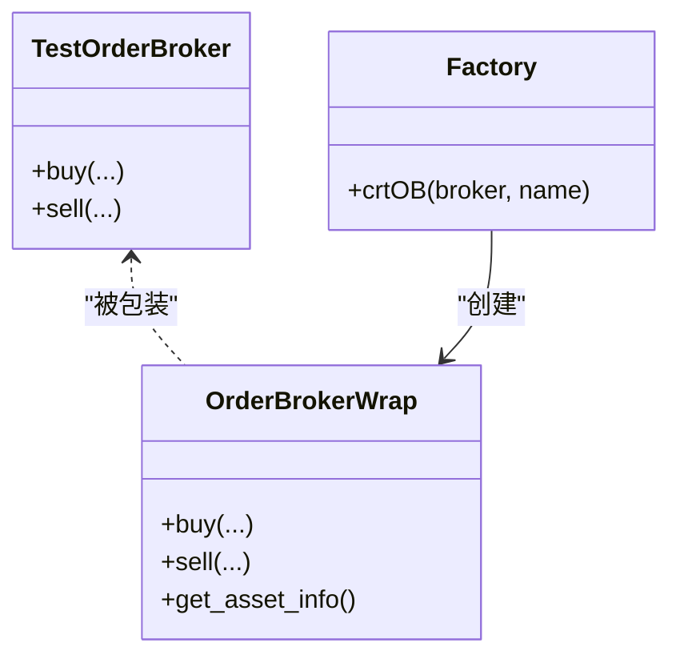
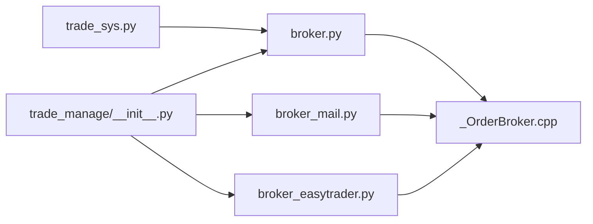

# 实盘交易集成

<cite>
**本文引用的文件**
- [broker.py](file://hikyuu/trade_manage/broker.py)
- [broker_easytrader.py](file://hikyuu/trade_manage/broker_easytrader.py)
- [broker_mail.py](file://hikyuu/trade_manage/broker_mail.py)
- [trade.py](file://hikyuu/trade_manage/trade.py)
- [OrderBrokerBase.h](file://hikyuu_cpp/hikyuu/trade_manage/OrderBrokerBase.h)
- [_OrderBroker.cpp](file://hikyuu_pywrap/trade_manage/_OrderBroker.cpp)
- [TradeManagerBase.h](file://hikyuu_cpp/hikyuu/trade_manage/TradeManagerBase.h)
- [BrokerTradeManager.cpp](file://hikyuu_cpp/hikyuu/strategy/BrokerTradeManager.cpp)
- [trade_sys.py](file://hikyuu/trade_sys/trade_sys.py)
- [__init__.py](file://hikyuu/trade_manage/__init__.py)
- [006-TradeManager.ipynb](file://hikyuu/examples/notebook/006-TradeManager.ipynb)
</cite>

## 目录
1. [引言](#引言)
2. [项目结构](#项目结构)
3. [核心组件](#核心组件)
4. [架构总览](#架构总览)
5. [详细组件分析](#详细组件分析)
6. [依赖关系分析](#依赖关系分析)
7. [性能考量](#性能考量)
8. [故障排查指南](#故障排查指南)
9. [结论](#结论)
10. [附录](#附录)

## 引言
本文件面向希望在Hikyuu框架中集成实盘交易的开发者，系统性阐述Broker抽象层的设计原理与职责边界，详解通用接口规范，以及两种典型实盘通道的对接方式：基于第三方交易终端的自动化下单（通过EasyTrader封装），以及基于邮件指令的人工审核下单模式。同时提供自定义Broker的步骤与最佳实践，帮助安全扩展新的交易通道。

## 项目结构
围绕实盘交易集成的关键模块分布于Python侧的trade_manage包与C++侧的trade_manage/strategy层，配合pybind绑定导出到Python，形成统一的Broker抽象与交易执行链路。

图表来源
- [__init__.py](file://hikyuu/trade_manage/__init__.py#L1-L30)
- [broker.py](file://hikyuu/trade_manage/broker.py#L1-L96)
- [broker_mail.py](file://hikyuu/trade_manage/broker_mail.py#L1-L102)
- [broker_easytrader.py](file://hikyuu/trade_manage/broker_easytrader.py#L1-L64)
- [trade.py](file://hikyuu/trade_manage/trade.py#L1-L55)
- [trade_sys.py](file://hikyuu/trade_sys/trade_sys.py#L1-L300)
- [OrderBrokerBase.h](file://hikyuu_cpp/hikyuu/trade_manage/OrderBrokerBase.h#L1-L215)
- [_OrderBroker.cpp](file://hikyuu_pywrap/trade_manage/_OrderBroker.cpp#L1-L118)
- [TradeManagerBase.h](file://hikyuu_cpp/hikyuu/trade_manage/TradeManagerBase.h#L162-L196)
- [BrokerTradeManager.cpp](file://hikyuu_cpp/hikyuu/strategy/BrokerTradeManager.cpp#L1-L47)

章节来源
- [__init__.py](file://hikyuu/trade_manage/__init__.py#L1-L30)
- [trade_sys.py](file://hikyuu/trade_sys/trade_sys.py#L1-L300)

## 核心组件
- Broker抽象层（OrderBrokerBase）
  - 定义统一的买入/卖出/资产查询接口，子类必须实现纯虚接口。
  - 提供异常捕获与日志输出，保证上层调用稳定。
- 订单代理包装（OrderBrokerWrap）
  - 将任意具备buy/sell签名的类包装为OrderBrokerBase，便于复用与扩展。
- 测试代理（TestOrderBroker）
  - 仅打印交易指令，用于演示与联调。
- 邮件代理（MailOrderBroker）
  - 通过SMTP发送邮件，作为人工审核与确认的通道。
- EasyTrader代理（EasyTraderOrderBroker）
  - 以缓冲区记录计划委托，便于与外部交易终端交互；默认屏蔽真实下单，防止误操作。
- 交易管理器（TradeManagerBase/BrokerTradeManager）
  - 注册多个Broker，按时间阈值broker_last_datetime控制实际执行时机，避免历史回测时提前下单。

章节来源
- [OrderBrokerBase.h](file://hikyuu_cpp/hikyuu/trade_manage/OrderBrokerBase.h#L36-L118)
- [_OrderBroker.cpp](file://hikyuu_pywrap/trade_manage/_OrderBroker.cpp#L1-L35)
- [broker.py](file://hikyuu/trade_manage/broker.py#L37-L96)
- [broker_mail.py](file://hikyuu/trade_manage/broker_mail.py#L37-L102)
- [broker_easytrader.py](file://hikyuu/trade_manage/broker_easytrader.py#L10-L64)
- [TradeManagerBase.h](file://hikyuu_cpp/hikyuu/trade_manage/TradeManagerBase.h#L162-L196)
- [BrokerTradeManager.cpp](file://hikyuu_cpp/hikyuu/strategy/BrokerTradeManager.cpp#L1-L47)

## 架构总览
Broker抽象层位于C++层，通过pybind绑定暴露给Python；Python侧提供多种Broker实现，统一由交易管理器注册并调度。交易管理器在执行买入/卖出时，会调用已注册的Broker，但通过broker_last_datetime参数控制实际执行窗口，避免历史回测阶段提前下单。

图表来源
- [OrderBrokerBase.h](file://hikyuu_cpp/hikyuu/trade_manage/OrderBrokerBase.h#L64-L118)
- [_OrderBroker.cpp](file://hikyuu_pywrap/trade_manage/_OrderBroker.cpp#L58-L118)
- [TradeManagerBase.h](file://hikyuu_cpp/hikyuu/trade_manage/TradeManagerBase.h#L162-L196)
- [BrokerTradeManager.cpp](file://hikyuu_cpp/hikyuu/strategy/BrokerTradeManager.cpp#L1-L47)

## 详细组件分析

### Broker抽象层设计与接口规范
- 接口职责
  - buy/sell：执行买入/卖出，参数包含时间戳、市场、代码、价格、数量、止损、目标价、信号来源、备注。
  - getAssetInfo：返回当前资产信息的JSON字符串，包含datetime、cash、positions数组。
  - 子类接口：_buy/_sell/_getAssetInfo，必须由具体Broker实现。
- 异常处理
  - 抽象层在调用子类接口时捕获异常并记录日志，避免上层崩溃。
- Python绑定
  - 通过pybind导出接口文档与名称，便于在Python侧使用。

图表来源
- [OrderBrokerBase.h](file://hikyuu_cpp/hikyuu/trade_manage/OrderBrokerBase.h#L64-L154)
- [_OrderBroker.cpp](file://hikyuu_pywrap/trade_manage/_OrderBroker.cpp#L58-L118)
- [broker.py](file://hikyuu/trade_manage/broker.py#L37-L96)
- [broker_mail.py](file://hikyuu/trade_manage/broker_mail.py#L37-L102)
- [broker_easytrader.py](file://hikyuu/trade_manage/broker_easytrader.py#L10-L64)

章节来源
- [OrderBrokerBase.h](file://hikyuu_cpp/hikyuu/trade_manage/OrderBrokerBase.h#L36-L118)
- [_OrderBroker.cpp](file://hikyuu_pywrap/trade_manage/_OrderBroker.cpp#L58-L118)

### 邮件指令Broker（broker_mail.py）
- 设计要点
  - 通过SMTP发送邮件，邮件标题与正文遵循固定格式，便于人工审阅与二次确认。
  - 买入/卖出分别触发不同主题与内容，便于区分。
- 执行流程
  - buy/sell被调用时，构造邮件内容并发送；发送成功后Broker完成一次外部动作。
- 安全建议
  - 严格配置SMTP账号密码与收件人列表，避免泄露。
  - 结合broker_last_datetime，仅在实盘阶段开启邮件通道。

图表来源
- [broker_mail.py](file://hikyuu/trade_manage/broker_mail.py#L57-L102)

章节来源
- [broker_mail.py](file://hikyuu/trade_manage/broker_mail.py#L37-L102)

### EasyTrader终端Broker（broker_easytrader.py）
- 设计要点
  - 以缓冲区记录计划委托，避免误操作；默认屏蔽真实下单，需按需启用。
  - 资产查询接口整合可用资金与持仓，兼容不同市场的字段映射。
- 执行流程
  - buy/sell更新缓冲区；get_asset_info汇总可用余额、持仓、止损/目标价等。
- 适配建议
  - 根据具体交易终端的API调整字段映射与下单逻辑，保持与OrderBrokerBase接口一致。

图表来源
- [broker_easytrader.py](file://hikyuu/trade_manage/broker_easytrader.py#L10-L64)

章节来源
- [broker_easytrader.py](file://hikyuu/trade_manage/broker_easytrader.py#L10-L64)

### 交易管理器与Broker注册（TradeManagerBase/BrokerTradeManager）
- 注册机制
  - 通过regBroker注册多个Broker，支持同时输出邮件、记录委托等动作。
- 时间控制
  - broker_last_datetime用于限定实际执行窗口，避免历史回测阶段提前下单。
- 资产同步
  - BrokerTradeManager可从Broker拉取资产信息，用于初始化或同步账户状态。

图表来源
- [TradeManagerBase.h](file://hikyuu_cpp/hikyuu/trade_manage/TradeManagerBase.h#L162-L196)
- [BrokerTradeManager.cpp](file://hikyuu_cpp/hikyuu/strategy/BrokerTradeManager.cpp#L1-L47)
- [_OrderBroker.cpp](file://hikyuu_pywrap/trade_manage/_OrderBroker.cpp#L58-L118)

章节来源
- [TradeManagerBase.h](file://hikyuu_cpp/hikyuu/trade_manage/TradeManagerBase.h#L162-L196)
- [BrokerTradeManager.cpp](file://hikyuu_cpp/hikyuu/strategy/BrokerTradeManager.cpp#L1-L47)

### Python侧包装与工厂（broker.py）
- OrderBrokerWrap
  - 将任意具备buy/sell签名的类包装为OrderBrokerBase，便于快速接入。
- TestOrderBroker
  - 仅打印，适合联调与演示。
- crtOB工厂
  - 快速生成OrderBrokerWrap实例，简化调用。

图表来源
- [broker.py](file://hikyuu/trade_manage/broker.py#L37-L96)

章节来源
- [broker.py](file://hikyuu/trade_manage/broker.py#L37-L96)

### 示例与使用（006-TradeManager.ipynb）
- 注册测试Broker并设置broker_last_datetime，演示策略驱动的买入/卖出打印行为。
- 展示了如何通过crtOB/TestOrderBroker实现“实盘”打印，便于理解Broker接口与执行链路。

章节来源
- [006-TradeManager.ipynb](file://hikyuu/examples/notebook/006-TradeManager.ipynb#L416-L466)

## 依赖关系分析
- Python层导出
  - trade_manage/__init__.py集中导出OrderBrokerBase、crtOB、MailOrderBroker、EasyTraderOrderBroker，便于上层直接使用。
- C++层绑定
  - _OrderBroker.cpp将C++抽象接口绑定到Python，提供接口文档与名称访问。
- 策略系统工具
  - trade_sys.py提供快速创建策略组件的工具，便于组合Broker与系统部件。

图表来源
- [__init__.py](file://hikyuu/trade_manage/__init__.py#L1-L30)
- [_OrderBroker.cpp](file://hikyuu_pywrap/trade_manage/_OrderBroker.cpp#L58-L118)
- [trade_sys.py](file://hikyuu/trade_sys/trade_sys.py#L1-L300)

章节来源
- [__init__.py](file://hikyuu/trade_manage/__init__.py#L1-L30)
- [_OrderBroker.cpp](file://hikyuu_pywrap/trade_manage/_OrderBroker.cpp#L58-L118)
- [trade_sys.py](file://hikyuu/trade_sys/trade_sys.py#L1-L300)

## 性能考量
- Broker执行开销
  - 邮件通道涉及网络I/O，建议批量或限流发送，避免高频交易导致阻塞。
  - 终端通道涉及API调用与网络延迟，建议在Broker内部做必要的重试与幂等处理。
- 资产同步频率
  - get_asset_info调用不宜过于频繁，建议结合业务周期或缓存策略降低调用次数。
- 回测与实盘分离
  - 通过broker_last_datetime严格控制实盘执行窗口，避免历史数据驱动的提前下单。

## 故障排查指南
- 订单未执行
  - 检查broker_last_datetime是否已到达；确认策略触发时间与该阈值的关系。
- 邮件未送达
  - 核对SMTP主机、端口、账号、密码与收件人列表；检查网络连通性与防火墙策略。
- 资产信息为空
  - Broker.getAssetInfo返回空字符串时，BrokerTradeManager会重置账户状态；检查Broker实现与外部终端连接。
- 异常日志
  - 抽象层在调用子类接口时捕获异常并记录日志，可通过日志定位具体问题。

章节来源
- [OrderBrokerBase.h](file://hikyuu_cpp/hikyuu/trade_manage/OrderBrokerBase.h#L64-L118)
- [BrokerTradeManager.cpp](file://hikyuu_cpp/hikyuu/strategy/BrokerTradeManager.cpp#L1-L47)

## 结论
Broker抽象层通过统一接口与严格的执行控制，为实盘交易提供了清晰、可扩展的集成路径。邮件与终端两种通道满足不同场景下的安全与自动化需求。通过包装器与工厂方法，开发者可以快速接入新通道，同时借助时间阈值与资产同步机制，确保实盘执行的安全与稳健。

## 附录

### 自定义Broker实现步骤与最佳实践
- 步骤
  1. 继承OrderBrokerBase，实现_buy/_sell/_getAssetInfo。
  2. 在Python侧使用crtOB包装，或直接在C++侧注册到TradeManager。
  3. 设置broker_last_datetime，确保仅在实盘阶段生效。
  4. 在Broker内实现幂等与重试策略，避免重复下单或失败不恢复。
- 最佳实践
  - 明确资产信息格式（datetime、cash、positions），便于BrokerTradeManager正确解析。
  - 对外设/网络调用增加超时与异常处理，避免阻塞主流程。
  - 保留调试开关（如EasyTrader默认屏蔽真实下单），上线前再启用。
  - 与策略系统解耦，通过接口契约而非具体实现耦合。

章节来源
- [OrderBrokerBase.h](file://hikyuu_cpp/hikyuu/trade_manage/OrderBrokerBase.h#L64-L154)
- [broker.py](file://hikyuu/trade_manage/broker.py#L37-L96)
- [TradeManagerBase.h](file://hikyuu_cpp/hikyuu/trade_manage/TradeManagerBase.h#L162-L196)