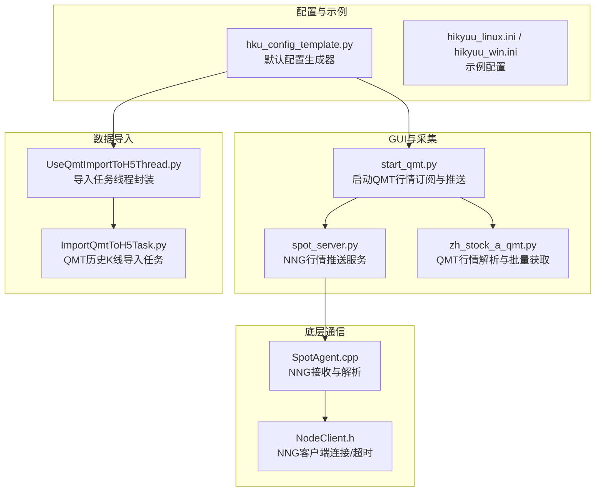
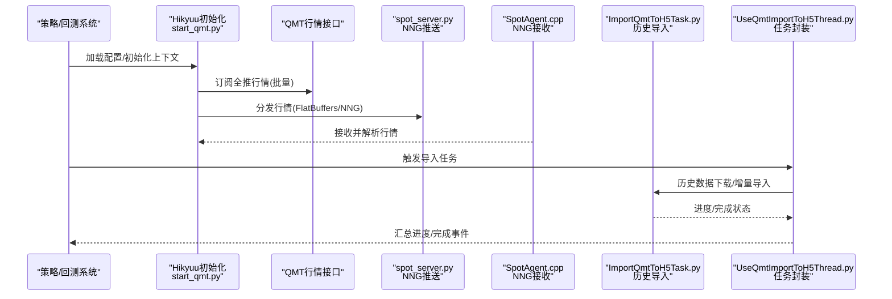
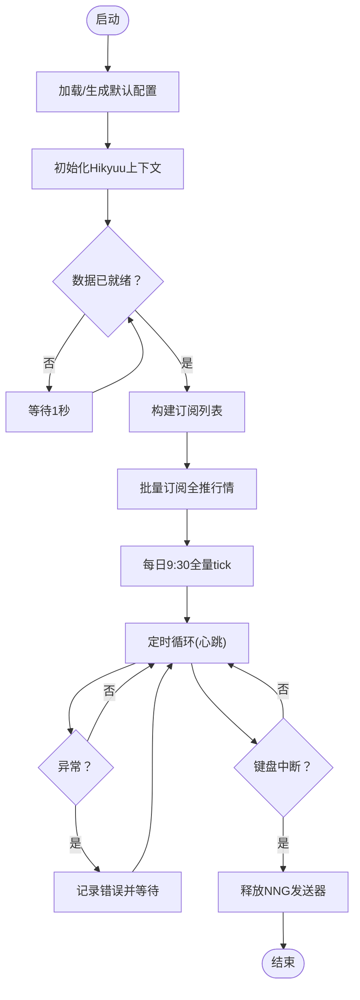
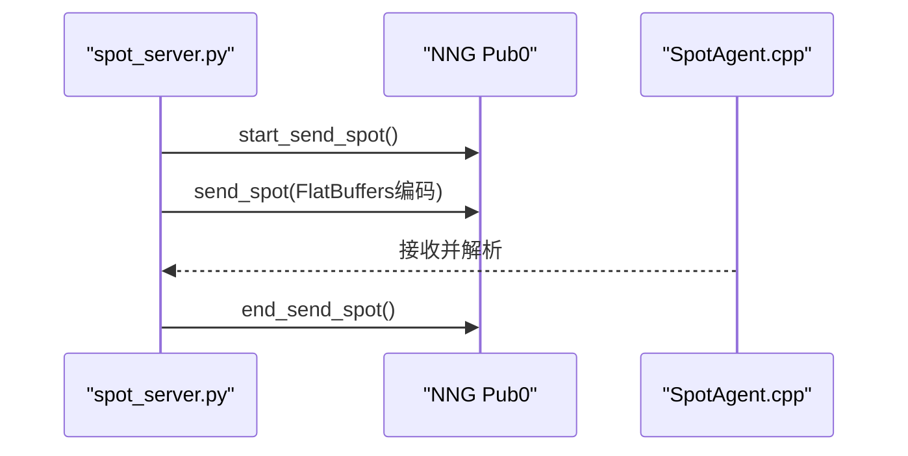
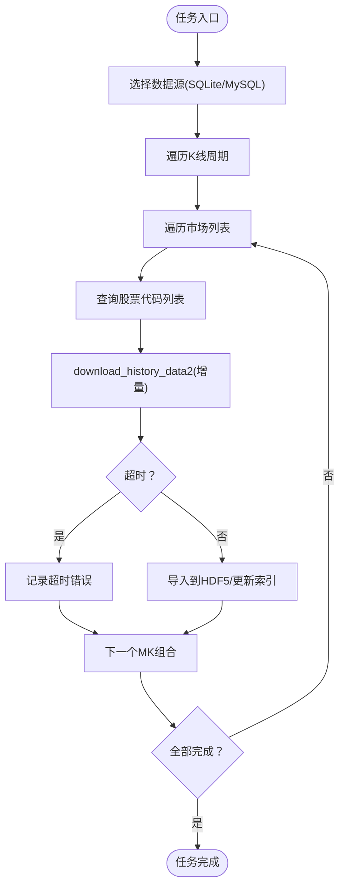
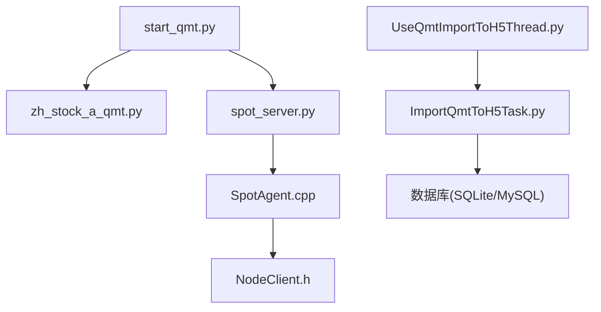

# QMT实盘部署

<cite>
**本文引用的文件列表**
- [start_qmt.py](file://hikyuu/gui/start_qmt.py)
- [zh_stock_a_qmt.py](file://hikyuu/fetcher/stock/zh_stock_a_qmt.py)
- [spot_server.py](file://hikyuu/gui/spot_server.py)
- [ImportQmtToH5Task.py](file://hikyuu/gui/data/ImportQmtToH5Task.py)
- [UseQmtImportToH5Thread.py](file://hikyuu/gui/data/UseQmtImportToH5Thread.py)
- [hku_config_template.py](file://hikyuu/data/hku_config_template.py)
- [hikyuu_linux.ini](file://test_data/hikyuu_linux.ini)
- [hikyuu_win.ini](file://test_data/hikyuu_win.ini)
- [SpotAgent.cpp](file://hikyuu_cpp/hikyuu/global/agent/SpotAgent.cpp)
- [NodeClient.h](file://hikyuu_cpp/hikyuu/utilities/node/NodeClient.h)
- [mylog.py](file://hikyuu/util/mylog.py)
- [check.py](file://hikyuu/util/check.py)
- [Dockerfile_miniconda](file://docker/Dockerfile_miniconda)
- [Dockerfile_dev](file://docker/Dockerfile_dev)
</cite>

## 目录
1. [简介](#简介)
2. [项目结构](#项目结构)
3. [核心组件](#核心组件)
4. [架构总览](#架构总览)
5. [详细组件分析](#详细组件分析)
6. [依赖关系分析](#依赖关系分析)
7. [性能考量](#性能考量)
8. [故障排查指南](#故障排查指南)
9. [结论](#结论)
10. [附录](#附录)

## 简介
本指南面向在迅投量化平台（QMT）上进行实盘部署的用户，围绕以下目标展开：
- 解析并说明 start_qmt.py 的执行流程：环境变量与配置加载、交易接口初始化、会话连接、认证与心跳机制。
- 说明 ImportQmtToH5Task.py 与 UseQmtImportToH5Thread.py 在实时数据导入与行情同步中的职责与协作。
- 提供完整的配置文件示例与最佳实践。
- 提供常见问题（如连接超时、订阅失败、许可证缺失等）的排查方法与解决方案。
- 阐述从策略开发到 QMT 实盘部署的完整工作流。

## 项目结构
与 QMT 实盘部署直接相关的模块主要位于 hikyuu/gui 与 hikyuu/data 下，涉及 GUI 启动脚本、行情采集与分发、数据导入任务与线程封装、配置模板与示例配置等。

图表来源
- [start_qmt.py](file://hikyuu/gui/start_qmt.py#L1-L140)
- [spot_server.py](file://hikyuu/gui/spot_server.py#L1-L327)
- [zh_stock_a_qmt.py](file://hikyuu/fetcher/stock/zh_stock_a_qmt.py#L1-L58)
- [UseQmtImportToH5Thread.py](file://hikyuu/gui/data/UseQmtImportToH5Thread.py#L1-L318)
- [ImportQmtToH5Task.py](file://hikyuu/gui/data/ImportQmtToH5Task.py#L1-L210)
- [hku_config_template.py](file://hikyuu/data/hku_config_template.py#L1-L339)
- [hikyuu_linux.ini](file://test_data/hikyuu_linux.ini#L1-L56)
- [hikyuu_win.ini](file://test_data/hikyuu_win.ini#L1-L56)
- [SpotAgent.cpp](file://hikyuu_cpp/hikyuu/global/agent/SpotAgent.cpp#L204-L248)
- [NodeClient.h](file://hikyuu_cpp/hikyuu/utilities/node/NodeClient.h#L53-L94)

章节来源
- [start_qmt.py](file://hikyuu/gui/start_qmt.py#L1-L140)
- [spot_server.py](file://hikyuu/gui/spot_server.py#L1-L327)
- [zh_stock_a_qmt.py](file://hikyuu/fetcher/stock/zh_stock_a_qmt.py#L1-L58)
- [UseQmtImportToH5Thread.py](file://hikyuu/gui/data/UseQmtImportToH5Thread.py#L1-L318)
- [ImportQmtToH5Task.py](file://hikyuu/gui/data/ImportQmtToH5Task.py#L1-L210)
- [hku_config_template.py](file://hikyuu/data/hku_config_template.py#L1-L339)
- [hikyuu_linux.ini](file://test_data/hikyuu_linux.ini#L1-L56)
- [hikyuu_win.ini](file://test_data/hikyuu_win.ini#L1-L56)
- [SpotAgent.cpp](file://hikyuu_cpp/hikyuu/global/agent/SpotAgent.cpp#L204-L248)
- [NodeClient.h](file://hikyuu_cpp/hikyuu/utilities/node/NodeClient.h#L53-L94)

## 核心组件
- start_qmt.py：负责加载 Hikyuu 配置、初始化上下文、等待数据就绪、批量订阅全推行情、定时拉取全量快照、并通过内部 NNG 推送服务分发行情。
- zh_stock_a_qmt.py：封装 QMT 行情解析与批量获取，将 QMT tick 数据转换为内部统一的 spot 数据格式。
- spot_server.py：提供 NNG Pub0 推送服务，支持 IPC 与 TCP，负责将 FlatBuffers 编码的 spot 数据广播给订阅者；同时提供 QMT 或 QQ 来源的数据采集入口。
- ImportQmtToH5Task.py：基于 xtquant 的历史数据下载与增量导入，将 QMT 数据写入 HDF5 导入器。
- UseQmtImportToH5Thread.py：多进程封装导入任务，协调数据库初始化、代码表导入、权重/财务/板块等辅助数据导入，并汇总进度消息。
- hku_config_template.py：生成默认 hikyuu.ini 与 importdata-gui.ini，定义数据目录、行情服务器地址、预加载策略等。
- SpotAgent.cpp 与 NodeClient.h：底层 NNG 客户端/服务端连接、超时与重连策略，保障行情接收稳定性。

章节来源
- [start_qmt.py](file://hikyuu/gui/start_qmt.py#L1-L140)
- [zh_stock_a_qmt.py](file://hikyuu/fetcher/stock/zh_stock_a_qmt.py#L1-L58)
- [spot_server.py](file://hikyuu/gui/spot_server.py#L1-L327)
- [ImportQmtToH5Task.py](file://hikyuu/gui/data/ImportQmtToH5Task.py#L1-L210)
- [UseQmtImportToH5Thread.py](file://hikyuu/gui/data/UseQmtImportToH5Thread.py#L1-L318)
- [hku_config_template.py](file://hikyuu/data/hku_config_template.py#L1-L339)
- [SpotAgent.cpp](file://hikyuu_cpp/hikyuu/global/agent/SpotAgent.cpp#L204-L248)
- [NodeClient.h](file://hikyuu_cpp/hikyuu/utilities/node/NodeClient.h#L53-L94)

## 架构总览
下图展示从策略或回测系统到 QMT 实盘的端到端路径：策略侧通过 Hikyuu 初始化与上下文配置，start_qmt.py 订阅 QMT 全推行情并推送至 NNG；SpotAgent 作为订阅端接收并解析；ImportQmtToH5Task/UseQmtImportToH5Thread 负责历史数据导入与增量同步。

图表来源
- [start_qmt.py](file://hikyuu/gui/start_qmt.py#L89-L139)
- [spot_server.py](file://hikyuu/gui/spot_server.py#L207-L226)
- [zh_stock_a_qmt.py](file://hikyuu/fetcher/stock/zh_stock_a_qmt.py#L42-L58)
- [ImportQmtToH5Task.py](file://hikyuu/gui/data/ImportQmtToH5Task.py#L144-L194)
- [UseQmtImportToH5Thread.py](file://hikyuu/gui/data/UseQmtImportToH5Thread.py#L234-L316)
- [SpotAgent.cpp](file://hikyuu_cpp/hikyuu/global/agent/SpotAgent.cpp#L220-L248)

## 详细组件分析

### start_qmt.py 执行流程与要点
- 配置加载与初始化
  - 自动生成默认 hikyuu.ini（含数据目录、quotation_server、预加载等），若不存在则创建。
  - 读取 hikyuu.ini 中 hikyuu/baseinfo/kdata 等段落，构造参数并初始化 Hikyuu 上下文。
- 数据就绪等待
  - 等待数据准备完成标志，确保首次 tick 订阅前所有证券均已就绪。
- QMT 订阅与心跳
  - 生成全市场股票列表，按批大小批量订阅全推行情；对每批订阅结果进行校验。
  - 每日 9:30 主动拉取全量 tick，触发内部快照推送，确保当日首个分钟线生成。
  - 使用定时器循环，处理异常与优雅退出。
- 资源释放
  - 退出时释放 NNG 发送器，避免资源泄漏。

图表来源
- [start_qmt.py](file://hikyuu/gui/start_qmt.py#L22-L139)

章节来源
- [start_qmt.py](file://hikyuu/gui/start_qmt.py#L1-L140)

### zh_stock_a_qmt.py：QMT 行情解析与批量获取
- parse_one_result_qmt：将 QMT tick 数据映射为内部统一字段（时间戳、开盘/最高/最低/最新价、成交量/成交额、买卖盘口等），并处理时间戳转换。
- get_spot：根据股票列表批量获取全量 tick，调用解析函数并可选回调批量推送。

章节来源
- [zh_stock_a_qmt.py](file://hikyuu/fetcher/stock/zh_stock_a_qmt.py#L1-L58)

### spot_server.py：NNG 推送与采集入口
- NNG 发送器管理：IPC 与 TCP 两种监听地址，支持并发安全的获取与释放。
- FlatBuffers 编码：将一组 spot 记录编码为二进制消息，统一主题前缀。
- 采集入口：支持 QMT 与 QQ 两种数据源，按时间段与周期计算下次采集时间，循环推送。

图表来源
- [spot_server.py](file://hikyuu/gui/spot_server.py#L168-L216)
- [SpotAgent.cpp](file://hikyuu_cpp/hikyuu/global/agent/SpotAgent.cpp#L220-L248)

章节来源
- [spot_server.py](file://hikyuu/gui/spot_server.py#L1-L327)
- [SpotAgent.cpp](file://hikyuu_cpp/hikyuu/global/agent/SpotAgent.cpp#L204-L248)

### ImportQmtToH5Task.py：QMT 历史K线导入
- 进度回调：通过 ProgressBar 实时上报已完成/总数，驱动 GUI 进度显示。
- 数据源选择：优先使用 SQLite（HDF5）或 MySQL，按配置切换。
- 周期映射：将 K 线周期映射为 QMT 支持的周期字符串。
- 增量导入：先下载增量，再调用 KDataToHdf5Importer 写入，必要时更新指数索引。

图表来源
- [ImportQmtToH5Task.py](file://hikyuu/gui/data/ImportQmtToH5Task.py#L86-L194)

章节来源
- [ImportQmtToH5Task.py](file://hikyuu/gui/data/ImportQmtToH5Task.py#L1-L210)

### UseQmtImportToH5Thread.py：导入任务线程封装
- 任务组装：根据配置启用权重/财务/板块等任务，拼装 K 线导入任务。
- 多进程执行：为每个任务创建子进程并启动，主控线程通过队列聚合进度。
- 进度汇总：按市场与周期统计进度，向 GUI 发送统一消息。
- 资源清理：任务结束后终止仍在运行的子进程，打印状态与退出码便于诊断。

章节来源
- [UseQmtImportToH5Thread.py](file://hikyuu/gui/data/UseQmtImportToH5Thread.py#L1-L318)

## 依赖关系分析
- start_qmt.py 依赖 zh_stock_a_qmt.py 进行 QMT 行情解析与批量获取，并通过 spot_server.py 的 NNG 推送服务分发。
- ImportQmtToH5Task.py 依赖 xtquant 的历史数据接口与 KDataToHdf5Importer，同时依赖数据库连接（SQLite/MySQL）。
- UseQmtImportToH5Thread.py 通过多进程封装 ImportQmtToH5Task.py，协调数据库初始化与代码表导入。
- 底层通信依赖 NNG（pynng），SpotAgent.cpp 与 NodeClient.h 提供连接、超时与重连能力。

图表来源
- [start_qmt.py](file://hikyuu/gui/start_qmt.py#L1-L140)
- [zh_stock_a_qmt.py](file://hikyuu/fetcher/stock/zh_stock_a_qmt.py#L1-L58)
- [spot_server.py](file://hikyuu/gui/spot_server.py#L1-L327)
- [UseQmtImportToH5Thread.py](file://hikyuu/gui/data/UseQmtImportToH5Thread.py#L1-L318)
- [ImportQmtToH5Task.py](file://hikyuu/gui/data/ImportQmtToH5Task.py#L1-L210)
- [SpotAgent.cpp](file://hikyuu_cpp/hikyuu/global/agent/SpotAgent.cpp#L204-L248)
- [NodeClient.h](file://hikyuu_cpp/hikyuu/utilities/node/NodeClient.h#L53-L94)

## 性能考量
- 批量订阅：start_qmt.py 采用固定批次大小订阅，降低单次订阅失败风险并提升吞吐。
- 增量导入：ImportQmtToH5Task.py 仅下载新增数据，减少重复传输与解析开销。
- 进度回调：通过回调与队列聚合，避免主线程阻塞，提高交互体验。
- NNG 超时：底层 NodeClient.h 设置了发送/接收超时，SpotAgent.cpp 设置接收超时，有助于快速发现网络异常。

章节来源
- [start_qmt.py](file://hikyuu/gui/start_qmt.py#L89-L139)
- [ImportQmtToH5Task.py](file://hikyuu/gui/data/ImportQmtToH5Task.py#L112-L139)
- [NodeClient.h](file://hikyuu_cpp/hikyuu/utilities/node/NodeClient.h#L53-L94)
- [SpotAgent.cpp](file://hikyuu_cpp/hikyuu/global/agent/SpotAgent.cpp#L204-L218)

## 故障排查指南
- 订阅失败
  - 现象：批量订阅返回负值。
  - 排查：确认 QMT 客户端已启动且网络可达；检查 start_qmt.py 中订阅批次与回调逻辑。
  - 参考路径：[start_qmt.py](file://hikyuu/gui/start_qmt.py#L89-L104)
- 连接超时/无响应
  - 现象：ImportQmtToH5Task.py 在下载增量时长时间无响应。
  - 排查：检查 QMT 服务端状态、网络延迟；适当增大超时阈值；确认回调进度持续性。
  - 参考路径：[ImportQmtToH5Task.py](file://hikyuu/gui/data/ImportQmtToH5Task.py#L128-L134)
- 许可证缺失
  - 现象：HDF5 导入器设置失败，提示可能缺少许可证。
  - 排查：确认已正确安装并授权 KDataToHdf5Importer；检查目标目录权限。
  - 参考路径：[ImportQmtToH5Task.py](file://hikyuu/gui/data/ImportQmtToH5Task.py#L144-L150)
- NNG 连接失败/断开
  - 现象：行情接收端无法连接或频繁断开。
  - 排查：检查 quotation_server 地址（IPC/TCP）、NodeClient.h 的超时设置；SpotAgent.cpp 的重连日志。
  - 参考路径：[NodeClient.h](file://hikyuu_cpp/hikyuu/utilities/node/NodeClient.h#L53-L94)、[SpotAgent.cpp](file://hikyuu_cpp/hikyuu/global/agent/SpotAgent.cpp#L204-L218)
- 日志与异常
  - 使用统一日志工具记录错误与警告，便于定位异常堆栈与调用位置。
  - 参考路径：[mylog.py](file://hikyuu/util/mylog.py#L134-L161)、[check.py](file://hikyuu/util/check.py#L97-L122)

章节来源
- [start_qmt.py](file://hikyuu/gui/start_qmt.py#L89-L139)
- [ImportQmtToH5Task.py](file://hikyuu/gui/data/ImportQmtToH5Task.py#L128-L150)
- [NodeClient.h](file://hikyuu_cpp/hikyuu/utilities/node/NodeClient.h#L53-L94)
- [SpotAgent.cpp](file://hikyuu_cpp/hikyuu/global/agent/SpotAgent.cpp#L204-L218)
- [mylog.py](file://hikyuu/util/mylog.py#L134-L161)
- [check.py](file://hikyuu/util/check.py#L97-L122)

## 结论
通过 start_qmt.py、zh_stock_a_qmt.py、spot_server.py 与 ImportQmtToH5Task.py/UseQmtImportToH5Thread.py 的协同，Hikyuu 能够稳定地接入 QMT 实盘行情并完成历史数据导入。结合默认配置模板与示例配置，用户可在本地快速搭建实盘环境；配合 NNG 超时与重连机制，可有效提升实盘运行的鲁棒性。

## 附录

### 配置文件示例与说明
- 默认配置生成
  - 自动生成 hikyuu.ini 与 importdata-gui.ini，设置数据目录、quotation_server、预加载策略等。
  - 参考路径：[hku_config_template.py](file://hikyuu/data/hku_config_template.py#L303-L339)
- 示例配置（Linux/Windows）
  - 提供 Linux 与 Windows 平台的示例 hikyuu.ini，包含基础信息、块信息、预加载与 K 线存储路径等。
  - 参考路径：
    - [hikyuu_linux.ini](file://test_data/hikyuu_linux.ini#L1-L56)
    - [hikyuu_win.ini](file://test_data/hikyuu_win.ini#L1-L56)

章节来源
- [hku_config_template.py](file://hikyuu/data/hku_config_template.py#L1-L339)
- [hikyuu_linux.ini](file://test_data/hikyuu_linux.ini#L1-L56)
- [hikyuu_win.ini](file://test_data/hikyuu_win.ini#L1-L56)

### 从策略开发到实盘部署的工作流
- 玖策略开发与回测
  - 在本地完成策略开发与历史回测，验证指标与信号有效性。
- 数据准备
  - 使用 UseQmtImportToH5Thread.py 导入历史 K 线与基础数据，确保策略所需数据齐全。
  - 参考路径：[UseQmtImportToH5Thread.py](file://hikyuu/gui/data/UseQmtImportToH5Thread.py#L167-L316)
- 实盘启动
  - 启动 start_qmt.py 订阅 QMT 全推行情并推送至 NNG；确保 spot_server.py 正常监听。
  - 参考路径：
    - [start_qmt.py](file://hikyuu/gui/start_qmt.py#L89-L139)
    - [spot_server.py](file://hikyuu/gui/spot_server.py#L207-L226)
- 监控与维护
  - 关注订阅失败、超时、许可证等问题；利用日志与异常捕获工具定位根因。
  - 参考路径：
    - [ImportQmtToH5Task.py](file://hikyuu/gui/data/ImportQmtToH5Task.py#L128-L134)
    - [mylog.py](file://hikyuu/util/mylog.py#L134-L161)
    - [check.py](file://hikyuu/util/check.py#L97-L122)

### Docker 环境建议
- 可参考仓库提供的 Dockerfile（miniconda/dev）进行环境准备，确保 Python 依赖与系统库满足要求。
- 参考路径：
  - [Dockerfile_miniconda](file://docker/Dockerfile_miniconda#L1-L65)
  - [Dockerfile_dev](file://docker/Dockerfile_dev#L1-L79)