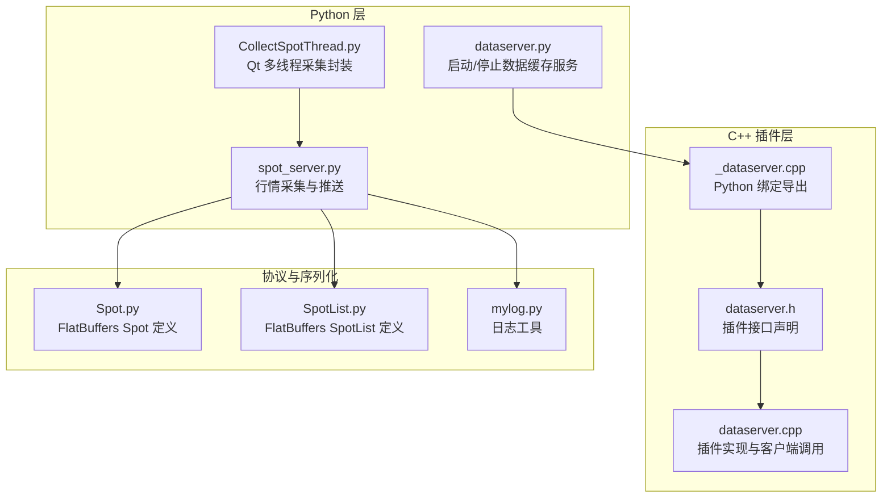
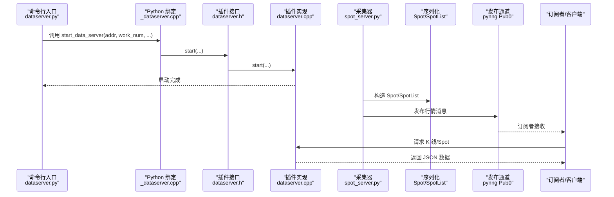
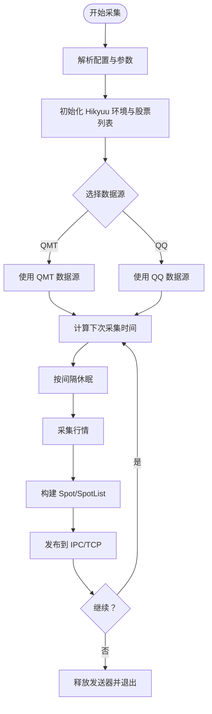
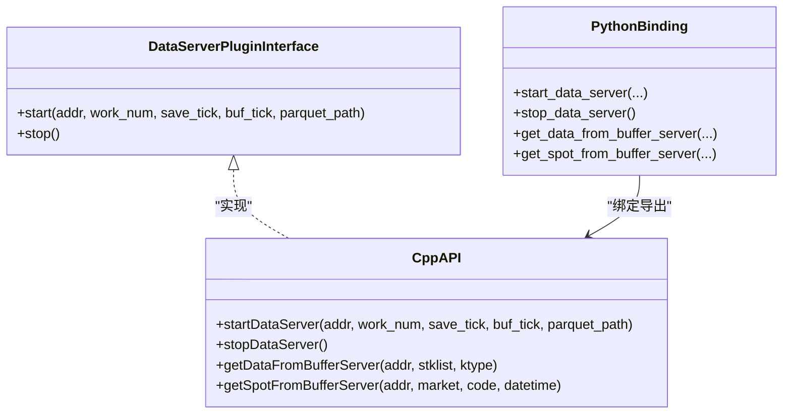
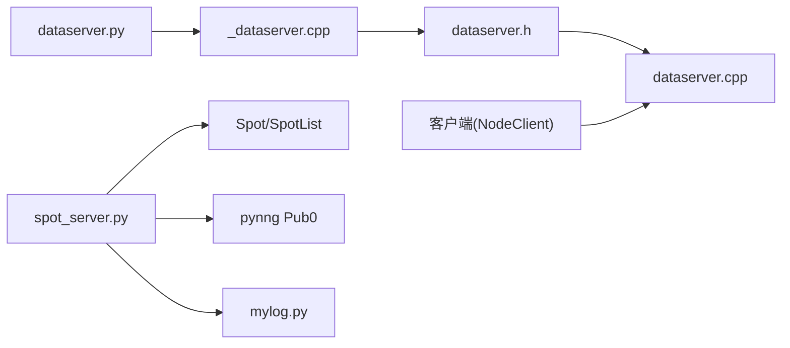

# 实时数据服务

<cite>
**本文引用的文件**
- [dataserver.py](file://hikyuu/gui/dataserver.py)
- [spot_server.py](file://hikyuu/gui/spot_server.py)
- [CollectSpotThread.py](file://hikyuu/gui/data/CollectSpotThread.py)
- [dataserver.h](file://hikyuu_cpp/hikyuu/plugin/dataserver.h)
- [dataserver.cpp](file://hikyuu_cpp/hikyuu/plugin/dataserver.cpp)
- [_dataserver.cpp](file://hikyuu_pywrap/plugin/_dataserver.cpp)
- [Spot.py](file://hikyuu/flat/Spot.py)
- [SpotList.py](file://hikyuu/flat/SpotList.py)
- [mylog.py](file://hikyuu/util/mylog.py)
</cite>

## 目录
1. [简介](#简介)
2. [项目结构](#项目结构)
3. [核心组件](#核心组件)
4. [架构总览](#架构总览)
5. [详细组件分析](#详细组件分析)
6. [依赖关系分析](#依赖关系分析)
7. [性能考量](#性能考量)
8. [故障排查指南](#故障排查指南)
9. [结论](#结论)
10. [附录](#附录)

## 简介
本文件面向实时数据服务的架构与配置，围绕以下目标展开：
- 深入解析数据服务器入口脚本如何启动与停止数据缓存服务
- 解释行情采集器如何通过多线程机制保障实时性与稳定性
- 说明数据推送协议、消息格式与分发通道
- 分析性能瓶颈与扩展方案
- 提供高可用部署建议与网络延迟优化技巧

## 项目结构
实时数据服务由三层组成：
- Python 层：命令行入口与采集线程封装
- C++ 插件层：数据缓存服务的插件接口与实现
- 协议与序列化：FlatBuffers 结构体与 pynng 推送通道

图表来源
- [dataserver.py](file://hikyuu/gui/dataserver.py#L1-L36)
- [spot_server.py](file://hikyuu/gui/spot_server.py#L1-L327)
- [CollectSpotThread.py](file://hikyuu/gui/data/CollectSpotThread.py#L1-L44)
- [dataserver.h](file://hikyuu_cpp/hikyuu/plugin/dataserver.h#L1-L44)
- [dataserver.cpp](file://hikyuu_cpp/hikyuu/plugin/dataserver.cpp#L1-L168)
- [_dataserver.cpp](file://hikyuu_pywrap/plugin/_dataserver.cpp#L1-L54)
- [Spot.py](file://hikyuu/flat/Spot.py#L1-L337)
- [SpotList.py](file://hikyuu/flat/SpotList.py#L1-L75)
- [mylog.py](file://hikyuu/util/mylog.py#L1-L292)

章节来源
- [dataserver.py](file://hikyuu/gui/dataserver.py#L1-L36)
- [spot_server.py](file://hikyuu/gui/spot_server.py#L1-L327)
- [CollectSpotThread.py](file://hikyuu/gui/data/CollectSpotThread.py#L1-L44)
- [dataserver.h](file://hikyuu_cpp/hikyuu/plugin/dataserver.h#L1-L44)
- [dataserver.cpp](file://hikyuu_cpp/hikyuu/plugin/dataserver.cpp#L1-L168)
- [_dataserver.cpp](file://hikyuu_pywrap/plugin/_dataserver.cpp#L1-L54)
- [Spot.py](file://hikyuu/flat/Spot.py#L1-L337)
- [SpotList.py](file://hikyuu/flat/SpotList.py#L1-L75)
- [mylog.py](file://hikyuu/util/mylog.py#L1-L292)

## 核心组件
- 数据服务器入口：负责解析参数并调用 C++ 插件启动/停止数据缓存服务
- 行情采集器：定时采集实时行情，构造 FlatBuffers 消息并通过 pynng 推送
- Qt 采集线程：封装采集逻辑，便于 GUI 环境下的稳定运行
- 插件接口与实现：定义数据缓存服务的启动/停止与客户端查询接口
- 序列化协议：使用 FlatBuffers 定义 Spot/SpotList 结构，提升序列化/反序列化效率
- 日志工具：统一日志记录与错误追踪

章节来源
- [dataserver.py](file://hikyuu/gui/dataserver.py#L1-L36)
- [spot_server.py](file://hikyuu/gui/spot_server.py#L1-L327)
- [CollectSpotThread.py](file://hikyuu/gui/data/CollectSpotThread.py#L1-L44)
- [dataserver.h](file://hikyuu_cpp/hikyuu/plugin/dataserver.h#L1-L44)
- [dataserver.cpp](file://hikyuu_cpp/hikyuu/plugin/dataserver.cpp#L1-L168)
- [Spot.py](file://hikyuu/flat/Spot.py#L1-L337)
- [SpotList.py](file://hikyuu/flat/SpotList.py#L1-L75)
- [mylog.py](file://hikyuu/util/mylog.py#L1-L292)

## 架构总览
实时数据服务采用“采集-序列化-推送-缓存-查询”的链路：
- 采集阶段：行情采集器按配置周期采集，构造 Spot/SpotList 并通过 pynng 发布到 IPC/TCP 通道
- 缓存阶段：数据服务器插件接收并缓存行情，支持按 K 线类型增量更新与按时间戳查询 Spot
- 查询阶段：客户端通过 NodeClient 发起请求，数据服务器返回 JSON 化的 K 线或 Spot 数据

图表来源
- [dataserver.py](file://hikyuu/gui/dataserver.py#L1-L36)
- [_dataserver.cpp](file://hikyuu_pywrap/plugin/_dataserver.cpp#L1-L54)
- [dataserver.h](file://hikyuu_cpp/hikyuu/plugin/dataserver.h#L1-L44)
- [dataserver.cpp](file://hikyuu_cpp/hikyuu/plugin/dataserver.cpp#L1-L168)
- [spot_server.py](file://hikyuu/gui/spot_server.py#L1-L327)
- [Spot.py](file://hikyuu/flat/Spot.py#L1-L337)
- [SpotList.py](file://hikyuu/flat/SpotList.py#L1-L75)

## 详细组件分析

### 数据服务器入口：dataserver.py
- 功能要点
  - 通过命令行参数设置服务地址、工作线程数、是否保存 Tick 数据、是否缓存 Tick 数据、Parquet 路径
  - 调用 C++ 插件启动数据缓存服务，并在前台循环等待，支持 Ctrl-C 正常退出
  - 退出时调用停止函数释放资源

- 关键行为
  - 参数解析与默认值设置
  - 调用 start_data_server/stop_data_server
  - 阻塞式主循环，优雅关闭

章节来源
- [dataserver.py](file://hikyuu/gui/dataserver.py#L1-L36)

### 行情采集器：spot_server.py
- 功能要点
  - 将采集到的行情数据转换为 FlatBuffers 的 Spot/SpotList
  - 通过 pynng Pub0 在 IPC 和 TCP 通道发布行情消息
  - 支持两种数据源：QQ/腾讯代理与 QMT
  - 支持时间段控制与周末忽略策略，确保在交易时段内按固定间隔采集
  - 提供开始/结束标记消息，便于订阅端感知批次边界

- 数据推送协议与消息格式
  - 主题：固定主题字符串，用于区分行情通道
  - 消息体：主题 + FlatBuffers 序列化后的 SpotList
  - 发布方式：同时向 IPC 与 TCP 通道发布，便于本地与远程订阅

- 多线程与稳定性
  - 采集器内部通过时间调度与异常捕获保证稳定性
  - 通过锁管理 pynng 发送器实例，避免并发问题
  - 采集线程封装在 Qt 线程中，便于 GUI 环境下运行

- 时间段与调度算法
  - 支持两段交易时间区间，自动计算下次采集时间
  - 考虑周末忽略与跨日边界，确保调度准确

图表来源
- [spot_server.py](file://hikyuu/gui/spot_server.py#L1-L327)

章节来源
- [spot_server.py](file://hikyuu/gui/spot_server.py#L1-L327)

### Qt 采集线程：CollectSpotThread.py
- 功能要点
  - 从配置读取采集服务器地址、间隔、时间段、代理与数据源
  - 在 Qt 线程中调用采集器的 collect 函数，实现后台稳定采集
  - 线程销毁时释放 pynng 发送器

- 与采集器的关系
  - 作为 GUI 环境下的采集封装，复用采集器的调度与发布逻辑

章节来源
- [CollectSpotThread.py](file://hikyuu/gui/data/CollectSpotThread.py#L1-L44)
- [spot_server.py](file://hikyuu/gui/spot_server.py#L1-L327)

### 插件接口与实现：dataserver.h / dataserver.cpp
- 插件接口
  - start：启动数据缓存服务，参数包含监听地址、工作线程数、是否保存 Tick、是否缓存 Tick、Parquet 路径
  - stop：停止数据缓存服务
  - 客户端查询接口：按 K 线类型批量更新，按市场/代码/时间戳查询 Spot 数据

- 客户端调用流程
  - NodeClient dial 服务器
  - 发送 JSON 请求（cmd: market/tick）
  - 解析响应并更新本地缓存或返回 Spot 列表

图表来源
- [dataserver.h](file://hikyuu_cpp/hikyuu/plugin/dataserver.h#L1-L44)
- [dataserver.cpp](file://hikyuu_cpp/hikyuu/plugin/dataserver.cpp#L1-L168)
- [_dataserver.cpp](file://hikyuu_pywrap/plugin/_dataserver.cpp#L1-L54)

章节来源
- [dataserver.h](file://hikyuu_cpp/hikyuu/plugin/dataserver.h#L1-L44)
- [dataserver.cpp](file://hikyuu_cpp/hikyuu/plugin/dataserver.cpp#L1-L168)
- [_dataserver.cpp](file://hikyuu_pywrap/plugin/_dataserver.cpp#L1-L54)

### 序列化协议：FlatBuffers（Spot/SpotList）
- Spot 字段
  - 市场、代码、名称、时间戳
  - 昨收、开盘、最高、最低、收盘、成交额、成交量
  - 买卖盘口价格与量价数组（Bid/Ask 及对应数量）

- SpotList
  - 包含多个 Spot 的列表容器

- 生成与使用
  - 采集器逐条构建 Spot，再组合为 SpotList
  - 订阅端解析 SpotList 并遍历每个 Spot

章节来源
- [Spot.py](file://hikyuu/flat/Spot.py#L1-L337)
- [SpotList.py](file://hikyuu/flat/SpotList.py#L1-L75)
- [spot_server.py](file://hikyuu/gui/spot_server.py#L1-L327)

## 依赖关系分析
- Python 入口依赖 Python 绑定导出的 C++ 插件接口
- C++ 插件接口依赖 StockManager 与插件系统
- 采集器依赖 pynng 与 FlatBuffers
- 客户端通过 NodeClient 与数据服务器交互

图表来源
- [dataserver.py](file://hikyuu/gui/dataserver.py#L1-L36)
- [_dataserver.cpp](file://hikyuu_pywrap/plugin/_dataserver.cpp#L1-L54)
- [dataserver.h](file://hikyuu_cpp/hikyuu/plugin/dataserver.h#L1-L44)
- [dataserver.cpp](file://hikyuu_cpp/hikyuu/plugin/dataserver.cpp#L1-L168)
- [spot_server.py](file://hikyuu/gui/spot_server.py#L1-L327)
- [Spot.py](file://hikyuu/flat/Spot.py#L1-L337)
- [SpotList.py](file://hikyuu/flat/SpotList.py#L1-L75)
- [mylog.py](file://hikyuu/util/mylog.py#L1-L292)

章节来源
- [dataserver.py](file://hikyuu/gui/dataserver.py#L1-L36)
- [_dataserver.cpp](file://hikyuu_pywrap/plugin/_dataserver.cpp#L1-L54)
- [dataserver.h](file://hikyuu_cpp/hikyuu/plugin/dataserver.h#L1-L44)
- [dataserver.cpp](file://hikyuu_cpp/hikyuu/plugin/dataserver.cpp#L1-L168)
- [spot_server.py](file://hikyuu/gui/spot_server.py#L1-L327)
- [Spot.py](file://hikyuu/flat/Spot.py#L1-L337)
- [SpotList.py](file://hikyuu/flat/SpotList.py#L1-L75)
- [mylog.py](file://hikyuu/util/mylog.py#L1-L292)

## 性能考量
- 序列化与传输
  - 使用 FlatBuffers 降低序列化开销，提高吞吐
  - 通过 pynng Pub0 实现零拷贝发布，减少内存复制
- 线程与调度
  - 采集器内部通过时间计算与 sleep 控制节奏，避免过载
  - Qt 线程封装便于 GUI 场景下的稳定运行
- 缓存与持久化
  - 支持缓存 Tick 数据与保存至 Parquet/ClickHouse，满足不同场景需求
- 客户端查询
  - 批量请求按 K 线类型更新，减少网络往返
  - 按时间戳查询 Spot，避免全量传输

[本节为通用性能讨论，无需列出具体文件来源]

## 故障排查指南
- 日志定位
  - 使用统一日志工具记录采集开始/结束、异常信息与错误码
  - 采集器与插件实现均使用日志记录关键事件与异常

- 常见问题
  - 采集器未找到配置文件：检查用户目录下的配置文件是否存在
  - 采集时间参数非法：确认时间段格式与先后顺序
  - 网络通道不可用：检查 IPC/TCP 地址是否正确且未被占用
  - 客户端请求失败：确认数据服务器已启动且 NodeClient dial 成功

章节来源
- [spot_server.py](file://hikyuu/gui/spot_server.py#L1-L327)
- [dataserver.cpp](file://hikyuu_cpp/hikyuu/plugin/dataserver.cpp#L1-L168)
- [mylog.py](file://hikyuu/util/mylog.py#L1-L292)

## 结论
实时数据服务通过清晰的分层设计实现了高效、稳定的行情采集与分发：
- Python 入口负责启动与参数配置
- C++ 插件提供缓存与查询能力
- 采集器以 FlatBuffers 与 pynng 为核心，确保低延迟与高吞吐
- Qt 线程封装提升了 GUI 环境下的可用性

[本节为总结性内容，无需列出具体文件来源]

## 附录
- 配置项与参数
  - 数据服务器：监听地址、工作线程数、是否保存 Tick、是否缓存 Tick、Parquet 路径
  - 采集器：数据源（QQ/QMT）、是否使用代理、采集间隔、两段交易时间段、是否忽略周末
- 部署建议
  - 将采集器与数据服务器部署在同一台机器上，优先使用 IPC 通道减少网络开销
  - 对外提供服务时，使用 TCP 通道并限制监听地址
  - 为高并发场景增加工作线程数与合适的缓存策略
- 网络延迟优化
  - 优先使用本地 IPC 通道进行内部通信
  - 合理设置采集间隔，避免频繁网络抖动
  - 对外订阅端尽量使用长连接与批量订阅策略

[本节为通用建议，无需列出具体文件来源]