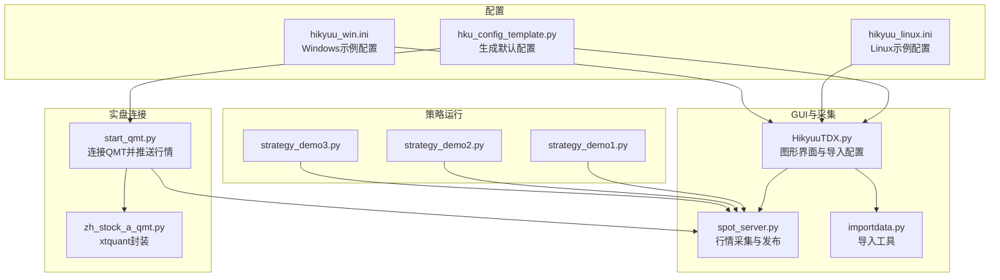
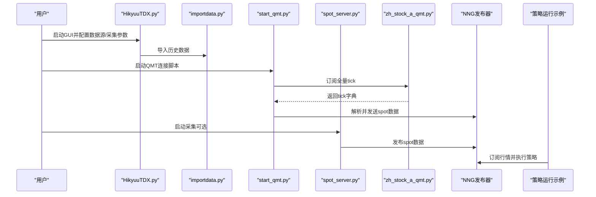
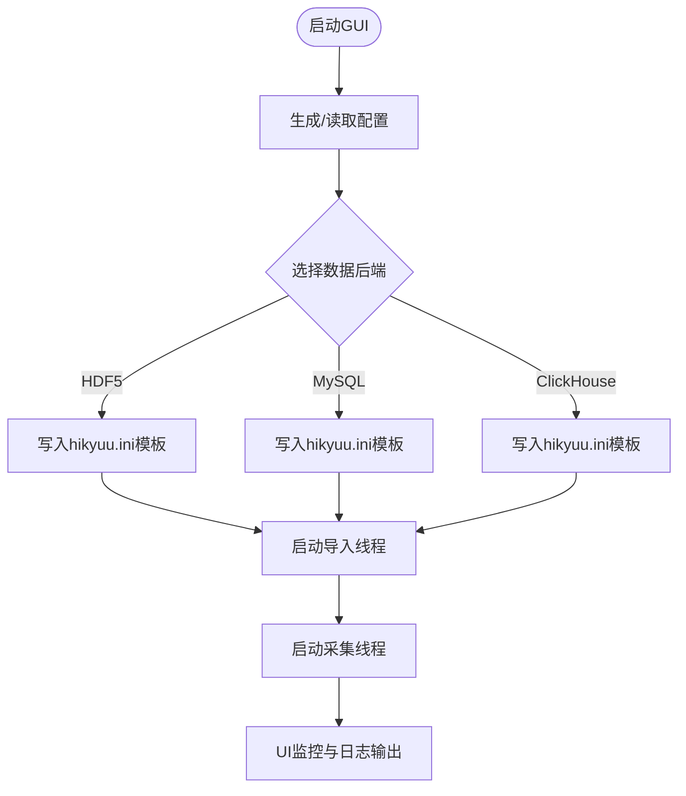
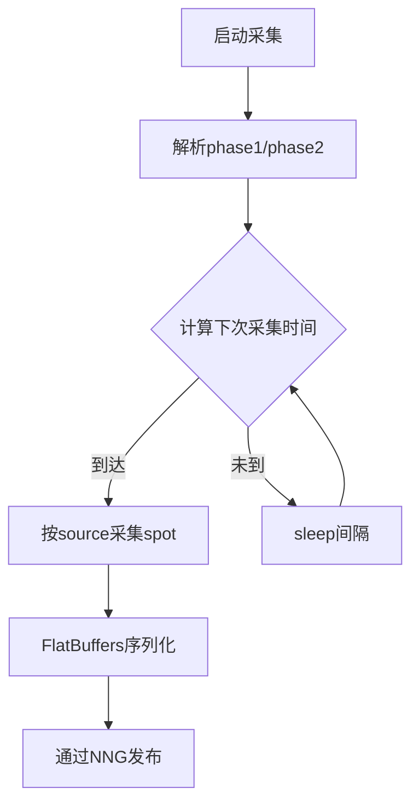
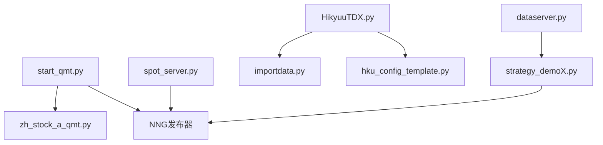

# 实盘部署与执行

<cite>
**本文引用的文件**
- [start_qmt.py](file://hikyuu/gui/start_qmt.py)
- [HikyuuTDX.py](file://hikyuu/gui/HikyuuTDX.py)
- [spot_server.py](file://hikyuu/gui/spot_server.py)
- [dataserver.py](file://hikyuu/gui/dataserver.py)
- [zh_stock_a_qmt.py](file://hikyuu/fetcher/stock/zh_stock_a_qmt.py)
- [hku_config_template.py](file://hikyuu/data/hku_config_template.py)
- [importdata.py](file://hikyuu/gui/importdata.py)
- [strategy_demo1.py](file://hikyuu/strategy/strategy_demo1.py)
- [strategy_demo2.py](file://hikyuu/strategy/strategy_demo2.py)
- [strategy_demo3.py](file://hikyuu/strategy/strategy_demo3.py)
- [hikyuu_linux.ini](file://test_data/hikyuu_linux.ini)
- [hikyuu_win.ini](file://test_data/hikyuu_win.ini)
</cite>

## 目录
1. [引言](#引言)
2. [项目结构](#项目结构)
3. [核心组件](#核心组件)
4. [架构总览](#架构总览)
5. [详细组件分析](#详细组件分析)
6. [依赖关系分析](#依赖关系分析)
7. [性能与稳定性考量](#性能与稳定性考量)
8. [故障排查指南](#故障排查指南)
9. [结论](#结论)
10. [附录：从回测切换到实盘的检查清单与配置示例](#附录从回测切换到实盘的检查清单与配置示例)

## 引言
本指南面向需要将Hikyuu量化平台从回测环境迁移至实盘交易的用户，围绕以下目标展开：
- 通过start_qmt.py脚本启动并连接到QMT（迅投量化平台），完成API初始化与会话管理，并将实时行情推送至策略执行环境。
- 使用HikyuuTDX.py作为独立GUI客户端，完成策略加载、参数配置与交易监控。
- 明确dataserver.py在实时行情数据推送中的角色，确保策略与实盘环境的数据同步。
- 提供从回测环境切换到实盘环境的检查清单与配置示例，帮助快速落地。

## 项目结构
围绕实盘部署与执行，涉及的关键文件与职责如下：
- GUI与采集
  - HikyuuTDX.py：图形界面，负责导入数据、配置参数、启动行情采集与监控。
  - spot_server.py：行情采集与发布，基于NNG发布spot数据，支持IPC/TCP两种传输。
  - importdata.py：命令行导入工具，读取GUI配置并执行数据导入任务。
- 实盘连接与推送
  - start_qmt.py：连接QMT，订阅全量tick，解析为内部spot格式并通过NNG发送。
  - zh_stock_a_qmt.py：封装xtquant接口，解析QMT返回的tick为统一格式。
- 配置模板
  - hku_config_template.py：生成默认配置文件，定义hikyuu.ini与importdata-gui.ini模板。
- 策略运行示例
  - strategy_demoX.py：策略运行示例，展示如何在实盘环境下接收行情并调度执行。



图表来源
- [HikyuuTDX.py](file://hikyuu/gui/HikyuuTDX.py#L1-L200)
- [spot_server.py](file://hikyuu/gui/spot_server.py#L1-L120)
- [importdata.py](file://hikyuu/gui/importdata.py#L1-L120)
- [start_qmt.py](file://hikyuu/gui/start_qmt.py#L1-L120)
- [zh_stock_a_qmt.py](file://hikyuu/fetcher/stock/zh_stock_a_qmt.py#L1-L58)
- [hku_config_template.py](file://hikyuu/data/hku_config_template.py#L1-L120)
- [hikyuu_linux.ini](file://test_data/hikyuu_linux.ini#L1-L56)
- [hikyuu_win.ini](file://test_data/hikyuu_win.ini#L1-L56)

章节来源
- [HikyuuTDX.py](file://hikyuu/gui/HikyuuTDX.py#L1-L200)
- [spot_server.py](file://hikyuu/gui/spot_server.py#L1-L120)
- [importdata.py](file://hikyuu/gui/importdata.py#L1-L120)
- [start_qmt.py](file://hikyuu/gui/start_qmt.py#L1-L120)
- [zh_stock_a_qmt.py](file://hikyuu/fetcher/stock/zh_stock_a_qmt.py#L1-L58)
- [hku_config_template.py](file://hikyuu/data/hku_config_template.py#L1-L120)
- [hikyuu_linux.ini](file://test_data/hikyuu_linux.ini#L1-L56)
- [hikyuu_win.ini](file://test_data/hikyuu_win.ini#L1-L56)

## 核心组件
- start_qmt.py
  - 功能：初始化Hikyuu上下文、加载基础信息与K线配置、等待数据就绪、批量订阅QMT全量tick、解析并推送NNG。
  - 关键点：读取~/.hikyuu/hikyuu.ini；按ktype列表初始化；等待sm.data_ready；批量订阅与回调解析；定时触发首次tick。
- HikyuuTDX.py
  - 功能：图形界面，保存/生成配置、选择数据源（HDF5/MySQL/ClickHouse）、配置采集参数、启动采集线程、日志输出重定向。
  - 关键点：保存配置到~/.hikyuu/hikyuu.ini与importdata-gui.ini；根据许可证启用ClickHouse；采集周期与代理开关。
- spot_server.py
  - 功能：采集器与发布器，支持qmt/qq两种数据源，按时间段与间隔采集，FlatBuffers序列化后通过NNG发布。
  - 关键点：IPC/TCP监听地址；并发采集；时间窗校验；异常捕获与资源释放。
- zh_stock_a_qmt.py
  - 功能：xtquant封装，解析QMT返回的tick为内部spot格式。
  - 关键点：字段映射、时间戳转换、量纲换算。
- hku_config_template.py
  - 功能：生成默认配置模板，包含hikyuu.ini与importdata-gui.ini，覆盖数据目录、预加载、采集参数等。
- importdata.py
  - 功能：命令行导入工具，读取GUI配置并执行导入任务，支持进度反馈与错误汇总。
- dataserver.py
  - 功能：启动/停止数据服务器，支持TCP监听、工作线程数、保存与缓存选项。
- strategy_demoX.py
  - 功能：策略运行示例，演示如何在实盘环境下接收行情并调度执行。

章节来源
- [start_qmt.py](file://hikyuu/gui/start_qmt.py#L1-L140)
- [HikyuuTDX.py](file://hikyuu/gui/HikyuuTDX.py#L1-L200)
- [spot_server.py](file://hikyuu/gui/spot_server.py#L1-L200)
- [zh_stock_a_qmt.py](file://hikyuu/fetcher/stock/zh_stock_a_qmt.py#L1-L58)
- [hku_config_template.py](file://hikyuu/data/hku_config_template.py#L1-L200)
- [importdata.py](file://hikyuu/gui/importdata.py#L1-L171)
- [dataserver.py](file://hikyuu/gui/dataserver.py#L1-L36)
- [strategy_demo1.py](file://hikyuu/strategy/strategy_demo1.py#L1-L54)
- [strategy_demo2.py](file://hikyuu/strategy/strategy_demo2.py#L1-L48)
- [strategy_demo3.py](file://hikyuu/strategy/strategy_demo3.py#L1-L25)

## 架构总览
实盘部署的总体流程如下：
- 首次运行时由HikyuuTDX.py生成默认配置文件（~/.hikyuu/hikyuu.ini与importdata-gui.ini），随后导入所需的历史数据。
- 启动行情采集：可选start_qmt.py直连QMT，或spot_server.py采集并发布；也可通过dataserver.py提供外部访问。
- 策略侧通过NNG订阅行情，接收FlatBuffers序列化的spot数据，按策略逻辑执行买卖决策。



图表来源
- [start_qmt.py](file://hikyuu/gui/start_qmt.py#L1-L140)
- [zh_stock_a_qmt.py](file://hikyuu/fetcher/stock/zh_stock_a_qmt.py#L1-L58)
- [spot_server.py](file://hikyuu/gui/spot_server.py#L200-L327)
- [strategy_demo1.py](file://hikyuu/strategy/strategy_demo1.py#L1-L54)

## 详细组件分析

### start_qmt.py：连接QMT并推送行情
- 初始化与配置
  - 读取~/.hikyuu/hikyuu.ini，设置tmpdir/datadir/quotation_server/plugindir等参数。
  - 构造base_param/block_param/kdata_param/preload_param并调用StrategyContext初始化。
  - 等待数据加载完成（sm.data_ready）。
- 订阅与推送
  - 生成股票列表，按批次订阅QMT全量tick，回调中解析为内部spot记录并发送NNG。
  - 每日9:30触发一次全量tick拉取，确保当日首个分钟线生成。
- 会话管理
  - 循环等待，异常捕获与资源释放（release_nng_senders）。

```mermaid
sequenceDiagram
participant Init as "初始化"
participant Load as "等待数据就绪"
participant Sub as "订阅QMT全量tick"
participant Parse as "解析为spot"
participant Send as "发送NNG"
participant Loop as "定时触发"
Init->>Load : 初始化上下文与参数
Load-->>Sub : sm.data_ready=True
Sub->>Parse : 回调解析tick
Parse->>Send : FlatBuffers序列化并发送
Loop->>Sub : 每日9 : 30全量拉取
```

图表来源
- [start_qmt.py](file://hikyuu/gui/start_qmt.py#L1-L140)
- [zh_stock_a_qmt.py](file://hikyuu/fetcher/stock/zh_stock_a_qmt.py#L1-L58)
- [spot_server.py](file://hikyuu/gui/spot_server.py#L160-L220)

章节来源
- [start_qmt.py](file://hikyuu/gui/start_qmt.py#L1-L140)
- [zh_stock_a_qmt.py](file://hikyuu/fetcher/stock/zh_stock_a_qmt.py#L1-L58)
- [spot_server.py](file://hikyuu/gui/spot_server.py#L160-L220)

### HikyuuTDX.py：独立GUI客户端
- 配置生成与保存
  - 自动生成~/.hikyuu/hikyuu.ini与importdata-gui.ini，支持HDF5/MySQL/ClickHouse三类数据后端。
  - 采集参数：quotation_server、interval、phase1/phase2、use_zhima_proxy等。
- 导入与监控
  - 启动导入线程，支持进度与错误汇总；关闭事件中释放NNG资源。
- 日志与输出
  - 将stdout/stderr重定向到UI文本框，支持彩色日志。



图表来源
- [HikyuuTDX.py](file://hikyuu/gui/HikyuuTDX.py#L1-L200)
- [hku_config_template.py](file://hikyuu/data/hku_config_template.py#L1-L200)
- [importdata.py](file://hikyuu/gui/importdata.py#L1-L171)

章节来源
- [HikyuuTDX.py](file://hikyuu/gui/HikyuuTDX.py#L1-L200)
- [hku_config_template.py](file://hikyuu/data/hku_config_template.py#L1-L200)
- [importdata.py](file://hikyuu/gui/importdata.py#L1-L171)

### spot_server.py：行情采集与发布
- 采集逻辑
  - 解析phase1/phase2时间窗，按间隔计算下次采集时间，支持忽略周末。
  - 根据source选择qmt或qq数据源，批量获取spot并发送NNG。
- 发布机制
  - IPC与TCP双通道发布，FlatBuffers序列化，带topic前缀。
- 安全与健壮性
  - 异常捕获与资源释放；配置文件存在性校验；参数合法性校验。



图表来源
- [spot_server.py](file://hikyuu/gui/spot_server.py#L120-L220)

章节来源
- [spot_server.py](file://hikyuu/gui/spot_server.py#L1-L200)

### zh_stock_a_qmt.py：QMT数据解析
- 功能要点
  - 将QMT风格的tick数据映射为内部spot格式，包含时间戳、开盘/最高/最低/昨收/最新、买卖盘口与量纲换算。
  - 提供get_spot接口，支持批量获取并回调批量函数。

章节来源
- [zh_stock_a_qmt.py](file://hikyuu/fetcher/stock/zh_stock_a_qmt.py#L1-L58)

### dataserver.py：外部行情服务
- 功能要点
  - 命令行启动/停止数据服务器，支持TCP监听、工作线程数、保存与缓存选项。
  - 适合多机部署场景，策略侧通过TCP订阅。

章节来源
- [dataserver.py](file://hikyuu/gui/dataserver.py#L1-L36)

### 策略运行示例：strategy_demoX.py
- 功能要点
  - 展示如何在实盘环境下接收行情并调度执行，强调“请开启HikyuuTdx行情采集，否则接收不到数据”。
  - 提供基于EasyTrader的订单代理示例，便于对接券商。

章节来源
- [strategy_demo1.py](file://hikyuu/strategy/strategy_demo1.py#L1-L54)
- [strategy_demo2.py](file://hikyuu/strategy/strategy_demo2.py#L1-L48)
- [strategy_demo3.py](file://hikyuu/strategy/strategy_demo3.py#L1-L25)

## 依赖关系分析
- 组件耦合
  - start_qmt.py依赖zh_stock_a_qmt.py进行QMT数据解析，并通过spot_server.py的NNG发布器推送。
  - HikyuuTDX.py通过hku_config_template.py生成配置，再由importdata.py执行导入。
  - dataserver.py与spot_server.py共享NNG发布机制，策略侧统一订阅。
- 外部依赖
  - xtquant（QMT）：start_qmt.py与zh_stock_a_qmt.py依赖。
  - pynng/flatbuffers：spot_server.py与start_qmt.py用于消息发布与序列化。
  - ClickHouse/MySQL：HikyuuTDX.py支持的后端，需相应驱动与权限。



图表来源
- [start_qmt.py](file://hikyuu/gui/start_qmt.py#L1-L140)
- [zh_stock_a_qmt.py](file://hikyuu/fetcher/stock/zh_stock_a_qmt.py#L1-L58)
- [spot_server.py](file://hikyuu/gui/spot_server.py#L1-L200)
- [HikyuuTDX.py](file://hikyuu/gui/HikyuuTDX.py#L1-L200)
- [importdata.py](file://hikyuu/gui/importdata.py#L1-L171)
- [hku_config_template.py](file://hikyuu/data/hku_config_template.py#L1-L200)
- [dataserver.py](file://hikyuu/gui/dataserver.py#L1-L36)
- [strategy_demo1.py](file://hikyuu/strategy/strategy_demo1.py#L1-L54)

## 性能与稳定性考量
- 批量订阅与限流
  - start_qmt.py按批次订阅QMT全量tick，避免一次性订阅过多导致阻塞。
- 时间窗与间隔
  - spot_server.py支持phase1/phase2与间隔参数，合理设置可降低网络与CPU压力。
- 序列化与传输
  - FlatBuffers序列化减少内存拷贝与GC压力；NNG发布器支持IPC/TCP，按需选择。
- 异常与资源
  - 统一异常捕获与日志输出；关闭事件中释放NNG资源，避免句柄泄漏。

[本节为通用指导，无需列出具体文件来源]

## 故障排查指南
- 配置文件缺失
  - 确认~/.hikyuu/hikyuu.ini与importdata-gui.ini是否存在；若缺失，可通过HikyuuTDX.py自动生成或手动创建。
- 数据未就绪
  - start_qmt.py在启动前会等待sm.data_ready，若长时间未就绪，检查导入任务是否完成或数据库连接是否正常。
- QMT连接失败
  - 确认xtquant可用；检查QMT客户端状态与网络；查看zh_stock_a_qmt.py中的错误日志。
- NNG发布异常
  - 检查IPC/TCP监听地址是否冲突；确认策略侧订阅地址一致；观察spot_server.py与start_qmt.py的日志。
- 采集时间窗错误
  - spot_server.py对phase1/phase2有严格校验，确保起止时间合法且顺序正确。

章节来源
- [hku_config_template.py](file://hikyuu/data/hku_config_template.py#L1-L200)
- [start_qmt.py](file://hikyuu/gui/start_qmt.py#L1-L140)
- [spot_server.py](file://hikyuu/gui/spot_server.py#L200-L327)
- [zh_stock_a_qmt.py](file://hikyuu/fetcher/stock/zh_stock_a_qmt.py#L1-L58)

## 结论
通过start_qmt.py直连QMT或spot_server.py采集发布，配合HikyuuTDX.py的配置与导入，可以快速搭建从数据到策略执行的实盘闭环。dataserver.py为多机部署提供了灵活的外部服务入口。遵循本文的检查清单与配置示例，可有效提升部署效率与稳定性。

[本节为总结性内容，无需列出具体文件来源]

## 附录：从回测切换到实盘的检查清单与配置示例

- 检查清单
  - 环境准备
    - Python与依赖安装完成（含xtquant、pynng、flatbuffers等）。
    - HikyuuTDX.py首次运行生成~/.hikyuu/hikyuu.ini与importdata-gui.ini。
  - 数据导入
    - 选择合适的数据后端（HDF5/MySQL/ClickHouse），导入所需K线与基础数据。
    - 若使用ClickHouse，确认许可证有效。
  - 实盘连接
    - 启动start_qmt.py或spot_server.py，确保能正常订阅并发布行情。
    - 确认NNG监听地址与策略侧订阅地址一致。
  - 策略运行
    - 确保策略侧已开启行情订阅；参考strategy_demoX.py示例进行调试。
    - 如需对接券商，参考strategy_demo2.py中的EasyTrader示例。

- 配置示例
  - 默认配置模板
    - hku_config_template.py生成的hikyuu.ini与importdata-gui.ini包含数据目录、预加载、采集参数等关键项。
  - 平台示例配置
    - Linux与Windows示例配置文件展示了不同平台下的路径与后端设置差异。

章节来源
- [hku_config_template.py](file://hikyuu/data/hku_config_template.py#L1-L200)
- [hikyuu_linux.ini](file://test_data/hikyuu_linux.ini#L1-L56)
- [hikyuu_win.ini](file://test_data/hikyuu_win.ini#L1-L56)
- [HikyuuTDX.py](file://hikyuu/gui/HikyuuTDX.py#L1-L200)
- [importdata.py](file://hikyuu/gui/importdata.py#L1-L171)
- [start_qmt.py](file://hikyuu/gui/start_qmt.py#L1-L140)
- [spot_server.py](file://hikyuu/gui/spot_server.py#L1-L200)
- [strategy_demo1.py](file://hikyuu/strategy/strategy_demo1.py#L1-L54)
- [strategy_demo2.py](file://hikyuu/strategy/strategy_demo2.py#L1-L48)
- [strategy_demo3.py](file://hikyuu/strategy/strategy_demo3.py#L1-L25)