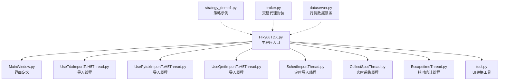
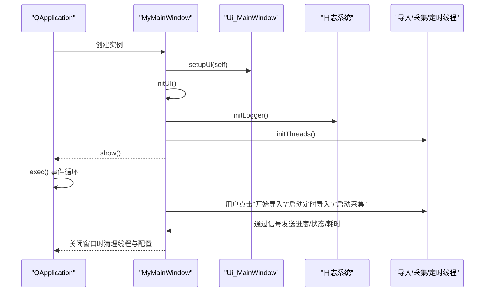
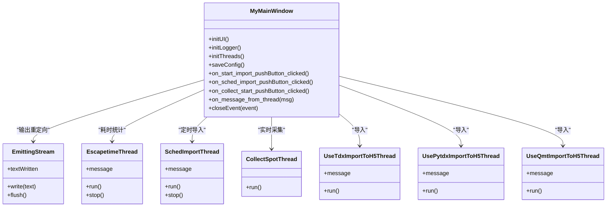
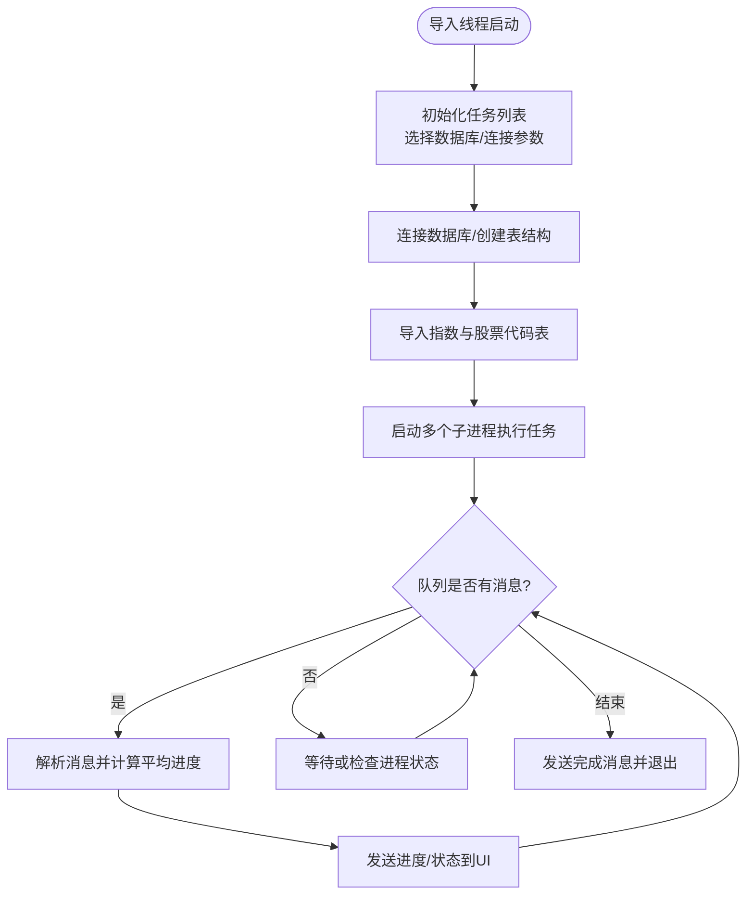
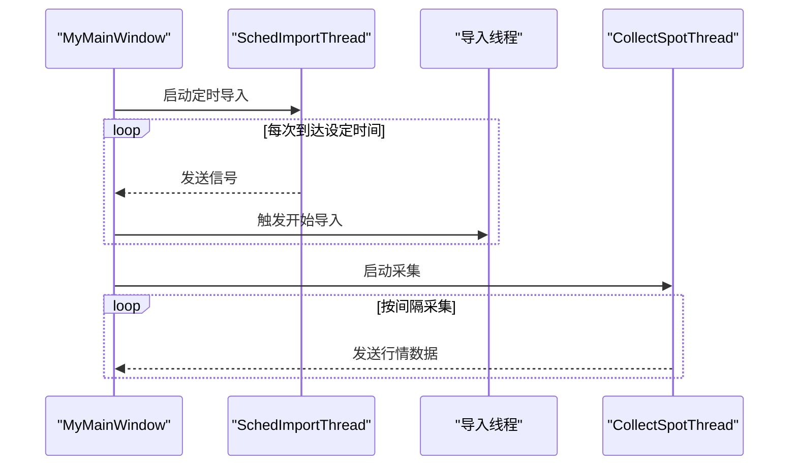
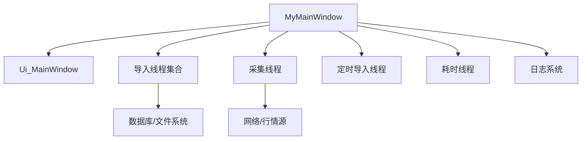

# 独立GUI客户端部署

<cite>
**本文引用的文件列表**
- [HikyuuTDX.py](file://hikyuu/gui/HikyuuTDX.py)
- [MainWindow.py](file://hikyuu/gui/data/MainWindow.py)
- [tool.py](file://hikyuu/gui/data/tool.py)
- [UseTdxImportToH5Thread.py](file://hikyuu/gui/data/UseTdxImportToH5Thread.py)
- [UsePytdxImportToH5Thread.py](file://hikyuu/gui/data/UsePytdxImportToH5Thread.py)
- [UseQmtImportToH5Thread.py](file://hikyuu/gui/data/UseQmtImportToH5Thread.py)
- [SchedImportThread.py](file://hikyuu/gui/data/SchedImportThread.py)
- [CollectSpotThread.py](file://hikyuu/gui/data/CollectSpotThread.py)
- [EscapetimeThread.py](file://hikyuu/gui/data/EscapetimeThread.py)
- [strategy_demo1.py](file://hikyuu/strategy/strategy_demo1.py)
- [broker.py](file://hikyuu/trade_manage/broker.py)
- [dataserver.py](file://hikyuu/gui/dataserver.py)
</cite>

## 目录
1. [引言](#引言)
2. [项目结构](#项目结构)
3. [核心组件](#核心组件)
4. [架构总览](#架构总览)
5. [详细组件分析](#详细组件分析)
6. [依赖关系分析](#依赖关系分析)
7. [性能考量](#性能考量)
8. [故障排查指南](#故障排查指南)
9. [结论](#结论)
10. [附录](#附录)

## 引言
本文件面向希望独立部署Hikyuu GUI客户端（HikyuuTDX）的用户与运维人员，系统性阐述主程序入口的启动流程、窗口初始化与事件循环、核心功能模块（策略选择、参数调整、交易状态监控、日志查看）、辅助工具的使用，以及客户端配置、策略加载与日常运维操作手册。文档同时提供关键流程的可视化图示，帮助快速理解与上手。

## 项目结构
Hikyuu GUI 客户端位于 hikyuu/gui 目录，其中：
- HikyuuTDX.py 是主程序入口，负责应用初始化、窗口与日志系统、线程管理、导入与采集控制等。
- hikyuu/gui/data/ 下包含界面定义（MainWindow.py）与数据导入/采集线程、定时导入线程、耗时统计线程等。
- hikyuu/gui/data/tool.py 提供UI转换工具脚本，便于从 .ui 生成 .py。
- hikyuu/strategy/ 与 hikyuu/trade_manage/ 提供策略与交易管理的基础能力，可用于策略运行与交易对接参考。

图表来源
- [HikyuuTDX.py](file://hikyuu/gui/HikyuuTDX.py#L1067-L1140)
- [MainWindow.py](file://hikyuu/gui/data/MainWindow.py#L1-L200)
- [UseTdxImportToH5Thread.py](file://hikyuu/gui/data/UseTdxImportToH5Thread.py#L1-L120)
- [UsePytdxImportToH5Thread.py](file://hikyuu/gui/data/UsePytdxImportToH5Thread.py#L1-L120)
- [UseQmtImportToH5Thread.py](file://hikyuu/gui/data/UseQmtImportToH5Thread.py#L1-L120)
- [SchedImportThread.py](file://hikyuu/gui/data/SchedImportThread.py#L1-L62)
- [CollectSpotThread.py](file://hikyuu/gui/data/CollectSpotThread.py#L1-L44)
- [EscapetimeThread.py](file://hikyuu/gui/data/EscapetimeThread.py#L1-L27)
- [tool.py](file://hikyuu/gui/data/tool.py#L1-L51)

章节来源
- [HikyuuTDX.py](file://hikyuu/gui/HikyuuTDX.py#L1067-L1140)
- [MainWindow.py](file://hikyuu/gui/data/MainWindow.py#L1-L200)

## 核心组件
- 主窗口与界面：由 MainWindow.py 生成的 Ui_MainWindow 构成，MyMainWindow 继承该界面并完成初始化、配置读写、按钮事件绑定等。
- 数据导入线程：根据选择的数据源（通达信、pytdx、QMT），分别启动对应导入线程，负责多进程并行导入、进度上报与异常处理。
- 定时导入线程：基于设定时间周期触发导入任务。
- 实时采集线程：按配置周期与交易时段采集实时行情。
- 耗时统计线程：持续统计导入耗时并在界面展示。
- 日志系统：统一捕获标准输出与多进程日志，支持彩色输出与滚动上限。
- UI转换工具：tool.py 提供 .ui 到 .py 的批量转换脚本。

章节来源
- [HikyuuTDX.py](file://hikyuu/gui/HikyuuTDX.py#L55-L120)
- [MainWindow.py](file://hikyuu/gui/data/MainWindow.py#L1-L200)
- [UseTdxImportToH5Thread.py](file://hikyuu/gui/data/UseTdxImportToH5Thread.py#L1-L120)
- [UsePytdxImportToH5Thread.py](file://hikyuu/gui/data/UsePytdxImportToH5Thread.py#L1-L120)
- [UseQmtImportToH5Thread.py](file://hikyuu/gui/data/UseQmtImportToH5Thread.py#L1-L120)
- [SchedImportThread.py](file://hikyuu/gui/data/SchedImportThread.py#L1-L62)
- [CollectSpotThread.py](file://hikyuu/gui/data/CollectSpotThread.py#L1-L44)
- [EscapetimeThread.py](file://hikyuu/gui/data/EscapetimeThread.py#L1-L27)
- [tool.py](file://hikyuu/gui/data/tool.py#L1-L51)

## 架构总览
HikyuuTDX 的启动流程如下：
- 应用启动：创建 QApplication，实例化 MyMainWindow，设置窗口图标与尺寸，显示。
- 窗口初始化：读取用户配置，初始化界面控件状态、日期范围、预加载设置、数据库与采集参数。
- 日志系统：重定向标准输出，注册多进程日志监听器，设置日志格式与级别。
- 线程管理：根据导入源选择启动相应导入线程；可选启动定时导入与实时采集线程。
- 事件循环：进入 Qt 事件循环，响应用户交互与线程消息。

图表来源
- [HikyuuTDX.py](file://hikyuu/gui/HikyuuTDX.py#L1067-L1140)
- [HikyuuTDX.py](file://hikyuu/gui/HikyuuTDX.py#L318-L420)
- [HikyuuTDX.py](file://hikyuu/gui/HikyuuTDX.py#L286-L317)
- [HikyuuTDX.py](file://hikyuu/gui/HikyuuTDX.py#L636-L650)

## 详细组件分析

### 主程序入口与窗口初始化（HikyuuTDX.py）
- 启动流程要点
  - 优先导入 hikyuu，确保依赖 DLL 兼容性。
  - 使用 PySide6 初始化 QApplication 与 MyMainWindow。
  - 通过 start() 或 __main__ 启动，支持两种输出模式：捕获输出与直接输出。
  - 字体检测与设置（Windows 平台）。
- 窗口初始化（initUI）
  - 读取用户配置 importdata-gui.ini，填充导入数据类型、K线类型、权息/财务/板块、数据源（通达信/Pytdx/QMT）、数据库（HDF5/MySQL/ClickHouse）等。
  - 设置日期编辑器最小值与默认值，预加载最大条数等。
  - 控制不同数据源与数据库启用时的控件可用性。
- 日志系统（initLogger）
  - 重定向 sys.stdout/stderr 至 UI 文本框，支持彩色日志。
  - 注册多进程日志监听器，聚合子进程日志。
- 线程管理（initThreads）
  - 初始化导入线程、采集线程、定时导入线程、耗时线程等引用。
- 事件与槽
  - 保存配置、切换数据源、切换数据库、测试数据库连接、启动/停止采集、启动/停止定时导入、开始导入等。
- 关闭事件（closeEvent）
  - 停止导入、采集、定时导入线程，释放资源，保存配置。

图表来源
- [HikyuuTDX.py](file://hikyuu/gui/HikyuuTDX.py#L44-L53)
- [HikyuuTDX.py](file://hikyuu/gui/HikyuuTDX.py#L55-L120)
- [EscapetimeThread.py](file://hikyuu/gui/data/EscapetimeThread.py#L1-L27)
- [SchedImportThread.py](file://hikyuu/gui/data/SchedImportThread.py#L1-L62)
- [CollectSpotThread.py](file://hikyuu/gui/data/CollectSpotThread.py#L1-L44)
- [UseTdxImportToH5Thread.py](file://hikyuu/gui/data/UseTdxImportToH5Thread.py#L1-L120)
- [UsePytdxImportToH5Thread.py](file://hikyuu/gui/data/UsePytdxImportToH5Thread.py#L1-L120)
- [UseQmtImportToH5Thread.py](file://hikyuu/gui/data/UseQmtImportToH5Thread.py#L1-L120)

章节来源
- [HikyuuTDX.py](file://hikyuu/gui/HikyuuTDX.py#L1067-L1140)
- [HikyuuTDX.py](file://hikyuu/gui/HikyuuTDX.py#L318-L420)
- [HikyuuTDX.py](file://hikyuu/gui/HikyuuTDX.py#L286-L317)
- [HikyuuTDX.py](file://hikyuu/gui/HikyuuTDX.py#L636-L650)

### 界面定义与核心功能（MainWindow.py）
- 界面组成
  - 导入数据源选择：通达信、Pytdx、QMT。
  - 导入数据类型：股票、基金、期货（禁用）、权息、历史财务、板块。
  - K线类型：日线、1分钟、5分钟、分笔、分时。
  - 时间范围：日线、1分钟、5分钟、分笔、分时起始日期。
  - 数据库选择：HDF5、MySQL、ClickHouse（受授权限制）。
  - HDF5 目录、MySQL 连接参数、ClickHouse 连接参数。
  - 定时导入：设定时间、启动/停止。
  - 导入进度与详情：各周期进度条、导入详情文本框。
  - 预加载设置：日线/周线/月线/季线/半年/年线、分钟线等最大条数。
  - 实时采集：采集间隔、采集时段、代理开关、数据源选择。
- 功能要点
  - 数据源切换：动态启用/禁用相关控件。
  - 数据库切换：互斥启用，禁用其他数据库控件。
  - 测试连接：MySQL/ClickHouse 连接测试。
  - 开始导入：校验目录存在性、交易时段提示、启动导入线程与耗时线程。
  - 定时导入：按设定时间周期触发导入。
  - 实时采集：按配置周期与交易时段采集行情。

章节来源
- [MainWindow.py](file://hikyuu/gui/data/MainWindow.py#L1-L200)
- [MainWindow.py](file://hikyuu/gui/data/MainWindow.py#L200-L600)
- [MainWindow.py](file://hikyuu/gui/data/MainWindow.py#L600-L1000)
- [MainWindow.py](file://hikyuu/gui/data/MainWindow.py#L1000-L1483)

### 数据导入线程（UseTdxImportToH5Thread.py / UsePytdxImportToH5Thread.py / UseQmtImportToH5Thread.py）
- 共同机制
  - 任务初始化：根据配置生成具体任务列表（K线、权息、财务、板块、债券等）。
  - 多进程并行：每个任务以独立进程执行，通过队列汇总进度。
  - 进度上报：按周期从队列读取进度，计算平均进度并发送 UI 更新。
  - 异常处理：捕获异常并通过消息通知 UI。
- 差异点
  - UseTdxImportToH5Thread：基于通达信本地目录导入，不支持分笔/分时。
  - UsePytdxImportToH5Thread：基于 pytdx 远程服务器导入，支持分笔/分时。
  - UseQmtImportToH5Thread：基于 QMT（Windows），支持权息/财务与部分K线类型。

图表来源
- [UseTdxImportToH5Thread.py](file://hikyuu/gui/data/UseTdxImportToH5Thread.py#L193-L358)
- [UsePytdxImportToH5Thread.py](file://hikyuu/gui/data/UsePytdxImportToH5Thread.py#L230-L395)
- [UseQmtImportToH5Thread.py](file://hikyuu/gui/data/UseQmtImportToH5Thread.py#L167-L318)

章节来源
- [UseTdxImportToH5Thread.py](file://hikyuu/gui/data/UseTdxImportToH5Thread.py#L1-L200)
- [UsePytdxImportToH5Thread.py](file://hikyuu/gui/data/UsePytdxImportToH5Thread.py#L1-L200)
- [UseQmtImportToH5Thread.py](file://hikyuu/gui/data/UseQmtImportToH5Thread.py#L1-L200)

### 定时导入与实时采集（SchedImportThread.py / CollectSpotThread.py）
- 定时导入
  - 解析配置中的导入时间，计算下次导入时间与等待时长。
  - 在等待期间持续唤醒，触发导入。
- 实时采集
  - 读取采集间隔、交易时段、代理与数据源配置。
  - 调用采集函数，持续发送行情数据。

图表来源
- [SchedImportThread.py](file://hikyuu/gui/data/SchedImportThread.py#L1-L62)
- [CollectSpotThread.py](file://hikyuu/gui/data/CollectSpotThread.py#L1-L44)
- [HikyuuTDX.py](file://hikyuu/gui/HikyuuTDX.py#L1010-L1063)

章节来源
- [SchedImportThread.py](file://hikyuu/gui/data/SchedImportThread.py#L1-L62)
- [CollectSpotThread.py](file://hikyuu/gui/data/CollectSpotThread.py#L1-L44)
- [HikyuuTDX.py](file://hikyuu/gui/HikyuuTDX.py#L1010-L1063)

### 日志与耗时统计（EscapetimeThread.py / HikyuuTDX.py）
- 日志系统
  - 重定向标准输出，按日志级别着色显示。
  - 多进程日志通过 QueueListener 聚合。
- 耗时统计
  - EscapetimeThread 每秒发送耗时到 UI，用于导入耗时展示。

章节来源
- [HikyuuTDX.py](file://hikyuu/gui/HikyuuTDX.py#L286-L317)
- [EscapetimeThread.py](file://hikyuu/gui/data/EscapetimeThread.py#L1-L27)

### 辅助工具（tool.py）
- 功能：遍历目录下所有 .ui 文件，调用 pyside6-uic 将其转换为 .py。
- 使用场景：修改 .ui 后一键生成对应的 Python 界面代码。

章节来源
- [tool.py](file://hikyuu/gui/data/tool.py#L1-L51)

## 依赖关系分析
- 组件耦合
  - MyMainWindow 与 Ui_MainWindow 强耦合，负责界面行为与业务逻辑。
  - 导入线程与 UI 通过信号/槽通信，解耦进度与状态更新。
  - 日志系统通过全局处理器与多进程监听器实现集中输出。
- 外部依赖
  - PyQt6/PySide6：界面与事件循环。
  - MySQL/ClickHouse 客户端：数据库连接与写入。
  - pytdx：远程行情获取与服务器选择。
  - 多进程与队列：并行导入与进度汇总。

图表来源
- [HikyuuTDX.py](file://hikyuu/gui/HikyuuTDX.py#L55-L120)
- [UseTdxImportToH5Thread.py](file://hikyuu/gui/data/UseTdxImportToH5Thread.py#L1-L120)
- [UsePytdxImportToH5Thread.py](file://hikyuu/gui/data/UsePytdxImportToH5Thread.py#L1-L120)
- [UseQmtImportToH5Thread.py](file://hikyuu/gui/data/UseQmtImportToH5Thread.py#L1-L120)
- [CollectSpotThread.py](file://hikyuu/gui/data/CollectSpotThread.py#L1-L44)
- [SchedImportThread.py](file://hikyuu/gui/data/SchedImportThread.py#L1-L62)
- [EscapetimeThread.py](file://hikyuu/gui/data/EscapetimeThread.py#L1-L27)

## 性能考量
- 并行导入：多进程并行导入显著提升吞吐，但需合理分配服务器与任务数量，避免过载。
- 数据库选择：HDF5 适合本地快速读写；MySQL/ClickHouse 适合团队共享与大数据场景，注意连接池与索引优化。
- 采集频率：采集间隔不宜过短，避免对网络与服务器造成压力。
- 日志输出：大量日志会影响 UI 响应，建议在生产环境降低日志级别或关闭彩色输出。

## 故障排查指南
- 导入异常
  - 检查导入线程发送的“THREAD FAILURE”消息，查看 UI 导入详情文本框。
  - 确认数据源目录、数据库连接参数、授权状态。
- 采集无数据
  - 检查采集线程状态与日志，确认网络与代理设置。
  - 核对交易时段配置与当前时间。
- 定时导入未触发
  - 查看定时导入线程日志，确认下次导入时间计算是否正确。
- 数据库连接失败
  - 使用“测试连接”按钮验证参数；检查防火墙与端口开放情况。
- 关闭异常
  - 若导入进行中关闭窗口，会提示等待导入完成；确保线程被正确终止与资源释放。

章节来源
- [HikyuuTDX.py](file://hikyuu/gui/HikyuuTDX.py#L842-L935)
- [HikyuuTDX.py](file://hikyuu/gui/HikyuuTDX.py#L936-L1009)
- [HikyuuTDX.py](file://hikyuu/gui/HikyuuTDX.py#L1010-L1063)

## 结论
Hikyuu GUI 客户端通过清晰的模块划分与事件驱动架构，实现了从界面配置到数据导入、采集与日志监控的完整闭环。用户可通过图形化界面灵活配置数据源与数据库，借助多进程并行导入提升效率，并通过定时导入与实时采集满足日常运维需求。建议在生产环境中合理设置日志级别与采集频率，确保系统稳定与性能平衡。

## 附录

### 客户端配置与操作手册
- 启动与关闭
  - 启动：python hikyuu/gui/HikyuuTDX.py
  - 关闭：点击窗口关闭按钮，若正在导入将提示等待。
- 配置保存
  - 点击“保存配置”，配置将写入用户目录下的 importdata-gui.ini 与 hikyuu.ini。
- 数据源与数据库
  - 选择通达信/Pytdx/QMT，设置对应目录与参数。
  - 选择 HDF5/MySQL/ClickHouse，填写连接参数；ClickHouse 需授权。
- 导入流程
  - 选择导入类型与时间范围，点击“开始导入”。
  - 查看进度条与导入详情，耗时由耗时线程实时更新。
- 定时导入
  - 设定导入时间，点击“启动定时导入”，系统将在设定时间自动触发导入。
- 实时采集
  - 配置采集间隔与交易时段，点击“启动采集”，可在日志中查看采集状态。
- 日志查看
  - 所有标准输出与多进程日志将显示在日志文本框，支持滚动与彩色显示。

章节来源
- [HikyuuTDX.py](file://hikyuu/gui/HikyuuTDX.py#L936-L1009)
- [HikyuuTDX.py](file://hikyuu/gui/HikyuuTDX.py#L1010-L1063)
- [HikyuuTDX.py](file://hikyuu/gui/HikyuuTDX.py#L286-L317)

### 策略加载与交易对接参考
- 策略运行
  - 参考策略示例，创建 Strategy 并注册回调函数，按需设置每日执行计划。
- 交易对接
  - 可参考交易代理封装，实现 buy/sell 接口，结合订单代理包装类接入系统。

章节来源
- [strategy_demo1.py](file://hikyuu/strategy/strategy_demo1.py#L1-L54)
- [broker.py](file://hikyuu/trade_manage/broker.py#L1-L96)

### 行情数据服务
- 启动行情数据服务，支持外部访问与数据保存选项，便于分布式部署与数据持久化。

章节来源
- [dataserver.py](file://hikyuu/gui/dataserver.py#L1-L36)