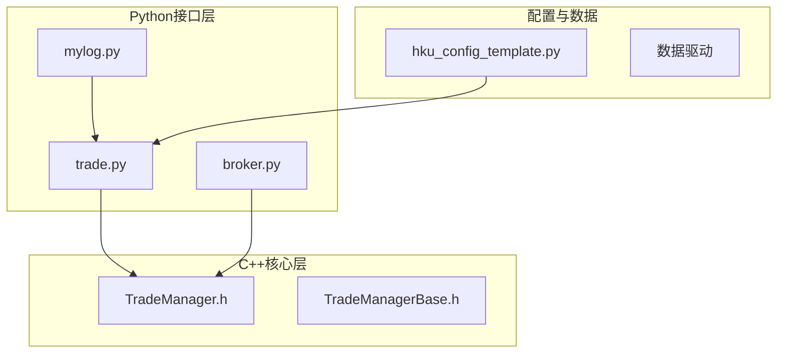
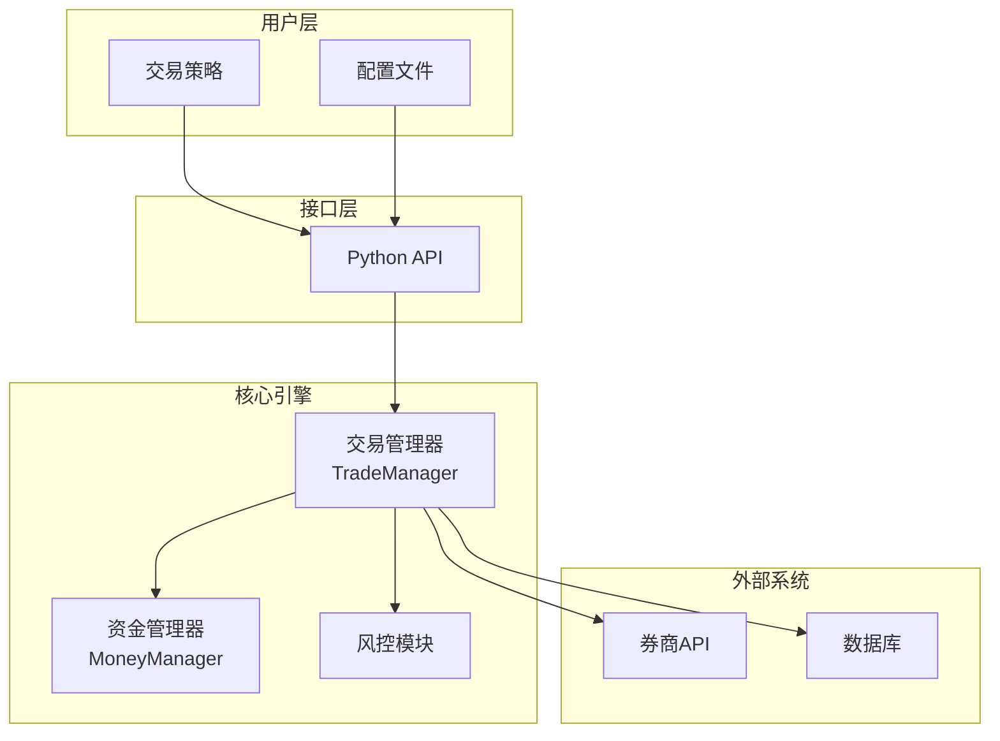
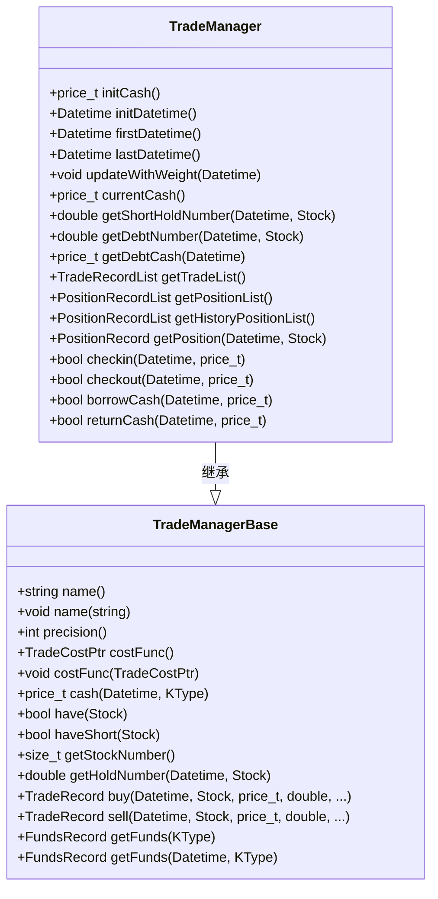
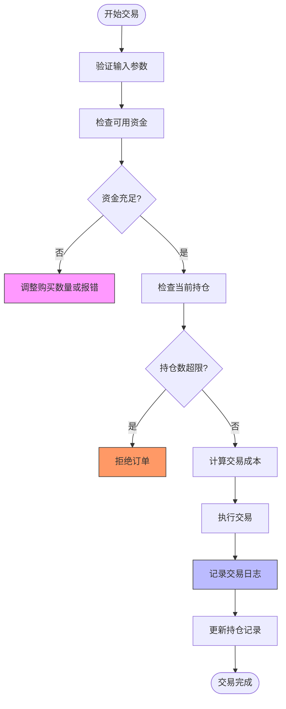
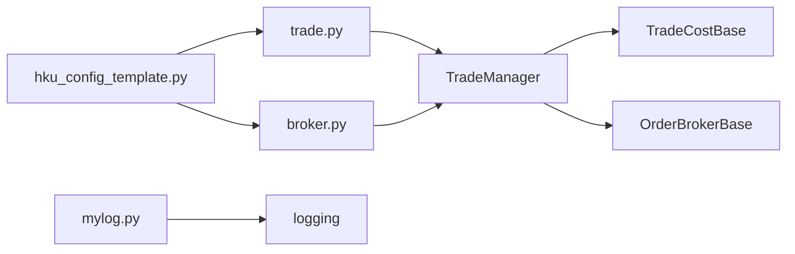

# 风险控制与安全

<cite>
**本文档引用文件**   
- [trade.py](file://hikyuu/trade_manage/trade.py)
- [broker.py](file://hikyuu/trade_manage/broker.py)
- [TradeManager.h](file://hikyuu_cpp/hikyuu/trade_manage/TradeManager.h)
- [TradeManagerBase.h](file://hikyuu_cpp/hikyuu/trade_manage/TradeManagerBase.h)
- [mylog.py](file://hikyuu/util/mylog.py)
- [hku_config_template.py](file://hikyuu/data/hku_config_template.py)
</cite>

## 目录
1. [引言](#引言)
2. [项目结构](#项目结构)
3. [核心组件](#核心组件)
4. [架构概述](#架构概述)
5. [详细组件分析](#详细组件分析)
6. [依赖分析](#依赖分析)
7. [性能考虑](#性能考虑)
8. [故障排除指南](#故障排除指南)
9. [结论](#结论)
10. [附录](#附录)（如有必要）

## 引言
本文档旨在全面阐述Hikyuu量化交易框架中的实盘风险控制与安全策略。基于`trade.py`文件中的交易管理逻辑，详细说明资金校验、持仓检查和订单风控等核心安全机制。文档将解释如何配置最大单笔交易额、最大持仓比例和每日交易限额等关键参数，并介绍交易日志记录、异常熔断和手动干预开关的实现方式。同时，强调资金隔离、API密钥保护和系统监控的重要性，提供设置告警通知和定期审计的实践建议，以确保实盘交易的安全可靠。

## 项目结构
Hikyuu项目采用模块化设计，其核心交易管理功能位于`hikyuu/trade_manage/`目录下。该目录包含交易逻辑的核心实现，如订单代理（broker.py）、交易记录（trade.py）以及与C++核心库的接口。`trade.py`文件主要负责Python层面的交易记录扩展和数据转换功能，而实际的交易执行、资金管理和风险控制逻辑则由底层C++代码（如`TradeManager.h`）实现。日志记录功能由`util/mylog.py`提供，确保所有交易活动都有迹可循。

**图源**
- [trade.py](file://hikyuu/trade_manage/trade.py)
- [broker.py](file://hikyuu/trade_manage/broker.py)
- [TradeManager.h](file://hikyuu_cpp/hikyuu/trade_manage/TradeManager.h)
- [hku_config_template.py](file://hikyuu/data/hku_config_template.py)

**节源**
- [trade.py](file://hikyuu/trade_manage/trade.py#L1-L55)
- [broker.py](file://hikyuu/trade_manage/broker.py#L1-L96)
- [hku_config_template.py](file://hikyuu/data/hku_config_template.py#L1-L339)

## 核心组件
`trade.py`文件是Python层面对交易记录和资金管理功能的扩展。它通过定义`to_np`、`to_df`等方法，为`TradeRecordList`和`PositionRecordList`类提供了便捷的数据转换接口，使其能够无缝集成到pandas等数据分析库中。此外，它还为`Performance`类添加了`to_df`方法，便于将绩效分析结果转换为DataFrame格式进行分析。这些功能虽然不直接涉及风险控制，但为后续的风险分析和审计提供了坚实的数据基础。

**节源**
- [trade.py](file://hikyuu/trade_manage/trade.py#L37-L54)

## 架构概述
Hikyuu的风险控制与安全架构采用分层设计。最上层是Python脚本，用于配置策略和参数；中间层是Python与C++的绑定层，负责调用核心功能；最底层是用C++编写的高性能核心库，实现了所有关键的交易逻辑和风险控制。这种架构既保证了开发的灵活性，又确保了执行的效率和安全性。交易指令从上层发起，经过严格的风控校验后，由底层的`TradeManager`执行，并通过`OrderBroker`与券商API进行交互。

**图源**
- [TradeManager.h](file://hikyuu_cpp/hikyuu/trade_manage/TradeManager.h)
- [TradeManagerBase.h](file://hikyuu_cpp/hikyuu/trade_manage/TradeManagerBase.h)

## 详细组件分析

### 交易管理器分析
`TradeManager`是整个交易系统的核心，负责管理账户的交易记录、资金使用和持仓情况。它继承自`TradeManagerBase`，并实现了具体的交易逻辑。

#### 资金与持仓校验
在执行任何交易操作前，`TradeManager`会进行严格的资金和持仓校验。例如，在`buy`方法中，系统会检查当前现金是否足以支付购买成本（包括价格和交易费用）。如果配置了`auto-checkin`参数，系统会自动补充资金；否则，它会根据可用现金调整购买数量，确保不会发生透支。对于持仓检查，`getStockNumber()`方法会返回当前持有的证券种类数量，可以用来限制最大持仓比例。

**图源**
- [TradeManager.h](file://hikyuu_cpp/hikyuu/trade_manage/TradeManager.h)
- [TradeManagerBase.h](file://hikyuu_cpp/hikyuu/trade_manage/TradeManagerBase.h)

#### 订单风控参数配置
`TradeManager`通过参数化设计支持灵活的风控配置。关键参数包括：
- **最大单笔交易额**：可以通过`MoneyManager`中的`max-stock`参数来限制单个证券的最大持仓数量，间接控制单笔交易额。
- **最大持仓比例**：通过`getStockNumber()`获取当前持仓数，并与预设的上限进行比较，实现比例控制。
- **每日交易限额**：虽然没有直接的每日限额参数，但可以通过在策略层面记录每日交易总额，并在超过阈值时停止交易来实现。

**节源**
- [TradeManager.h](file://hikyuu_cpp/hikyuu/trade_manage/TradeManager.h#L35-L495)
- [TradeManagerBase.h](file://hikyuu_cpp/hikyuu/trade_manage/TradeManagerBase.h#L34-L800)

### 日志记录与异常处理分析
系统的安全性和可审计性依赖于完善的日志记录和异常处理机制。

#### 交易日志记录
`util/mylog.py`文件提供了强大的日志记录功能。它使用Python的`logging`模块，并配置了文件处理器`RotatingFileHandler`，将日志输出到`~/.hikyuu/hikyuu_py.log`文件中。日志级别包括DEBUG、INFO、WARNING、ERROR和CRITICAL，便于不同场景下的调试和监控。所有交易操作，如买入、卖出，都会通过`hku_info`、`hku_warn`等函数记录到日志中，包含操作时间、证券代码、价格、数量等关键信息。

**图源**
- [mylog.py](file://hikyuu/util/mylog.py)
- [TradeManager.h](file://hikyuu_cpp/hikyuu/trade_manage/TradeManager.h)

#### 异常熔断与手动干预
系统通过参数`support_borrow_cash`和`support_borrow_stock`来控制是否允许融资融券，这是一种内置的“熔断”机制，防止在极端情况下产生过大的风险敞口。当这些参数设置为`false`时，系统将严格限制在自有资金和证券范围内进行交易。此外，`OrderBrokerWrap`类提供了一个包装器，允许用户在订单代理前后加入自定义的处理逻辑，这可以用来实现手动干预开关。例如，可以在`_buy`方法中加入一个全局开关变量，当开关关闭时，直接返回而不执行实际的买入操作。

**节源**
- [mylog.py](file://hikyuu/util/mylog.py#L1-L292)
- [broker.py](file://hikyuu/trade_manage/broker.py#L37-L95)

## 依赖分析
Hikyuu的交易管理模块依赖于多个内部和外部组件。核心依赖是C++实现的`TradeManager`和`TradeManagerBase`，它们提供了所有底层的交易逻辑。`broker.py`依赖于`OrderBrokerBase`，用于与外部券商系统进行交互。日志功能依赖于Python标准库的`logging`模块。配置文件`hku_config_template.py`定义了系统的默认配置，是系统初始化的重要依赖。

**图源**
- [trade.py](file://hikyuu/trade_manage/trade.py)
- [broker.py](file://hikyuu/trade_manage/broker.py)
- [mylog.py](file://hikyuu/util/mylog.py)
- [hku_config_template.py](file://hikyuu/data/hku_config_template.py)

**节源**
- [trade.py](file://hikyuu/trade_manage/trade.py)
- [broker.py](file://hikyuu/trade_manage/broker.py)
- [mylog.py](file://hikyuu/util/mylog.py)
- [hku_config_template.py](file://hikyuu/data/hku_config_template.py)

## 性能考虑
由于核心交易逻辑由C++实现，Hikyuu在处理大量交易时具有很高的性能。Python层主要负责配置和数据转换，对性能影响较小。日志记录使用了文件处理器，并设置了合理的日志级别（默认为WARN），避免了过多的I/O操作影响交易执行速度。资金和持仓的校验逻辑高效，通常在O(1)或O(log n)时间内完成。

## 故障排除指南
当遇到交易问题时，应首先检查日志文件`~/.hikyuu/hikyuu_py.log`。常见的错误包括：
- **资金不足**：日志中会记录`Ignore! Is less than the minimum number of transactions`或类似的警告，表明因资金不足而无法完成交易。
- **持仓超限**：如果触发了`max-stock`限制，日志会显示`Ignore! TM had max-stock number!`。
- **API连接失败**：在`OrderBroker`执行操作时，如果与券商API通信失败，会抛出异常并被`hku_error`记录。
- **参数配置错误**：检查`hikyuu.ini`配置文件，确保`support_borrow_cash`、`auto-checkin`等关键风控参数设置正确。

**节源**
- [mylog.py](file://hikyuu/util/mylog.py#L113-L161)
- [TradeManagerBase.h](file://hikyuu_cpp/hikyuu/trade_manage/TradeManagerBase.h#L115-L155)

## 结论
Hikyuu框架通过分层架构和模块化设计，构建了一套全面且灵活的实盘风险控制与安全体系。其核心在于C++实现的`TradeManager`，它提供了坚实的资金、持仓和交易管理基础。Python层则提供了便捷的配置和扩展接口。通过合理的参数配置，可以实现对最大单笔交易额、最大持仓比例等风险的控制。完善的日志记录和异常处理机制确保了系统的可审计性和稳定性。结合资金隔离、API密钥保护和系统监控的最佳实践，Hikyuu能够为实盘交易提供一个安全可靠的运行环境。