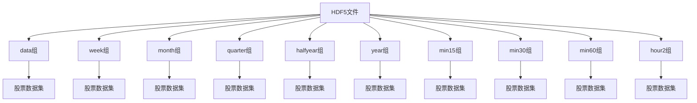
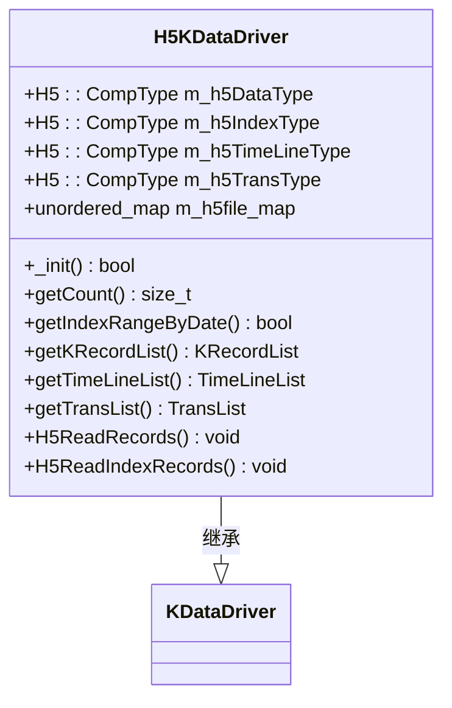
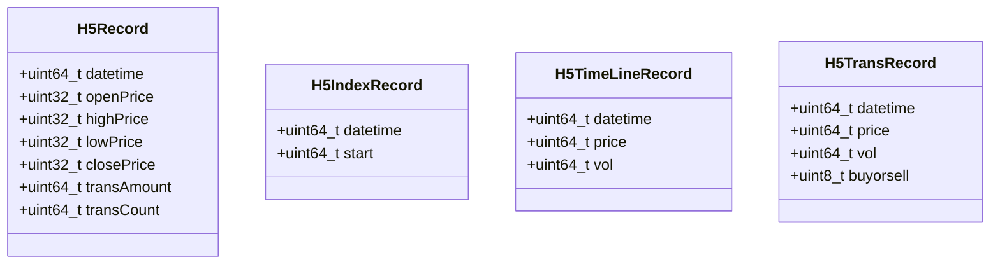
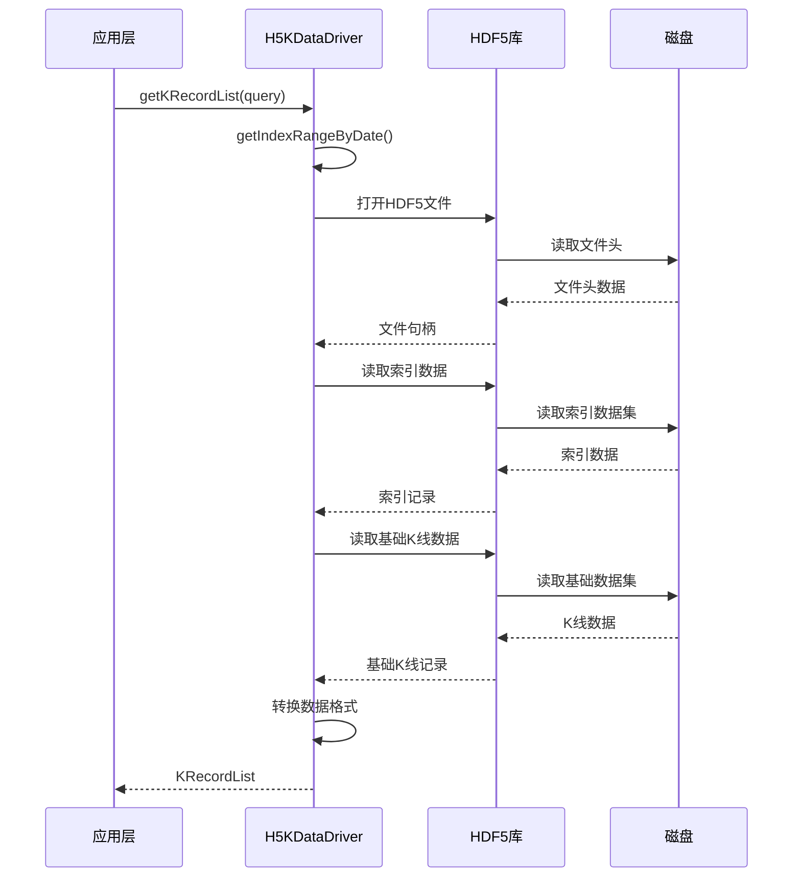
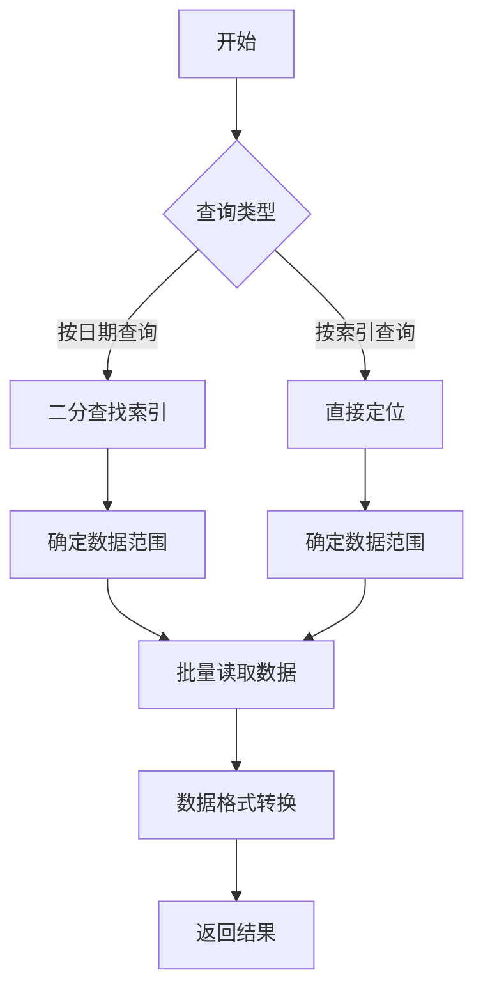
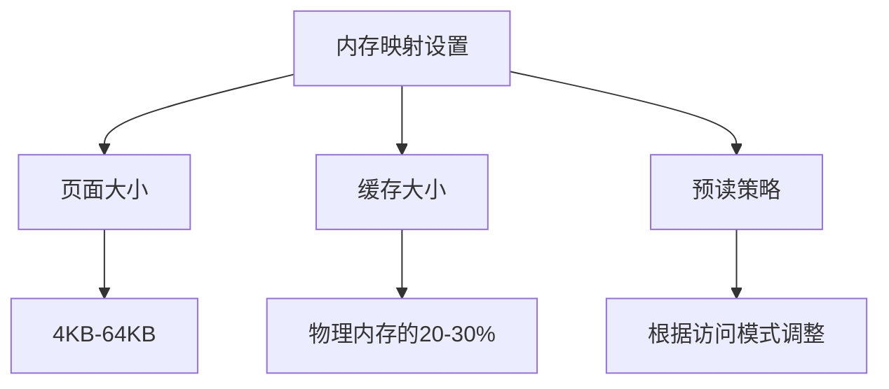
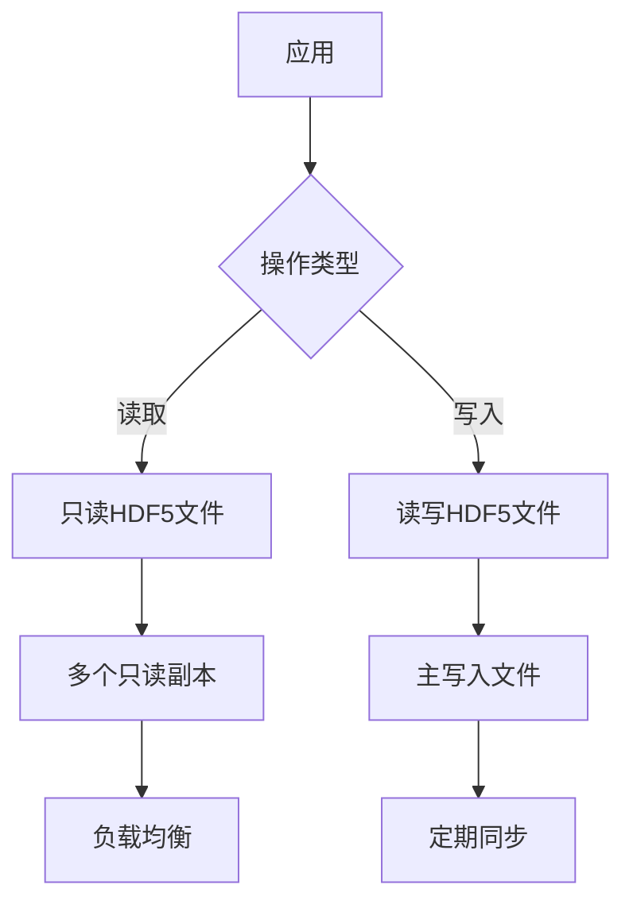

# HDF5存储优化

<cite>
**本文档引用文件**   
- [H5KDataDriver.h](file://hikyuu_cpp/hikyuu/data_driver/kdata/hdf5/H5KDataDriver.h)
- [H5KDataDriver.cpp](file://hikyuu_cpp/hikyuu/data_driver/kdata/hdf5/H5KDataDriver.cpp)
- [H5Record.h](file://hikyuu_cpp/hikyuu/data_driver/kdata/hdf5/H5Record.h)
- [common_h5.py](file://hikyuu/data/common_h5.py)
- [pytdx_to_h5.py](file://hikyuu/data/pytdx_to_h5.py)
</cite>

## 目录
1. [引言](#引言)
2. [HDF5文件组织结构](#hdf5文件组织结构)
3. [H5KDataDriver实现机制](#h5kdatadriver实现机制)
4. [数据压缩与分块策略](#数据压缩与分块策略)
5. [性能特征分析](#性能特征分析)
6. [最优参数配置建议](#最优参数配置建议)
7. [高并发访问调优方案](#高并发访问调优方案)
8. [结论](#结论)

## 引言
HDF5（Hierarchical Data Format version 5）作为一种高性能科学数据存储格式，在金融数据存储领域展现出显著优势。本文深入分析HDF5作为高性能数据存储后端的技术优势，重点阐述H5KDataDriver的实现机制和性能特征。通过详细说明HDF5文件的组织结构、数据压缩策略、分块配置对读写性能的影响，为大规模K线数据存储提供最优参数配置建议。

## HDF5文件组织结构

HDF5采用层次化数据模型，将数据组织为组（Group）和数据集（Dataset）的树状结构。在Hikyuu系统中，HDF5文件的组织结构经过精心设计，以优化K线数据的存储和访问效率。



**图示来源**
- [H5KDataDriver.cpp](file://hikyuu_cpp/hikyuu/data_driver/kdata/hdf5/H5KDataDriver.cpp#L230-L266)
- [common_h5.py](file://hikyuu/data/common_h5.py#L77-L291)

**HDF5文件结构特点：**
- **根组下按K线类型分组**：不同周期的K线数据存储在不同的组中，如日线存储在"data"组，周线存储在"week"组
- **股票数据集命名**：每个股票的数据集以"市场代码+股票代码"命名，如"SH600000"
- **扩展K线索引**：周线、月线等扩展周期K线通过索引方式存储，包含datetime和start两个字段

**Section sources**
- [H5KDataDriver.cpp](file://hikyuu_cpp/hikyuu/data_driver/kdata/hdf5/H5KDataDriver.cpp#L230-L266)
- [common_h5.py](file://hikyuu/data/common_h5.py#L77-L291)

## H5KDataDriver实现机制

H5KDataDriver是Hikyuu系统中基于HDF5的K线数据驱动实现，封装了HDF5的复杂API，提供了高效的数据访问接口。

### 核心类结构


**图示来源**
- [H5KDataDriver.h](file://hikyuu_cpp/hikyuu/data_driver/kdata/hdf5/H5KDataDriver.h#L17-L85)
- [H5Record.h](file://hikyuu_cpp/hikyuu/data_driver/kdata/hdf5/H5Record.h#L20-L46)

### 数据记录结构
H5KDataDriver定义了多种数据记录结构，用于存储不同类型的金融数据：



**图示来源**
- [H5Record.h](file://hikyuu_cpp/hikyuu/data_driver/kdata/hdf5/H5Record.h#L20-L46)

### 数据访问流程


**图示来源**
- [H5KDataDriver.cpp](file://hikyuu_cpp/hikyuu/data_driver/kdata/hdf5/H5KDataDriver.cpp#L540-L586)
- [H5KDataDriver.cpp](file://hikyuu_cpp/hikyuu/data_driver/kdata/hdf5/H5KDataDriver.cpp#L638-L715)

**Section sources**
- [H5KDataDriver.h](file://hikyuu_cpp/hikyuu/data_driver/kdata/hdf5/H5KDataDriver.h#L17-L85)
- [H5KDataDriver.cpp](file://hikyuu_cpp/hikyuu/data_driver/kdata/hdf5/H5KDataDriver.cpp#L540-L586)
- [H5Record.h](file://hikyuu_cpp/hikyuu/data_driver/kdata/hdf5/H5Record.h#L20-L46)

## 数据压缩与分块策略

HDF5的压缩和分块策略是其高性能的关键因素，直接影响数据的存储效率和访问速度。

### 数据压缩策略
Hikyuu系统采用zlib压缩算法，压缩级别设置为9（最高级别），以最大化压缩比：

```python
filters=tb.Filters(complevel=HDF5_COMPRESS_LEVEL, complib='zlib', shuffle=True)
```

其中shuffle过滤器在压缩前重新排列数据，提高压缩效率，特别适合数值数据。

### 分块策略
HDF5的分块（chunking）机制将数据集划分为固定大小的块，每个块独立压缩和存储。分块大小的选择对性能有重要影响：

- **小块大小**：适合随机访问，但压缩效率较低
- **大块大小**：压缩效率高，但随机访问时需要读取更多数据

在Hikyuu系统中，分块策略根据数据访问模式进行优化：
- **基础K线数据**：采用较大的块大小，优化顺序读取性能
- **索引数据**：采用较小的块大小，优化随机访问性能

### 分块配置对性能的影响
分块配置对读写性能的影响主要体现在以下几个方面：

1. **I/O效率**：合适的块大小可以减少I/O操作次数
2. **内存使用**：块大小影响缓存效率和内存占用
3. **压缩效率**：较大的块通常有更好的压缩比
4. **并发访问**：合理的分块可以减少锁竞争

**Section sources**
- [common_h5.py](file://hikyuu/data/common_h5.py#L31)
- [common_h5.py](file://hikyuu/data/common_h5.py#L79-L81)

## 性能特征分析

H5KDataDriver的性能特征主要体现在数据读取效率、内存使用和并发访问能力等方面。

### 数据读取性能
H5KDataDriver通过以下机制优化数据读取性能：

1. **二分查找索引**：在`_getBaseIndexRangeByDate`方法中使用二分查找快速定位数据范围
2. **批量读取**：使用HDF5的hyperslab选择机制批量读取连续数据
3. **文件缓存**：使用`m_h5file_map`缓存已打开的HDF5文件，避免重复打开



**图示来源**
- [H5KDataDriver.cpp](file://hikyuu_cpp/hikyuu/data_driver/kdata/hdf5/H5KDataDriver.cpp#L321-L437)
- [H5KDataDriver.cpp](file://hikyuu_cpp/hikyuu/data_driver/kdata/hdf5/H5KDataDriver.cpp#L591-L636)

### 内存映射与缓存
HDF5库内部使用内存映射和缓存机制来提高性能：

- **对象缓存**：缓存组、数据集等元数据对象
- **数据缓存**：缓存最近访问的数据块
- **预读机制**：预测后续访问模式，提前加载数据

### 并发访问性能
H5KDataDriver的并发访问性能受HDF5库线程安全特性的影响：

```c++
virtual bool canParallelLoad() override {
#if defined(H5_HAVE_THREADSAFE)
    return true;
#else
    HKU_WARN("Current hdf5 library is not thread-safe!");
    return false;
#endif
}
```

当HDF5库支持线程安全时，H5KDataDriver可以安全地在多线程环境中使用。

**Section sources**
- [H5KDataDriver.cpp](file://hikyuu_cpp/hikyuu/data_driver/kdata/hdf5/H5KDataDriver.cpp#L321-L437)
- [H5KDataDriver.h](file://hikyuu_cpp/hikyuu/data_driver/kdata/hdf5/H5KDataDriver.h#L32-L38)

## 最优参数配置建议

针对大规模K线数据存储，提出以下最优HDF5参数配置建议：

### 块大小配置
| K线类型 | 推荐块大小 | 说明 |
|--------|-----------|------|
| 日线 | 1024-2048 | 平衡压缩效率和访问性能 |
| 分钟线 | 512-1024 | 考虑到数据量较大 |
| 5分钟线 | 256-512 | 高频数据，较小块大小 |
| 周线/月线 | 64-128 | 索引数据，小块大小 |

### 压缩算法选择
- **zlib**：推荐使用，压缩比高，CPU开销适中
- **blosc**：如果CPU资源充足，可考虑使用，压缩速度更快
- **lzf**：如果压缩速度是首要考虑因素

### 内存映射设置


**最优配置建议：**
- **页面大小**：设置为4KB或8KB，与操作系统页面大小匹配
- **缓存大小**：设置为系统物理内存的20-30%
- **预读策略**：对于顺序访问模式，启用预读；对于随机访问，禁用预读

### 文件组织优化
1. **按市场分离文件**：将不同市场的数据存储在不同文件中，减少单个文件大小
2. **按时间分区**：对于超大规模数据，可按年或季度分区存储
3. **索引优化**：定期重建索引，保持索引效率

**Section sources**
- [H5KDataDriver.cpp](file://hikyuu_cpp/hikyuu/data_driver/kdata/hdf5/H5KDataDriver.cpp#L76-L92)
- [common_h5.py](file://hikyuu/data/common_h5.py#L79-L81)

## 高并发访问调优方案

在高并发访问场景下，需要采取特定的调优方案来保证系统性能。

### 连接池管理
H5KDataDriver使用文件映射缓存来管理HDF5文件连接：

```c++
unordered_map<string, H5FilePtr> m_h5file_map; // key: market+code
```

**优化建议：**
- **限制缓存大小**：避免内存过度占用
- **LRU淘汰策略**：使用最近最少使用策略淘汰不常用的文件
- **连接复用**：避免频繁打开和关闭文件

### 读写分离
在高并发场景下，建议采用读写分离架构：



### 并发控制
当HDF5库不支持线程安全时，需要在应用层实现并发控制：

1. **读写锁**：允许多个读操作并发，但写操作独占
2. **读写分离**：将读操作和写操作分离到不同线程或进程
3. **异步I/O**：使用异步I/O避免阻塞主线程

### 性能监控
建立完善的性能监控体系：

| 监控指标 | 目标值 | 监控方法 |
|--------|------|--------|
| 文件打开时间 | < 100ms | 记录文件打开耗时 |
| 数据读取速度 | > 100MB/s | 记录数据读取吞吐量 |
| CPU使用率 | < 70% | 系统级监控 |
| 内存使用 | 稳定增长 | 内存泄漏检测 |

**Section sources**
- [H5KDataDriver.h](file://hikyuu_cpp/hikyuu/data_driver/kdata/hdf5/H5KDataDriver.h#L84)
- [H5KDataDriver.h](file://hikyuu_cpp/hikyuu/data_driver/kdata/hdf5/H5KDataDriver.h#L32-L38)

## 结论
HDF5作为高性能数据存储后端，在Hikyuu系统中展现出显著优势。通过H5KDataDriver的精心设计，实现了高效的数据存储和访问。合理的分块配置、压缩策略和内存映射设置，可以显著提升大规模K线数据的存储效率和访问性能。在高并发访问场景下，通过连接池管理、读写分离和并发控制等调优方案，可以保证系统的稳定性和高性能。未来可以进一步探索Blosc等现代压缩算法，以及分布式HDF5存储方案，以应对更大规模的数据处理需求。