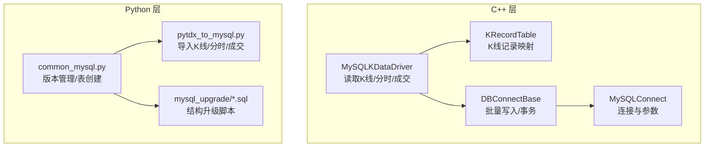
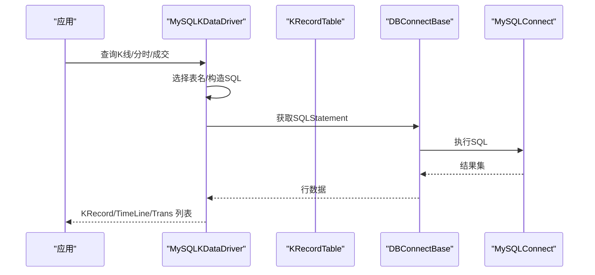
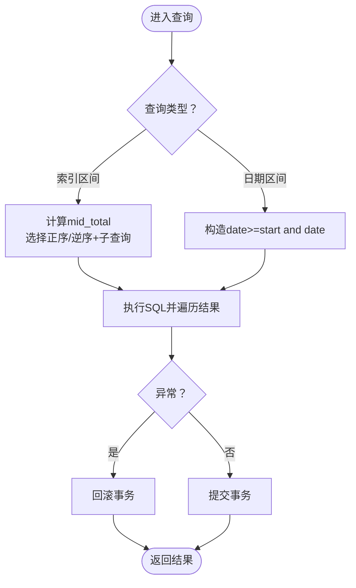
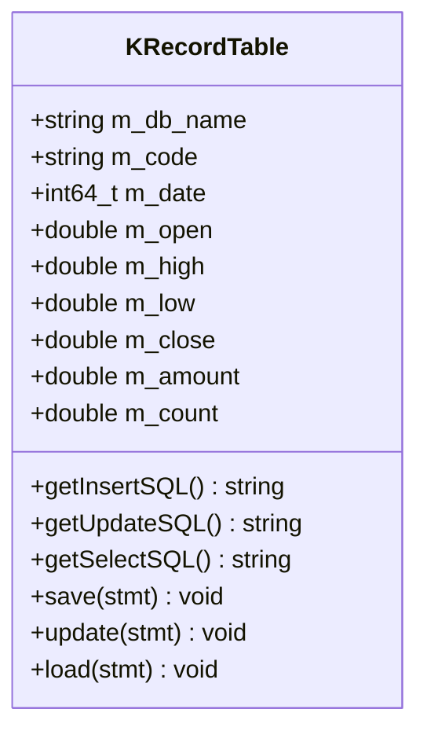
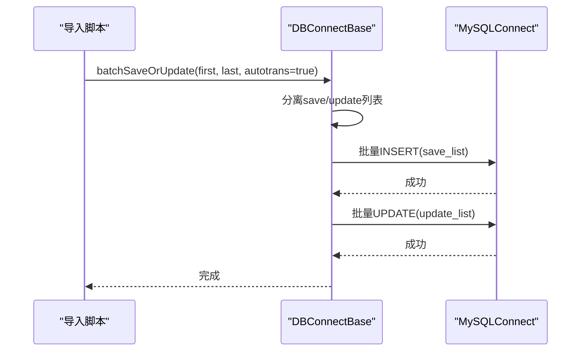
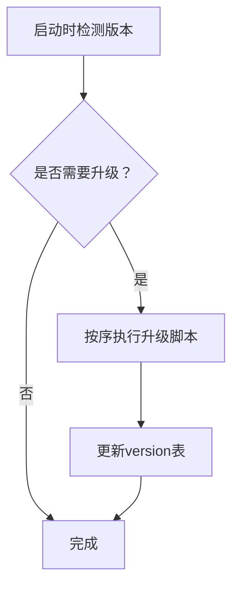
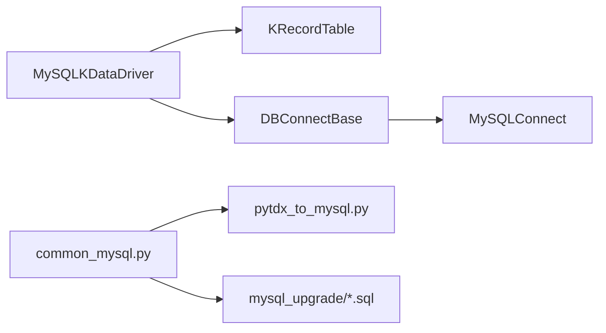

# MySQL存储优化

<cite>
**本文引用的文件**
- [MySQLKDataDriver.cpp](file://hikyuu_cpp/hikyuu/data_driver/kdata/mysql/MySQLKDataDriver.cpp)
- [KRecordTable.h](file://hikyuu_cpp/hikyuu/data_driver/kdata/mysql/KRecordTable.h)
- [DBConnectBase.h](file://hikyuu_cpp/hikyuu/utilities/db_connect/DBConnectBase.h)
- [MySQLConnect.cpp](file://hikyuu_cpp/hikyuu/utilities/db_connect/mysql/MySQLConnect.cpp)
- [common_mysql.py](file://hikyuu/data/common_mysql.py)
- [pytdx_to_mysql.py](file://hikyuu/data/pytdx_to_mysql.py)
- [0001.sql](file://hikyuu/data/mysql_upgrade/0001.sql)
- [0010.sql](file://hikyuu/data/mysql_upgrade/0010.sql)
- [0020.sql](file://hikyuu/data/mysql_upgrade/0020.sql)
- [createdb.sql](file://hikyuu/data/mysql_upgrade/createdb.sql)
- [hku_config_template.py](file://hikyuu/data/hku_config_template.py)
</cite>

## 目录
1. [简介](#简介)
2. [项目结构与入口](#项目结构与入口)
3. [核心组件](#核心组件)
4. [架构总览](#架构总览)
5. [详细组件分析](#详细组件分析)
6. [依赖关系分析](#依赖关系分析)
7. [性能优化要点](#性能优化要点)
8. [故障排查指南](#故障排查指南)
9. [结论](#结论)
10. [附录](#附录)

## 简介
本文件系统性阐述基于MySQL的K线与分时/成交数据存储后端的性能优化方法，围绕以下目标展开：
- 解析MySQLKDataDriver的实现原理与数据访问路径
- 深入剖析KRecordTable的表结构设计与索引策略（主键、复合索引、分区键选择）
- 总结批量写入（含INSERT ... ON DUPLICATE KEY UPDATE）的优化技巧
- 给出数据库配置参数调优建议（如innodb_buffer_pool_size）
- 说明mysql_upgrade目录下SQL脚本在结构升级与数据迁移中的作用
- 对比不同索引方案的查询性能，指导构建高效MySQL存储环境

## 项目结构与入口
MySQL存储相关的代码主要分布在如下位置：
- C++层：数据驱动与数据库连接封装
  - hikyuu_cpp/hikyuu/data_driver/kdata/mysql：K线驱动与KRecordTable定义
  - hikyuu_cpp/hikyuu/utilities/db_connect：通用数据库连接基类与MySQL连接实现
- Python层：数据库初始化、表结构创建与数据导入
  - hikyuu/data/common_mysql.py：数据库版本管理、表创建与扩展数据索引更新
  - hikyuu/data/pytdx_to_mysql.py：从通达信源导入K线、分时、成交数据
  - hikyuu/data/mysql_upgrade：结构升级脚本（按版本号顺序执行）

图表来源
- [MySQLKDataDriver.cpp](file://hikyuu_cpp/hikyuu/data_driver/kdata/mysql/MySQLKDataDriver.cpp#L1-L120)
- [KRecordTable.h](file://hikyuu_cpp/hikyuu/data_driver/kdata/mysql/KRecordTable.h#L110-L140)
- [DBConnectBase.h](file://hikyuu_cpp/hikyuu/utilities/db_connect/DBConnectBase.h#L494-L542)
- [MySQLConnect.cpp](file://hikyuu_cpp/hikyuu/utilities/db_connect/mysql/MySQLConnect.cpp#L1-L52)
- [common_mysql.py](file://hikyuu/data/common_mysql.py#L60-L120)
- [pytdx_to_mysql.py](file://hikyuu/data/pytdx_to_mysql.py#L497-L540)
- [0001.sql](file://hikyuu/data/mysql_upgrade/0001.sql#L1-L5)

章节来源
- [MySQLKDataDriver.cpp](file://hikyuu_cpp/hikyuu/data_driver/kdata/mysql/MySQLKDataDriver.cpp#L1-L120)
- [common_mysql.py](file://hikyuu/data/common_mysql.py#L60-L120)
- [pytdx_to_mysql.py](file://hikyuu/data/pytdx_to_mysql.py#L497-L540)

## 核心组件
- MySQLKDataDriver：负责根据KQuery参数选择表名、执行查询与事务控制，支持按索引区间与按日期区间的读取。
- KRecordTable：将KRecord对象映射到MySQL表字段，提供INSERT/UPDATE/SELECT SQL模板与绑定方法。
- DBConnectBase：提供批量写入、批量更新、批量删除等通用能力，支持自动事务。
- MySQLConnect：MySQL连接封装，负责连接参数解析与连接生命周期。
- Python侧工具：common_mysql.py负责数据库初始化与版本管理；pytdx_to_mysql.py负责从通达信源导入数据并创建表结构。

章节来源
- [MySQLKDataDriver.cpp](file://hikyuu_cpp/hikyuu/data_driver/kdata/mysql/MySQLKDataDriver.cpp#L37-L83)
- [KRecordTable.h](file://hikyuu_cpp/hikyuu/data_driver/kdata/mysql/KRecordTable.h#L110-L140)
- [DBConnectBase.h](file://hikyuu_cpp/hikyuu/utilities/db_connect/DBConnectBase.h#L494-L542)
- [MySQLConnect.cpp](file://hikyuu_cpp/hikyuu/utilities/db_connect/mysql/MySQLConnect.cpp#L1-L52)
- [common_mysql.py](file://hikyuu/data/common_mysql.py#L150-L210)
- [pytdx_to_mysql.py](file://hikyuu/data/pytdx_to_mysql.py#L497-L540)

## 架构总览
MySQLKDataDriver通过KRecordTable生成SQL模板，借助DBConnectBase完成批量写入与事务管理；Python侧通过common_mysql.py与pytdx_to_mysql.py完成数据库初始化、表结构创建与数据导入。

图表来源
- [MySQLKDataDriver.cpp](file://hikyuu_cpp/hikyuu/data_driver/kdata/mysql/MySQLKDataDriver.cpp#L131-L164)
- [KRecordTable.h](file://hikyuu_cpp/hikyuu/data_driver/kdata/mysql/KRecordTable.h#L110-L140)
- [DBConnectBase.h](file://hikyuu_cpp/hikyuu/utilities/db_connect/DBConnectBase.h#L494-L542)
- [MySQLConnect.cpp](file://hikyuu_cpp/hikyuu/utilities/db_connect/mysql/MySQLConnect.cpp#L1-L52)

## 详细组件分析

### MySQLKDataDriver 实现原理
- 表名选择：根据市场、代码与K线周期（分钟、日线等）动态拼接schema与表名，统一转小写以兼容大小写敏感场景。
- 查询路径：
  - K线：支持按索引区间与按日期区间两种查询模式，内部根据总记录数与区间位置选择正序或逆序+子查询的方式，减少全表扫描。
  - 分时/成交：同样支持索引与日期两种查询，使用事务包裹保证一致性。
- 事务控制：读取分时/成交与索引区间查询均显式开启事务，异常时回滚，避免部分数据写入导致的数据不一致。

图表来源
- [MySQLKDataDriver.cpp](file://hikyuu_cpp/hikyuu/data_driver/kdata/mysql/MySQLKDataDriver.cpp#L85-L129)
- [MySQLKDataDriver.cpp](file://hikyuu_cpp/hikyuu/data_driver/kdata/mysql/MySQLKDataDriver.cpp#L131-L164)
- [MySQLKDataDriver.cpp](file://hikyuu_cpp/hikyuu/data_driver/kdata/mysql/MySQLKDataDriver.cpp#L221-L338)
- [MySQLKDataDriver.cpp](file://hikyuu_cpp/hikyuu/data_driver/kdata/mysql/MySQLKDataDriver.cpp#L340-L460)

章节来源
- [MySQLKDataDriver.cpp](file://hikyuu_cpp/hikyuu/data_driver/kdata/mysql/MySQLKDataDriver.cpp#L37-L83)
- [MySQLKDataDriver.cpp](file://hikyuu_cpp/hikyuu/data_driver/kdata/mysql/MySQLKDataDriver.cpp#L85-L129)
- [MySQLKDataDriver.cpp](file://hikyuu_cpp/hikyuu/data_driver/kdata/mysql/MySQLKDataDriver.cpp#L131-L164)
- [MySQLKDataDriver.cpp](file://hikyuu_cpp/hikyuu/data_driver/kdata/mysql/MySQLKDataDriver.cpp#L221-L338)
- [MySQLKDataDriver.cpp](file://hikyuu_cpp/hikyuu/data_driver/kdata/mysql/MySQLKDataDriver.cpp#L340-L460)

### KRecordTable 表结构设计与索引策略
- 字段映射：date、open、high、low、close、amount、count，其中date作为主键，确保唯一性与时序有序。
- SQL模板：
  - INSERT模板：按字段顺序绑定，便于批量写入
  - UPDATE模板：按字段顺序绑定，WHERE使用date
  - SELECT模板：按字段顺序读取
- 索引策略建议：
  - 主键：date（BIGINT UNSIGNED），覆盖时间序列主键，适合范围查询与自增特性
  - 复合索引：若需按“日期区间”频繁查询，可考虑(date)作为主键已覆盖；若需要按“多维过滤”，可在业务层增加辅助列并建立复合索引（例如(date, code)或(date, market)）
  - 分区键选择：按date进行范围分区（如按年/月）可显著提升大表的扫描效率与维护性

图表来源
- [KRecordTable.h](file://hikyuu_cpp/hikyuu/data_driver/kdata/mysql/KRecordTable.h#L110-L140)
- [KRecordTable.h](file://hikyuu_cpp/hikyuu/data_driver/kdata/mysql/KRecordTable.h#L145-L160)

章节来源
- [KRecordTable.h](file://hikyuu_cpp/hikyuu/data_driver/kdata/mysql/KRecordTable.h#L110-L140)
- [KRecordTable.h](file://hikyuu_cpp/hikyuu/data_driver/kdata/mysql/KRecordTable.h#L145-L160)

### 批量写入与INSERT ... ON DUPLICATE KEY UPDATE 优化
- 批量写入：DBConnectBase提供batchSave、batchUpdate、batchSaveOrUpdate等模板方法，支持自动事务与错误回滚。
- 写入路径：
  - Python侧导入脚本直接使用executemany批量INSERT，适合首次导入或增量追加
  - 扩展数据索引更新采用先收集缓冲，再批量UPDATE/INSERT，减少往返次数
- 优化建议：
  - 使用批量INSERT减少网络往返
  - 在需要幂等写入时，结合ON DUPLICATE KEY UPDATE，避免重复主键冲突
  - 将INSERT与UPDATE拆分为两个阶段（先保存，再更新），可降低锁竞争与死锁概率

图表来源
- [DBConnectBase.h](file://hikyuu_cpp/hikyuu/utilities/db_connect/DBConnectBase.h#L528-L542)
- [pytdx_to_mysql.py](file://hikyuu/data/pytdx_to_mysql.py#L497-L540)

章节来源
- [DBConnectBase.h](file://hikyuu_cpp/hikyuu/utilities/db_connect/DBConnectBase.h#L494-L542)
- [DBConnectBase.h](file://hikyuu_cpp/hikyuu/utilities/db_connect/DBConnectBase.h#L528-L542)
- [pytdx_to_mysql.py](file://hikyuu/data/pytdx_to_mysql.py#L497-L540)

### 数据库配置参数调优建议
- innodb_buffer_pool_size：根据可用内存与数据量设置，建议占物理内存的50%-70%，确保热点数据常驻缓存
- innodb_log_file_size：增大可减少检查点频率，提高写入吞吐
- innodb_flush_log_at_trx_commit：生产环境可设为1或2，兼顾可靠性与性能
- sort_buffer_size、read_buffer_size：针对排序与顺序读取场景适当增大
- tmp_table_size、max_heap_table_size：提升临时表性能，避免磁盘临时表
- query_cache_size：MySQL 8.0已移除，建议改用查询缓存替代方案或应用层缓存

[本节为通用建议，不直接分析具体文件]

### mysql_upgrade 目录下的SQL脚本作用
- 版本管理：通过hku_base.version表记录当前数据库版本，按顺序执行升级脚本
- 基础表创建：createdb.sql创建基础库与常用表（如market、stock、stocktypeinfo等）
- 功能增强：0010.sql引入block表并添加复合索引；0020.sql更新市场收盘时间字段
- 升级流程：common_mysql.py在启动时检测版本并按顺序执行未执行的升级脚本

图表来源
- [common_mysql.py](file://hikyuu/data/common_mysql.py#L60-L120)
- [0001.sql](file://hikyuu/data/mysql_upgrade/0001.sql#L1-L5)
- [0010.sql](file://hikyuu/data/mysql_upgrade/0010.sql#L1-L5)
- [0020.sql](file://hikyuu/data/mysql_upgrade/0020.sql#L1-L4)

章节来源
- [common_mysql.py](file://hikyuu/data/common_mysql.py#L60-L120)
- [0001.sql](file://hikyuu/data/mysql_upgrade/0001.sql#L1-L5)
- [0010.sql](file://hikyuu/data/mysql_upgrade/0010.sql#L1-L5)
- [0020.sql](file://hikyuu/data/mysql_upgrade/0020.sql#L1-L4)
- [createdb.sql](file://hikyuu/data/mysql_upgrade/createdb.sql#L1-L120)

## 依赖关系分析
- MySQLKDataDriver依赖KRecordTable生成SQL模板，依赖DBConnectBase执行SQL与事务控制，依赖MySQLConnect建立连接
- Python侧common_mysql.py与pytdx_to_mysql.py共同完成数据库初始化、表结构创建与数据导入
- mysql_upgrade脚本与Python侧版本管理配合，确保结构演进与数据迁移

图表来源
- [MySQLKDataDriver.cpp](file://hikyuu_cpp/hikyuu/data_driver/kdata/mysql/MySQLKDataDriver.cpp#L1-L40)
- [KRecordTable.h](file://hikyuu_cpp/hikyuu/data_driver/kdata/mysql/KRecordTable.h#L110-L140)
- [DBConnectBase.h](file://hikyuu_cpp/hikyuu/utilities/db_connect/DBConnectBase.h#L494-L542)
- [MySQLConnect.cpp](file://hikyuu_cpp/hikyuu/utilities/db_connect/mysql/MySQLConnect.cpp#L1-L52)
- [common_mysql.py](file://hikyuu/data/common_mysql.py#L60-L120)
- [pytdx_to_mysql.py](file://hikyuu/data/pytdx_to_mysql.py#L497-L540)

章节来源
- [MySQLKDataDriver.cpp](file://hikyuu_cpp/hikyuu/data_driver/kdata/mysql/MySQLKDataDriver.cpp#L1-L40)
- [DBConnectBase.h](file://hikyuu_cpp/hikyuu/utilities/db_connect/DBConnectBase.h#L494-L542)
- [common_mysql.py](file://hikyuu/data/common_mysql.py#L60-L120)

## 性能优化要点
- 查询路径优化
  - 按索引区间查询时，优先选择靠近数据中间位置的区间，减少逆序扫描；对大表采用“逆序limit+正序limit”的组合方式
  - 日期区间查询使用主键date，避免额外索引；若需多维过滤，考虑在业务层增加辅助列并建立复合索引
- 写入路径优化
  - 批量写入：使用executemany或DBConnectBase的batchSave/batchUpdate，减少网络往返
  - 幂等写入：在需要时使用INSERT ... ON DUPLICATE KEY UPDATE，避免重复主键冲突
  - 分阶段写入：先批量INSERT，再批量UPDATE，降低锁竞争
- 存储引擎与分区
  - 主键为date的表适合InnoDB；若数据量极大且按时间分区，可考虑按年/月进行范围分区
  - 对于历史归档数据，可启用压缩与只读副本，降低在线写入压力
- 连接与事务
  - 合理使用事务边界，避免长事务占用锁资源
  - 连接池参数与超时设置应与业务并发匹配

章节来源
- [MySQLKDataDriver.cpp](file://hikyuu_cpp/hikyuu/data_driver/kdata/mysql/MySQLKDataDriver.cpp#L85-L129)
- [DBConnectBase.h](file://hikyuu_cpp/hikyuu/utilities/db_connect/DBConnectBase.h#L494-L542)
- [pytdx_to_mysql.py](file://hikyuu/data/pytdx_to_mysql.py#L497-L540)

## 故障排查指南
- 连接问题
  - 检查MySQLConnect参数（host/port/usr/pwd），确认连接字符串正确
  - 使用tryConnect验证连通性
- 事务异常
  - 读取分时/成交与索引区间查询均显式开启事务，异常时会回滚；检查异常栈定位具体SQL
- 版本升级失败
  - common_mysql.py按顺序执行升级脚本，若某脚本报错，需修复后再重试
- Python导入失败
  - 检查表是否存在、字符集与引擎设置是否符合要求；确认schema命名规则与大小写处理

章节来源
- [MySQLConnect.cpp](file://hikyuu_cpp/hikyuu/utilities/db_connect/mysql/MySQLConnect.cpp#L1-L52)
- [MySQLKDataDriver.cpp](file://hikyuu_cpp/hikyuu/data_driver/kdata/mysql/MySQLKDataDriver.cpp#L221-L338)
- [common_mysql.py](file://hikyuu/data/common_mysql.py#L60-L120)

## 结论
通过合理设计表结构（date为主键）、优化查询路径（索引区间与日期区间）、采用批量写入与事务控制，以及规范的版本升级流程，可以显著提升MySQL存储后端的性能与稳定性。建议在生产环境中结合监控指标持续优化参数与索引策略。

## 附录
- 配置模板参考：hku_config_template.py中提供了MySQL配置示例，包括主机、端口、用户名与密码等
- Python侧表创建：common_mysql.py与pytdx_to_mysql.py在首次运行时自动创建所需schema与表

章节来源
- [hku_config_template.py](file://hikyuu/data/hku_config_template.py#L101-L188)
- [common_mysql.py](file://hikyuu/data/common_mysql.py#L150-L210)
- [pytdx_to_mysql.py](file://hikyuu/data/pytdx_to_mysql.py#L497-L540)