# SQLite存储优化

<cite>
**本文档引用的文件**
- [common_sqlite3.py](file://hikyuu/data/common_sqlite3.py)
- [sqlite_mem.py](file://hikyuu/data/sqlite_mem.py)
- [createdb.sql](file://hikyuu/data/sqlite_upgrade/createdb.sql)
- [0001.sql](file://hikyuu/data/sqlite_upgrade/0001.sql)
- [0002.sql](file://hikyuu/data/sqlite_upgrade/0002.sql)
- [0003.sql](file://hikyuu/data/sqlite_upgrade/0003.sql)
- [SQLiteKDataDriver.cpp](file://hikyuu_cpp/hikyuu/data_driver/kdata/sqlite/SQLiteKDataDriver.cpp)
- [SQLiteKDataDriver.h](file://hikyuu_cpp/hikyuu/data_driver/kdata/sqlite/SQLiteKDataDriver.h)
- [SQLiteConnect.cpp](file://hikyuu_cpp/hikyuu/utilities/db_connect/sqlite/SQLiteConnect.cpp)
- [SQLiteConnect.h](file://hikyuu_cpp/hikyuu/utilities/db_connect/sqlite/SQLiteConnect.h)
</cite>

## 目录
1. [简介](#简介)
2. [项目结构](#项目结构)
3. [核心组件](#核心组件)
4. [架构概述](#架构概述)
5. [详细组件分析](#详细组件分析)
6. [依赖分析](#依赖分析)
7. [性能考虑](#性能考虑)
8. [故障排除指南](#故障排除指南)
9. [结论](#结论)

## 简介
本文档详细说明了在轻量级场景下SQLite存储的优化实践。重点解析了SQLiteKDataDriver如何利用SQLite的特性进行高效数据存取，包括WAL（Write-Ahead Logging）模式的启用、PRAGMA配置（如synchronous, journal_mode）对性能的影响。同时探讨了单文件数据库在处理海量K线数据时的局限性，并提供了通过合理使用事务和预编译语句来提升性能的方法。最后解释了sqlite_upgrade目录中SQL脚本的作用，以及如何安全地进行数据库模式升级。

## 项目结构
项目中的SQLite相关功能主要分布在`hikyuu/data`目录下，包含数据库初始化、升级脚本和内存数据库实现。核心的K线数据驱动实现在C++代码库中，通过Python包装器提供接口。

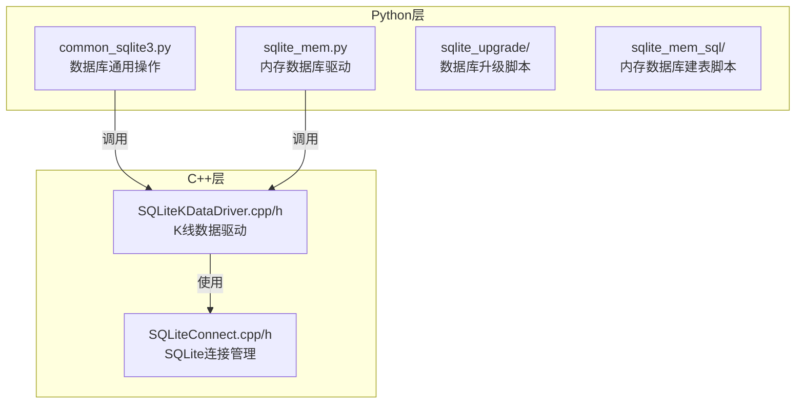

**图示来源**
- [common_sqlite3.py](file://hikyuu/data/common_sqlite3.py)
- [sqlite_mem.py](file://hikyuu/data/sqlite_mem.py)
- [SQLiteKDataDriver.cpp](file://hikyuu_cpp/hikyuu/data_driver/kdata/sqlite/SQLiteKDataDriver.cpp)
- [SQLiteConnect.cpp](file://hikyuu_cpp/hikyuu/utilities/db_connect/sqlite/SQLiteConnect.cpp)

**本节来源**
- [common_sqlite3.py](file://hikyuu/data/common_sqlite3.py)
- [sqlite_mem.py](file://hikyuu/data/sqlite_mem.py)
- [SQLiteKDataDriver.cpp](file://hikyuu_cpp/hikyuu/data_driver/kdata/sqlite/SQLiteKDataDriver.cpp)

## 核心组件
系统中的核心组件包括SQLiteKDataDriver，负责K线数据的存取；SQLiteConnect，管理SQLite数据库连接；以及相关的数据库升级和内存数据库实现。

**本节来源**
- [SQLiteKDataDriver.cpp](file://hikyuu_cpp/hikyuu/data_driver/kdata/sqlite/SQLiteKDataDriver.cpp)
- [SQLiteConnect.cpp](file://hikyuu_cpp/hikyuu/utilities/db_connect/sqlite/SQLiteConnect.cpp)

## 架构概述
系统采用分层架构，Python层提供高层接口，C++层实现高性能数据操作。SQLiteKDataDriver作为核心数据驱动，通过SQLiteConnect与SQLite数据库交互，支持多种K线类型的数据存取。

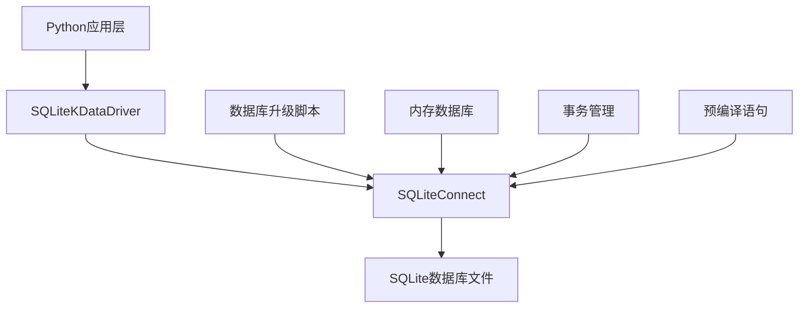

**图示来源**
- [SQLiteKDataDriver.cpp](file://hikyuu_cpp/hikyuu/data_driver/kdata/sqlite/SQLiteKDataDriver.cpp)
- [SQLiteConnect.cpp](file://hikyuu_cpp/hikyuu/utilities/db_connect/sqlite/SQLiteConnect.cpp)

## 详细组件分析

### SQLiteKDataDriver分析
SQLiteKDataDriver是系统中负责K线数据存取的核心组件，它继承自KDataDriver基类，实现了针对SQLite数据库的特定功能。

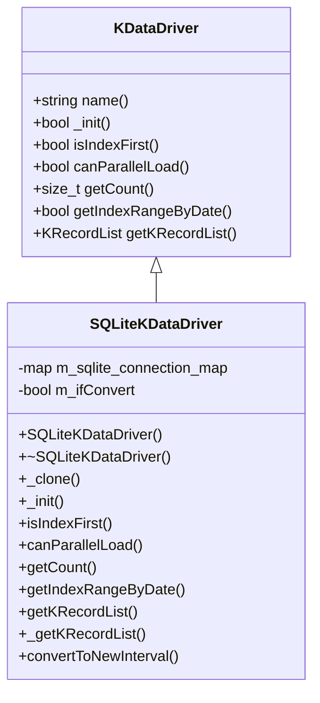

**图示来源**
- [SQLiteKDataDriver.h](file://hikyuu_cpp/hikyuu/data_driver/kdata/sqlite/SQLiteKDataDriver.h)
- [SQLiteKDataDriver.cpp](file://hikyuu_cpp/hikyuu/data_driver/kdata/sqlite/SQLiteKDataDriver.cpp)

#### 初始化过程
SQLiteKDataDriver的初始化过程通过_readParam方法读取配置参数，建立市场与数据库文件的映射关系，并根据K线类型创建相应的数据库连接。

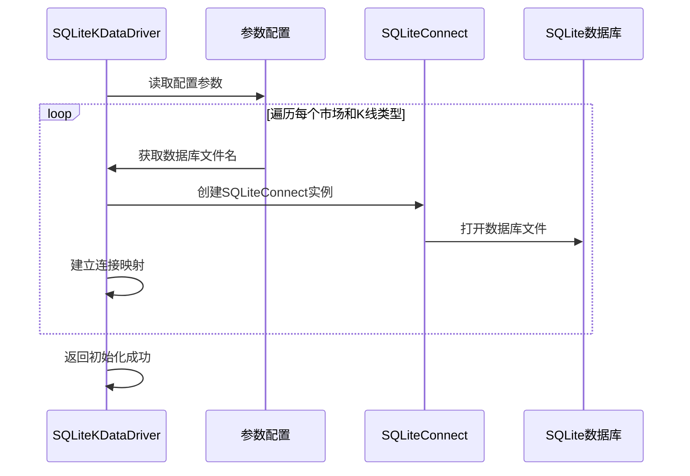

**图示来源**
- [SQLiteKDataDriver.cpp](file://hikyuu_cpp/hikyuu/data_driver/kdata/sqlite/SQLiteKDataDriver.cpp#L62-L96)

**本节来源**
- [SQLiteKDataDriver.cpp](file://hikyuu_cpp/hikyuu/data_driver/kdata/sqlite/SQLiteKDataDriver.cpp)

### SQLite连接管理分析
SQLiteConnect类负责管理与SQLite数据库的连接，提供了事务控制、语句执行和数据库检查等核心功能。

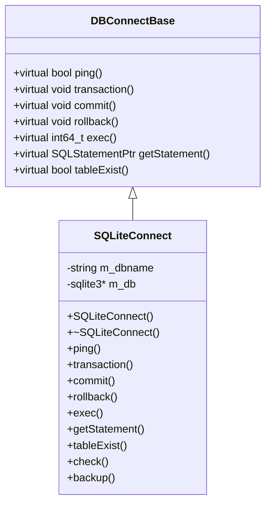

**图示来源**
- [SQLiteConnect.h](file://hikyuu_cpp/hikyuu/utilities/db_connect/sqlite/SQLiteConnect.h)
- [SQLiteConnect.cpp](file://hikyuu_cpp/hikyuu/utilities/db_connect/sqlite/SQLiteConnect.cpp)

#### 连接创建流程
SQLiteConnect的构造函数负责创建数据库连接，设置必要的连接参数和回调函数。

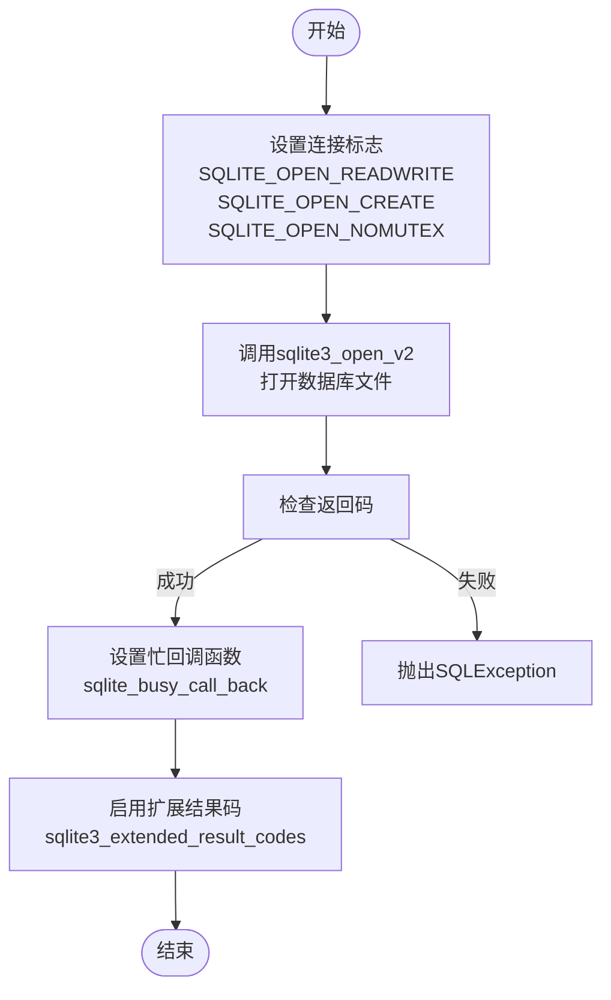

**图示来源**
- [SQLiteConnect.cpp](file://hikyuu_cpp/hikyuu/utilities/db_connect/sqlite/SQLiteConnect.cpp#L24-L70)

**本节来源**
- [SQLiteConnect.cpp](file://hikyuu_cpp/hikyuu/utilities/db_connect/sqlite/SQLiteConnect.cpp)

### 数据库升级机制分析
系统通过sqlite_upgrade目录中的SQL脚本实现数据库模式的安全升级，确保数据完整性和向后兼容性。

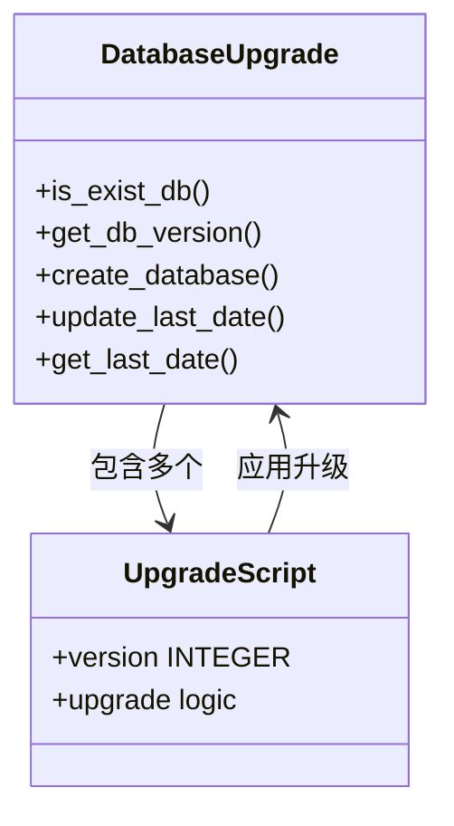

**图示来源**
- [common_sqlite3.py](file://hikyuu/data/common_sqlite3.py)
- [createdb.sql](file://hikyuu/data/sqlite_upgrade/createdb.sql)

#### 升级流程
数据库升级流程确保了从旧版本到新版本的平滑过渡，同时保持数据完整性。

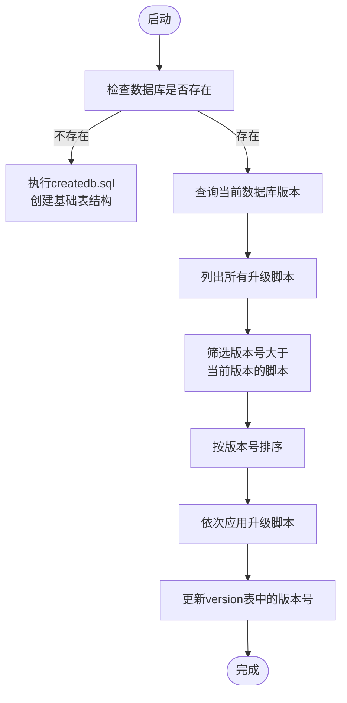

**图示来源**
- [common_sqlite3.py](file://hikyuu/data/common_sqlite3.py#L56-L75)

**本节来源**
- [common_sqlite3.py](file://hikyuu/data/common_sqlite3.py)
- [createdb.sql](file://hikyuu/data/sqlite_upgrade/createdb.sql)
- [0001.sql](file://hikyuu/data/sqlite_upgrade/0001.sql)
- [0002.sql](file://hikyuu/data/sqlite_upgrade/0002.sql)
- [0003.sql](file://hikyuu/data/sqlite_upgrade/0003.sql)

## 依赖分析
系统各组件之间的依赖关系清晰，形成了稳定的架构。

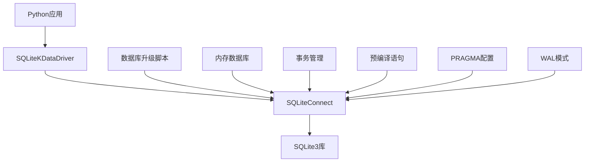

**图示来源**
- [SQLiteKDataDriver.cpp](file://hikyuu_cpp/hikyuu/data_driver/kdata/sqlite/SQLiteKDataDriver.cpp)
- [SQLiteConnect.cpp](file://hikyuu_cpp/hikyuu/utilities/db_connect/sqlite/SQLiteConnect.cpp)

**本节来源**
- [SQLiteKDataDriver.cpp](file://hikyuu_cpp/hikyuu/data_driver/kdata/sqlite/SQLiteKDataDriver.cpp)
- [SQLiteConnect.cpp](file://hikyuu_cpp/hikyuu/utilities/db_connect/sqlite/SQLiteConnect.cpp)

## 性能考虑
在处理海量K线数据时，系统的性能优化至关重要。通过合理配置SQLite参数和使用高效的编程实践，可以显著提升数据存取性能。

### WAL模式与PRAGMA配置
WAL（Write-Ahead Logging）模式是SQLite的一项重要性能优化特性，它允许多个读取操作与单个写入操作并发执行，从而提高并发性能。

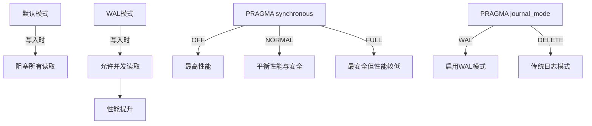

**本节来源**
- [SQLiteConnect.cpp](file://hikyuu_cpp/hikyuu/utilities/db_connect/sqlite/SQLiteConnect.cpp)

### 事务与批量操作
合理使用事务和批量操作可以显著减少数据库操作的开销，提高数据写入性能。

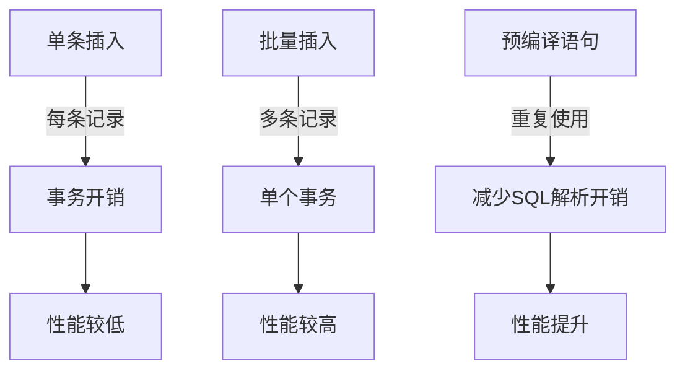

**本节来源**
- [sqlite_mem.py](file://hikyuu/data/sqlite_mem.py)
- [SQLiteConnect.cpp](file://hikyuu_cpp/hikyuu/utilities/db_connect/sqlite/SQLiteConnect.cpp)

## 故障排除指南
当遇到数据库相关问题时，可以参考以下指南进行排查和解决。

**本节来源**
- [SQLiteConnect.cpp](file://hikyuu_cpp/hikyuu/utilities/db_connect/sqlite/SQLiteConnect.cpp)
- [common_sqlite3.py](file://hikyuu/data/common_sqlite3.py)

## 结论
通过对SQLiteKDataDriver的深入分析，我们了解了系统如何利用SQLite的特性进行高效数据存取。WAL模式的启用、合理的PRAGMA配置、事务的正确使用以及预编译语句的应用，都是提升性能的关键因素。同时，通过sqlite_upgrade目录中的SQL脚本，系统能够安全地进行数据库模式升级，确保数据的完整性和一致性。这些优化实践使得系统能够在轻量级场景下高效处理海量K线数据。