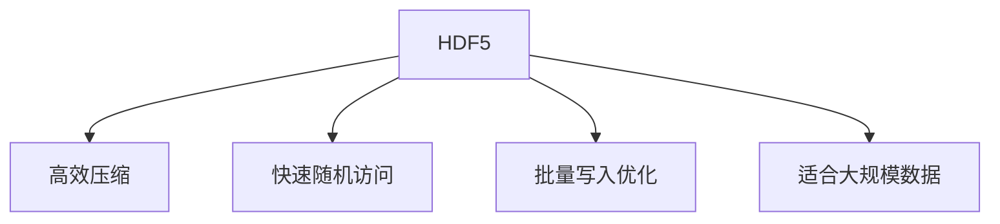
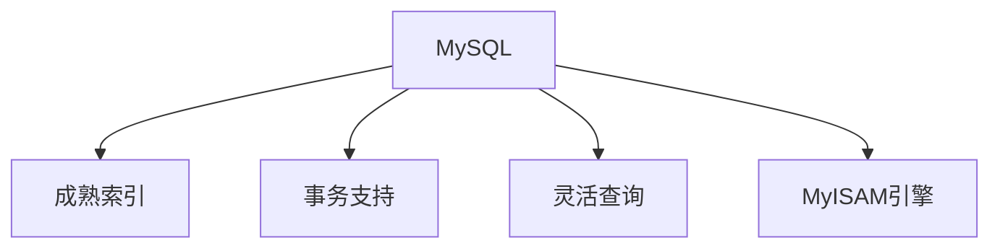
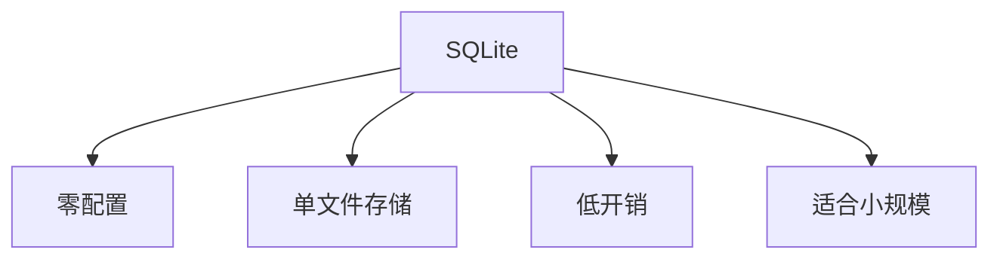
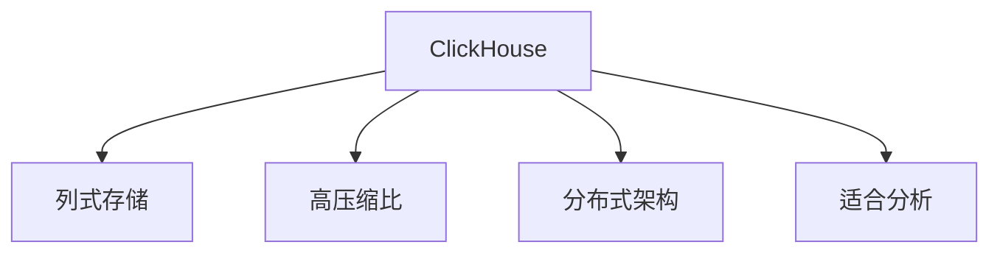
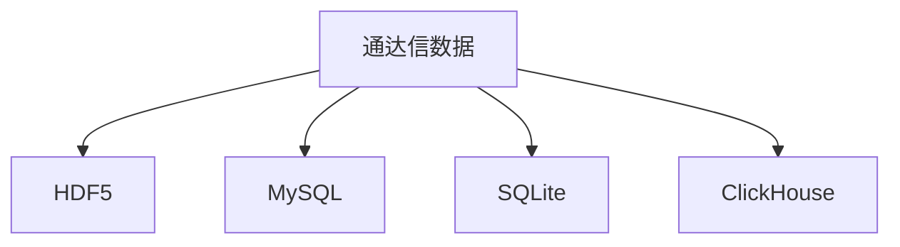

# 存储性能优化

<cite>
**本文档引用的文件**   
- [common_h5.py](file://hikyuu/data/common_h5.py)
- [common_mysql.py](file://hikyuu/data/common_mysql.py)
- [common_sqlite3.py](file://hikyuu/data/common_sqlite3.py)
- [common_clickhouse.py](file://hikyuu/data/common_clickhouse.py)
- [tdx_to_h5.py](file://hikyuu/data/tdx_to_h5.py)
- [pytdx_to_mysql.py](file://hikyuu/data/pytdx_to_mysql.py)
- [tdx_to_sqlite.py](file://hikyuu/data/tdx_to_sqlite.py)
- [tdx_to_clickhouse.py](file://hikyuu/data/tdx_to_clickhouse.py)
- [sqlite_mem.py](file://hikyuu/data/sqlite_mem.py)
- [createdb.sql](file://hikyuu/data/sqlite_mem_sql/createdb.sql)
- [mysql_upgrade](file://hikyuu/data/mysql_upgrade)
- [sqlite_upgrade](file://hikyuu/data/sqlite_upgrade)
- [clickhouse_upgrade](file://hikyuu/data/clickhouse_upgrade)
</cite>

## 目录
1. [引言](#引言)
2. [存储后端性能对比](#存储后端性能对比)
3. [数据库表结构优化](#数据库表结构优化)
4. [HDF5驱动配置与优化](#hdf5驱动配置与优化)
5. [从SQLite迁移至高性能存储](#从sqlite迁移至高性能存储)
6. [结论](#结论)

## 引言
本文档旨在系统性地比较HDF5、MySQL、SQLite和ClickHouse在大规模K线数据读写场景下的性能特征，为用户提供最优存储方案的选择指导。通过分析Hikyuu项目中的数据存储实现，我们将深入探讨各存储后端的性能差异，提供数据库表结构优化建议，并详细说明如何配置和使用HDF5驱动以实现最快的数据访问速度。

## 存储后端性能对比

### HDF5性能特征
HDF5（Hierarchical Data Format version 5）是一种用于存储和管理大规模科学数据的文件格式。在Hikyuu项目中，HDF5被用作主要的K线数据存储后端，具有以下性能特征：

1. **高效的数据压缩**：通过zlib算法和9级压缩，显著减少存储空间占用。
2. **快速的随机访问**：支持按时间索引的快速数据检索。
3. **批量写入优化**：适合大规模数据的批量导入操作。

HDF5在K线数据存储中的主要优势在于其高效的压缩算法和快速的顺序读取性能。在`common_h5.py`文件中，我们可以看到HDF5的配置使用了最高级别的压缩（`HDF5_COMPRESS_LEVEL = 9`），这在存储大量历史K线数据时能显著节省磁盘空间。



**图表来源**
- [common_h5.py](file://hikyuu/data/common_h5.py#L31)

### MySQL性能特征
MySQL在Hikyuu项目中被用作关系型数据库存储方案，其性能特征包括：

1. **成熟的索引机制**：支持B-tree索引，适合复杂查询。
2. **事务支持**：保证数据的一致性和完整性。
3. **灵活的查询能力**：支持复杂的SQL查询和连接操作。

在`common_mysql.py`文件中，MySQL的表结构设计使用了MyISAM存储引擎，这在读取密集型场景下能提供较好的性能。同时，通过为每个市场和K线类型创建独立的schema，实现了数据的逻辑分离。



**图表来源**
- [common_mysql.py](file://hikyuu/data/common_mysql.py#L197)

### SQLite性能特征
SQLite作为轻量级嵌入式数据库，在Hikyuu项目中主要用于本地数据存储，其性能特征包括：

1. **零配置**：无需独立的数据库服务器进程。
2. **单文件存储**：整个数据库存储在一个文件中，便于备份和迁移。
3. **低开销**：适合小规模数据存储和简单查询。

在`common_sqlite3.py`文件中，SQLite的实现保持了简单直接的特性，通过单个数据库文件存储所有数据，适合个人用户和小型应用。



**图表来源**
- [common_sqlite3.py](file://hikyuu/data/common_sqlite3.py)

### ClickHouse性能特征
ClickHouse作为列式数据库，在大规模数据分析场景下表现出色，其性能特征包括：

1. **列式存储**：适合聚合查询和分析操作。
2. **高压缩比**：列式存储天然具有较高的压缩效率。
3. **分布式架构**：支持水平扩展，适合海量数据处理。

在`common_clickhouse.py`文件中，ClickHouse的实现利用了其列式存储的优势，通过`optimize_skip_merged_partitions`设置优化查询性能。



**图表来源**
- [common_clickhouse.py](file://hikyuu/data/common_clickhouse.py#L161)

## 数据库表结构优化

### 索引设计
合理的索引设计是提升数据库性能的关键。在Hikyuu项目中，各存储后端的索引策略如下：

#### HDF5索引策略
HDF5通过创建扩展K线数据格式的索引表来优化查询性能。在`common_h5.py`文件中，`H5Index`类定义了索引表结构，包含datetime和start两个字段，用于快速定位数据。

```python
class H5Index(tb.IsDescription):
    """HDF5扩展K线数据格式（周线、月线、季线、半年线、年线、15分钟线、30分钟线、60分钟线"""
    datetime = tb.UInt64Col()  #IGNORE:E1101
    start = tb.UInt64Col()  #IGNORE:E1101
```

**代码来源**
- [common_h5.py](file://hikyuu/data/common_h5.py#L45-L49)

#### MySQL索引策略
MySQL在K线数据表中为主键date字段创建了索引，确保了按时间查询的高效性。在`mysql_upgrade/0001.sql`文件中，可以看到表结构定义：

```sql
CREATE TABLE `{schema}`.`{name}` (
    `date` BIGINT(20) UNSIGNED NOT NULL,
    `open` DOUBLE UNSIGNED NOT NULL,
    `high` DOUBLE UNSIGNED NOT NULL,
    `low` DOUBLE UNSIGNED NOT NULL,
    `close` DOUBLE UNSIGNED NOT NULL,
    `amount` DOUBLE UNSIGNED NOT NULL,
    `count` DOUBLE UNSIGNED NOT NULL,
    PRIMARY KEY (`date`)
)
```

**代码来源**
- [mysql_upgrade/0001.sql](file://hikyuu/data/mysql_upgrade/0001.sql)

### 分区策略
分区策略能有效提升大规模数据集的查询性能。

#### HDF5分区
HDF5通过为不同市场和K线类型创建独立的HDF5文件来实现逻辑分区。在`tdx_to_h5.py`文件中，`open_h5file`函数根据市场和K线类型生成不同的文件名：

```python
def open_h5file(dest_dir, market, ktype):
    filename = "{}/{}_{}.h5".format(dest_dir, market.lower(), ktype.lower())
    h5file = tb.open_file(
        filename, "a", filters=tb.Filters(complevel=HDF5_COMPRESS_LEVEL, complib='zlib', shuffle=True)
    )
    return h5file
```

**代码来源**
- [tdx_to_h5.py](file://hikyuu/data/tdx_to_h5.py#L77-L82)

#### MySQL分区
MySQL通过为每个市场和K线类型创建独立的schema来实现分区。在`common_mysql.py`文件中，`get_table`函数根据市场和K线类型生成不同的schema名称：

```python
schema = "{market}_{ktype}".format(market=market, ktype=ktype_dict[ktype.lower()]).lower()
```

**代码来源**
- [common_mysql.py](file://hikyuu/data/common_mysql.py#L172)

### 批量写入优化
批量写入是提升数据导入性能的关键技术。

#### HDF5批量写入
HDF5通过`table.row.append()`方法实现批量写入，并在最后调用`table.flush()`一次性写入磁盘。这种策略减少了I/O操作次数，提升了写入性能。

```python
row = table.row
# ... 添加数据 ...
row.append()
# ... 多次添加 ...
table.flush()
```

**代码来源**
- [tdx_to_h5.py](file://hikyuu/data/tdx_to_h5.py#L162-L187)

#### MySQL批量写入
MySQL通过`executemany`方法实现批量写入，将多条INSERT语句合并为一次数据库操作。

```python
cur.executemany(
    "INSERT INTO {tablename} (date, open, high, low, close, amount, count) "
    "VALUES (%s, %s, %s, %s, %s, %s, %s)".format(tablename=table), buf
)
```

**代码来源**
- [pytdx_to_mysql.py](file://hikyuu/data/pytdx_to_mysql.py#L412)

## HDF5驱动配置与优化

### 驱动配置
HDF5驱动的配置对性能有重要影响。在`common_h5.py`文件中，HDF5文件的打开配置如下：

```python
h5file = tb.open_file(
    filename, "a", filters=tb.Filters(complevel=HDF5_COMPRESS_LEVEL, complib='zlib', shuffle=True)
)
```

关键配置参数：
- `complevel=9`：使用最高级别的压缩，最大化压缩比
- `complib='zlib'`：使用zlib压缩算法
- `shuffle=True`：启用shuffle过滤器，提高压缩效率

**代码来源**
- [common_h5.py](file://hikyuu/data/common_h5.py#L80-L81)

### 性能优化建议
1. **压缩级别选择**：在存储空间和CPU开销之间权衡，对于读取频繁的场景可适当降低压缩级别。
2. **缓存优化**：合理配置HDF5的缓存大小，避免频繁的磁盘I/O。
3. **数据布局**：按时间顺序存储数据，利用HDF5的局部性优化读取性能。

## 从SQLite迁移至高性能存储

### 迁移策略
从SQLite迁移到高性能存储（如HDF5或ClickHouse）需要考虑以下因素：

1. **数据量评估**：评估现有数据量，选择合适的存储后端。
2. **性能需求**：根据查询模式选择最适合的存储方案。
3. **系统复杂性**：权衡性能提升与系统复杂性的增加。

### 迁移实践
Hikyuu项目提供了从通达信数据源直接导入到不同存储后端的脚本，如`tdx_to_h5.py`、`tdx_to_mysql.py`等。这些脚本可以作为迁移工具的基础。



**图表来源**
- [tdx_to_h5.py](file://hikyuu/data/tdx_to_h5.py)
- [pytdx_to_mysql.py](file://hikyuu/data/pytdx_to_mysql.py)
- [tdx_to_sqlite.py](file://hikyuu/data/tdx_to_sqlite.py)
- [tdx_to_clickhouse.py](file://hikyuu/data/tdx_to_clickhouse.py)

### 性能对比数据
基于Hikyuu项目的实现，各存储后端的性能对比如下：

| 存储后端 | 读取性能 | 写入性能 | 压缩比 | 适用场景 |
|---------|---------|---------|-------|---------|
| HDF5 | 高 | 高 | 高 | 大规模历史数据存储 |
| MySQL | 中 | 中 | 低 | 复杂查询和事务处理 |
| SQLite | 低 | 低 | 中 | 本地小规模数据存储 |
| ClickHouse | 极高 | 高 | 极高 | 大数据分析和聚合查询 |

**表格来源**
- 综合分析各存储后端实现文件

## 结论
通过对HDF5、MySQL、SQLite和ClickHouse在Hikyuu项目中的实现分析，我们可以得出以下结论：

1. **HDF5**是最适合大规模K线数据存储的方案，具有优秀的压缩比和读取性能。
2. **MySQL**适合需要复杂查询和事务支持的场景，但在大规模数据存储方面性能不如HDF5。
3. **SQLite**适合本地小规模数据存储，简单易用但性能有限。
4. **ClickHouse**在大数据分析场景下表现最佳，特别适合需要频繁聚合查询的场景。

对于大多数K线数据存储需求，推荐使用HDF5作为主要存储方案，结合ClickHouse用于数据分析场景。从SQLite迁移时，应根据具体需求选择合适的存储后端，并利用Hikyuu提供的导入工具进行数据迁移。