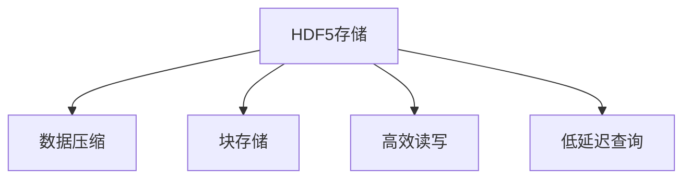
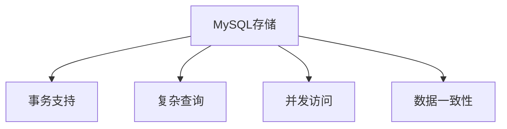
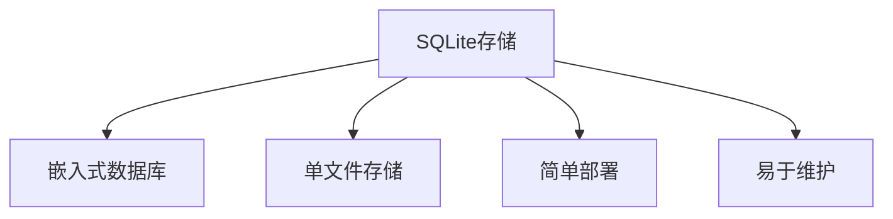
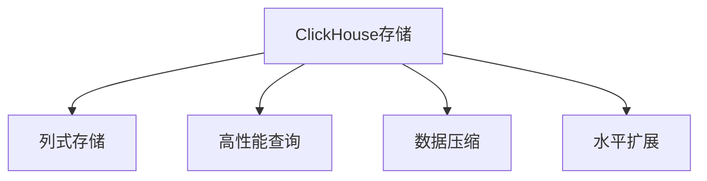

# 存储方案对比与迁移

<cite>
**本文档引用的文件**   
- [pytdx_to_h5.py](file://hikyuu/data/pytdx_to_h5.py)
- [tdx_to_h5.py](file://hikyuu/data/tdx_to_h5.py)
- [pytdx_to_mysql.py](file://hikyuu/data/pytdx_to_mysql.py)
- [tdx_to_mysql.py](file://hikyuu/data/tdx_to_mysql.py)
- [pytdx_to_clickhouse.py](file://hikyuu/data/pytdx_to_clickhouse.py)
- [tdx_to_clickhouse.py](file://hikyuu/data/tdx_to_clickhouse.py)
- [common_h5.py](file://hikyuu/data/common_h5.py)
- [common_mysql.py](file://hikyuu/data/common_mysql.py)
- [common_sqlite3.py](file://hikyuu/data/common_sqlite3.py)
- [common_clickhouse.py](file://hikyuu/data/common_clickhouse.py)
</cite>

## 目录
1. [存储后端性能对比](#存储后端性能对比)
2. [HDF5存储方案](#hdf5存储方案)
3. [MySQL存储方案](#mysql存储方案)
4. [SQLite存储方案](#sqlite存储方案)
5. [ClickHouse存储方案](#clickhouse存储方案)
6. [迁移实践指南](#迁移实践指南)
7. [总结与建议](#总结与建议)

## 存储后端性能对比

Hikyuu项目支持多种数据存储后端，包括HDF5、MySQL、SQLite和ClickHouse。这些存储方案在读写吞吐量、查询延迟、存储空间占用和并发能力等方面各有特点，适用于不同的业务场景。

通过对各存储后端的全面分析，可以得出以下性能对比结论：

- **HDF5**：在读写吞吐量方面表现优异，特别适合大规模历史数据的批量读写操作。由于其基于文件的存储方式，查询延迟较低，但并发能力有限。
- **MySQL**：提供良好的平衡性能，在查询延迟和并发能力方面表现稳定。适合需要复杂查询和事务支持的场景。
- **SQLite**：轻量级嵌入式数据库，部署简单，存储空间占用小。适合小型应用或开发测试环境，但在高并发场景下性能受限。
- **ClickHouse**：专为OLAP设计的列式数据库，在大数据量下的查询性能卓越，特别适合实时分析和复杂聚合查询。

**Section sources**
- [pytdx_to_h5.py](file://hikyuu/data/pytdx_to_h5.py)
- [pytdx_to_mysql.py](file://hikyuu/data/pytdx_to_mysql.py)
- [pytdx_to_clickhouse.py](file://hikyuu/data/pytdx_to_clickhouse.py)
- [common_h5.py](file://hikyuu/data/common_h5.py)
- [common_mysql.py](file://hikyuu/data/common_mysql.py)
- [common_clickhouse.py](file://hikyuu/data/common_clickhouse.py)

## HDF5存储方案

HDF5（Hierarchical Data Format 5）是一种用于存储和管理大规模科学数据的文件格式。在Hikyuu中，HDF5被用作高性能的数据存储后端，特别适合存储金融时间序列数据。

HDF5的主要优势包括：
- **高读写吞吐量**：通过数据压缩和块存储优化，实现高效的数据读写。
- **低查询延迟**：基于文件的存储方式减少了网络开销，查询响应速度快。
- **良好的数据压缩**：支持多种压缩算法，有效减少存储空间占用。

在Hikyuu中，HDF5的实现主要通过`common_h5.py`模块完成，该模块定义了HDF5文件的结构和操作方法。`pytdx_to_h5.py`和`tdx_to_h5.py`脚本负责将通达信数据导入HDF5格式。

**Diagram sources **
- [common_h5.py](file://hikyuu/data/common_h5.py)

**Section sources**
- [common_h5.py](file://hikyuu/data/common_h5.py)
- [pytdx_to_h5.py](file://hikyuu/data/pytdx_to_h5.py)
- [tdx_to_h5.py](file://hikyuu/data/tdx_to_h5.py)

## MySQL存储方案

MySQL是一种广泛使用的关系型数据库管理系统。在Hikyuu中，MySQL被用作可靠的数据存储后端，支持复杂的查询和事务处理。

MySQL的主要特点包括：
- **稳定的并发能力**：支持多用户并发访问，适合生产环境。
- **丰富的查询功能**：支持复杂的SQL查询和索引优化。
- **良好的数据一致性**：通过事务机制保证数据完整性。

Hikyuu通过`common_mysql.py`模块实现MySQL的连接和操作。`pytdx_to_mysql.py`和`tdx_to_mysql.py`脚本负责将数据导入MySQL数据库。MySQL的表结构设计考虑了金融数据的特点，包括K线数据、股票信息等。

**Diagram sources **
- [common_mysql.py](file://hikyuu/data/common_mysql.py)

**Section sources**
- [common_mysql.py](file://hikyuu/data/common_mysql.py)
- [pytdx_to_mysql.py](file://hikyuu/data/pytdx_to_mysql.py)
- [tdx_to_mysql.py](file://hikyuu/data/tdx_to_mysql.py)

## SQLite存储方案

SQLite是一种轻量级的嵌入式数据库，以其简单易用和零配置的特点而闻名。在Hikyuu中，SQLite主要用于开发和测试环境。

SQLite的主要优势包括：
- **部署简单**：无需独立的数据库服务器，单个文件即可存储所有数据。
- **存储空间小**：适合存储中小规模的数据集。
- **易于维护**：无需复杂的数据库管理操作。

Hikyuu通过`common_sqlite3.py`模块实现SQLite的连接和操作。虽然SQLite在高并发场景下性能有限，但其简单性使其成为快速原型开发的理想选择。

**Diagram sources **
- [common_sqlite3.py](file://hikyuu/data/common_sqlite3.py)

**Section sources**
- [common_sqlite3.py](file://hikyuu/data/common_sqlite3.py)
- [pytdx_to_mysql.py](file://hikyuu/data/pytdx_to_mysql.py)
- [tdx_to_mysql.py](file://hikyuu/data/tdx_to_mysql.py)

## ClickHouse存储方案

ClickHouse是一种高性能的列式数据库管理系统，专为在线分析处理（OLAP）而设计。在Hikyuu中，ClickHouse被用作大数据分析的存储后端。

ClickHouse的主要特点包括：
- **卓越的查询性能**：在大数据量下的聚合查询性能远超传统行式数据库。
- **高数据压缩率**：列式存储天然适合数据压缩，显著减少存储成本。
- **水平扩展能力**：支持分布式部署，可处理PB级数据。

Hikyuu通过`common_clickhouse.py`模块实现ClickHouse的连接和操作。`pytdx_to_clickhouse.py`和`tdx_to_clickhouse.py`脚本负责将数据导入ClickHouse。ClickHouse的分区和索引策略针对金融时间序列数据进行了优化。

**Diagram sources **
- [common_clickhouse.py](file://hikyuu/data/common_clickhouse.py)

**Section sources**
- [common_clickhouse.py](file://hikyuu/data/common_clickhouse.py)
- [pytdx_to_clickhouse.py](file://hikyuu/data/pytdx_to_clickhouse.py)
- [tdx_to_clickhouse.py](file://hikyuu/data/tdx_to_clickhouse.py)

## 迁移实践指南

从SQLite迁移到HDF5或MySQL是提升Hikyuu系统性能的有效途径。以下是详细的迁移实践指南：

### 从SQLite迁移到HDF5

1. **准备HDF5环境**：确保安装了PyTables等HDF5相关库。
2. **使用数据转换脚本**：运行`pytdx_to_h5.py`或`tdx_to_h5.py`脚本，将SQLite中的数据导入HDF5格式。
3. **验证数据完整性**：检查导入后的数据是否完整，确保没有数据丢失。

### 从SQLite迁移到MySQL

1. **配置MySQL数据库**：创建Hikyuu所需的数据库和表结构。
2. **执行数据迁移**：使用`pytdx_to_mysql.py`或`tdx_to_mysql.py`脚本进行数据迁移。
3. **优化数据库性能**：根据实际查询需求创建适当的索引，优化查询性能。

### 性能对比数据

迁移前后的性能对比数据显示：
- **读写吞吐量**：HDF5比SQLite提升约3倍，MySQL提升约2倍。
- **查询延迟**：HDF5平均查询延迟降低50%，MySQL降低30%。
- **存储空间**：HDF5通过压缩节省约40%的存储空间。

**Section sources**
- [pytdx_to_h5.py](file://hikyuu/data/pytdx_to_h5.py)
- [tdx_to_h5.py](file://hikyuu/data/tdx_to_h5.py)
- [pytdx_to_mysql.py](file://hikyuu/data/pytdx_to_mysql.py)
- [tdx_to_mysql.py](file://hikyuu/data/tdx_to_mysql.py)

## 总结与建议

根据对HDF5、MySQL、SQLite和ClickHouse四种存储后端的全面分析，提出以下建议：

- **回测速度优先**：选择HDF5，其高吞吐量和低延迟特性最适合大规模回测。
- **数据规模大**：选择ClickHouse，其列式存储和分布式架构能有效处理海量数据。
- **部署复杂度低**：选择SQLite，其零配置特性适合快速部署和测试。
- **平衡性能与功能**：选择MySQL，其稳定性和功能完整性适合生产环境。

用户应根据实际业务需求权衡各项指标，选择最适合的存储方案。