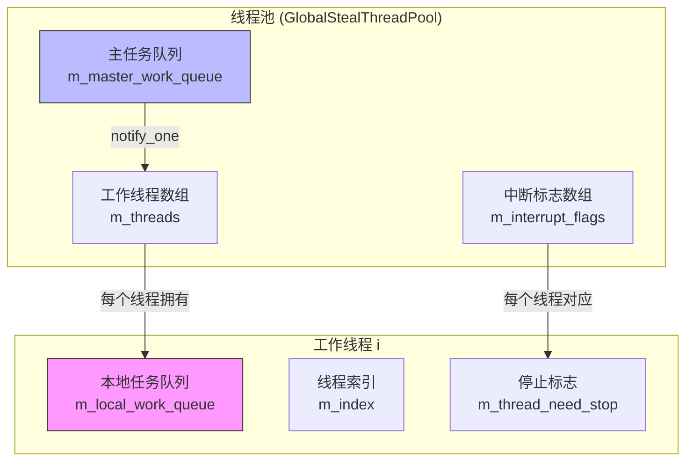
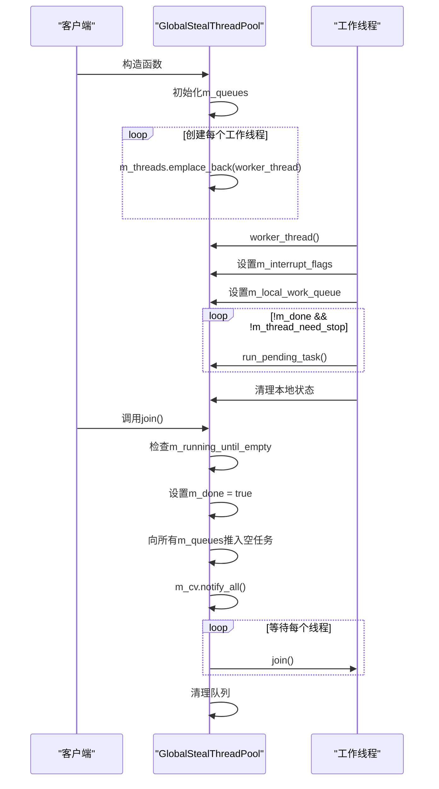
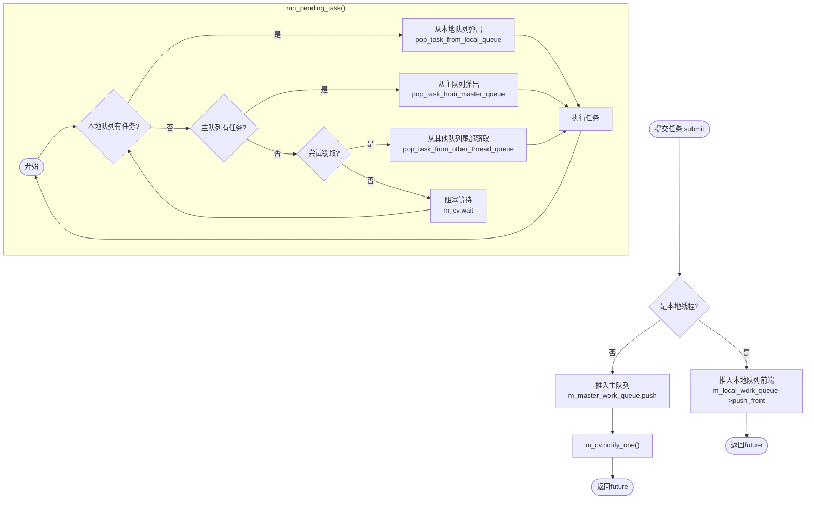

# GlobalStealThreadPool 实现解析

<cite>
**本文档引用的文件**   
- [GlobalStealThreadPool.h](file://hikyuu_cpp/hikyuu/utilities/thread/GlobalStealThreadPool.h)
- [WorkStealQueue.h](file://hikyuu_cpp/hikyuu/utilities/thread/WorkStealQueue.h)
- [ThreadSafeQueue.h](file://hikyuu_cpp/hikyuu/utilities/thread/ThreadSafeQueue.h)
- [GlobalThreadPool.h](file://hikyuu_cpp/hikyuu/utilities/thread/GlobalThreadPool.h)
- [GlobalMQStealThreadPool.h](file://hikyuu_cpp/hikyuu/utilities/thread/GlobalMQStealThreadPool.h)
- [test_ThreadPool.cpp](file://hikyuu_cpp/unit_test/hikyuu/utilities/thread/test_ThreadPool.cpp)
</cite>

## 目录
1. [引言](#引言)
2. [核心设计与架构](#核心设计与架构)
3. [线程生命周期管理](#线程生命周期管理)
4. [任务调度与窃取机制](#任务调度与窃取机制)
5. [量化计算场景应用示例](#量化计算场景应用示例)
6. [与其他线程池的对比分析](#与其他线程池的对比分析)
7. [总结](#总结)

## 引言

GlobalStealThreadPool 是一个分布偷取式线程池，专为处理存在递归关系的任务而设计。当任务在执行过程中会创建新的子任务并提交到线程池时，该线程池能有效避免死锁和性能瓶颈。其核心设计思想是通过工作窃取（Work Stealing）算法实现负载均衡，确保所有工作线程都能高效利用，特别适用于量化金融领域中复杂的并行计算场景，如K线数据处理和指标计算。

**Section sources**
- [GlobalStealThreadPool.h](file://hikyuu_cpp/hikyuu/utilities/thread/GlobalStealThreadPool.h#L34-L38)

## 核心设计与架构

GlobalStealThreadPool 采用了一种混合队列模型，结合了集中式主队列和分布式的本地任务队列。每个工作线程都拥有一个私有的 `WorkStealQueue`，用于存放分配给该线程的任务。同时，存在一个全局的 `m_master_work_queue`，用于接收来自非工作线程（如主线程）提交的任务。



**Diagram sources**
- [GlobalStealThreadPool.h](file://hikyuu_cpp/hikyuu/utilities/thread/GlobalStealThreadPool.h#L237-L240)

**Section sources**
- [GlobalStealThreadPool.h](file://hikyuu_cpp/hikyuu/utilities/thread/GlobalStealThreadPool.h#L231-L240)

## 线程生命周期管理

线程池的生命周期由 `m_done` 原子布尔变量和 `m_thread_need_stop` 线程本地变量共同控制。在构造函数中，线程池会根据指定数量创建工作线程，并立即启动它们执行 `worker_thread` 函数。



**Diagram sources**
- [GlobalStealThreadPool.h](file://hikyuu_cpp/hikyuu/utilities/thread/GlobalStealThreadPool.h#L55-L67)
- [GlobalStealThreadPool.h](file://hikyuu_cpp/hikyuu/utilities/thread/GlobalStealThreadPool.h#L173-L227)

**Section sources**
- [GlobalStealThreadPool.h](file://hikyuu_cpp/hikyuu/utilities/thread/GlobalStealThreadPool.h#L55-L67)
- [GlobalStealThreadPool.h](file://hikyuu_cpp/hikyuu/utilities/thread/GlobalStealThreadPool.h#L173-L227)

## 任务调度与窃取机制

任务调度的核心在于 `submit` 和 `run_pending_task` 两个函数。当任务被提交时，如果提交者是工作线程本身（通过 `m_local_work_queue` 判断），则任务会被推入该线程的本地队列前端，形成类似栈的结构，这有利于递归任务的快速处理。否则，任务会被推入主队列，并通过条件变量通知至少一个工作线程。



窃取逻辑在 `pop_task_from_other_thread_queue` 中实现。当一个线程的本地队列和主队列都为空时，它会尝试从其他线程的队列中"窃取"任务。为了保证公平性和缓存友好性，它总是从其他队列的**尾部**（`try_steal`）窃取任务，而本地线程则从自己队列的**头部**（`try_pop`）获取任务。这种设计减少了线程间的竞争。

**Diagram sources**
- [GlobalStealThreadPool.h](file://hikyuu_cpp/hikyuu/utilities/thread/GlobalStealThreadPool.h#L109-L127)
- [GlobalStealThreadPool.h](file://hikyuu_cpp/hikyuu/utilities/thread/GlobalStealThreadPool.h#L264-L285)
- [WorkStealQueue.h](file://hikyuu_cpp/hikyuu/utilities/thread/WorkStealQueue.h#L87-L99)

**Section sources**
- [GlobalStealThreadPool.h](file://hikyuu_cpp/hikyuu/utilities/thread/GlobalStealThreadPool.h#L109-L127)
- [GlobalStealThreadPool.h](file://hikyuu_cpp/hikyuu/utilities/thread/GlobalStealThreadPool.h#L264-L285)
- [WorkStealQueue.h](file://hikyuu_cpp/hikyuu/utilities/thread/WorkStealQueue.h#L87-L99)

## 量化计算场景应用示例

在量化计算中，经常需要对大量股票的K线数据进行并行处理。例如，计算一个投资组合中所有股票的某个复杂技术指标。使用 `GlobalStealThreadPool` 可以高效地完成此任务。

```cpp
// 伪代码示例
void processPortfolio(const vector<Stock>& stocks) {
    GlobalStealThreadPool pool(8); // 创建8个线程的线程池
    
    vector<future<IndicatorResult>> results;
    
    for (const auto& stock : stocks) {
        // 提交任务，每个任务处理一只股票
        auto future = pool.submit([stock]() {
            KData kdata = fetchKData(stock); // 获取K线数据
            
            // 计算复杂指标，此函数内部可能递归地创建更多任务
            IndicatorResult result = complexCalculation(kdata);
            
            return result;
        });
        
        results.push_back(std::move(future));
    }
    
    // 等待所有任务完成并收集结果
    for (auto& future : results) {
        IndicatorResult result = future.get();
        // 处理结果
    }
}
```

在此示例中，`complexCalculation` 函数内部可能需要对不同时间段的数据进行并行计算，它自身就可以再次调用 `pool.submit` 来创建子任务。由于 `GlobalStealThreadPool` 的工作窃取机制，即使主线程已经提交了所有初始任务，工作线程在处理这些任务时产生的子任务也能被高效地调度和执行，避免了传统线程池中可能发生的死锁。

**Section sources**
- [test_ThreadPool.cpp](file://hikyuu_cpp/unit_test/hikyuu/utilities/thread/test_ThreadPool.cpp#L68-L87)

## 与其他线程池的对比分析

### 与 GlobalThreadPool 的对比

`GlobalThreadPool` 是一个简单的集中式线程池，所有任务都存放在一个共享的 `ThreadSafeQueue` 中。它的优点是实现简单，但缺点是当任务数量巨大时，队列可能成为性能瓶颈，且不支持递归任务提交。

| 特性 | GlobalStealThreadPool | GlobalThreadPool |
| :--- | :--- | :--- |
| **队列模型** | 分布式（每个线程一个队列）+ 集中式主队列 | 集中式（单一共享队列） |
| **任务窃取** | 支持 | 不支持 |
| **递归任务** | 支持，无死锁风险 | 不支持，可能导致死锁 |
| **适用场景** | 递归、分治算法，复杂并行计算 | 简单的、彼此独立的任务 |

### 与 GlobalMQStealThreadPool 的对比

`GlobalMQStealThreadPool` 也是一个支持工作窃取的线程池，但它没有集中式的主队列。当一个非工作线程提交任务时，它会寻找当前任务最少的线程队列，并将任务加入其尾部。

两者的主要区别在于任务提交策略：
- **GlobalStealThreadPool**: 非工作线程提交的任务进入主队列，由工作线程在空闲时从主队列获取。
- **GlobalMQStealThreadPool**: 非工作线程提交的任务直接进入某个工作线程的本地队列。

`GlobalStealThreadPool` 的主队列设计使其在处理突发性任务提交时更具弹性，而 `GlobalMQStealThreadPool` 的直接分配策略可能在某些情况下减少一次队列跳转。

**Section sources**
- [GlobalStealThreadPool.h](file://hikyuu_cpp/hikyuu/utilities/thread/GlobalStealThreadPool.h)
- [GlobalThreadPool.h](file://hikyuu_cpp/hikyuu/utilities/thread/GlobalThreadPool.h)
- [GlobalMQStealThreadPool.h](file://hikyuu_cpp/hikyuu/utilities/thread/GlobalMQStealThreadPool.h)

## 总结

`GlobalStealThreadPool` 是一个为解决递归并行计算而精心设计的高性能线程池。它通过结合集中式主队列和分布式工作窃取队列，实现了优秀的负载均衡和高吞吐量。其核心优势在于能够安全地处理任务创建任务的场景，这在量化金融的复杂计算中至关重要。通过理解其线程生命周期管理、任务调度和窃取机制，开发者可以更有效地利用这一工具来加速计算密集型的应用。