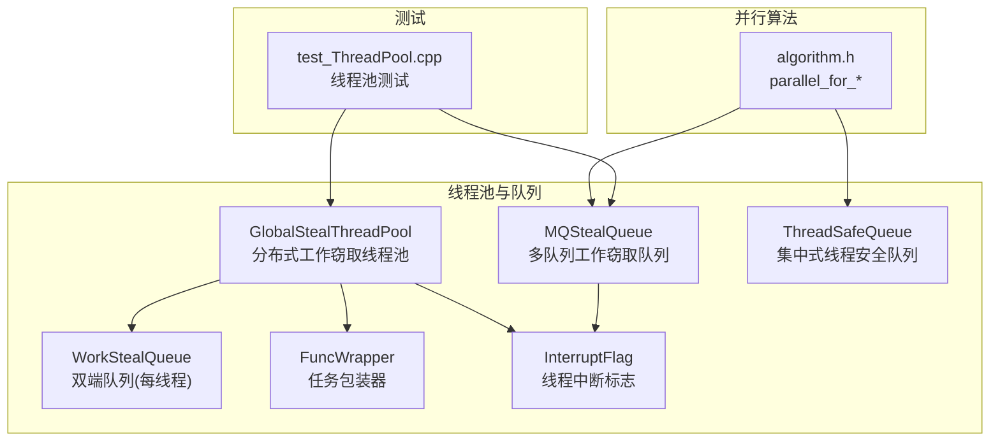
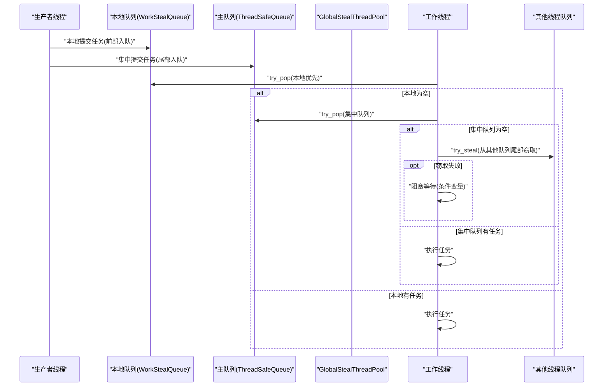
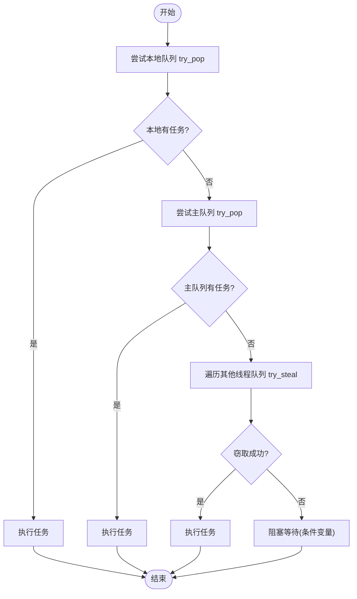
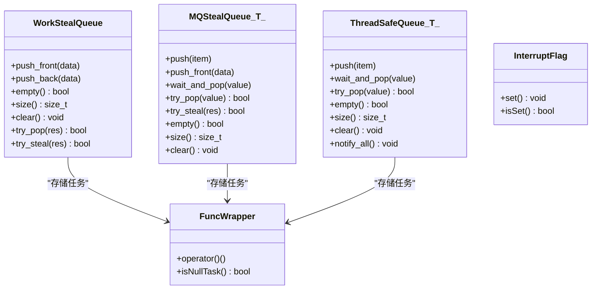
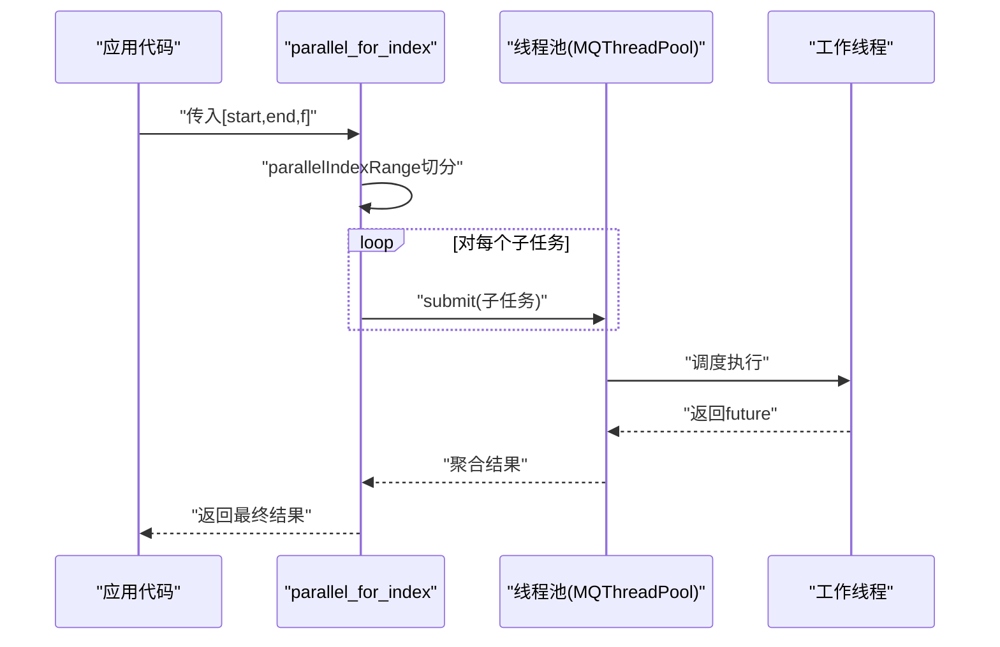
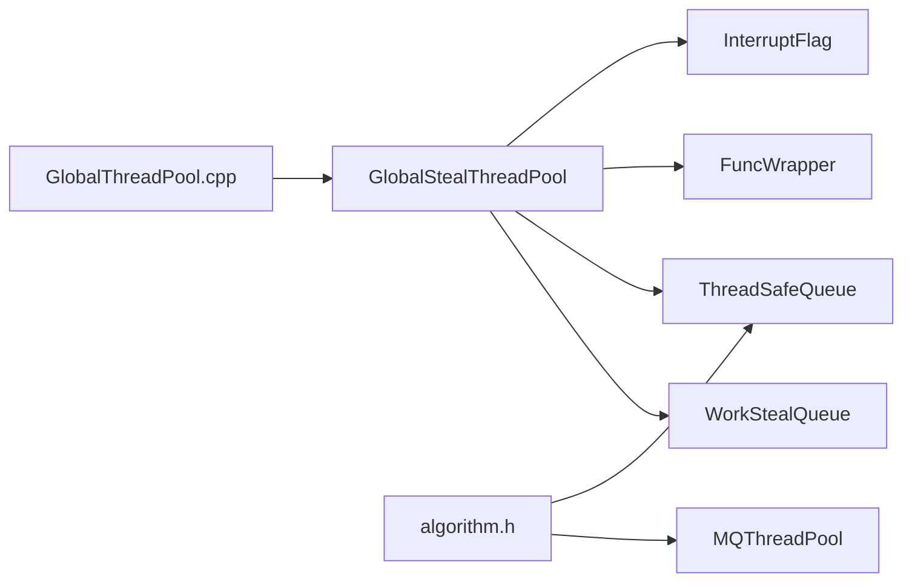

# 任务调度与工作窃取

<cite>
**本文引用的文件列表**
- [GlobalStealThreadPool.h](file://hikyuu_cpp/hikyuu/utilities/thread/GlobalStealThreadPool.h)
- [WorkStealQueue.h](file://hikyuu_cpp/hikyuu/utilities/thread/WorkStealQueue.h)
- [MQStealQueue.h](file://hikyuu_cpp/hikyuu/utilities/thread/MQStealQueue.h)
- [ThreadSafeQueue.h](file://hikyuu_cpp/hikyuu/utilities/thread/ThreadSafeQueue.h)
- [FuncWrapper.h](file://hikyuu_cpp/hikyuu/utilities/thread/FuncWrapper.h)
- [InterruptFlag.h](file://hikyuu_cpp/hikyuu/utilities/thread/InterruptFlag.h)
- [GlobalThreadPool.cpp](file://hikyuu_cpp/hikyuu/utilities/thread/GlobalThreadPool.cpp)
- [algorithm.h](file://hikyuu_cpp/hikyuu/utilities/thread/algorithm.h)
- [test_ThreadPool.cpp](file://hikyuu_cpp/unit_test/hikyuu/utilities/thread/test_ThreadPool.cpp)
- [IAma.cpp](file://hikyuu_cpp/hikyuu/indicator/imp/IAma.cpp)
</cite>

## 目录
1. [引言](#引言)
2. [项目结构](#项目结构)
3. [核心组件](#核心组件)
4. [架构总览](#架构总览)
5. [组件详解](#组件详解)
6. [依赖关系分析](#依赖关系分析)
7. [性能与复杂度](#性能与复杂度)
8. [故障排查指南](#故障排查指南)
9. [结论](#结论)
10. [附录：使用示例与最佳实践](#附录使用示例与最佳实践)

## 引言
本文件围绕工作窃取（work-stealing）算法在项目中的实现进行系统化阐述，重点聚焦于 GlobalStealThreadPool 及其配套的双端队列（deque）设计、任务窃取机制与负载均衡策略。我们将结合代码结构与测试用例，解释如何通过工作窃取提升多核 CPU 利用率、避免线程饥饿，并给出面向计算密集型任务的并行拆分与调度实践，以及性能调优建议。

## 项目结构
与工作窃取相关的核心代码位于 utilities/thread 目录，主要包含：
- GlobalStealThreadPool：分布式的多队列工作窃取线程池
- WorkStealQueue：每个工作线程私有的双端队列
- MQStealQueue：多队列版本的工作窃取队列（用于 GlobalMQStealThreadPool）
- ThreadSafeQueue：集中式线程安全队列（用于普通线程池）
- FuncWrapper：统一的任务包装器，支持移动语义
- InterruptFlag：线程中断标志
- GlobalThreadPool.cpp：线程本地变量初始化
- algorithm.h：并行算法工具（索引切分、并行 for 等）
- 测试用例：验证线程池行为与并行算法

图表来源
- [GlobalStealThreadPool.h](file://hikyuu_cpp/hikyuu/utilities/thread/GlobalStealThreadPool.h#L1-L311)
- [WorkStealQueue.h](file://hikyuu_cpp/hikyuu/utilities/thread/WorkStealQueue.h#L1-L106)
- [MQStealQueue.h](file://hikyuu_cpp/hikyuu/utilities/thread/MQStealQueue.h#L1-L113)
- [ThreadSafeQueue.h](file://hikyuu_cpp/hikyuu/utilities/thread/ThreadSafeQueue.h#L1-L106)
- [FuncWrapper.h](file://hikyuu_cpp/hikyuu/utilities/thread/FuncWrapper.h#L1-L86)
- [InterruptFlag.h](file://hikyuu_cpp/hikyuu/utilities/thread/InterruptFlag.h#L1-L46)
- [algorithm.h](file://hikyuu_cpp/hikyuu/utilities/thread/algorithm.h#L1-L116)
- [test_ThreadPool.cpp](file://hikyuu_cpp/unit_test/hikyuu/utilities/thread/test_ThreadPool.cpp#L1-L113)

章节来源
- [GlobalStealThreadPool.h](file://hikyuu_cpp/hikyuu/utilities/thread/GlobalStealThreadPool.h#L1-L311)
- [algorithm.h](file://hikyuu_cpp/hikyuu/utilities/thread/algorithm.h#L1-L116)

## 核心组件
- GlobalStealThreadPool：为每个工作线程维护一个 WorkStealQueue，采用“本地优先 + 主队列兜底 + 其他线程队列窃取”的三级取任务策略；支持线程本地提交与集中式提交两种路径。
- WorkStealQueue：双端队列，支持 push_front/push_back/try_pop/try_steal，满足工作窃取的 LIFO 本地消费与 FIFO 窃取需求。
- MQStealQueue：多队列工作窃取队列，支持 push_front/wait_and_pop/try_steal 等操作，配合 GlobalMQStealThreadPool 使用。
- ThreadSafeQueue：集中式线程安全队列，用于普通线程池（非工作窃取）。
- FuncWrapper：统一的任务包装器，支持任意可调用对象的移动语义封装。
- InterruptFlag：原子布尔标志，用于优雅停止线程池中的工作线程。
- GlobalThreadPool.cpp：初始化 GlobalStealThreadPool 的 thread_local 成员（本地队列指针、线程序号、中断标志）。
- algorithm.h：提供 parallel_for_index/parallel_for_range 等并行算法，将大范围任务切分为多个子任务并提交给线程池执行。

章节来源
- [GlobalStealThreadPool.h](file://hikyuu_cpp/hikyuu/utilities/thread/GlobalStealThreadPool.h#L1-L311)
- [WorkStealQueue.h](file://hikyuu_cpp/hikyuu/utilities/thread/WorkStealQueue.h#L1-L106)
- [MQStealQueue.h](file://hikyuu_cpp/hikyuu/utilities/thread/MQStealQueue.h#L1-L113)
- [ThreadSafeQueue.h](file://hikyuu_cpp/hikyuu/utilities/thread/ThreadSafeQueue.h#L1-L106)
- [FuncWrapper.h](file://hikyuu_cpp/hikyuu/utilities/thread/FuncWrapper.h#L1-L86)
- [InterruptFlag.h](file://hikyuu_cpp/hikyuu/utilities/thread/InterruptFlag.h#L1-L46)
- [GlobalThreadPool.cpp](file://hikyuu_cpp/hikyuu/utilities/thread/GlobalThreadPool.cpp#L1-L32)
- [algorithm.h](file://hikyuu_cpp/hikyuu/utilities/thread/algorithm.h#L1-L116)

## 架构总览
工作窃取线程池的核心思想是：每个线程拥有自己的局部队列，优先从本地队列消费；当本地为空时，尝试从集中主队列取任务；若仍为空，则随机或按轮询方式从其他线程的队列尾部“窃取”任务。这种设计显著降低锁竞争，提升吞吐并减少线程饥饿。

图表来源
- [GlobalStealThreadPool.h](file://hikyuu_cpp/hikyuu/utilities/thread/GlobalStealThreadPool.h#L264-L310)
- [WorkStealQueue.h](file://hikyuu_cpp/hikyuu/utilities/thread/WorkStealQueue.h#L66-L105)
- [ThreadSafeQueue.h](file://hikyuu_cpp/hikyuu/utilities/thread/ThreadSafeQueue.h#L36-L73)

## 组件详解

### GlobalStealThreadPool 实现要点
- 构造与析构：为每个工作线程创建 WorkStealQueue，并启动对应工作线程；析构时等待所有任务完成或显式 stop。
- 提交任务：若当前线程是本地线程，直接 push_front 到本地队列；否则加入集中主队列并通过条件变量唤醒等待线程。
- 运行循环：run_pending_task 依次尝试本地队列、主队列、其他线程队列窃取；均失败则阻塞等待。
- 停止策略：通过空任务标记与 InterruptFlag 协同，优雅地通知所有工作线程退出。

图表来源
- [GlobalStealThreadPool.h](file://hikyuu_cpp/hikyuu/utilities/thread/GlobalStealThreadPool.h#L264-L310)
- [WorkStealQueue.h](file://hikyuu_cpp/hikyuu/utilities/thread/WorkStealQueue.h#L66-L105)
- [ThreadSafeQueue.h](file://hikyuu_cpp/hikyuu/utilities/thread/ThreadSafeQueue.h#L36-L73)

章节来源
- [GlobalStealThreadPool.h](file://hikyuu_cpp/hikyuu/utilities/thread/GlobalStealThreadPool.h#L50-L146)
- [GlobalStealThreadPool.h](file://hikyuu_cpp/hikyuu/utilities/thread/GlobalStealThreadPool.h#L242-L310)

### 双端队列设计与任务窃取
- WorkStealQueue：支持 push_front/push_back/try_pop/try_steal，其中 try_pop 从队首弹出，try_steal 从队尾窃取，满足 LIFO 本地消费与 FIFO 窃取。
- MQStealQueue：支持 push_front/wait_and_pop/try_steal，适用于多队列版本的线程池。
- ThreadSafeQueue：集中式队列，提供 wait_and_pop/try_pop，用于普通线程池。

图表来源
- [WorkStealQueue.h](file://hikyuu_cpp/hikyuu/utilities/thread/WorkStealQueue.h#L1-L106)
- [MQStealQueue.h](file://hikyuu_cpp/hikyuu/utilities/thread/MQStealQueue.h#L1-L113)
- [ThreadSafeQueue.h](file://hikyuu_cpp/hikyuu/utilities/thread/ThreadSafeQueue.h#L1-L106)
- [FuncWrapper.h](file://hikyuu_cpp/hikyuu/utilities/thread/FuncWrapper.h#L1-L86)
- [InterruptFlag.h](file://hikyuu_cpp/hikyuu/utilities/thread/InterruptFlag.h#L1-L46)

章节来源
- [WorkStealQueue.h](file://hikyuu_cpp/hikyuu/utilities/thread/WorkStealQueue.h#L1-L106)
- [MQStealQueue.h](file://hikyuu_cpp/hikyuu/utilities/thread/MQStealQueue.h#L1-L113)
- [ThreadSafeQueue.h](file://hikyuu_cpp/hikyuu/utilities/thread/ThreadSafeQueue.h#L1-L106)
- [FuncWrapper.h](file://hikyuu_cpp/hikyuu/utilities/thread/FuncWrapper.h#L1-L86)
- [InterruptFlag.h](file://hikyuu_cpp/hikyuu/utilities/thread/InterruptFlag.h#L1-L46)

### 负载均衡与线程饥饿避免
- 本地优先：本地队列采用 LIFO（push_front/try_pop），有利于局部性与缓存友好。
- 全局均衡：当本地为空时，先从集中主队列取任务，再从其他线程队列尾部窃取，避免某些线程长期空闲。
- 条件变量：在无任务时阻塞等待，减少忙等，降低 CPU 占用。
- 空任务标记：通过空任务作为“停止信号”，配合 InterruptFlag 实现优雅停机。

章节来源
- [GlobalStealThreadPool.h](file://hikyuu_cpp/hikyuu/utilities/thread/GlobalStealThreadPool.h#L264-L310)
- [GlobalStealThreadPool.h](file://hikyuu_cpp/hikyuu/utilities/thread/GlobalStealThreadPool.h#L138-L167)

### 并行算法与计算密集型任务拆分
- parallelIndexRange：根据硬件并发数将连续索引区间切分为若干段，确保每个 CPU 有一个或多个任务段。
- parallel_for_index/parallel_for_range：将切分后的子任务提交给线程池执行，收集结果或直接执行。
- 在指标计算等场景中，可将长循环拆分为多个子任务，分别提交给线程池，充分利用多核。

图表来源
- [algorithm.h](file://hikyuu_cpp/hikyuu/utilities/thread/algorithm.h#L26-L114)

章节来源
- [algorithm.h](file://hikyuu_cpp/hikyuu/utilities/thread/algorithm.h#L26-L114)

## 依赖关系分析
- GlobalStealThreadPool 依赖 WorkStealQueue、ThreadSafeQueue、FuncWrapper、InterruptFlag。
- GlobalThreadPool.cpp 初始化 GlobalStealThreadPool 的 thread_local 成员，保证每个工作线程能访问自身的本地队列与中断标志。
- 并行算法模块 algorithm.h 与线程池解耦，既可与 MQThreadPool 配合，也可与 GlobalMQStealThreadPool 配合。

图表来源
- [GlobalStealThreadPool.h](file://hikyuu_cpp/hikyuu/utilities/thread/GlobalStealThreadPool.h#L1-L311)
- [GlobalThreadPool.cpp](file://hikyuu_cpp/hikyuu/utilities/thread/GlobalThreadPool.cpp#L1-L32)
- [algorithm.h](file://hikyuu_cpp/hikyuu/utilities/thread/algorithm.h#L1-L116)

章节来源
- [GlobalStealThreadPool.h](file://hikyuu_cpp/hikyuu/utilities/thread/GlobalStealThreadPool.h#L1-L311)
- [GlobalThreadPool.cpp](file://hikyuu_cpp/hikyuu/utilities/thread/GlobalThreadPool.cpp#L1-L32)
- [algorithm.h](file://hikyuu_cpp/hikyuu/utilities/thread/algorithm.h#L1-L116)

## 性能与复杂度
- 时间复杂度
  - 本地消费：O(1)，push_front/try_pop 均摊 O(1)。
  - 窃取：O(1)，try_steal 从队尾弹出，避免锁竞争。
  - 集中式主队列：O(1)，但可能产生锁竞争，建议尽量本地化与窃取。
- 空间开销
  - 每个工作线程维护一个 WorkStealQueue，空间与任务总数线性相关。
  - GlobalStealThreadPool 持有多个队列指针与线程句柄，额外开销较小。
- 锁与同步
  - WorkStealQueue 内部使用互斥锁保护队列操作，try_pop/try_steal 仅在必要时持有锁。
  - GlobalStealThreadPool 使用条件变量与 InterruptFlag 控制阻塞与优雅停机。
- 性能调优建议
  - 优先本地提交：在工作线程内部提交任务，减少跨线程传递与锁竞争。
  - 合理切分任务：使用 parallelIndexRange 将大任务拆分为与 CPU 数匹配的段，避免过细粒度过高导致调度开销。
  - 避免过度窃取：当本地与主队列充足时，减少窃取频率，降低跨线程竞争。
  - 关注空任务与停止信号：确保空任务标记与 InterruptFlag 正确设置，避免线程无法及时退出。

章节来源
- [WorkStealQueue.h](file://hikyuu_cpp/hikyuu/utilities/thread/WorkStealQueue.h#L66-L105)
- [GlobalStealThreadPool.h](file://hikyuu_cpp/hikyuu/utilities/thread/GlobalStealThreadPool.h#L264-L310)
- [algorithm.h](file://hikyuu_cpp/hikyuu/utilities/thread/algorithm.h#L26-L114)

## 故障排查指南
- 线程未退出或卡死
  - 检查是否正确设置空任务与 InterruptFlag，确保 stop/join 路径被触发。
  - 章节来源
    - [GlobalStealThreadPool.h](file://hikyuu_cpp/hikyuu/utilities/thread/GlobalStealThreadPool.h#L138-L167)
    - [GlobalStealThreadPool.h](file://hikyuu_cpp/hikyuu/utilities/thread/GlobalStealThreadPool.h#L173-L227)
- 窃取失败频繁
  - 检查队列是否被清空或被其他线程抢先窃取；确认 try_steal 的返回值与空任务标记。
  - 章节来源
    - [WorkStealQueue.h](file://hikyuu_cpp/hikyuu/utilities/thread/WorkStealQueue.h#L82-L100)
- 任务未被调度
  - 确认提交路径：本地线程应走本地队列，否则走主队列；检查条件变量是否被正确唤醒。
  - 章节来源
    - [GlobalStealThreadPool.h](file://hikyuu_cpp/hikyuu/utilities/thread/GlobalStealThreadPool.h#L108-L146)
    - [ThreadSafeQueue.h](file://hikyuu_cpp/hikyuu/utilities/thread/ThreadSafeQueue.h#L36-L73)
- 测试验证
  - 使用单元测试验证线程池行为，包括基本提交、join 与 GlobalMQStealThreadPool 的行为。
  - 章节来源
    - [test_ThreadPool.cpp](file://hikyuu_cpp/unit_test/hikyuu/utilities/thread/test_ThreadPool.cpp#L45-L113)

## 结论
工作窃取通过“本地优先 + 主队列兜底 + 其他线程队列窃取”的三级取任务策略，在降低锁竞争的同时提升了多核 CPU 的利用率，有效避免线程饥饿。结合双端队列的 LIFO/FIFO 特性与并行算法的合理任务切分，可以显著提升计算密集型任务的吞吐与响应速度。在工程实践中，应重视空任务与中断标志的正确使用，配合合理的任务切分策略，以获得更佳的性能表现。

## 附录：使用示例与最佳实践

### 场景一：将计算密集型任务分解为可并行执行的子任务
- 使用 parallelIndexRange 将大范围索引切分为与 CPU 数匹配的段。
- 将每个子任务封装为可调用对象，提交给线程池执行。
- 收集结果并合并。

参考实现位置
- [algorithm.h](file://hikyuu_cpp/hikyuu/utilities/thread/algorithm.h#L26-L114)

### 场景二：在指标计算中利用工作窃取
- 当任务规模超过阈值时，将循环拆分为多个子任务，分别提交给线程池。
- 使用线程池的本地提交能力，减少跨线程传递。

参考实现位置
- [IAma.cpp](file://hikyuu_cpp/hikyuu/indicator/imp/IAma.cpp#L136-L174)

### 最佳实践清单
- 优先本地提交：在工作线程内部生成并提交任务，减少跨线程竞争。
- 合理切分：使用与 CPU 数匹配的段数，避免过细粒度导致调度开销。
- 避免长链式依赖：工作窃取更适合无强依赖的并行任务。
- 正确处理停止：确保空任务与中断标志设置，避免线程无法退出。
- 监控剩余任务：通过 remain_task_count 评估负载与吞吐。

章节来源
- [algorithm.h](file://hikyuu_cpp/hikyuu/utilities/thread/algorithm.h#L26-L114)
- [IAma.cpp](file://hikyuu_cpp/hikyuu/indicator/imp/IAma.cpp#L136-L174)
- [GlobalStealThreadPool.h](file://hikyuu_cpp/hikyuu/utilities/thread/GlobalStealThreadPool.h#L87-L106)