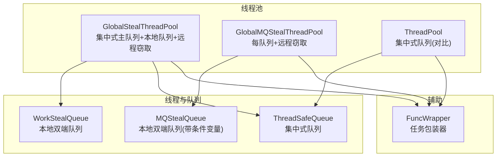
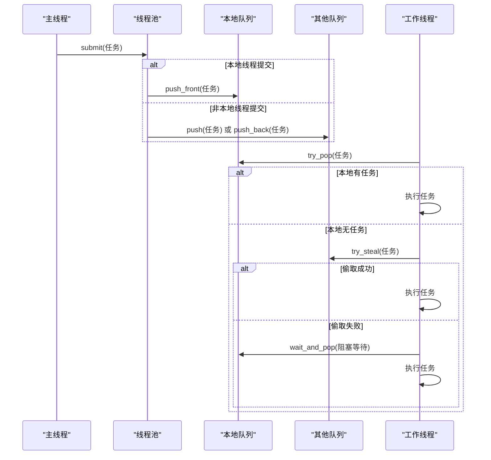
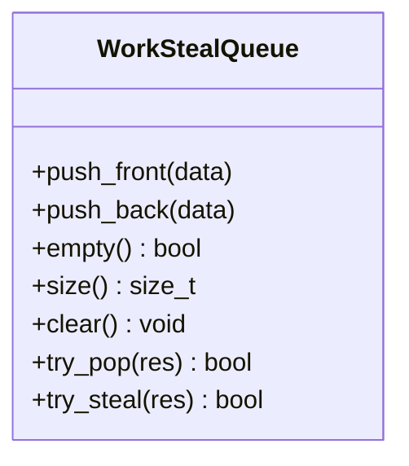
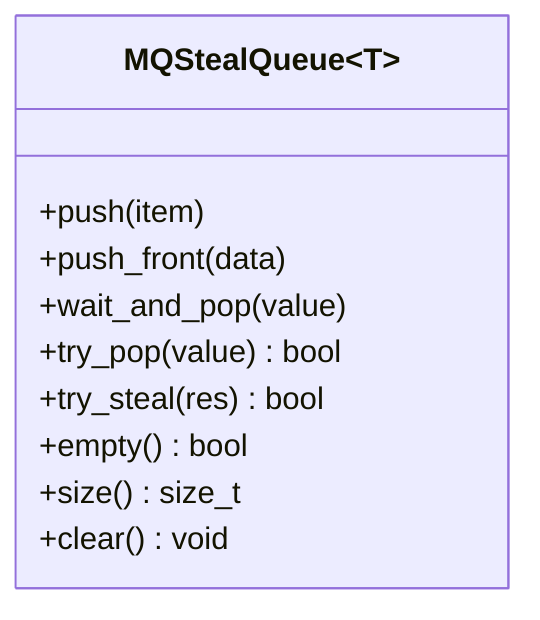
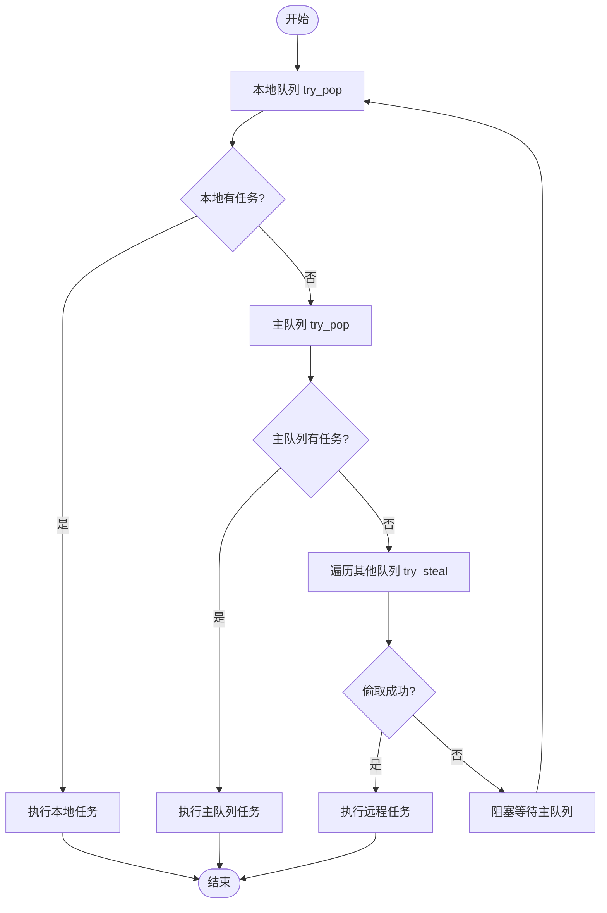
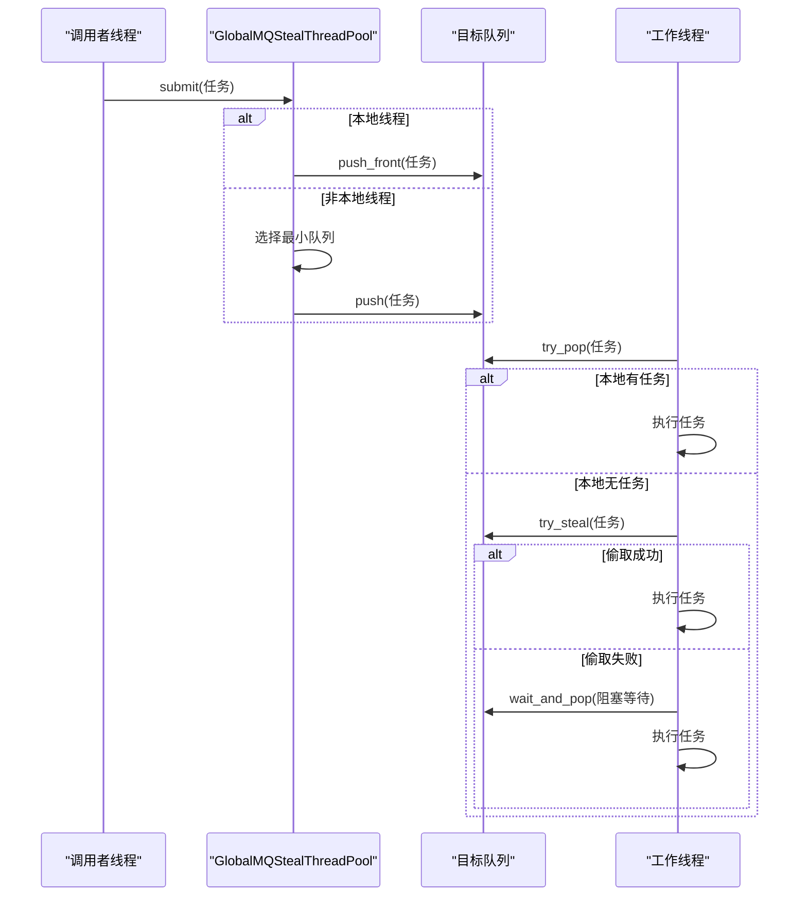
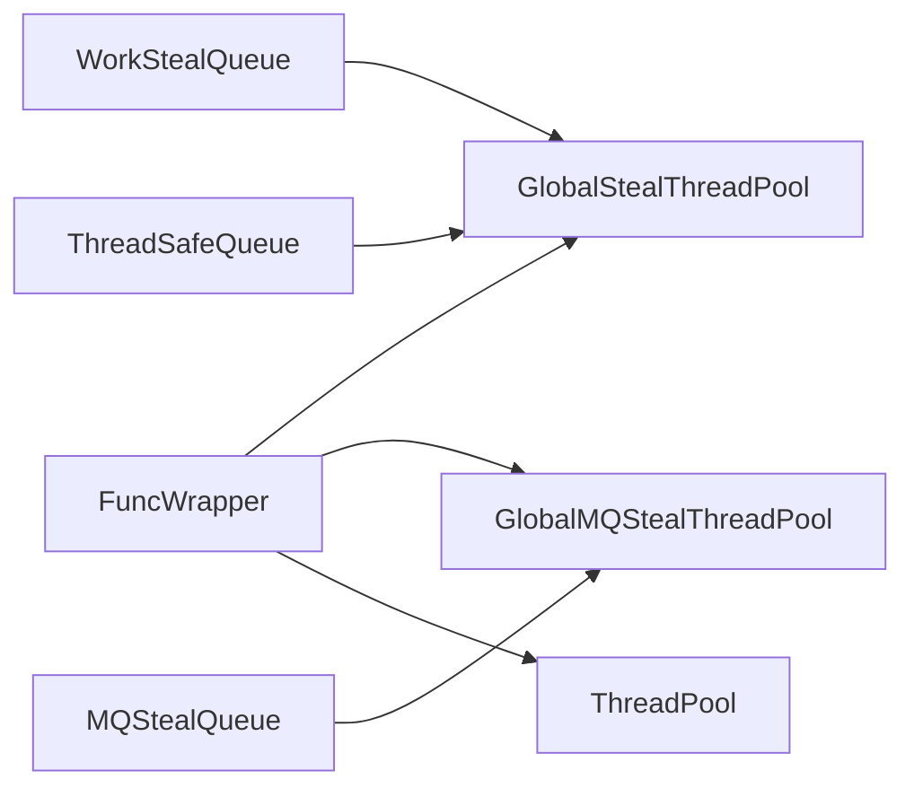

# 工作窃取算法原理

<cite>
**本文引用的文件列表**
- [WorkStealQueue.h](file://hikyuu_cpp/hikyuu/utilities/thread/WorkStealQueue.h)
- [MQStealQueue.h](file://hikyuu_cpp/hikyuu/utilities/thread/MQStealQueue.h)
- [GlobalStealThreadPool.h](file://hikyuu_cpp/hikyuu/utilities/thread/GlobalStealThreadPool.h)
- [GlobalMQStealThreadPool.h](file://hikyuu_cpp/hikyuu/utilities/thread/GlobalMQStealThreadPool.h)
- [ThreadPool.h](file://hikyuu_cpp/hikyuu/utilities/thread/ThreadPool.h)
- [ThreadSafeQueue.h](file://hikyuu_cpp/hikyuu/utilities/thread/ThreadSafeQueue.h)
- [FuncWrapper.h](file://hikyuu_cpp/hikyuu/utilities/thread/FuncWrapper.h)
- [test_ThreadPool.cpp](file://hikyuu_cpp/unit_test/hikyuu/utilities/thread/test_ThreadPool.cpp)
- [IAma.cpp](file://hikyuu_cpp/hikyuu/indicator/imp/IAma.cpp)
</cite>

## 目录
1. [引言](#引言)
2. [项目结构](#项目结构)
3. [核心组件](#核心组件)
4. [架构总览](#架构总览)
5. [详细组件分析](#详细组件分析)
6. [依赖关系分析](#依赖关系分析)
7. [性能考量](#性能考量)
8. [故障排查指南](#故障排查指南)
9. [结论](#结论)
10. [附录](#附录)

## 引言
本文件围绕工作窃取（Work-Stealing）算法在多线程任务调度中的实现进行系统化解析，重点阐述双端队列（deque）在任务调度中的作用：本地线程从队列头部获取任务，其他线程从队列尾部“窃取”任务以实现负载均衡；同时说明该算法如何减少线程间竞争、避免任务饥饿，并提升多核处理器的并行效率。文档结合代码片段路径展示任务入队、本地执行与远程窃取的具体流程，并分析在高并发与低并发场景下的调度策略差异。

## 项目结构
本仓库中与工作窃取算法直接相关的实现集中在 utilities/thread 目录下，包含：
- 双端队列实现：WorkStealQueue（集中式主队列 + 每线程本地队列）与 MQStealQueue（每线程本地队列，带条件变量）
- 线程池实现：GlobalStealThreadPool（集中式主队列 + 每线程本地队列 + 远程窃取）与 GlobalMQStealThreadPool（每线程本地队列 + 远程窃取）
- 辅助组件：ThreadSafeQueue（集中式队列）、FuncWrapper（可移动的任务包装器）

图表来源
- [GlobalStealThreadPool.h](file://hikyuu_cpp/hikyuu/utilities/thread/GlobalStealThreadPool.h#L1-L120)
- [GlobalMQStealThreadPool.h](file://hikyuu_cpp/hikyuu/utilities/thread/GlobalMQStealThreadPool.h#L1-L120)
- [WorkStealQueue.h](file://hikyuu_cpp/hikyuu/utilities/thread/WorkStealQueue.h#L1-L106)
- [MQStealQueue.h](file://hikyuu_cpp/hikyuu/utilities/thread/MQStealQueue.h#L1-L113)
- [ThreadSafeQueue.h](file://hikyuu_cpp/hikyuu/utilities/thread/ThreadSafeQueue.h#L1-L106)
- [FuncWrapper.h](file://hikyuu_cpp/hikyuu/utilities/thread/FuncWrapper.h#L1-L86)

章节来源
- [GlobalStealThreadPool.h](file://hikyuu_cpp/hikyuu/utilities/thread/GlobalStealThreadPool.h#L1-L120)
- [GlobalMQStealThreadPool.h](file://hikyuu_cpp/hikyuu/utilities/thread/GlobalMQStealThreadPool.h#L1-L120)
- [WorkStealQueue.h](file://hikyuu_cpp/hikyuu/utilities/thread/WorkStealQueue.h#L1-L106)
- [MQStealQueue.h](file://hikyuu_cpp/hikyuu/utilities/thread/MQStealQueue.h#L1-L113)
- [ThreadSafeQueue.h](file://hikyuu_cpp/hikyuu/utilities/thread/ThreadSafeQueue.h#L1-L106)
- [FuncWrapper.h](file://hikyuu_cpp/hikyuu/utilities/thread/FuncWrapper.h#L1-L86)

## 核心组件
- 双端队列（deque）：支持从头部/尾部高效插入与弹出，是工作窃取的基础数据结构。
- 本地队列：每个工作线程拥有自己的本地队列，优先从本地队列取任务，降低跨线程竞争。
- 远程窃取：当本地队列为空时，尝试从其他线程的队列尾部“偷取”任务，实现负载均衡。
- 任务包装器：统一任务类型，支持移动语义，便于在线程池中传递与执行。
- 集中式队列：GlobalStealThreadPool 提供集中式主队列，用于非本地线程提交的任务或初始任务。

章节来源
- [WorkStealQueue.h](file://hikyuu_cpp/hikyuu/utilities/thread/WorkStealQueue.h#L37-L100)
- [MQStealQueue.h](file://hikyuu_cpp/hikyuu/utilities/thread/MQStealQueue.h#L23-L88)
- [FuncWrapper.h](file://hikyuu_cpp/hikyuu/utilities/thread/FuncWrapper.h#L27-L58)
- [GlobalStealThreadPool.h](file://hikyuu_cpp/hikyuu/utilities/thread/GlobalStealThreadPool.h#L99-L146)

## 架构总览
工作窃取线程池通过“本地优先 + 远程窃取”的策略，最大化利用多核并行能力：
- 本地线程优先从自身队列头部取任务，保证局部性与低竞争。
- 当本地队列为空时，尝试从其他线程队列尾部“偷取”，实现动态负载均衡。
- GlobalStealThreadPool 支持集中式主队列，便于主线程提交初始任务；GlobalMQStealThreadPool 则完全去中心化，按最小队列长度选择目标队列。

图表来源
- [GlobalStealThreadPool.h](file://hikyuu_cpp/hikyuu/utilities/thread/GlobalStealThreadPool.h#L99-L146)
- [GlobalMQStealThreadPool.h](file://hikyuu_cpp/hikyuu/utilities/thread/GlobalMQStealThreadPool.h#L106-L142)
- [WorkStealQueue.h](file://hikyuu_cpp/hikyuu/utilities/thread/WorkStealQueue.h#L66-L100)
- [MQStealQueue.h](file://hikyuu_cpp/hikyuu/utilities/thread/MQStealQueue.h#L36-L88)

## 详细组件分析

### 双端队列（WorkStealQueue）
- 数据结构：内部使用 std::deque，提供从头部/尾部插入与弹出。
- 并发控制：每个操作均使用互斥锁保护，确保线程安全。
- 关键接口：
  - push_front/push_back：本地线程优先入队（形成“栈式”局部性）。
  - try_pop：从头部弹出，本地线程优先消费。
  - try_steal：从尾部“偷取”，其他线程消费，避免饥饿。

图表来源
- [WorkStealQueue.h](file://hikyuu_cpp/hikyuu/utilities/thread/WorkStealQueue.h#L37-L100)

章节来源
- [WorkStealQueue.h](file://hikyuu_cpp/hikyuu/utilities/thread/WorkStealQueue.h#L37-L100)

### 双端队列（MQStealQueue）
- 数据结构：内部使用 std::deque，提供从头部/尾部插入与弹出。
- 并发控制：每个操作使用互斥锁保护；wait_and_pop 使用条件变量阻塞等待。
- 关键接口：
  - push/push_front：本地线程优先入队。
  - wait_and_pop/try_pop：从头部弹出，支持阻塞等待。
  - try_steal：从尾部“偷取”。

图表来源
- [MQStealQueue.h](file://hikyuu_cpp/hikyuu/utilities/thread/MQStealQueue.h#L23-L88)

章节来源
- [MQStealQueue.h](file://hikyuu_cpp/hikyuu/utilities/thread/MQStealQueue.h#L23-L88)

### 全局工作窃取线程池（GlobalStealThreadPool）
- 结构组成：
  - 每个线程拥有一个 WorkStealQueue 作为本地队列。
  - 提供集中式 ThreadSafeQueue 作为主队列，用于非本地线程提交的任务。
  - 线程本地变量保存当前线程索引与本地队列指针。
- 提交任务：
  - 若是本地线程提交，直接 push_front 到本地队列，形成“栈式”局部性。
  - 若是非本地线程提交，加入主队列并通知一个等待线程。
- 执行流程：
  - 优先从本地队列 try_pop。
  - 若本地为空，尝试从主队列 try_pop。
  - 若仍为空，遍历其他线程队列 try_steal。
  - 若仍为空，阻塞等待主队列有新任务。
- 终止策略：
  - 通过空任务标记与条件变量唤醒所有线程，逐步退出。

图表来源
- [GlobalStealThreadPool.h](file://hikyuu_cpp/hikyuu/utilities/thread/GlobalStealThreadPool.h#L264-L310)

章节来源
- [GlobalStealThreadPool.h](file://hikyuu_cpp/hikyuu/utilities/thread/GlobalStealThreadPool.h#L99-L146)
- [GlobalStealThreadPool.h](file://hikyuu_cpp/hikyuu/utilities/thread/GlobalStealThreadPool.h#L264-L310)

### 全局多队列工作窃取线程池（GlobalMQStealThreadPool）
- 结构组成：
  - 每个线程拥有一个 MQStealQueue 作为本地队列。
  - 无集中式主队列，任务由提交线程选择“最短队列”加入其尾部。
- 提交任务：
  - 本地线程：push_front 到自身队列。
  - 非本地线程：扫描各队列，选择 size 最小的队列 push。
- 执行流程：
  - 优先本地 try_pop。
  - 若本地为空，尝试其他队列 try_steal。
  - 若仍为空，wait_and_pop 阻塞等待本地队列有新任务。
- 终止策略：
  - 通过空任务标记与队列尾部空任务哨兵，逐步唤醒并退出。

图表来源
- [GlobalMQStealThreadPool.h](file://hikyuu_cpp/hikyuu/utilities/thread/GlobalMQStealThreadPool.h#L106-L142)
- [GlobalMQStealThreadPool.h](file://hikyuu_cpp/hikyuu/utilities/thread/GlobalMQStealThreadPool.h#L268-L298)
- [MQStealQueue.h](file://hikyuu_cpp/hikyuu/utilities/thread/MQStealQueue.h#L36-L88)

章节来源
- [GlobalMQStealThreadPool.h](file://hikyuu_cpp/hikyuu/utilities/thread/GlobalMQStealThreadPool.h#L106-L142)
- [GlobalMQStealThreadPool.h](file://hikyuu_cpp/hikyuu/utilities/thread/GlobalMQStealThreadPool.h#L268-L298)
- [MQStealQueue.h](file://hikyuu_cpp/hikyuu/utilities/thread/MQStealQueue.h#L23-L88)

### 对比：集中式线程池（ThreadPool）
- 无本地队列与远程窃取，所有任务进入集中式队列。
- 适合任务彼此独立、无需互相等待的场景。
- 与工作窃取相比，竞争更集中，但局部性较差。

章节来源
- [ThreadPool.h](file://hikyuu_cpp/hikyuu/utilities/thread/ThreadPool.h#L31-L112)
- [ThreadSafeQueue.h](file://hikyuu_cpp/hikyuu/utilities/thread/ThreadSafeQueue.h#L23-L73)

## 依赖关系分析
- 线程池与队列：
  - GlobalStealThreadPool 依赖 WorkStealQueue（本地队列）与 ThreadSafeQueue（主队列）。
  - GlobalMQStealThreadPool 依赖 MQStealQueue（本地队列）。
- 任务包装：
  - 所有线程池均使用 FuncWrapper 统一任务类型，支持移动语义。
- 使用示例：
  - 单元测试展示了线程池的基本使用方式。
  - 指标计算模块 IAma.cpp 展示了如何将大任务分片并提交给线程池执行。

图表来源
- [GlobalStealThreadPool.h](file://hikyuu_cpp/hikyuu/utilities/thread/GlobalStealThreadPool.h#L1-L120)
- [GlobalMQStealThreadPool.h](file://hikyuu_cpp/hikyuu/utilities/thread/GlobalMQStealThreadPool.h#L1-L120)
- [ThreadPool.h](file://hikyuu_cpp/hikyuu/utilities/thread/ThreadPool.h#L31-L112)
- [FuncWrapper.h](file://hikyuu_cpp/hikyuu/utilities/thread/FuncWrapper.h#L27-L58)

章节来源
- [GlobalStealThreadPool.h](file://hikyuu_cpp/hikyuu/utilities/thread/GlobalStealThreadPool.h#L1-L120)
- [GlobalMQStealThreadPool.h](file://hikyuu_cpp/hikyuu/utilities/thread/GlobalMQStealThreadPool.h#L1-L120)
- [ThreadPool.h](file://hikyuu_cpp/hikyuu/utilities/thread/ThreadPool.h#L31-L112)
- [FuncWrapper.h](file://hikyuu_cpp/hikyuu/utilities/thread/FuncWrapper.h#L27-L58)

## 性能考量
- 本地优先与远程窃取：
  - 本地队列采用头部弹出，配合 push_front 形成“栈式”局部性，减少跨线程竞争。
  - 远程窃取从尾部弹出，避免与本地线程的头部写入冲突，提高吞吐。
- 条件变量与阻塞：
  - MQStealQueue 的 wait_and_pop 提供阻塞等待，降低忙等开销。
  - GlobalStealThreadPool 在主队列为空时阻塞等待，避免频繁唤醒。
- 负载均衡策略：
  - GlobalMQStealThreadPool 选择“最短队列”入队，天然实现负载均衡。
  - GlobalStealThreadPool 通过 try_steal 遍历邻居队列，实现动态均衡。
- 线程终止与饥饿避免：
  - 通过空任务哨兵与条件变量/通知机制，确保线程在无任务时优雅退出，避免饥饿。

章节来源
- [GlobalMQStealThreadPool.h](file://hikyuu_cpp/hikyuu/utilities/thread/GlobalMQStealThreadPool.h#L106-L142)
- [GlobalStealThreadPool.h](file://hikyuu_cpp/hikyuu/utilities/thread/GlobalStealThreadPool.h#L264-L310)
- [MQStealQueue.h](file://hikyuu_cpp/hikyuu/utilities/thread/MQStealQueue.h#L36-L88)
- [ThreadSafeQueue.h](file://hikyuu_cpp/hikyuu/utilities/thread/ThreadSafeQueue.h#L36-L73)

## 故障排查指南
- 提交任务后无响应：
  - 检查是否在停止后的线程池中提交任务（会抛出逻辑错误）。
  - 确认线程池是否处于“运行直到队列空”的模式，必要时调用 join 或 stop。
- 线程池无法退出：
  - 确保已向各队列推送空任务哨兵（线程池内部会在 stop/join 时处理）。
  - 检查是否存在递归任务导致本地队列持续增长。
- 高并发下性能不升反降：
  - 确认任务粒度是否过小（频繁上下文切换）。
  - 对于递归/父子任务强耦合场景，优先考虑 GlobalStealThreadPool。
- 使用示例参考：
  - 单元测试展示了基本 submit 与 join 流程，可对照检查调用链路。

章节来源
- [GlobalStealThreadPool.h](file://hikyuu_cpp/hikyuu/utilities/thread/GlobalStealThreadPool.h#L138-L173)
- [GlobalMQStealThreadPool.h](file://hikyuu_cpp/hikyuu/utilities/thread/GlobalMQStealThreadPool.h#L153-L181)
- [test_ThreadPool.cpp](file://hikyuu_cpp/unit_test/hikyuu/utilities/thread/test_ThreadPool.cpp#L23-L41)

## 结论
工作窃取算法通过“本地优先 + 远程窃取”的双端队列设计，在多核环境下显著降低了线程间竞争，避免了任务饥饿，并提升了整体吞吐。GlobalStealThreadPool 与 GlobalMQStealThreadPool 分别针对不同场景提供了集中式与去中心化的调度策略：前者适合递归/父子任务场景，后者适合大规模任务均匀分布与快速入队。结合合适的任务粒度与终止策略，可在高并发与低并发场景下取得良好性能表现。

## 附录
- 实际使用示例与分片策略：
  - 指标计算模块 IAma.cpp 展示了将长任务按线程数分片并提交的实践，体现了工作窃取在线条化计算中的应用。

章节来源
- [IAma.cpp](file://hikyuu_cpp/hikyuu/indicator/imp/IAma.cpp#L136-L174)