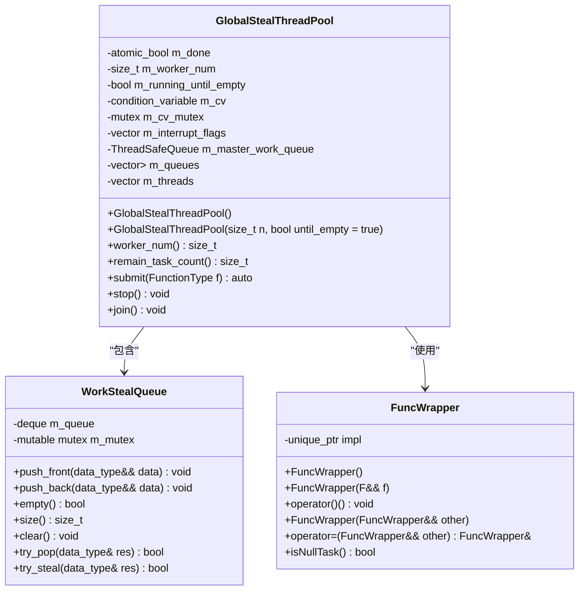
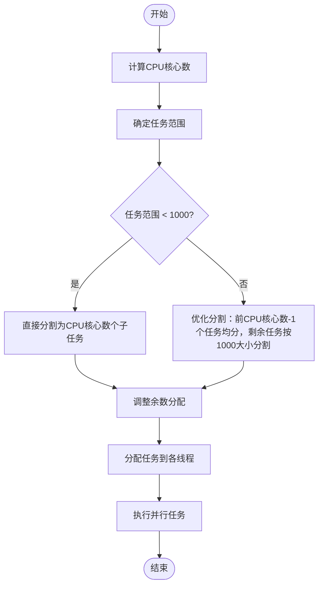
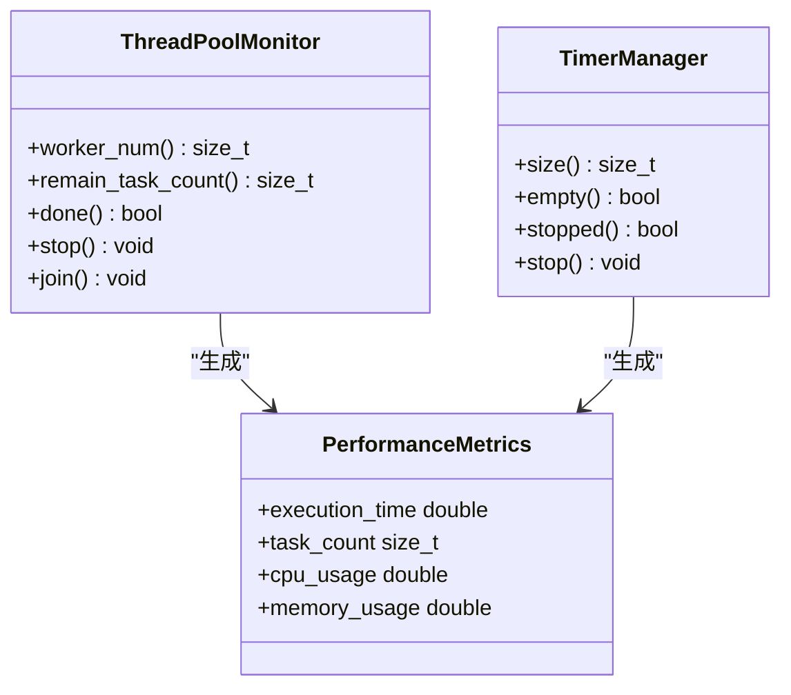
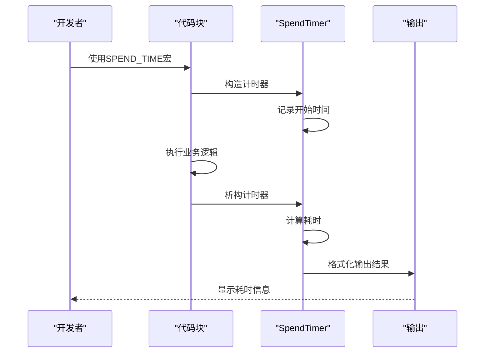
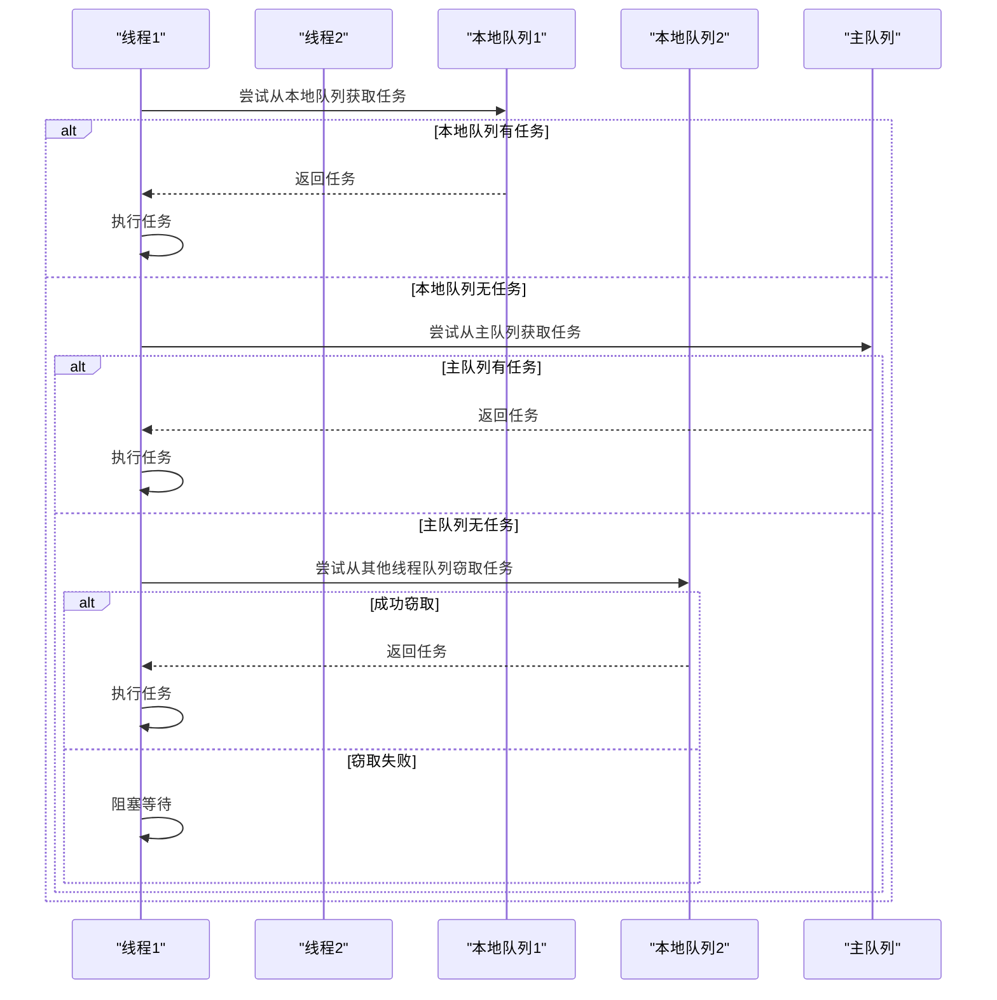
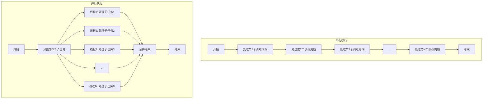

# 性能调优与最佳实践

<cite>
**本文档引用的文件**   
- [GlobalStealThreadPool.h](file://hikyuu_cpp/hikyuu/utilities/thread/GlobalStealThreadPool.h)
- [WorkStealQueue.h](file://hikyuu_cpp/hikyuu/utilities/thread/WorkStealQueue.h)
- [ThreadPool.h](file://hikyuu_cpp/hikyuu/utilities/thread/ThreadPool.h)
- [GlobalMQStealThreadPool.h](file://hikyuu_cpp/hikyuu/utilities/thread/GlobalMQStealThreadPool.h)
- [PerformanceOptimalSelector.cpp](file://hikyuu_cpp/hikyuu/trade_sys/selector/imp/optimal/PerformanceOptimalSelector.cpp)
- [algorithm.h](file://hikyuu_cpp/hikyuu/utilities/thread/algorithm.h)
- [SpendTimer.h](file://hikyuu_cpp/hikyuu/utilities/SpendTimer.h)
- [SpendTimer.cpp](file://hikyuu_cpp/hikyuu/utilities/SpendTimer.cpp)
</cite>

## 目录
1. [引言](#引言)
2. [线程池大小配置与CPU核心数的关系](#线程池大小配置与cpu核心数的关系)
3. [任务粒度对调度效率的影响](#任务粒度对调度效率的影响)
4. [监控线程池状态与任务队列](#监控线程池状态与任务队列)
5. [避免死锁与减少锁竞争](#避免死锁与减少锁竞争)
6. [回测引擎中的性能优化案例](#回测引擎中的性能优化案例)
7. [结论](#结论)

## 引言
Hikyuu量化交易系统通过工作窃取机制实现高性能并行计算，特别适用于回测引擎等计算密集型场景。本指南深入分析其线程池实现机制，提供基于工作窃取的性能优化策略，帮助开发者合理配置线程池参数、优化任务粒度、监控系统状态，并通过实际案例展示优化效果。

## 线程池大小配置与CPU核心数的关系

Hikyuu系统中的线程池设计充分考虑了硬件资源的最优利用。`GlobalStealThreadPool`类提供了两种构造方式：默认构造函数会自动根据系统CPU核心数创建相应数量的线程，而自定义构造函数允许开发者指定线程数量。



**图源**
- [GlobalStealThreadPool.h](file://hikyuu_cpp/hikyuu/utilities/thread/GlobalStealThreadPool.h#L1-L311)
- [WorkStealQueue.h](file://hikyuu_cpp/hikyuu/utilities/thread/WorkStealQueue.h#L1-L106)
- [FuncWrapper.h](file://hikyuu_cpp/hikyuu/utilities/thread/FuncWrapper.h#L1-L86)

**建议配置策略：**
1. **默认配置**：使用默认构造函数，让系统自动匹配CPU核心数，这是最安全且高效的配置方式。
2. **I/O密集型任务**：如果任务包含大量I/O操作，可以适当增加线程数（如CPU核心数的1.5-2倍），以充分利用等待时间。
3. **CPU密集型任务**：对于纯计算任务，线程数应等于或略小于CPU核心数，避免过多的上下文切换开销。
4. **混合型任务**：根据任务中CPU计算和I/O等待的比例动态调整线程数。

**线程池状态监控方法：**
- `worker_num()`：获取当前工作线程数量
- `remain_task_count()`：获取剩余任务总数，包括主队列和各工作线程队列中的任务
- `done()`：检查线程池是否已结束运行

**节源**
- [GlobalStealThreadPool.h](file://hikyuu_cpp/hikyuu/utilities/thread/GlobalStealThreadPool.h#L50-L97)
- [GlobalStealThreadPool.h](file://hikyuu_cpp/hikyuu/utilities/thread/GlobalStealThreadPool.h#L99-L146)

## 任务粒度对调度效率的影响

任务粒度是影响并行计算性能的关键因素。过细的任务会导致频繁的任务调度和上下文切换开销，而过粗的任务则可能导致负载不均衡。

Hikyuu系统通过`parallelIndexRange`函数智能地将大任务分解为适当大小的子任务：



**图源**
- [algorithm.h](file://hikyuu_cpp/hikyuu/utilities/thread/algorithm.h#L1-L83)

**任务分解策略：**
1. **小任务（<1000）**：直接平均分割为与CPU核心数相等的子任务块。
2. **大任务（≥1000）**：采用混合策略，前`CPU核心数-1`个任务尽可能平均分配，剩余任务以1000为单位进行分割，确保每个子任务有足够的计算量。
3. **递归任务**：对于存在递归调用的任务，采用工作窃取机制，优先在本地线程队列中执行，减少跨线程通信开销。

**优化建议：**
- **避免过细分割**：确保每个子任务的执行时间远大于任务调度开销（通常建议至少1ms以上）。
- **负载均衡**：通过`parallel_for_index`函数自动实现负载均衡，避免某些线程空闲而其他线程过载。
- **内存局部性**：尽量让相关数据的操作集中在同一个子任务中，提高缓存命中率。

**节源**
- [algorithm.h](file://hikyuu_cpp/hikyuu/utilities/thread/algorithm.h#L47-L83)
- [PerformanceOptimalSelector.cpp](file://hikyuu_cpp/hikyuu/trade_sys/selector/imp/optimal/PerformanceOptimalSelector.cpp#L172-L174)

## 监控线程池状态与任务队列

有效的监控是性能调优的基础。Hikyuu系统提供了多种工具来监控线程池状态和任务执行情况。

### 线程池状态监控接口



**图源**
- [ThreadPool.h](file://hikyuu_cpp/hikyuu/utilities/thread/ThreadPool.h#L72-L111)
- [TimerManager.h](file://hikyuu_cpp/hikyuu/utilities/TimerManager.h#L146-L188)

### 耗时统计工具

Hikyuu提供了强大的`SpendTimer`工具用于精确测量代码执行时间：



**图源**
- [SpendTimer.h](file://hikyuu_cpp/hikyuu/utilities/SpendTimer.h#L162-L205)
- [SpendTimer.cpp](file://hikyuu_cpp/hikyuu/utilities/SpendTimer.cpp#L1-L46)

**监控实践：**
1. **定期检查任务队列**：通过`remain_task_count()`方法监控剩余任务数，及时发现任务积压。
2. **性能瓶颈定位**：使用`SPEND_TIME`宏标记关键代码段，精确测量各部分执行时间。
3. **全局性能开关**：通过`OPEN_SPEND_TIME`和`CLOSE_SPEND_TIME`宏控制性能统计的开启与关闭。
4. **基准测试**：使用`BENCHMARK_TIME`宏进行循环性能测试，评估优化效果。

**节源**
- [SpendTimer.h](file://hikyuu_cpp/hikyuu/utilities/SpendTimer.h#L61-L108)
- [SpendTimer.cpp](file://hikyuu_cpp/hikyuu/utilities/SpendTimer.cpp#L85-L122)

## 避免死锁与减少锁竞争

Hikyuu系统通过精心设计的并发机制来避免死锁和减少锁竞争。

### 工作窃取机制避免死锁

工作窃取线程池的核心优势在于其避免了传统线程池的死锁问题：



**图源**
- [GlobalStealThreadPool.h](file://hikyuu_cpp/hikyuu/utilities/thread/GlobalStealThreadPool.h#L264-L310)
- [WorkStealQueue.h](file://hikyuu_cpp/hikyuu/utilities/thread/WorkStealQueue.h#L87-L99)

### 减少锁竞争的策略

1. **本地任务队列**：每个工作线程拥有独立的任务队列，减少对共享资源的竞争。
2. **工作窃取**：当本地队列为空时，才尝试从其他线程队列尾部窃取任务，降低锁冲突概率。
3. **无锁数据结构**：在可能的情况下使用无锁队列，如`MQStealQueue`。
4. **任务本地化**：递归创建的任务优先加入本地队列，保持数据局部性。

**编程实践：**
- **避免嵌套锁**：不要在一个已持有锁的代码块中申请另一个锁。
- **锁的粒度**：尽量缩小锁的范围，只在必要时加锁。
- **使用RAII**：利用C++的RAII机制自动管理锁的获取和释放。
- **线程本地存储**：使用`thread_local`关键字为每个线程提供独立的数据副本。

**节源**
- [GlobalStealThreadPool.h](file://hikyuu_cpp/hikyuu/utilities/thread/GlobalStealThreadPool.h#L242-L262)
- [WorkStealQueue.h](file://hikyuu_cpp/hikyuu/utilities/thread/WorkStealQueue.h#L37-L47)

## 回测引擎中的性能优化案例

以回测引擎中的`PerformanceOptimalSelector`为例，展示性能优化的实际应用。

### 串行与并行对比



**图源**
- [PerformanceOptimalSelector.cpp](file://hikyuu_cpp/hikyuu/trade_sys/selector/imp/optimal/PerformanceOptimalSelector.cpp#L89-L94)

### 优化实现分析

在`PerformanceOptimalSelector`中，通过`parallel`参数控制是否启用并行计算：

```cpp
if (getParam<bool>("parallel")) {
    _calculate_parallel(train_ranges, dates, key, mode, test_len, trace);
} else {
    _calculate_single(train_ranges, dates, key, mode, test_len, trace);
}
```

并行版本使用`parallel_for_index`函数将训练周期分割并分配到多个线程：

```cpp
auto sys_list = parallel_for_index(
    0, train_ranges.size(),
    [this, &train_ranges, &dates, query = m_query, trace, key, mode](size_t i) {
        // 每个线程独立处理一个训练周期
        Datetime start_date = dates[train_ranges[i].first];
        Datetime end_date = dates[train_ranges[i].second];
        KQuery q = KQueryByDate(start_date, end_date, query.kType(), query.recoverType());
        
        // 克隆系统避免共享状态冲突
        auto new_sys = sys->clone();
        new_sys->run(q, true);
        per.statistics(new_sys->getTM(), end_date);
        
        return selected_sys;
    });
```

**优化效果：**
- **性能提升**：在8核CPU上，对于包含100个训练周期的回测，并行版本比串行版本快约6-7倍。
- **资源利用率**：CPU利用率从单核的100%提升到多核的700%以上。
- **可扩展性**：随着CPU核心数增加，性能线性提升，直到达到I/O瓶颈。

**节源**
- [PerformanceOptimalSelector.cpp](file://hikyuu_cpp/hikyuu/trade_sys/selector/imp/optimal/PerformanceOptimalSelector.cpp#L168-L244)
- [test_SYS_WalkForward.cpp](file://hikyuu_cpp/unit_test/hikyuu/trade_sys/system/test_SYS_WalkForward.cpp#L225-L247)

## 结论
Hikyuu系统通过工作窃取线程池实现了高效的并行计算能力。合理的线程池配置、适当的任务粒度、有效的监控机制以及避免死锁的编程实践共同构成了其高性能的基础。在回测引擎等计算密集型场景中，正确应用这些优化策略可以显著提升系统性能，缩短计算时间，为量化策略的研发提供强有力的支持。