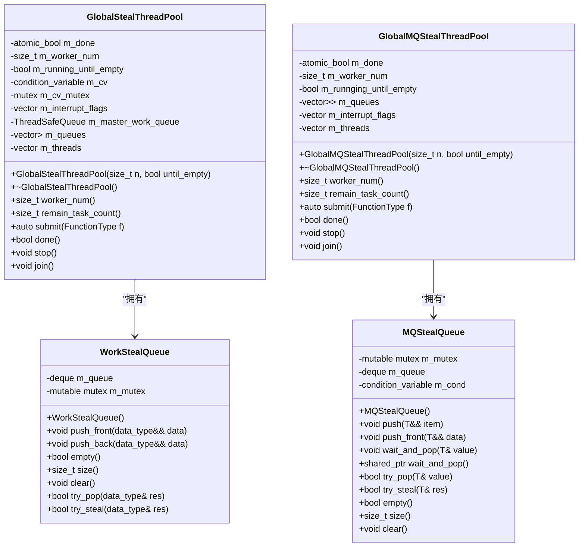
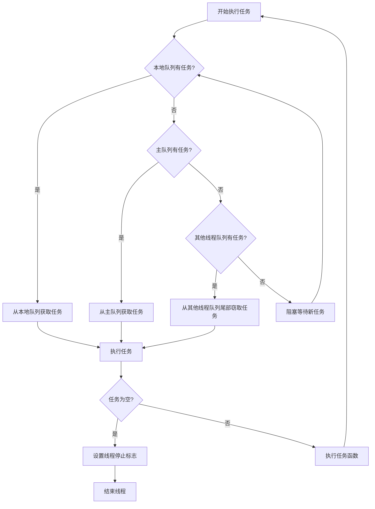
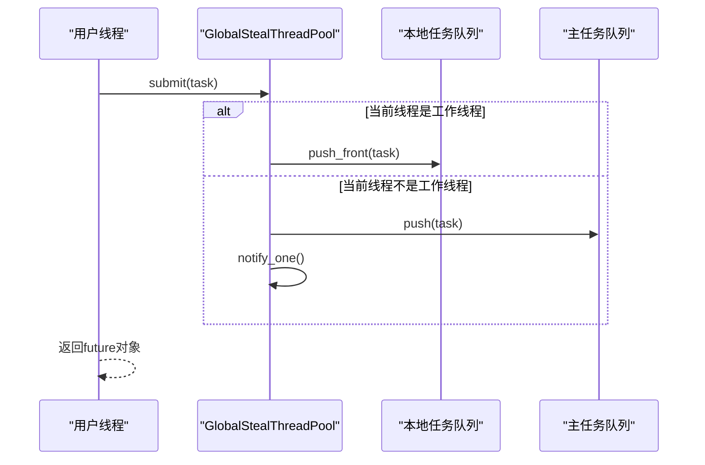
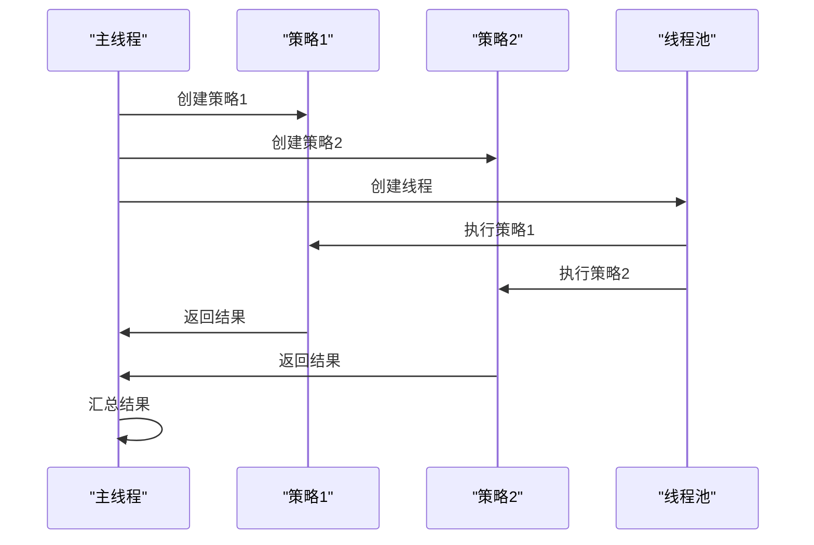

# 并发与多线程优化

<cite>
**本文档引用的文件**   
- [GlobalStealThreadPool.h](file://hikyuu_cpp/hikyuu/utilities/thread/GlobalStealThreadPool.h)
- [GlobalMQStealThreadPool.h](file://hikyuu_cpp/hikyuu/utilities/thread/GlobalMQStealThreadPool.h)
- [WorkStealQueue.h](file://hikyuu_cpp/hikyuu/utilities/thread/WorkStealQueue.h)
- [MQStealQueue.h](file://hikyuu_cpp/hikyuu/utilities/thread/MQStealQueue.h)
- [ThreadSafeQueue.h](file://hikyuu_cpp/hikyuu/utilities/thread/ThreadSafeQueue.h)
- [FuncWrapper.h](file://hikyuu_cpp/hikyuu/utilities/thread/FuncWrapper.h)
- [InterruptFlag.h](file://hikyuu_cpp/hikyuu/utilities/thread/InterruptFlag.h)
- [algorithm.h](file://hikyuu_cpp/hikyuu/utilities/thread/algorithm.h)
- [demo2.cpp](file://hikyuu_cpp/demo/demo2.cpp)
- [test_SYS_WalkForward.cpp](file://hikyuu_cpp/unit_test/hikyuu/trade_sys/system/test_SYS_WalkForward.cpp)
</cite>

## 目录
1. [引言](#引言)
2. [多线程架构概述](#多线程架构概述)
3. [GlobalThreadPool实现原理](#globalthreadpool实现原理)
4. [工作窃取算法](#工作窃取算法)
5. [任务调度机制](#任务调度机制)
6. [并行化策略回测](#并行化策略回测)
7. [线程安全编程实践](#线程安全编程实践)
8. [线程池配置调优](#线程池配置调优)
9. [总结](#总结)

## 引言

Hikyuu框架为提高计算性能，特别是在策略回测和参数优化等计算密集型场景中，采用了先进的多线程架构和并发优化方案。本文档全面介绍框架的多线程架构，重点阐述GlobalThreadPool的实现原理、工作窃取（work-stealing）算法和任务调度机制。通过深入分析，指导用户如何利用线程池进行并行化策略回测，并提供线程安全的编程实践和配置调优建议。

## 多线程架构概述

Hikyuu框架的多线程架构设计旨在最大化利用多核CPU的计算能力，同时保证任务执行的高效性和线程安全。框架提供了多种线程池实现，以适应不同的应用场景：

- **GlobalThreadPool**: 全局集中式任务队列线程池，适用于任务之间彼此独立、无依赖关系的场景。
- **GlobalStealThreadPool**: 分布式偷取式线程池，适用于存在递归情况或任务间有依赖关系的场景。
- **GlobalMQThreadPool**: 全局分布式线程池，每个工作线程拥有独立的任务队列。
- **GlobalMQStealThreadPool**: 无集中队列的多队列偷取任务池，结合了分布式队列和工作窃取的优点。

这些线程池共同构成了Hikyuu框架的并发执行基础，支持策略回测、参数优化、数据处理等核心功能的并行化执行。

**Section sources**
- [GlobalStealThreadPool.h](file://hikyuu_cpp/hikyuu/utilities/thread/GlobalStealThreadPool.h#L34-L38)
- [GlobalMQStealThreadPool.h](file://hikyuu_cpp/hikyuu/utilities/thread/GlobalMQStealThreadPool.h#L32-L34)

## GlobalThreadPool实现原理

GlobalThreadPool是Hikyuu框架中核心的线程池实现之一，其设计基于生产者-消费者模式和工作窃取算法。线程池的核心组件包括：

- **任务队列**: 每个工作线程拥有一个独立的`WorkStealQueue`或`MQStealQueue`，用于存储待执行的任务。
- **工作线程**: 线程池创建指定数量的工作线程，每个线程独立运行并从任务队列中获取任务执行。
- **任务提交**: 通过`submit`方法向线程池提交任务，任务被包装为`FuncWrapper`对象并加入到相应的任务队列中。
- **线程本地存储**: 使用`thread_local`变量存储线程本地的任务队列指针和索引，提高任务获取效率。

线程池的构造函数负责初始化工作线程和任务队列，而析构函数则确保在销毁前等待所有任务完成。



**Diagram sources**
- [GlobalStealThreadPool.h](file://hikyuu_cpp/hikyuu/utilities/thread/GlobalStealThreadPool.h#L44-L306)
- [GlobalMQStealThreadPool.h](file://hikyuu_cpp/hikyuu/utilities/thread/GlobalMQStealThreadPool.h#L39-L309)
- [WorkStealQueue.h](file://hikyuu_cpp/hikyuu/utilities/thread/WorkStealQueue.h#L23-L101)
- [MQStealQueue.h](file://hikyuu_cpp/hikyuu/utilities/thread/MQStealQueue.h#L19-L110)

## 工作窃取算法

工作窃取（Work-Stealing）算法是Hikyuu线程池实现高性能的关键。该算法的核心思想是：当一个工作线程完成自己的任务后，它不会立即进入空闲状态，而是主动从其他工作线程的任务队列中"窃取"任务来执行。

### 算法实现

在`GlobalStealThreadPool`中，工作窃取算法的实现如下：

1. **本地任务优先**: 工作线程首先尝试从自己的本地任务队列中获取任务（`pop_task_from_local_queue`）。
2. **主队列获取**: 如果本地队列为空，则尝试从主任务队列中获取任务（`pop_task_from_master_queue`）。
3. **工作窃取**: 如果主队列也为空，则尝试从其他工作线程的任务队列尾部窃取任务（`pop_task_from_other_thread_queue`）。
4. **阻塞等待**: 如果所有队列都为空，则线程进入阻塞等待状态，直到有新任务加入。



**Diagram sources**
- [GlobalStealThreadPool.h](file://hikyuu_cpp/hikyuu/utilities/thread/GlobalStealThreadPool.h#L264-L305)
- [WorkStealQueue.h](file://hikyuu_cpp/hikyuu/utilities/thread/WorkStealQueue.h#L87-L99)

### 窃取策略

Hikyuu框架采用了特定的窃取策略来优化性能：

- **后进先出(LIFO)本地执行**: 本地线程任务从前部入队列，形成栈结构，这有利于缓存局部性。
- **先进先出(FIFO)远程窃取**: 从其他线程队列的尾部窃取任务，减少对源线程性能的影响。
- **循环遍历**: 在`pop_task_from_other_thread_queue`方法中，使用循环遍历的方式尝试从其他线程队列中窃取任务。

这种策略组合既保证了本地任务的高效执行，又实现了任务的均衡分配。

**Section sources**
- [GlobalStealThreadPool.h](file://hikyuu_cpp/hikyuu/utilities/thread/GlobalStealThreadPool.h#L119-L122)
- [WorkStealQueue.h](file://hikyuu_cpp/hikyuu/utilities/thread/WorkStealQueue.h#L38-L47)

## 任务调度机制

Hikyuu框架的任务调度机制设计精巧，确保了任务的高效分发和执行。

### 任务提交

任务通过`submit`方法提交到线程池。提交过程如下：

1. **线程本地提交**: 如果当前线程是工作线程，则将任务加入到自己的本地任务队列头部。
2. **主队列提交**: 如果当前线程不是工作线程，则将任务加入到主任务队列，并通知等待的线程。



**Diagram sources**
- [GlobalStealThreadPool.h](file://hikyuu_cpp/hikyuu/utilities/thread/GlobalStealThreadPool.h#L108-L127)

### 任务执行

工作线程的执行流程如下：

1. **初始化**: 在`worker_thread`方法中，设置线程本地变量，包括任务队列指针和索引。
2. **循环执行**: 在`run_pending_task`方法中，循环尝试获取并执行任务。
3. **终止条件**: 当收到停止信号或所有任务完成时，退出循环。

**Section sources**
- [GlobalStealThreadPool.h](file://hikyuu_cpp/hikyuu/utilities/thread/GlobalStealThreadPool.h#L253-L262)
- [GlobalStealThreadPool.h](file://hikyuu_cpp/hikyuu/utilities/thread/GlobalStealThreadPool.h#L264-L285)

## 并行化策略回测

Hikyuu框架提供了强大的并行化策略回测能力，用户可以通过简单的配置实现多策略或多参数组合的并行执行。

### 多策略并行执行

通过创建多个`Strategy`实例并使用多线程技术，可以实现多个策略的并行回测。以下是一个示例：



**Diagram sources**
- [demo2.cpp](file://hikyuu_cpp/demo/demo2.cpp#L51-L79)

### 参数优化并行化

在参数优化场景中，可以通过设置系统参数`parallel`为`true`来启用并行化执行：

```cpp
auto sys = SYS_WalkForward(SystemList{create_test_sys(3, 5)}, tm, 30, 20, se);
sys->setParam<bool>("parallel", true);
sys->run(stk, query);
```

此配置使得候选系统的评估可以并行执行，显著提高优化效率。

**Section sources**
- [test_SYS_WalkForward.cpp](file://hikyuu_cpp/unit_test/hikyuu/trade_sys/system/test_SYS_WalkForward.cpp#L82-L120)
- [test_SYS_WalkForward.cpp](file://hikyuu_cpp/unit_test/hikyuu/trade_sys/system/test_SYS_WalkForward.cpp#L225-L247)

## 线程安全编程实践

在多线程环境中，确保线程安全是至关重要的。Hikyuu框架通过多种机制保证线程安全：

### 数据竞争避免

- **线程本地存储**: 使用`thread_local`变量避免多个线程访问同一变量。
- **原子操作**: 对共享状态使用`std::atomic`类型进行原子操作。
- **互斥锁**: 在访问共享资源时使用`std::mutex`进行同步。

### 死锁预防

- **锁顺序**: 确保所有线程以相同的顺序获取多个锁。
- **超时机制**: 在等待锁时设置超时，避免无限等待。
- **避免嵌套锁**: 尽量减少锁的嵌套使用。

### 异常安全

- **RAII**: 使用资源获取即初始化（RAII）模式，确保资源的正确释放。
- **异常传播**: 通过`std::future`和`std::promise`机制，将子线程中的异常传播到主线程。

**Section sources**
- [GlobalStealThreadPool.h](file://hikyuu_cpp/hikyuu/utilities/thread/GlobalStealThreadPool.h#L243-L251)
- [InterruptFlag.h](file://hikyuu_cpp/hikyuu/utilities/thread/InterruptFlag.h#L14-L44)

## 线程池配置调优

合理的线程池配置对性能有重要影响。以下是一些调优建议：

### 线程数配置

- **CPU密集型任务**: 线程数设置为CPU核心数或略多。
- **I/O密集型任务**: 线程数可以设置为CPU核心数的2-4倍。

### 队列大小

- **任务队列**: 根据任务的生成速度和处理速度调整队列大小，避免内存溢出。
- **本地队列**: 保持较小的本地队列以促进工作窃取。

### 硬件适应

- **多核系统**: 充分利用多核优势，配置与核心数匹配的线程池。
- **内存限制**: 在内存受限的环境中，减少线程数和队列大小。

### 性能监控

通过`remain_task_count`方法监控剩余任务数，评估线程池的负载情况：

```cpp
size_t task_count = thread_pool.remain_task_count();
```

**Section sources**
- [GlobalStealThreadPool.h](file://hikyuu_cpp/hikyuu/utilities/thread/GlobalStealThreadPool.h#L87-L97)
- [GlobalMQStealThreadPool.h](file://hikyuu_cpp/hikyuu/utilities/thread/GlobalMQStealThreadPool.h#L84-L94)

## 总结

Hikyuu框架的多线程架构和并发优化方案为高性能计算提供了坚实的基础。通过深入理解GlobalThreadPool的实现原理、工作窃取算法和任务调度机制，用户可以充分利用框架的并行化能力，显著提升策略回测和参数优化的效率。遵循线程安全的编程实践和合理的配置调优建议，可以在不同硬件环境下实现最佳性能。