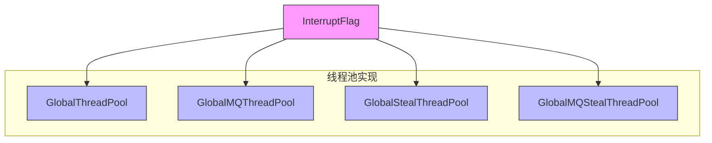
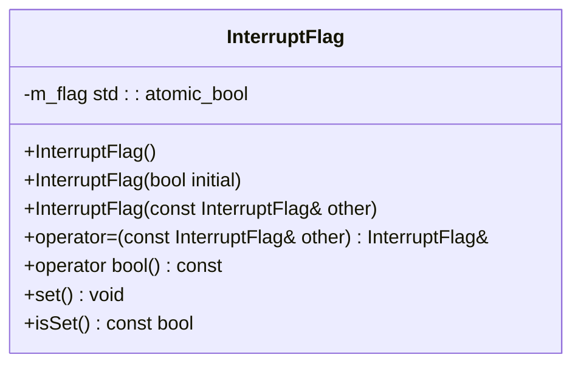
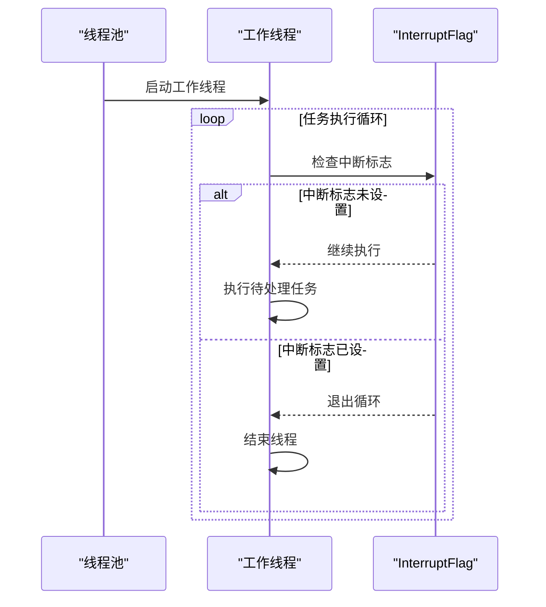
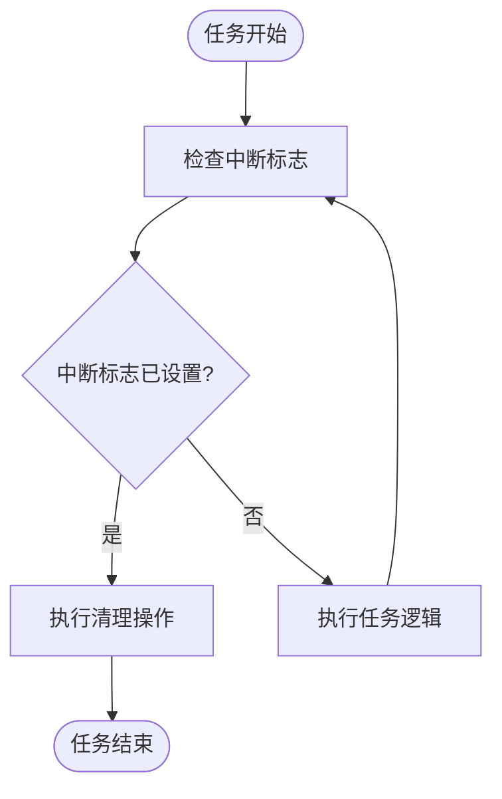
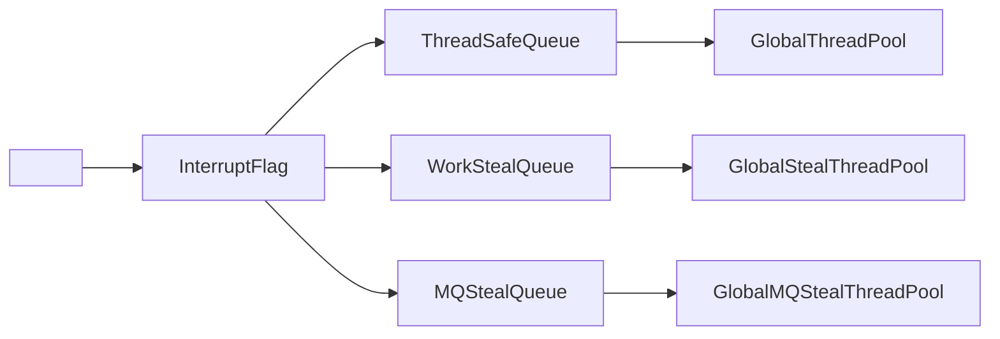

# InterruptFlag 中断机制

<cite>
**本文档引用的文件**   
- [InterruptFlag.h](file://hikyuu_cpp/hikyuu/utilities/thread/InterruptFlag.h)
- [GlobalThreadPool.h](file://hikyuu_cpp/hikyuu/utilities/thread/GlobalThreadPool.h)
- [GlobalMQThreadPool.h](file://hikyuu_cpp/hikyuu/utilities/thread/GlobalMQThreadPool.h)
- [GlobalStealThreadPool.h](file://hikyuu_cpp/hikyuu/utilities/thread/GlobalStealThreadPool.h)
- [GlobalMQStealThreadPool.h](file://hikyuu_cpp/hikyuu/utilities/thread/GlobalMQStealThreadPool.h)
</cite>

## 目录
1. [引言](#引言)
2. [核心组件](#核心组件)
3. [架构概述](#架构概述)
4. [详细组件分析](#详细组件分析)
5. [依赖分析](#依赖分析)
6. [性能考虑](#性能考虑)
7. [故障排除指南](#故障排除指南)
8. [结论](#结论)

## 引言
InterruptFlag 类是 Hikyuu 项目中实现安全线程中断通知机制的核心组件。该机制通过原子变量实现跨线程状态传递，确保在多线程环境下能够安全、高效地通知线程进行优雅退出。本文档将详细阐述 InterruptFlag 的技术实现细节，以及在长时间运行任务中如何使用该机制避免资源泄漏和程序挂起问题。

## 核心组件
InterruptFlag 类通过 std::atomic_bool 实现线程安全的中断标志位，提供了 set() 和 isSet() 方法用于设置和检查中断状态。该类被设计为轻量级且高效的线程通信机制，广泛应用于各种线程池实现中。

**本节来源**
- [InterruptFlag.h](file://hikyuu_cpp/hikyuu/utilities/thread/InterruptFlag.h#L1-L46)

## 架构概述
InterruptFlag 作为线程安全的中断通知机制，被集成到多种线程池实现中，包括 GlobalThreadPool、GlobalMQThreadPool、GlobalStealThreadPool 和 GlobalMQStealThreadPool。这些线程池通过线程本地存储（thread_local）的 InterruptFlag 实例来管理各个工作线程的中断状态。

**图示来源**
- [InterruptFlag.h](file://hikyuu_cpp/hikyuu/utilities/thread/InterruptFlag.h#L1-L46)
- [GlobalThreadPool.h](file://hikyuu_cpp/hikyuu/utilities/thread/GlobalThreadPool.h#L1-L225)
- [GlobalMQThreadPool.h](file://hikyuu_cpp/hikyuu/utilities/thread/GlobalMQThreadPool.h#L1-L271)
- [GlobalStealThreadPool.h](file://hikyuu_cpp/hikyuu/utilities/thread/GlobalStealThreadPool.h#L1-L311)
- [GlobalMQStealThreadPool.h](file://hikyuu_cpp/hikyuu/utilities/thread/GlobalMQStealThreadPool.h#L1-L315)

## 详细组件分析

### InterruptFlag 类分析
InterruptFlag 类是实现安全线程中断的核心，其设计充分利用了 C++ 原子操作的特性，确保在多线程环境下的数据一致性。

**图示来源**
- [InterruptFlag.h](file://hikyuu_cpp/hikyuu/utilities/thread/InterruptFlag.h#L1-L46)

#### 技术细节
InterruptFlag 类使用 std::atomic_bool 作为底层存储，确保了对中断标志的读写操作是原子的。这避免了在多线程环境下可能出现的数据竞争问题。类提供了多种构造函数和赋值操作符，支持灵活的初始化和复制语义。

**本节来源**
- [InterruptFlag.h](file://hikyuu_cpp/hikyuu/utilities/thread/InterruptFlag.h#L1-L46)

### 线程池集成分析
InterruptFlag 被集成到多种线程池实现中，通过线程本地存储（thread_local）为每个工作线程提供独立的中断标志实例。

#### GlobalThreadPool 集成
在 GlobalThreadPool 中，InterruptFlag 通过线程本地变量 m_thread_need_stop 实现每个工作线程的中断控制。工作线程在执行任务循环中定期检查中断标志，实现优雅退出。

**图示来源**
- [GlobalThreadPool.h](file://hikyuu_cpp/hikyuu/utilities/thread/GlobalThreadPool.h#L187-L224)

#### 长时间运行任务中的应用
在策略计算、数据导入等长时间运行任务中，InterruptFlag 提供了关键的中断机制。通过定期检查中断标志，可以避免因未及时响应中断导致的资源泄漏或程序挂起问题。

**本节来源**
- [GlobalThreadPool.h](file://hikyuu_cpp/hikyuu/utilities/thread/GlobalThreadPool.h#L187-L224)
- [GlobalMQThreadPool.h](file://hikyuu_cpp/hikyuu/utilities/thread/GlobalMQThreadPool.h#L236-L271)

## 依赖分析
InterruptFlag 类的实现依赖于 C++ 标准库中的 <atomic> 头文件，这是实现原子操作的基础。在更高级的线程池实现中，InterruptFlag 与其他线程安全组件如 ThreadSafeQueue、WorkStealQueue 等协同工作，构建完整的多线程任务调度系统。

**图示来源**
- [InterruptFlag.h](file://hikyuu_cpp/hikyuu/utilities/thread/InterruptFlag.h#L10)
- [GlobalThreadPool.h](file://hikyuu_cpp/hikyuu/utilities/thread/GlobalThreadPool.h#L20)
- [GlobalStealThreadPool.h](file://hikyuu_cpp/hikyuu/utilities/thread/GlobalStealThreadPool.h#L19)
- [GlobalMQStealThreadPool.h](file://hikyuu_cpp/hikyuu/utilities/thread/GlobalMQStealThreadPool.h#L18)

## 性能考虑
InterruptFlag 的设计充分考虑了性能因素。通过使用 std::memory_order_relaxed 内存序，减少了原子操作的同步开销，提高了在高并发场景下的性能表现。同时，线程本地存储的使用避免了跨线程访问的锁竞争，进一步提升了整体性能。

## 故障排除指南
在使用 InterruptFlag 时，需要注意以下常见问题：
1. 确保在长时间运行的循环中定期检查中断标志
2. 在执行清理操作时，避免执行可能阻塞的操作
3. 正确处理线程池的生命周期，避免在已停止的线程池中提交新任务

**本节来源**
- [GlobalThreadPool.h](file://hikyuu_cpp/hikyuu/utilities/thread/GlobalThreadPool.h#L97-L99)
- [GlobalMQThreadPool.h](file://hikyuu_cpp/hikyuu/utilities/thread/GlobalMQThreadPool.h#L107-L109)

## 结论
InterruptFlag 类通过原子变量实现了安全的线程中断通知机制，为 Hikyuu 项目中的多线程编程提供了可靠的基础。其简洁高效的设计，结合线程本地存储的使用，使得在各种线程池实现中都能提供优雅的线程退出机制。在长时间运行任务中正确使用 InterruptFlag，可以有效避免资源泄漏和程序挂起问题，提高系统的稳定性和可靠性。