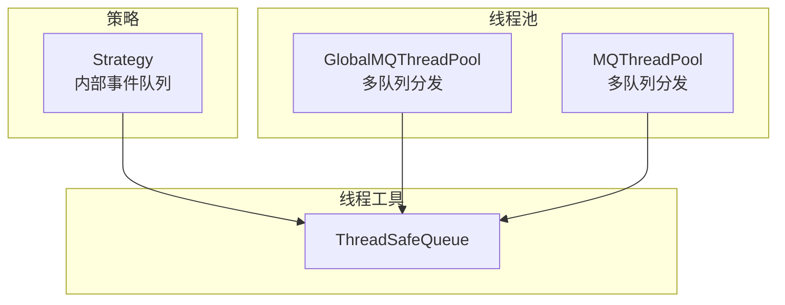
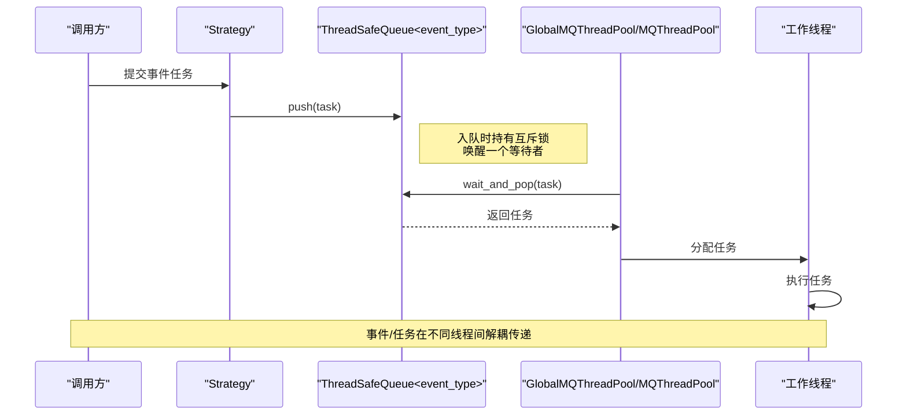
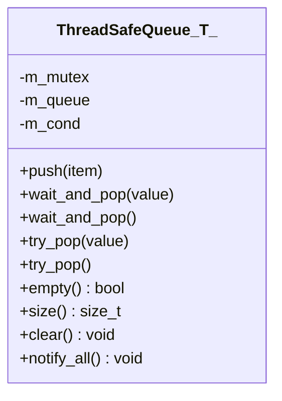
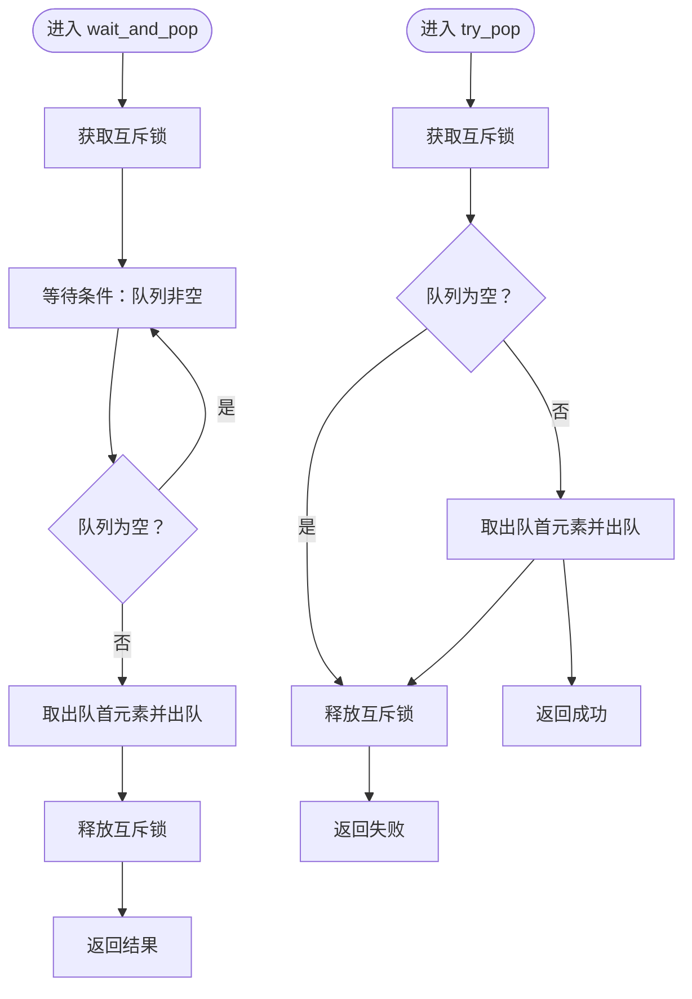
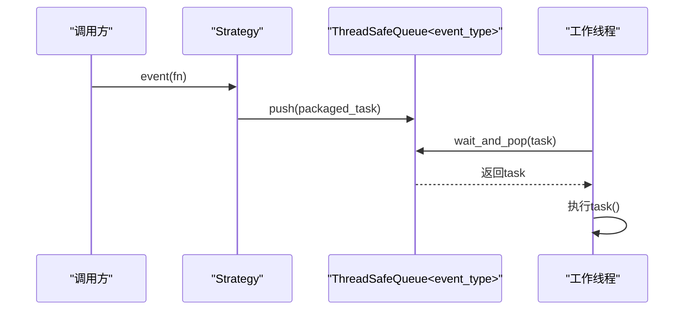
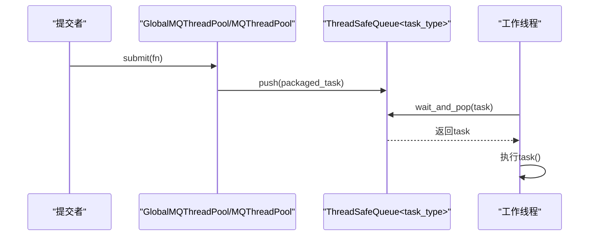
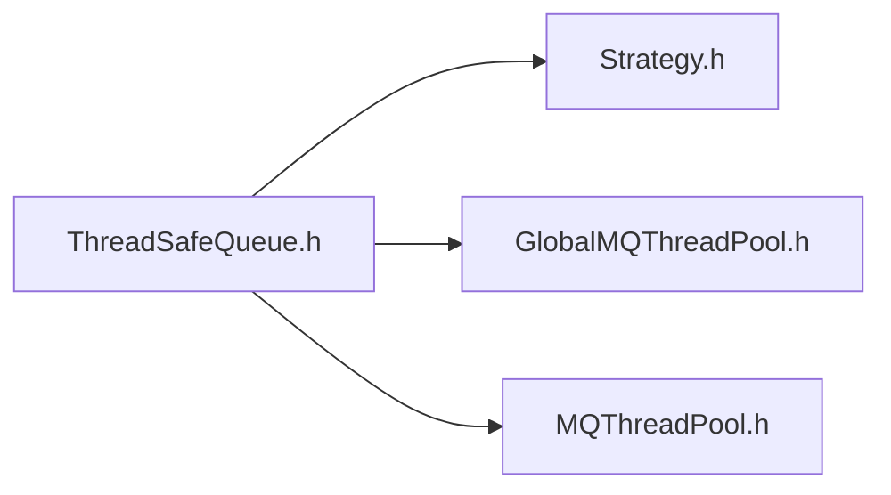

# ThreadSafeQueue 实现机制

<cite>
**本文引用的文件列表**
- [ThreadSafeQueue.h](file://hikyuu_cpp/hikyuu/utilities/thread/ThreadSafeQueue.h)
- [GlobalMQThreadPool.h](file://hikyuu_cpp/hikyuu/utilities/thread/GlobalMQThreadPool.h)
- [MQThreadPool.h](file://hikyuu_cpp/hikyuu/utilities/thread/MQThreadPool.h)
- [Strategy.h](file://hikyuu_cpp/hikyuu/strategy/Strategy.h)
</cite>

## 目录
1. [引言](#引言)
2. [项目结构](#项目结构)
3. [核心组件](#核心组件)
4. [架构总览](#架构总览)
5. [详细组件分析](#详细组件分析)
6. [依赖关系分析](#依赖关系分析)
7. [性能考量](#性能考量)
8. [故障排查指南](#故障排查指南)
9. [结论](#结论)
10. [附录](#附录)

## 引言
本文件围绕 ThreadSafeQueue 的实现进行深入解析，重点说明其基于互斥量（mutex）与条件变量（condition_variable）的有锁设计，以及在高频数据传递场景下的线程安全保证、互斥与条件变量协同工作机制，并结合实际使用场景（如策略事件队列、多线程任务分发）给出应用模式与性能边界建议。

## 项目结构
ThreadSafeQueue 位于通用线程工具模块中，作为模板类提供跨组件复用；其典型使用者包括：
- 策略模块：通过策略内部的消息队列承载事件投递与异步处理
- 线程池模块：作为多工作线程的任务队列容器，支撑任务分发与消费

图表来源
- [ThreadSafeQueue.h](file://hikyuu_cpp/hikyuu/utilities/thread/ThreadSafeQueue.h#L1-L106)
- [Strategy.h](file://hikyuu_cpp/hikyuu/strategy/Strategy.h#L210-L239)
- [GlobalMQThreadPool.h](file://hikyuu_cpp/hikyuu/utilities/thread/GlobalMQThreadPool.h#L48-L133)
- [MQThreadPool.h](file://hikyuu_cpp/hikyuu/utilities/thread/MQThreadPool.h#L49-L94)

章节来源
- [ThreadSafeQueue.h](file://hikyuu_cpp/hikyuu/utilities/thread/ThreadSafeQueue.h#L1-L106)
- [Strategy.h](file://hikyuu_cpp/hikyuu/strategy/Strategy.h#L210-L239)
- [GlobalMQThreadPool.h](file://hikyuu_cpp/hikyuu/utilities/thread/GlobalMQThreadPool.h#L48-L133)
- [MQThreadPool.h](file://hikyuu_cpp/hikyuu/utilities/thread/MQThreadPool.h#L49-L94)

## 核心组件
- ThreadSafeQueue 模板类：提供线程安全的入队（push）、等待式出队（wait_and_pop）、非阻塞出队（try_pop）、空判断（empty）、大小查询（size）、清空（clear）与广播通知（notify_all）等接口。内部以互斥量保护队列，配合条件变量实现等待式出队。
- 使用方：
  - 策略模块：Strategy 内部维护一个事件队列，用于接收外部提交的事件任务并异步执行。
  - 线程池模块：GlobalMQThreadPool/MQThreadPool 为每个工作线程分配独立的 ThreadSafeQueue，实现任务的多队列分发与消费。

章节来源
- [ThreadSafeQueue.h](file://hikyuu_cpp/hikyuu/utilities/thread/ThreadSafeQueue.h#L23-L101)
- [Strategy.h](file://hikyuu_cpp/hikyuu/strategy/Strategy.h#L210-L239)
- [GlobalMQThreadPool.h](file://hikyuu_cpp/hikyuu/utilities/thread/GlobalMQThreadPool.h#L48-L133)
- [MQThreadPool.h](file://hikyuu_cpp/hikyuu/utilities/thread/MQThreadPool.h#L49-L94)

## 架构总览
下图展示了策略事件与线程池任务两种典型使用路径中，ThreadSafeQueue 的角色与交互。

图表来源
- [Strategy.h](file://hikyuu_cpp/hikyuu/strategy/Strategy.h#L224-L232)
- [ThreadSafeQueue.h](file://hikyuu_cpp/hikyuu/utilities/thread/ThreadSafeQueue.h#L30-L51)
- [GlobalMQThreadPool.h](file://hikyuu_cpp/hikyuu/utilities/thread/GlobalMQThreadPool.h#L246-L265)
- [MQThreadPool.h](file://hikyuu_cpp/hikyuu/utilities/thread/MQThreadPool.h#L49-L94)

## 详细组件分析

### 类结构与成员
ThreadSafeQueue 是一个模板类，包含以下关键成员：
- 成员变量：互斥量、底层容器（queue/deque 可选变体）、条件变量
- 公共接口：
  - push：入队并通知一个等待者
  - wait_and_pop：等待队列非空后出队
  - try_pop：非阻塞出队
  - empty/size/clear/notify_all：状态查询与控制

图表来源
- [ThreadSafeQueue.h](file://hikyuu_cpp/hikyuu/utilities/thread/ThreadSafeQueue.h#L23-L101)

章节来源
- [ThreadSafeQueue.h](file://hikyuu_cpp/hikyuu/utilities/thread/ThreadSafeQueue.h#L23-L101)

### 入队（push）与出队（pop）的线程安全机制
- 入队（push）：使用独占锁保护队列入队操作，并在入队后调用条件变量通知一个等待者，避免消费者被错误唤醒。
- 出队（wait_and_pop）：使用独占锁与谓词等待（lambda 条件），确保只有当队列非空时才返回；返回前执行出队，保证原子性。
- 出队（try_pop）：使用独占锁检查队列是否为空，非空则出队并返回成功；否则直接返回失败，避免阻塞。
- empty/size/clear：对队列状态进行查询与清理，其中 size 为非原子查询，需谨慎使用。

图表来源
- [ThreadSafeQueue.h](file://hikyuu_cpp/hikyuu/utilities/thread/ThreadSafeQueue.h#L36-L73)

章节来源
- [ThreadSafeQueue.h](file://hikyuu_cpp/hikyuu/utilities/thread/ThreadSafeQueue.h#L30-L73)

### 互斥量与条件变量协同工作机制
- 互斥量（mutex）：保护队列的并发访问，确保 push/try_pop/empty/clear 等操作的原子性。
- 条件变量（condition_variable）：与谓词配合，实现“等待队列非空”的语义；push 后通知一个等待者，避免虚假唤醒导致的忙等。
- 锁的粒度：wait_and_pop 使用 unique_lock，try_pop 使用 lock_guard，分别满足“可等待”和“快速路径”的需求。

章节来源
- [ThreadSafeQueue.h](file://hikyuu_cpp/hikyuu/utilities/thread/ThreadSafeQueue.h#L30-L73)

### 在策略事件队列中的应用
- 策略内部维护一个事件队列，用于接收外部提交的事件任务并异步执行。
- 提交事件时，通过 push 将任务放入队列；工作线程通过 wait_and_pop 取出并执行。

图表来源
- [Strategy.h](file://hikyuu_cpp/hikyuu/strategy/Strategy.h#L224-L232)
- [ThreadSafeQueue.h](file://hikyuu_cpp/hikyuu/utilities/thread/ThreadSafeQueue.h#L30-L51)

章节来源
- [Strategy.h](file://hikyuu_cpp/hikyuu/strategy/Strategy.h#L210-L239)

### 在多线程任务分发中的应用
- 线程池为每个工作线程创建独立的 ThreadSafeQueue，任务提交时选择空队列或负载最小的队列进行入队，降低热点竞争。
- 工作线程循环从本地队列 wait_and_pop 取任务执行；线程池在停止/结束时向队列推送结束标记任务，确保线程有序退出。

图表来源
- [GlobalMQThreadPool.h](file://hikyuu_cpp/hikyuu/utilities/thread/GlobalMQThreadPool.h#L105-L133)
- [MQThreadPool.h](file://hikyuu_cpp/hikyuu/utilities/thread/MQThreadPool.h#L49-L94)
- [ThreadSafeQueue.h](file://hikyuu_cpp/hikyuu/utilities/thread/ThreadSafeQueue.h#L30-L51)

章节来源
- [GlobalMQThreadPool.h](file://hikyuu_cpp/hikyuu/utilities/thread/GlobalMQThreadPool.h#L48-L133)
- [MQThreadPool.h](file://hikyuu_cpp/hikyuu/utilities/thread/MQThreadPool.h#L49-L94)

## 依赖关系分析
- 组件耦合：
  - ThreadSafeQueue 与使用者之间为弱耦合：模板参数 T 决定存储类型，使用者仅依赖接口。
  - 线程池与策略模块均依赖 ThreadSafeQueue，但彼此不直接耦合，形成清晰的分层。
- 外部依赖：
  - 标准库互斥与条件变量，保证跨平台一致性。
- 循环依赖：
  - 未发现循环依赖迹象；各模块通过头文件包含关系保持单向依赖。

图表来源
- [ThreadSafeQueue.h](file://hikyuu_cpp/hikyuu/utilities/thread/ThreadSafeQueue.h#L1-L106)
- [Strategy.h](file://hikyuu_cpp/hikyuu/strategy/Strategy.h#L210-L239)
- [GlobalMQThreadPool.h](file://hikyuu_cpp/hikyuu/utilities/thread/GlobalMQThreadPool.h#L48-L133)
- [MQThreadPool.h](file://hikyuu_cpp/hikyuu/utilities/thread/MQThreadPool.h#L49-L94)

章节来源
- [ThreadSafeQueue.h](file://hikyuu_cpp/hikyuu/utilities/thread/ThreadSafeQueue.h#L1-L106)
- [Strategy.h](file://hikyuu_cpp/hikyuu/strategy/Strategy.h#L210-L239)
- [GlobalMQThreadPool.h](file://hikyuu_cpp/hikyuu/utilities/thread/GlobalMQThreadPool.h#L48-L133)
- [MQThreadPool.h](file://hikyuu_cpp/hikyuu/utilities/thread/MQThreadPool.h#L49-L94)

## 性能考量
- 设计选择：采用互斥量与条件变量的有锁实现，简化了复杂度，避免了无锁算法的ABA、内存序、缓存行伪共享等问题，适合通用场景与高可靠性要求。
- 竞争热点：
  - 线程池场景下，通过多队列（每个工作线程一个队列）降低竞争；提交侧选择空队列或最小队列，减少锁竞争。
  - 策略事件队列通常由单一生产者/消费者主导，锁竞争相对可控。
- 等待式出队：
  - wait_and_pop 使用谓词等待，避免忙等；notify_one 仅唤醒一个等待者，减少不必要的唤醒开销。
- size 查询：
  - size 为非原子查询，不加锁返回底层容器大小，可能在并发环境下产生瞬时不一致，应谨慎使用；线程池中用于统计剩余任务数时会遍历多个队列，注意调用频率。
- 适用边界：
  - 低延迟、强一致性的场景优先考虑 ThreadSafeQueue。
  - 对极致吞吐且可接受复杂度的场景，可评估无锁队列替代方案（本仓库未提供无锁实现，此处为概念性建议）。

[本节为通用性能讨论，无需列出具体文件来源]

## 故障排查指南
- 症状：消费者长时间阻塞无法出队
  - 排查点：确认是否有生产者持续 push；检查 wait_and_pop 是否正确使用谓词等待；确认 notify_one 是否在 push 后调用。
  - 参考位置：[ThreadSafeQueue.h](file://hikyuu_cpp/hikyuu/utilities/thread/ThreadSafeQueue.h#L30-L51)
- 症状：try_pop 始终失败
  - 排查点：确认队列是否为空；检查调用时机与线程上下文；size 查询可能返回过时值。
  - 参考位置：[ThreadSafeQueue.h](file://hikyuu_cpp/hikyuu/utilities/thread/ThreadSafeQueue.h#L54-L73)
- 症状：线程池无法正常停止
  - 排查点：确认停止流程是否向各队列推送结束标记任务；检查线程本地队列指针设置与 run_pending_task 循环逻辑。
  - 参考位置：[GlobalMQThreadPool.h](file://hikyuu_cpp/hikyuu/utilities/thread/GlobalMQThreadPool.h#L147-L171), [GlobalMQThreadPool.h](file://hikyuu_cpp/hikyuu/utilities/thread/GlobalMQThreadPool.h#L246-L265)
- 症状：策略事件未被执行
  - 排查点：确认 event 提交流程是否调用 push；确认工作线程是否在循环中调用 wait_and_pop。
  - 参考位置：[Strategy.h](file://hikyuu_cpp/hikyuu/strategy/Strategy.h#L224-L232), [ThreadSafeQueue.h](file://hikyuu_cpp/hikyuu/utilities/thread/ThreadSafeQueue.h#L36-L51)

章节来源
- [ThreadSafeQueue.h](file://hikyuu_cpp/hikyuu/utilities/thread/ThreadSafeQueue.h#L30-L73)
- [GlobalMQThreadPool.h](file://hikyuu_cpp/hikyuu/utilities/thread/GlobalMQThreadPool.h#L147-L171)
- [GlobalMQThreadPool.h](file://hikyuu_cpp/hikyuu/utilities/thread/GlobalMQThreadPool.h#L246-L265)
- [Strategy.h](file://hikyuu_cpp/hikyuu/strategy/Strategy.h#L224-L232)

## 结论
ThreadSafeQueue 采用互斥量与条件变量的有锁设计，通过独占锁保护入队/出队与状态查询，配合谓词等待与单个通知，实现了简洁可靠的线程安全队列。在线程池与策略事件队列中，它承担了任务与事件的解耦传递职责，适用于高频数据传递与核心路径（如行情分发、任务调度）。对于追求极致吞吐的极端场景，可另行评估无锁队列方案，但当前实现已能满足大多数工程需求。

[本节为总结性内容，无需列出具体文件来源]

## 附录
- 关键接口路径参考：
  - 入队与等待式出队：[ThreadSafeQueue.h](file://hikyuu_cpp/hikyuu/utilities/thread/ThreadSafeQueue.h#L30-L51)
  - 非阻塞出队：[ThreadSafeQueue.h](file://hikyuu_cpp/hikyuu/utilities/thread/ThreadSafeQueue.h#L54-L73)
  - 策略事件提交：[Strategy.h](file://hikyuu_cpp/hikyuu/strategy/Strategy.h#L224-L232)
  - 线程池任务提交与停止：[GlobalMQThreadPool.h](file://hikyuu_cpp/hikyuu/utilities/thread/GlobalMQThreadPool.h#L105-L171)

[本节为补充信息，无需列出具体文件来源]